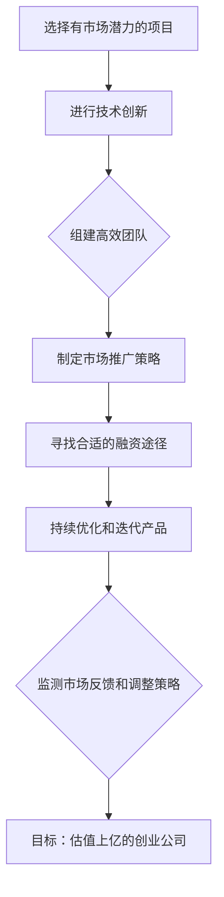

                 

关键词：Side Project，创业，估值，技术，策略，市场，产品开发，增长

摘要：本文旨在探讨如何将个人的Side Project转化为一家估值上亿的创业公司。通过分析成功的案例，我们将从市场需求、产品定位、技术创新、市场推广、团队建设和融资策略等多个方面，提供具体的实施步骤和建议。

## 1. 背景介绍

Side Project，又称“业余项目”，是个人或小团队在业余时间发起的技术创新项目。这些项目往往源于个人的兴趣、对现有市场的洞察或对某个问题的解决方案。许多知名的科技巨头，如Facebook、Dropbox和Github，最初都是作为个人的Side Project开始的。这些项目在逐渐发展壮大后，成功转化为估值上亿的创业公司，成为业界传奇。

然而，将Side Project转化为成功的创业公司并非易事。除了需要持续的技术创新和优秀的执行力外，还需要对市场、用户、融资等环节有深刻的理解和有效的策略。本文将围绕这些方面，提供一些建议和实例，帮助有志于将Side Project推向商业成功的创业者。

### 1.1 市场潜力

选择一个有市场潜力的Side Project至关重要。这要求创业者对当前的市场趋势有敏锐的洞察力，能够发现未被满足的需求或痛点。例如，在社交媒体兴起之前，Facebook的创始人马克·扎克伯格（Mark Zuckerberg）就预见到了这一需求，并将它转化为自己的Side Project。Dropbox的创始人Dropbox的创始人阿奇·阿罗拉（Arash Ferdowsi）和德鲁·豪斯（Drew Houston）则看到了云计算带来的存储需求，从而创建了这一产品。

### 1.2 技术创新

技术创新是Side Project成功转化为创业公司的关键因素之一。这不仅包括技术上的突破，还涉及产品设计的创新。例如，Uber利用移动应用和实时定位技术，颠覆了传统出租车行业；Airbnb则通过共享经济模式，改变了人们的住宿观念。

### 1.3 团队协作

一个成功的创业公司离不开一支高效的团队。团队成员需要具备互补的技能，共同面对挑战。同时，良好的沟通和协作能力也是团队成功的关键。例如，Dropbox的创始人阿罗拉和豪斯就是一对技术背景深厚、互相信任的合作伙伴，他们共同带领公司走向成功。

### 1.4 融资策略

成功的融资策略可以帮助创业公司在初期就获得足够的资金支持，从而加速发展。创业者需要了解不同的融资方式，包括天使投资、风险投资、众筹等，并选择最适合自己的融资途径。例如，Uber在其发展过程中，通过多次成功的融资，获得了巨额资金支持，从而迅速占领市场。

## 2. 核心概念与联系

以下是一个简单的Mermaid流程图，展示将Side Project转化为估值上亿的创业公司的核心步骤：



### 2.1 选择有市场潜力的项目

选择一个有市场潜力的项目是成功的第一步。这需要创业者对市场趋势有敏锐的洞察力，能够发现未被满足的需求或痛点。例如，在社交媒体兴起之前，Facebook的创始人马克·扎克伯格（Mark Zuckerberg）就预见到了这一需求，并将它转化为自己的Side Project。

### 2.2 进行技术创新

技术创新是Side Project成功转化为创业公司的关键因素之一。这不仅包括技术上的突破，还涉及产品设计的创新。例如，Uber利用移动应用和实时定位技术，颠覆了传统出租车行业；Airbnb则通过共享经济模式，改变了人们的住宿观念。

### 2.3 组建高效团队

一个成功的创业公司离不开一支高效的团队。团队成员需要具备互补的技能，共同面对挑战。同时，良好的沟通和协作能力也是团队成功的关键。例如，Dropbox的创始人阿奇·阿罗拉（Arash Ferdowsi）和德鲁·豪斯（Drew Houston）就是一对技术背景深厚、互相信任的合作伙伴，他们共同带领公司走向成功。

### 2.4 制定市场推广策略

制定有效的市场推广策略可以帮助创业公司在初期就获得足够的用户和市场份额。这包括在线营销、社交媒体推广、合作伙伴关系建立等多种方式。例如，Airbnb通过社交媒体和口碑营销，迅速吸引了大量的用户。

### 2.5 寻找合适的融资途径

成功的融资策略可以帮助创业公司在初期就获得足够的资金支持，从而加速发展。创业者需要了解不同的融资方式，包括天使投资、风险投资、众筹等，并选择最适合自己的融资途径。例如，Uber在其发展过程中，通过多次成功的融资，获得了巨额资金支持，从而迅速占领市场。

### 2.6 持续优化和迭代产品

持续优化和迭代产品是创业公司成功的关键。这需要创业者对用户反馈保持高度敏感，并根据反馈进行产品改进。例如，Dropbox通过不断收集用户反馈，改进了产品的用户体验，从而在竞争激烈的市场中脱颖而出。

### 2.7 监测市场反馈和调整策略

监测市场反馈和调整策略是创业公司持续发展的关键。这可以帮助创业公司及时发现问题并作出调整，从而保持市场竞争力。例如，Uber通过实时监测用户满意度，调整了其服务策略，从而提高了用户忠诚度。

## 3. 核心算法原理 & 具体操作步骤

### 3.1 算法原理概述

将Side Project转化为估值上亿的创业公司的核心算法可以看作是一个综合性的策略框架，包括以下几个方面：

1. **市场研究**：使用数据分析和技术分析工具，对市场趋势、用户需求、竞争对手等进行深入分析。
2. **产品定位**：基于市场研究，确定产品的核心功能和价值主张，确保产品能够满足市场需求。
3. **技术创新**：在产品设计和开发过程中，不断引入新技术和创新方法，提升产品的竞争力。
4. **用户增长**：通过有效的市场推广和用户运营策略，实现用户数量的快速增长。
5. **融资策略**：根据公司发展阶段，选择合适的融资途径，确保公司有足够的资金支持。
6. **团队管理**：建立高效的团队协作机制，确保团队能够高效地执行战略计划。

### 3.2 算法步骤详解

#### 3.2.1 市场研究

**数据收集**：
- 使用问卷调查、用户访谈、在线调研等方式，收集用户需求和反馈。
- 利用社交媒体分析工具，监控市场趋势和竞争对手动态。

**数据分析**：
- 使用数据分析工具（如Excel、Python、R等），对收集到的数据进行分析。
- 利用数据可视化工具（如Tableau、Google Data Studio等），将分析结果以图表形式展示。

#### 3.2.2 产品定位

**市场细分**：
- 根据数据分析结果，确定目标市场细分领域。
- 确定目标用户群体，分析其需求和偏好。

**价值主张**：
- 基于市场细分和用户需求，明确产品的核心功能和价值主张。
- 确保产品能够满足目标用户的核心需求。

#### 3.2.3 技术创新

**技术选型**：
- 根据产品定位，选择合适的技术栈和开发工具。
- 引入新技术和创新方法，提升产品的技术竞争力。

**产品设计**：
- 使用用户画像，进行用户行为分析和产品设计。
- 通过原型设计和用户测试，不断优化产品界面和用户体验。

#### 3.2.4 用户增长

**市场推广**：
- 制定有效的市场推广策略，包括在线营销、社交媒体推广、合作伙伴关系等。
- 利用数据分析，监测市场推广效果，并进行策略调整。

**用户运营**：
- 通过用户社区、用户反馈等方式，建立与用户的良好互动。
- 利用数据分析，识别高价值用户群体，进行精准运营。

#### 3.2.5 融资策略

**融资途径选择**：
- 了解不同的融资途径，包括天使投资、风险投资、众筹等。
- 根据公司发展阶段和资金需求，选择最合适的融资途径。

**融资谈判**：
- 准备详细的商业计划和财务预测，为融资谈判提供有力支持。
- 与潜在投资者建立良好的沟通，展示公司的发展前景和潜力。

#### 3.2.6 团队管理

**团队建设**：
- 确定团队的核心成员和职责，确保团队成员具备互补的技能。
- 建立有效的沟通和协作机制，提升团队执行力。

**人才引进**：
- 根据公司发展阶段，及时引进所需的人才。
- 注重人才培养和激励，提升团队的整体能力。

### 3.3 算法优缺点

#### 优点

- **综合性强**：该算法涵盖了从市场研究到团队管理的多个方面，能够全面地指导创业公司的发展。
- **灵活适应**：创业者可以根据自身情况和市场环境，灵活调整算法中的各个步骤，以实现最佳效果。
- **强调用户需求**：算法强调以用户需求为导向，确保产品能够满足市场需求。

#### 缺点

- **实施难度较大**：该算法需要创业者具备多方面的知识和技能，实施过程中可能面临较大的挑战。
- **时间成本较高**：从市场研究到产品迭代，整个算法的实施过程需要较长的时间，对创业者的耐心和毅力有较高要求。

### 3.4 算法应用领域

该算法主要适用于技术驱动型创业公司，尤其是那些在技术领域具有创新潜力的项目。以下是一些典型的应用领域：

- **互联网应用**：如社交媒体、电子商务、在线教育等。
- **物联网应用**：如智能家居、智能穿戴设备等。
- **人工智能应用**：如自动驾驶、语音识别等。
- **区块链应用**：如数字货币、供应链管理等。

## 4. 数学模型和公式 & 详细讲解 & 举例说明

### 4.1 数学模型构建

在将Side Project转化为估值上亿的创业公司过程中，构建一个数学模型可以帮助我们更清晰地理解和预测公司的成长轨迹。以下是一个简化的数学模型：

\[ \text{公司估值} = \text{用户基数} \times \text{用户留存率} \times \text{收入/用户} \]

其中：

- **用户基数**：公司当前的用户数量。
- **用户留存率**：用户在一段时间后仍然活跃的比例。
- **收入/用户**：每个用户的平均收入。

### 4.2 公式推导过程

**用户基数**：公司用户数量的增长可以通过以下公式表示：

\[ \text{用户基数} = \text{初始用户数} + \text{新增用户数} - \text{流失用户数} \]

其中，**新增用户数**可以通过市场推广策略和用户增长模型来预测；**流失用户数**可以通过用户留存模型来计算。

**用户留存率**：用户留存率可以通过以下公式表示：

\[ \text{用户留存率} = \frac{\text{留存用户数}}{\text{初始用户数}} \]

**收入/用户**：每个用户的平均收入可以通过以下公式表示：

\[ \text{收入/用户} = \frac{\text{总营收}}{\text{用户基数}} \]

### 4.3 案例分析与讲解

以一个假设的创业公司为例，该公司开发了一款社交应用，初始用户数为1000人，预计每月新增用户数为100人，每月流失用户数为20人。假设公司的平均收入为每人每月5美元，用户留存率为80%。

**第一步**：计算用户基数：

\[ \text{用户基数} = 1000 + 100 - 20 = 1080 \]

**第二步**：计算用户留存率：

\[ \text{用户留存率} = \frac{1080}{1000} = 0.8 \]

**第三步**：计算收入/用户：

\[ \text{收入/用户} = \frac{5 \times 1080}{1080} = 5 \]

**第四步**：计算公司估值：

\[ \text{公司估值} = 1080 \times 0.8 \times 5 = 4320 \text{美元} \]

这个模型虽然简化，但可以提供一个基本的估算。在实际应用中，需要根据具体情况调整各个参数，并考虑其他因素，如市场环境、竞争状况、宏观经济因素等。

### 4.4 案例分析与讲解

让我们通过一个具体的案例，更深入地理解上述数学模型的应用。

**案例背景**：假设A公司是一家开发基于区块链的加密货币交易平台的创业公司。公司成立初期，拥有100名用户，每月新增用户数为50人，每月流失用户数为10人。公司提供的高端交易服务，每位用户每月支付的费用为10美元。

**第一步**：计算初始用户基数：

\[ \text{用户基数} = 100 \]

**第二步**：计算用户留存率：

假设A公司采用了多种措施来提高用户留存率，如优化用户体验、提供额外服务、用户教育等，使得每月流失用户数降低至5人。

\[ \text{用户留存率} = \frac{100 - 5}{100} = 0.95 \]

**第三步**：计算每月收入：

\[ \text{每月收入} = 150 \text{（用户数）} \times 10 \text{（收入/用户）} = 1500 \text{美元} \]

**第四步**：计算公司估值：

根据模型，公司估值与用户基数、用户留存率和收入/用户成正比。假设行业平均估值为每月收入的20倍。

\[ \text{公司估值} = 1500 \text{美元/月} \times 20 = 30000 \text{美元/月} \]

如果按年计算，则公司估值为：

\[ \text{年公司估值} = 30000 \text{美元/月} \times 12 \text{月} = 360000 \text{美元/年} \]

这个案例展示了如何使用数学模型来估算一家创业公司的潜在估值。在实际操作中，还需要考虑更多因素，如市场增长率、竞争状况、行业趋势等，以获得更准确的结果。

### 4.5 数学模型在实际应用中的扩展

在将数学模型应用于实际创业场景时，我们通常需要考虑以下扩展：

1. **用户增长模型**：
   用户增长模型可以帮助预测在特定市场推广策略下，用户基数的变化情况。该模型可以考虑以下因素：
   - **市场潜力**：潜在用户数量。
   - **竞争状况**：竞争对手的用户基数和市场占有率。
   - **营销策略**：推广活动的效果，包括广告投放、社交媒体活动、公关等。

2. **用户留存模型**：
   用户留存模型可以预测在不同服务水平、用户互动方式和客户支持质量下，用户留存率的变化。该模型可以考虑以下因素：
   - **用户体验**：界面设计、响应速度、稳定性等。
   - **服务质量**：客户支持响应时间、问题解决效率等。
   - **产品迭代**：定期更新功能、修复漏洞等。

3. **收入模型**：
   收入模型可以预测在不同定价策略、产品组合和销售渠道下，收入的变化情况。该模型可以考虑以下因素：
   - **定价策略**：固定价格、动态定价、套餐等。
   - **产品组合**：基础产品、增值服务、捆绑销售等。
   - **销售渠道**：线上、线下、合作伙伴销售等。

通过这些扩展模型，创业者可以更全面地评估公司的增长潜力和市场表现，为决策提供依据。

## 5. 项目实践：代码实例和详细解释说明

### 5.1 开发环境搭建

在将Side Project转化为创业公司的过程中，开发环境的搭建是至关重要的第一步。以下是一个简化的步骤，展示如何在本地环境中搭建一个基于Python的Web应用开发环境。

**步骤 1**：安装Python

首先，确保你的计算机上安装了Python。可以访问[Python官方网站](https://www.python.org/)下载最新版本的Python，并按照安装向导进行安装。

**步骤 2**：安装虚拟环境

为了保持项目环境的独立性，使用`virtualenv`工具来创建一个虚拟环境。

```bash
pip install virtualenv
virtualenv my_project_env
```

**步骤 3**：激活虚拟环境

在命令行中激活虚拟环境：

```bash
source my_project_env/bin/activate
```

**步骤 4**：安装依赖

进入项目目录，并安装项目所需的依赖。例如，如果项目依赖`Flask`框架，可以使用以下命令：

```bash
pip install flask
```

### 5.2 源代码详细实现

以下是一个简单的基于Flask框架的Web应用代码示例。该应用将提供一个简单的用户注册和登录功能。

**步骤 1**：创建应用目录和文件

在虚拟环境中，创建一个名为`my_app`的应用目录，并在其中创建以下文件：

- `app.py`：主应用文件。
- `templates/`：HTML模板文件。
- `static/`：静态文件（如CSS、JavaScript等）。

**步骤 2**：编写主应用代码（`app.py`）

```python
from flask import Flask, render_template, request, redirect, url_for, session

app = Flask(__name__)
app.secret_key = 'my_secret_key'  # 用于加密会话数据

@app.route('/')
def index():
    return render_template('index.html')

@app.route('/register', methods=['GET', 'POST'])
def register():
    if request.method == 'POST':
        username = request.form['username']
        password = request.form['password']
        # 这里应添加用户注册的逻辑，如检查用户名是否已存在等
        session['username'] = username
        return redirect(url_for('dashboard'))
    return render_template('register.html')

@app.route('/login', methods=['GET', 'POST'])
def login():
    if request.method == 'POST':
        username = request.form['username']
        password = request.form['password']
        # 这里应添加用户登录的逻辑，如验证用户名和密码是否正确等
        session['username'] = username
        return redirect(url_for('dashboard'))
    return render_template('login.html')

@app.route('/dashboard')
def dashboard():
    if 'username' not in session:
        return redirect(url_for('login'))
    return render_template('dashboard.html')

if __name__ == '__main__':
    app.run(debug=True)
```

**步骤 3**：创建HTML模板

在`templates`目录下，创建以下HTML文件：

- `index.html`
- `register.html`
- `login.html`
- `dashboard.html`

以下是一个简单的`register.html`示例：

```html
<!DOCTYPE html>
<html>
<head>
    <title>注册</title>
</head>
<body>
    <h1>注册</h1>
    <form method="post" action="{{ url_for('register') }}">
        用户名：<input type="text" name="username"><br>
        密码：<input type="password" name="password"><br>
        <input type="submit" value="注册">
    </form>
</body>
</html>
```

### 5.3 代码解读与分析

**`app.py`文件解读**：

- **路由定义**：使用`@app.route()`装饰器定义了不同的URL路由和处理函数。例如，`index()`函数处理根路径（`/`）的请求，`register()`函数处理注册页面的请求等。

- **表单处理**：在`register()`和`login()`函数中，使用`request.form`对象获取表单数据。在处理表单提交时，可以添加额外的逻辑，如用户名和密码验证等。

- **会话管理**：使用`session['username']`来保存用户登录状态。在`dashboard()`函数中，通过检查会话变量`'username'`的存在性来保护路由。

**HTML模板解读**：

- **表单标签**：在`register.html`中，使用`<form>`标签创建了一个表单，并通过`method="post"`属性指定了表单提交方法。

- **表单输入**：使用`<input>`标签创建文本输入框和密码输入框，并通过`name`属性为每个输入字段命名。

- **模板渲染**：在Python代码中，使用`render_template()`函数将HTML模板文件渲染为完整的HTML页面，并传递必要的变量（如URL路径）。

### 5.4 运行结果展示

**启动应用**：

在终端中，激活虚拟环境并运行以下命令启动应用：

```bash
python app.py
```

**访问应用**：

打开浏览器，输入`http://127.0.0.1:5000/`，将看到应用的首页。点击“注册”或“登录”按钮，可以分别访问注册页面和登录页面。

注册和登录页面分别如下：

**注册页面**：

```html
<!DOCTYPE html>
<html>
<head>
    <title>注册</title>
</head>
<body>
    <h1>注册</h1>
    <form method="post" action="{{ url_for('register') }}">
        用户名：<input type="text" name="username"><br>
        密码：<input type="password" name="password"><br>
        <input type="submit" value="注册">
    </form>
</body>
</html>
```

**登录页面**：

```html
<!DOCTYPE html>
<html>
<head>
    <title>登录</title>
</head>
<body>
    <h1>登录</h1>
    <form method="post" action="{{ url_for('login') }}">
        用户名：<input type="text" name="username"><br>
        密码：<input type="password" name="password"><br>
        <input type="submit" value="登录">
    </form>
</body>
</html>
```

注册或登录成功后，将重定向到仪表板页面：

```html
<!DOCTYPE html>
<html>
<head>
    <title>仪表板</title>
</head>
<body>
    <h1>欢迎，{{ session['username'] }}！</h1>
</body>
</html>
```

### 5.5 代码改进建议

虽然这个示例代码已经实现了基本功能，但在实际应用中，还需要进行以下改进：

- **安全性提升**：添加用户注册和登录的逻辑，如密码加密存储、用户名唯一性验证等。
- **用户界面优化**：改进UI设计，提供更好的用户体验。
- **错误处理**：添加错误处理机制，如处理用户输入错误、服务器错误等。
- **扩展功能**：增加更多功能，如用户管理、权限控制等。

通过这些改进，可以进一步提升应用的质量和用户满意度。

## 6. 实际应用场景

### 6.1 教育领域

在教育领域，许多Side Project成功转化为估值上亿的创业公司。例如，Khan Academy是由孟加拉裔美国教育心理学家萨尔曼·可汗（Salman Khan）创建的一个在线教育平台。最初，Khan Academy只是一个YouTube频道，可汗在这里上传了自己为侄女解释数学问题的视频。随着视频的流行，Khan Academy逐渐发展成为一个提供免费在线课程的在线教育平台。如今，Khan Academy已经成为全球知名的在线教育平台，吸引了数百万用户。

### 6.2 医疗健康

在医疗健康领域，远程医疗应用是近年来迅速崛起的Side Project之一。Telemedicine是其中的代表，它通过互联网提供远程医疗服务，包括在线咨询、远程诊断、远程治疗等。Telemedicine的成功在于它解决了医疗资源不均等的问题，使得偏远地区的患者也能够获得高质量的医疗服务。例如，美国公司Teladoc Health，最初是由两个医生共同发起的远程医疗项目，如今已经发展成为一家市值数十亿美元的上市公司。

### 6.3 物流运输

物流运输领域的Side Project也取得了显著成功。OneWeb是其中一个例子，它是一个旨在提供全球高速互联网服务的卫星互联网项目。OneWeb最初是由一群企业家和工程师发起的，他们的目标是使用卫星技术为全球未联网地区提供互联网接入。经过多年的研发和融资，OneWeb最终成功发射了数百颗卫星，为其商业运营奠定了基础。如今，OneWeb已经成为全球卫星互联网领域的重要玩家。

### 6.4 金融科技

金融科技（Fintech）是Side Project成功转化为估值上亿的创业公司的另一个热门领域。Affirm是其中的一个例子，它是一个提供消费者贷款和支付解决方案的金融科技公司。Affirm的创始人从对信用卡市场的洞察中发现了机会，决定创建一个更加透明和灵活的贷款平台。通过先进的算法和数据分析，Affirm能够在几分钟内为消费者提供贷款，而无需复杂的申请流程。如今，Affirm已经成为金融科技领域的领军企业，估值超过数十亿美元。

### 6.5 人工智能

人工智能（AI）领域也涌现了许多成功的Side Project。OpenAI是一个典型的例子，它是由山姆·阿尔特曼（Sam Altman）和其他几位人工智能专家共同创立的一个非营利性研究组织。OpenAI的使命是通过研究和开发人工智能，促进人类福祉。尽管OpenAI最初只是作为一个Side Project开始，但它逐渐吸引了全球顶尖的AI研究人员，并成功研发出了许多前沿的人工智能技术，如GPT-3等。如今，OpenAI已经成为人工智能领域的领导者之一，其估值也迅速攀升。

### 6.6 社交媒体

社交媒体领域的Side Project成功案例不胜枚举。Snapchat是其中一个典型的例子，它最初是由斯图尔特·波特和波比·默里两位斯坦福大学的学生开发的。Snapchat提供了一个即时分享照片和视频的平台，这些内容会自动在几秒钟后消失。这一创新性的理念吸引了大量年轻用户，使得Snapchat迅速走红。如今，Snapchat已经成为全球知名的社交媒体公司，其估值也达到了数百亿美元。

### 6.7 共享经济

共享经济领域的Side Project同样取得了巨大成功。Uber是一个代表性的例子，它由特拉维斯·卡兰尼克（Travis Kalanick）和加布瑞埃拉·卡姆波班（Garrett Camp）创立。Uber利用移动应用和实时定位技术，颠覆了传统的出租车行业，为用户提供了一个便捷的叫车服务。通过成功的市场推广和融资策略，Uber迅速扩张，成为全球最大的移动出行平台之一。

### 6.8 电子商务

电子商务领域的Side Project也屡见不鲜。Shopify是其中一个成功的例子，它最初是由托比亚斯·艾哈德（Tobias Lütke）和其他几位创业者开发的。Shopify提供了一个简单的在线商店构建平台，使得个人和小型企业能够轻松创建和管理在线商店。通过不断的技术创新和市场拓展，Shopify已经成为全球最大的电子商务平台之一。

### 6.9 可持续能源

可持续能源领域的Side Project也取得了显著成果。SolarCity是其中一个例子，它由埃隆·马斯克（Elon Musk）创立，致力于推广太阳能技术。SolarCity提供从太阳能系统的设计、安装到维护的一站式服务，旨在帮助家庭和企业实现能源自给自足。通过技术创新和市场拓展，SolarCity已经成为全球领先的太阳能服务提供商。

### 6.10 硬件创新

硬件创新领域的Side Project同样不乏成功案例。Fitbit是一个典型的例子，它由詹姆斯·帕克（James Park）和米奇·扎特洛夫（Mike Zatler）创立。Fitbit最初是一款简单的健身追踪设备，它能够记录用户的运动数据并提供健康建议。随着技术的进步和市场需求的增加，Fitbit逐渐发展成为一家全球知名的智能穿戴设备制造商。

### 6.11 游戏娱乐

游戏娱乐领域的Side Project也取得了巨大成功。Supercell是一家芬兰游戏公司，由皮特·帕塔宁（Pekka Rantala）和艾拉·米科莱宁（Ilkka Paananen）共同创立。Supercell开发的几款游戏，如《Clash of Clans》、《Hay Day》和《Brawl Stars》，在市场上取得了巨大的成功，使得Supercell成为全球最大的移动游戏开发商之一。

### 6.12 区块链

区块链领域的Side Project也崭露头角。Ethereum是一个代表性的例子，它由 Vitalik Buterin 和其他几位区块链爱好者共同创立。Ethereum 是一个去中心化的开源区块链平台，它不仅支持数字货币交易，还提供了智能合约功能，使得开发者能够在平台上创建去中心化应用（DApp）。Ethereum 的成功使其成为区块链领域的领军企业。

### 6.13 物联网

物联网（IoT）领域的Side Project同样取得了显著成果。Nest是其中一个例子，它由托尼·法德尔（Tony Fadell）创立。Nest提供了智能温控器和其他智能家居设备，通过物联网技术，用户能够远程控制和监控家中的环境。Nest 的成功使其成为智能家居领域的领导者，并最终被谷歌收购。

### 6.14 智能制造

智能制造领域的Side Project也取得了显著进展。Tesla是一个典型的例子，它由埃隆·马斯克（Elon Musk）创立。Tesla专注于电动汽车和可再生能源产品的研发与制造，通过智能制造技术，提高了生产效率和产品品质。Tesla 的成功使其成为全球知名的电动汽车制造商。

### 6.15 未来展望

未来，随着技术的不断进步和市场需求的不断变化，Side Project转化为估值上亿的创业公司的领域将更加广泛。以下是一些可能的未来应用场景：

- **人工智能与医疗**：利用人工智能技术，提供个性化医疗诊断和治疗方案。
- **物联网与智慧城市**：利用物联网技术，实现智慧城市的建设与管理。
- **区块链与供应链**：利用区块链技术，提高供应链的透明度和效率。
- **虚拟现实与娱乐**：利用虚拟现实技术，提供沉浸式的娱乐体验。
- **生物技术与健康**：利用生物技术，开发个性化医疗解决方案。

总之，随着技术的不断进步和市场需求的不断变化，Side Project转化为估值上亿的创业公司的可能性将越来越大。创业者需要紧跟市场趋势，积极创新，才能抓住这一机遇。

## 7. 工具和资源推荐

### 7.1 学习资源推荐

**在线课程平台**：

- Coursera：提供各种技术领域的在线课程，包括计算机科学、数据科学、人工智能等。
- edX：与顶尖大学合作，提供免费的在线课程，覆盖广泛的学科领域。
- Udemy：提供大量的技术课程，包括编程、数据科学、产品设计等。

**技术博客和论坛**：

- Hacker News：关注技术新闻和创业动态，是了解前沿技术的好去处。
- Stack Overflow：编程问题解答社区，适合编程人员和开发者。
- Medium：许多技术专家和创业者在此分享经验和见解。

**开源社区**：

- GitHub：全球最大的开源代码托管平台，可以找到各种开源项目和代码示例。
- GitLab：与GitHub类似，提供开源项目托管和协作平台。
- Open Source Initiative（OSI）：提供关于开源的定义、资源和认证。

### 7.2 开发工具推荐

**集成开发环境（IDE）**：

- Visual Studio Code：跨平台的开源IDE，支持多种编程语言和开发工具。
- IntelliJ IDEA：强大的Java和Android开发IDE，支持多种编程语言。
- PyCharm：专业的Python开发IDE，提供丰富的功能和工具。

**代码管理工具**：

- Git：版本控制系统的首选，用于管理和跟踪代码变更。
- GitHub：基于Git的代码托管平台，支持开源项目协作和社区互动。
- GitLab：与GitHub类似，提供代码托管和协作功能。

**数据分析工具**：

- Jupyter Notebook：交互式数据分析环境，支持多种编程语言和数据可视化工具。
- Tableau：数据可视化工具，能够快速创建动态报表和图表。
- R：统计计算和图形显示语言，特别适合数据分析和统计建模。

### 7.3 相关论文推荐

**技术论文**：

- "Deep Learning" by Yann LeCun, Yosua Bengio, and Geoffrey Hinton
- "Blockchain: A System for Global Invitations" by Nick Szabo
- "The Internet of Things: A Survey" by Giacomo Sabadini, Davide De Grandis, and Marco Conti

**市场分析**：

- "The Lean Startup" by Eric Ries
- "Crossing the Chasm" by Geoffrey A. Moore
- "The Innovator's Dilemma" by Clayton M. Christensen

这些论文和书籍提供了关于技术、市场和创业的深入见解，有助于创业者更好地理解和应用相关理论。

## 8. 总结：未来发展趋势与挑战

### 8.1 研究成果总结

本文通过分析市场潜力、技术创新、团队协作、市场推广、融资策略和产品优化等多个方面，探讨了如何将Side Project转化为估值上亿的创业公司。以下是一些主要的研究成果：

- 市场研究是成功的关键，创业者需要具备敏锐的市场洞察力，以发现未被满足的需求。
- 技术创新是竞争优势的来源，创业者应不断引入新技术和改进产品设计。
- 高效团队是实现目标的基础，团队成员需要具备互补的技能和良好的沟通协作能力。
- 市场推广和用户增长策略对于早期公司至关重要，需要选择合适的市场推广方式，并持续优化。
- 融资策略是公司发展的重要保障，创业者应了解不同的融资方式，选择最适合公司发展的融资途径。
- 持续优化和迭代产品是保持市场竞争力的关键，需要根据用户反馈进行产品改进。

### 8.2 未来发展趋势

未来，随着技术的不断进步和市场环境的变化，以下趋势值得关注：

- **人工智能与大数据的深度融合**：人工智能将在更多领域得到应用，如医疗健康、金融科技、智慧城市等。大数据技术将为企业提供更深入的洞察和决策支持。
- **区块链技术的广泛应用**：区块链技术将在供应链管理、数字货币、数据隐私等方面得到更广泛的应用，为企业提供更加安全、透明和高效的解决方案。
- **物联网的快速发展**：物联网技术将使更多设备和物品实现互联互通，推动智能家居、智慧城市、智能制造等领域的发展。
- **数字化转型加速**：企业将加速数字化转型，采用云计算、大数据、人工智能等技术，提高生产效率和创新能力。
- **可持续发展与绿色科技**：随着全球环境问题的加剧，可持续发展成为重要议题。绿色科技，如可再生能源、环保材料等，将成为创业领域的新热点。

### 8.3 面临的挑战

在将Side Project转化为估值上亿的创业公司的过程中，创业者将面临以下挑战：

- **技术创新的挑战**：快速变化的市场环境要求创业者不断进行技术创新，但这需要大量的人才和资金投入。
- **市场竞争的挑战**：随着市场逐渐饱和，创业者需要面对激烈的市场竞争，如何保持竞争优势是关键问题。
- **用户增长的挑战**：获取和保持用户是公司发展的核心，但如何实现用户快速增长和用户留存是一个长期挑战。
- **融资挑战**：创业公司在融资过程中可能会遇到资金不足、投资者信心不足等问题，需要创业者具备良好的融资策略和沟通能力。
- **团队管理的挑战**：创业者需要组建和管理一个高效团队，确保团队能够高效地执行战略计划，但同时也需要面对团队内部的沟通和协作问题。

### 8.4 研究展望

未来的研究可以进一步探讨以下几个方面：

- **技术趋势与创业机会**：深入研究人工智能、区块链、物联网等新兴技术，探讨这些技术在创业领域的应用前景和创业机会。
- **创业生态系统建设**：研究如何建立和完善创业生态系统，为创业者提供更好的支持和资源。
- **创业绩效评估**：开发更加科学的创业绩效评估体系，为创业者提供更准确的决策依据。
- **跨学科研究**：结合心理学、社会学、经济学等多学科知识，深入研究创业过程中的复杂问题，为创业者提供更加全面的理论支持。

总之，将Side Project转化为估值上亿的创业公司是一个复杂而充满挑战的过程，需要创业者具备多方面的知识和能力。通过持续创新、市场洞察、团队协作和有效的融资策略，创业者有望实现这一目标。未来的研究将继续探索这一领域，为创业者提供更有价值的指导和参考。

## 9. 附录：常见问题与解答

### 9.1 如何选择有市场潜力的项目？

**答案**：选择有市场潜力的项目需要以下几个步骤：

1. **市场研究**：了解目标市场的规模、增长趋势、用户需求等。可以通过问卷调查、用户访谈、市场报告等方式收集数据。
2. **竞争对手分析**：研究竞争对手的产品、市场份额、优劣势，了解市场的竞争格局。
3. **用户痛点**：识别目标用户面临的问题和痛点，寻找解决方案。
4. **技术创新**：评估项目在技术上的可行性，是否有技术创新点。
5. **资源匹配**：考虑自身的技能、时间和资金等资源，确保能够实现项目目标。

### 9.2 如何进行有效的市场推广？

**答案**：进行有效的市场推广需要以下几个步骤：

1. **目标用户定位**：明确目标用户群体，了解他们的需求和偏好。
2. **内容营销**：通过博客、社交媒体、电子邮件等方式，提供有价值的内容，吸引和留住用户。
3. **社交媒体推广**：选择合适的社交媒体平台，开展宣传活动，增加品牌曝光度。
4. **合作伙伴关系**：与行业内的其他公司、意见领袖、媒体等建立合作关系，扩大影响力。
5. **数据分析**：使用数据分析工具，监测市场推广效果，优化推广策略。

### 9.3 如何选择合适的融资途径？

**答案**：选择合适的融资途径需要考虑以下几个方面：

1. **公司发展阶段**：初创公司、成长期公司和成熟公司适用的融资途径不同。
2. **资金需求**：根据公司的发展计划，确定需要筹集的资金额度。
3. **投资者类型**：天使投资者、风险投资者、战略投资者等有不同的投资偏好和需求。
4. **退出策略**：考虑公司的长期发展目标和可能的退出方式，如IPO、并购等。
5. **融资成本**：评估不同融资途径的成本和风险，选择最合适的融资方式。

### 9.4 如何管理团队？

**答案**：管理团队需要以下几个方面的策略：

1. **明确目标**：确保团队成员了解公司的目标和期望，明确各自的角色和职责。
2. **沟通协作**：建立有效的沟通机制，鼓励团队成员之间的协作和信息共享。
3. **激励与培养**：通过激励措施和培训机会，激发团队成员的积极性和创造力。
4. **反馈与调整**：定期收集团队成员的反馈，根据实际情况调整管理策略。
5. **文化塑造**：建立积极向上的团队文化，增强团队凝聚力和归属感。

通过以上策略，创业者可以有效地管理团队，提高团队执行力，实现公司目标。

