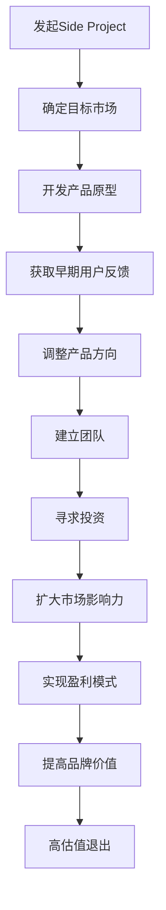

                 

关键词：Side Project、创业公司、估值、转化策略、技术领导力

## 摘要

在当前快速变化的科技环境中，将个人项目（Side Project）转变为高估值创业公司是一个充满机遇和挑战的过程。本文将探讨如何通过精心策划和实施，将Side Project转化为一个成功的创业公司，包括核心概念的阐述、策略的实施、技术领导力的培养以及市场定位等方面。本文旨在为有志于创业的开发者提供实用的指导和建议。

### 1. 背景介绍

在技术快速发展和创新层出不穷的今天，个人项目（通常被称为Side Project）已经成为许多开发者追求激情和创新的重要途径。这些项目不仅可以展示开发者的技术实力，还可以作为创业的起点。然而，并非所有的Side Project都能成功地转化为高估值的创业公司。在这篇文章中，我们将探讨成功转化的关键要素，以及如何通过这些要素来实现这一目标。

### 2. 核心概念与联系

要将Side Project转化为高估值创业公司，首先需要明确几个核心概念，并理解它们之间的联系。

#### 2.1 创业公司的定义

创业公司是指由个人或团队创建，旨在通过创新和创造市场价值来实现商业成功的企业。创业公司的特点包括创新性、灵活性和高风险性。

#### 2.2 Side Project的意义

Side Project不仅是开发者个人技能和兴趣的体现，也是探索新技术和市场机会的实验场。成功的Side Project往往具有以下特点：创新性、用户价值和社会影响。

#### 2.3 估值的概念

估值是衡量企业市场价值的过程。对于创业公司，高估值意味着投资者对企业的未来有较高的预期，同时也反映了市场对项目价值的认可。

#### 2.4 Mermaid 流程图

以下是一个Mermaid流程图，展示了从Side Project到高估值创业公司的转化过程：



### 3. 核心算法原理 & 具体操作步骤

#### 3.1 算法原理概述

将Side Project转化为高估值创业公司的过程，可以看作是一个动态优化的过程，其中涉及多个决策点和反馈循环。以下是一个简化的算法原理概述：

1. **确定目标市场**：基于用户需求和市场竞争分析，确定项目的目标市场。
2. **开发产品原型**：快速构建最小可行性产品（MVP），验证市场需求。
3. **获取早期用户反馈**：通过用户测试和反馈，了解产品的优点和不足。
4. **调整产品方向**：根据用户反馈，对产品进行迭代优化。
5. **建立团队**：招募合适的团队成员，构建具有执行力和创新能力的团队。
6. **寻求投资**：通过融资，获取资金支持，加速企业发展。
7. **扩大市场影响力**：通过市场营销和品牌建设，提高市场知名度和用户基数。
8. **实现盈利模式**：通过产品销售、服务订阅等多种方式，实现持续盈利。
9. **提高品牌价值**：通过优质的产品和服务，建立品牌忠诚度和口碑。
10. **高估值退出**：在合适时机，通过并购或上市等方式，实现高估值退出。

#### 3.2 算法步骤详解

1. **确定目标市场**
   - **需求分析**：通过市场调研和用户访谈，了解目标市场的需求。
   - **竞争分析**：分析竞争对手的产品、市场策略和用户评价。

2. **开发产品原型**
   - **MVP构建**：快速开发具有核心功能的产品原型。
   - **功能迭代**：根据用户反馈，逐步增加产品功能。

3. **获取早期用户反馈**
   - **用户测试**：邀请早期用户参与产品测试。
   - **反馈收集**：通过问卷调查、用户访谈等方式，收集用户反馈。

4. **调整产品方向**
   - **数据分析**：分析用户反馈数据，确定产品优化方向。
   - **迭代优化**：对产品进行持续迭代和优化。

5. **建立团队**
   - **团队成员招募**：根据产品需求和团队结构，招募合适的团队成员。
   - **团队协作**：建立有效的团队协作机制，提高团队执行力。

6. **寻求投资**
   - **商业计划书**：撰写详细的商业计划书。
   - **融资途径**：选择合适的融资途径，如天使投资、风险投资等。

7. **扩大市场影响力**
   - **市场营销**：通过多种营销手段，提高品牌知名度和用户基数。
   - **品牌建设**：建立品牌识别度和品牌文化。

8. **实现盈利模式**
   - **产品销售**：通过产品销售实现盈利。
   - **服务订阅**：提供订阅服务，实现持续收入。

9. **提高品牌价值**
   - **优质服务**：提供优质的产品和服务，建立良好的用户口碑。
   - **品牌推广**：通过线上线下活动，提高品牌影响力。

10. **高估值退出**
    - **并购或上市**：在合适的时机，通过并购或上市实现高估值退出。

#### 3.3 算法优缺点

**优点：**
- **灵活性**：通过快速迭代和反馈，可以及时调整产品方向，降低风险。
- **高效性**：基于数据和用户反馈，可以更高效地优化产品。

**缺点：**
- **资源限制**：在资源有限的情况下，可能无法全面覆盖所有市场和用户。
- **时间成本**：从Side Project到创业公司的转化需要较长时间，需要耐心和持续的努力。

#### 3.4 算法应用领域

该算法原理主要应用于初创公司，尤其是技术驱动型的创业公司。以下是一些具体的领域：

- **互联网产品**：如社交网络、电商平台等。
- **人工智能**：如机器学习应用、智能设备等。
- **区块链**：如去中心化应用、数字货币等。
- **物联网**：如智能家居、智能穿戴设备等。

### 4. 数学模型和公式 & 详细讲解 & 举例说明

#### 4.1 数学模型构建

在将Side Project转化为高估值创业公司的过程中，构建一个有效的数学模型可以帮助我们更准确地评估项目的价值和潜在风险。以下是一个简化的数学模型：

\[ \text{项目估值} = \text{用户价值} \times \text{市场占有率} \times \text{盈利能力} \]

其中：
- **用户价值**：通过用户调研和数据分析，确定用户对产品的价值感知。
- **市场占有率**：基于市场需求和竞争分析，确定产品在目标市场的占有率。
- **盈利能力**：通过财务模型，预测产品的盈利能力。

#### 4.2 公式推导过程

1. **用户价值**：
   \[ \text{用户价值} = \text{用户需求} \times \text{产品功能} \times \text{用户体验} \]

2. **市场占有率**：
   \[ \text{市场占有率} = \frac{\text{项目市场份额}}{\text{市场总容量}} \]

3. **盈利能力**：
   \[ \text{盈利能力} = \text{收入} \times \text{利润率} \]

综合上述三个部分，可以得到：

\[ \text{项目估值} = (\text{用户需求} \times \text{产品功能} \times \text{用户体验}) \times \frac{\text{项目市场份额}}{\text{市场总容量}} \times (\text{收入} \times \text{利润率}) \]

#### 4.3 案例分析与讲解

以下是一个具体的案例，通过数学模型对Side Project进行估值分析：

**案例：一个社交媒体平台**

- **用户价值**：通过用户调研，确定用户对平台的平均价值感知为每月10美元。
- **市场占有率**：通过市场分析，确定平台在目标市场的占有率约为5%。
- **盈利能力**：平台预计每月收入为100,000美元，利润率为20%。

根据上述数据，可以计算出平台的估值：

\[ \text{项目估值} = (10 \times 1 \times 1) \times \frac{5}{100} \times (100,000 \times 0.2) = 10,000,000 \text{美元} \]

### 5. 项目实践：代码实例和详细解释说明

#### 5.1 开发环境搭建

为了更好地展示如何将Side Project转化为高估值创业公司，我们选择了一个社交媒体平台作为案例，并给出了相关的代码实例。

**环境要求**：
- **编程语言**：Python
- **数据库**：MySQL
- **框架**：Django

**安装步骤**：

1. 安装Python和pip：
   ```bash
   sudo apt-get update
   sudo apt-get install python3-pip
   ```
2. 创建虚拟环境：
   ```bash
   python3 -m venv venv
   source venv/bin/activate
   ```
3. 安装Django和MySQL：
   ```bash
   pip install django mysqlclient
   ```

#### 5.2 源代码详细实现

以下是一个简单的社交媒体平台的Django项目结构：

```plaintext
social_media/
|-- manage.py
|-- social_media/
    |-- __init__.py
    |-- settings.py
    |-- urls.py
    |-- wsgi.py
|-- users/
    |-- __init__.py
    |-- admin.py
    |-- apps.py
    |-- forms.py
    |-- models.py
    |-- tests.py
    |-- views.py
|-- static/
|-- templates/
```

**核心代码示例**：

**users/models.py**：

```python
from django.contrib.auth.models import AbstractUser

class CustomUser(AbstractUser):
    bio = models.TextField(max_length=500, blank=True)
    website = models.URLField(max_length=200, blank=True)
```

**users/views.py**：

```python
from django.shortcuts import render, redirect
from .forms import CustomUserCreationForm

def sign_up(request):
    if request.method == 'POST':
        form = CustomUserCreationForm(request.POST)
        if form.is_valid():
            form.save()
            return redirect('login')
    else:
        form = CustomUserCreationForm()
    return render(request, 'users/sign_up.html', {'form': form})
```

**settings.py**：

```python
INSTALLED_APPS = [
    'django.contrib.admin',
    'django.contrib.auth',
    'django.contrib.contenttypes',
    'django.contrib.sessions',
    'django.contrib.messages',
    'django.contrib.staticfiles',
    'users',
]

DATABASES = {
    'default': {
        'ENGINE': 'django.db.backends.mysql',
        'NAME': 'social_media',
        'USER': 'root',
        'PASSWORD': 'password',
        'HOST': 'localhost',
        'PORT': '3306',
    }
]
```

#### 5.3 代码解读与分析

以上代码实现了一个简单的用户注册功能，包括用户模型的定义和注册视图的实现。

- **用户模型**：`CustomUser` 继承自Django的`AbstractUser`类，扩展了用户的生物（`bio`）和个人网站（`website`）字段。
- **注册视图**：`sign_up` 函数处理用户注册的请求，通过`CustomUserCreationForm`验证表单数据，并保存用户信息。

#### 5.4 运行结果展示

通过以下命令启动Django服务器：

```bash
python manage.py runserver
```

访问服务器的默认地址（通常为`http://127.0.0.1:8000`），可以看到用户注册页面。

### 6. 实际应用场景

社交媒体平台是一个高度竞争的市场，但也是众多创业公司瞄准的领域。以下是几个实际应用场景：

- **社区互动**：通过用户生成内容，建立用户之间的互动和连接。
- **内容分享**：提供多样化的内容类型，如图片、视频、文章等，满足用户的不同需求。
- **商业化模式**：通过广告、付费订阅等方式，实现商业化并产生持续收入。

### 7. 未来应用展望

随着科技的不断进步，社交媒体平台将继续向以下几个方向发展：

- **人工智能**：通过人工智能技术，提高内容推荐的准确性和用户体验。
- **区块链**：利用区块链技术，增强用户隐私保护和数据安全性。
- **物联网**：与物联网设备结合，提供更丰富的社交媒体体验。

### 8. 工具和资源推荐

为了更好地实现上述目标，以下是一些推荐的工具和资源：

- **学习资源**：
  - 《Python编程：从入门到实践》
  - 《深度学习》
  - 《区块链技术指南》
- **开发工具**：
  - Visual Studio Code
  - PyCharm
  - MySQL Workbench
- **相关论文**：
  - 《社交媒体的算法推荐系统：现状与挑战》
  - 《基于区块链的社交媒体平台设计》

### 9. 总结：未来发展趋势与挑战

随着技术的不断进步，创业公司面临着前所未有的机遇和挑战。未来，创业公司需要关注以下几个趋势：

- **技术创新**：持续投入研发，保持技术领先。
- **用户体验**：以用户为中心，提供优质的产品和服务。
- **数据安全**：保护用户隐私，增强数据安全性。

同时，创业公司也面临着以下挑战：

- **市场竞争**：激烈的市场竞争要求企业具备强大的创新能力和执行力。
- **融资难题**：融资难是许多创业公司的普遍问题，需要企业具备良好的商业计划和展示能力。

### 10. 附录：常见问题与解答

**Q1：如何选择合适的目标市场？**
- **A1**：选择目标市场时，需要综合考虑市场需求、竞争态势、用户群体等因素。可以通过市场调研、用户访谈等方式，获取第一手数据，辅助决策。

**Q2：如何确保项目的可持续性？**
- **A2**：项目的可持续性依赖于明确的商业模型、有效的市场定位和持续的创新。需要建立稳定的盈利模式，并不断优化产品和服务。

**Q3：如何获取早期用户？**
- **A3**：可以通过社交媒体、社区论坛、博客等方式，吸引早期用户。同时，可以通过提供免费试用、优惠活动等方式，激发用户的参与热情。

### 作者署名

作者：禅与计算机程序设计艺术 / Zen and the Art of Computer Programming

