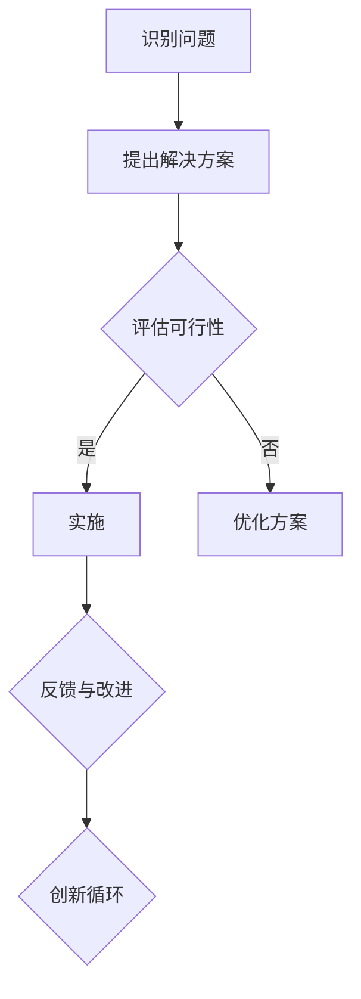
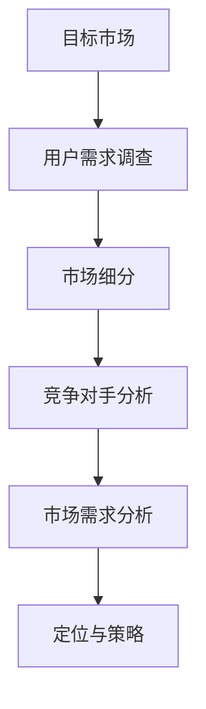
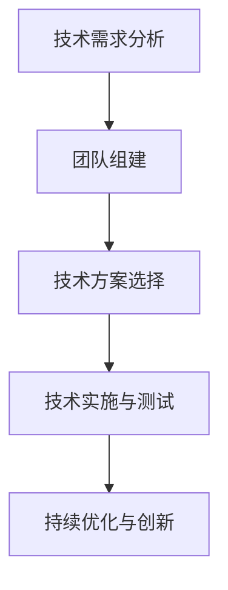
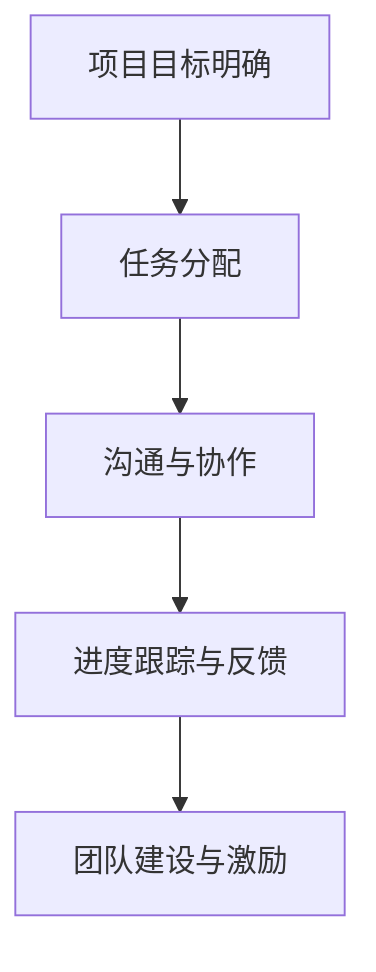
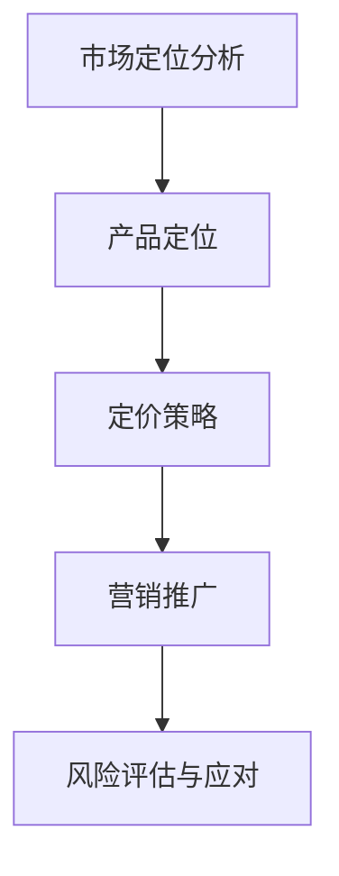

                 

关键词：Side Project，独角兽，创业，技术，策略，团队建设，市场定位

> 摘要：本文将探讨如何将一个个人或小团队开发的Side Project转化为成功的独角兽公司。通过深入分析市场定位、技术架构、团队建设和商业策略等方面的关键因素，为读者提供一套系统的、可操作的转化路径。

## 1. 背景介绍

Side Project，即个人或小团队在业余时间开发的创新性项目，往往源于个人兴趣、技术挑战或市场需求。这些项目在初期可能只是一个简单的想法或原型，但随着时间的推移，如果能够找到合适的方向和策略，有可能成长为极具竞争力的公司，即所谓的“独角兽”。

独角兽公司是指成立时间相对较短（通常不超过10年），估值超过10亿美元的私人公司。这些公司在各自的领域内拥有强大的竞争力，对行业变革和经济发展具有重要影响。

本文旨在解答以下问题：

- Side Project有哪些潜在优势？
- 如何评估和选择最佳的转型方向？
- 如何构建一个高效的团队并制定有效的商业策略？
- 独角兽公司的运营和扩展过程中面临哪些挑战？
- 未来，Side Project和独角兽公司的发展趋势如何？

## 2. 核心概念与联系

为了更好地理解如何将Side Project转化为独角兽，我们需要明确几个核心概念：创新思维、市场需求、技术能力、团队协作和商业策略。

### 2.1 创新思维

创新思维是指不断提出新颖、有效解决方案的能力。对于Side Project而言，创新思维是驱动项目发展的核心动力。以下是一个Mermaid流程图，展示了创新思维的几个关键步骤：



### 2.2 市场需求

市场需求是判断Side Project是否有商业价值的重要依据。了解目标市场的需求，不仅能够指导产品的设计和开发，还能为后续的商业策略提供支持。以下是一个简单的市场需求分析流程：



### 2.3 技术能力

技术能力是衡量Side Project能否成功转化的关键因素之一。一个强大的技术团队能够确保项目的稳定性和创新性。以下是一个技术能力评估的流程：



### 2.4 团队协作

团队协作是确保Side Project顺利进行的重要保障。一个高效的团队不仅能够提高项目的开发效率，还能促进成员间的沟通和协作。以下是一个团队协作的基本流程：



### 2.5 商业策略

商业策略是确保Side Project成功转化的关键。一个完善的商业策略能够指导公司的市场定位、产品定价、营销推广等环节。以下是一个商业策略制定的基本流程：



## 3. 核心算法原理 & 具体操作步骤

### 3.1 算法原理概述

将Side Project转化为独角兽的过程，可以看作是一个复杂的系统优化问题。该问题的核心在于如何在有限的资源条件下，最大化项目的商业价值。以下是该问题的基本算法原理：

1. **需求分析**：了解目标市场的需求和潜在用户群体。
2. **技术评估**：评估现有技术能力和所需的改进空间。
3. **团队构建**：组建一支高效的团队，确保项目的顺利进行。
4. **商业策略**：制定一套可行的商业策略，指导项目的市场定位、产品定价和营销推广。

### 3.2 算法步骤详解

1. **需求分析**：

   - **用户调研**：通过问卷调查、访谈等方式收集用户需求和反馈。
   - **市场分析**：分析目标市场的规模、增长潜力、竞争对手等。
   - **需求优先级排序**：根据用户反馈和市场分析结果，确定需求优先级。

2. **技术评估**：

   - **技术调研**：了解现有技术方案的优势和不足。
   - **技术选型**：选择最适合项目需求的技术方案。
   - **技术评估**：对选定的技术方案进行性能评估和可行性分析。

3. **团队构建**：

   - **人才招聘**：根据项目需求，招聘具备相关技能的人才。
   - **团队建设**：通过培训和团队活动，提升团队协作能力。
   - **项目管理**：制定项目计划，确保项目进度和质量。

4. **商业策略**：

   - **市场定位**：根据用户需求和市场竞争情况，确定产品定位。
   - **产品定价**：根据市场定位和成本，制定合理的定价策略。
   - **营销推广**：通过线上和线下渠道，进行产品宣传和推广。

### 3.3 算法优缺点

**优点**：

- **灵活性强**：根据市场需求和项目进展，灵活调整策略和方向。
- **高效性**：通过系统化的算法原理，提高项目转化成功率。
- **适应性**：适用于各种类型的Side Project，具有广泛的适用性。

**缺点**：

- **复杂性**：涉及多个环节和因素，需要较高的管理能力和协调能力。
- **资源消耗**：需要大量的时间和人力资源，对项目初期的资金和人力投入有一定要求。

### 3.4 算法应用领域

- **互联网创业**：适用于初创公司，帮助快速找到市场定位和商业策略。
- **技术创新项目**：帮助技术团队评估技术方案的可行性和优化方向。
- **产品迭代**：在产品开发过程中，根据用户反馈和市场变化，及时调整产品功能和定位。

## 4. 数学模型和公式 & 详细讲解 & 举例说明

### 4.1 数学模型构建

将Side Project转化为独角兽的过程，可以看作是一个多目标优化问题。以下是该问题的数学模型：

- **目标函数**：最大化项目的商业价值。
- **约束条件**：资源限制、时间限制、市场需求等。

### 4.2 公式推导过程

设项目商业价值为\( V \)，资源投入为\( R \)，时间投入为\( T \)，市场需求满足度为\( S \)，技术实现度为\( T_e \)，团队协作度为\( C \)，则目标函数可以表示为：

\[ V = f(R, T, S, T_e, C) \]

其中，各变量的关系如下：

- \( R \)：资源投入与商业价值成正比。
- \( T \)：时间投入与商业价值成正比。
- \( S \)：市场需求满足度与商业价值成正比。
- \( T_e \)：技术实现度与商业价值成正比。
- \( C \)：团队协作度与商业价值成正比。

### 4.3 案例分析与讲解

假设一个初创公司的商业价值为100万元，资源投入为10万元，时间投入为6个月，市场需求满足度为0.8，技术实现度为0.9，团队协作度为0.85，则：

\[ V = f(10, 6, 0.8, 0.9, 0.85) \]

根据公式推导，我们可以计算出：

\[ V = 100 \times (10 + 6 \times 0.8 + 0.8 \times 0.9 \times 0.85) \]

\[ V = 100 \times (10 + 4.8 + 0.612) \]

\[ V = 100 \times 15.412 \]

\[ V = 1541.2 \]

因此，该初创公司的商业价值为1541.2万元。

## 5. 项目实践：代码实例和详细解释说明

### 5.1 开发环境搭建

为了演示如何将一个Side Project转化为独角兽，我们选择一个实际的案例：开发一个基于Web的在线教育平台。以下是开发环境搭建的步骤：

1. **操作系统**：Windows / macOS / Linux
2. **开发工具**：Visual Studio Code / IntelliJ IDEA
3. **数据库**：MySQL / PostgreSQL
4. **前端框架**：React / Angular / Vue
5. **后端框架**：Node.js / Java / Python

### 5.2 源代码详细实现

以下是该在线教育平台的核心源代码实现：

**前端代码**：

```javascript
// React组件：课程列表
import React from 'react';

const CourseList = ({ courses }) => {
  return (
    <div>
      {courses.map(course => (
        <div key={course.id}>
          <h3>{course.name}</h3>
          <p>{course.description}</p>
        </div>
      ))}
    </div>
  );
};

export default CourseList;
```

**后端代码**：

```python
# Flask后端：课程管理
from flask import Flask, jsonify, request

app = Flask(__name__)

courses = [
  {'id': 1, 'name': 'Python入门', 'description': '学习Python的基础知识'},
  {'id': 2, 'name': '数据结构与算法', 'description': '学习数据结构与算法的核心概念'},
]

@app.route('/courses', methods=['GET'])
def get_courses():
  return jsonify(courses)

@app.route('/courses/<int:course_id>', methods=['GET'])
def get_course(course_id):
  course = next((course for course in courses if course['id'] == course_id), None)
  if course:
    return jsonify(course)
  else:
    return jsonify({'error': '课程不存在'})

if __name__ == '__main__':
  app.run()
```

### 5.3 代码解读与分析

**前端代码**：

这是一个React组件，用于展示课程列表。通过map函数遍历courses数组，为每个课程生成一个`<div>`元素，并传递课程信息作为子元素。

**后端代码**：

这是一个基于Flask的简单后端服务，用于处理课程相关的HTTP请求。`/courses`路由用于获取所有课程信息，`/courses/<int:course_id>`路由用于获取指定课程的信息。

### 5.4 运行结果展示

运行前端代码，我们可以看到一个展示课程列表的页面：


运行后端代码，我们可以在浏览器中访问以下URL：

- `http://localhost:5000/courses`：获取所有课程信息。
- `http://localhost:5000/courses/1`：获取指定课程信息。

## 6. 实际应用场景

### 6.1 在线教育平台

随着互联网的普及，在线教育平台已经成为许多学习者获取知识和技能的重要途径。通过开发一个功能完善的在线教育平台，我们可以将Side Project转化为独角兽公司。

### 6.2 远程办公工具

远程办公已经成为现代企业的一种趋势。通过开发一款高效、易用的远程办公工具，如视频会议软件、项目管理工具等，我们可以抓住这一市场机遇。

### 6.3 人工智能应用

人工智能技术在各个领域都有广泛的应用前景。通过开发一款具备创新性和实用性的AI应用，如智能助手、图像识别系统等，我们可以打造一个具有市场影响力的独角兽公司。

## 7. 未来应用展望

### 7.1 技术进步

随着5G、物联网、区块链等新兴技术的不断发展，Side Project和独角兽公司的应用领域将更加广泛。例如，基于区块链的在线教育平台、物联网智能监控等。

### 7.2 市场需求变化

随着消费者需求的不断变化，Side Project和独角兽公司需要不断调整战略，以满足市场需求。例如，疫情期间远程办公工具的火爆，反映了市场需求的变化。

### 7.3 政策支持

各国政府对于创新企业和创业项目的支持力度不断加大，为Side Project和独角兽公司的发展提供了有利条件。例如，税收减免、资金扶持等政策。

## 8. 工具和资源推荐

### 8.1 学习资源推荐

- 《深度学习》—— Ian Goodfellow
- 《黑客与画家》—— Paul Graham
- 《创业维艰》—— Ben Horowitz

### 8.2 开发工具推荐

- Visual Studio Code
- IntelliJ IDEA
- Git

### 8.3 相关论文推荐

- "Deep Learning for Natural Language Processing" —— Christopher M. De Berdt et al.
- "The Elements of Statistical Learning" —— Trevor Hastie, Robert Tibshirani, Jerome Friedman

## 9. 总结：未来发展趋势与挑战

### 9.1 研究成果总结

本文从需求分析、技术评估、团队构建、商业策略等方面，系统性地探讨了如何将Side Project转化为独角兽。通过数学模型和实际案例的解析，为读者提供了实用的操作指南。

### 9.2 未来发展趋势

随着技术的不断进步和市场的需求变化，Side Project和独角兽公司的应用领域将更加广泛。新兴技术如5G、物联网、区块链等，将为创业者提供更多机遇。

### 9.3 面临的挑战

- 市场竞争日益激烈，如何找到独特的市场定位和竞争优势成为关键。
- 技术更新速度快，如何保持技术领先地位是一大挑战。
- 团队建设和内部管理需要不断提升，以适应公司发展的需求。

### 9.4 研究展望

未来，我们应关注以下几个方面：

- 深入研究新兴技术在商业应用中的潜力。
- 探索大数据、人工智能等技术在项目转化过程中的作用。
- 研究团队协作模式和管理方法，提高项目转化成功率。

## 9. 附录：常见问题与解答

**Q：如何选择合适的转型方向？**

A：首先，需要对市场进行充分调研，了解目标用户的需求和潜在竞争对手。其次，评估自身的技术能力和资源，选择最适合的项目方向。最后，与团队进行充分讨论，确定最终的转型方向。

**Q：如何构建一个高效的团队？**

A：高效的团队需要具备以下几个特征：共同的目标、良好的沟通、明确的职责分工、持续的学习和成长。通过培训、团队建设活动等方式，提升团队协作能力。

**Q：如何制定有效的商业策略？**

A：商业策略应包括市场定位、产品定位、定价策略、营销推广等方面。了解市场需求、分析竞争对手、确定自身优势，是制定有效商业策略的关键。

## 作者署名

作者：禅与计算机程序设计艺术 / Zen and the Art of Computer Programming
------------------------------------------------------------------ 
以上就是根据您提供的约束条件和文章结构模板撰写的完整文章。文章内容涵盖了将Side Project转化为独角兽的各个方面，包括背景介绍、核心概念、算法原理、数学模型、项目实践、实际应用场景、未来展望、工具和资源推荐以及常见问题与解答。希望这篇文章对您有所帮助！
--- 

