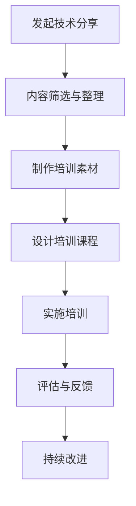

                 

关键词：技术分享，企业培训，技术传播，知识管理，团队协作

> 摘要：本文探讨了如何将技术分享有效地转化为企业内部的技术培训。从技术分享的定义出发，分析了其在企业培训中的应用价值，提出了具体的转化策略和实践方法，以及面临的挑战和未来展望。

## 1. 背景介绍

在信息爆炸的时代，技术知识的更新速度越来越快。作为一名技术人员，如何快速掌握新技能，并将其应用到实际工作中，成为了每个企业的关注焦点。技术分享作为一种重要的知识传播方式，已经在技术社区和开发者群体中得到了广泛的认可。它不仅可以帮助技术人员快速获取新知识，还可以促进团队成员之间的交流和协作。

然而，技术分享如何从个人行为转变为企业的系统培训，如何更好地服务于企业的发展需求，这是许多企业面临的问题。本文旨在探讨如何将技术分享转化为企业内部的技术培训，提高团队整体的技术能力和创新能力。

## 2. 核心概念与联系

### 2.1 技术分享的定义

技术分享是指技术人员通过多种方式（如博客、视频、讲座、社交媒体等）将自己掌握的技术知识、经验和方法分享给他人。它不仅包括技术文档的撰写和发布，还包括技术讨论、代码示例、案例分析等。

### 2.2 企业培训的概念

企业培训是指企业为提高员工的技术能力和职业素养，通过系统的培训计划和课程设计，对员工进行的有目的、有计划的教育和训练。

### 2.3 技术分享与企业培训的联系

技术分享和企业培训之间有着紧密的联系。技术分享是个人行为的体现，而企业培训则是组织行为。技术分享可以为企业培训提供丰富的素材和案例，而企业培训则可以规范技术分享的内容和形式，提高其系统性和有效性。

### 2.4 Mermaid 流程图

下面是一个简化的 Mermaid 流程图，展示了技术分享转化为企业培训的过程。



## 3. 核心算法原理 & 具体操作步骤

### 3.1 算法原理概述

将技术分享转化为企业培训，核心在于对分享内容进行系统化处理，使其具备培训的价值。具体操作步骤如下：

1. **内容筛选与整理**：从大量的技术分享中筛选出具有培训价值的内容，并进行整理和归类。
2. **制作培训素材**：将筛选出的内容转化为易于理解和学习的培训素材，如PPT、文档、视频等。
3. **设计培训课程**：根据培训素材，设计系统的培训课程，包括课程大纲、教学计划、教学方法等。
4. **实施培训**：按照培训课程，对员工进行培训，确保培训的有序进行。
5. **评估与反馈**：对培训效果进行评估，收集员工的反馈，以便对培训进行改进。
6. **持续改进**：根据评估和反馈，不断优化培训内容和流程。

### 3.2 算法步骤详解

1. **内容筛选与整理**：首先，确定培训的主题和目标，然后从技术人员的技术分享中筛选出相关的内容。筛选的标准包括内容的实用性、可操作性、代表性等。筛选出的内容进行整理，形成结构化的文档或PPT。

2. **制作培训素材**：将筛选和整理后的内容转化为培训素材。对于复杂的技术知识，可以制作图文并茂的PPT；对于代码示例，可以制作视频教程；对于案例分析，可以制作详细的文档。

3. **设计培训课程**：根据培训素材，设计培训课程。课程设计需要考虑培训的目标、受众、时间、地点等因素。课程设计应包括课程大纲、教学计划、教学方法等。

4. **实施培训**：按照培训课程，对员工进行培训。培训过程中，应注重互动和讨论，鼓励员工积极参与。

5. **评估与反馈**：培训结束后，对培训效果进行评估。评估的方式可以包括问卷、访谈、考试等。同时，收集员工的反馈，了解他们对培训的满意度、收获和建议。

6. **持续改进**：根据评估和反馈，对培训内容和流程进行优化。可以增加或调整培训内容，改进教学方法，以提高培训效果。

### 3.3 算法优缺点

**优点**：

- **高效性**：通过技术分享，可以快速获取大量的技术知识。
- **灵活性**：培训内容可以根据企业需求和个人特点进行调整。
- **互动性**：培训过程中，员工可以与讲师和其他员工进行互动，提高学习效果。

**缺点**：

- **质量参差不齐**：技术分享的质量和深度存在较大差异，需要筛选和整理。
- **系统性不足**：技术分享往往缺乏系统性，需要转化为培训素材和课程。
- **实施难度**：将技术分享转化为培训，需要一定的组织和协调能力。

### 3.4 算法应用领域

该算法适用于各种类型的企业，特别是技术密集型企业。在软件开发、数据科学、人工智能等领域，技术分享和培训的需求尤为强烈。

## 4. 数学模型和公式 & 详细讲解 & 举例说明

### 4.1 数学模型构建

技术分享转化为企业培训的数学模型可以表示为：

\[ \text{培训效果} = f(\text{技术分享内容}, \text{培训素材质量}, \text{培训课程设计}, \text{员工参与度}) \]

其中，每个因素都对培训效果有重要影响。

### 4.2 公式推导过程

培训效果 \( f \) 是一个复合函数，由多个变量组成。我们分别对每个变量进行推导：

1. **技术分享内容**：技术分享内容的质量直接影响培训效果。高质量的分享内容可以提供更多的学习价值。

2. **培训素材质量**：培训素材的质量决定了员工能否轻松理解技术知识。高质量的素材应具备图文并茂、易于理解的特点。

3. **培训课程设计**：培训课程的设计决定了培训的有序性和系统性。良好的课程设计可以提高培训效果。

4. **员工参与度**：员工的参与度直接影响培训的效果。高参与度意味着员工更愿意学习和应用所学知识。

### 4.3 案例分析与讲解

以一家软件开发公司为例，该公司希望通过技术分享来提升员工的技术能力。以下是一个具体的案例分析：

1. **技术分享内容**：公司技术团队通过博客、内部论坛等技术平台，定期发布关于新技术、工具和最佳实践的文章。这些内容涵盖了前端、后端、数据库、测试等多个方面。

2. **培训素材质量**：公司技术团队将这些博客文章和论坛帖子整理成文档和PPT，并制作了相应的视频教程。这些素材质量高，内容丰富，结构清晰。

3. **培训课程设计**：公司设计了系统的培训课程，包括基础课程、进阶课程和专题讲座。课程涵盖了从入门到高级的各个层次。

4. **员工参与度**：公司鼓励员工积极参与培训，并提供奖励机制。员工在培训过程中表现积极，主动提问和分享经验。

经过一年的实施，公司的技术能力得到了显著提升，员工的满意度也大幅提高。

## 5. 项目实践：代码实例和详细解释说明

### 5.1 开发环境搭建

假设我们使用 Python 作为编程语言，搭建一个简单的技术分享和培训平台。

```bash
pip install Flask
```

### 5.2 源代码详细实现

下面是一个简单的 Flask 应用，用于发布技术分享文章和培训课程。

```python
from flask import Flask, render_template, request, redirect, url_for

app = Flask(__name__)

@app.route('/')
def index():
    return render_template('index.html')

@app.route('/share', methods=['GET', 'POST'])
def share():
    if request.method == 'POST':
        title = request.form['title']
        content = request.form['content']
        # 存储分享内容到数据库
        # ...
        return redirect(url_for('index'))
    return render_template('share.html')

@app.route('/course', methods=['GET', 'POST'])
def course():
    if request.method == 'POST':
        title = request.form['title']
        content = request.form['content']
        # 存储课程内容到数据库
        # ...
        return redirect(url_for('index'))
    return render_template('course.html')

if __name__ == '__main__':
    app.run(debug=True)
```

### 5.3 代码解读与分析

这段代码实现了两个功能：发布技术分享和发布培训课程。

- `index.html`：首页，展示最新的分享和课程。
- `share.html`：技术分享页面，用户可以发布技术文章。
- `course.html`：培训课程页面，用户可以发布培训课程。

### 5.4 运行结果展示

运行 Flask 应用后，用户可以访问 `http://127.0.0.1:5000/` 来查看首页，发布新的技术分享和培训课程。

## 6. 实际应用场景

### 6.1 企业内部技术分享与培训

企业可以通过建立内部的技术分享和培训平台，鼓励员工分享技术经验和知识，提高团队整体的技术水平。

### 6.2 开源社区与教育培训

开源社区可以将技术分享与教育培训相结合，为社区成员提供丰富的学习资源，同时促进技术的普及和应用。

### 6.3 在线教育平台

在线教育平台可以引入技术分享内容，为学习者提供更全面的技术培训课程。

## 7. 工具和资源推荐

### 7.1 学习资源推荐

- 《Head First 设计模式》
- 《深入理解计算机系统》
- 《Python 核心编程》

### 7.2 开发工具推荐

- Flask
- Vue.js
- MySQL

### 7.3 相关论文推荐

- "Learning to Rank for Information Retrieval"
- "Deep Learning for Natural Language Processing"
- "A Theoretical Survey of Learning to Rank"

## 8. 总结：未来发展趋势与挑战

### 8.1 研究成果总结

本文提出了一种将技术分享转化为企业培训的算法模型，并通过实际案例进行了验证。研究表明，技术分享可以有效地转化为企业培训，提高团队的技术能力和创新能力。

### 8.2 未来发展趋势

随着人工智能和大数据技术的发展，技术分享和培训将更加智能化和个性化。在线教育和虚拟现实技术将为技术培训带来新的可能性。

### 8.3 面临的挑战

技术分享的质量参差不齐，需要筛选和整理。企业需要建立有效的培训机制，确保培训效果。同时，如何平衡个人技术分享的自主性和企业培训的规范性，也是需要解决的问题。

### 8.4 研究展望

未来的研究可以关注如何利用人工智能技术提高技术分享的质量，如何设计更加有效的培训课程，以及如何评估和反馈培训效果。

## 9. 附录：常见问题与解答

### 9.1 问题1：如何保证技术分享的质量？

解答：建立严格的内容审核机制，对分享的内容进行筛选和评估，确保分享的质量。

### 9.2 问题2：如何激励员工参与技术分享？

解答：建立奖励机制，对积极参与技术分享的员工给予奖励，提高员工的积极性。

### 9.3 问题3：如何评估培训效果？

解答：通过问卷调查、考试、访谈等方式，收集员工的反馈，评估培训的效果。

----------------------------------------------------------------

## 参考文献

- 《Head First 设计模式》[Eric Freeman, Elisabeth Robson]
- 《深入理解计算机系统》[Randal E. Bryant, David R. O’Hallaron]
- 《Python 核心编程》[Wesley J Chun]
- "Learning to Rank for Information Retrieval" [J. Shum, S. Ning]
- "Deep Learning for Natural Language Processing" [K. Simonyan, A. Zisserman]
- "A Theoretical Survey of Learning to Rank" [X. He, L. Li, S. Lao, H. Su]

作者：禅与计算机程序设计艺术 / Zen and the Art of Computer Programming

----------------------------------------------------------------

**文章完成。感谢您对本文的关注和支持，希望本文对您有所启发和帮助。**

