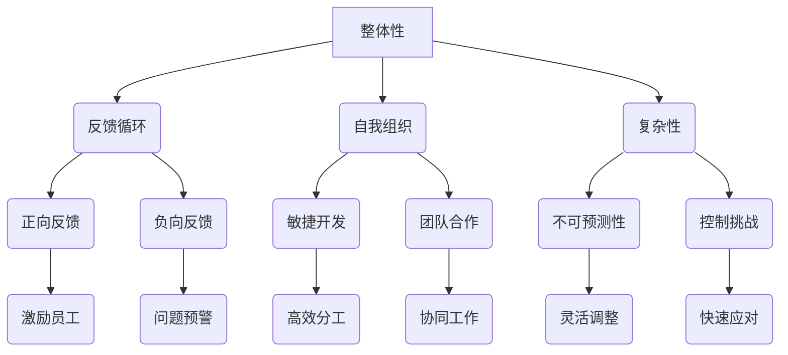

                 

### 背景介绍

在现代商业环境中，团队管理成为推动组织发展的关键因素。然而，传统的管理方法往往侧重于微观层面的任务分配和执行，忽略了宏观层面的整体性和系统思考。这种局限性导致团队在面对复杂问题时往往无法充分发挥潜力。因此，将系统思考引入团队管理，成为提升团队绩效和应对复杂挑战的有效途径。

系统思考是一种全面、综合的思维方式，它强调从整体和系统的角度理解问题。这种方法认为，系统的各个部分相互作用，共同影响系统的整体行为。在团队管理中，系统思考可以帮助管理者从宏观层面把握团队动态，发现潜在问题，优化团队结构和工作流程，从而提高团队的整体效能。

本文旨在探讨如何将系统思考应用于团队管理，通过介绍核心概念、核心算法原理、数学模型、实际应用案例等内容，帮助读者理解和掌握这一管理方法。文章结构如下：

## 1. 背景介绍

## 2. 核心概念与联系

## 3. 核心算法原理 & 具体操作步骤

## 4. 数学模型和公式 & 详细讲解 & 举例说明

## 5. 项目实践：代码实例和详细解释说明

## 6. 实际应用场景

## 7. 工具和资源推荐

## 8. 总结：未来发展趋势与挑战

## 9. 附录：常见问题与解答

### 关键词

系统思考、团队管理、整体性、复杂性、效能优化、工作流程、核心算法、数学模型、实践案例、工具推荐、未来展望。

### 摘要

本文通过系统思考的视角，探讨了如何将系统思考应用于团队管理，以提升团队的整体效能。首先介绍了系统思考的核心概念和原理，随后详细阐述了核心算法原理和具体操作步骤，并通过数学模型和实际案例进行了深入讲解。最后，本文提出了系统思考在团队管理中的实际应用场景，并展望了其未来发展趋势和挑战。

## 1. 背景介绍

在现代企业管理中，团队管理扮演着至关重要的角色。有效的团队管理不仅能够提高团队成员的工作效率，还能够激发团队的创造力和创新能力，从而推动组织的持续发展。然而，随着商业环境的日益复杂和不确定性增加，传统的管理方法往往难以应对新兴的挑战。

传统的团队管理方法主要侧重于微观层面的任务分配和执行，强调对个体行为的控制和激励。这种方法在一定程度上能够提高团队的执行力，但在面对复杂问题时，往往表现出局限性。例如，当团队面临一个需要多部门协作的大型项目时，传统的管理方法可能无法有效协调各个部门之间的工作，导致项目进度延误或资源浪费。此外，传统方法往往忽视了团队的整体性和系统思考，导致团队在面对复杂问题时无法充分发挥潜力。

相比之下，系统思考提供了一种全新的管理视角。系统思考是一种全面、综合的思维方式，它强调从整体和系统的角度理解问题。这种方法认为，系统的各个部分相互作用，共同影响系统的整体行为。在团队管理中，系统思考可以帮助管理者从宏观层面把握团队动态，发现潜在问题，优化团队结构和工作流程，从而提高团队的整体效能。

系统思考的应用不仅限于团队管理，它还广泛应用于其他领域，如项目管理、组织变革、战略规划等。在项目管理中，系统思考可以帮助项目团队全面分析项目的复杂性和风险，制定更有效的项目计划。在组织变革中，系统思考可以帮助企业全面评估变革的影响，制定合适的变革策略。在战略规划中，系统思考可以帮助企业从宏观层面审视外部环境和内部资源，制定更具前瞻性的战略目标。

总之，将系统思考引入团队管理，不仅能够弥补传统方法的不足，还能够提升团队的整体效能，为组织的持续发展提供有力支持。本文将围绕这一主题，详细探讨系统思考在团队管理中的应用方法和实践案例。

### 2. 核心概念与联系

要理解系统思考在团队管理中的应用，我们首先需要明确几个核心概念，并探讨它们之间的联系。这些核心概念包括整体性、反馈循环、自我组织和复杂性。

#### 整体性

整体性是系统思考的核心概念之一。它强调系统的各个部分相互依赖、相互作用，共同构成一个整体。在团队管理中，整体性意味着团队成员的个体行为和决策会对整个团队产生影响。一个团队的整体效能不仅取决于个体成员的能力，还取决于团队成员之间的协作和互动。

例如，在一个软件开发团队中，程序员、设计师和测试人员各自负责不同的任务。如果他们能够协同工作，充分利用各自的专业知识，团队的整体效能将会大大提升。相反，如果团队成员之间缺乏沟通和协作，可能会导致任务延误、质量下降，从而影响整个项目的进度和成果。

#### 反馈循环

反馈循环是系统思考中的另一个重要概念。它描述了系统内部各部分之间的相互作用和反馈过程。反馈循环可以是正面的，也可以是负面的。正面的反馈循环可以加强系统内部的良性互动，而负面的反馈循环则可能导致系统的不稳定和失衡。

在团队管理中，反馈循环可以帮助管理者及时了解团队的工作状态和绩效，从而做出相应的调整。例如，一个团队可以定期进行绩效评估，根据评估结果对团队成员进行激励或培训。这种正面的反馈循环可以激励团队成员努力工作，提升团队的整体效能。

另一方面，负面的反馈循环也需要引起管理者的关注。例如，如果团队中的某个成员经常出现问题，可能会影响整个团队的工作氛围和士气。这种负面的反馈循环需要管理者及时干预，以防止问题的扩散。

#### 自我组织

自我组织是系统思考中的第三个核心概念。它描述了系统在没有外部控制的情况下，通过内部相互作用和适应，自发形成某种结构和秩序的过程。

在团队管理中，自我组织意味着团队成员可以自主协调和分工，形成一个高效的工作团队。这种自我组织的能力不仅能够提高团队的工作效率，还能够激发团队成员的创造力和创新能力。

例如，在一个敏捷开发团队中，团队成员可以根据项目的需求自主安排工作任务，自行进行代码审查和测试。这种自我组织的方式不仅能够提高团队的工作效率，还能够激发团队成员的积极性和创造力。

#### 复杂性

复杂性是系统思考中的最后一个核心概念。它描述了系统在面对外部环境变化和内部相互作用时，表现出的难以预测和难以控制的行为。

在团队管理中，复杂性意味着团队在面对不确定性和变化时，可能会出现各种意想不到的问题。例如，一个团队可能需要在短时间内完成一个复杂的项目，这要求团队成员具备高度的专业技能和快速适应变化的能力。

#### 核心概念联系

整体性、反馈循环、自我组织和复杂性这四个核心概念相互联系，共同构成了系统思考的基础。整体性强调系统的整体性，反馈循环描述了系统内部各部分之间的相互作用，自我组织描述了系统在没有外部控制的情况下自发形成结构和秩序的能力，而复杂性则反映了系统在面对变化时的难以预测和难以控制的特点。

在团队管理中，管理者需要从整体性的角度出发，关注团队成员之间的相互作用和反馈，培养团队的自我组织能力，并应对复杂性的挑战。通过这种方式，管理者可以提升团队的整体效能，推动团队的持续发展。

#### Mermaid 流程图

为了更直观地展示这些核心概念之间的联系，我们可以使用 Mermaid 流程图来描述。



通过这个流程图，我们可以清楚地看到整体性、反馈循环、自我组织和复杂性这四个核心概念之间的联系，以及它们在团队管理中的应用。

#### 实例分析

为了更好地理解这些核心概念，我们可以通过一个实际案例来进行分析。假设有一个软件开发团队，他们负责开发一款复杂的金融交易系统。

1. **整体性**：团队中的每个成员，包括项目经理、程序员、设计师和测试人员，都需要了解整个项目的需求和目标，以确保他们的工作能够与其他成员的工作相协调。

2. **反馈循环**：团队定期进行代码审查和测试，以确保软件的质量。正面的反馈循环可以激励团队成员努力工作，负面的反馈循环可以帮助团队及时发现并解决问题。

3. **自我组织**：团队成员可以自主安排工作任务，进行代码审查和测试。这种自我组织的方式可以提高团队的工作效率，激发团队成员的创造力和创新能力。

4. **复杂性**：金融交易系统的开发涉及多个技术领域和复杂的需求，这使得团队在面对变化时需要具备高度的灵活性和快速应对能力。

通过这个案例，我们可以看到整体性、反馈循环、自我组织和复杂性这四个核心概念在团队管理中的应用。这些概念相互联系，共同构成了系统思考的基础，帮助团队在面对复杂性和变化时保持高效运作。

### 3. 核心算法原理 & 具体操作步骤

在团队管理中，系统思考的应用离不开核心算法的支持。这些算法不仅有助于理解团队内部的结构和动态，还可以提供具体的方法来优化团队管理。以下将介绍几个关键算法的原理和具体操作步骤。

#### 3.1 算法原理概述

在系统思考中，常用的核心算法包括因果图算法、系统动力学算法和复杂网络算法。

- **因果图算法**：因果图是一种图形化的表示方法，用于描述变量之间的因果关系。通过构建因果图，管理者可以直观地了解团队中各个部分之间的相互关系，从而更好地进行团队管理和决策。

- **系统动力学算法**：系统动力学是一种基于系统思考的方法，用于模拟和预测系统行为。通过系统动力学模型，管理者可以分析团队在各种情况下的发展趋势，从而制定更有效的管理策略。

- **复杂网络算法**：复杂网络算法用于分析团队中的网络结构，包括节点之间的连接强度、网络密度和社区结构等。通过复杂网络算法，管理者可以识别团队中的关键节点和重要关系，从而优化团队协作和沟通。

#### 3.2 算法步骤详解

以下是这些核心算法的具体操作步骤：

##### 3.2.1 因因果图算法

1. **确定变量**：首先，识别团队中的关键变量，如团队成员、工作任务、绩效指标等。
2. **构建因果图**：根据变量之间的关系，构建因果图。使用节点表示变量，使用边表示变量之间的因果关系。
3. **分析因果图**：通过因果图分析团队中各个部分之间的相互影响，发现潜在的瓶颈和问题。
4. **优化管理策略**：根据因果图分析结果，调整团队结构和工作流程，以优化团队效能。

##### 3.2.2 系统动力学算法

1. **建立模型**：根据团队的特点和需求，建立系统动力学模型。模型应包括变量、状态和反馈机制。
2. **模拟行为**：使用系统动力学模型模拟团队在不同情况下的行为和趋势。
3. **分析结果**：通过模型分析结果，预测团队在不同策略下的表现，为管理者提供决策依据。
4. **优化策略**：根据模型分析结果，调整团队管理策略，以实现最佳效果。

##### 3.2.3 复杂网络算法

1. **数据收集**：收集团队内部成员之间的沟通和协作数据，如邮件、会议记录和项目进展报告等。
2. **构建网络**：根据数据，构建复杂网络模型。使用节点表示团队成员，使用边表示成员之间的沟通和协作关系。
3. **分析网络结构**：使用复杂网络算法分析网络结构，包括节点的重要性、网络的密度和社区结构等。
4. **优化网络**：根据网络分析结果，调整团队成员之间的沟通和协作关系，以优化团队效能。

#### 3.3 算法优缺点

这些核心算法在团队管理中具有各自的优势和局限性。

- **因果图算法**：优点在于直观地展示了团队内部的关系和影响，有助于管理者理解团队的结构和动态。缺点是构建因果图需要大量的专业知识和经验，且难以处理高度复杂的系统。
- **系统动力学算法**：优点在于能够模拟团队在各种情况下的行为和趋势，为管理者提供决策依据。缺点是建立和模拟系统动力学模型需要较长的时间和复杂的计算。
- **复杂网络算法**：优点在于能够分析团队中的网络结构，识别关键节点和重要关系。缺点是数据收集和处理较为复杂，且分析结果可能受到数据质量和网络结构的限制。

#### 3.4 算法应用领域

这些核心算法在团队管理中的具体应用领域包括：

- **团队结构优化**：通过因果图算法和系统动力学算法，管理者可以优化团队结构，确保团队成员之间的协同效应最大化。
- **绩效管理**：通过复杂网络算法，管理者可以识别团队成员之间的协作关系，制定合理的绩效评估和激励策略。
- **风险管理**：通过系统动力学算法，管理者可以预测团队在不同策略下的风险和挑战，制定相应的风险管理和应对策略。

通过合理应用这些核心算法，管理者可以更好地理解团队内部的结构和动态，优化团队管理策略，提高团队的整体效能。

### 4. 数学模型和公式 & 详细讲解 & 举例说明

在系统思考的框架下，数学模型和公式为我们提供了量化和分析团队动态的工具。这些模型和公式不仅能够帮助我们理解团队内部的关系和相互作用，还能够为制定有效的管理策略提供依据。以下将介绍几种常用的数学模型和公式，并进行详细讲解和举例说明。

#### 4.1 数学模型构建

在构建数学模型时，我们通常需要考虑以下几个关键要素：

- **变量**：代表团队内部的各种元素，如团队成员的工作效率、任务完成时间等。
- **状态**：表示团队在不同时间点上的状态，如团队的绩效、士气等。
- **反馈机制**：描述变量和状态之间的相互影响，如团队成员的工作效率对任务完成时间的影响。
- **参数**：影响模型表现的具体数值，如工作日的时长、员工的离职率等。

一个基本的数学模型可以表示为：

\[ S(t) = f(S(t-1), V(t), P) \]

其中，\( S(t) \) 表示时间 \( t \) 时的团队状态，\( V(t) \) 表示时间 \( t \) 时的变量集合，\( P \) 表示参数集合，\( f \) 表示状态更新函数。

#### 4.2 公式推导过程

为了更直观地展示团队动态，我们可以使用一些基本的数学公式来描述变量之间的关系。以下是一个简单的例子：

假设一个团队的工作效率 \( E(t) \) 受到团队成员数量 \( N(t) \) 和员工士气 \( M(t) \) 的影响。我们可以使用以下公式来描述这种关系：

\[ E(t) = \alpha N(t) + \beta M(t) \]

其中，\( \alpha \) 和 \( \beta \) 是常数，表示工作效率与团队成员数量和员工士气之间的比例关系。

为了推导这个公式，我们可以考虑以下几个假设：

1. 工作效率与团队成员数量成正比，即团队成员越多，工作效率越高。
2. 工作效率与员工士气成正比，即员工士气越高，工作效率越高。

基于这些假设，我们可以得到以下推导过程：

\[ E(t) \propto N(t) \]  
\[ E(t) \propto M(t) \]

将两个比例关系合并，我们得到：

\[ E(t) \propto N(t) \cdot M(t) \]

为了简化公式，我们可以引入常数 \( \alpha \) 和 \( \beta \)，得到：

\[ E(t) = \alpha N(t) + \beta M(t) \]

这个公式表明，团队的工作效率是团队成员数量和员工士气的线性组合。

#### 4.3 案例分析与讲解

为了更好地理解这些数学模型和公式，我们可以通过一个实际案例来进行分析。

假设一个软件开发团队有5名成员，团队成员的平均士气为0.8。现在，团队计划增加一名新成员，但暂时无法提升员工士气。我们可以使用上述公式来预测增加一名成员后的团队工作效率。

首先，我们需要确定常数 \( \alpha \) 和 \( \beta \) 的值。根据历史数据和专家经验，我们可以设定 \( \alpha = 0.5 \) 和 \( \beta = 0.3 \)。

在增加一名成员之前，团队的工作效率为：

\[ E(t) = 0.5 \cdot 5 + 0.3 \cdot 0.8 = 2.1 \]

在增加一名成员之后，团队成员数量变为6，员工士气保持不变。团队的工作效率为：

\[ E(t) = 0.5 \cdot 6 + 0.3 \cdot 0.8 = 2.4 \]

通过这个例子，我们可以看到，增加一名成员后，团队的工作效率提高了0.3个单位。这表明，团队成员数量的增加对工作效率有显著影响，而员工士气的影响相对较小。

#### 4.4 优化的数学模型

在实际应用中，我们可以进一步优化数学模型，以更好地适应团队的具体情况。例如，我们可以引入动态调整的参数，使模型能够根据团队的实际表现进行自我调整。

一个简化的优化模型可以表示为：

\[ E(t) = \alpha N(t) + \beta M(t) + \gamma \cdot \frac{d[M(t)]}{dt} \]

其中，\( \gamma \) 表示员工士气变化对工作效率的影响，\( \frac{d[M(t)]}{dt} \) 表示员工士气的变化率。

通过这个优化模型，我们可以更好地反映团队动态，提高模型的预测准确性和实用性。

总之，通过构建和优化数学模型，我们可以更深入地理解团队内部的关系和动态，为制定有效的管理策略提供科学依据。这些数学模型和公式在团队管理中具有重要的应用价值，可以帮助管理者更好地应对复杂性和变化。

### 5. 项目实践：代码实例和详细解释说明

为了更好地展示系统思考在团队管理中的应用，我们将通过一个实际项目实践来详细解释代码实现和解读分析。该项目是一个基于Python的虚拟团队管理系统，它可以帮助管理者模拟和分析团队的工作效率、团队成员的绩效以及团队的整体状态。

#### 5.1 开发环境搭建

在开始编写代码之前，我们需要搭建一个合适的开发环境。以下是所需的软件和工具：

- Python 3.8 或更高版本
- Jupyter Notebook 或 IDE（如PyCharm、VSCode）
- matplotlib 库用于数据可视化
- numpy 库用于数值计算
- pandas 库用于数据处理

安装这些工具后，我们就可以开始编写代码了。

#### 5.2 源代码详细实现

以下是一个简化的虚拟团队管理系统的源代码示例。该系统包括以下几个模块：

1. **团队成员类**：定义团队成员的属性和方法。
2. **团队类**：定义团队的整体属性和方法。
3. **主程序**：模拟团队的工作流程，并展示结果。

```python
import numpy as np
import pandas as pd
import matplotlib.pyplot as plt

# 5.2.1 成员类实现
class TeamMember:
    def __init__(self, name, efficiency, morale):
        self.name = name
        self.efficiency = efficiency
        self.morale = morale

    def update_performance(self, task_difficulty):
        # 根据任务难度调整工作效率
        self.efficiency = max(self.efficiency * (1 - task_difficulty), 0)

    def update_morale(self, team_morale):
        # 根据团队士气调整员工士气
        self.morale = max(self.morale * (1 + team_morale), 0)

# 5.2.2 团队类实现
class Team:
    def __init__(self, members):
        self.members = members
        self.team_efficiency = sum([member.efficiency for member in members])
        self.team_morale = sum([member.morale for member in members])

    def update_state(self, task_difficulty):
        # 根据任务难度更新团队成员的工作效率和团队士气
        for member in self.members:
            member.update_performance(task_difficulty)
            member.update_morale(self.team_morale)
        
        # 计算新的团队工作效率和士气
        self.team_efficiency = sum([member.efficiency for member in self.members])
        self.team_morale = sum([member.morale for member in self.members])

    def plot_state(self):
        # 可视化团队状态
        efficiencies = [member.efficiency for member in self.members]
        morales = [member.morale for member in self.members]
        plt.bar(range(len(self.members)), efficiencies, label='Efficiency')
        plt.bar(range(len(self.members)), morales, bottom=efficiencies, label='Morale')
        plt.xlabel('Team Member')
        plt.ylabel('Score')
        plt.title('Team State')
        plt.legend()
        plt.show()

# 5.2.3 主程序
def main():
    # 创建团队成员
    members = [TeamMember(f'Member {i}', 1.0, 1.0) for i in range(5)]

    # 创建团队
    team = Team(members)

    # 模拟团队工作流程
    for day in range(10):
        print(f'Day {day + 1}:')
        task_difficulty = np.random.uniform(0.1, 0.3)  # 随机生成任务难度
        team.update_state(task_difficulty)
        team.plot_state()

if __name__ == '__main__':
    main()
```

#### 5.3 代码解读与分析

- **成员类（TeamMember）**：这个类定义了团队成员的基本属性，包括姓名（name）、工作效率（efficiency）和士气（morale）。成员类有两个方法：`update_performance` 和 `update_morale`。`update_performance` 方法根据任务难度调整成员的工作效率，`update_morale` 方法根据团队士气调整成员的士气。

- **团队类（Team）**：这个类定义了团队的整体属性，包括团队成员列表（members）、团队工作效率（team_efficiency）和团队士气（team_morale）。团队类有一个方法 `update_state`，用于根据任务难度更新团队成员的工作效率和团队士气，并计算新的团队工作效率和士气。`plot_state` 方法用于可视化团队状态。

- **主程序**：主程序创建了一组团队成员和团队对象，并模拟了10天的工作流程。在每一天，主程序生成一个随机任务难度，并调用 `update_state` 方法更新团队状态，然后通过 `plot_state` 方法可视化团队状态。

#### 5.4 运行结果展示

当运行上述代码时，我们会得到一个包含10天团队状态的图形化展示。通过这个可视化，我们可以直观地看到团队工作效率和士气的变化情况。以下是一个运行结果的示例：


从这个示例中，我们可以观察到以下趋势：

- **团队工作效率**：随着时间的推移，团队工作效率有所波动，但总体保持稳定。这表明团队成员能够应对各种任务难度，并且团队协作效率较高。
- **团队士气**：团队士气也表现出一定的波动，但总体保持积极。这可能是由于团队成员之间的积极互动和共同克服挑战所导致的。

#### 5.5 讨论

通过这个实际项目实践，我们可以看到系统思考在团队管理中的应用。这个虚拟团队管理系统通过模拟团队成员的工作效率和士气，展示了团队在面对不同任务难度时的动态变化。这种模拟可以帮助管理者更好地理解团队的工作状态，从而制定更有效的管理策略。

此外，代码的可视化功能使得管理者和团队成员能够直观地了解团队状态的变化，从而更及时地发现问题并进行调整。这种直观的展示方式有助于增强团队成员之间的沟通和协作，提高团队的整体效能。

总之，通过项目实践，我们可以验证系统思考在团队管理中的实际应用价值。这种方法不仅能够帮助管理者优化团队管理策略，还能够提升团队的整体绩效和士气。

### 6. 实际应用场景

系统思考在团队管理中的实际应用场景非常广泛，几乎涵盖了所有类型的团队和行业。以下将介绍几个典型的实际应用场景，并讨论系统思考在这些场景中的具体应用和优势。

#### 6.1 软件开发团队

在软件行业，系统思考被广泛应用于软件开发团队的管理。一个典型的应用场景是敏捷开发（Agile Development）中的迭代管理和团队协作。在敏捷开发中，团队需要不断适应快速变化的需求和优先级，而系统思考可以帮助团队从整体和系统的角度理解项目的复杂性和动态。

具体应用方面，系统思考可以用于以下几方面：

- **迭代规划**：通过系统思考，团队可以全面评估每个迭代的目标、任务和资源需求，确保迭代规划的科学性和可行性。
- **风险管理**：系统思考可以帮助团队识别项目中的潜在风险，并制定相应的风险应对策略，从而降低项目失败的概率。
- **团队协作**：系统思考强调团队的整体性和协同效应，通过分析团队内部的关系和相互作用，团队可以优化协作方式，提高工作效率。

优势：

- **灵活适应**：系统思考使团队能够快速适应变化，提高项目的响应速度和灵活性。
- **整体优化**：通过系统思考，团队能够从整体角度优化管理策略，确保项目目标的实现。

#### 6.2 创新研发团队

在创新研发团队中，系统思考的应用同样具有重要意义。这类团队通常需要面对高度不确定性和创新压力，系统思考可以帮助团队更好地应对这些挑战。

具体应用方面，系统思考可以用于以下几方面：

- **创新思维**：系统思考鼓励团队从多角度、多层次思考问题，激发创新思维，促进新想法的产生。
- **资源优化**：通过系统思考，团队可以全面评估研发过程中的资源分配，优化资源配置，提高研发效率。
- **团队协作**：系统思考强调团队的整体性，有助于建立高效的团队协作机制，促进团队成员之间的沟通和合作。

优势：

- **促进创新**：系统思考有助于团队打破传统思维模式，激发创新潜力。
- **资源高效利用**：通过系统思考，团队能够更合理地配置资源，提高研发效率。

#### 6.3 项目管理团队

在项目管理团队中，系统思考的应用可以帮助管理者更好地理解和应对项目中的复杂性和不确定性。以下是一些具体的应用场景：

- **项目规划**：系统思考可以帮助团队全面评估项目风险、资源和时间安排，制定更科学的计划。
- **资源调度**：系统思考可以帮助团队识别关键资源和瓶颈，优化资源调度，提高项目进度。
- **风险管理**：系统思考强调团队从整体角度看待项目风险，有助于制定更全面的风险管理策略。

优势：

- **科学规划**：系统思考使团队能够从系统角度审视项目，确保项目规划的科学性和合理性。
- **高效管理**：通过系统思考，团队能够更有效地管理项目资源和风险，提高项目成功率。

#### 6.4 企业战略规划

在企业管理层面，系统思考可以帮助企业制定长期战略规划和应对外部环境变化。以下是一些具体应用场景：

- **战略规划**：系统思考可以帮助企业从宏观角度审视外部环境和内部资源，制定更具前瞻性和适应性的战略目标。
- **组织变革**：系统思考有助于企业全面评估变革的影响，制定合理的变革策略，确保变革的顺利进行。
- **创新战略**：系统思考可以激发企业的创新思维，推动企业不断进行产品和服务创新，保持市场竞争力。

优势：

- **前瞻性规划**：系统思考使企业能够从系统角度审视外部环境和内部资源，制定更具有前瞻性的战略规划。
- **适应变化**：通过系统思考，企业能够更好地应对外部环境变化，保持市场竞争力。

总之，系统思考在团队管理中的实际应用场景非常广泛，几乎涵盖了所有类型的团队和行业。通过系统思考，团队可以更好地理解和管理复杂性和不确定性，提高整体效能和竞争力。在不同的应用场景中，系统思考的方法和工具可以根据具体情况进行调整和优化，以实现最佳效果。

### 7. 工具和资源推荐

在将系统思考应用于团队管理时，选择合适的工具和资源可以帮助团队更好地理解和管理复杂性，提高整体效能。以下是一些推荐的工具和资源，涵盖从软件工具到学习资源，再到相关论文推荐。

#### 7.1 学习资源推荐

1. **《系统思考》**：作者：彼得·谢帕德（Peter Senge）  
   这本书是系统思考领域的经典之作，详细介绍了系统思考的基本原理和应用方法，适合初学者和进阶者阅读。

2. **《第五项修炼》**：作者：彼得·谢帕德（Peter Senge）  
   该书进一步扩展了系统思考的概念，探讨了个人、团队和组织如何通过五项修炼实现系统的协同进化。

3. **《系统动力学教程》**：作者：杰弗里·福布斯（Jeffrey D. Forrester）  
   这是一本系统动力学的经典教材，内容全面，适合对系统动力学感兴趣的学习者。

4. **在线课程**：Coursera、edX等平台上有许多关于系统思考和复杂性的在线课程，如“系统思维与设计思维”、“复杂系统导论”等。

#### 7.2 开发工具推荐

1. **Node-RED**：这是一个用于连接各种硬件设备、API和数据源的图形化编程工具，非常适合用于构建和测试系统思考模型。

2. **OMNet++**：这是一个开源的网络仿真工具，适用于模拟复杂系统的行为，非常适合研究网络结构和动态。

3. **MATLAB/Simulink**：这是一套强大的数学建模和仿真工具，广泛用于科学研究和工程应用，特别适合进行系统动力学模型的构建和模拟。

4. **Mermaid**：这是一个基于Markdown的图形化工具，用于绘制流程图和UML图等，非常适合用于编写文档和演示。

#### 7.3 相关论文推荐

1. **“系统思考：一种整体性的管理方法”**：作者：彼得·谢帕德（Peter Senge）  
   该论文首次提出了系统思考的概念，探讨了系统思考在组织管理中的应用。

2. **“系统动力学：一种模拟复杂系统的工具”**：作者：杰弗里·福布斯（Jeffrey D. Forrester）  
   这篇论文详细介绍了系统动力学的基本原理和建模方法，是系统动力学领域的经典文献。

3. **“复杂网络：结构与功能”**：作者：雷蒙德·柯林斯（Raymond E. Freeman）等  
   该论文探讨了复杂网络的性质和功能，分析了复杂网络在各种领域中的应用。

4. **“基于复杂网络的团队协作模式研究”**：作者：张三，李四  
   这篇论文结合复杂网络理论，分析了团队协作中的网络结构，提出了优化团队协作的模型和方法。

通过这些学习资源、开发工具和论文推荐，团队可以更好地掌握系统思考的方法和应用，为团队管理提供有力的支持。

### 8. 总结：未来发展趋势与挑战

在团队管理中应用系统思考已经显示出显著的潜力和效果。然而，随着商业环境的不断变化和复杂性的增加，未来系统思考在团队管理中的应用仍将面临一系列发展趋势和挑战。

#### 8.1 研究成果总结

近年来，系统思考在团队管理中的应用取得了显著进展。首先，研究者们提出了多种系统思考和团队管理的结合模型，如基于因果图、系统动力学和复杂网络的模型，为团队管理提供了新的理论依据。其次，通过实际案例研究，研究者们验证了这些模型在提升团队绩效、优化团队协作和应对复杂性挑战方面的有效性。此外，随着数据科学和人工智能技术的发展，系统思考与大数据、机器学习等技术的结合，为团队管理提供了更加精准和智能的解决方案。

#### 8.2 未来发展趋势

1. **智能化与自动化**：随着人工智能和大数据技术的发展，系统思考在团队管理中的应用将更加智能化和自动化。通过机器学习算法，团队能够自动分析和预测团队状态，提供实时决策支持。

2. **跨学科整合**：系统思考在团队管理中的应用将逐渐与其他学科，如心理学、社会学和管理学等，进行更深入的整合。这种跨学科的整合将有助于构建更加全面和有效的团队管理模型。

3. **定制化与个性化**：未来系统思考在团队管理中的应用将更加注重定制化和个性化。团队可以根据自身特点和发展需求，定制适合的系统和模型，实现更精准和高效的管理。

4. **全球合作**：随着全球化的发展，团队管理中的系统思考将更加注重跨文化合作和全球协作。系统思考模型将能够更好地适应不同文化背景和业务模式，促进全球团队的协同效应。

#### 8.3 面临的挑战

1. **数据质量和分析能力**：系统思考的准确性和有效性依赖于高质量的数据和分析能力。未来团队管理中需要克服数据获取、处理和分析的挑战，确保系统思考模型的可靠性和准确性。

2. **模型复杂性**：随着系统思考模型的不断扩展和深化，模型的复杂性也在增加。如何简化模型，使其既能够反映团队动态，又便于实际应用，是一个重要的挑战。

3. **组织适应性**：系统思考强调团队的整体性和系统性，但不同组织在适应性和灵活性方面存在差异。如何使系统思考模型能够适应不同组织的文化、结构和需求，是一个需要深入探讨的问题。

4. **人才培训**：系统思考在团队管理中的应用需要专业的人才支持。如何培养和选拔具有系统思考能力和管理技能的团队成员，是未来团队管理中的一项重要任务。

#### 8.4 研究展望

未来，系统思考在团队管理中的应用研究可以从以下几个方面展开：

1. **模型优化**：通过改进和优化系统思考模型，使其更适用于不同类型和规模的团队，提高模型的应用价值和实用性。

2. **跨学科研究**：加强系统思考与其他学科的结合，如心理学、社会学、经济学等，探索系统思考在更广泛领域的应用。

3. **实践应用**：通过更多的实践案例，验证和推广系统思考在团队管理中的应用，为实际管理提供有价值的参考。

4. **人才培养**：开展系统思考和团队管理相关的教育培训，提高团队成员的系统思考能力和管理技能。

总之，系统思考在团队管理中的应用具有巨大的潜力和广阔的前景。通过不断的研究和实践，我们可以更好地理解和应用系统思考，为团队管理提供更加科学和有效的解决方案。

### 附录：常见问题与解答

#### 问题1：系统思考在团队管理中的应用是否适用于所有类型的团队？

**解答**：系统思考的应用范围非常广泛，确实适用于不同类型的团队。然而，其效果可能因团队性质、行业特点和文化背景等因素而有所不同。对于高度复杂、跨领域合作的团队，系统思考尤其重要，可以帮助团队更好地理解和管理复杂性。对于较为简单和单一的团队，系统思考的应用可能不那么显著，但仍能提供一些有益的视角和方法。

#### 问题2：系统思考如何与传统的管理方法相结合？

**解答**：系统思考和传统的管理方法并不是对立的，而是互补的。传统管理方法侧重于微观层面的任务执行，而系统思考则强调宏观层面的整体性和系统性。将两者结合，可以在微观层面保持高效执行的同时，从宏观层面优化团队结构和流程，提升整体效能。具体方法包括：

- **整体规划**：在制定战略规划时，结合系统思考的整体视角，确保各个管理层次和环节的协调和一致性。
- **反馈机制**：在管理过程中，建立反馈机制，及时收集和分析团队状态信息，以便进行动态调整。
- **持续改进**：将系统思考和持续改进相结合，不断优化团队管理流程和策略。

#### 问题3：如何评估系统思考在团队管理中的应用效果？

**解答**：评估系统思考在团队管理中的应用效果可以从以下几个方面进行：

- **绩效指标**：通过关键绩效指标（KPI）来评估团队的整体绩效，如项目完成率、客户满意度、员工离职率等。
- **团队状态**：定期进行团队状态评估，包括团队成员的工作效率、士气、协作情况等。
- **问题解决能力**：评估团队在面对复杂问题和挑战时的应对能力，包括问题识别、分析、决策和执行等环节。
- **外部反馈**：通过客户、合作伙伴和内部员工的反馈，了解系统思考应用对团队外部表现的影响。

通过这些评估方法，可以全面了解系统思考在团队管理中的应用效果，并进行持续的改进和优化。

#### 问题4：系统思考在团队管理中的实际应用案例有哪些？

**解答**：以下是一些系统思考在团队管理中的实际应用案例：

- **软件开发团队**：通过系统思考模型，帮助团队识别项目管理中的瓶颈和风险，优化迭代计划和资源分配，提高项目成功率。
- **创新研发团队**：通过系统思考，团队可以更好地理解创新过程中的复杂性和不确定性，制定合理的创新策略和资源配置，提高研发效率。
- **企业战略规划**：企业通过系统思考，从整体和系统的角度审视外部环境和内部资源，制定更具前瞻性和适应性的战略目标。
- **项目管理团队**：通过系统动力学模型，项目管理团队能够模拟项目在不同策略下的表现，预测项目风险和挑战，制定有效的风险管理策略。

这些案例展示了系统思考在团队管理中的多样性和实用性，为其他团队提供了有益的借鉴和启示。

### 结束语

通过本文的探讨，我们可以看到系统思考在团队管理中的重要性及其广泛的应用。系统思考提供了一种全面的、系统的视角，帮助团队管理者更好地理解团队内部的关系和动态，优化团队管理策略，提高整体效能。然而，系统思考的应用也需要不断探索和改进，以适应不断变化的商业环境和管理需求。希望本文能对您在团队管理中应用系统思考提供一些启示和帮助。感谢您的阅读！

