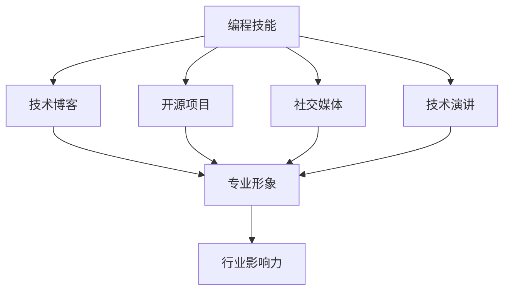

                 

关键词：编程技能，个人品牌建设，市场营销，技术影响力，职业发展

> 摘要：在当今数字化时代，编程技能不仅仅是技术从业者的必备工具，更是构建个人品牌的关键要素。本文将探讨如何将编程技能与个人品牌建设相结合，通过构建专业形象、开展市场营销以及利用技术影响力实现职业发展的全面提升。

## 1. 背景介绍

在互联网和信息技术飞速发展的今天，编程技能已经成为现代社会的一项核心能力。无论是软件开发工程师、数据科学家，还是网站设计师、系统管理员，编程能力都是他们的核心竞争力和职业发展的基石。随着技术行业对编程人才需求的不断增长，拥有编程技能的人也逐渐成为了职场中的“香饽饽”。

然而，仅仅拥有编程技能已经不足以在这个竞争激烈的市场中脱颖而出。个人品牌建设成为了一个重要的方向。个人品牌不仅仅是一个人的名字或形象，它代表了一个人的专业能力、价值观、影响力等。一个成功的个人品牌可以帮助个人在职业发展中取得更大的成功，提升自己的市场价值。

本文将探讨如何将编程技能与个人品牌建设相结合，通过以下三个方面实现个人品牌的专业化、市场化和影响力的提升：

1. 构建专业形象：如何通过技术博客、开源项目等方式展示自己的专业能力。
2. 开展市场营销：如何运用社交媒体、网络研讨会等工具，提高自己在行业内的知名度。
3. 利用技术影响力：如何通过参与社区活动、技术演讲等，树立自己在技术领域的影响力。

## 2. 核心概念与联系

### 2.1 个人品牌建设的核心概念

个人品牌建设涉及多个方面，包括专业知识、个人形象、社交网络、行业影响力等。以下是几个关键概念及其相互关系：

- **专业知识**：个人品牌的基础，决定了你的专业形象和市场价值。
- **个人形象**：通过言行举止、社交媒体等展现给外界的形象，影响人们对你专业能力的认知。
- **社交网络**：包括同行、客户、合作伙伴等，通过这些网络建立人脉，扩大影响力。
- **行业影响力**：在特定领域内的知名度和影响力，决定了你能够在多大程度上影响行业的发展。

### 2.2 编程技能与个人品牌建设的关系

编程技能是个人品牌建设的重要组成部分，它们之间的联系如下：

- **编程技能**：展示了你的专业知识和能力，是构建个人品牌的核心。
- **技术博客**：通过撰写技术文章，展示你的编程技能和思考，提高你的专业形象。
- **开源项目**：参与开源项目，展示你的编程能力和团队合作精神。
- **社交媒体**：通过社交媒体分享你的技术经验和见解，扩大你的社交网络。
- **技术演讲**：通过演讲，展示你的专业能力和沟通技巧，增强你的行业影响力。

### 2.3 Mermaid 流程图

以下是一个简单的 Mermaid 流程图，展示了编程技能在个人品牌建设中的应用流程：



## 3. 核心算法原理 & 具体操作步骤

### 3.1 算法原理概述

个人品牌建设的核心算法可以看作是一个分层的策略，从底层到顶层分别是：

1. **基础层**：构建专业知识，通过学习、实践和认证等方式提升自己的技能水平。
2. **表现层**：通过技术博客、开源项目、社交媒体等展示自己的专业能力，建立专业形象。
3. **推广层**：通过市场营销策略，如社交媒体宣传、网络研讨会、技术演讲等，扩大影响力。
4. **巩固层**：通过持续的学习、分享和贡献，巩固自己的专业地位，提升行业影响力。

### 3.2 算法步骤详解

#### 3.2.1 基础层：构建专业知识

- **学习**：通过阅读专业书籍、在线课程、技术论坛等途径，不断更新和提升自己的专业知识。
- **实践**：通过实际项目或练习，将理论知识应用到实践中，提高实际操作能力。
- **认证**：通过参加专业认证考试，获得行业认可的证书，增加自己的市场竞争力。

#### 3.2.2 表现层：展示专业能力

- **技术博客**：定期撰写技术文章，分享你的编程经验和见解，提高你的专业形象。
- **开源项目**：参与开源项目，贡献代码，展示你的编程能力和团队合作精神。
- **社交媒体**：通过微博、知乎、Twitter 等，分享你的技术见解和项目进展，扩大你的社交网络。

#### 3.2.3 推广层：扩大影响力

- **社交媒体宣传**：利用社交媒体平台，发布专业内容，吸引关注者。
- **网络研讨会**：定期举办网络研讨会，分享技术见解和项目经验，提高你的知名度。
- **技术演讲**：参加行业会议或组织技术演讲，展示你的专业能力和沟通技巧。

#### 3.2.4 巩固层：巩固专业地位

- **持续学习**：保持对新技术的敏感度，不断学习，保持自己的专业竞争力。
- **分享贡献**：通过技术社区、博客等，分享你的经验和知识，帮助他人，提升自己的影响力。

### 3.3 算法优缺点

#### 优点

- **高效性**：通过系统化的方法，可以快速提升个人品牌的建设效率。
- **全面性**：涵盖了从专业知识到行业影响力的各个层面，确保个人品牌的全方位提升。
- **可持续性**：通过持续的学习和贡献，可以长期保持个人品牌的专业性和影响力。

#### 缺点

- **时间成本**：需要投入大量的时间和精力，特别是初期阶段。
- **资源限制**：需要一定的资源和资金支持，如购买书籍、参加培训等。

### 3.4 算法应用领域

- **软件开发**：通过技术博客和开源项目，展示编程技能，提升个人品牌。
- **数据科学**：通过撰写数据分析文章和参与开源项目，展示数据科学能力。
- **网络安全**：通过分享安全知识和参与安全项目，提升个人在网络安全领域的专业地位。

## 4. 数学模型和公式 & 详细讲解 & 举例说明

### 4.1 数学模型构建

个人品牌建设的数学模型可以看作是一个线性模型，如下所示：

\[ \text{个人品牌价值} = f(\text{专业知识}, \text{个人形象}, \text{社交网络}, \text{行业影响力}) \]

其中，每个变量可以进一步分解：

\[ \text{专业知识} = f(\text{技能水平}, \text{实践经验}, \text{认证资格}) \]

\[ \text{个人形象} = f(\text{言行举止}, \text{社交媒体表现}) \]

\[ \text{社交网络} = f(\text{人脉数量}, \text{互动频率}) \]

\[ \text{行业影响力} = f(\text{知名度}, \text{演讲次数}, \text{社区贡献}) \]

### 4.2 公式推导过程

个人品牌价值的推导过程如下：

1. **专业知识**：个人品牌的价值首先取决于专业知识。技能水平、实践经验和认证资格是衡量专业知识的关键指标。技能水平越高，实践经验越丰富，认证资格越优秀，个人品牌价值越高。
   
2. **个人形象**：个人形象是个人品牌的重要组成部分。言行举止和社交媒体表现直接影响外界对个人的专业形象的认知。良好的言行举止和积极的社交媒体表现能够提高个人品牌的价值。

3. **社交网络**：社交网络是个人品牌传播的重要渠道。人脉数量和互动频率是衡量社交网络的关键指标。人脉数量越多，互动频率越高，个人品牌的价值就越大。

4. **行业影响力**：行业影响力是个人品牌价值的直接体现。知名度、演讲次数和社区贡献是衡量行业影响力的关键指标。知名度越高，演讲次数越多，社区贡献越大，个人品牌的价值就越高。

### 4.3 案例分析与讲解

以下是一个简单的案例分析：

- **专业知识**：某程序员拥有多年的软件开发经验，通过了多个专业认证，技能水平非常高。
- **个人形象**：他在社交媒体上表现出色，经常分享技术见解和项目经验，赢得了大量的粉丝。
- **社交网络**：他拥有广泛的社交网络，与许多行业内的专业人士和潜在客户保持联系。
- **行业影响力**：他经常参加行业会议，进行技术演讲，并在技术社区中积极参与讨论，影响力很大。

根据上述数学模型，我们可以计算出这位程序员的个人品牌价值：

\[ \text{个人品牌价值} = f(\text{高技能水平}, \text{积极社交媒体表现}, \text{广泛社交网络}, \text{高行业影响力}) \]

\[ \text{个人品牌价值} = \text{很高} \]

## 5. 项目实践：代码实例和详细解释说明

### 5.1 开发环境搭建

在进行个人品牌建设的过程中，构建一个专业的技术博客是非常重要的。以下是搭建一个基础技术博客的步骤：

1. **选择博客平台**：如Hexo、Jekyll、WordPress等。
2. **配置环境**：安装Node.js、Python等。
3. **安装主题**：选择一个适合的博客主题。
4. **配置域名**：购买域名并配置DNS。
5. **搭建博客**：按照平台文档进行搭建。

### 5.2 源代码详细实现

以下是一个使用Hexo搭建技术博客的简单示例：

```bash
# 安装Hexo
npm install -g hexo-cli

# 初始化博客项目
hexo init my-blog

# 进入博客目录
cd my-blog

# 安装主题（以NexT主题为例）
npm install hexo-theme-nex

# 修改配置文件_config.yml
title: My Tech Blog
theme: next

# 创建文章
hexo new "First Post"

# 生成静态文件
hexo generate

# 启动本地服务器
hexo server

# 部署到GitHub Pages
hexo deploy
```

### 5.3 代码解读与分析

这段代码首先安装了Hexo，一个基于Node.js的博客框架。然后，通过`hexo init`命令初始化了一个博客项目。接下来，安装了一个流行的主题NexT，并修改了配置文件以设置博客的基本信息。

通过`hexo new`命令创建了一篇新的文章，使用`hexo generate`生成静态文件，并通过`hexo server`启动本地服务器进行预览。最后，使用`hexo deploy`命令将博客部署到GitHub Pages，使得博客可以在互联网上访问。

### 5.4 运行结果展示

部署后的博客将自动生成在GitHub Pages上，通过浏览器访问GitHub Pages提供的链接，即可看到已经搭建好的技术博客。

## 6. 实际应用场景

### 6.1 技术博客

技术博客是展示编程技能和个人品牌的重要平台。通过撰写高质量的技术文章，可以展示你的专业知识和思考能力，吸引同行业的人士关注，提升个人在行业内的知名度。

### 6.2 开源项目

参与开源项目不仅能够展示你的编程技能，还能增强团队合作能力。通过在GitHub等平台上发布项目，可以吸引更多的关注者和贡献者，扩大你的影响力。

### 6.3 社交媒体

社交媒体是建立个人品牌的利器。通过在微博、知乎、Twitter等平台上分享技术见解和项目进展，可以迅速积累粉丝，提高你的专业形象。

### 6.4 技术演讲

技术演讲是展示个人专业能力和影响力的最佳途径。通过在行业会议、技术沙龙等场合进行演讲，可以树立你的行业地位，扩大你的影响力。

## 6.4 未来应用展望

随着人工智能、大数据、云计算等技术的发展，编程技能的应用领域将不断扩展。个人品牌建设也将更加依赖技术能力和创新思维。未来的个人品牌建设将更加注重以下几个方面：

- **技术创新**：不断学习和掌握最新的技术，保持自己的专业竞争力。
- **内容营销**：通过高质量的内容创作，提升个人品牌的知名度和影响力。
- **社交互动**：积极参与技术社区，与同行建立良好的互动关系，扩大人脉。
- **个性化服务**：根据个人兴趣和专长，提供个性化的技术解决方案，树立专业形象。

## 7. 工具和资源推荐

### 7.1 学习资源推荐

- **Coursera**：提供大量的计算机科学课程，适合初学者和进阶者。
- **edX**：全球顶尖大学提供的高质量在线课程，涵盖计算机科学、数据科学等多个领域。
- **Udacity**：提供各种实用技能的在线课程，包括编程、数据分析等。

### 7.2 开发工具推荐

- **Visual Studio Code**：一款强大的代码编辑器，支持多种编程语言，适合编写技术博客和开源项目。
- **Git**：版本控制工具，用于管理代码和项目协作。
- **GitHub**：开源项目的托管平台，适合展示个人项目和贡献。

### 7.3 相关论文推荐

- **"The Art of Computer Programming"**：Donald E. Knuth的经典著作，涵盖计算机编程的各个方面。
- **"Data Science from Scratch"**：Joel Grus的著作，介绍了数据科学的基础知识和编程技巧。
- **"Design Patterns: Elements of Reusable Object-Oriented Software"**：Erich Gamma等人的著作，介绍了面向对象设计模式。

## 8. 总结：未来发展趋势与挑战

### 8.1 研究成果总结

通过本文的探讨，我们可以得出以下研究成果：

- 编程技能是构建个人品牌的核心能力。
- 个人品牌建设需要综合考虑专业知识、个人形象、社交网络和行业影响力等多个方面。
- 技术博客、开源项目、社交媒体和演讲等是构建个人品牌的有效途径。
- 数学模型和算法为个人品牌建设提供了理论支持。

### 8.2 未来发展趋势

随着技术的发展，个人品牌建设将呈现以下趋势：

- 技术创新能力将成为个人品牌的核心竞争力。
- 内容营销将越来越重要，高质量的内容创作将是提升个人品牌的关键。
- 社交互动和社区参与将成为个人品牌建设的重要手段。
- 个性化服务和定制化解决方案将日益受到重视。

### 8.3 面临的挑战

在个人品牌建设过程中，也面临着以下挑战：

- **时间成本**：构建个人品牌需要投入大量的时间和精力。
- **资源限制**：可能需要一定的资源和资金支持，如购买书籍、参加培训等。
- **技术更新**：技术快速发展，需要不断学习和更新自己的技能。

### 8.4 研究展望

未来的研究可以从以下几个方面展开：

- 探讨如何更有效地利用技术工具和平台进行个人品牌建设。
- 研究不同类型的技术人才如何构建个性化的个人品牌。
- 分析个人品牌建设对职业发展的影响和作用机制。

## 9. 附录：常见问题与解答

### 9.1 如何选择博客平台？

选择博客平台主要考虑以下几个方面：

- **易用性**：平台是否容易上手，是否有丰富的主题和插件支持。
- **性能**：平台的服务器性能如何，是否稳定。
- **部署方式**：是否支持自动化部署，如GitHub Pages。
- **社区支持**：平台是否有活跃的社区，能否获得帮助。

### 9.2 如何撰写高质量的技术文章？

撰写高质量的技术文章需要注意以下几点：

- **选题**：选择具有实际应用价值或深入分析的主题。
- **结构**：确保文章有清晰的结构，包括引言、正文和结论。
- **内容**：提供详细的信息和示例代码，确保内容的可读性和实用性。
- **校对**：仔细校对文章，避免错别字和语法错误。

### 9.3 如何在社交媒体上宣传个人品牌？

在社交媒体上宣传个人品牌可以从以下几个方面入手：

- **内容质量**：发布高质量的内容，吸引粉丝。
- **互动**：积极与粉丝互动，建立良好的关系。
- **频率**：保持一定的发布频率，维持关注度。
- **推广**：利用SEO、社交媒体广告等方式进行推广。

### 9.4 如何参与开源项目？

参与开源项目可以从以下几个方面入手：

- **查找项目**：在GitHub等平台上查找感兴趣的开源项目。
- **了解项目**：阅读项目文档，了解项目的需求和现状。
- **提issue**：针对项目的问题或需求，提出issue。
- **贡献代码**：根据项目需要，编写和提交代码。

---

## 参考文献

1. Knuth, D. E. (1997). **The Art of Computer Programming**. Addison-Wesley.
2. Grus, J. (2013). **Data Science from Scratch**. O'Reilly Media.
3. Gamma, E., Helm, R., Johnson, R., & Vlissides, J. M. (1995). **Design Patterns: Elements of Reusable Object-Oriented Software**. Addison-Wesley.

