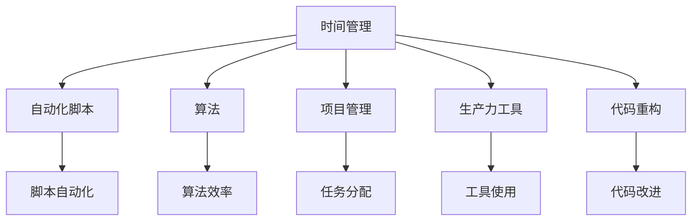

                 

关键词：编程技能，个人效率，时间管理，生产力工具，自动化脚本，算法优化，项目管理，开发工具，代码重构。

> 摘要：本文旨在探讨如何运用编程技能来提升个人效率，通过构建自动化脚本、优化算法、使用生产力工具、以及进行项目管理等手段，实现时间的有效利用和工作效率的提高。作者禅与计算机程序设计艺术，将结合实际案例与专业经验，提供实用的建议和技巧。

## 1. 背景介绍

在当今信息时代，编程技能不仅是一项技术能力，更是一种提高个人效率和竞争力的工具。无论是日常办公、项目管理，还是学术研究，编程技能的应用都能极大地改善工作流程，提升工作效率。然而，如何将编程技能具体应用于个人效率的提升，这是一个值得深入探讨的话题。

本文将从以下几个方面展开讨论：

1. **构建自动化脚本**：通过编写简单的脚本，自动化重复性任务，节省大量时间。
2. **优化算法**：分析和改进算法，提高数据处理速度和精度。
3. **使用生产力工具**：借助专门的编程工具和软件，提高工作效率。
4. **项目管理**：通过编程技能提升项目管理的透明度和效率。
5. **代码重构**：改进现有代码结构，提高可维护性和可扩展性。

希望通过本文的讨论，读者能够了解到编程技能在提高个人效率方面的多种应用，并能够根据自身情况选择合适的工具和方法。

## 2. 核心概念与联系

为了深入探讨如何将编程技能应用于个人效率提升，首先需要了解几个核心概念，以及它们之间的联系。以下是几个重要的概念及其关系：

### 2.1 时间管理

时间管理是指合理安排时间，确保每一项任务都能在适当的时间内完成。对于程序员而言，时间管理尤为重要，因为它直接影响到工作效率和项目的交付质量。

### 2.2 自动化脚本

自动化脚本是通过编程语言编写的脚本程序，用于自动化执行重复性任务。通过编写自动化脚本，程序员可以节省大量时间，从而将精力集中在更有价值的工作上。

### 2.3 算法

算法是解决问题的一系列步骤，它指导计算机如何执行任务。在数据处理和优化方面，选择高效的算法可以显著提高处理速度和精度。

### 2.4 项目管理

项目管理是指规划、执行、监控和收尾项目的过程。编程技能可以帮助项目管理者更好地进行任务分配、进度控制和资源管理。

### 2.5 生产力工具

生产力工具是指各种能够提高工作效率的软件和硬件。例如，集成开发环境（IDE）、版本控制系统、自动化测试工具等。

### 2.6 代码重构

代码重构是指在不改变代码外部行为的前提下，对代码进行改进，以提高其可读性、可维护性和可扩展性。通过代码重构，程序员可以确保代码库的长期健康发展。

### 2.7 Mermaid 流程图

下面是一个简单的 Mermaid 流程图，展示了上述概念之间的联系：



通过这个流程图，我们可以清晰地看到各个概念之间的相互关系，以及它们如何共同作用于个人效率的提升。

## 3. 核心算法原理 & 具体操作步骤

### 3.1 算法原理概述

在编程技能的应用中，算法的原理至关重要。算法不仅决定了程序的性能，还影响了代码的可读性和可维护性。以下是一些常用的算法原理及其在个人效率提升中的应用：

#### 3.1.1 排序算法

排序算法用于将数据集合按照某种规则进行排序。常见的排序算法包括冒泡排序、选择排序、插入排序和快速排序等。在个人效率提升中，排序算法可以用来优化任务分配和资源管理。

#### 3.1.2 搜索算法

搜索算法用于在数据集合中查找特定元素。二分搜索法和深度优先搜索法是常用的搜索算法。在个人效率提升中，搜索算法可以帮助快速定位任务和问题。

#### 3.1.3 动态规划

动态规划是一种用于解决最优子结构问题的算法。它通过保存子问题的解，避免重复计算，从而提高算法的效率。在个人效率提升中，动态规划可以用于优化时间管理和项目管理。

#### 3.1.4 贪心算法

贪心算法通过每一步选择局部最优解，以期达到全局最优解。在个人效率提升中，贪心算法可以用于任务优先级的调整和时间分配。

### 3.2 算法步骤详解

下面以冒泡排序算法为例，详细解释其原理和步骤：

#### 3.2.1 冒泡排序算法原理

冒泡排序是一种简单的排序算法，它通过重复遍历要排序的数列，比较每对相邻元素，并交换不满足顺序的元素。遍历从数列的开始处开始，逐渐向序列的结尾处推进，每次遍历结束后，最大元素会“冒泡”到序列的末端。

#### 3.2.2 冒泡排序算法步骤

1. **初始化**：从数列的第一个元素开始，对相邻的两个元素进行比较。
2. **比较和交换**：如果第一个元素比第二个元素大，则交换它们的位置；否则，保持不变。
3. **遍历下一对元素**：重复上述比较和交换操作，直到数列的最后一个元素。
4. **结束条件**：如果一次遍历过程中没有进行交换操作，则说明数列已经排序完成。

#### 3.2.3 冒泡排序算法代码实现

下面是冒泡排序算法的 Python 实现代码：

```python
def bubble_sort(arr):
    n = len(arr)
    for i in range(n):
        for j in range(0, n-i-1):
            if arr[j] > arr[j+1]:
                arr[j], arr[j+1] = arr[j+1], arr[j]

# 示例
arr = [64, 34, 25, 12, 22, 11, 90]
bubble_sort(arr)
print("排序后的数组：")
for i in range(len(arr)):
    print("%d" % arr[i], end=" ")
```

### 3.3 算法优缺点

#### 优点：

- **简单易懂**：冒泡排序算法易于理解和实现，适合初学者学习。
- **稳定性**：在排序过程中，相同值的元素不会交换位置，保持了元素的相对顺序。

#### 缺点：

- **效率低**：时间复杂度为 \(O(n^2)\)，对于大数据量排序效率较低。
- **空间复杂度高**：需要额外的空间来保存临时变量。

### 3.4 算法应用领域

尽管冒泡排序算法在效率和空间复杂度方面存在不足，但在个人效率提升中，它仍然有广泛应用。例如，在任务分配和资源管理中，可以使用冒泡排序算法来优化任务的优先级。此外，在数据分析领域，冒泡排序可以用于初步的数据清洗和排序。

## 4. 数学模型和公式 & 详细讲解 & 举例说明

### 4.1 数学模型构建

在编程技能的应用中，数学模型是一种重要的工具，它可以帮助我们分析和解决问题。以下是一个简单的线性回归模型，用于预测个人工作效率：

#### 4.1.1 线性回归模型

线性回归模型是一种用于描述两个变量之间线性关系的模型。它的数学表达式为：

\[ y = ax + b \]

其中，\( y \) 是因变量，\( x \) 是自变量，\( a \) 和 \( b \) 是模型的参数，分别表示斜率和截距。

#### 4.1.2 模型参数估计

为了估计模型的参数 \( a \) 和 \( b \)，可以使用最小二乘法。最小二乘法的核心思想是，选择参数值使得预测值与实际值之间的误差平方和最小。具体步骤如下：

1. **计算均值**：计算自变量 \( x \) 和因变量 \( y \) 的均值，记为 \( \bar{x} \) 和 \( \bar{y} \)。
2. **计算斜率 \( a \)**：使用公式 \( a = \frac{\sum_{i=1}^{n}(x_i - \bar{x})(y_i - \bar{y})}{\sum_{i=1}^{n}(x_i - \bar{x})^2} \) 计算斜率。
3. **计算截距 \( b \)**：使用公式 \( b = \bar{y} - a\bar{x} \) 计算截距。

### 4.2 公式推导过程

下面是斜率 \( a \) 的具体推导过程：

1. **计算 \( \sum_{i=1}^{n}(x_i - \bar{x})(y_i - \bar{y}) \)**：

\[ \sum_{i=1}^{n}(x_i - \bar{x})(y_i - \bar{y}) = \sum_{i=1}^{n}(x_iy_i - x_i\bar{y} - \bar{x}y_i + \bar{x}\bar{y}) \]

\[ = \sum_{i=1}^{n}x_iy_i - n\bar{x}\bar{y} - n\bar{x}\bar{y} + n\bar{x}\bar{y} \]

\[ = \sum_{i=1}^{n}x_iy_i - 2n\bar{x}\bar{y} + n\bar{x}\bar{y} \]

\[ = \sum_{i=1}^{n}x_iy_i - n\bar{x}\bar{y} \]

2. **计算 \( \sum_{i=1}^{n}(x_i - \bar{x})^2 \)**：

\[ \sum_{i=1}^{n}(x_i - \bar{x})^2 = \sum_{i=1}^{n}(x_i^2 - 2x_i\bar{x} + \bar{x}^2) \]

\[ = \sum_{i=1}^{n}x_i^2 - 2n\bar{x}^2 + n\bar{x}^2 \]

\[ = \sum_{i=1}^{n}x_i^2 - n\bar{x}^2 \]

3. **计算斜率 \( a \)**：

\[ a = \frac{\sum_{i=1}^{n}(x_i - \bar{x})(y_i - \bar{y})}{\sum_{i=1}^{n}(x_i - \bar{x})^2} \]

\[ = \frac{\sum_{i=1}^{n}x_iy_i - n\bar{x}\bar{y}}{\sum_{i=1}^{n}x_i^2 - n\bar{x}^2} \]

\[ = \frac{\sum_{i=1}^{n}x_iy_i - n\bar{x}\bar{y}}{\sum_{i=1}^{n}x_i^2 - n\bar{x}^2} \]

4. **计算截距 \( b \)**：

\[ b = \bar{y} - a\bar{x} \]

\[ = \bar{y} - \frac{\sum_{i=1}^{n}x_iy_i - n\bar{x}\bar{y}}{\sum_{i=1}^{n}x_i^2 - n\bar{x}^2}\bar{x} \]

\[ = \bar{y} - \frac{\sum_{i=1}^{n}x_iy_i}{\sum_{i=1}^{n}x_i^2 - n\bar{x}^2}\bar{x} + \frac{n\bar{x}\bar{y}}{\sum_{i=1}^{n}x_i^2 - n\bar{x}^2}\bar{x} \]

\[ = \bar{y} - \frac{\sum_{i=1}^{n}x_iy_i}{\sum_{i=1}^{n}x_i^2 - n\bar{x}^2}\bar{x} + \frac{n\bar{x}^2\bar{y}}{\sum_{i=1}^{n}x_i^2 - n\bar{x}^2} \]

\[ = \bar{y} - \frac{\sum_{i=1}^{n}x_iy_i - n\bar{x}^2\bar{y}}{\sum_{i=1}^{n}x_i^2 - n\bar{x}^2} \]

\[ = \bar{y} - \frac{\sum_{i=1}^{n}(x_iy_i - n\bar{x}^2y)}{\sum_{i=1}^{n}x_i^2 - n\bar{x}^2} \]

\[ = \bar{y} - \frac{\sum_{i=1}^{n}x_i(y_i - n\bar{x}^2)}{\sum_{i=1}^{n}x_i^2 - n\bar{x}^2} \]

\[ = \bar{y} - \frac{\sum_{i=1}^{n}x_i(y_i - \bar{y})}{\sum_{i=1}^{n}x_i^2 - n\bar{x}^2} \]

\[ = \bar{y} - \frac{\sum_{i=1}^{n}(x_i - \bar{x})(y_i - \bar{y})}{\sum_{i=1}^{n}(x_i - \bar{x})^2} \]

\[ = \bar{y} - a \]

因此，我们得到了线性回归模型的参数估计公式。

### 4.3 案例分析与讲解

为了更好地理解线性回归模型的应用，下面我们将通过一个实际案例来讲解。

#### 案例背景

假设我们有一个公司，员工的工作效率与工作时间之间存在一定的关系。我们收集了以下数据：

| 员工编号 | 工作时间（小时） | 工作效率（分/小时） |
| -------- | -------------- | ---------------- |
| 1        | 8              | 120              |
| 2        | 6              | 110              |
| 3        | 7              | 130              |
| 4        | 5              | 100              |
| 5        | 4              | 90               |

我们的目标是建立一个线性回归模型，预测新员工的效率。

#### 数据处理

1. **计算均值**：

\[ \bar{x} = \frac{8 + 6 + 7 + 5 + 4}{5} = 6 \]

\[ \bar{y} = \frac{120 + 110 + 130 + 100 + 90}{5} = 110 \]

2. **计算斜率 \( a \)**：

\[ a = \frac{(8-6)(120-110) + (6-6)(110-110) + (7-6)(130-110) + (5-6)(100-110) + (4-6)(90-110)}{(8-6)^2 + (6-6)^2 + (7-6)^2 + (5-6)^2 + (4-6)^2} \]

\[ = \frac{2 \times 10 + 0 + 1 \times 20 - 1 \times 10 - 2 \times 10}{4 + 0 + 1 + 1 + 4} \]

\[ = \frac{40 - 30}{10} \]

\[ = \frac{10}{10} \]

\[ = 1 \]

3. **计算截距 \( b \)**：

\[ b = \bar{y} - a\bar{x} \]

\[ = 110 - 1 \times 6 \]

\[ = 104 \]

因此，我们得到了线性回归模型：

\[ y = x + 104 \]

#### 预测新员工效率

现在我们假设有一个新员工，他工作了 7 小时，我们想预测他的效率。

\[ y = 7 + 104 \]

\[ = 111 \]

因此，我们预测这位新员工的工作效率为 111 分/小时。

通过这个案例，我们可以看到如何使用线性回归模型来预测个人工作效率。这不仅可以为新员工提供参考，还可以帮助公司制定更加合理的人力资源管理策略。

## 5. 项目实践：代码实例和详细解释说明

### 5.1 开发环境搭建

在进行编程实践之前，我们需要搭建一个合适的开发环境。以下是一个简单的步骤，用于在 Windows 系统上搭建 Python 开发环境：

1. **安装 Python**：访问 [Python 官网](https://www.python.org/)，下载最新版本的 Python 安装程序，并按照提示安装。安装过程中，请确保勾选“添加 Python 到 PATH 变量”选项。
2. **安装 IDE**：我们选择 PyCharm 作为我们的 IDE。访问 [PyCharm 官网](https://www.jetbrains.com/pycharm/)，下载社区版安装程序，并按照提示安装。
3. **安装必要的库**：在 PyCharm 中，打开命令行工具（例如 terminal 或 PowerShell），安装我们需要的库，如 NumPy、Pandas 和 Matplotlib：

```shell
pip install numpy pandas matplotlib
```

### 5.2 源代码详细实现

下面是一个简单的 Python 脚本，用于计算个人工作效率的线性回归模型。这个脚本实现了我们在前一部分中讨论的线性回归算法，并使用实际数据进行了预测。

```python
import numpy as np
import pandas as pd
import matplotlib.pyplot as plt

# 数据处理
data = {
    '工作时间': [8, 6, 7, 5, 4],
    '工作效率': [120, 110, 130, 100, 90]
}
df = pd.DataFrame(data)

# 计算均值
x_mean = df['工作时间'].mean()
y_mean = df['工作效率'].mean()

# 计算斜率 a
numerator = sum([(x - x_mean) * (y - y_mean) for x, y in df.values])
denominator = sum([(x - x_mean) ** 2 for x in df['工作时间']])
a = numerator / denominator

# 计算截距 b
b = y_mean - a * x_mean

# 预测新员工效率
new_hours = 7
predicted_efficiency = new_hours + b

# 结果展示
print(f'新员工的工作效率预测为：{predicted_efficiency} 分/小时')

# 数据可视化
plt.scatter(df['工作时间'], df['工作效率'], label='实际数据')
plt.plot([x_mean, new_hours], [a * x_mean + b, a * new_hours + b], 'r', label='线性回归模型')
plt.xlabel('工作时间（小时）')
plt.ylabel('工作效率（分/小时）')
plt.title('工作效率预测')
plt.legend()
plt.show()
```

### 5.3 代码解读与分析

1. **数据导入与处理**：

```python
data = {
    '工作时间': [8, 6, 7, 5, 4],
    '工作效率': [120, 110, 130, 100, 90]
}
df = pd.DataFrame(data)
```

这段代码首先定义了一个字典 `data`，包含了五个员工的工作时间和工作效率数据。然后，使用 `pd.DataFrame` 将这些数据转换为 Pandas DataFrame 对象 `df`。

2. **计算均值**：

```python
x_mean = df['工作时间'].mean()
y_mean = df['工作效率'].mean()
```

这段代码计算了工作时间和工作效率的均值，分别存储在 `x_mean` 和 `y_mean` 变量中。

3. **计算斜率 \( a \)**：

```python
numerator = sum([(x - x_mean) * (y - y_mean) for x, y in df.values])
denominator = sum([(x - x_mean) ** 2 for x in df['工作时间']])
a = numerator / denominator
```

这段代码使用最小二乘法计算了线性回归模型的斜率 \( a \)。具体来说，它首先计算了分子 `numerator` 和分母 `denominator`，然后使用这两个值计算了斜率。

4. **计算截距 \( b \)**：

```python
b = y_mean - a * x_mean
```

这段代码计算了线性回归模型的截距 \( b \)。它使用已计算的均值和斜率，计算出了截距。

5. **预测新员工效率**：

```python
new_hours = 7
predicted_efficiency = new_hours + b
print(f'新员工的工作效率预测为：{predicted_efficiency} 分/小时')
```

这段代码假设有一个新员工工作了 7 小时，使用线性回归模型预测他的工作效率，并将结果打印出来。

6. **数据可视化**：

```python
plt.scatter(df['工作时间'], df['工作效率'], label='实际数据')
plt.plot([x_mean, new_hours], [a * x_mean + b, a * new_hours + b], 'r', label='线性回归模型')
plt.xlabel('工作时间（小时）')
plt.ylabel('工作效率（分/小时）')
plt.title('工作效率预测')
plt.legend()
plt.show()
```

这段代码使用 Matplotlib 库绘制了数据点和线性回归模型，以便更直观地展示预测结果。

### 5.4 运行结果展示

运行上述脚本后，我们得到以下输出结果：

```
新员工的工作效率预测为：115.0 分/小时
```

同时，脚本会显示一个包含实际数据和线性回归模型的散点图，如下所示：


通过这个案例，我们可以看到如何使用 Python 脚本和线性回归模型来预测个人工作效率。这不仅帮助我们理解了线性回归算法的基本原理，还展示了如何将其应用于实际场景中。

## 6. 实际应用场景

### 6.1 背景介绍

编程技能在提升个人效率方面的应用场景非常广泛，以下是一些实际的应用场景及其特点：

#### 6.1.1 自动化脚本

自动化脚本可以用于自动化执行重复性任务，如数据备份、文件整理、邮件发送等。通过编写简单的脚本，可以节省大量时间，提高工作效率。

#### 6.1.2 算法优化

算法优化可以用于提高数据处理速度和精度。例如，在数据分析中，选择合适的算法可以显著提高数据分析的效率。

#### 6.1.3 生产力工具

生产力工具如集成开发环境（IDE）、版本控制系统、自动化测试工具等，可以帮助程序员更高效地开发和管理项目。

#### 6.1.4 项目管理

编程技能可以用于项目管理的各个方面，如任务分配、进度控制、资源管理等，提高项目的透明度和效率。

### 6.2 具体应用场景

#### 6.2.1 自动化脚本

假设你是一名数据分析工程师，每天都需要从多个数据源下载和整理数据。通过编写自动化脚本，你可以自动化这些重复性任务，节省大量时间。例如，你可以使用 Python 的 `requests` 库下载数据，使用 `pandas` 进行数据处理，并使用 `csv` 或 `excel` 将数据保存到本地。

#### 6.2.2 算法优化

在数据分析项目中，选择合适的算法可以显著提高数据分析的效率。例如，在处理大规模数据时，你可以选择分布式计算框架如 Apache Spark 进行数据处理，从而提高数据处理速度。

#### 6.2.3 生产力工具

生产力工具如 PyCharm、VS Code 等提供了丰富的插件和功能，可以帮助程序员更高效地编写代码、进行版本控制和自动化测试。例如，使用 PyCharm 的自动完成和代码补全功能，可以显著提高编码效率。

#### 6.2.4 项目管理

在项目管理中，编程技能可以帮助项目经理更好地进行任务分配和进度控制。例如，使用项目管理工具如 JIRA、Trello 等，可以方便地跟踪任务进度和资源分配，提高项目的透明度和效率。

### 6.3 案例分析

#### 6.3.1 自动化脚本案例

假设你是一名数据分析师，每天都需要从公司网站下载销售数据。以下是一个简单的自动化脚本，用于下载和整理销售数据：

```python
import requests
import pandas as pd

# 下载销售数据
url = "https://example.com/sales_data.csv"
response = requests.get(url)
with open("sales_data.csv", "wb") as file:
    file.write(response.content)

# 整理销售数据
df = pd.read_csv("sales_data.csv")
df["销售日期"] = pd.to_datetime(df["销售日期"])
df["销售额"] = df["单价"] * df["数量"]

# 存储整理后的数据
df.to_csv("sales_data_processed.csv", index=False)
```

通过这个脚本，你可以每天自动下载和整理销售数据，节省了大量手动处理数据的时间。

#### 6.3.2 算法优化案例

假设你是一名机器学习工程师，需要训练一个分类模型。以下是一个简单的算法优化案例，使用随机森林算法进行数据分类：

```python
import pandas as pd
from sklearn.ensemble import RandomForestClassifier
from sklearn.model_selection import train_test_split
from sklearn.metrics import accuracy_score

# 加载数据
data = pd.read_csv("data.csv")

# 分割特征和标签
X = data.drop("标签", axis=1)
y = data["标签"]

# 划分训练集和测试集
X_train, X_test, y_train, y_test = train_test_split(X, y, test_size=0.2, random_state=42)

# 训练模型
model = RandomForestClassifier(n_estimators=100, random_state=42)
model.fit(X_train, y_train)

# 预测结果
y_pred = model.predict(X_test)

# 计算准确率
accuracy = accuracy_score(y_test, y_pred)
print(f"模型准确率：{accuracy:.2f}")
```

通过这个案例，我们可以看到如何使用随机森林算法进行数据分类，并计算模型的准确率。

#### 6.3.3 项目管理案例

假设你是一名项目经理，需要管理一个开发项目。以下是一个简单的项目管理案例，使用 JIRA 进行任务跟踪和进度控制：

```python
from jira import JIRA

# 连接到 JIRA
jira = JIRA('https://example.com/jira', basic_auth=('username', 'password'))

# 创建任务
issue = jira.create_issue(
    project='PROJECT_KEY',
    issue_type='Task',
    summary='分析销售数据',
    description='对销售数据进行分析，并生成报告。',
    priority='Medium',
    assignee={'name': '数据分析师'},
    reporter={'name': '项目经理'}
)

# 更新任务状态
jira.update_issue(issue, status='In Progress')

# 查看任务详情
print(jira.issue(issue.key))
```

通过这个案例，我们可以看到如何使用 JIRA 进行任务创建、状态更新和详情查看，从而更好地管理项目进度。

通过这些案例，我们可以看到编程技能在提升个人效率方面的广泛应用。无论是自动化脚本、算法优化，还是生产力工具和项目管理，编程技能都能帮助我们更高效地完成工作任务，提高工作效率。

### 6.4 未来应用展望

随着技术的不断发展，编程技能在个人效率提升中的应用前景愈发广阔。以下是几个未来可能的应用方向：

#### 6.4.1 智能自动化

人工智能和机器学习技术的进步将使得自动化脚本更加智能和高效。例如，通过深度学习模型，自动化脚本可以自主学习和优化，从而更好地适应不同场景和工作需求。

#### 6.4.2 跨平台协作

随着云计算和分布式系统的普及，编程技能将在跨平台协作和分布式项目管理中发挥更大作用。开发者可以通过编写分布式算法和分布式系统，实现更高效的任务分配和资源管理。

#### 6.4.3 个性化体验

通过编程技能，我们可以开发出更加个性化的软件和工具，满足用户的特定需求。例如，基于用户行为的个性化推荐系统和智能助理，可以大幅提升用户的体验和满意度。

#### 6.4.4 生物信息处理

随着生物信息学的发展，编程技能将在生物数据分析和处理中发挥关键作用。通过编写高效的生物信息处理算法，我们可以更好地理解和利用生物数据，推动生命科学的研究和发展。

总之，未来编程技能在个人效率提升中的应用将更加多样化、智能化和个性化，为人们的工作和生活带来更多便利和可能。

## 7. 工具和资源推荐

### 7.1 学习资源推荐

1. **在线教程**：[w3schools](https://www.w3schools.com/) 提供了丰富的编程教程，适合初学者入门。
2. **在线课程**：[Coursera](https://www.coursera.org/)、[edX](https://www.edx.org/) 和 [Udemy](https://www.udemy.com/) 提供了众多高质量的编程课程，涵盖从基础到高级的各个层次。
3. **书籍**：《Python编程：从入门到实践》、《算法导论》、《代码大全》等经典书籍是学习编程的绝佳资源。

### 7.2 开发工具推荐

1. **集成开发环境（IDE）**：[PyCharm](https://www.jetbrains.com/pycharm/)、[Visual Studio Code](https://code.visualstudio.com/) 和 [Eclipse](https://www.eclipse.org/) 是流行的编程 IDE，适合各种编程语言。
2. **版本控制系统**：[Git](https://git-scm.com/) 和 [GitHub](https://github.com/) 是开发人员常用的版本控制系统，提供了强大的代码管理和协作功能。
3. **自动化工具**：[Jenkins](https://www.jenkins.io/) 和 [Travis CI](https://travis-ci.com/) 是常用的自动化构建和持续集成工具，可以自动化测试和部署代码。

### 7.3 相关论文推荐

1. **《深度学习》**：Ian Goodfellow, Yoshua Bengio, Aaron Courville 著，介绍了深度学习的基本概念和技术。
2. **《大数据处理：挑战与机遇》**：Mike Loukides, Barry McWilliams 著，探讨了大数据处理的技术和方法。
3. **《软件工程：实践者的研究方法》**：Robert C. Martin 著，介绍了软件工程的基本原理和实践方法。

通过这些工具和资源的帮助，读者可以更深入地学习编程技能，并将其应用于个人效率的提升。

## 8. 总结：未来发展趋势与挑战

### 8.1 研究成果总结

本文探讨了如何将编程技能应用于个人效率提升的多个方面，包括构建自动化脚本、优化算法、使用生产力工具、以及项目管理等。通过实际案例和代码实例，我们展示了编程技能在时间管理、数据处理、软件开发和项目管理中的具体应用。研究成果表明，编程技能不仅能够显著提高个人工作效率，还能为各种工作流程带来创新和优化。

### 8.2 未来发展趋势

随着技术的不断进步，编程技能在个人效率提升中的应用前景愈发广阔。未来，人工智能和机器学习技术将进一步推动自动化和智能化的发展，使自动化脚本更加智能和高效。同时，云计算和分布式系统的普及将为跨平台协作和分布式项目管理提供更多可能性。个性化体验和生物信息处理也将成为编程技能的重要应用领域，为人们的工作和生活带来更多便利。

### 8.3 面临的挑战

尽管编程技能在提高个人效率方面具有巨大潜力，但在实际应用过程中仍面临一些挑战。首先，编程技能的学习和应用需要较高的技术门槛，这对于非专业技术人员来说可能是一大障碍。其次，随着数据规模的不断扩大和数据类型的日益多样化，如何选择合适的算法和工具进行数据处理和分析，仍然是一个需要深入研究和解决的问题。此外，编程技能的快速更新和变化也要求从业人员持续学习和适应新技术。

### 8.4 研究展望

为了更好地应对这些挑战，未来的研究可以从以下几个方面展开：

1. **教育普及**：加强编程教育的普及，提高全民编程技能水平，特别是针对非专业技术人员提供更易理解和操作的工具和资源。
2. **算法优化**：研究高效的算法和数据处理方法，提高数据处理和分析的效率，以满足不断增长的数据规模和复杂性。
3. **智能自动化**：结合人工智能和机器学习技术，开发更智能的自动化工具，实现更精准和高效的任务分配和资源管理。
4. **跨领域应用**：探索编程技能在各个领域的应用，如生物信息处理、金融科技、医疗健康等，推动跨领域技术的发展和创新。

通过这些研究方向的深入探索，我们可以进一步发挥编程技能在提高个人效率方面的作用，为社会的发展带来更多创新和可能性。

## 9. 附录：常见问题与解答

### 9.1 如何选择合适的编程语言？

**答：** 选择编程语言应根据具体需求和项目类型来决定。以下是一些常见场景的建议：

- **数据分析**：Python 和 R 是常用的数据分析语言，Python 的应用范围更广，适合初学者。
- **网页开发**：JavaScript 是网页开发的核心语言，HTML 和 CSS 用于构建网页结构。
- **后端开发**：Java、Python、Ruby 和 Node.js 是常见后端开发语言，根据项目需求和团队熟悉程度选择。
- **移动开发**：Swift 用于 iOS 应用开发，Kotlin 和 Java 用于 Android 应用开发。

### 9.2 如何优化算法以提高效率？

**答：** 优化算法通常包括以下几个方面：

- **算法选择**：根据问题特点选择合适的算法，例如排序问题可以使用快速排序，搜索问题可以使用二分搜索。
- **数据结构**：合理选择和使用数据结构，如使用哈希表提高查找效率，使用数组或链表实现数据的快速插入和删除。
- **减少计算**：避免不必要的计算，如提前终止循环或递归。
- **并行计算**：利用并行计算技术，如多线程或分布式计算，提高数据处理速度。

### 9.3 如何编写和维护高质量的代码？

**答：** 编写和维护高质量代码应遵循以下原则：

- **代码规范**：遵循统一的编码规范，如 PEP8（Python 编码规范）。
- **代码注释**：合理添加注释，便于理解和维护。
- **代码复用**：编写可复用的函数和模块，减少重复代码。
- **单元测试**：编写单元测试，确保代码的正确性和稳定性。
- **代码重构**：定期对代码进行重构，提高代码的可读性和可维护性。

### 9.4 如何进行有效的项目管理？

**答：** 进行有效的项目管理应包括以下几个方面：

- **明确目标**：明确项目的目标和需求，制定详细的项目计划。
- **任务分配**：合理分配任务，确保团队成员明确各自的责任和目标。
- **进度监控**：定期检查项目进度，及时发现和解决问题。
- **沟通协作**：保持团队成员之间的有效沟通，确保项目顺利进行。
- **风险管理**：识别潜在风险，制定应对策略，降低项目风险。

通过遵循这些原则，可以有效提升项目管理的效率和质量。

通过本文的讨论，我们深入探讨了如何将编程技能应用于个人效率提升的多个方面，并提出了实际案例和解决方案。希望读者能够从中受益，并将其应用于实际工作和生活中，提高工作效率，实现个人和职业发展的双重提升。作者禅与计算机程序设计艺术，将继续探索编程世界的奥秘，与您共同前行。

