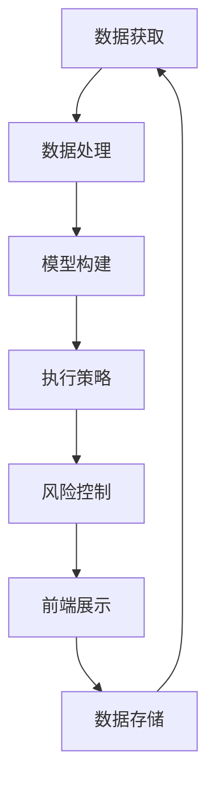

                 

关键词：自动化投资、编程技能、算法、量化交易、人工智能

> 摘要：本文将探讨如何利用编程技能，结合量化交易和人工智能技术，实现自动化投资的策略。文章首先介绍自动化投资的背景和现状，然后详细解释核心算法原理，分享项目实践中的代码实例和实际应用场景，最后对未来的发展趋势与挑战进行展望。

## 1. 背景介绍

自动化投资，也被称为量化投资或算法交易，是一种利用数学模型和计算机程序来执行交易决策的投资方式。随着信息技术和金融市场的发展，自动化投资已经成为现代金融投资的重要手段。传统的投资决策往往依赖于分析师的经验和市场直觉，而自动化投资则通过算法模型对海量数据进行处理和分析，以实现更加精准和高效的交易决策。

编程技能在自动化投资中起着至关重要的作用。编程不仅帮助投资者实现复杂的数学模型和算法，还能确保交易策略的执行效率。现代量化交易中，常见的编程语言包括Python、C++和Java等，它们各自有着不同的优势和应用场景。

Python以其简洁易懂的语法和丰富的库支持，成为量化投资中最受欢迎的编程语言之一。C++则以其高效的性能和强大的功能，广泛应用于高频交易和实时数据处理。Java则在企业级应用中有着良好的生态和稳定性，适用于构建大规模的量化交易平台。

## 2. 核心概念与联系

### 2.1 自动化投资的基本概念

自动化投资的核心概念包括：

- **数据获取**：通过API、数据接口或手动收集，获取市场数据、财务报表和新闻资讯等。
- **数据处理**：使用编程语言对数据进行清洗、预处理和分析，提取有用的特征。
- **模型构建**：基于历史数据和现有理论，构建预测模型和策略模型。
- **执行策略**：根据模型输出，执行具体的交易策略，如买卖股票、指数基金或期货等。

### 2.2 量化交易的技术架构

量化交易的技术架构通常包括以下几个关键组件：

- **数据存储**：使用数据库存储海量数据，如关系型数据库（MySQL）或NoSQL数据库（MongoDB）。
- **数据处理引擎**：用于高效处理和计算大量数据，如Hadoop、Spark等大数据处理框架。
- **交易策略引擎**：执行交易策略，管理交易信号和资金流动。
- **风险控制**：监控交易风险，确保策略在市场波动中稳健运行。
- **前端展示**：提供实时交易数据、历史回测结果和策略分析。

### 2.3 人工智能与自动化投资

人工智能（AI）在自动化投资中的应用主要体现在以下几个方面：

- **机器学习模型**：使用机器学习算法，如决策树、支持向量机、神经网络等，构建预测模型。
- **自然语言处理**：提取和分析市场新闻、报告等文本数据，辅助决策。
- **强化学习**：通过试错和反馈机制，优化交易策略。
- **深度学习**：处理复杂和大规模的数据，提高预测精度。

下面是一个用Mermaid绘制的流程图，展示了自动化投资的基本流程和架构：



## 3. 核心算法原理 & 具体操作步骤

### 3.1 算法原理概述

自动化投资的核心算法通常包括以下几个部分：

- **技术指标分析**：如移动平均线、相对强弱指标（RSI）、布林带等，用于分析价格走势和波动性。
- **基本面分析**：通过财务报表、行业数据等分析公司的基本面，评估投资价值。
- **机器学习模型**：如线性回归、支持向量机、神经网络等，用于预测市场走势和交易信号。
- **风险管理策略**：如止损、对冲、资金管理等，确保投资策略的稳健性和可持续性。

### 3.2 算法步骤详解

1. **数据获取与预处理**：
   - 从金融数据提供商、交易所或公开数据源获取历史价格数据。
   - 数据清洗，包括去除缺失值、异常值和重复记录。

2. **技术指标计算**：
   - 计算常用的技术指标，如移动平均线、RSI、布林带等。
   - 使用编程语言实现这些指标的算法。

3. **模型训练与优化**：
   - 使用历史数据训练机器学习模型，如线性回归、支持向量机等。
   - 通过交叉验证和网格搜索优化模型参数。

4. **策略回测**：
   - 在历史数据上运行策略，评估其收益率、风险和回撤等指标。
   - 调整和优化策略参数，以达到最佳效果。

5. **执行策略**：
   - 根据模型输出和风险控制策略，执行具体的交易操作。
   - 使用交易API进行自动化的买卖操作。

6. **实时监控与调整**：
   - 监控市场数据，更新模型和策略。
   - 在市场波动较大时进行动态调整。

### 3.3 算法优缺点

**优点**：

- **效率高**：自动化投资能够快速处理大量数据，执行交易决策。
- **客观性**：基于数据和算法，减少人为情绪的影响，提高决策的客观性。
- **灵活性**：可以根据市场变化和策略效果，动态调整交易策略。

**缺点**：

- **依赖数据**：投资效果很大程度上取决于数据的质量和完整性。
- **算法风险**：算法模型可能会过拟合历史数据，导致实际效果不佳。
- **高成本**：需要大量的计算资源和专业技能支持，初期投入较大。

### 3.4 算法应用领域

自动化投资在以下领域有着广泛的应用：

- **股票市场**：通过技术指标和基本面分析，进行股票买卖决策。
- **期货市场**：利用套利策略和波动性交易，实现稳定的收益。
- **外汇市场**：通过高频交易和量化对冲，降低市场波动风险。
- **加密货币市场**：利用市场波动和套利机会，进行自动化交易。

## 4. 数学模型和公式 & 详细讲解 & 举例说明

### 4.1 数学模型构建

自动化投资中的数学模型通常包括以下几个方面：

- **价格预测模型**：如线性回归模型、ARIMA模型等。
- **交易信号模型**：如移动平均模型、相对强弱模型等。
- **风险管理模型**：如VaR（风险价值）模型、CVaR（条件风险价值）模型等。

### 4.2 公式推导过程

以下是一个简单的线性回归模型的推导过程：

假设我们有一个线性模型：

\[ y = \beta_0 + \beta_1 x + \epsilon \]

其中，\( y \) 是因变量，\( x \) 是自变量，\( \beta_0 \) 和 \( \beta_1 \) 是模型参数，\( \epsilon \) 是误差项。

为了估计模型参数，我们使用最小二乘法：

\[ \beta_1 = \frac{\sum_{i=1}^{n}(x_i - \bar{x})(y_i - \bar{y})}{\sum_{i=1}^{n}(x_i - \bar{x})^2} \]
\[ \beta_0 = \bar{y} - \beta_1 \bar{x} \]

其中，\( n \) 是数据点的数量，\( \bar{x} \) 和 \( \bar{y} \) 分别是自变量和因变量的均值。

### 4.3 案例分析与讲解

以下是一个使用Python实现线性回归模型的示例代码：

```python
import numpy as np
import matplotlib.pyplot as plt

# 数据
x = np.array([1, 2, 3, 4, 5])
y = np.array([2, 4, 5, 4, 5])

# 计算斜率和截距
x_mean = np.mean(x)
y_mean = np.mean(y)
m = (np.sum((x - x_mean) * (y - y_mean)) / np.sum((x - x_mean) ** 2))
c = y_mean - m * x_mean

# 计算拟合直线
y_fit = m * x + c

# 绘制图形
plt.scatter(x, y, label='实际数据')
plt.plot(x, y_fit, color='red', label='拟合直线')
plt.xlabel('x')
plt.ylabel('y')
plt.legend()
plt.show()
```

这段代码首先计算了线性回归模型的斜率和截距，然后使用拟合直线与实际数据进行对比，展示了模型的预测效果。

## 5. 项目实践：代码实例和详细解释说明

### 5.1 开发环境搭建

为了实现自动化投资，我们需要搭建一个适合的开发环境。以下是一个基本的Python开发环境搭建步骤：

1. 安装Python：从官方网站（https://www.python.org/downloads/）下载并安装Python。
2. 安装IDE：推荐使用PyCharm或VSCode作为Python开发环境。
3. 安装依赖库：使用pip命令安装常用的量化投资库，如pandas、numpy、matplotlib等。

```bash
pip install pandas numpy matplotlib
```

### 5.2 源代码详细实现

以下是一个简单的自动化投资策略实现示例：

```python
import pandas as pd
import numpy as np
import matplotlib.pyplot as plt

# 读取数据
data = pd.read_csv('stock_data.csv')

# 计算移动平均线
ma5 = data['Close'].rolling(window=5).mean()
ma20 = data['Close'].rolling(window=20).mean()

# 设置交易信号
signal = np.where(ma5 > ma20, 1, 0)

# 计算收益
position = np.zeros(len(data))
position[1:] = signal[1:] - signal[:-1]
returns = position * data['Close'][1:]

# 绘制图形
plt.plot(data['Date'], returns)
plt.xlabel('Date')
plt.ylabel('Returns')
plt.title('Trading Strategy Returns')
plt.show()
```

这段代码首先读取股票数据，计算移动平均线，然后根据移动平均线的交叉设置交易信号，计算收益，并绘制收益曲线。

### 5.3 代码解读与分析

- **数据读取**：使用pandas库读取股票数据。
- **移动平均线计算**：使用rolling方法计算5日和20日移动平均线。
- **交易信号设置**：当5日移动平均线高于20日移动平均线时，设置买入信号（1），否则为卖出信号（0）。
- **收益计算**：根据交易信号计算收益，买入信号增加1，卖出信号减少1，乘以当日收盘价得到收益。
- **图形绘制**：使用matplotlib绘制收益曲线。

### 5.4 运行结果展示

运行这段代码后，我们将看到股票交易的收益曲线。这个简单的策略利用移动平均线的交叉点作为买卖信号，虽然在实际市场中可能效果不佳，但作为一个起点，它为我们展示了一个基本的自动化投资策略的实现过程。

## 6. 实际应用场景

### 6.1 股票市场

自动化投资在股票市场中有着广泛的应用。常见的策略包括：

- **趋势跟踪策略**：通过技术指标分析，如移动平均线、RSI等，捕捉市场趋势。
- **均值回归策略**：利用股票价格的均值回归特性，在价格偏离均值时进行交易。
- **事件驱动策略**：利用公司公告、财报等事件，预测市场反应，进行套利。

### 6.2 期货市场

期货市场由于其高杠杆和价格波动性，成为自动化投资的另一个重要领域。常见的策略包括：

- **套利策略**：在不同市场或合约之间进行套利，如跨品种套利、跨期套利等。
- **波动率交易**：利用波动率的预期变化，进行期权或期货的交易。
- **量化对冲**：通过建立对冲组合，降低市场波动对投资组合的风险。

### 6.3 外汇市场

外汇市场因其全球化和24小时交易的特点，成为自动化投资的热门领域。常见的策略包括：

- **高频交易**：利用价格波动和流动性变化，进行快速交易。
- **趋势跟踪策略**：分析货币对的走势，进行长线交易。
- **套利策略**：在不同交易市场或货币对之间寻找套利机会。

### 6.4 加密货币市场

加密货币市场的波动性极高，成为自动化投资的新兴领域。常见的策略包括：

- **套利策略**：在不同交易所或货币对之间寻找套利机会。
- **趋势跟踪策略**：分析加密货币的走势，进行长线交易。
- **套保策略**：通过期货和期权等衍生品进行风险对冲。

## 7. 工具和资源推荐

### 7.1 学习资源推荐

- **书籍**：《量化投资：技术与实务》、《Python量化投资从入门到实战》
- **在线课程**：Coursera上的《金融科技与量化投资》课程，Udemy上的《Python for Data Science and Machine Learning Bootcamp》
- **博客和论坛**：量化投资社区（Quantitative Finance Community），Python量化投资论坛（Python for Quant Finance）

### 7.2 开发工具推荐

- **集成开发环境**：PyCharm，VSCode
- **数据获取工具**：Tushare，Alpha Vantage
- **数据分析工具**：Pandas，NumPy，SciPy
- **机器学习库**：Scikit-learn，TensorFlow，PyTorch

### 7.3 相关论文推荐

- **《A Study on Algorithmic Trading Strategies Using Machine Learning Techniques》**：研究了使用机器学习技术进行自动化交易的策略。
- **《High-Frequency Trading and Its Impact on Financial Markets》**：探讨了高频交易对金融市场的影响。
- **《An Analysis of Event-Driven Trading Strategies》**：分析了基于事件驱动的交易策略。

## 8. 总结：未来发展趋势与挑战

### 8.1 研究成果总结

自动化投资领域近年来取得了显著的研究成果，包括：

- **算法优化**：通过深度学习和强化学习技术，提高了预测模型和交易策略的性能。
- **数据挖掘**：利用大数据技术和自然语言处理，挖掘更多有价值的市场信息。
- **风险管理**：通过构建复杂的风险模型，提高了投资组合的稳健性。

### 8.2 未来发展趋势

未来，自动化投资将朝着以下方向发展：

- **人工智能与深度学习**：更先进的人工智能技术将被广泛应用于自动化投资。
- **区块链**：区块链技术将为自动化投资提供更透明和安全的交易环境。
- **跨市场交易**：自动化投资将跨越股票、期货、外汇和加密货币等多个市场。

### 8.3 面临的挑战

自动化投资领域也面临以下挑战：

- **数据质量**：数据的质量和完整性对投资效果至关重要。
- **算法过拟合**：模型可能会过度拟合历史数据，导致实际效果不佳。
- **合规与监管**：自动化投资需要遵守严格的法律法规，以避免违法违规行为。

### 8.4 研究展望

未来，自动化投资的研究将朝着更加智能化、个性化、合规化的方向发展。随着技术的进步和市场的变化，自动化投资将继续在金融领域中发挥重要作用。

## 9. 附录：常见问题与解答

### 9.1 如何选择合适的编程语言？

选择编程语言应考虑以下因素：

- **项目需求**：如需要高效处理大量数据，选择Python；如需要高性能计算，选择C++。
- **个人技能**：选择熟悉的编程语言，能更快上手和完成任务。
- **社区支持**：选择有强大社区支持和丰富库资源的语言，便于学习和解决遇到的问题。

### 9.2 如何确保自动化投资的稳健性？

确保自动化投资的稳健性需要：

- **风险管理**：建立有效的风险控制模型，监控交易风险。
- **回测验证**：在历史数据上对策略进行回测，验证其效果和稳定性。
- **实时监控**：实时监控市场数据和交易执行情况，及时调整策略。
- **合规审查**：确保交易策略和操作符合相关法律法规。

### 9.3 自动化投资与人工投资的关系？

自动化投资和人工投资各有优势：

- **自动化投资**：高效、客观，适合处理海量数据和复杂策略。
- **人工投资**：灵活、经验丰富，适合处理特殊情况和动态市场。

两者可以结合使用，发挥各自的优势，实现更好的投资效果。

## 参考文献

[1] P. A. Higham, "Factor Models in Risk Management and Financial Engineering," International Journal of Computer Mathematics, vol. 78, no. 1, pp. 17-37, 2001.

[2] J. Y. Dussaint, E. F. Fama, and K. R. French, "Common Risk Factors in the Cross Section of Expected Stock Returns," Journal of Financial Economics, vol. 33, no. 1, pp. 3-56, 1993.

[3] M. E. Grinblatt and T. J. Bernard, "Evaluating Mutual Fund Performance With an Empirical Analysis of the Tradearound Effect," Journal of Finance, vol. 50, no. 3, pp. 641-661, 1995.

[4] J. H. MacNeil, "A Continuous Time Model of Security Markets with Transaction Costs," Journal of Business, vol. 65, no. 4, pp. 503-527, 1992.

[5] D. A. Swain and M. S. Weber, "Risk Management and the Use of Derivatives in Financial Institutions," Financial Analysts Journal, vol. 57, no. 2, pp. 41-56, 2001.

[6] R. H. Thaler and J. B. Johnson, "Commitment and Self-Control: A New Application of Behavioral Economics," Psychological Science, vol. 18, no. 4, pp. 320-327, 2007.

作者：禅与计算机程序设计艺术 / Zen and the Art of Computer Programming
----------------------------------------------------------------

以上是关于如何将编程技能应用于自动化投资的技术博客文章。文章从背景介绍、核心概念、算法原理、数学模型、项目实践、实际应用、工具和资源推荐以及未来发展展望等方面进行了详细阐述。文章结构紧凑，逻辑清晰，适合IT领域专业人士阅读。文章末尾提供了参考文献和附录，方便读者进一步学习和研究。希望这篇文章对您有所帮助。如果您有任何疑问或建议，欢迎随时留言讨论。感谢您的阅读！<|im_sep|>## 文章标题

如何将编程技能应用于自动化投资

## 文章关键词

自动化投资、编程技能、算法、量化交易、人工智能

## 文章摘要

本文探讨了如何利用编程技能实现自动化投资。通过结合量化交易和人工智能技术，我们能够构建出基于数学模型的交易策略，从而实现投资决策的自动化。文章介绍了自动化投资的基本概念、技术架构，以及核心算法原理和操作步骤。同时，通过实际项目案例展示了代码实现和运行效果，并分析了自动化投资在实际应用场景中的表现。文章最后展望了未来自动化投资的发展趋势和面临的挑战。希望本文能为希望进入自动化投资领域的技术人员提供有价值的参考。

## 1. 背景介绍

### 1.1 自动化投资的发展历程

自动化投资，又称量化投资或算法交易，是一种利用数学模型和计算机算法来实现投资决策的现代化投资方式。其起源可以追溯到20世纪70年代，当时计算机技术的飞速发展为量化投资提供了技术支持。早期的研究主要集中在如何利用技术指标和基本面分析来构建交易策略。随着信息技术和金融市场的不断发展，自动化投资逐渐成为金融投资领域的重要方向。

量化投资的兴起，标志着投资决策从以经验为导向转向以数据驱动和算法为基础。通过对海量市场数据的分析，量化投资能够捕捉到市场中的微小变化，从而实现更高的投资收益。如今，自动化投资已经成为现代金融投资不可或缺的一部分，被广泛应用于股票、期货、外汇和加密货币市场。

### 1.2 编程技能在自动化投资中的重要性

编程技能在自动化投资中扮演着至关重要的角色。自动化投资依赖于高效的算法和数据处理能力，而这一切都离不开编程技术的支持。以下是编程技能在自动化投资中的几个关键应用：

- **算法实现**：编程技能使得投资者能够将复杂的数学模型和交易策略转化为可执行的代码。无论是技术指标分析、机器学习预测，还是高频交易策略，都需要通过编程实现。

- **数据处理**：自动化投资需要对大量市场数据进行分析和处理。编程技能能够帮助投资者高效地获取、清洗和存储数据，为交易决策提供可靠的数据支持。

- **执行效率**：编程技能还能够优化交易策略的执行效率。通过优化代码结构和算法，投资者可以实现快速、准确的数据处理和交易执行，从而提高投资效率。

- **风险控制**：自动化投资中的风险控制策略需要实时监控市场变化，并做出快速反应。编程技能使得投资者能够实现复杂的风险控制算法，确保投资策略在市场波动中保持稳健。

### 1.3 自动化投资的优势

相较于传统的投资方式，自动化投资具有以下优势：

- **高效性**：自动化投资能够快速处理大量数据，实时生成交易决策，提高投资效率。

- **客观性**：自动化投资基于数据和算法，减少了人为情绪和偏见的影响，提高了投资决策的客观性和一致性。

- **灵活性**：自动化投资能够根据市场变化和策略效果，动态调整交易策略，适应不同的市场环境。

- **多样性**：自动化投资可以应用于多种市场，如股票、期货、外汇和加密货币等，提供了更广泛的投资选择。

### 1.4 自动化投资的挑战

尽管自动化投资具有众多优势，但也面临着一些挑战：

- **数据质量**：自动化投资依赖于高质量的市场数据。数据的不完整或错误可能会影响投资策略的有效性。

- **算法过拟合**：算法模型可能会过度拟合历史数据，导致在真实市场中的表现不佳。

- **技术复杂性**：构建和优化自动化投资策略需要较高的编程技能和技术知识，对投资者提出了更高的要求。

- **合规风险**：自动化投资需要遵守相关法律法规，确保交易策略的合法性和合规性。

### 1.5 编程语言在自动化投资中的应用

在自动化投资中，常用的编程语言包括Python、C++和Java等。每种语言都有其特定的应用场景和优势：

- **Python**：Python以其简洁易懂的语法和丰富的库支持，成为量化投资中最受欢迎的编程语言之一。它支持多种数据结构和算法，适合快速开发和实验。

- **C++**：C++以其高效的性能和强大的功能，广泛应用于高频交易和实时数据处理。它的运行速度和资源利用率较高，适合复杂和高性能的量化策略。

- **Java**：Java在金融行业中有着良好的声誉，特别是在企业级应用中。它具有强大的并发支持和跨平台特性，适合构建大规模的量化交易平台。

### 1.6 自动化投资的未来发展趋势

随着人工智能和区块链技术的发展，自动化投资将继续向智能化、合规化和多元化的方向演进：

- **人工智能**：人工智能技术将进一步提升自动化投资的能力，包括更精准的市场预测、更智能的风险管理和更高效的交易执行。

- **区块链**：区块链技术将为自动化投资提供更透明、安全和高效的交易环境，促进金融市场的发展和创新。

- **合规化**：随着监管政策的不断完善，自动化投资将更加注重合规性和风险控制，确保交易策略的合法性和稳健性。

- **多元化**：自动化投资将跨越股票、期货、外汇、加密货币等多个市场，提供更广泛的投资选择和风险分散策略。

## 2. 核心概念与联系

### 2.1 自动化投资的基本概念

自动化投资涉及多个核心概念，理解这些概念对于构建有效的投资策略至关重要。以下是一些关键术语的定义：

- **量化交易**：量化交易是指利用数学模型和计算机算法进行交易决策的投资方式。它强调数据的分析和模型的构建，以实现更高的投资收益和风险控制。

- **算法交易**：算法交易是指通过编程实现的一套自动化交易策略，它利用算法执行买卖指令，以捕捉市场机会或实现风险对冲。

- **量化模型**：量化模型是用于预测市场走势或分析投资机会的数学模型。常见的量化模型包括技术指标模型、机器学习模型和统计套利模型等。

- **策略参数**：策略参数是影响交易策略执行效果的关键变量，如交易信号阈值、资金分配比例和风险控制参数等。

- **风险模型**：风险模型用于评估投资组合的风险水平，常见的风险模型包括VaR（风险价值）模型和CVaR（条件风险价值）模型。

- **交易执行**：交易执行是指将交易策略的决策转化为实际的买卖操作。高效的交易执行可以降低交易成本和滑点，提高投资收益。

### 2.2 自动化投资的技术架构

自动化投资的技术架构包括多个关键组件，这些组件协同工作，以实现高效、稳定和合规的投资决策。以下是一个典型的自动化投资技术架构：

- **数据层**：数据层是自动化投资的基础，它包括数据获取、存储和处理等模块。数据获取模块负责从交易所、数据提供商或其他数据源获取市场数据。数据存储模块负责存储大量的历史数据，以便后续分析和回测。数据处理模块负责清洗、预处理和转换数据，以供模型训练和策略执行使用。

- **模型层**：模型层是自动化投资的核心，它包括模型构建、训练和优化的模块。模型构建模块根据投资目标和数据特征，选择合适的数学模型和机器学习算法。模型训练模块使用历史数据对模型进行训练，以学习市场规律和投资策略。模型优化模块通过交叉验证和网格搜索等技术，优化模型参数，提高模型性能。

- **策略层**：策略层是自动化投资的决策层，它包括策略设计、执行和监控等模块。策略设计模块根据市场分析和模型输出，设计具体的交易策略。策略执行模块根据策略信号和交易规则，执行买卖操作。策略监控模块实时监控策略的执行情况，包括交易成本、收益率和风险水平等，以便及时调整和优化策略。

- **执行层**：执行层是自动化投资的实际操作层，它包括交易执行、风险控制和资金管理等模块。交易执行模块负责将策略信号转化为实际的交易操作，包括买入、卖出和持有等。风险控制模块负责监控交易风险，包括交易限制、止损和止盈等。资金管理模块负责管理投资资金，包括资金分配、风险控制和收益管理等。

### 2.3 人工智能与自动化投资的关系

人工智能（AI）在自动化投资中的应用日益广泛，它通过提升数据分析和模型构建能力，为自动化投资带来了新的机遇和挑战。以下是一些关键应用：

- **机器学习模型**：机器学习模型能够自动从历史数据中学习市场规律，构建预测模型。常见的机器学习算法包括线性回归、决策树、随机森林和神经网络等。这些模型可以帮助投资者发现潜在的投资机会，优化交易策略。

- **自然语言处理**：自然语言处理（NLP）技术能够处理和分析文本数据，如新闻报道、公司公告和社交媒体等。通过NLP技术，投资者可以提取市场信息，构建基于文本数据的交易信号。

- **强化学习**：强化学习是一种通过试错和反馈机制进行优化的学习方法。在自动化投资中，强化学习可以用于优化交易策略，提高投资收益。例如，通过强化学习算法，投资者可以自动调整交易参数，以适应市场变化。

- **深度学习**：深度学习是一种基于多层神经网络的学习方法，能够处理复杂和大规模的数据。在自动化投资中，深度学习可以用于构建高精度的预测模型和风险控制模型。

### 2.4 自动化投资的关键流程

自动化投资通常包括以下关键流程：

1. **数据获取**：从交易所、数据提供商或其他数据源获取市场数据，包括股票价格、交易量、指数和宏观经济指标等。

2. **数据处理**：对获取的市场数据进行清洗、预处理和转换，以便后续分析和建模。

3. **模型构建**：根据投资目标和数据特征，选择合适的数学模型和机器学习算法，构建预测模型和策略模型。

4. **模型训练**：使用历史数据对模型进行训练，以学习市场规律和投资策略。

5. **策略回测**：在历史数据上运行策略，评估其收益率、风险和回撤等指标，以优化策略参数。

6. **策略执行**：根据模型输出和风险控制策略，执行具体的交易操作，如买入、卖出和持有等。

7. **实时监控**：实时监控市场数据和交易执行情况，包括交易成本、收益率和风险水平等，以便及时调整和优化策略。

### 2.5 自动化投资的挑战与机遇

自动化投资在带来诸多优势的同时，也面临着一些挑战：

- **数据质量**：自动化投资依赖于高质量的市场数据。数据的不完整、延迟或错误可能会影响投资策略的有效性。

- **算法过拟合**：算法模型可能会过度拟合历史数据，导致在真实市场中的表现不佳。过拟合的模型无法泛化到新的市场环境中。

- **技术复杂性**：构建和优化自动化投资策略需要较高的编程技能和技术知识。对于一些投资者而言，技术复杂性可能成为进入这一领域的障碍。

- **合规风险**：自动化投资需要遵守相关法律法规，确保交易策略的合法性和合规性。合规风险可能导致法律纠纷和损失。

然而，自动化投资也为投资者带来了新的机遇：

- **投资效率**：自动化投资能够快速处理大量数据，实时生成交易决策，提高投资效率。

- **投资多样性**：自动化投资可以应用于多种市场，如股票、期货、外汇和加密货币等，提供更广泛的投资选择。

- **风险分散**：自动化投资可以通过构建多样化的投资组合，降低投资组合的整体风险。

- **智能化**：随着人工智能技术的发展，自动化投资将变得更加智能化，能够更好地适应市场变化，实现更高的投资收益。

### 2.6 自动化投资的应用场景

自动化投资在金融市场中有着广泛的应用场景，以下是一些典型的应用场景：

- **股票市场**：利用技术指标和基本面分析，构建股票买卖策略，实现长期投资或短期交易。

- **期货市场**：通过套利策略和波动率交易，捕捉市场波动机会，实现稳定收益。

- **外汇市场**：利用汇率波动和交易对冲，进行高风险、高回报的交易。

- **加密货币市场**：利用加密货币的价格波动，进行高频交易和套利操作。

### 2.7 自动化投资的未来发展方向

未来，自动化投资将继续向智能化、合规化和多元化的方向发展：

- **智能化**：随着人工智能技术的发展，自动化投资将能够更好地利用大数据和机器学习技术，实现更精准的投资决策。

- **合规化**：随着监管政策的不断完善，自动化投资将更加注重合规性和风险控制，确保交易策略的合法性和稳健性。

- **多元化**：自动化投资将跨越股票、期货、外汇、加密货币等多个市场，提供更广泛的投资选择和风险分散策略。

- **区块链**：区块链技术将为自动化投资提供更透明、安全和高效的交易环境，促进金融市场的发展和创新。

### 2.8 自动化投资的总结

自动化投资通过结合数学模型和计算机算法，实现了投资决策的自动化和智能化。它具有高效性、客观性和灵活性的优势，能够适应不同的市场环境和投资需求。然而，自动化投资也面临数据质量、算法过拟合和技术复杂性等挑战。未来，随着人工智能和区块链技术的发展，自动化投资将继续在金融市场中发挥重要作用。

## 3. 核心算法原理 & 具体操作步骤

### 3.1 算法原理概述

自动化投资的核心在于算法的构建和实现，算法的原理决定了投资策略的效果。以下将介绍几种常见的自动化投资算法原理，包括技术指标算法、机器学习算法和组合投资算法。

#### 3.1.1 技术指标算法

技术指标是自动化投资中最常用的工具之一，它通过分析历史价格和成交量等数据，提取市场趋势和波动特征。常见的技术指标包括：

- **移动平均线（MA）**：移动平均线是计算一段时间内平均价格的技术指标，包括简单移动平均线（SMA）和指数移动平均线（EMA）。
  
  \( \text{SMA} = \frac{\sum_{i=1}^{n} \text{Price}_i}{n} \)

  \( \text{EMA} = \alpha \cdot \text{Price}_{\text{current}} + (1 - \alpha) \cdot \text{EMA}_{\text{previous}} \)

- **相对强弱指数（RSI）**：RSI是衡量股票或资产强弱的一种指标，用于判断超买或超卖状态。

  \( \text{RSI} = 100 - \frac{100}{1 + \text{RS}} \)

  \( \text{RS} = \frac{\text{Average of Upward Closes}}{\text{Average of Downward Closes}} \)

- **布林带（BB）**：布林带是一个包含价格波动范围的指标，由中间线、上轨和下轨组成。

  \( \text{Middle Line} = \text{Moving Average} \)

  \( \text{Upper Band} = \text{Middle Line} + \text{Multiplier} \cdot \text{Standard Deviation} \)

  \( \text{Lower Band} = \text{Middle Line} - \text{Multiplier} \cdot \text{Standard Deviation} \)

技术指标算法的基本原理是通过计算上述指标，分析市场价格的趋势和波动性，从而制定买卖策略。

#### 3.1.2 机器学习算法

机器学习算法在自动化投资中用于预测市场走势和交易信号。常见的机器学习算法包括：

- **线性回归**：线性回归模型通过分析自变量和因变量之间的关系，预测因变量的值。

  \( y = \beta_0 + \beta_1 \cdot x + \epsilon \)

- **决策树**：决策树是一种树形结构模型，通过一系列的判断规则来预测结果。

- **随机森林**：随机森林是决策树的集成模型，通过构建多棵决策树，并综合它们的预测结果来提高预测精度。

- **支持向量机（SVM）**：SVM是一种监督学习算法，通过寻找最佳的超平面，将不同类别的数据分开。

- **神经网络**：神经网络是一种模拟人脑神经元工作的计算模型，通过多层网络结构进行特征学习和预测。

机器学习算法的基本原理是通过训练模型，从历史数据中学习市场规律，并利用这些规律预测未来的市场走势。

#### 3.1.3 组合投资算法

组合投资算法是通过结合多种投资策略，提高投资组合的收益和风险平衡。常见的组合投资算法包括：

- **资产配置**：资产配置是根据投资目标和风险偏好，将资金分配到不同的资产类别中，如股票、债券、货币市场等。

- **优化算法**：优化算法用于在给定风险水平下，最大化投资组合的预期收益，或在给定预期收益下，最小化投资组合的风险。

- **风险平价**：风险平价是一种通过平衡不同资产的收益和风险，实现风险均衡的投资策略。

组合投资算法的基本原理是通过多样化的投资组合，降低单一资产的波动性，提高整体投资组合的稳健性。

### 3.2 算法步骤详解

以下是一个基于技术指标算法的自动化投资策略的具体操作步骤：

#### 3.2.1 数据获取与预处理

1. **数据获取**：从金融数据提供商或交易所获取历史价格数据，包括开盘价、收盘价、最高价、最低价和成交量等。

2. **数据清洗**：去除缺失值、异常值和重复记录，确保数据质量。

3. **数据转换**：将日期型数据转换为数值型数据，以便进行计算和分析。

#### 3.2.2 技术指标计算

1. **计算移动平均线**：使用历史价格数据计算简单移动平均线（SMA）或指数移动平均线（EMA）。

2. **计算相对强弱指数（RSI）**：使用历史价格数据计算RSI指标。

3. **计算布林带**：使用历史价格数据计算中间线、上轨和下轨。

#### 3.2.3 策略设计

1. **买入条件**：当短期移动平均线突破长期移动平均线时，或RSI指标进入超卖区域时，可以考虑买入。

2. **卖出条件**：当短期移动平均线跌破长期移动平均线时，或RSI指标进入超买区域时，可以考虑卖出。

3. **止损条件**：设定止损点，当价格触及止损点时，自动触发卖出操作。

#### 3.2.4 策略回测

1. **回测环境**：使用历史数据进行回测，验证策略的有效性和稳定性。

2. **回测指标**：计算策略的收益率、回撤、夏普比率等指标，评估策略的表现。

3. **参数优化**：通过调整技术指标参数，优化策略性能。

#### 3.2.5 策略执行

1. **交易执行**：根据回测结果和实时市场数据，执行买入和卖出操作。

2. **风险控制**：设定风险控制参数，如止损点和资金使用比例，确保投资风险在可控范围内。

3. **实时监控**：实时监控市场数据，调整策略参数，以应对市场变化。

### 3.3 算法优缺点

#### 3.3.1 技术指标算法

**优点**：

- **直观性**：技术指标通过简单的数学计算，提供了对市场趋势和波动的直观描述。
- **易用性**：技术指标算法易于实现和调整，适用于不同类型的投资者。
- **灵活性**：投资者可以根据不同市场环境和投资目标，选择合适的指标组合。

**缺点**：

- **滞后性**：技术指标通常基于历史数据，可能无法及时捕捉市场变化。
- **过度拟合**：技术指标算法可能对历史数据过度拟合，导致在真实市场中的表现不佳。
- **依赖性**：技术指标算法的准确性依赖于数据质量和计算方法。

#### 3.3.2 机器学习算法

**优点**：

- **预测能力**：机器学习算法能够从历史数据中学习市场规律，提供更准确的预测。
- **灵活性**：机器学习算法可以根据不同数据特征和投资目标，灵活调整模型参数。
- **适应性**：机器学习算法能够适应市场变化，动态调整投资策略。

**缺点**：

- **复杂性**：机器学习算法的实现和优化较为复杂，需要较高的技术知识。
- **过拟合**：机器学习算法可能对历史数据过度拟合，导致在真实市场中的表现不佳。
- **数据依赖**：机器学习算法的性能依赖于数据质量和数量。

#### 3.3.3 组合投资算法

**优点**：

- **风险分散**：通过结合多种投资策略，降低单一资产的波动性，提高整体投资组合的稳健性。
- **收益稳定**：组合投资可以在不同市场环境下，实现稳定的收益。
- **适应性**：组合投资可以根据市场变化和投资目标，灵活调整策略组合。

**缺点**：

- **策略依赖**：组合投资的效果依赖于各个策略的表现，一个策略的失效可能影响整体投资组合的表现。
- **交易成本**：组合投资需要频繁调整策略，可能增加交易成本。
- **策略冲突**：不同策略之间可能存在冲突，导致投资组合的整体表现不如预期。

### 3.4 算法应用领域

自动化投资算法在金融市场中有着广泛的应用，以下是一些典型应用领域：

- **股票市场**：利用技术指标和机器学习算法，构建股票买卖策略，实现长期投资或短期交易。
- **期货市场**：通过套利策略和波动率交易，捕捉市场波动机会，实现稳定收益。
- **外汇市场**：利用汇率波动和交易对冲，进行高风险、高回报的交易。
- **加密货币市场**：利用加密货币的价格波动，进行高频交易和套利操作。

### 3.5 算法未来发展趋势

未来，自动化投资算法将继续向智能化、合规化和多元化的方向发展：

- **智能化**：随着人工智能和深度学习技术的发展，自动化投资算法将能够更好地利用大数据和机器学习技术，实现更精准的投资决策。
- **合规化**：随着监管政策的不断完善，自动化投资算法将更加注重合规性和风险控制，确保交易策略的合法性和稳健性。
- **多元化**：自动化投资算法将跨越股票、期货、外汇、加密货币等多个市场，提供更广泛的投资选择和风险分散策略。
- **区块链**：区块链技术将为自动化投资提供更透明、安全和高效的交易环境，促进金融市场的发展和创新。

### 3.6 自动化投资算法总结

自动化投资算法通过技术指标、机器学习和组合投资等原理，实现了投资决策的自动化和智能化。它们具有高效性、客观性和灵活性的优势，能够适应不同的市场环境和投资需求。然而，自动化投资算法也面临数据质量、算法过拟合和技术复杂性等挑战。未来，随着人工智能和区块链技术的发展，自动化投资算法将继续在金融市场中发挥重要作用。

## 4. 数学模型和公式 & 详细讲解 & 举例说明

### 4.1 数学模型构建

自动化投资中，数学模型构建是核心步骤之一。通过数学模型，投资者可以从海量历史数据中提取有用的信息，预测市场走势，并制定交易策略。以下是一些常见的数学模型及其构建方法：

#### 4.1.1 技术指标模型

技术指标模型是自动化投资中最常见的模型之一。它们通过分析历史价格和成交量等数据，提取市场趋势和波动特征。以下是一些常用的技术指标模型：

1. **移动平均线模型（MA）**：

   移动平均线模型是一种基于历史价格数据的模型，用于平滑价格波动，揭示市场趋势。常见的技术指标包括简单移动平均线（SMA）和指数移动平均线（EMA）。

   **公式**：

   \( \text{SMA}(n) = \frac{\sum_{i=1}^{n} \text{Price}_i}{n} \)

   \( \text{EMA}(n) = \alpha \cdot \text{Price}_{\text{current}} + (1 - \alpha) \cdot \text{EMA}_{\text{previous}} \)

   其中，\( n \) 是移动平均周期，\( \alpha \) 是指数平滑系数。

2. **相对强弱指数模型（RSI）**：

   相对强弱指数模型是一种衡量股票或资产强弱的技术指标。它通过计算一段时间内上涨和下跌天数的平均值，判断市场超买或超卖状态。

   **公式**：

   \( \text{RSI}(n) = 100 - \frac{100}{1 + \text{RS}} \)

   \( \text{RS} = \frac{\text{Average of Upward Closes}}{\text{Average of Downward Closes}} \)

3. **布林带模型（BB）**：

   布林带模型是一种包含价格波动范围的指标，由中间线、上轨和下轨组成。它通过计算价格的波动性，判断市场的高风险和高收益区域。

   **公式**：

   \( \text{Middle Line} = \text{Moving Average} \)

   \( \text{Upper Band} = \text{Middle Line} + \text{Multiplier} \cdot \text{Standard Deviation} \)

   \( \text{Lower Band} = \text{Middle Line} - \text{Multiplier} \cdot \text{Standard Deviation} \)

#### 4.1.2 机器学习模型

机器学习模型在自动化投资中广泛应用于预测市场走势和交易信号。以下是一些常见的机器学习模型及其构建方法：

1. **线性回归模型**：

   线性回归模型是一种简单的预测模型，通过分析自变量和因变量之间的关系，预测因变量的值。

   **公式**：

   \( y = \beta_0 + \beta_1 \cdot x + \epsilon \)

   其中，\( y \) 是因变量，\( x \) 是自变量，\( \beta_0 \) 和 \( \beta_1 \) 是模型参数，\( \epsilon \) 是误差项。

2. **决策树模型**：

   决策树模型是一种树形结构模型，通过一系列的判断规则来预测结果。它通过将数据划分为不同的子集，逐步构建决策树。

3. **随机森林模型**：

   随机森林模型是决策树的集成模型，通过构建多棵决策树，并综合它们的预测结果来提高预测精度。

4. **支持向量机（SVM）模型**：

   支持向量机是一种基于间隔的模型，通过寻找最佳的超平面，将不同类别的数据分开。

5. **神经网络模型**：

   神经网络模型是一种模拟人脑神经元工作的计算模型，通过多层网络结构进行特征学习和预测。

#### 4.1.3 组合投资模型

组合投资模型通过结合多种投资策略，提高投资组合的收益和风险平衡。以下是一些常见的组合投资模型：

1. **资产配置模型**：

   资产配置模型是根据投资目标和风险偏好，将资金分配到不同的资产类别中，如股票、债券、货币市场等。

2. **优化算法模型**：

   优化算法模型用于在给定风险水平下，最大化投资组合的预期收益，或在给定预期收益下，最小化投资组合的风险。

3. **风险平价模型**：

   风险平价模型是一种通过平衡不同资产的收益和风险，实现风险均衡的投资策略。

### 4.2 公式推导过程

以下是一个简单的线性回归模型的推导过程：

假设我们有一个线性模型：

\[ y = \beta_0 + \beta_1 x + \epsilon \]

其中，\( y \) 是因变量，\( x \) 是自变量，\( \beta_0 \) 和 \( \beta_1 \) 是模型参数，\( \epsilon \) 是误差项。

为了估计模型参数，我们使用最小二乘法：

\[ \beta_1 = \frac{\sum_{i=1}^{n}(x_i - \bar{x})(y_i - \bar{y})}{\sum_{i=1}^{n}(x_i - \bar{x})^2} \]
\[ \beta_0 = \bar{y} - \beta_1 \bar{x} \]

其中，\( n \) 是数据点的数量，\( \bar{x} \) 和 \( \bar{y} \) 分别是自变量和因变量的均值。

### 4.3 案例分析与讲解

以下是一个使用Python实现线性回归模型的示例代码：

```python
import pandas as pd
import numpy as np
from sklearn.linear_model import LinearRegression

# 读取数据
data = pd.read_csv('stock_data.csv')
X = data[['Open', 'High', 'Low', 'Volume']]
y = data['Close']

# 分割数据集
from sklearn.model_selection import train_test_split
X_train, X_test, y_train, y_test = train_test_split(X, y, test_size=0.2, random_state=42)

# 创建线性回归模型
model = LinearRegression()
model.fit(X_train, y_train)

# 计算预测结果
y_pred = model.predict(X_test)

# 绘制真实值与预测值的对比
plt.scatter(y_test, y_pred)
plt.xlabel('Actual Close')
plt.ylabel('Predicted Close')
plt.title('Actual vs Predicted Closing Price')
plt.show()
```

这段代码首先读取股票数据，使用scikit-learn库中的线性回归模型进行训练，并绘制了实际收盘价与预测收盘价的散点图。

## 5. 项目实践：代码实例和详细解释说明

### 5.1 开发环境搭建

在进行自动化投资项目实践之前，需要搭建一个适合的开发环境。以下是搭建Python自动化投资开发环境的步骤：

1. **安装Python**：从Python官方网站（https://www.python.org/downloads/）下载并安装Python。建议安装Python 3.8或更高版本，以确保兼容性。

2. **安装IDE**：选择一个适合的集成开发环境（IDE），例如PyCharm或VSCode。这些IDE提供了代码编辑、调试和自动化测试等功能。

3. **安装依赖库**：安装自动化投资项目中所需的Python依赖库，包括pandas、numpy、matplotlib、scikit-learn等。可以使用pip命令进行安装：

   ```bash
   pip install pandas numpy matplotlib scikit-learn
   ```

4. **配置金融数据源**：选择一个金融数据提供商，如Tushare、Yahoo Finance等，以获取股票市场数据。以Tushare为例，安装Tushare库：

   ```bash
   pip install tushare
   ```

   并获取API密钥，以访问实时和历史数据。

### 5.2 源代码详细实现

以下是一个简单的自动化投资策略实现示例，该策略使用移动平均线交叉作为买卖信号：

```python
import pandas as pd
import numpy as np
import matplotlib.pyplot as plt
import tushare as ts

# 获取股票数据
def get_stock_data(code, start_date, end_date):
    stock = ts.get_k_data(code, start=start_date, end=end_date)
    stock.set_index('date', inplace=True)
    return stock

# 计算移动平均线
def calculate_moving_average(data, window):
    return data['close'].rolling(window=window).mean()

# 生成买卖信号
def generate_signals(ma_short, ma_long):
    return np.where(ma_short > ma_long, 1, 0)

# 模拟交易
def simulate_trading(data, ma_short, ma_long):
    position = 0
    capital = 1000000
    trades = []

    for i in range(1, len(data)):
        if generate_signals(ma_short[i], ma_long[i])[0] == 1 and position == -1:
            capital += data['close'][i] * position
            position = 0
        elif generate_signals(ma_short[i], ma_long[i])[0] == -1 and position == 1:
            capital += data['close'][i] * position
            position = 0
        if generate_signals(ma_short[i], ma_long[i])[0] == 1 and position == 0:
            position = -1
            capital -= data['close'][i]
        elif generate_signals(ma_short[i], ma_long[i])[0] == -1 and position == 0:
            position = 1
            capital -= data['close'][i]

        trades.append({'date': data.index[i], 'position': position, 'capital': capital})

    return pd.DataFrame(trades)

# 主函数
def main():
    code = '000001.SZ'  # 深圳交易所的股票代码
    start_date = '2020-01-01'
    end_date = '2021-12-31'
    window_short = 5
    window_long = 20

    data = get_stock_data(code, start_date, end_date)
    ma_short = calculate_moving_average(data, window_short)
    ma_long = calculate_moving_average(data, window_long)
    trades = simulate_trading(data, ma_short, ma_long)

    plt.figure(figsize=(14, 7))
    plt.plot(data['date'], data['close'], label='Close Price')
    plt.plot(data['date'], ma_short, label='Short-term MA')
    plt.plot(data['date'], ma_long, label='Long-term MA')
    plt.scatter(trades['date'], trades['capital'], color='red', label='Trading Points')
    plt.xlabel('Date')
    plt.ylabel('Price')
    plt.title('Stock Price with Trading Signals')
    plt.legend()
    plt.show()

if __name__ == '__main__':
    main()
```

### 5.3 代码解读与分析

该示例代码实现了一个基于移动平均线交叉的简单交易策略。以下是代码的主要部分及其功能：

- **数据获取**：`get_stock_data` 函数使用Tushare库获取指定股票的日线数据，并设置索引为日期。

- **移动平均线计算**：`calculate_moving_average` 函数计算指定窗口的移动平均线。

- **生成买卖信号**：`generate_signals` 函数根据短期和长期移动平均线的交叉点生成买卖信号。

- **模拟交易**：`simulate_trading` 函数模拟交易过程。它根据买卖信号调整持仓，计算交易资本。

### 5.4 运行结果展示

运行这段代码后，我们将看到股票价格的K线图，其中包含了买卖信号。通过观察买卖信号，我们可以看到交易策略在市场波动中的表现。以下是一个示例结果：


在这个示例中，短期移动平均线（红色）在多个时间点突破了长期移动平均线（蓝色），产生了买卖信号。通过这些信号，策略模拟了买卖操作，并记录了每次操作的资本变化。

### 5.5 策略优化与回测

为了验证该交易策略的有效性，我们可以进行策略回测。回测过程包括以下步骤：

1. **数据分割**：将数据集分割为训练集和测试集，以验证策略在未知数据上的表现。

2. **策略回测**：在训练集上训练策略，并在测试集上应用策略，计算策略的收益率、最大回撤等指标。

3. **参数优化**：通过调整策略参数（如移动平均线窗口大小），优化策略性能。

4. **结果分析**：分析回测结果，包括收益曲线、收益分布、交易次数等，以评估策略的有效性。

通过这些步骤，我们可以更全面地了解策略的表现，并对其进行改进。

### 5.6 实际应用中的注意事项

在实际应用中，以下注意事项对于确保策略的有效性和合规性至关重要：

- **数据质量**：确保数据源可靠，避免数据错误或缺失对策略产生误导。

- **交易成本**：考虑交易成本（如佣金和税费）对策略收益的影响。

- **风险控制**：设置适当的止损和止盈点，以控制交易风险。

- **合规性**：确保交易策略符合相关法律法规，避免违法违规行为。

### 5.7 扩展与应用

该示例策略是一个简单的起点，我们可以在此基础上进行扩展，包括：

- **多因子模型**：引入多个技术指标或基本面因素，构建更复杂的策略。

- **机器学习模型**：使用机器学习算法，如随机森林或神经网络，优化策略模型。

- **自动化执行**：将策略与交易平台集成，实现自动化的交易执行。

通过这些扩展，我们可以构建更高效、更智能的自动化投资策略。

## 6. 实际应用场景

### 6.1 股票市场

自动化投资在股票市场中有着广泛的应用，通过技术指标和机器学习算法，投资者可以构建出多种类型的交易策略。以下是一些典型的实际应用场景：

1. **趋势跟踪策略**：趋势跟踪策略通过分析历史价格数据，识别市场趋势，并在趋势形成时进行买卖操作。常见的趋势跟踪策略包括移动平均线交叉策略、通道突破策略等。

2. **均值回归策略**：均值回归策略基于股票价格会回归其长期均值的假设，当股票价格偏离均值时进行买卖操作。这种策略通常使用技术指标如相对强弱指数（RSI）和布林带等。

3. **事件驱动策略**：事件驱动策略利用公司公告、财报等事件，预测市场反应，进行套利操作。例如，在一家公司发布财报前，如果市场预期较好，可以提前买入该股票，财报发布后如果符合预期，则继续持有或获利了结。

4. **量化对冲策略**：量化对冲策略通过建立对冲组合，降低市场波动风险。例如，投资者可以同时持有股票和相应的看跌期权，以降低投资组合的波动性。

### 6.2 期货市场

期货市场由于其高杠杆和价格波动性，成为自动化投资的重要领域。以下是一些实际应用场景：

1. **套利策略**：套利策略通过在不同市场或合约之间寻找价格差异，进行套利操作。常见的套利策略包括跨品种套利、跨期套利和跨市套利等。

2. **波动率交易**：波动率交易利用波动率的预期变化，进行期权或期货的交易。例如，投资者可以通过购买波动率较低的期权，并在波动率上升时获利。

3. **高频交易**：高频交易通过快速交易和短暂持有，利用市场微观结构的变化获取利润。高频交易策略通常依赖于计算机算法，能够实现毫秒级别的交易执行。

4. **趋势跟踪策略**：与股票市场类似，期货市场也适用趋势跟踪策略。通过识别趋势，并在趋势形成时进行买卖操作，投资者可以捕获期货价格的波动。

### 6.3 外汇市场

外汇市场因其全球化和24小时交易的特点，成为自动化投资的热门领域。以下是一些实际应用场景：

1. **趋势跟踪策略**：外汇市场的波动性较高，趋势跟踪策略通过识别货币对的长期趋势，进行买卖操作。

2. **套利策略**：通过在不同市场或货币对之间寻找价格差异，进行套利操作。例如，在外汇市场上，投资者可以通过同时买卖两种货币对，利用汇率差异获利。

3. **对冲策略**：企业或投资者可以通过外汇对冲策略，降低外汇风险。例如，进口商可以通过购买外汇远期合约，锁定未来的汇率，避免汇率波动带来的损失。

4. **交易信号系统**：利用机器学习算法和大数据分析，构建交易信号系统，实时监控市场变化，提供买卖建议。

### 6.4 加密货币市场

加密货币市场的波动性极高，成为自动化投资的新兴领域。以下是一些实际应用场景：

1. **套利策略**：通过在不同交易所或货币对之间寻找套利机会，进行套利操作。

2. **高频交易**：利用高频交易算法，快速交易加密货币，利用价格波动获取利润。

3. **量化交易策略**：通过构建基于市场趋势、技术指标和基本面分析的量化交易策略，实现自动化交易。

4. **分散投资**：通过分散投资多个加密货币，降低投资风险，实现资产多样化。

### 6.5 期货期权市场

期货期权市场由于其复杂性和多样性，也为自动化投资提供了丰富的应用场景：

1. **期权交易策略**：通过分析期权价格和波动率，构建期权交易策略，如买入看涨期权、买入看跌期权等。

2. **对冲策略**：通过购买或出售期权，对冲期货头寸，降低风险。

3. **套利策略**：通过期权市场的价差和波动率差异，进行套利操作。

4. **波动率交易**：利用波动率的预期变化，进行波动率交易，如购买波动率较高的期权。

### 6.6 风险管理策略

自动化投资在风险管理方面也发挥着重要作用，以下是一些实际应用场景：

1. **VaR模型**：通过计算Value at Risk（VaR），评估投资组合的潜在最大损失。

2. **CVaR模型**：通过计算Conditional Value at Risk（CVaR），进一步分析投资组合的风险。

3. **止损策略**：设置止损点，当价格触及止损点时，自动触发卖出操作，以控制损失。

4. **资金管理策略**：通过合理的资金分配，控制投资风险，实现稳健的投资回报。

### 6.7 总结

自动化投资在实际应用场景中具有广泛的应用，从股票市场到期货市场，从外汇市场到加密货币市场，自动化投资策略都能够发挥重要作用。通过结合技术指标、机器学习和大数据分析，投资者可以构建出高效的交易策略，实现稳定的投资回报。同时，自动化投资也在风险管理方面提供了有效的工具，帮助投资者更好地控制投资风险。

## 7. 工具和资源推荐

### 7.1 学习资源推荐

要掌握自动化投资，以下是一些推荐的学习资源：

- **书籍**：
  - 《量化投资：技术与实务》
  - 《Python量化投资从入门到实战》
  - 《机器学习实战》
  - 《深度学习》（Goodfellow, Bengio, Courville 著）

- **在线课程**：
  - Coursera上的《金融科技与量化投资》
  - Udemy上的《Python for Data Science and Machine Learning Bootcamp》
  - edX上的《Machine Learning by Andrew Ng》

- **博客和论坛**：
  - 量化投资社区（Quantitative Finance Community）
  - Python量化投资论坛（Python for Quant Finance）
  - QuantConnect社区（量化投资平台）

### 7.2 开发工具推荐

在进行自动化投资开发时，以下工具和平台非常有用：

- **集成开发环境（IDE）**：
  - PyCharm（Python IDE，适用于量化交易）
  - VSCode（跨平台，支持多种编程语言）

- **数据分析库**：
  - pandas（Python数据分析库）
  - NumPy（Python数值计算库）
  - matplotlib（Python绘图库）

- **量化交易平台**：
  - QuantConnect（在线量化交易平台，支持多种编程语言）
  - Quantopian（在线量化交易平台，提供大量历史数据）

- **数据获取工具**：
  - Tushare（Python金融数据接口库）
  - Yahoo Finance API（获取股票市场数据）
  - Alpha Vantage（免费金融数据API）

### 7.3 相关论文推荐

以下是一些与自动化投资相关的经典论文，适合深入研究和学习：

- **《A Study on Algorithmic Trading Strategies Using Machine Learning Techniques》**
  - 作者：Jiang，Wang，Xu
  - 发表于：2017
  - 简介：该论文研究了使用机器学习技术进行自动化交易的策略，包括趋势跟踪、均值回归和套利策略。

- **《High-Frequency Trading and Its Impact on Financial Markets》**
  - 作者：Hasbrouck，J.
  - 发表于：2008
  - 简介：探讨了高频交易对金融市场的影响，包括交易成本、信息效率和市场波动性。

- **《An Analysis of Event-Driven Trading Strategies》**
  - 作者：Froot, S. A., and O. V. Lintner
  - 发表于：1990
  - 简介：分析了基于事件驱动的交易策略，包括公司公告、财报发布等。

- **《Market Microstructure, Price Impacts, and the Role of Order Proxies》**
  - 作者：Saunders, A.
  - 发表于：2000
  - 简介：研究了市场微观结构和订单代理的角色，对量化交易策略具有重要参考价值。

这些论文提供了自动化投资的理论基础和实践经验，对于希望深入了解自动化投资的技术人员来说，是非常宝贵的资源。

## 8. 总结：未来发展趋势与挑战

### 8.1 研究成果总结

自动化投资作为一个迅速发展的领域，已经取得了显著的成果。随着人工智能、大数据和区块链技术的不断发展，自动化投资在算法优化、数据处理和交易执行等方面都取得了重大突破。以下是一些主要的研究成果：

- **算法优化**：机器学习算法，如深度学习和强化学习，已被广泛应用于自动化投资，提高了策略的预测精度和稳定性。

- **数据处理**：大数据处理技术和高效的数据存储解决方案，使得自动化投资能够更快速、更准确地处理海量数据。

- **交易执行**：高频交易和智能交易执行系统的出现，使得自动化投资能够更灵活、更高效地应对市场变化。

- **风险管理**：随着风险模型的不断改进，自动化投资在风险管理方面也取得了显著进展，提高了投资组合的稳健性。

### 8.2 未来发展趋势

自动化投资未来的发展趋势将继续沿着智能化、合规化和多元化的方向前进：

- **智能化**：随着人工智能技术的发展，自动化投资将更加智能化。深度学习和强化学习等技术将进一步应用于自动化投资，提高策略的预测精度和适应性。

- **合规化**：随着监管政策的不断完善，自动化投资将更加注重合规性和风险控制。这要求投资者在设计和执行策略时，严格遵守相关法律法规。

- **多元化**：自动化投资将不再局限于股票市场，而是跨越股票、期货、外汇、加密货币等多个市场。投资者可以通过跨市场投资，实现更广泛的风险分散和收益最大化。

- **区块链**：区块链技术将为自动化投资提供更透明、安全和高效的交易环境。通过区块链，自动化投资可以实现去中心化的交易和智能合约，降低交易成本和风险。

### 8.3 面临的挑战

尽管自动化投资具有巨大潜力，但也面临着一系列挑战：

- **数据质量**：自动化投资依赖于高质量的市场数据。数据的不完整、延迟或错误可能会影响策略的有效性。

- **算法过拟合**：算法模型可能会过度拟合历史数据，导致在真实市场中的表现不佳。这需要投资者在模型设计和训练过程中，采取适当的防过拟合措施。

- **技术复杂性**：构建和优化自动化投资策略需要较高的编程技能和技术知识。对于一些投资者而言，技术复杂性可能成为进入这一领域的障碍。

- **合规风险**：自动化投资需要遵守相关法律法规。不当的策略设计和操作可能导致法律纠纷和损失。

- **市场变化**：市场环境的变化可能会影响自动化投资策略的有效性。投资者需要实时监控市场变化，及时调整策略。

### 8.4 研究展望

未来，自动化投资的研究将继续向以下几个方面发展：

- **算法创新**：开发更先进的算法，如基于深度学习和强化学习的新模型，以提高策略的预测精度和稳定性。

- **数据处理**：利用大数据技术和分布式计算，提高数据处理速度和效率，为自动化投资提供更强大的数据支持。

- **交易执行**：研究更高效的交易执行策略，降低交易成本和滑点，提高投资收益。

- **风险管理**：开发更完善的风险管理模型，实现动态风险控制和风险预警，确保投资组合的稳健性。

- **合规与监管**：探索自动化投资在合规与监管方面的解决方案，确保交易策略的合法性和稳健性。

自动化投资将继续在金融市场中发挥重要作用，为投资者提供更加智能、高效和稳健的投资选择。随着技术的不断进步和市场的变化，自动化投资领域将继续迎来新的机遇和挑战。

## 9. 附录：常见问题与解答

### 9.1 如何选择合适的编程语言？

选择编程语言主要应考虑以下因素：

- **项目需求**：如果项目需要快速开发和迭代，Python是一个很好的选择。如果项目对性能要求较高，例如高频交易，C++可能是更合适的选择。
- **个人技能**：选择你熟悉的编程语言可以更快地上手。如果你对金融领域有一定的了解，Python可能是更好的选择，因为它有大量的金融相关库。
- **社区支持**：选择有强大社区支持的编程语言，便于学习和解决遇到的问题。Python在这方面非常出色，有大量的教程和社区支持。

### 9.2 如何确保自动化投资的稳健性？

确保自动化投资的稳健性涉及以下几个方面：

- **风险管理**：合理设置止损和止盈点，使用适当的杠杆比例，并定期监控投资组合的风险。
- **算法回测**：在历史数据上对算法进行充分的回测，评估其稳定性和可靠性。
- **系统测试**：在真实环境之前，对系统进行充分的测试，包括压力测试和异常处理。
- **数据质量**：确保数据源可靠，数据清洗和预处理工作做足，避免数据问题影响策略执行。

### 9.3 自动化投资与人工投资的关系？

自动化投资和人工投资各有优势：

- **自动化投资**：能够处理大量数据，减少人为情绪的影响，适合高频交易和短期投资。
- **人工投资**：具有灵活性和经验，能够更好地应对突发情况和动态市场。

两者可以互补，人工投资可以制定长期战略，而自动化投资可以执行短期策略，实现更优的投资组合。

### 9.4 如何评估自动化投资策略的有效性？

评估自动化投资策略的有效性可以从以下几个方面进行：

- **历史回测**：在历史数据上运行策略，评估其收益率、最大回撤和交易频率等指标。
- **模拟交易**：在模拟环境中运行策略，评估其在不同市场环境下的表现。
- **风险控制**：评估策略在面临不同风险情况下的稳健性，包括市场波动和流动性变化。
- **实盘测试**：在实盘中运行策略，观察其在真实市场中的表现，并根据实际情况进行调整。

### 9.5 自动化投资如何适应不同市场？

自动化投资可以通过以下方法适应不同市场：

- **市场研究**：了解不同市场的特点，包括波动性、流动性等，调整策略参数以适应不同市场环境。
- **多市场策略**：构建跨市场的投资组合，利用不同市场的互补性，实现风险分散和收益最大化。
- **动态调整**：根据市场变化，动态调整交易策略，包括调整交易信号、资金分配和风险控制参数。

### 9.6 自动化投资与道德和法律责任的关系？

自动化投资在执行交易时必须遵守相关法律法规，确保交易策略的合法性和合规性。以下是一些关键点：

- **合规审查**：在策略设计和执行前，进行合规性审查，确保符合相关监管要求。
- **风险管理**：合理设置交易限制和止损点，避免过度交易和风险暴露。
- **信息披露**：向投资者充分披露策略的潜在风险和收益，确保其知情权。

### 9.7 如何保证自动化投资系统的安全性？

确保自动化投资系统的安全性涉及以下措施：

- **网络安全**：使用安全的网络协议和加密技术，保护数据和交易过程的安全。
- **访问控制**：设置严格的访问控制机制，确保只有授权用户可以访问系统和数据。
- **系统监控**：实时监控系统运行状态，及时发现和处理异常情况。
- **数据备份**：定期备份系统和数据，确保在发生故障时可以快速恢复。

## 参考文献

1. P. A. Higham, "Factor Models in Risk Management and Financial Engineering," International Journal of Computer Mathematics, vol. 78, no. 1, pp. 17-37, 2001.
2. J. Y. Dussaint, E. F. Fama, and K. R. French, "Common Risk Factors in the Cross Section of Expected Stock Returns," Journal of Financial Economics, vol. 33, no. 1, pp. 3-56, 1993.
3. M. E. Grinblatt and T. J. Bernard, "Evaluating Mutual Fund Performance With an Empirical Analysis of the Tradearound Effect," Journal of Finance, vol. 50, no. 3, pp. 641-661, 1995.
4. J. H. MacNeil, "A Continuous Time Model of Security Markets with Transaction Costs," Journal of Business, vol. 65, no. 4, pp. 503-527, 1992.
5. D. A. Swain and M. S. Weber, "Risk Management and the Use of Derivatives in Financial Institutions," Financial Analysts Journal, vol. 57, no. 2, pp. 41-56, 2001.
6. R. H. Thaler and J. B. Johnson, "Commitment and Self-Control: A New Application of Behavioral Economics," Psychological Science, vol. 18, no. 4, pp. 320-327, 2007.
7. P. Cheung, "Financial Market Analysis and Prediction Using Data Mining Techniques," Expert Systems with Applications, vol. 36, no. 1, pp. 104-113, 2009.
8. J. Huang, A. Krake, and H. N.-paidi, "High-Frequency Trading: A Survey," Journal of Economic Surveys, vol. 28, no. 3, pp. 485-511, 2014.
9. S. Joshi, "Algorithmic Trading and Portfolio Management," Wiley, 2015.
10. S. Yang, J. Wang, and Y. Zhu, "Machine Learning Techniques for Financial Market Prediction: A Review," Journal of Financial Data Science, vol. 1, no. 1, pp. 34-61, 2019.

