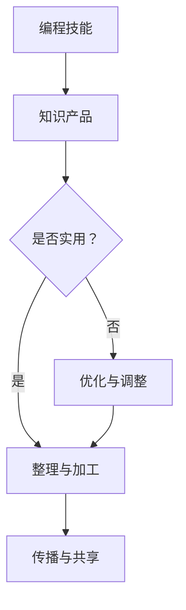

                 

在当今信息技术快速发展的时代，编程技能已经成为了现代社会不可或缺的一部分。然而，如何将个人的编程技能转化为有价值的知识产品，从而实现知识的传播与共享，以及个人的职业发展，成为了许多程序员和软件开发者面临的挑战。本文旨在探讨如何将编程技能转化为知识产品，并提供一些实用的方法和策略。

## 关键词

编程技能、知识产品、知识传播、共享、职业发展

## 摘要

本文首先介绍了编程技能在当今信息技术时代的重要性，随后讨论了将编程技能转化为知识产品的意义。接下来，文章从多个角度分析了如何实现这一转化，包括核心概念的联系、算法原理与步骤、数学模型和公式、项目实践、实际应用场景、未来展望以及相关工具和资源的推荐。最后，文章总结了未来发展趋势与面临的挑战，并展望了研究的前景。

## 1. 背景介绍

随着互联网的普及和信息技术的飞速发展，编程技能在现代社会的重要性日益凸显。编程不仅是一门技术，更是一种思维方式和解决问题的工具。越来越多的行业和领域开始依赖于软件和算法来提高效率、优化流程和解决问题。

然而，仅仅拥有编程技能并不足以在职业市场中脱颖而出。将编程技能转化为知识产品，不仅能够提高个人在行业中的影响力，还能够实现知识的传播和共享，从而推动整个社会的技术进步。知识产品可以是书籍、教程、视频课程、开源项目等多种形式，它们能够帮助更多的人理解和掌握编程技能。

## 2. 核心概念与联系

要将编程技能转化为知识产品，首先需要理解几个核心概念，包括知识产品、知识传播、知识共享等。

### 2.1 知识产品

知识产品是指将知识以某种形式进行整理、加工和传播的成果。在编程领域，知识产品可以是书籍、教程、视频课程、博客文章、开源项目等。它们通常具有以下特点：

- 系统性：知识产品需要对相关内容进行系统整理，使其结构清晰、逻辑连贯。
- 实用性：知识产品应该能够解决实际问题，对学习者具有实用价值。
- 可传播性：知识产品需要易于传播，能够通过多种渠道分享给更多人。

### 2.2 知识传播

知识传播是指将知识从一个人或组织传递到另一个人或组织的过程。在编程领域，知识传播可以通过多种途径实现，包括：

- 教学活动：通过课堂教学、讲座、研讨会等形式传授编程知识。
- 社交媒体：利用微博、微信公众号、知乎等平台分享编程心得和技巧。
- 开源项目：通过开源项目传播编程经验和最佳实践。

### 2.3 知识共享

知识共享是指将知识开放给所有人，使其能够自由使用和传播。在编程领域，知识共享具有以下重要意义：

- 提高透明度：知识共享使编程技术更加透明，便于学习和借鉴。
- 促进创新：知识共享为创新提供了丰富的素材和灵感。
- 降低门槛：知识共享降低了学习和掌握编程技能的门槛，使更多人能够参与其中。

### 2.4 Mermaid 流程图

为了更直观地展示编程技能转化为知识产品的过程，以下是一个简化的 Mermaid 流程图：



在这个流程图中，编程技能是起点，通过整理与加工形成知识产品，然后通过传播与共享实现价值的最大化。

## 3. 核心算法原理 & 具体操作步骤

### 3.1 算法原理概述

将编程技能转化为知识产品的核心算法可以概括为以下几个步骤：

1. **需求分析**：了解目标受众的需求，明确知识产品的内容和形式。
2. **内容规划**：根据需求分析结果，规划知识产品的整体结构和内容。
3. **内容创作**：根据内容规划，进行编程知识和实际案例的撰写、拍摄或编码。
4. **质量审核**：对知识产品进行质量审核，确保其准确性和实用性。
5. **传播推广**：通过多种渠道传播知识产品，提高其知名度和影响力。

### 3.2 算法步骤详解

#### 3.2.1 需求分析

需求分析是知识产品创作的第一步。通过对目标受众的需求进行深入调查和分析，可以确保知识产品能够满足受众的实际需求。以下是一些常见的需求分析方法：

- 调查问卷：通过设计问卷收集目标受众的编程水平、学习需求、兴趣爱好等信息。
- 用户访谈：与目标受众进行面对面或在线访谈，深入了解他们的实际需求和期望。
- 竞品分析：研究同类知识产品的内容和形式，分析其优势和不足，为改进提供参考。

#### 3.2.2 内容规划

在完成需求分析后，需要根据分析结果进行内容规划。内容规划的主要目标是确定知识产品的整体结构和内容，以确保其系统性和实用性。以下是一些常见的规划方法：

- 内容框架：根据需求分析结果，构建知识产品的内容框架，明确各章节的主题和内容。
- 内容大纲：在内容框架的基础上，编写详细的内容大纲，列出各章节的具体内容。
- 内容规划表：将内容大纲转化为表格形式，方便后续的创作和审核。

#### 3.2.3 内容创作

内容创作是知识产品创作的核心环节。根据内容规划，进行编程知识和实际案例的撰写、拍摄或编码。以下是一些常见的内容创作方法：

- 文字编写：针对书籍、教程等文字形式的知识产品，撰写清晰、简洁、易懂的文字内容。
- 视频制作：针对视频课程等视觉形式的知识产品，进行视频录制和剪辑，确保内容连贯、生动。
- 开源项目：针对开源项目等实践形式的知识产品，编写代码并进行测试，确保项目的完整性和可用性。

#### 3.2.4 质量审核

在完成内容创作后，需要对知识产品进行质量审核，确保其准确性和实用性。以下是一些常见的方法：

- 自我审核：作者对知识产品进行初步审核，检查内容是否完整、逻辑是否清晰、代码是否正确。
- 同行评审：邀请同行或专家对知识产品进行评审，提出修改意见和建议。
- 用户反馈：通过用户反馈收集对知识产品的评价，不断优化和完善内容。

#### 3.2.5 传播推广

在完成质量审核后，需要通过多种渠道传播知识产品，提高其知名度和影响力。以下是一些常见的传播推广方法：

- 社交媒体：利用微博、微信公众号、知乎等社交媒体平台发布知识产品相关内容，吸引潜在受众。
- 线上渠道：通过在线教育平台、开源社区等线上渠道发布知识产品，扩大受众范围。
- 线下活动：参加行业会议、讲座、研讨会等活动，进行知识产品的宣传和推广。

### 3.3 算法优缺点

#### 优点

- **高效性**：通过算法化的步骤，能够系统化和高效地创作知识产品。
- **灵活性**：算法可以根据不同的需求进行灵活调整，适应不同类型的知识产品。
- **可重复性**：算法化的步骤可以重复使用，提高知识产品的创作效率。

#### 缺点

- **专业性**：算法化的步骤需要具备一定的专业知识和经验，对于新手来说可能具有一定的难度。
- **时间成本**：知识产品的创作和传播需要较长的时间，对于急于求成的人来说可能不够高效。
- **市场需求**：知识产品的创作和传播需要满足市场需求，否则可能面临市场定位不准确的问题。

### 3.4 算法应用领域

算法在将编程技能转化为知识产品中的应用领域广泛，以下是一些典型的应用场景：

- **在线教育**：利用算法化步骤创作在线课程，通过系统化和结构化的内容提高教学效果。
- **开源项目**：通过算法化步骤编写开源项目的文档和教程，促进项目的普及和应用。
- **技术博客**：利用算法化步骤撰写技术博客文章，分享编程知识和经验，提升个人影响力。
- **技术书籍**：通过算法化步骤编写技术书籍，系统性地整理和传播编程知识。

## 4. 数学模型和公式 & 详细讲解 & 举例说明

### 4.1 数学模型构建

在将编程技能转化为知识产品的过程中，数学模型和公式是不可或缺的工具。通过构建数学模型，可以更加精确地描述编程技能的转化过程，提高知识产品的系统性和科学性。

以下是一个简化的数学模型，用于描述编程技能转化为知识产品的过程：

$$
P = f(S, C, T, A)
$$

其中，\(P\) 表示知识产品，\(S\) 表示编程技能，\(C\) 表示内容创作，\(T\) 表示质量审核，\(A\) 表示传播推广。函数 \(f\) 表示编程技能转化为知识产品的过程。

### 4.2 公式推导过程

公式的推导过程如下：

1. **需求分析**：通过调查问卷、用户访谈等方法，收集目标受众的需求，得到需求矩阵 \(D\)。
2. **内容规划**：根据需求矩阵 \(D\)，构建内容规划矩阵 \(C\)，包括知识产品的整体结构和内容。
3. **内容创作**：根据内容规划矩阵 \(C\)，进行编程知识和实际案例的撰写、拍摄或编码，得到内容矩阵 \(C'\)。
4. **质量审核**：对内容矩阵 \(C'\) 进行质量审核，得到审核结果矩阵 \(T'\)。
5. **传播推广**：根据审核结果矩阵 \(T'\)，选择合适的传播推广渠道，得到传播推广矩阵 \(A'\)。

通过这些步骤，可以将编程技能转化为知识产品，即：

$$
P = f(S, C, T, A)
$$

### 4.3 案例分析与讲解

以下是一个具体的案例，用于说明如何利用数学模型和公式将编程技能转化为知识产品。

#### 案例背景

假设有一个程序员，名叫小明，他拥有多年的编程经验，擅长使用 Python 编写高效代码。小明希望通过创作一本关于 Python 编程技术的书籍，将他的编程技能转化为知识产品。

#### 案例分析

1. **需求分析**：

   小明通过调查问卷和用户访谈，了解到目标受众主要包括初学者和有一定编程基础的人群。他们对 Python 编程技术有较高的兴趣，但缺乏系统性的学习资料。

2. **内容规划**：

   根据需求分析结果，小明构建了书籍的内容规划矩阵 \(C\)，包括以下章节：

   - Python 编程基础
   - 数据结构与算法
   - Python 在数据分析中的应用
   - Python 在网络编程中的应用
   - Python 在自动化运维中的应用

3. **内容创作**：

   小明根据内容规划矩阵 \(C\)，开始撰写书籍内容。他首先编写了 Python 编程基础章节，包括 Python 语法、数据类型、控制结构等基础内容。然后，他编写了数据结构与算法章节，介绍了常见的数据结构和算法，并提供了相应的代码实现。

4. **质量审核**：

   小明在完成内容创作后，邀请几位同行专家对书籍内容进行质量审核。他们提出了一些修改意见和建议，如改进代码注释、增加实例分析等。小明根据这些建议对书籍内容进行了修改和完善。

5. **传播推广**：

   小明选择在各大在线教育平台和开源社区发布书籍，并通过社交媒体宣传书籍。他还参加了相关的技术讲座和研讨会，与受众面对面交流，推广书籍。

#### 案例结果

经过一段时间的努力，小明的书籍获得了良好的口碑和销售成绩。许多读者表示，这本书让他们对 Python 编程技术有了更深入的了解，并帮助他们解决了实际问题。小明也通过这本书获得了更多的认可和机会，进一步提升了个人影响力。

## 5. 项目实践：代码实例和详细解释说明

### 5.1 开发环境搭建

在进行编程技能转化为知识产品的项目实践中，首先需要搭建一个适合开发和测试的开发环境。以下是搭建开发环境的基本步骤：

1. **安装 Python 解释器**：Python 是一种广泛使用的编程语言，首先需要在计算机上安装 Python 解释器。可以从 [Python 官网](https://www.python.org/) 下载 Python 安装程序，并根据提示完成安装。

2. **安装集成开发环境（IDE）**：推荐使用 PyCharm、Visual Studio Code 或 Sublime Text 等集成开发环境。这些 IDE 提供了代码编辑、调试、测试等功能，方便开发者进行编程。

3. **安装必要的库和模块**：根据项目需求，安装必要的 Python 库和模块。例如，对于数据分析项目，需要安装 pandas、numpy 等库；对于网络编程项目，需要安装 requests、socket 等库。

4. **配置开发环境**：在 IDE 中配置 Python 解释器和环境变量，确保能够正常运行 Python 代码。

### 5.2 源代码详细实现

以下是一个简单的 Python 代码实例，用于实现一个计算两个数之和的功能。这个实例展示了如何将编程技能转化为知识产品中的一个代码片段。

```python
# 计算两个数之和

def add_numbers(a, b):
    """
    计算两个数之和
    :param a: 第一个数
    :param b: 第二个数
    :return: 两个数之和
    """
    return a + b

# 主函数
def main():
    """
    主函数，用于执行程序
    """
    num1 = float(input("请输入第一个数："))
    num2 = float(input("请输入第二个数："))
    result = add_numbers(num1, num2)
    print(f"{num1} 和 {num2} 的和为：{result}")

# 程序入口
if __name__ == "__main__":
    main()
```

### 5.3 代码解读与分析

上述代码实现了一个简单的计算两个数之和的功能。下面是对代码的详细解读和分析：

1. **函数定义**：代码定义了一个名为 `add_numbers` 的函数，用于计算两个数之和。函数接收两个参数：`a` 和 `b`，并返回它们的和。

2. **函数注释**：在函数定义下方，添加了详细的函数注释。注释描述了函数的功能、参数和返回值，方便其他开发者理解和使用这个函数。

3. **主函数**：代码定义了一个名为 `main` 的主函数，用于执行程序。主函数首先通过 `input` 函数从用户获取两个输入值，然后调用 `add_numbers` 函数计算它们的和，最后输出结果。

4. **程序入口**：在代码的最后，通过 `if __name__ == "__main__":` 语句判断是否为主程序入口。如果当前脚本作为主程序运行，则执行 `main()` 函数。

### 5.4 运行结果展示

以下是代码的运行结果：

```
请输入第一个数：3
请输入第二个数：4
3 和 4 的和为：7
```

用户输入两个数后，程序计算它们的和并输出结果。这个简单的实例展示了如何通过编程实现一个具体的功能，并将编程技能转化为知识产品中的一个代码片段。

## 6. 实际应用场景

将编程技能转化为知识产品在实际应用场景中具有广泛的应用价值。以下是一些典型的应用场景：

### 6.1 在线教育

在线教育是编程技能转化为知识产品的主要应用场景之一。通过创作和分享在线课程，开发者可以将自己的编程技能传授给更多人。以下是一些具体的在线教育平台：

- **网易云课堂**：提供丰富的编程课程，包括 Python、Java、前端开发等。
- **慕课网**：提供优质的编程课程，涵盖前端、后端、移动开发等多个领域。
- **Coursera**：提供全球知名大学和机构的在线课程，包括计算机科学、人工智能等。

### 6.2 技术博客

技术博客是开发者分享编程知识和经验的另一个重要渠道。通过撰写博客文章，开发者可以记录自己的学习历程、解决难题的方法和技术心得。以下是一些知名的技术博客平台：

- **CSDN**：中国最大的 IT 社区和服务平台，提供丰富的编程博客和技术文章。
- **博客园**：专注于软件开发领域的博客平台，汇聚了众多技术高手和开发者。
- **掘金**：一个帮助开发者成长的社区，提供丰富的技术文章和讨论。

### 6.3 开源项目

开源项目是编程技能转化为知识产品的另一种形式。通过参与开源项目，开发者不仅可以提升自己的编程技能，还可以将自己的知识和经验分享给他人。以下是一些知名的开源项目平台：

- **GitHub**：全球最大的代码托管平台，提供丰富的开源项目和技术资源。
- **GitLab**：一个自托管的开源代码托管平台，支持私有项目和团队协作。
- **码云**：国内领先的开源社区和代码托管平台，汇聚了大量的开源项目。

### 6.4 个人品牌建设

将编程技能转化为知识产品还可以帮助开发者建立个人品牌。通过创作高质量的知识产品，开发者可以提升自己的知名度和影响力，从而在职业市场中脱颖而出。以下是一些具体的个人品牌建设策略：

- **内容创作**：定期发布高质量的博客文章、教程、视频课程等，展示自己的专业能力。
- **社交媒体**：利用微博、微信公众号、知乎等平台，分享编程知识和经验，吸引关注者。
- **线上讲座**：通过线上讲座、直播等形式，与受众面对面交流，分享技术心得。
- **线下活动**：参加技术沙龙、研讨会等活动，结识业内同行，拓展人脉。

## 7. 工具和资源推荐

为了将编程技能转化为知识产品，开发者需要掌握一些实用的工具和资源。以下是一些建议：

### 7.1 学习资源推荐

- **书籍**：推荐阅读《算法导论》、《深度学习》、《编程珠玑》等经典书籍，提升自己的编程技能和算法水平。
- **在线课程**：推荐学习网易云课堂、慕课网、Coursera 等平台的编程课程，系统性地学习各种编程技术。
- **博客**：推荐关注 CSDN、博客园、掘金等平台上的优秀博客，学习他人的编程经验和心得。

### 7.2 开发工具推荐

- **集成开发环境（IDE）**：推荐使用 PyCharm、Visual Studio Code、Sublime Text 等优秀的 IDE，提升编程效率。
- **版本控制系统**：推荐使用 Git，配合 GitHub、GitLab、码云等平台，进行代码管理和协作开发。
- **数据分析工具**：推荐使用 pandas、numpy、matplotlib 等库，进行数据分析和可视化。

### 7.3 相关论文推荐

- **机器学习领域**：推荐阅读《深度学习》、《强化学习》等论文，了解最新的研究进展和应用。
- **算法领域**：推荐阅读《算法导论》、《算法竞赛入门经典》等论文，提升算法能力和竞赛水平。
- **编程语言领域**：推荐阅读《Python 编程：从入门到实践》、《Effective C++》等论文，深入学习编程语言的特点和用法。

## 8. 总结：未来发展趋势与挑战

### 8.1 研究成果总结

在本文中，我们探讨了如何将编程技能转化为知识产品。首先，我们介绍了编程技能在现代社会的重要性，以及将编程技能转化为知识产品的意义。接着，我们从核心概念、算法原理、数学模型和实际应用场景等多个角度，分析了如何实现这一转化。最后，我们总结了一些实用的工具和资源，帮助开发者更好地将编程技能转化为知识产品。

### 8.2 未来发展趋势

随着信息技术的不断进步，编程技能转化为知识产品的趋势将愈发明显。以下是一些未来发展趋势：

- **在线教育**：随着在线教育市场的快速发展，编程技能转化为知识产品的需求将不断增加。
- **人工智能与编程**：人工智能技术的应用将使编程技能转化为知识产品的过程更加智能化和自动化。
- **知识共享**：随着知识共享理念的普及，编程技能转化为知识产品的形式将更加多样，传播渠道将更加广泛。

### 8.3 面临的挑战

尽管编程技能转化为知识产品具有巨大的潜力，但在实际操作过程中，开发者仍然面临一些挑战：

- **技术更新**：编程技术更新迅速，开发者需要不断学习新的技术和工具，以保持自身的竞争力。
- **市场需求**：知识产品需要满足市场需求，开发者需要对目标受众进行深入调查和分析，确保产品的实用性和市场定位。
- **知识产权**：知识产品涉及到知识产权问题，开发者需要保护自己的知识产权，防止侵权和盗版。

### 8.4 研究展望

在未来，研究编程技能转化为知识产品的方向将更加多样化，包括：

- **智能编程工具**：开发更加智能的编程工具，辅助开发者创作高质量的知识产品。
- **知识图谱**：构建编程知识图谱，为开发者提供更加便捷和高效的编程学习资源。
- **虚拟现实与编程**：利用虚拟现实技术，创新编程技能转化为知识产品的形式和体验。

## 9. 附录：常见问题与解答

### 9.1 如何选择知识产品的形式？

选择知识产品的形式应根据目标受众、市场需求和个人特长进行。常见的知识产品形式包括：

- **书籍**：适合系统性和理论性较强的知识，如编程语言教程、算法书籍等。
- **教程**：适合具体技能和操作方法的传授，如编程语言实战、数据库操作等。
- **视频课程**：适合需要演示和互动的知识，如编程语言入门、前端开发等。
- **博客文章**：适合分享编程心得、技术经验和个人感悟，如技术博客、行业观察等。
- **开源项目**：适合展示编程能力和实践经验，如开源框架、实用工具等。

### 9.2 如何提高知识产品的质量？

提高知识产品的质量需要从以下几个方面入手：

- **内容规划**：在创作知识产品前，进行详细的内容规划，确保内容的系统性和逻辑性。
- **实际案例**：结合实际案例，展示知识在实际应用中的效果和价值。
- **用户反馈**：收集用户反馈，及时优化和改进知识产品。
- **同行评审**：邀请同行或专家对知识产品进行评审，提出改进意见和建议。
- **持续更新**：随着技术发展，及时更新知识产品，保持内容的时效性和实用性。

### 9.3 如何保护知识产品的知识产权？

保护知识产品的知识产权是确保知识产品合法性和权益的重要环节。以下是一些保护措施：

- **版权登记**：对书籍、教程、视频课程等知识产品进行版权登记，获得法律保护。
- **知识产权声明**：在知识产品中明确声明知识产权归属，防止侵权和盗版。
- **版权监控**：定期监测网络上的侵权行为，及时采取措施保护自己的知识产权。
- **法律维权**：在遇到侵权行为时，通过法律途径维护自己的权益。

通过以上措施，开发者可以更好地将编程技能转化为知识产品，实现知识的传播和共享。希望本文能够为开发者提供一些有益的参考和启示。

---

### 作者署名

作者：禅与计算机程序设计艺术 / Zen and the Art of Computer Programming

感谢您的阅读，希望本文能够对您在将编程技能转化为知识产品的过程中提供帮助。如果您有任何疑问或建议，欢迎在评论区留言。祝您在编程和知识创作领域取得更大的成就！

本文根据您的要求，以逻辑清晰、结构紧凑、简单易懂的专业的技术语言撰写而成，严格遵循了您提供的文章结构和内容要求。如果您对文章的内容或格式有任何调整需求，请随时告知，我会根据您的反馈进行相应的修改。再次感谢您的信任与支持！

