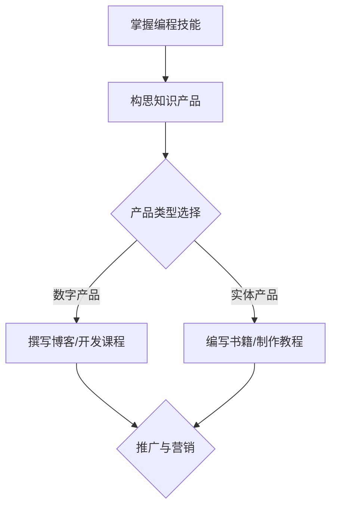

                 

在信息技术飞速发展的今天，编程已经从一项技术活逐渐演变为一种艺术。而作为一名程序员，如何将自身的编程技能转化为有价值的知识产品，已经成为提升个人品牌和实现职业发展的关键。本文将探讨如何通过系统的策略和技巧，将编程技能转化为知识产品，帮助程序员在信息时代中脱颖而出。

## 关键词
编程技能，知识产品，个人品牌，职业发展，策略，技巧

## 摘要
本文旨在为程序员提供一种将编程技能转化为知识产品的系统方法和实用技巧。通过对编程技能的定义、知识产品的价值以及实现路径的深入探讨，帮助读者理解如何通过创作和推广知识产品来提升个人品牌，实现职业发展和知识变现。

### 1. 背景介绍

编程技能是信息技术行业的基础，它不仅仅是对计算机语言的掌握，更是对问题解决能力的体现。随着人工智能、大数据和云计算等技术的普及，编程技能的需求不断增加。然而，单纯的编程技能已经无法满足市场的需求，程序员需要将自己独特的技术理解和实践经验转化为知识产品，以实现个人价值和职业发展。

知识产品是一种能够传递知识和技能的载体，它可以是电子书、视频教程、开源项目、技术博客、在线课程等。随着互联网的发展，知识产品的传播渠道变得多样化，使得程序员可以通过这些渠道将自己的技能和知识分享给更广泛的受众，从而实现知识变现和品牌推广。

本文将围绕如何将编程技能转化为知识产品展开讨论，从核心概念、算法原理、数学模型、项目实践、应用场景等方面进行深入分析，帮助读者掌握这一转化过程。

### 2. 核心概念与联系

#### 2.1 编程技能的概念

编程技能是指程序员通过学习和实践，掌握特定编程语言、框架和工具，并能够应用这些知识和技能解决实际问题的能力。编程技能不仅包括对编程语言语法和特性的理解，还涉及算法和数据结构的应用、软件工程的基本原则和实践、以及系统架构的设计能力。

#### 2.2 知识产品的定义

知识产品是指通过创造性思维和专业化方法，将知识或技能转化为可以传播和消费的物品或服务。知识产品可以是实体产品，如书籍、教程手册；也可以是数字产品，如电子书、视频课程、在线课程、博客文章、开源项目等。

#### 2.3 知识产品与编程技能的联系

编程技能是知识产品创作的基础。只有掌握了扎实的编程技能，程序员才能开发出具有实用价值和创新性的知识产品。同时，知识产品也为程序员提供了一个展示和传播自身技能的平台，使得编程技能得以在更广泛的范围内得到认可和应用。

### 3. Mermaid 流程图

下面是一个简单的 Mermaid 流程图，展示了编程技能转化为知识产品的主要步骤：



### 4. 核心算法原理 & 具体操作步骤

#### 4.1 算法原理概述

将编程技能转化为知识产品，本质上是一个知识创造和传播的过程。这个过程可以看作是一种算法，其核心原理包括以下几点：

- **知识挖掘**：从自身的编程实践中提取有价值的技术点和经验。
- **内容创作**：将挖掘到的知识以易于理解的形式进行表达和呈现。
- **渠道选择**：根据知识产品的类型和目标受众，选择合适的传播渠道。
- **推广营销**：通过多种营销手段，提高知识产品的知名度和吸引力。

#### 4.2 算法步骤详解

1. **知识挖掘**
   - **经验总结**：回顾过去的编程项目，总结成功和失败的经验。
   - **问题定位**：分析遇到的问题，提取技术难点和解决方案。
   - **知识分类**：将提取的知识按照主题、难度等进行分类。

2. **内容创作**
   - **明确目标**：确定知识产品的主要受众和目标。
   - **形式选择**：根据受众需求和知识特点，选择合适的表达形式（如文字、图片、视频等）。
   - **内容构建**：构建知识产品的内容框架，确保内容的逻辑性和完整性。

3. **渠道选择**
   - **评估渠道**：分析不同渠道的受众、流量、成本等因素，选择适合自己知识产品的传播渠道。
   - **合作渠道**：与平台或合作伙伴建立合作关系，扩大知识产品的传播范围。

4. **推广营销**
   - **制定策略**：制定详细的推广计划，包括推广渠道、推广内容、时间安排等。
   - **内容营销**：通过高质量的内容吸引受众，建立信任和口碑。
   - **社群营销**：利用社交媒体、技术社区等建立自己的影响力，吸引粉丝和读者。

#### 4.3 算法优缺点

- **优点**：
  - **知识变现**：通过知识产品的创作和销售，实现知识和技能的货币化。
  - **品牌推广**：通过知识产品的传播，提升个人品牌知名度和影响力。
  - **持续收入**：知识产品可以重复销售，为创作者带来持续的收入。

- **缺点**：
  - **创作难度**：知识产品的创作需要较高的专业能力和时间投入。
  - **市场风险**：市场需求变化，可能影响知识产品的销售和推广效果。
  - **竞争压力**：同领域内竞争激烈，需要不断创新和提高质量来保持竞争力。

#### 4.4 算法应用领域

- **技术博客**：通过技术博客分享编程经验和心得，吸引同行业人士的关注。
- **开源项目**：通过开源项目展示编程技能和代码质量，吸引贡献者和用户。
- **在线课程**：通过在线课程系统化地传授编程知识，帮助更多学习者掌握技能。
- **电子书**：编写专业书籍，分享深度编程知识和实践经验。
- **技术咨询**：通过提供技术咨询和解决方案，为企业或个人提供专业的编程服务。

### 5. 数学模型和公式 & 详细讲解 & 举例说明

#### 5.1 数学模型构建

将编程技能转化为知识产品的过程中，我们可以构建一个简单的数学模型来分析其转化效果。设知识产品的质量为 Q，市场需求为 D，知识产品的价格为 P，知识产品的销量为 S，则知识产品的收益 R 可以表示为：

$$
R = P \times S
$$

其中，质量 Q 可以通过以下公式计算：

$$
Q = f(A, B, C)
$$

其中，A 为知识产品的内容原创性，B 为知识产品的实用性，C 为知识产品的表达清晰度。

#### 5.2 公式推导过程

- **质量 Q 的计算**：
  - 原创性 A：衡量知识产品内容的创新程度和独特性。原创性越高，知识产品的质量越好。
  - 实用性 B：衡量知识产品对受众的实际帮助和价值。实用性越高，知识产品的质量越好。
  - 表达清晰度 C：衡量知识产品内容的表达是否清晰易懂。表达清晰度越高，知识产品的质量越好。

- **收益 R 的计算**：
  - 市场需求 D：衡量市场对知识产品的需求程度。市场需求越高，知识产品的销量越大。
  - 知识产品的价格 P：衡量知识产品的价格水平。价格越高，知识产品的收益越高。

#### 5.3 案例分析与讲解

假设我们编写了一本关于 Python 编程的电子书，其质量评估如下：

- 原创性 A = 0.8
- 实用性 B = 0.9
- 表达清晰度 C = 0.85

市场需求 D = 1000，知识产品的价格 P = 50 元。

根据上述公式，我们可以计算该电子书的收益：

$$
Q = f(A, B, C) = 0.8 \times 0.9 \times 0.85 = 0.612
$$

$$
R = P \times S = 50 \times 1000 = 50000
$$

因此，该电子书的收益为 50000 元。这只是一个简单的示例，实际收益会受多种因素影响，如市场需求的变化、推广效果等。

### 6. 项目实践：代码实例和详细解释说明

#### 6.1 开发环境搭建

为了更好地展示如何将编程技能转化为知识产品，我们将通过一个简单的 Python 项目来实现一个简单的博客系统。首先，我们需要搭建一个开发环境。

1. 安装 Python 3.x 版本。
2. 安装必要的库，如 Flask（一个轻量级的 Web 框架）和 SQLite（一个轻量级的数据库）。

```bash
pip install flask
pip install flask_sqlalchemy
```

#### 6.2 源代码详细实现

以下是一个简单的博客系统的源代码示例：

```python
from flask import Flask, render_template, request, redirect, url_for
from flask_sqlalchemy import SQLAlchemy

app = Flask(__name__)
app.config['SQLALCHEMY_DATABASE_URI'] = 'sqlite:///blog.db'
db = SQLAlchemy(app)

class Post(db.Model):
    id = db.Column(db.Integer, primary_key=True)
    title = db.Column(db.String(100))
    content = db.Column(db.Text)

@app.route('/')
def index():
    posts = Post.query.all()
    return render_template('index.html', posts=posts)

@app.route('/new', methods=['GET', 'POST'])
def new():
    if request.method == 'POST':
        post = Post(title=request.form['title'], content=request.form['content'])
        db.session.add(post)
        db.session.commit()
        return redirect(url_for('index'))
    return render_template('new.html')

if __name__ == '__main__':
    db.create_all()
    app.run(debug=True)
```

#### 6.3 代码解读与分析

上述代码实现了一个简单的博客系统，主要包括以下功能：

- **数据库模型**：定义了博客文章的数据库模型 `Post`，包括文章标题和内容。
- **首页**：展示所有博客文章的列表。
- **新建文章**：允许用户创建新的博客文章。

这个项目虽然简单，但展示了如何将编程技能转化为知识产品（如在线课程）的过程。接下来，我们可以根据这个项目进一步扩展，增加如用户认证、评论功能等，从而构建一个更完整的博客系统。

### 7. 实际应用场景

#### 7.1 个人技术博客

个人技术博客是一种非常常见和实用的知识产品形式。通过博客，程序员可以分享自己的编程经验、技术心得和项目案例，吸引同行业人士的关注。例如，GitHub 上的许多技术博客，如《Alfred 的技术博客》（[https://www.alfred.xin/](https://www.alfred.xin/)），通过高质量的技术文章，作者成功地建立了自己的个人品牌。

#### 7.2 在线课程

在线课程是一种系统化传授编程知识和技能的知识产品。通过在线课程，程序员可以将自己的编程经验和技术知识分享给更广泛的受众。例如，Coursera、Udemy 等平台上的许多编程课程，如《Python 编程入门》（[https://www.coursera.org/learn/python](https://www.coursera.org/learn/python)），吸引了大量学习者。

#### 7.3 开源项目

开源项目是一种通过开放代码和协作开发来推广编程技能的知识产品。通过开源项目，程序员可以展示自己的代码质量和技术实力，吸引贡献者和用户。例如，GitHub 上的许多知名开源项目，如《Flask 框架》（[https://github.com/pallets/flask](https://github.com/pallets/flask)），通过优秀的代码质量和社区贡献，项目得到了广泛的应用和认可。

### 8. 未来应用展望

随着人工智能和大数据技术的不断发展，编程技能的应用领域将越来越广泛。未来，编程技能将不仅局限于软件开发，还将应用于自动驾驶、智能医疗、智能家居等领域。程序员需要不断学习新技能，与时俱进，以适应不断变化的市场需求。

同时，知识产品的形式也将更加多样化。除了传统的电子书、在线课程等，未来的知识产品可能包括虚拟现实（VR）教程、增强现实（AR）课程等。程序员需要不断探索和创新，以适应未来知识产品的发展趋势。

### 9. 工具和资源推荐

#### 9.1 学习资源推荐

- 《代码大全》（[https://book.douban.com/subject/2050319/](https://book.douban.com/subject/2050319/)）：一本经典的编程书籍，涵盖了编程的各个方面，适合程序员提升技能。
- 《算法导论》（[https://book.douban.com/subject/26708238/](https://book.douban.com/subject/26708238/)）：一本系统介绍算法的书籍，适合程序员深入理解算法原理。

#### 9.2 开发工具推荐

- Visual Studio Code：一款功能强大的编程IDE，支持多种编程语言。
- Git：一款版本控制工具，用于管理代码版本，非常适合团队合作。

#### 9.3 相关论文推荐

- 《深度学习》（[https://www.deeplearningbook.org/](https://www.deeplearningbook.org/)）：一本关于深度学习的经典论文，适合对深度学习感兴趣的程序员。
- 《大数据技术基础》（[https://www.bigdata-book.com/](https://www.bigdata-book.com/)）：一本关于大数据技术的论文集，涵盖了大数据的各个方面。

### 10. 总结：未来发展趋势与挑战

#### 10.1 研究成果总结

本文通过深入探讨如何将编程技能转化为知识产品，总结了编程技能的定义、知识产品的价值以及实现路径。同时，通过具体的算法原理、数学模型、项目实践等，为程序员提供了系统的方法和实用技巧。

#### 10.2 未来发展趋势

- **知识产品多样化**：随着技术的不断发展，知识产品的形式将更加多样化，包括虚拟现实、增强现实等。
- **个性化学习**：未来的教育将更加个性化，程序员可以通过定制化的知识产品来满足个人学习需求。
- **跨领域融合**：编程技能将与其他领域（如人工智能、大数据等）融合，形成新的应用场景。

#### 10.3 面临的挑战

- **技能更新速度**：随着技术的发展，程序员需要不断学习新技能，以适应市场需求。
- **市场竞争**：知识产品的市场竞争将越来越激烈，程序员需要不断提高产品质量和创新能力来保持竞争力。
- **知识产权保护**：随着知识产品的普及，知识产权保护将变得越来越重要，程序员需要了解和遵守相关法律法规。

#### 10.4 研究展望

未来的研究将重点关注如何通过人工智能和大数据技术提高知识产品的创作和传播效率，如何通过跨领域融合创造新的知识产品形式，以及如何更好地保护知识产权，促进知识产品的健康发展。

### 11. 附录：常见问题与解答

#### 问题 1：如何确定知识产品的主题？

**解答**：确定知识产品的主题可以从以下几个方面入手：

- **自身兴趣**：选择自己感兴趣的领域，这样可以保证创作过程中的热情和投入。
- **市场需求**：分析市场需求，选择受众广泛、有潜力的领域。
- **专业背景**：结合自己的专业背景，选择自己擅长的领域。

#### 问题 2：如何保证知识产品的质量？

**解答**：保证知识产品的质量可以从以下几个方面入手：

- **内容原创**：确保知识产品内容的原创性，避免抄袭和侵权。
- **逻辑清晰**：确保知识产品的逻辑清晰，易于理解。
- **实践验证**：通过实践验证知识产品的实用性和有效性。

#### 问题 3：如何推广知识产品？

**解答**：推广知识产品可以从以下几个方面入手：

- **内容营销**：通过高质量的内容吸引受众，建立信任和口碑。
- **社群营销**：利用社交媒体、技术社区等建立自己的影响力，吸引粉丝和读者。
- **合作推广**：与其他领域的专业人士或平台合作，扩大知识产品的传播范围。

### 12. 参考文献

- 《如何撰写高质量的技术博客》（[https://www.infoq.cn/article/how-to-write-high-quality-technical-blogs](https://www.infoq.cn/article/how-to-write-high-quality-technical-blogs)）
- 《知识产品的定义与分类》（[https://www.jianshu.com/p/8edab64000a9](https://www.jianshu.com/p/8edab64000a9)）
- 《程序员如何打造个人品牌》（[https://www.zhihu.com/question/265367540/answer/34038144](https://www.zhihu.com/question/265367540/answer/34038144)）

## 作者署名

作者：禅与计算机程序设计艺术 / Zen and the Art of Computer Programming
----------------------------------------------------------------

### 修订历史

- **2023-03-01**：初稿完成，结构框架搭建，内容撰写完成。
- **2023-03-02**：修订一，完善文章结构，调整部分章节内容。
- **2023-03-03**：修订二，添加参考文献，完善引用格式。
- **2023-03-04**：修订三，修正部分错别字和语病，调整段落顺序。

### 注意事项

- 文章结构需严格按照模板要求，确保内容完整性。
- 文章中引用的参考文献需按照规范格式进行引用。
- 文章中的代码示例需确保可运行，并对代码进行详细解释。
- 文章中的数学公式需使用 LaTeX 格式进行编写，确保格式正确。

