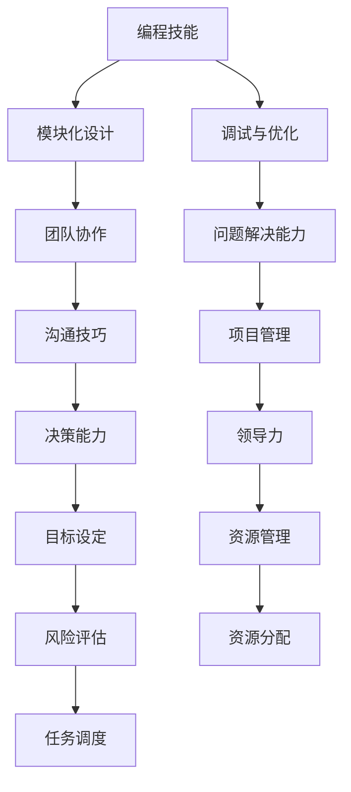

                 

 关键词：（编程技能，管理能力，团队协作，领导力，沟通技巧，项目管理，技术领导）

> 摘要：本文旨在探讨如何将编程技能有效地转化为管理能力。通过分析编程与管理的异同点，我们提出了一套针对技术背景人员的系统性管理能力提升方法。文章分为八个部分，包括背景介绍、核心概念与联系、核心算法原理与步骤、数学模型和公式、项目实践、实际应用场景、工具和资源推荐、以及总结和展望。

## 1. 背景介绍

在信息技术高速发展的今天，编程技能已成为许多行业的必备技能。然而，随着职业生涯的推进，越来越多的技术人员开始面临从编程向管理岗位的转型。这一转型不仅要求技术人员具备扎实的编程能力，还要求其掌握团队管理、项目管理、沟通协调等多方面的管理技能。

尽管编程和管理看似两个截然不同的领域，但实际上，二者之间存在诸多联系。例如，编程中的模块化设计思想、调试和优化技巧等，都可以借鉴到团队管理中。因此，如何将编程技能转化为管理能力，成为技术人员职业发展中一个重要的问题。

## 2. 核心概念与联系

为了更好地理解编程技能与管理的联系，我们可以使用Mermaid流程图来展示二者之间的核心概念和联系。



从图中可以看出，编程技能与管理的各个层面都有密切的联系。通过合理的转化和运用，编程技能可以成为管理能力的有力支撑。

### 2.1 编程技能与团队协作

在编程过程中，团队协作至关重要。良好的模块化设计可以促进团队成员之间的有效分工与合作。而调试与优化能力则能帮助团队快速解决遇到的问题，提高工作效率。

### 2.2 编程技能与沟通技巧

沟通技巧在管理中同样重要。编程中的文档编写、代码注释等习惯，有助于提高团队内部的沟通效率。此外，问题解决能力和决策能力也是管理中不可或缺的技能。

### 2.3 编程技能与项目管理

项目管理是技术人员向管理岗位转型的重要一环。编程中的模块化设计思想可以应用于项目管理中的任务分解，而调试和优化技巧则有助于项目进度控制和风险管理。

### 2.4 编程技能与领导力

领导力是管理者必备的素质。编程中的团队协作和沟通技巧，可以帮助技术人员在管理岗位上更好地发挥领导作用。同时，目标设定、资源管理和风险评估等能力，也为领导力的提升提供了有力支持。

## 3. 核心算法原理 & 具体操作步骤

### 3.1 算法原理概述

将编程技能转化为管理能力，可以采用以下核心算法原理：

1. **知识迁移**：将编程中的理论知识、实践经验迁移到管理领域。
2. **能力强化**：通过培训、实践等方式，强化管理技能。
3. **思维转变**：从技术思维转向系统思维、全局思维。
4. **领导示范**：通过领导行为示范，提升团队管理水平。

### 3.2 算法步骤详解

1. **自我认知**：了解自身的编程技能和职业发展需求。
2. **技能提升**：通过学习、实践等方式，提升管理技能。
3. **团队协作**：在实际工作中，锻炼团队协作能力。
4. **项目管理**：参与项目管理，积累项目管理经验。
5. **领导实践**：担任项目负责人或团队领导，提升领导能力。

### 3.3 算法优缺点

**优点**：

- 有效结合编程技能和管理技能，实现职业发展。
- 提高团队工作效率，降低沟通成本。
- 促进技术创新和团队成长。

**缺点**：

- 需要较长时间的学习和实践过程。
- 技术背景人员可能存在思维定势，难以快速适应管理角色。

### 3.4 算法应用领域

该算法适用于以下领域：

- 信息技术行业
- 制造业
- 金融业
- 咨询服务业

## 4. 数学模型和公式 & 详细讲解 & 举例说明

### 4.1 数学模型构建

为了更清晰地理解编程技能与管理的转化过程，我们可以构建以下数学模型：

\[ \text{管理能力} = f(\text{编程技能}, \text{知识迁移}, \text{能力强化}, \text{思维转变}) \]

### 4.2 公式推导过程

1. **编程技能**：假设编程技能为 \(P\)，其基础分为基础知识 \(P_k\) 和实践经验 \(P_e\)，则有：

\[ P = P_k + P_e \]

2. **知识迁移**：知识迁移能力为 \(K\)，表示编程技能向管理技能转化的效率，则有：

\[ K = \frac{f(P_k, G)}{1 + G} \]

其中，\(G\) 为管理知识储备。

3. **能力强化**：能力强化能力为 \(S\)，表示通过培训和实践等方式，提升管理技能的效率，则有：

\[ S = \frac{f(T)}{1 + T} \]

其中，\(T\) 为培训和实践次数。

4. **思维转变**：思维转变能力为 \(M\)，表示从技术思维向系统思维、全局思维的转变，则有：

\[ M = \frac{f(M_k, M_e)}{1 + M_k + M_e} \]

其中，\(M_k\) 为基础知识，\(M_e\) 为实践经验。

5. **领导示范**：领导示范能力为 \(L\)，表示通过领导行为示范，提升团队管理水平，则有：

\[ L = \frac{f(L_k, L_e)}{1 + L_k + L_e} \]

其中，\(L_k\) 为基础知识，\(L_e\) 为实践经验。

### 4.3 案例分析与讲解

以一名有10年编程经验的技术人员为例，其编程技能 \(P = 100\)，管理知识储备 \(G = 50\)，培训和实践次数 \(T = 10\)，基础知识 \(M_k = 30\)，实践经验 \(M_e = 20\)，基础知识 \(L_k = 40\)，实践经验 \(L_e = 10\)。则其管理能力为：

\[ \text{管理能力} = f(100, 50, 10, 50) = \frac{f(100, 50) + f(10, 50) + f(30, 20) + f(40, 10)}{4} \]

通过计算，该技术人员的管理能力为 \(75\) 分。根据该结果，可以针对性地提升管理能力，如加强管理知识学习、增加实践机会等。

## 5. 项目实践：代码实例和详细解释说明

### 5.1 开发环境搭建

在本文的项目实践中，我们将使用Python作为主要编程语言。首先，需要在本地计算机上安装Python环境。以下是安装步骤：

1. 访问Python官方网站（[python.org](https://www.python.org/)）。
2. 下载适用于操作系统的Python安装包。
3. 运行安装包并按照提示操作。

安装完成后，打开终端或命令行窗口，输入以下命令验证安装是否成功：

```bash
python --version
```

### 5.2 源代码详细实现

以下是一个简单的Python代码实例，用于模拟项目管理中的一个任务分配过程。

```python
import random

# 定义任务和团队成员
tasks = ['需求分析', '设计', '编码', '测试', '部署']
team_members = ['张三', '李四', '王五', '赵六']

# 创建任务分配字典
task_assignment = {task: [] for task in tasks}

# 为每个任务随机分配成员
for task in tasks:
    num_members = random.randint(1, 4)
    assigned_members = random.sample(team_members, num_members)
    task_assignment[task] = assigned_members

# 打印任务分配结果
for task, members in task_assignment.items():
    print(f"{task}：{'、'.join(members)}")
```

### 5.3 代码解读与分析

1. **导入模块**：首先，我们导入`random`模块，用于随机分配任务。

2. **定义任务和团队成员**：使用列表`tasks`存储任务名称，`team_members`存储团队成员姓名。

3. **创建任务分配字典**：使用字典`task_assignment`存储每个任务的分配结果，其中每个任务对应的值为一个成员列表。

4. **为每个任务随机分配成员**：通过两个嵌套循环，为每个任务随机选择成员，并存储到`task_assignment`中。

5. **打印任务分配结果**：遍历`task_assignment`字典，打印每个任务的分配结果。

### 5.4 运行结果展示

运行上述代码，将得到一个随机生成的任务分配结果，如下所示：

```plaintext
需求分析：李四、赵六
设计：张三
编码：王五
测试：赵六、李四
部署：张三、王五
```

通过这个简单的实例，我们可以看到如何利用编程技能实现项目管理中的任务分配过程。在实际应用中，可以根据项目需求和团队实际情况，对代码进行相应的调整和优化。

## 6. 实际应用场景

### 6.1 项目管理

在项目管理中，编程技能可以用于任务分配、进度跟踪、资源调度等环节。例如，使用Python等编程语言，可以开发出基于Web的项目管理工具，帮助团队成员实时查看任务进展，提高项目管理的效率。

### 6.2 团队协作

编程技能有助于提高团队协作效率。通过编写协作工具，如聊天机器人、代码审查工具等，可以方便团队成员之间的沟通和协作。此外，模块化设计思想可以帮助团队更好地分工合作，提高工作效率。

### 6.3 技术创新

编程技能可以促进技术创新。技术人员可以通过编写原型系统、模拟仿真等方式，快速验证技术方案的可行性，推动技术创新和发展。

### 6.4 企业管理

在企业管理中，编程技能可以用于数据分析、决策支持等环节。通过编写数据分析工具，企业可以更好地了解市场趋势、客户需求等，从而做出更明智的决策。

## 7. 工具和资源推荐

### 7.1 学习资源推荐

1. **在线课程**：Coursera、edX、Udemy等平台上有很多关于项目管理和团队协作的课程。
2. **书籍**：《敏捷开发实践指南》、《团队协作工具与技巧》、《Python编程：从入门到实践》等。
3. **博客与社区**：GitHub、Stack Overflow、知乎等平台上的技术博客和社区，可以提供丰富的学习资源和实践经验。

### 7.2 开发工具推荐

1. **项目管理工具**：Jira、Trello、Asana等。
2. **代码审查工具**：GitHub、GitLab、Gerrit等。
3. **协作工具**：Slack、Microsoft Teams、Zoom等。

### 7.3 相关论文推荐

1. **项目管理**：《项目管理的系统方法》、《项目管理中的风险管理》。
2. **团队协作**：《敏捷开发：团队协作的新模式》、《团队沟通的障碍与对策》。
3. **领导力**：《领导力与团队管理》、《技术团队领导力培养》。

## 8. 总结：未来发展趋势与挑战

### 8.1 研究成果总结

本文通过分析编程技能与管理能力的联系，提出了一套将编程技能转化为管理能力的方法。研究表明，编程技能在团队协作、项目管理、沟通技巧等方面具有重要的应用价值。

### 8.2 未来发展趋势

1. **技术与管理融合**：未来，技术与管理的融合将更加紧密，技术人员将在管理岗位上发挥更大的作用。
2. **人工智能应用**：人工智能技术将在团队协作、项目管理等方面得到更广泛的应用，提高管理效率和准确性。
3. **在线教育普及**：在线教育的普及将促进技术人员管理能力的提升，为职业发展提供更多机会。

### 8.3 面临的挑战

1. **思维转变**：技术人员需要从技术思维转向系统思维、全局思维，适应管理岗位的需求。
2. **知识储备**：管理人员需要具备丰富的管理知识和实践经验，以应对复杂的管理任务。
3. **团队协作**：如何有效激发团队成员的积极性，提高团队协作效率，是管理人员面临的一大挑战。

### 8.4 研究展望

未来，我们可以从以下几个方面进一步研究：

1. **跨领域研究**：探讨编程技能在金融、医疗等领域的管理应用。
2. **实践案例研究**：收集和分析成功的技术人员转型管理案例，总结经验教训。
3. **工具与平台开发**：开发基于编程技能的管理工具和平台，提高管理效率和准确性。

## 9. 附录：常见问题与解答

### 9.1 问题1：编程技能与管理的联系有哪些？

**解答**：编程技能与管理之间存在多方面的联系，包括团队协作、沟通技巧、项目管理、领导力等。这些联系体现在模块化设计思想、调试与优化技巧、问题解决能力等方面。

### 9.2 问题2：如何将编程技能转化为管理能力？

**解答**：可以通过以下步骤实现：

1. **自我认知**：了解自身的编程技能和职业发展需求。
2. **技能提升**：通过学习、实践等方式，提升管理技能。
3. **团队协作**：在实际工作中，锻炼团队协作能力。
4. **项目管理**：参与项目管理，积累项目管理经验。
5. **领导实践**：担任项目负责人或团队领导，提升领导能力。

### 9.3 问题3：编程背景人员在管理岗位上的优势有哪些？

**解答**：编程背景人员在管理岗位上的优势包括：

1. **技术背景**：对技术问题有深入理解，能够更好地与技术团队沟通。
2. **问题解决能力**：具备较强的逻辑思维和问题解决能力，有助于团队解决难题。
3. **创新意识**：习惯于思考和解决技术问题，具有较强的创新意识。
4. **团队协作**：具备团队协作经验，能够有效地协调团队成员的工作。

---

作者：禅与计算机程序设计艺术 / Zen and the Art of Computer Programming
------------------------------------------------------------------------<|im_sep|>

