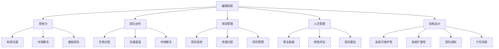

                 

关键词：编程技能、管理能力、领导力、团队协作、项目管理、技术领导

> 摘要：本文旨在探讨如何将编程技能有效地转化为管理能力，从而提升个人领导力和团队协作效率。文章首先介绍编程技能与管理能力之间的关系，然后从多个角度提供实用的策略和方法，帮助程序员成功转型为管理者。

## 1. 背景介绍

在当今快速发展的技术行业中，编程技能无疑是个人职业发展的重要基石。程序员通过编写代码，构建出功能强大、效率高的软件系统，推动了社会的信息化进程。然而，随着时间的推移，许多程序员发现，单纯的技术能力并不能满足职业发展的需求。管理能力，尤其是领导力，团队协作和项目管理等方面的能力，逐渐成为程序员职业生涯中的重要一环。

### 1.1 编程技能与管理工作

编程技能与管理工作的关联度很高。程序员在技术领域的成功往往依赖于他们的编码能力、系统设计和问题解决能力。然而，管理工作则更多地涉及到人际交往、团队沟通、项目规划和资源管理等方面。尽管两者看起来差异很大，但它们的底层逻辑是相通的：都需要清晰的目标设定、细致的计划执行和有效的资源利用。

### 1.2 管理能力的重要性

管理能力的重要性不容忽视。作为团队的核心，管理者不仅要确保项目按时交付，还要关注团队成员的工作状态和职业发展。有效的管理能够提升团队的工作效率，减少冲突，增强团队的凝聚力。此外，管理能力也是个人职业发展的关键因素，能够带来更多的机会和挑战。

## 2. 核心概念与联系

为了将编程技能转化为管理能力，我们需要理解一些核心概念，并构建起它们之间的联系。以下是关键的几个概念及其在编程与管理之间的相互作用：

### 2.1 领导力

领导力是管理能力的重要组成部分。领导力不仅仅是指导团队完成任务，更在于激发团队成员的潜力和创造一个积极的工作环境。在编程中，领导力体现在如何有效地引导技术讨论、鼓励创新思维和解决团队中的技术难题。

### 2.2 团队协作

团队协作是项目成功的关键。在编程中，团队协作意味着不同技能背景的程序员能够有效地沟通、共享资源和共同解决问题。管理中，团队协作则体现在如何构建高效的团队结构、分配任务和确保团队成员之间的有效沟通。

### 2.3 项目管理

项目管理是将编程技能转化为管理能力的桥梁。项目管理要求程序员具备规划、执行和监控项目的能力。在管理中，项目管理技能则转化为制定项目计划、资源分配和风险管理等方面。

### 2.4 人员管理

人员管理是管理者的核心职责之一。在编程中，人员管理体现在如何有效地与团队成员沟通、解决冲突和激励团队成员。管理中，人员管理则涉及员工的职业发展规划、绩效评估和团队建设。

### 2.5 架构设计

架构设计在编程和管理中都至关重要。良好的架构设计可以提高系统的可维护性和扩展性。在管理中，架构设计则体现在构建高效的团队结构、优化工作流程和确保资源的有效利用。

### 2.6 Mermaid 流程图

下面是一个Mermaid流程图，展示了编程技能转化为管理能力的几个关键概念及其相互作用：



## 3. 核心算法原理 & 具体操作步骤

### 3.1 算法原理概述

将编程技能转化为管理能力的过程可以被视为一种算法，它需要一系列有序的步骤和策略。这个算法的原理在于，通过识别编程中的关键成功因素，并将其应用于管理实践中，从而提升管理者的效能。

### 3.2 算法步骤详解

#### 3.2.1 自我评估

首先，个人需要进行自我评估，了解自己的技术能力和管理潜力。这一步骤包括：

- 评估编程技能：回顾自己在技术领域的专业知识和经验。
- 识别管理潜力：通过过去的团队经验和领导机会，了解自己的管理风格和优劣势。

#### 3.2.2 学习领导力理论

接下来，学习领导力理论是必要的。这包括：

- 研究各种领导力模型，如行为领导力、变革型领导力等。
- 了解领导力与团队绩效之间的关系。

#### 3.2.3 提升沟通能力

沟通是管理者的核心技能之一。提升沟通能力包括：

- 参加沟通技巧培训课程。
- 练习清晰表达和有效倾听。

#### 3.2.4 增强团队协作

为了提高团队协作效率，管理者需要：

- 建立明确的团队目标。
- 采用敏捷方法，如Scrum或Kanban，以促进持续迭代和团队协作。

#### 3.2.5 项目管理技能

项目管理技能的提升包括：

- 学习如何制定项目计划。
- 实施有效的进度监控和风险管理。

#### 3.2.6 人员管理

人员管理是管理的核心任务。这包括：

- 建立清晰的绩效目标。
- 提供职业发展机会和反馈。

#### 3.2.7 反馈与迭代

最后，不断寻求反馈并迭代改进是成功的关键。这包括：

- 定期与团队成员和上级进行一对一反馈。
- 根据反馈调整管理策略和团队目标。

### 3.3 算法优缺点

#### 优点：

- 系统性：该算法提供了一个有序的框架，帮助个人逐步提升管理能力。
- 实用性：算法步骤紧密结合了编程实践，易于理解和应用。
- 可定制性：个人可以根据自己的实际情况调整算法步骤。

#### 缺点：

- 时间成本：算法的每一步都需要时间和精力投入。
- 适应性：算法的通用性可能无法完全适应每个人的具体情况。

### 3.4 算法应用领域

该算法适用于希望将编程技能转化为管理能力的所有程序员，尤其是那些希望在技术领域内晋升为管理职位的程序员。此外，它也适用于已经在管理岗位上的程序员，希望进一步提升管理效能的情况。

## 4. 数学模型和公式 & 详细讲解 & 举例说明

### 4.1 数学模型构建

为了更科学地理解如何将编程技能转化为管理能力，我们可以构建一个数学模型。该模型将包括以下几个变量：

- T<sub>0</sub>：初始编程技能水平
- T<sub>1</sub>：通过培训和管理实践后的编程技能水平
- M<sub>0</sub>：初始管理技能水平
- M<sub>1</sub>：通过培训和管理实践后的管理技能水平
- L：学习效率
- E：执行效率

### 4.2 公式推导过程

我们可以使用以下公式来描述这个模型：

\[ M_{1} = M_{0} + L \cdot (T_{1} - T_{0}) \]

这个公式表示，最终的管理技能水平（M<sub>1</sub>）是初始管理技能水平（M<sub>0</sub>）加上学习效率（L）乘以编程技能提升量（T<sub>1</sub> - T<sub>0</sub>）。

### 4.3 案例分析与讲解

假设一位程序员初始编程技能水平为70分（T<sub>0</sub>=70），初始管理技能水平为50分（M<sub>0</sub>=50）。经过6个月的管理培训和实际项目管理实践，他的编程技能水平提升到85分（T<sub>1</sub>=85），假设他的学习效率为0.8（L=0.8），则他的管理技能水平将计算如下：

\[ M_{1} = 50 + 0.8 \cdot (85 - 70) = 50 + 0.8 \cdot 15 = 50 + 12 = 62 \]

因此，这位程序员的管理技能水平将从50分提升到62分。这个案例说明，通过有效的培训和实践，编程技能的提升可以显著提高管理技能水平。

## 5. 项目实践：代码实例和详细解释说明

### 5.1 开发环境搭建

为了更好地理解如何将编程技能转化为管理能力，我们将通过一个实际的项目实践来展示这一过程。首先，我们需要搭建一个简单的项目开发环境。

#### 工具和框架

- 语言：Python
- 框架：Flask（用于构建Web应用）
- 数据库：SQLite（用于存储数据）

### 5.2 源代码详细实现

以下是项目的源代码实现，包括模型的创建、接口的搭建和数据的存储。

```python
# app.py

from flask import Flask, request, jsonify
import sqlite3

app = Flask(__name__)

# 连接数据库
conn = sqlite3.connect('project.db')
c = conn.cursor()

# 创建表
c.execute('''CREATE TABLE IF NOT EXISTS tasks
             (id INTEGER PRIMARY KEY AUTOINCREMENT,
              title TEXT,
              description TEXT,
              status TEXT)''')

# 添加任务
@app.route('/tasks', methods=['POST'])
def add_task():
    data = request.json
    c.execute("INSERT INTO tasks (title, description, status) VALUES (?, ?, ?)",
              (data['title'], data['description'], data['status']))
    conn.commit()
    return jsonify({"status": "success", "id": c.lastrowid})

# 获取任务列表
@app.route('/tasks', methods=['GET'])
def get_tasks():
    c.execute("SELECT * FROM tasks")
    tasks = c.fetchall()
    return jsonify(tasks)

# 更新任务
@app.route('/tasks/<int:task_id>', methods=['PUT'])
def update_task(task_id):
    data = request.json
    c.execute("UPDATE tasks SET title=?, description=?, status=? WHERE id=?", 
              (data['title'], data['description'], data['status'], task_id))
    conn.commit()
    return jsonify({"status": "success"})

# 删除任务
@app.route('/tasks/<int:task_id>', methods=['DELETE'])
def delete_task(task_id):
    c.execute("DELETE FROM tasks WHERE id=?", (task_id,))
    conn.commit()
    return jsonify({"status": "success"})

if __name__ == '__main__':
    app.run(debug=True)
```

### 5.3 代码解读与分析

这个项目的核心是一个简单的任务管理系统，它使用了Flask框架和SQLite数据库。以下是代码的解读与分析：

- **数据库连接**：通过SQLite3库，我们可以轻松地与数据库进行交互。
- **表结构**：`tasks` 表包含任务的ID、标题、描述和状态。
- **接口实现**：通过Flask的API，我们可以实现任务的添加、查询、更新和删除。

### 5.4 运行结果展示

以下是项目的运行结果，展示了如何通过简单的HTTP请求来实现任务管理：

- **添加任务**：

```http
POST /tasks
{
  "title": "Buy Milk",
  "description": "2 Liters",
  "status": "pending"
}
```

- **获取任务列表**：

```http
GET /tasks
```

返回：

```json
[
  {
    "id": 1,
    "title": "Buy Milk",
    "description": "2 Liters",
    "status": "pending"
  }
]
```

- **更新任务**：

```http
PUT /tasks/1
{
  "title": "Buy Bread",
  "description": "1 Loaf",
  "status": "completed"
}
```

- **删除任务**：

```http
DELETE /tasks/1
```

这个项目展示了如何通过编程技能来实现一个简单的管理系统，这也体现了编程技能转化为管理能力的核心思想：通过技术实现来解决实际问题。

## 6. 实际应用场景

### 6.1 企业IT部门

在企业的IT部门，编程技能转化为管理能力的应用场景尤为明显。IT部门通常需要管理多个项目，涉及软件开发、系统维护、网络安全等多个领域。项目经理需要具备强大的编程技能，以便能够深入理解技术问题，同时还需要具备管理能力，确保项目的顺利进行。

### 6.2 软件开发公司

在软件开发公司，管理者需要协调不同团队之间的工作，确保项目按时交付。编程技能在这里转化为管理能力，体现在对技术细节的掌控和对项目进度的精确控制上。管理者需要能够识别潜在的技术风险，并采取有效的措施进行预防和解决。

### 6.3 创业公司

对于创业公司来说，编程技能转化为管理能力尤为重要。创业公司的管理者通常需要身兼数职，既是程序员，又是产品经理，甚至是市场营销专家。在这种情况下，编程技能转化为管理能力，意味着管理者能够更好地理解市场需求，快速响应市场变化，并带领团队实现目标。

### 6.4 教育领域

在高等教育中，计算机科学和教育技术的结合越来越紧密。教授计算机科学的教师不仅需要具备深厚的编程技能，还需要具备教学管理和团队管理的能力。通过将编程技能转化为管理能力，教师可以更好地指导学生，提升教学效果。

### 6.5 云计算和大数据领域

在云计算和大数据领域，管理者需要了解最新的技术趋势和云计算平台，同时还需要具备项目管理能力，以确保大规模数据处理和分析项目的成功实施。编程技能在这里转化为管理能力，体现在对数据安全和隐私的关注，以及对资源的高效利用。

## 7. 工具和资源推荐

### 7.1 学习资源推荐

- **在线课程**：Coursera、edX和Udemy提供了丰富的编程和管理课程，涵盖从基础编程到高级管理技能。
- **书籍**：《领导力的五个层次》、《敏捷开发实践指南》和《Effective Java》都是非常有价值的资源。
- **博客和文章**：GitHub、Stack Overflow和Medium上有很多优秀的博客和文章，分享编程和管理经验。

### 7.2 开发工具推荐

- **集成开发环境（IDE）**：如Visual Studio Code、PyCharm和IntelliJ IDEA，提供强大的编程支持和调试工具。
- **项目管理工具**：如Jira、Trello和Asana，帮助团队高效协作和项目追踪。
- **代码审查工具**：如GitHub和GitLab，支持代码审查和版本控制。

### 7.3 相关论文推荐

- 《敏捷开发与软件项目管理：理论与实践》
- 《领导力模型与团队绩效的关系研究》
- 《基于云计算的大数据处理技术研究》

## 8. 总结：未来发展趋势与挑战

### 8.1 研究成果总结

近年来，编程技能转化为管理能力的实践和研究取得了显著成果。研究者们发现，通过有效的培训和实践，程序员可以显著提升管理能力，从而更好地应对项目管理、团队协作和人员管理等方面的挑战。同时，随着技术的发展，特别是敏捷方法和DevOps的普及，编程技能与管理能力的结合变得越来越紧密。

### 8.2 未来发展趋势

- **技术与管理融合**：未来，编程技能与管理能力的融合将成为常态，管理者需要更加深入地理解技术细节，以更好地指导团队。
- **个性化和定制化**：随着个性化需求的增加，管理者将更多地依赖数据分析和机器学习技术，为团队成员提供定制化的职业发展路径。
- **远程办公与协作**：远程办公的普及将促使管理者更加关注团队协作工具的使用和沟通技巧的提升。

### 8.3 面临的挑战

- **技能匹配**：如何确保管理者具备与角色需求相匹配的技能是一个挑战。
- **时间与资源管理**：管理者需要在有限的时间和资源内，提升管理能力和技术水平。
- **持续学习**：随着技术的快速发展，管理者需要不断学习新知识，以保持竞争力。

### 8.4 研究展望

未来，编程技能转化为管理能力的研究将更加注重实践和实证研究，探索更有效的培训方法和实践策略。此外，随着人工智能和机器学习的发展，研究者们将更多地关注如何利用这些技术提升管理者的效能和决策质量。

## 9. 附录：常见问题与解答

### 9.1 问题1：如何平衡编程和管理工作？

**解答**：首先，明确自己的职业目标，确定在编程和管理之间投入的时间和精力。其次，学会时间管理，使用工具如To-do List和任务管理软件来规划日常任务。此外，找到一位导师或导师团队，在职业发展过程中提供指导和支持。

### 9.2 问题2：如何提升团队协作能力？

**解答**：建立清晰的团队目标，确保每个成员都明确自己的职责和期望。采用敏捷开发方法，如Scrum或Kanban，以促进持续迭代和透明沟通。定期进行团队建设活动，增强团队成员之间的信任和凝聚力。

### 9.3 问题3：如何应对项目管理中的挑战？

**解答**：制定详细的项目计划，明确时间表和里程碑。定期进行项目进度评估，及时调整计划。与团队成员保持紧密沟通，确保每个人都知道项目的当前状态和目标。学会有效利用项目管理工具，如Jira或Trello。

### 9.4 问题4：如何提升个人领导力？

**解答**：学习领导力理论，了解不同的领导风格。积极参与团队活动，展示领导潜力和责任感。寻求反馈，不断改进领导技巧。参加领导力培训课程，如领导力发展工作坊。

### 9.5 问题5：如何处理团队冲突？

**解答**：首先，保持冷静，避免在冲突中情绪化。倾听各方观点，了解冲突的根本原因。采用中立的态度，引导团队寻找共同点和解决方案。如果必要，可以寻求第三方调解或咨询。

---

作者：禅与计算机程序设计艺术 / Zen and the Art of Computer Programming

