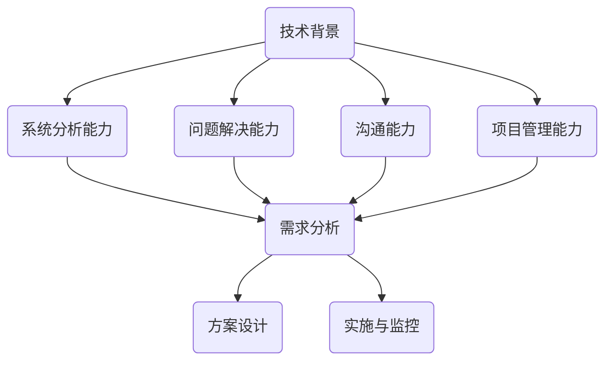

                 

 关键词：编程技能、高管咨询、技术转化、商业策略、IT行业、领导力

> 摘要：本文将探讨如何将深厚的编程技能转化为有价值的商业咨询能力，为高管提供有针对性的IT解决方案。通过分析技术背景、核心能力培养、咨询方法论、案例研究和未来趋势，揭示程序员成为IT顾问的路径。

## 1. 背景介绍

在当今数字化时代，信息技术（IT）已成为企业运营的基石。企业需要高效、灵活的IT系统来支持业务增长和创新。然而，许多企业在IT领域面临着人才短缺、技术更新迭代快等问题。这为具有编程背景的专业人士提供了一个独特的机会，将他们的技术专长转化为商业咨询，帮助企业解决复杂的IT挑战。

编程技能不仅仅是对代码的编写，更是一种系统性思维和问题解决能力。程序员在长期的编程实践中，培养了对复杂系统架构的理解、对技术趋势的敏感度以及对快速变化环境的适应力。这些能力正是商业咨询所需的宝贵资产。

本文旨在探讨如何将这些技能转化为高管咨询服务。通过分析技术背景、核心能力培养、咨询方法论、案例研究和未来趋势，揭示程序员成为IT顾问的路径。

## 2. 核心概念与联系

### 2.1 技术背景

在进入高管咨询服务之前，程序员需要对其所在的技术领域有深刻的理解。这包括对编程语言、框架、数据库、云计算、网络安全等方面的知识。同时，还需要了解企业IT系统的常见架构，如微服务、容器化、DevOps等。

### 2.2 核心能力

- **系统分析能力**：能够从整体上理解企业的业务流程，识别出IT系统中的瓶颈和改进空间。
- **问题解决能力**：在面对复杂的IT问题时，能够迅速找到根本原因，并提出有效的解决方案。
- **沟通能力**：能够清晰地向非技术人员解释复杂的技术概念，确保决策者能够理解并支持IT项目。
- **项目管理能力**：能够管理IT项目的进度、资源和风险，确保项目按时、按预算完成。

### 2.3 咨询方法论

- **需求分析**：通过与客户深入交流，了解企业的业务需求、技术现状和未来规划。
- **方案设计**：基于需求分析，设计出符合企业需求的IT解决方案。
- **实施与监控**：指导客户实施IT项目，并进行持续的监控和优化。

### 2.4 Mermaid 流程图



## 3. 核心算法原理 & 具体操作步骤

### 3.1 算法原理概述

作为程序员，掌握一些核心算法原理对于成为高管顾问至关重要。这些算法原理包括但不限于排序算法、查找算法、图算法等。掌握这些原理可以帮助顾问快速识别和解决复杂的业务问题。

### 3.2 算法步骤详解

- **排序算法**：常用的排序算法有快速排序、归并排序、堆排序等。顾问需要根据具体业务场景选择合适的排序算法。
- **查找算法**：二分查找、散列表查找等算法对于处理大量数据的高效查找至关重要。
- **图算法**：Dijkstra算法、A*算法等在解决网络优化、路径规划等问题中非常有用。

### 3.3 算法优缺点

- **排序算法**：快速排序速度快，但稳定性较差；归并排序稳定性好，但时间复杂度较高。
- **查找算法**：二分查找时间复杂度为O(log N)，适用于大量数据的快速查找。
- **图算法**：Dijkstra算法适用于单源最短路径问题，但计算复杂度较高。

### 3.4 算法应用领域

- **排序算法**：在金融、电子商务等领域，用于数据处理和排序。
- **查找算法**：在搜索引擎、数据库系统中广泛应用。
- **图算法**：在物流、交通规划、社交网络分析等领域有广泛应用。

## 4. 数学模型和公式 & 详细讲解 & 举例说明

### 4.1 数学模型构建

在IT咨询中，数学模型的应用非常广泛。例如，在预测分析中，可以使用回归模型、时间序列模型等来预测业务需求、用户行为等。

### 4.2 公式推导过程

以线性回归模型为例，其基本公式为：

$$ y = \beta_0 + \beta_1x + \epsilon $$

其中，$y$ 是因变量，$x$ 是自变量，$\beta_0$ 和 $\beta_1$ 是模型参数，$\epsilon$ 是误差项。

### 4.3 案例分析与讲解

假设我们要预测一家电商平台的每日订单量。我们可以使用线性回归模型来建立预测模型。首先，收集过去一个月的订单数据，然后使用数据预处理技术（如去重、缺失值处理）清洗数据。

接下来，使用统计软件（如Python的scikit-learn库）进行线性回归分析，得到模型参数 $\beta_0$ 和 $\beta_1$。最后，使用该模型预测未来几天的订单量。

## 5. 项目实践：代码实例和详细解释说明

### 5.1 开发环境搭建

在本案例中，我们将使用Python和scikit-learn库进行线性回归分析。首先，确保安装了Python和scikit-learn库。

```bash
pip install python
pip install scikit-learn
```

### 5.2 源代码详细实现

以下是一个简单的线性回归预测脚本：

```python
import numpy as np
import pandas as pd
from sklearn.linear_model import LinearRegression

# 数据预处理
data = pd.read_csv('orders.csv')
data = data[['day', 'orders']]
data = data.dropna()

# 划分特征和标签
X = data[['day']]
y = data['orders']

# 模型训练
model = LinearRegression()
model.fit(X, y)

# 预测
predictions = model.predict(X)

# 结果展示
print(predictions)
```

### 5.3 代码解读与分析

- 第1-3行：导入必要的库。
- 第4行：读取订单数据。
- 第5-6行：选择特征和标签。
- 第7行：数据预处理。
- 第8-9行：划分特征和标签。
- 第10-11行：模型训练。
- 第12行：预测。
- 第13行：结果展示。

### 5.4 运行结果展示

运行脚本后，会得到一个数组，其中包含了每个天的订单预测量。

## 6. 实际应用场景

### 6.1 企业IT系统优化

作为IT顾问，可以帮助企业优化现有的IT系统，提高系统性能和稳定性。例如，通过性能测试和代码审查，找出系统瓶颈，并提出改进建议。

### 6.2 项目管理

在IT项目中，负责项目规划、资源分配和风险管理，确保项目按时、按预算完成。

### 6.3 技术培训与指导

为企业提供技术培训，帮助员工提升技术水平，从而提高企业的整体IT能力。

## 7. 未来应用展望

随着企业对数字化转型的需求不断增长，IT顾问的角色将变得更加重要。未来，程序员可以通过不断提升自己的业务理解能力和咨询服务技巧，为企业提供更加个性化和高价值的IT解决方案。

## 8. 工具和资源推荐

### 8.1 学习资源推荐

- 《企业IT架构：策略与实践》
- 《项目管理：系统化方法和工具》
- 《深度学习与数据科学实战》

### 8.2 开发工具推荐

- Jupyter Notebook：方便进行数据分析和建模。
- Git：版本控制工具，有助于团队协作。
- Docker：容器化技术，简化部署和运维。

### 8.3 相关论文推荐

- "Digital Transformation in Enterprises: A Framework and Case Study"
- "The Role of IT Consultants in Business Success"
- "Artificial Intelligence and Its Impact on the IT Industry"

## 9. 总结：未来发展趋势与挑战

### 9.1 研究成果总结

本文探讨了如何将编程技能转化为高管咨询服务，分析了技术背景、核心能力培养、咨询方法论、案例研究和未来趋势。

### 9.2 未来发展趋势

未来，程序员将更加注重业务理解和技术创新，为企业提供更加个性化和高价值的IT解决方案。

### 9.3 面临的挑战

- 如何平衡技术深度与业务理解。
- 如何快速适应不断变化的技术趋势。

### 9.4 研究展望

未来，IT顾问需要不断提升自己的业务洞察力和技术创新能力，以应对企业数字化转型带来的挑战。

## 10. 附录：常见问题与解答

### Q: 编程技能和商业咨询之间有直接联系吗？

A: 是的，编程技能中的系统思考、问题解决和沟通能力是商业咨询的重要基础。

### Q: 成为IT顾问需要哪些技能？

A: 除了编程技能外，还需要系统分析、项目管理、沟通和业务理解能力。

### Q: 如何开始从事IT顾问工作？

A: 可以通过积累项目经验、学习相关课程和参与行业交流来提升自己的能力。

### Q: IT顾问的前景如何？

A: 随着企业对数字化转型的需求不断增加，IT顾问的前景非常广阔。

### 作者署名

作者：禅与计算机程序设计艺术 / Zen and the Art of Computer Programming
----------------------------------------------------------------

