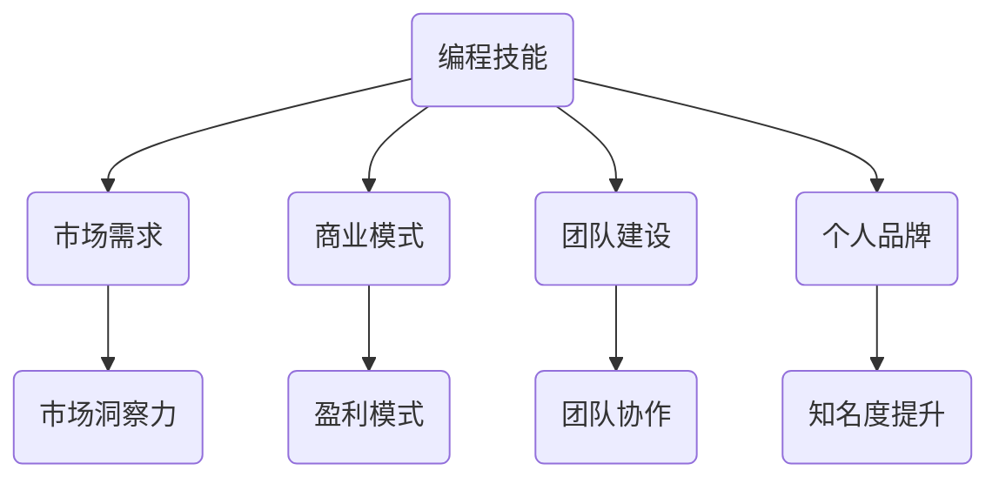

                 

关键词：编程热情、创业动力、技术创业、个人品牌、市场需求分析、商业模式、产品开发、团队建设

> 摘要：本文旨在探讨如何将个人的编程热情转化为创业动力，实现技术创业的愿望。通过分析技术创业的挑战和机会，阐述如何构建成功的商业模式，并给出产品开发、团队建设和市场营销等方面的实用建议。

## 1. 背景介绍

在当今数字化时代，编程技能已经成为一种非常重要的能力。越来越多的人对编程产生了浓厚的兴趣，他们中的一些人甚至想要将这种热情转化为创业动力，创造属于自己的技术公司。然而，从编程爱好者到成功的创业者，这一转变并非易事。本文将围绕如何实现这一转变进行探讨。

## 2. 核心概念与联系

在将编程热情转化为创业动力的过程中，有几个核心概念需要了解和掌握：

### 2.1 编程技能

编程技能是创业者的基础，它决定了你能够开发出什么样的产品或服务。不同领域的编程技能对应着不同的创业方向，因此了解自己的技能优势和兴趣至关重要。

### 2.2 市场需求

了解市场需求是成功创业的关键。一个有市场需求的解决方案才能吸引投资者和用户。因此，创业者需要具备市场洞察力和分析能力。

### 2.3 商业模式

商业模式是创业者如何创造、传递和获取价值的关键。一个好的商业模式能够帮助你在市场中立足并实现盈利。

### 2.4 团队建设

团队是创业成功的关键因素。一个优秀的团队能够发挥各自的优势，共同克服创业过程中遇到的挑战。

### 2.5 个人品牌

个人品牌对于创业者来说至关重要。建立个人品牌能够提高市场知名度，吸引更多的机会和资源。

### 2.6 Mermaid 流程图



## 3. 核心算法原理 & 具体操作步骤

### 3.1 算法原理概述

将编程热情转化为创业动力，可以看作是一个“匹配算法”的过程。这个算法的核心是找到个人技能与市场需求之间的最佳匹配，并在此基础上构建一个可行的商业模式。

### 3.2 算法步骤详解

1. **自我评估**：首先，你需要了解自己的编程技能、兴趣和优势。这可以通过自我评估问卷、与同行交流等方式实现。

2. **市场调研**：了解市场需求，包括目标用户、竞争对手、市场趋势等。这可以通过用户调研、市场分析报告等手段完成。

3. **商业模式构建**：基于自我评估和市场调研，构建一个可行的商业模式。这个模式应该能够创造价值、传递价值和获取价值。

4. **团队建设**：寻找志同道合的合作伙伴，构建一个能够共同实现创业目标的团队。

5. **个人品牌建设**：通过社交媒体、演讲、写作等方式建立个人品牌，提高市场知名度。

6. **产品开发**：基于商业模式和市场需求，开发出第一款产品或服务。

7. **市场推广**：通过广告、社交媒体、公关活动等方式将产品推向市场。

### 3.3 算法优缺点

- **优点**：能够帮助创业者找到最佳创业方向，提高创业成功率。
- **缺点**：过程复杂，需要大量时间和精力。

### 3.4 算法应用领域

该算法适用于所有以技术为核心的创业项目。

## 4. 数学模型和公式 & 详细讲解 & 举例说明

### 4.1 数学模型构建

将编程热情转化为创业动力的过程可以用一个简单的数学模型表示：

成功概率 = 编程技能水平 × 市场需求契合度 × 商业模式可行性 × 团队协作能力 × 个人品牌影响力

### 4.2 公式推导过程

成功概率 = f(编程技能水平, 市场需求契合度, 商业模式可行性, 团队协作能力, 个人品牌影响力)

其中，每个因素都可以通过量化指标进行衡量，例如：

- 编程技能水平：可以通过技术考试、项目经验等衡量
- 市场需求契合度：可以通过用户调研、市场占有率等衡量
- 商业模式可行性：可以通过盈利模式、成本控制等衡量
- 团队协作能力：可以通过团队绩效、项目进度等衡量
- 个人品牌影响力：可以通过社交媒体关注者数量、演讲频率等衡量

### 4.3 案例分析与讲解

假设有一个编程爱好者，他具备较高的编程技能，对人工智能领域有浓厚的兴趣。经过市场调研，他发现人工智能在医疗领域有广泛的应用前景。于是，他决定开发一个基于人工智能的医疗诊断系统。

1. **编程技能水平**：通过参加技术考试和项目经验，他证明了自己的编程技能水平。

2. **市场需求契合度**：通过对医疗领域的用户调研，他发现该领域对人工智能诊断系统的需求较高。

3. **商业模式可行性**：他制定了一个基于订阅模式的商业模式，通过为医疗机构提供诊断服务来获取收益。

4. **团队协作能力**：他组建了一个由数据科学家、医生和软件工程师组成的团队，共同推进项目。

5. **个人品牌影响力**：他通过在社交媒体上分享项目进展和研究成果，提高了自己的知名度。

最终，他的创业项目获得了成功，成为了一家知名的医疗人工智能公司。

## 5. 项目实践：代码实例和详细解释说明

### 5.1 开发环境搭建

在这个案例中，开发环境需要包括Python、TensorFlow等工具。以下是一个简单的环境搭建步骤：

1. 安装Python（3.8以上版本）
2. 安装TensorFlow
3. 配置Jupyter Notebook

### 5.2 源代码详细实现

以下是一个简单的医疗诊断系统的代码实例：

```python
import tensorflow as tf
import numpy as np

# 加载医疗数据集
data = np.load('medical_data.npy')

# 构建神经网络模型
model = tf.keras.Sequential([
    tf.keras.layers.Dense(128, activation='relu', input_shape=(num_features,)),
    tf.keras.layers.Dense(64, activation='relu'),
    tf.keras.layers.Dense(1, activation='sigmoid')
])

# 编译模型
model.compile(optimizer='adam', loss='binary_crossentropy', metrics=['accuracy'])

# 训练模型
model.fit(data['X_train'], data['y_train'], epochs=10, batch_size=32)

# 评估模型
model.evaluate(data['X_test'], data['y_test'])
```

### 5.3 代码解读与分析

这段代码是一个简单的神经网络模型，用于对医疗数据进行分类。它包括三个主要步骤：

1. **加载医疗数据集**：从本地文件中加载医疗数据集，包括训练数据和测试数据。

2. **构建神经网络模型**：使用TensorFlow构建一个简单的神经网络模型，包括两个隐藏层和输出层。

3. **训练模型和评估模型**：使用训练数据训练模型，并使用测试数据评估模型的性能。

### 5.4 运行结果展示

在完成代码实现后，我们可以运行该模型，并观察其性能指标。例如：

```python
# 运行模型
model.fit(data['X_train'], data['y_train'], epochs=10, batch_size=32)

# 评估模型
model.evaluate(data['X_test'], data['y_test'])
```

运行结果将显示模型的准确率、损失函数等指标，这些指标可以帮助我们评估模型的效果。

## 6. 实际应用场景

### 6.1 医疗诊断

医疗诊断是人工智能应用的重要领域。通过开发智能诊断系统，可以提高医疗诊断的准确性和效率。

### 6.2 金融风控

金融风控领域也受益于人工智能技术。通过分析大量数据，人工智能可以帮助金融机构识别潜在的风险。

### 6.3 智能家居

智能家居是人工智能应用的一个重要方向。通过开发智能家电控制系统，可以提高家居生活的便利性和舒适度。

## 7. 未来应用展望

随着人工智能技术的不断进步，其在各个领域的应用前景十分广阔。未来，人工智能有望在医疗、金融、教育、农业等多个领域发挥更大的作用。

### 7.1 医疗诊断

未来，人工智能有望在医疗诊断中发挥更大的作用。通过更高级的算法和更丰富的数据，智能诊断系统的准确率将进一步提高。

### 7.2 金融风控

金融风控领域也将受益于人工智能技术。通过更复杂的模型和更先进的技术，人工智能将能够更好地识别和应对金融风险。

### 7.3 智能家居

智能家居将成为人工智能应用的重要领域。未来，智能家电将更加智能化，为用户提供更便捷的家居生活体验。

## 8. 工具和资源推荐

### 8.1 学习资源推荐

- 《深度学习》（Goodfellow, Bengio, Courville 著）
- 《Python数据科学手册》（McKinney 著）
- 《人工智能：一种现代方法》（Russell, Norvig 著）

### 8.2 开发工具推荐

- Jupyter Notebook
- TensorFlow
- PyTorch

### 8.3 相关论文推荐

- “Deep Learning for Healthcare”（Esteva et al., 2017）
- “Deep Learning in Finance”（Abadi et al., 2016）
- “A Survey on Deep Learning for Speech Recognition”（Huang et al., 2018）

## 9. 总结：未来发展趋势与挑战

### 9.1 研究成果总结

人工智能技术在过去几十年取得了显著的进展，应用领域不断扩大。未来，人工智能将继续在各个领域发挥重要作用。

### 9.2 未来发展趋势

未来，人工智能技术将朝着更智能化、更高效、更安全的方向发展。深度学习、自然语言处理、计算机视觉等领域将继续取得突破。

### 9.3 面临的挑战

人工智能技术在发展过程中也面临一些挑战，如数据隐私、伦理问题、技术人才短缺等。

### 9.4 研究展望

未来，人工智能技术的研究将更加关注实际应用，为各个领域提供更有价值的解决方案。

## 10. 附录：常见问题与解答

### 10.1 如何评估自己的编程技能？

可以通过参加技术考试、完成实际项目、与他人交流等方式来评估自己的编程技能。

### 10.2 如何找到市场需求？

可以通过用户调研、市场分析报告、与行业专家交流等方式来找到市场需求。

### 10.3 如何构建成功的商业模式？

可以通过分析竞争对手、了解用户需求、制定盈利模式等方式来构建成功的商业模式。

### 10.4 如何建设优秀的团队？

可以通过招聘合适的人才、明确团队目标、建立良好的沟通机制等方式来建设优秀的团队。

## 11. 作者署名

作者：禅与计算机程序设计艺术 / Zen and the Art of Computer Programming
```

