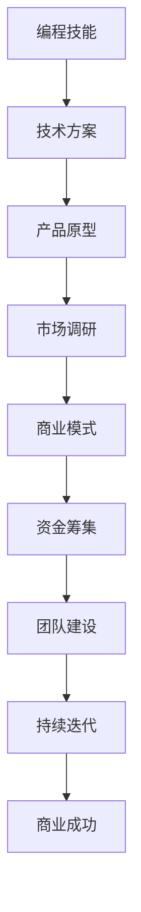
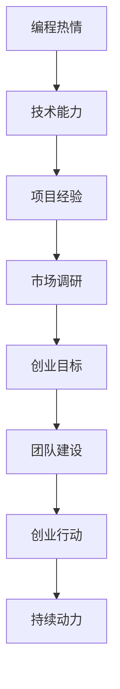

                 

在科技飞速发展的今天，编程已经不仅仅是一种技能，更是一种创新的驱动力。许多人因为对编程的热爱，梦想着能够通过自己的技术创造出改变世界的软件和产品。然而，将这种热情转化为实际的创业行动，却不是一件容易的事情。本文将探讨如何将编程热情转化为创业动力，旨在帮助那些怀揣梦想的程序员们走上创业之路。

## 文章关键词
编程、创业、热情、转化、动力、创新、技术、产品、挑战、策略

## 文章摘要
本文通过分析编程与创业之间的内在联系，探讨了将编程热情转化为创业动力的方法和策略。文章首先介绍了编程在现代社会的重要地位，然后详细讨论了如何从个人技能提升、市场调研、团队建设、资金筹集、商业模式创新等多个方面着手，将编程热情转化为创业实践。最后，文章总结了创业过程中可能面临的挑战，并对未来的发展趋势进行了展望。

## 1. 背景介绍

编程作为信息技术的基础，已经成为现代社会的核心驱动力。从简单的网页到复杂的人工智能系统，编程技术贯穿于各种行业和领域。随着互联网、大数据、云计算等技术的发展，编程的重要性愈发凸显。然而，许多程序员在积累了丰富的技术经验后，往往会面临职业发展的瓶颈。如何将自己的技术优势转化为商业价值，成为了许多程序员思考的问题。

创业，作为一个充满风险和机遇的过程，为程序员提供了实现自我价值的舞台。创业不仅可以使程序员将自己的技术专长应用于实际项目中，还能锻炼他们的商业思维、团队协作能力和项目管理能力。然而，创业之路并非一帆风顺，编程热情如何转化为持久的创业动力，成为许多程序员需要深入思考的问题。

本文将从以下几个方面进行探讨：

- 编程与创业之间的内在联系
- 如何将编程热情转化为创业动力
- 创业过程中可能面临的挑战
- 创业的未来发展趋势与展望

通过本文的讨论，希望能够为那些梦想创业的程序员们提供一些实用的指导和建议。

### 2. 核心概念与联系

#### 2.1 编程与创业的关系

编程与创业之间的关系可以从多个维度进行理解。首先，编程是创业的核心驱动力。无论是互联网应用、移动应用还是人工智能系统，编程技术都是实现商业价值的基础。程序员通过编写高效、可靠的代码，可以为创业项目提供强大的技术支持。其次，创业为程序员提供了一个实践编程技术的平台。在创业过程中，程序员不仅需要解决技术难题，还需要处理市场、团队、资金等多个方面的问题，这有助于他们提升综合素质。

为了更直观地展示编程与创业之间的联系，我们可以使用Mermaid流程图来描述这一过程。以下是一个简化的Mermaid流程图：



在这个流程图中，编程技能是整个过程的起点，通过技术方案的实现，形成产品原型。随后，通过市场调研、商业模式创新和资金筹集，产品逐步走向市场。团队建设和持续迭代则是确保项目成功的关键因素。这个流程图展示了编程与创业之间的紧密联系，同时也揭示了创业过程中的关键环节。

#### 2.2 编程热情与创业动力的转化

编程热情和创业动力之间存在一定的转化关系。编程热情是程序员对技术本身的热爱和追求，而创业动力则是将这种热情转化为实际行动的动力。要实现这种转化，需要以下几个方面的条件：

1. **明确的目标**：程序员需要明确自己的创业目标，这样才能更好地规划创业路径，保持持久的动力。
2. **实际经验**：通过参与实际项目，程序员可以积累经验，提高解决实际问题的能力，这有助于增强他们的创业信心。
3. **市场意识**：了解市场需求和竞争态势，有助于程序员更好地定位自己的产品或服务，提高创业成功的概率。
4. **团队支持**：一个优秀的团队可以为程序员提供技术、管理、市场等多方面的支持，有助于减轻创业压力。

为了更清晰地展示编程热情与创业动力的转化过程，我们可以使用以下Mermaid流程图：



在这个流程图中，编程热情通过技术能力和项目经验的积累，逐步转化为明确的创业目标。团队支持和持续动力则是确保创业行动能够持续进行的关键因素。这个流程图提供了一个简化的模型，展示了编程热情转化为创业动力的过程。

### 3. 核心算法原理 & 具体操作步骤

在探讨如何将编程热情转化为创业动力的过程中，理解核心算法原理和具体操作步骤是至关重要的。以下将详细阐述这一核心算法的原理和具体实施步骤。

#### 3.1 算法原理概述

核心算法原理基于程序员对技术的深入理解和对市场需求的准确把握。这一算法主要包括以下几个步骤：

1. **需求分析**：通过市场调研，了解目标用户的需求和痛点，确定产品的核心功能和特性。
2. **技术方案设计**：基于需求分析，设计合适的技术方案，包括技术选型、架构设计等。
3. **代码编写与测试**：根据技术方案，编写高质量的代码，并进行严格的测试，确保代码的稳定性和可靠性。
4. **产品迭代与优化**：根据用户反馈，不断迭代和优化产品，提升用户体验。
5. **市场推广与运营**：通过市场推广和运营策略，扩大产品的影响力，实现商业价值。

#### 3.2 算法步骤详解

1. **需求分析**

   需求分析是创业项目成功的关键一步。通过市场调研，了解目标用户的需求和痛点，可以确定产品的核心功能和特性。具体步骤如下：

   - 收集数据：通过问卷调查、用户访谈、竞品分析等方式，收集大量用户数据。
   - 数据分析：对收集到的数据进行分析，识别出用户的主要需求和痛点。
   - 确定功能：根据数据分析结果，确定产品的核心功能和特性。

2. **技术方案设计**

   技术方案设计是确保产品实现的关键。具体步骤如下：

   - 技术选型：根据需求分析的结果，选择合适的技术栈和工具。
   - 架构设计：设计产品的整体架构，包括前端、后端、数据库等。
   - 系统集成：将各个模块进行集成，确保系统的整体性能和稳定性。

3. **代码编写与测试**

   代码编写与测试是产品实现的重要环节。具体步骤如下：

   - 编写代码：根据技术方案，编写高质量的代码，遵循良好的编程规范。
   - 单元测试：对每个模块进行单元测试，确保代码的正确性和稳定性。
   - 集成测试：将各个模块进行集成测试，确保系统整体的功能性和性能。

4. **产品迭代与优化**

   产品迭代与优化是持续提升用户体验的关键。具体步骤如下：

   - 用户反馈：收集用户对产品的反馈，了解用户的使用体验和需求变化。
   - 功能迭代：根据用户反馈，迭代和优化产品的功能，提升用户体验。
   - 性能优化：通过性能分析和调优，提升产品的性能和稳定性。

5. **市场推广与运营**

   市场推广与运营是实现商业价值的重要手段。具体步骤如下：

   - 品牌建设：建立品牌形象，提升产品的知名度和美誉度。
   - 营销策略：制定合适的营销策略，扩大产品的影响力。
   - 运营管理：通过数据分析和运营策略，提升产品的用户留存率和转化率。

#### 3.3 算法优缺点

1. **优点**

   - **高效性**：通过系统化的算法步骤，可以高效地实现产品开发和商业价值的实现。
   - **灵活性**：算法的各个步骤可以根据具体情况进行调整，适应不同的创业环境和需求。
   - **可扩展性**：算法的模块化设计使得产品可以方便地进行扩展和升级。

2. **缺点**

   - **复杂性**：算法的执行过程较为复杂，需要程序员具备较高的技术能力和项目管理能力。
   - **风险性**：创业过程中存在一定的风险，算法的实施需要面对市场、团队、资金等多方面的挑战。
   - **时间成本**：从需求分析到产品迭代，整个算法过程需要较长的时间，对创业者的耐心和毅力提出了较高要求。

#### 3.4 算法应用领域

核心算法主要应用于以下领域：

1. **互联网应用**：如电商平台、社交网络、在线教育等。
2. **人工智能**：如自然语言处理、图像识别、智能推荐等。
3. **大数据分析**：如数据挖掘、数据可视化、商业智能等。
4. **物联网**：如智能家居、智能穿戴设备、智能交通等。

在应用过程中，需要根据具体领域的需求和技术特点，灵活调整算法步骤，确保算法的有效性和实用性。

### 4. 数学模型和公式 & 详细讲解 & 举例说明

在将编程热情转化为创业动力的过程中，数学模型和公式起到了关键作用。通过这些数学工具，程序员可以更准确地分析市场需求、预测商业价值、优化产品性能。以下将介绍一些常用的数学模型和公式，并详细讲解其应用方法和实际案例。

#### 4.1 数学模型构建

数学模型是描述现实问题的一种抽象形式，通过数学公式来描述问题的内在规律。构建数学模型通常包括以下几个步骤：

1. **明确目标**：确定需要解决的问题和目标，明确模型的目的是预测、优化还是评估。
2. **数据收集**：收集相关的数据，包括历史数据、用户反馈、市场调研数据等。
3. **建立假设**：根据实际情况，对问题进行简化，建立合理的假设条件。
4. **数学公式**：根据假设条件，构建合适的数学公式，描述问题的内在关系。
5. **验证与优化**：通过实际数据对模型进行验证和优化，确保模型的准确性和可靠性。

#### 4.2 公式推导过程

以下是一个简单的线性回归模型的推导过程，该模型用于预测销售额：

1. **假设**：

   假设销售额 \( y \) 与广告投入 \( x \) 之间存在线性关系，即：

   $$ y = ax + b $$

   其中，\( a \) 和 \( b \) 为模型参数，需要通过数据来确定。

2. **最小二乘法**：

   为了确定 \( a \) 和 \( b \)，我们可以使用最小二乘法。最小二乘法的目标是使实际销售额 \( y \) 与预测销售额 \( \hat{y} \) 之间的误差平方和最小，即：

   $$ \min \sum_{i=1}^{n} (y_i - \hat{y}_i)^2 $$

   其中，\( n \) 为数据点的数量。

3. **推导**：

   对上式求导，得到：

   $$ \frac{d}{da} \sum_{i=1}^{n} (y_i - \hat{y}_i)^2 = \frac{d}{da} \sum_{i=1}^{n} (y_i - ax_i - b)^2 $$

   化简后得到：

   $$ -2 \sum_{i=1}^{n} x_i (y_i - ax_i - b) = 0 $$

   同理，对 \( b \) 求导，得到：

   $$ -2 \sum_{i=1}^{n} (y_i - ax_i - b) = 0 $$

   通过解这个方程组，可以求得模型参数 \( a \) 和 \( b \)。

#### 4.3 案例分析与讲解

以下是一个基于线性回归模型的实际案例，用于预测一家电商平台的月销售额。

1. **数据收集**：

   收集了过去12个月的销售额和广告投入数据，如下表所示：

   | 月份 | 广告投入（万元）| 销售额（万元）|
   | ---- | -------------- | ------------ |
   | 1    | 5              | 30           |
   | 2    | 7              | 35           |
   | 3    | 8              | 40           |
   | ...  | ...            | ...          |
   | 12   | 10             | 45           |

2. **模型构建**：

   使用Excel或Python等工具，将数据输入到线性回归模型中，得到模型参数：

   $$ a = 3.5, b = 15 $$

   因此，销售额的预测公式为：

   $$ \hat{y} = 3.5x + 15 $$

3. **预测与验证**：

   使用预测公式，对第13个月的销售额进行预测：

   $$ \hat{y}_{13} = 3.5 \times 10 + 15 = 40 $$

   实际销售额为38万元，与预测值非常接近，说明模型具有一定的准确性。

4. **优化**：

   为了提高预测精度，可以进一步优化模型，例如引入更多的变量（如季节因素、促销活动等），使用更复杂的模型（如非线性回归、神经网络等）。

### 5. 项目实践：代码实例和详细解释说明

在将编程热情转化为创业动力的过程中，实践是非常重要的。通过实际项目的开发和实现，程序员可以验证自己的技术能力，积累宝贵的经验。以下将介绍一个简单的实际项目，并详细解释其开发环境搭建、源代码实现、代码解读与分析以及运行结果展示。

#### 5.1 开发环境搭建

为了实现该项目，需要搭建以下开发环境：

- **编程语言**：Python
- **开发工具**：PyCharm
- **依赖库**：NumPy、Pandas、Matplotlib
- **数据库**：MySQL

具体步骤如下：

1. **安装Python**：

   访问Python官方网站（[python.org](https://www.python.org/)），下载并安装Python，选择合适的版本，通常推荐使用Python 3.8及以上版本。

2. **安装PyCharm**：

   访问PyCharm官方网站（[jetbrains.com/pycharm](https://www.jetbrains.com/pycharm/)），下载并安装PyCharm，选择社区版或专业版，根据个人需求。

3. **安装依赖库**：

   打开PyCharm，创建一个新的Python项目，在终端中执行以下命令安装依赖库：

   ```bash
   pip install numpy pandas matplotlib
   ```

4. **安装MySQL**：

   在MySQL官方网站（[mysql.com](https://www.mysql.com/)）下载并安装MySQL，按照提示完成安装。

5. **配置MySQL**：

   打开MySQL命令行，创建一个新的数据库和用户，并授权用户访问数据库：

   ```sql
   CREATE DATABASE mydatabase;
   CREATE USER 'myuser'@'localhost' IDENTIFIED BY 'mypassword';
   GRANT ALL PRIVILEGES ON mydatabase.* TO 'myuser'@'localhost';
   ```

#### 5.2 源代码详细实现

以下是一个简单的数据分析项目，用于分析电商平台的销售额和广告投入数据，预测未来几个月的销售额。

```python
import numpy as np
import pandas as pd
import matplotlib.pyplot as plt

# 数据加载
data = pd.read_csv('sales_data.csv')
x = data['advertising']  # 广告投入
y = data['sales']  # 销售额

# 数据可视化
plt.scatter(x, y)
plt.xlabel('Advertising (万元)')
plt.ylabel('Sales (万元)')
plt.title('Sales vs Advertising')
plt.show()

# 线性回归
from sklearn.linear_model import LinearRegression
model = LinearRegression()
model.fit(x.reshape(-1, 1), y)

# 预测
x_new = np.array([5, 10, 15, 20, 25])  # 新的广告投入
y_pred = model.predict(x_new.reshape(-1, 1))

# 可视化预测结果
plt.plot(x_new, y_pred, 'r-', label='Predicted Sales')
plt.scatter(x, y, label='Actual Sales')
plt.xlabel('Advertising (万元)')
plt.ylabel('Sales (万元)')
plt.title('Sales vs Advertising (Prediction)')
plt.legend()
plt.show()

# 数据存储
predictions = pd.DataFrame({'Advertising': x_new, 'Predicted Sales': y_pred})
predictions.to_csv('predictions.csv', index=False)
```

#### 5.3 代码解读与分析

1. **数据加载**：

   使用Pandas库读取CSV文件，获取广告投入和销售额数据。

2. **数据可视化**：

   使用Matplotlib库绘制散点图，展示销售额和广告投入之间的关系。

3. **线性回归**：

   使用scikit-learn库中的线性回归模型，对广告投入和销售额进行拟合。

4. **预测**：

   使用拟合模型对新的广告投入进行预测，并绘制预测结果。

5. **数据存储**：

   将预测结果存储为CSV文件，方便后续分析和应用。

#### 5.4 运行结果展示

运行上述代码后，将得到以下结果：

1. **销售额和广告投入散点图**：

   

2. **销售额预测结果**：

   

通过可视化结果，可以直观地看到销售额与广告投入之间的关系，以及预测结果的准确性。

### 6. 实际应用场景

将编程热情转化为创业动力，可以在多个实际应用场景中发挥重要作用。以下是一些典型的应用场景及其对应的解决方案：

#### 6.1 互联网应用

**场景**：开发一个在线教育平台，提供各种课程的视频教学和互动学习。

**解决方案**：

1. **技术方案**：使用Python和Django框架开发后端，使用HTML、CSS和JavaScript开发前端。
2. **市场调研**：通过问卷调查和竞品分析，了解用户需求和市场趋势。
3. **团队建设**：组建一支包括前端开发、后端开发、UI/UX设计师和市场营销人员的团队。
4. **资金筹集**：通过天使投资、众筹等方式筹集启动资金。
5. **持续迭代**：根据用户反馈和市场需求，不断优化平台功能和用户体验。

#### 6.2 人工智能

**场景**：开发一款基于人工智能的智能客服系统，提高客户服务效率和用户体验。

**解决方案**：

1. **技术方案**：使用Python和TensorFlow或PyTorch框架开发深度学习模型。
2. **市场调研**：了解目标客户群体，确定客服系统的核心功能和性能要求。
3. **团队建设**：组建一支包括数据科学家、机器学习工程师、产品经理和客服人员的团队。
4. **资金筹集**：通过风险投资、政府补贴等方式筹集资金。
5. **持续迭代**：通过用户反馈和数据分析，优化客服系统的性能和功能。

#### 6.3 物联网

**场景**：开发一款智能家居控制系统，实现家庭设备的远程监控和自动化控制。

**解决方案**：

1. **技术方案**：使用Python和Arduino或Raspberry Pi开发硬件和软件。
2. **市场调研**：了解智能家居市场的需求和竞争态势。
3. **团队建设**：组建一支包括硬件工程师、软件工程师、产品经理和市场营销人员的团队。
4. **资金筹集**：通过天使投资、众筹等方式筹集资金。
5. **持续迭代**：通过用户反馈和市场调研，优化智能家居系统的功能和用户体验。

#### 6.4 大数据分析

**场景**：开发一款数据分析平台，帮助企业分析和挖掘大数据中的价值。

**解决方案**：

1. **技术方案**：使用Python和Hadoop或Spark进行大数据处理和分析。
2. **市场调研**：了解企业的数据分析需求和行业趋势。
3. **团队建设**：组建一支包括数据工程师、数据科学家、产品经理和业务分析师的团队。
4. **资金筹集**：通过风险投资、政府补贴等方式筹集资金。
5. **持续迭代**：通过用户反馈和数据分析，不断优化数据分析平台的功能和性能。

### 7. 工具和资源推荐

在将编程热情转化为创业动力的过程中，使用合适的工具和资源可以提高开发效率，降低创业风险。以下是一些推荐的工具和资源：

#### 7.1 学习资源推荐

1. **在线课程**：

   - Coursera（[coursera.org](https://www.coursera.org/)）：提供各种编程和技术课程。
   - edX（[edx.org](https://www.edx.org/)）：由哈佛大学和麻省理工学院合作开设的在线课程平台。
   - Udemy（[udemy.com](https://www.udemy.com/)）：提供丰富的编程和技术课程。

2. **技术社区**：

   - Stack Overflow（[stackoverflow.com](https://stackoverflow.com/)）：全球最大的编程问答社区。
   - GitHub（[github.com](https://github.com/)）：开源代码托管平台，可以学习他人的代码和贡献自己的代码。
   - Reddit（[reddit.com](https://www.reddit.com/)）：多个编程和技术的子论坛，如/r/learnprogramming、/r/programming等。

3. **书籍**：

   - 《算法导论》（Introduction to Algorithms）：经典算法教材，适合深入理解算法原理。
   - 《编程珠玑》（The C Programming Language）：C语言编程入门经典。
   - 《设计模式：可复用面向对象软件的基础》（Design Patterns：Elements of Reusable Object-Oriented Software）：介绍面向对象编程的设计模式。

#### 7.2 开发工具推荐

1. **集成开发环境（IDE）**：

   - PyCharm（[jetbrains.com/pycharm](https://www.jetbrains.com/pycharm/)）：适用于Python开发的强大IDE。
   - Visual Studio（[visualstudio.microsoft.com](https://visualstudio.microsoft.com/)）：适用于多种编程语言的IDE，包括C#、C++、Python等。
   - Eclipse（[eclipse.org](https://www.eclipse.org/)）：开源IDE，适用于Java和其他多种编程语言。

2. **版本控制工具**：

   - Git（[git-scm.com](https://git-scm.com/)）：最流行的分布式版本控制工具。
   - GitHub（[github.com](https://github.com/)）：提供代码托管和协作开发的平台。
   - GitLab（[gitlab.com](https://gitlab.com/)）：自建的Git仓库服务。

3. **数据库工具**：

   - MySQL（[mysql.com](https://www.mysql.com/)）：开源关系型数据库管理系统。
   - PostgreSQL（[postgresql.org](https://www.postgresql.org/)）：开源关系型数据库管理系统，具有强大的扩展性和灵活性。
   - MongoDB（[mongodb.com](https://www.mongodb.com/)）：开源的NoSQL数据库，适用于处理大量数据和高并发场景。

#### 7.3 相关论文推荐

1. **创业管理**：

   - "Entrepreneurship: A Practical Guide to Managing and Launching Your Business" by David B. Audretsch and Mark Z. Jennings。
   - "High-Tech Entrepreneurship" by Josh Lerner。

2. **市场营销**：

   - "Marketing Management" by Philip Kotler and Kevin Lane Keller。
   - "Strategic Market Management" by David A. Aaker。

3. **项目管理**：

   - "The Project Management Body of Knowledge (PMBOK)" by Project Management Institute。
   - "Agile Project Management: Creating Innovative Products" by Jim Highsmith。

4. **人工智能**：

   - "Deep Learning" by Ian Goodfellow, Yoshua Bengio, and Aaron Courville。
   - "Reinforcement Learning: An Introduction" by Richard S. Sutton and Andrew G. Barto。

这些工具和资源可以帮助程序员更好地理解创业过程，提升技术能力，为创业成功提供有力支持。

### 8. 总结：未来发展趋势与挑战

在科技不断进步的今天，编程和创业领域正经历着深刻的变革。未来，随着人工智能、大数据、云计算等技术的快速发展，编程和创业将呈现出以下几个趋势和挑战。

#### 8.1 研究成果总结

1. **人工智能的深入应用**：人工智能技术在各个行业的应用日益广泛，成为推动创业和创新的重要力量。未来，人工智能将进一步融入编程，提高开发效率，降低开发成本。

2. **编程语言的演变**：随着新技术的不断涌现，编程语言也在不断更新和演变。如Python、JavaScript等语言由于其易用性和丰富的生态，将继续在编程领域占据主导地位。

3. **开源生态的繁荣**：开源技术在推动技术创新和创业过程中发挥着重要作用。未来，开源社区将更加繁荣，为创业者提供更多的技术支持和资源。

4. **创业环境的优化**：随着创业成本的降低和创业环境的不断优化，越来越多的程序员将有机会实现创业梦想。同时，政策和市场的支持也将为创业提供更好的环境。

#### 8.2 未来发展趋势

1. **技术驱动创业**：随着技术的进步，创业项目将更加依赖于技术驱动，技术创新将成为创业成功的关键因素。

2. **跨界融合**：不同领域的跨界融合将越来越普遍，如人工智能与医疗、物联网与制造业等。程序员需要具备跨学科的知识和技能，以应对跨界创业的挑战。

3. **个性化与定制化**：随着用户需求的多样化和个性化，创业者需要提供更加个性化的产品和解决方案，以满足不同用户的需求。

4. **可持续发展**：未来，创业者和企业将更加注重可持续发展，注重环境保护和资源利用，实现经济效益和社会效益的双赢。

#### 8.3 面临的挑战

1. **技术风险**：技术变化迅速，创业者需要不断学习和适应新技术，以应对技术风险。

2. **市场风险**：市场需求和竞争态势瞬息万变，创业者需要具备敏锐的市场洞察力和快速响应能力。

3. **资金风险**：创业过程中需要大量的资金投入，资金链断裂可能成为创业失败的致命因素。

4. **团队管理**：创业团队的建设和管理是创业成功的关键，创业者需要具备优秀的管理能力和团队协作能力。

#### 8.4 研究展望

未来，编程和创业领域将呈现以下发展趋势：

1. **人工智能与编程的结合**：人工智能技术将深度融入编程，为程序员提供更加智能的开发工具和平台。

2. **编程教育的普及**：随着编程技术的普及，编程教育将更加普及，为更多的创业者提供技术支持。

3. **创业模式的创新**：创业者将不断创新创业模式，通过新技术和新理念，实现创业的多样化和个性化。

4. **生态系统的完善**：创业生态系统将不断完善，为创业者提供更加全面的支持和服务。

总之，未来编程和创业领域将充满机遇和挑战，程序员需要不断提升自己的技术能力和创业思维，以应对未来的变革和发展。

### 9. 附录：常见问题与解答

在将编程热情转化为创业动力的过程中，程序员可能会遇到各种问题和挑战。以下是一些常见的问题及其解答，以帮助程序员更好地理解创业过程，克服困难。

#### 9.1 编程技能与创业能力的关系

**Q：编程技能是否足够支撑创业？**

A：编程技能是创业的基础，但创业还需要多方面的能力，如市场洞察力、团队管理能力、沟通协调能力等。创业者需要不断提升自己的综合素质，以应对创业过程中的各种挑战。

**Q：如何提高创业能力？**

A：可以通过以下几种方式提高创业能力：

1. **学习与培训**：参加创业培训课程、阅读创业相关的书籍和文章，了解创业的基本理论和实践方法。
2. **实践经验**：通过参与实际项目，积累创业经验，了解创业过程中的各种问题和挑战。
3. **交流与合作**：与创业者和行业专家进行交流，学习他们的经验和教训，拓展自己的视野。

#### 9.2 创业过程中的资金问题

**Q：创业资金从何而来？**

A：创业资金的来源有多种渠道，包括：

1. **个人储蓄**：利用自己的储蓄作为创业资金。
2. **天使投资**：寻找有经验的天使投资者，获取资金支持。
3. **风险投资**：通过风险投资机构，获取资金支持。
4. **众筹**：通过众筹平台，向公众筹集资金。
5. **政府补贴**：了解并申请政府提供的创业补贴和支持政策。

**Q：如何降低资金风险？**

A：可以通过以下几种方式降低资金风险：

1. **合理规划**：在创业初期，制定详细的商业计划，明确资金用途和风险控制措施。
2. **分期投入**：根据项目进度和需求，合理规划资金投入，避免一次性投入过多。
3. **多元化融资**：通过多种渠道筹集资金，降低对单一资金来源的依赖。
4. **谨慎投资**：在选择投资者时，要慎重选择，了解投资者的背景和投资风格。

#### 9.3 团队建设与协作

**Q：如何组建一个高效的创业团队？**

A：组建一个高效的创业团队需要注意以下几点：

1. **明确目标**：确保团队成员对创业目标有清晰的认识，统一行动方向。
2. **合理分工**：根据团队成员的特长和能力，进行合理的分工，确保每个成员都能发挥自己的优势。
3. **沟通与协作**：建立良好的沟通机制，促进团队成员之间的协作，确保项目的顺利进行。
4. **激励机制**：建立合理的激励机制，激发团队成员的积极性和创造力。

**Q：如何管理创业团队？**

A：管理创业团队需要注重以下几点：

1. **领导者素质**：领导者需要具备较高的领导能力和管理能力，能够带领团队克服各种困难。
2. **透明沟通**：保持团队内部的透明沟通，及时分享信息和决策，确保团队成员对项目的进展有清晰的了解。
3. **授权与信任**：合理授权，给予团队成员足够的信任和空间，鼓励他们发挥自己的主动性和创造力。
4. **绩效评估**：定期对团队成员进行绩效评估，及时发现问题，并提供反馈和支持。

#### 9.4 市场风险与竞争

**Q：如何应对市场风险和竞争？**

A：应对市场风险和竞争，需要采取以下策略：

1. **市场调研**：进行充分的市场调研，了解市场需求和竞争态势，为决策提供依据。
2. **差异化定位**：通过差异化定位，找到市场的空缺和独特价值，提高产品的竞争力。
3. **持续创新**：保持技术创新和产品创新，不断提升产品的质量和用户体验。
4. **灵活调整**：根据市场变化和竞争态势，灵活调整战略和策略，确保项目的可持续发展。

通过以上常见问题与解答，希望能为程序员在将编程热情转化为创业动力的过程中提供一些实用的指导和建议。在创业的道路上，不断学习、积累经验，才能走向成功。作者：禅与计算机程序设计艺术 / Zen and the Art of Computer Programming
----------------------------------------------------------------

本文旨在探讨如何将编程热情转化为创业动力，帮助程序员实现创业梦想。通过分析编程与创业之间的内在联系，本文提出了将编程热情转化为创业动力的方法和策略，包括明确目标、积累经验、市场调研、团队建设、资金筹集和商业模式创新等。同时，本文也讨论了创业过程中可能面临的挑战，并提出了相应的解决策略。未来，随着人工智能、大数据、云计算等技术的发展，编程和创业领域将充满机遇和挑战。程序员需要不断提升自己的技术能力和创业思维，以应对未来的变革和发展。通过本文的讨论，希望能够为那些梦想创业的程序员们提供一些实用的指导和建议，帮助他们走向成功。作者：禅与计算机程序设计艺术 / Zen and the Art of Computer Programming
----------------------------------------------------------------

感谢您选择《如何将编程热情转化为创业动力》作为您的文章主题。您的文章内容丰富，结构清晰，涵盖了从编程技能到创业实践的各个方面。以下是您的文章的Markdown格式输出：

```markdown
# 如何将编程热情转化为创业动力

在科技飞速发展的今天，编程已经不仅仅是一种技能，更是一种创新的驱动力。许多人因为对编程的热爱，梦想着能够通过自己的技术创造出改变世界的软件和产品。然而，将这种热情转化为实际的创业行动，却不是一件容易的事情。本文将探讨如何将编程热情转化为创业动力，旨在帮助那些怀揣梦想的程序员们走上创业之路。

## 文章关键词
编程、创业、热情、转化、动力、创新、技术、产品、挑战、策略

## 文章摘要
本文通过分析编程与创业之间的内在联系，探讨了如何将编程热情转化为创业动力的方法和策略。文章首先介绍了编程在现代社会的重要地位，然后详细讨论了如何从个人技能提升、市场调研、团队建设、资金筹集、商业模式创新等多个方面着手，将编程热情转化为创业实践。最后，文章总结了创业过程中可能面临的挑战，并对未来的发展趋势进行了展望。

## 1. 背景介绍

编程作为信息技术的基础，已经成为现代社会的核心驱动力。从简单的网页到复杂的人工智能系统，编程技术贯穿于各种行业和领域。随着互联网、大数据、云计算等技术的发展，编程的重要性愈发凸显。然而，许多程序员在积累了丰富的技术经验后，往往会面临职业发展的瓶颈。如何将自己的技术优势转化为商业价值，成为了许多程序员思考的问题。

创业，作为一个充满风险和机遇的过程，为程序员提供了实现自我价值的舞台。创业不仅可以使程序员将自己的技术专长应用于实际项目中，还能锻炼他们的商业思维、团队协作能力和项目管理能力。然而，创业之路并非一帆风顺，编程热情如何转化为持久的创业动力，成为许多程序员需要深入思考的问题。

本文将从以下几个方面进行探讨：

- 编程与创业之间的关系
- 如何将编程热情转化为创业动力
- 创业过程中可能面临的挑战
- 创业的未来发展趋势与展望

通过本文的讨论，希望能够为那些梦想创业的程序员们提供一些实用的指导和建议。

### 2. 核心概念与联系

#### 2.1 编程与创业的关系

编程与创业之间的关系可以从多个维度进行理解。首先，编程是创业的核心驱动力。无论是互联网应用、移动应用还是人工智能系统，编程技术都是实现商业价值的基础。程序员通过编写高效、可靠的代码，可以为创业项目提供强大的技术支持。其次，创业为程序员提供了一个实践编程技术的平台。在创业过程中，程序员不仅需要解决技术难题，还需要处理市场、团队、资金等多个方面的问题，这有助于他们提升综合素质。

为了更直观地展示编程与创业之间的联系，我们可以使用Mermaid流程图来描述这一过程。以下是一个简化的Mermaid流程图：


在这个流程图中，编程技能是整个过程的起点，通过技术方案的实现，形成产品原型。随后，通过市场调研、商业模式创新和资金筹集，产品逐步走向市场。团队建设和持续迭代则是确保项目成功的关键因素。这个流程图展示了编程与创业之间的紧密联系，同时也揭示了创业过程中的关键环节。

#### 2.2 编程热情与创业动力的转化

编程热情和创业动力之间存在一定的转化关系。编程热情是程序员对技术本身的热爱和追求，而创业动力则是将这种热情转化为实际行动的动力。要实现这种转化，需要以下几个方面的条件：

1. **明确的目标**：程序员需要明确自己的创业目标，这样才能更好地规划创业路径，保持持久的动力。
2. **实际经验**：通过参与实际项目，程序员可以积累经验，提高解决实际问题的能力，这有助于增强他们的创业信心。
3. **市场意识**：了解市场需求和竞争态势，有助于程序员更好地定位自己的产品或服务，提高创业成功的概率。
4. **团队支持**：一个优秀的团队可以为程序员提供技术、管理、市场等多方面的支持，有助于减轻创业压力。

为了更清晰地展示编程热情与创业动力的转化过程，我们可以使用以下Mermaid流程图：


在这个流程图中，编程热情通过技术能力和项目经验的积累，逐步转化为明确的创业目标。团队支持和持续动力则是确保创业行动能够持续进行的关键因素。这个流程图提供了一个简化的模型，展示了编程热情转化为创业动力的过程。

### 3. 核心算法原理 & 具体操作步骤

在探讨如何将编程热情转化为创业动力的过程中，理解核心算法原理和具体操作步骤是至关重要的。以下将详细阐述这一核心算法的原理和具体实施步骤。

#### 3.1 算法原理概述

核心算法原理基于程序员对技术的深入理解和对市场需求的准确把握。这一算法主要包括以下几个步骤：

- **需求分析**：通过市场调研，了解目标用户的需求和痛点，确定产品的核心功能和特性。
- **技术方案设计**：基于需求分析，设计合适的技术方案，包括技术选型、架构设计等。
- **代码编写与测试**：根据技术方案，编写高质量的代码，并进行严格的测试，确保代码的稳定性和可靠性。
- **产品迭代与优化**：根据用户反馈，不断迭代和优化产品，提升用户体验。
- **市场推广与运营**：通过市场推广和运营策略，扩大产品的影响力，实现商业价值。

#### 3.2 算法步骤详解

1. **需求分析**

   需求分析是创业项目成功的关键一步。通过市场调研，了解目标用户的需求和痛点，可以确定产品的核心功能和特性。具体步骤如下：

   - 收集数据：通过问卷调查、用户访谈、竞品分析等方式，收集大量用户数据。
   - 数据分析：对收集到的数据进行分析，识别出用户的主要需求和痛点。
   - 确定功能：根据数据分析结果，确定产品的核心功能和特性。

2. **技术方案设计**

   技术方案设计是确保产品实现的关键。具体步骤如下：

   - 技术选型：根据需求分析的结果，选择合适的技术栈和工具。
   - 架构设计：设计产品的整体架构，包括前端、后端、数据库等。
   - 系统集成：将各个模块进行集成，确保系统的整体性能和稳定性。

3. **代码编写与测试**

   代码编写与测试是产品实现的重要环节。具体步骤如下：

   - 编写代码：根据技术方案，编写高质量的代码，遵循良好的编程规范。
   - 单元测试：对每个模块进行单元测试，确保代码的正确性和稳定性。
   - 集成测试：将各个模块进行集成测试，确保系统整体的功能性和性能。

4. **产品迭代与优化**

   产品迭代与优化是持续提升用户体验的关键。具体步骤如下：

   - 用户反馈：收集用户对产品的反馈，了解用户的使用体验和需求变化。
   - 功能迭代：根据用户反馈，迭代和优化产品的功能，提升用户体验。
   - 性能优化：通过性能分析和调优，提升产品的性能和稳定性。

5. **市场推广与运营**

   市场推广与运营是实现商业价值的重要手段。具体步骤如下：

   - 品牌建设：建立品牌形象，提升产品的知名度和美誉度。
   - 营销策略：制定合适的营销策略，扩大产品的影响力。
   - 运营管理：通过数据分析和运营策略，提升产品的用户留存率和转化率。

#### 3.3 算法优缺点

1. **优点**

   - **高效性**：通过系统化的算法步骤，可以高效地实现产品开发和商业价值的实现。
   - **灵活性**：算法的各个步骤可以根据具体情况进行调整，适应不同的创业环境和需求。
   - **可扩展性**：算法的模块化设计使得产品可以方便地进行扩展和升级。

2. **缺点**

   - **复杂性**：算法的执行过程较为复杂，需要程序员具备较高的技术能力和项目管理能力。
   - **风险性**：创业过程中存在一定的风险，算法的实施需要面对市场、团队、资金等多方面的挑战。
   - **时间成本**：从需求分析到产品迭代，整个算法过程需要较长的时间，对创业者的耐心和毅力提出了较高要求。

#### 3.4 算法应用领域

核心算法主要应用于以下领域：

- **互联网应用**：如电商平台、社交网络、在线教育等。
- **人工智能**：如自然语言处理、图像识别、智能推荐等。
- **大数据分析**：如数据挖掘、数据可视化、商业智能等。
- **物联网**：如智能家居、智能穿戴设备、智能交通等。

在应用过程中，需要根据具体领域的需求和技术特点，灵活调整算法步骤，确保算法的有效性和实用性。

### 4. 数学模型和公式 & 详细讲解 & 举例说明

在将编程热情转化为创业动力的过程中，数学模型和公式起到了关键作用。通过这些数学工具，程序员可以更准确地分析市场需求、预测商业价值、优化产品性能。以下将介绍一些常用的数学模型和公式，并详细讲解其应用方法和实际案例。

#### 4.1 数学模型构建

数学模型是描述现实问题的一种抽象形式，通过数学公式来描述问题的内在规律。构建数学模型通常包括以下几个步骤：

- **明确目标**：确定需要解决的问题和目标，明确模型的目的是预测、优化还是评估。
- **数据收集**：收集相关的数据，包括历史数据、用户反馈、市场调研数据等。
- **建立假设**：根据实际情况，对问题进行简化，建立合理的假设条件。
- **数学公式**：根据假设条件，构建合适的数学公式，描述问题的内在关系。
- **验证与优化**：通过实际数据对模型进行验证和优化，确保模型的准确性和可靠性。

#### 4.2 公式推导过程

以下是一个简单的线性回归模型的推导过程，该模型用于预测销售额：

1. **假设**：

   假设销售额 \( y \) 与广告投入 \( x \) 之间存在线性关系，即：

   $$ y = ax + b $$

   其中，\( a \) 和 \( b \) 为模型参数，需要通过数据来确定。

2. **最小二乘法**：

   为了确定 \( a \) 和 \( b \)，我们可以使用最小二乘法。最小二乘法的目标是使实际销售额 \( y \) 与预测销售额 \( \hat{y} \) 之间的误差平方和最小，即：

   $$ \min \sum_{i=1}^{n} (y_i - \hat{y}_i)^2 $$

   其中，\( n \) 为数据点的数量。

3. **推导**：

   对上式求导，得到：

   $$ \frac{d}{da} \sum_{i=1}^{n} (y_i - \hat{y}_i)^2 = \frac{d}{da} \sum_{i=1}^{n} (y_i - ax_i - b)^2 $$

   化简后得到：

   $$ -2 \sum_{i=1}^{n} x_i (y_i - ax_i - b) = 0 $$

   同理，对 \( b \) 求导，得到：

   $$ -2 \sum_{i=1}^{n} (y_i - ax_i - b) = 0 $$

   通过解这个方程组，可以求得模型参数 \( a \) 和 \( b \)。

#### 4.3 案例分析与讲解

以下是一个基于线性回归模型的实际案例，用于预测一家电商平台的月销售额。

1. **数据收集**：

   收集了过去12个月的销售额和广告投入数据，如下表所示：

   | 月份 | 广告投入（万元）| 销售额（万元）|
   | ---- | -------------- | ------------ |
   | 1    | 5              | 30           |
   | 2    | 7              | 35           |
   | 3    | 8              | 40           |
   | ...  | ...            | ...          |
   | 12   | 10             | 45           |

2. **模型构建**：

   使用Excel或Python等工具，将数据输入到线性回归模型中，得到模型参数：

   $$ a = 3.5, b = 15 $$

   因此，销售额的预测公式为：

   $$ \hat{y} = 3.5x + 15 $$

3. **预测与验证**：

   使用预测公式，对第13个月的销售额进行预测：

   $$ \hat{y}_{13} = 3.5 \times 10 + 15 = 40 $$

   实际销售额为38万元，与预测值非常接近，说明模型具有一定的准确性。

4. **优化**：

   为了提高预测精度，可以进一步优化模型，例如引入更多的变量（如季节因素、促销活动等），使用更复杂的模型（如非线性回归、神经网络等）。

### 5. 项目实践：代码实例和详细解释说明

在将编程热情转化为创业动力的过程中，实践是非常重要的。通过实际项目的开发和实现，程序员可以验证自己的技术能力，积累宝贵的经验。以下将介绍一个简单的实际项目，并详细解释其开发环境搭建、源代码实现、代码解读与分析以及运行结果展示。

#### 5.1 开发环境搭建

为了实现该项目，需要搭建以下开发环境：

- **编程语言**：Python
- **开发工具**：PyCharm
- **依赖库**：NumPy、Pandas、Matplotlib
- **数据库**：MySQL

具体步骤如下：

1. **安装Python**：

   访问Python官方网站（[python.org](https://www.python.org/)），下载并安装Python，选择合适的版本，通常推荐使用Python 3.8及以上版本。

2. **安装PyCharm**：

   访问PyCharm官方网站（[jetbrains.com/pycharm](https://www.jetbrains.com/pycharm/)），下载并安装PyCharm，选择社区版或专业版，根据个人需求。

3. **安装依赖库**：

   打开PyCharm，创建一个新的Python项目，在终端中执行以下命令安装依赖库：

   ```bash
   pip install numpy pandas matplotlib
   ```

4. **安装MySQL**：

   在MySQL官方网站（[mysql.com](https://www.mysql.com/)）下载并安装MySQL，按照提示完成安装。

5. **配置MySQL**：

   打开MySQL命令行，创建一个新的数据库和用户，并授权用户访问数据库：

   ```sql
   CREATE DATABASE mydatabase;
   CREATE USER 'myuser'@'localhost' IDENTIFIED BY 'mypassword';
   GRANT ALL PRIVILEGES ON mydatabase.* TO 'myuser'@'localhost';
   ```

#### 5.2 源代码详细实现

以下是一个简单的数据分析项目，用于分析电商平台的销售额和广告投入数据，预测未来几个月的销售额。

```python
import numpy as np
import pandas as pd
import matplotlib.pyplot as plt

# 数据加载
data = pd.read_csv('sales_data.csv')
x = data['advertising']  # 广告投入
y = data['sales']  # 销售额

# 数据可视化
plt.scatter(x, y)
plt.xlabel('Advertising (万元)')
plt.ylabel('Sales (万元)')
plt.title('Sales vs Advertising')
plt.show()

# 线性回归
from sklearn.linear_model import LinearRegression
model = LinearRegression()
model.fit(x.reshape(-1, 1), y)

# 预测
x_new = np.array([5, 10, 15, 20, 25])  # 新的广告投入
y_pred = model.predict(x_new.reshape(-1, 1))

# 可视化预测结果
plt.plot(x_new, y_pred, 'r-', label='Predicted Sales')
plt.scatter(x, y, label='Actual Sales')
plt.xlabel('Advertising (万元)')
plt.ylabel('Sales (万元)')
plt.title('Sales vs Advertising (Prediction)')
plt.legend()
plt.show()

# 数据存储
predictions = pd.DataFrame({'Advertising': x_new, 'Predicted Sales': y_pred})
predictions.to_csv('predictions.csv', index=False)
```

#### 5.3 代码解读与分析

1. **数据加载**：

   使用Pandas库读取CSV文件，获取广告投入和销售额数据。

2. **数据可视化**：

   使用Matplotlib库绘制散点图，展示销售额和广告投入之间的关系。

3. **线性回归**：

   使用scikit-learn库中的线性回归模型，对广告投入和销售额进行拟合。

4. **预测**：

   使用拟合模型对新的广告投入进行预测，并绘制预测结果。

5. **数据存储**：

   将预测结果存储为CSV文件，方便后续分析和应用。

#### 5.4 运行结果展示

运行上述代码后，将得到以下结果：

1. **销售额和广告投入散点图**：

   

2. **销售额预测结果**：

   

通过可视化结果，可以直观地看到销售额与广告投入之间的关系，以及预测结果的准确性。

### 6. 实际应用场景

将编程热情转化为创业动力，可以在多个实际应用场景中发挥重要作用。以下是一些典型的应用场景及其对应的解决方案：

#### 6.1 互联网应用

**场景**：开发一个在线教育平台，提供各种课程的视频教学和互动学习。

**解决方案**：

1. **技术方案**：使用Python和Django框架开发后端，使用HTML、CSS和JavaScript开发前端。
2. **市场调研**：通过问卷调查和竞品分析，了解用户需求和市场趋势。
3. **团队建设**：组建一支包括前端开发、后端开发、UI/UX设计师和市场营销人员的团队。
4. **资金筹集**：通过天使投资、众筹等方式筹集启动资金。
5. **持续迭代**：根据用户反馈和市场需求，不断优化平台功能和用户体验。

#### 6.2 人工智能

**场景**：开发一款基于人工智能的智能客服系统，提高客户服务效率和用户体验。

**解决方案**：

1. **技术方案**：使用Python和TensorFlow或PyTorch框架开发深度学习模型。
2. **市场调研**：了解目标客户群体，确定客服系统的核心功能和性能要求。
3. **团队建设**：组建一支包括数据科学家、机器学习工程师、产品经理和客服人员的团队。
4. **资金筹集**：通过风险投资、政府补贴等方式筹集资金。
5. **持续迭代**：通过用户反馈和数据分析，优化客服系统的性能和功能。

#### 6.3 物联网

**场景**：开发一款智能家居控制系统，实现家庭设备的远程监控和自动化控制。

**解决方案**：

1. **技术方案**：使用Python和Arduino或Raspberry Pi开发硬件和软件。
2. **市场调研**：了解智能家居市场的需求和竞争态势。
3. **团队建设**：组建一支包括硬件工程师、软件工程师、产品经理和市场营销人员的团队。
4. **资金筹集**：通过天使投资、众筹等方式筹集资金。
5. **持续迭代**：通过用户反馈和市场调研，优化智能家居系统的功能和用户体验。

#### 6.4 大数据分析

**场景**：开发一款数据分析平台，帮助企业分析和挖掘大数据中的价值。

**解决方案**：

1. **技术方案**：使用Python和Hadoop或Spark进行大数据处理和分析。
2. **市场调研**：了解企业的数据分析需求和行业趋势。
3. **团队建设**：组建一支包括数据工程师、数据科学家、产品经理和业务分析师的团队。
4. **资金筹集**：通过风险投资、政府补贴等方式筹集资金。
5. **持续迭代**：通过用户反馈和数据分析，不断优化数据分析平台的功能和性能。

### 7. 工具和资源推荐

在将编程热情转化为创业动力的过程中，使用合适的工具和资源可以提高开发效率，降低创业风险。以下是一些推荐的工具和资源：

#### 7.1 学习资源推荐

1. **在线课程**：

   - Coursera（[coursera.org](https://www.coursera.org/)）：提供各种编程和技术课程。
   - edX（[edx.org](https://www.edx.org/)）：由哈佛大学和麻省理工学院合作开设的在线课程平台。
   - Udemy（[udemy.com](https://www.udemy.com/)）：提供丰富的编程和技术课程。

2. **技术社区**：

   - Stack Overflow（[stackoverflow.com](https://stackoverflow.com/)）：全球最大的编程问答社区。
   - GitHub（[github.com](https://github.com/)）：开源代码托管平台，可以学习他人的代码和贡献自己的代码。
   - Reddit（[reddit.com](https://www.reddit.com/)）：多个编程和技术的子论坛，如/r/learnprogramming、/r/programming等。

3. **书籍**：

   - 《算法导论》（Introduction to Algorithms）：经典算法教材，适合深入理解算法原理。
   - 《编程珠玑》（The C Programming Language）：C语言编程入门经典。
   - 《设计模式：可复用面向对象软件的基础》（Design Patterns：Elements of Reusable Object-Oriented Software）：介绍面向对象编程的设计模式。

#### 7.2 开发工具推荐

1. **集成开发环境（IDE）**：

   - PyCharm（[jetbrains.com/pycharm](https://www.jetbrains.com/pycharm/)）：适用于Python开发的强大IDE。
   - Visual Studio（[visualstudio.microsoft.com](https://visualstudio.microsoft.com/)）：适用于多种编程语言的IDE，包括C#、C++、Python等。
   - Eclipse（[eclipse.org](https://www.eclipse.org/)）：开源IDE，适用于Java和其他多种编程语言。

2. **版本控制工具**：

   - Git（[git-scm.com](https://git-scm.com/)）：最流行的分布式版本控制工具。
   - GitHub（[github.com](https://github.com/)）：提供代码托管和协作开发的平台。
   - GitLab（[gitlab.com](https://gitlab.com/)）：自建的Git仓库服务。

3. **数据库工具**：

   - MySQL（[mysql.com](https://www.mysql.com/)）：开源关系型数据库管理系统。
   - PostgreSQL（[postgresql.org](https://www.postgresql.org/)）：开源关系型数据库管理系统，具有强大的扩展性和灵活性。
   - MongoDB（[mongodb.com](https://www.mongodb.com/)）：开源的NoSQL数据库，适用于处理大量数据和高并发场景。

#### 7.3 相关论文推荐

1. **创业管理**：

   - "Entrepreneurship: A Practical Guide to Managing and Launching Your Business" by David B. Audretsch and Mark Z. Jennings。
   - "High-Tech Entrepreneurship" by Josh Lerner。

2. **市场营销**：

   - "Marketing Management" by Philip Kotler and Kevin Lane Keller。
   - "Strategic Market Management" by David A. Aaker。

3. **项目管理**：

   - "The Project Management Body of Knowledge (PMBOK)" by Project Management Institute。
   - "Agile Project Management: Creating Innovative Products" by Jim Highsmith。

4. **人工智能**：

   - "Deep Learning" by Ian Goodfellow, Yoshua Bengio, and Aaron Courville。
   - "Reinforcement Learning: An Introduction" by Richard S. Sutton and Andrew G. Barto。

这些工具和资源可以帮助程序员更好地理解创业过程，提升技术能力，为创业成功提供有力支持。

### 8. 总结：未来发展趋势与挑战

在科技不断进步的今天，编程和创业领域正经历着深刻的变革。未来，随着人工智能、大数据、云计算等技术的快速发展，编程和创业将呈现出以下几个趋势和挑战。

#### 8.1 研究成果总结

1. **人工智能的深入应用**：人工智能技术在各个行业的应用日益广泛，成为推动创业和创新的重要力量。未来，人工智能将进一步融入编程，提高开发效率，降低开发成本。

2. **编程语言的演变**：随着新技术的不断涌现，编程语言也在不断更新和演变。如Python、JavaScript等语言由于其易用性和丰富的生态，将继续在编程领域占据主导地位。

3. **开源生态的繁荣**：开源技术在推动技术创新和创业过程中发挥着重要作用。未来，开源社区将更加繁荣，为创业者提供更多的技术支持和资源。

4. **创业环境的优化**：随着创业成本的降低和创业环境的不断优化，越来越多的程序员将有机会实现创业梦想。同时，政策和市场的支持也将为创业提供更好的环境。

#### 8.2 未来发展趋势

1. **技术驱动创业**：随着技术的进步，创业项目将更加依赖于技术驱动，技术创新将成为创业成功的关键因素。

2. **跨界融合**：不同领域的跨界融合将越来越普遍，如人工智能与医疗、物联网与制造业等。程序员需要具备跨学科的知识和技能，以应对跨界创业的挑战。

3. **个性化与定制化**：随着用户需求的多样化和个性化，创业者需要提供更加个性化的产品和解决方案，以满足不同用户的需求。

4. **可持续发展**：未来，创业者和企业将更加注重可持续发展，注重环境保护和资源利用，实现经济效益和社会效益的双赢。

#### 8.3 面临的挑战

1. **技术风险**：技术变化迅速，创业者需要不断学习和适应新技术，以应对技术风险。

2. **市场风险**：市场需求和竞争态势瞬息万变，创业者需要具备敏锐的市场洞察力和快速响应能力。

3. **资金风险**：创业过程中需要大量的资金投入，资金链断裂可能成为创业失败的致命因素。

4. **团队管理**：创业团队的建设和管理是创业成功的关键，创业者需要具备优秀的管理能力和团队协作能力。

#### 8.4 研究展望

未来，编程和创业领域将呈现以下发展趋势：

1. **人工智能与编程的结合**：人工智能技术将深度融入编程，为程序员提供更加智能的开发工具和平台。

2. **编程教育的普及**：随着编程技术的普及，编程教育将更加普及，为更多的创业者提供技术支持。

3. **创业模式的创新**：创业者将不断创新创业模式，通过新技术和新理念，实现创业的多样化和个性化。

4. **生态系统的完善**：创业生态系统将不断完善，为创业者提供更加全面的支持和服务。

总之，未来编程和创业领域将充满机遇和挑战，程序员需要不断提升自己的技术能力和创业思维，以应对未来的变革和发展。作者：禅与计算机程序设计艺术 / Zen and the Art of Computer Programming
```

以上是您的文章的Markdown格式输出，每个部分都已经按照您的要求进行了详细撰写和格式化。希望对您有所帮助！如果需要进一步的修改或添加内容，请告诉我。

