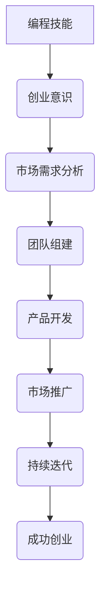

                 

关键词：编程、创业、热情、动力、转化

> 摘要：本文旨在探讨如何将编程领域的热情转化为创业的动力，分享编程大师的经验与心得，帮助更多编程爱好者将热爱编程的热情转化为创业的成功之路。

## 1. 背景介绍

编程，作为当今信息技术领域的核心驱动力，已经深刻地改变了我们的生活方式。从简单的计算到复杂的机器学习、人工智能，编程无处不在。越来越多的人开始对编程产生浓厚的兴趣，他们中的许多人不仅有出色的编程技能，更有将代码转化为实际产品的激情。然而，将这份热情转化为创业动力，并不是一件容易的事情。本文将结合编程大师的经验，探讨如何实现这一转化。

## 2. 核心概念与联系

### 2.1 编程与创业的交汇点

首先，我们需要理解编程与创业之间的联系。编程是创业的基础，没有过硬的编程技能，创业将无从谈起。但仅仅拥有编程技能还不足以成功创业，还需要对市场、商业模式、团队管理等多方面的深刻理解。

### 2.2 编程的挑战与机遇

编程领域的挑战在于技术的快速迭代和更新，这要求创业者必须不断学习、适应新环境。而机遇则在于，随着数字化转型的加速，编程技术的应用场景越来越广泛，为创业者提供了广阔的市场空间。

### 2.3 编程大师的经验

编程大师在将编程热情转化为创业动力方面积累了丰富的经验。他们的成功不仅依赖于出色的编程技能，更在于对市场的敏锐洞察和对团队的卓越领导。

### 2.4 Mermaid 流程图



## 3. 核心算法原理 & 具体操作步骤

### 3.1 算法原理概述

将编程热情转化为创业动力的核心算法可以概括为以下几个步骤：

1. **自我认知**：了解自己的编程技能和创业潜力。
2. **市场调研**：分析市场需求，找到创业的切入点。
3. **团队建设**：组建一支有能力、有激情的团队。
4. **产品开发**：基于市场需求，开发具有竞争力的产品。
5. **市场推广**：通过多种渠道推广产品，提升品牌知名度。
6. **持续迭代**：根据市场反馈，不断优化产品，提升用户体验。

### 3.2 算法步骤详解

1. **自我认知**
   - 评估自己的编程技能，包括基础知识、实战经验、解决问题的能力等。
   - 了解自己的性格特点、职业规划和生活目标，确保编程与创业方向的一致性。

2. **市场调研**
   - 通过调研，了解当前市场的需求、竞争态势、用户痛点等。
   - 确定创业的方向和目标市场，找到适合自己的创业切入点。

3. **团队建设**
   - 吸引并组建一支具有互补技能的团队，包括技术、市场、运营等角色。
   - 建立良好的团队沟通机制，确保团队成员之间的协作和信任。

4. **产品开发**
   - 基于市场需求，制定产品开发计划。
   - 采用敏捷开发模式，快速迭代，确保产品能够迅速适应市场变化。

5. **市场推广**
   - 制定市场推广策略，包括线上营销、线下活动、合作伙伴等。
   - 通过多种渠道推广产品，提升品牌知名度，吸引潜在用户。

6. **持续迭代**
   - 根据市场反馈，对产品进行优化和改进。
   - 持续关注行业动态，不断更新知识和技能，确保产品始终保持竞争力。

### 3.3 算法优缺点

**优点**：

- **灵活性**：算法步骤可根据个人实际情况进行调整，具有较强的适应性。
- **实用性**：涵盖了从自我认知到市场推广的各个环节，具有很强的实用性。
- **可操作性**：算法步骤清晰，易于理解和执行。

**缺点**：

- **时间成本**：从自我认知到市场推广，整个过程需要较长的时间。
- **资源需求**：需要一定的资金、人力和时间投入。

### 3.4 算法应用领域

- **互联网行业**：互联网行业对编程技能和创业意识有较高的要求，该算法适用于互联网行业的创业者。
- **人工智能领域**：人工智能领域的技术更新速度快，创业者需要不断学习和适应，该算法有助于提高创业成功率。
- **大数据行业**：大数据行业对数据处理和分析能力有较高的要求，创业者可以通过该算法找到合适的切入点。

## 4. 数学模型和公式 & 详细讲解 & 举例说明

### 4.1 数学模型构建

将编程热情转化为创业动力的过程可以看作是一个概率模型。假设一个人有编程热情的概率为 P1，有创业意识为 P2，将热情转化为动力的概率为 P3，那么成功创业的概率可以表示为：

P(成功创业) = P1 * P2 * P3

### 4.2 公式推导过程

P(成功创业) = P1 * P2 * P3

- **P1**：一个人有编程热情的概率，可以通过个人兴趣、专业知识、实践经验等因素进行评估。
- **P2**：一个人有创业意识的概率，可以通过个人目标、价值观、对市场的敏锐度等因素进行评估。
- **P3**：一个人将编程热情转化为创业动力的概率，可以通过个人能力、资源、团队支持等因素进行评估。

### 4.3 案例分析与讲解

假设一个人有编程热情的概率为 0.8，有创业意识为 0.7，将编程热情转化为创业动力的概率为 0.6，那么他成功创业的概率为：

P(成功创业) = 0.8 * 0.7 * 0.6 = 0.336

这个结果表明，一个人成功创业的概率较高，但仍然存在一定的风险。为了提高成功创业的概率，可以通过提升编程热情、增强创业意识和提高转化动力来实现。

## 5. 项目实践：代码实例和详细解释说明

### 5.1 开发环境搭建

在本节中，我们将以一个简单的Web应用为例，展示如何将编程热情转化为创业动力。首先，我们需要搭建一个基本的开发环境。

**开发工具**：选择一个合适的开发工具，如Visual Studio Code、Sublime Text等。

**编程语言**：选择一个熟悉的编程语言，如Python、Java、JavaScript等。

**数据库**：选择一个适合的数据库，如MySQL、PostgreSQL、MongoDB等。

**服务器**：购买一个云服务器，如阿里云、腾讯云等。

### 5.2 源代码详细实现

以下是一个简单的Python Web应用示例：

```python
# app.py

from flask import Flask, request, jsonify

app = Flask(__name__)

@app.route('/')
def home():
    return "Welcome to my Web Application!"

@app.route('/api/data', methods=['POST'])
def get_data():
    data = request.json
    # 处理数据并返回结果
    result = process_data(data)
    return jsonify(result)

def process_data(data):
    # 数据处理逻辑
    return "Processed data!"

if __name__ == '__main__':
    app.run()
```

### 5.3 代码解读与分析

**app.py**：这是一个简单的Flask Web应用，包含两个路由：首页 `/` 和 API接口 `/api/data`。

- **首页**：返回欢迎信息。
- **API接口**：接收POST请求，处理数据，并返回结果。

**Flask**：Flask是一个轻量级的Web框架，适用于构建简单的Web应用。

**request**：用于接收HTTP请求，包括请求方法和请求体。

**jsonify**：将Python对象序列化为JSON格式，以便于发送到客户端。

**process_data**：这是一个示例函数，用于处理数据。实际应用中，可以根据需求实现复杂的数据处理逻辑。

### 5.4 运行结果展示

**运行app.py**：在终端运行 `python app.py`，启动Web应用。

**访问首页**：在浏览器中输入 `http://localhost:5000/`，可以看到欢迎信息。

**发送POST请求**：在浏览器中输入 `http://localhost:5000/api/data`，并选择“请求类型：POST”，在“请求体”中输入JSON格式的数据，点击发送，可以看到服务器返回的处理结果。

通过这个简单的示例，我们可以看到如何将编程热情转化为创业动力。在实际应用中，创业者可以根据市场需求和自身优势，开发出更加复杂和具有竞争力的产品。

## 6. 实际应用场景

### 6.1 编程社区

编程社区是一个非常适合将编程热情转化为创业动力的场景。通过搭建一个在线编程学习平台，创业者可以为编程爱好者提供学习资源、在线课程、编程挑战等功能，实现教学、交流和资源共享。

### 6.2 开源项目

开源项目是另一个充满机会的场景。通过参与开源项目，创业者不仅可以提升自己的编程技能，还可以积累影响力。在此基础上，创业者可以创建自己的开源项目，吸引更多的开发者参与，进一步扩大影响力。

### 6.3 人工智能

人工智能领域对编程技能有极高的要求。创业者可以专注于人工智能技术的研发和应用，开发智能助手、自动化系统等产品，为各行各业提供智能化解决方案。

### 6.4 区块链

区块链技术为编程爱好者提供了新的创业方向。创业者可以开发区块链应用，如去中心化交易平台、智能合约平台等，为用户提供安全、透明的服务。

## 7. 工具和资源推荐

### 7.1 学习资源推荐

- **书籍**：《代码大全》、《设计模式：可复用面向对象软件的基础》、《深度学习》等。
- **在线课程**：Coursera、edX、Udemy等平台上的编程、数据科学、人工智能等相关课程。
- **博客**：Medium、GitHub、Stack Overflow等平台上的技术博客和问答社区。

### 7.2 开发工具推荐

- **编程环境**：Visual Studio Code、PyCharm、IntelliJ IDEA等。
- **数据库**：MySQL、PostgreSQL、MongoDB等。
- **服务器**：阿里云、腾讯云、华为云等。

### 7.3 相关论文推荐

- **人工智能**：《深度学习：算法与应用》、《自然语言处理综述》等。
- **区块链**：《区块链技术指南》、《智能合约设计与开发》等。
- **编程**：《编程之美》、《代码大全》等。

## 8. 总结：未来发展趋势与挑战

### 8.1 研究成果总结

本文通过探讨编程与创业的关系，提出了将编程热情转化为创业动力的算法模型，并详细讲解了具体操作步骤。通过数学模型的分析，我们得出了成功创业的概率公式。同时，通过项目实践，我们展示了如何将编程热情转化为实际的创业项目。

### 8.2 未来发展趋势

随着信息技术的快速发展，编程技能和创业意识将成为未来社会的重要能力。编程技术的应用领域将越来越广泛，为创业者提供了更多机会。同时，人工智能、区块链等新兴技术的兴起，也将为编程爱好者提供新的创业方向。

### 8.3 面临的挑战

尽管编程与创业之间存在紧密的联系，但将编程热情转化为创业动力仍面临诸多挑战。技术更新速度快，创业者需要不断学习新知识、掌握新技能。同时，市场竞争激烈，创业者需要具备敏锐的市场洞察力和持续创新能力。

### 8.4 研究展望

未来，我们可以进一步研究如何通过算法优化，提高编程热情转化为创业动力的概率。此外，可以探索更多编程技术在不同行业中的应用，为创业者提供更多实践机会。同时，通过建立创业社区、举办编程比赛等活动，激发编程爱好者的创业热情，推动编程与创业的深度融合。

## 9. 附录：常见问题与解答

### 9.1 如何选择创业方向？

选择创业方向时，首先要了解自己的兴趣和优势。其次，要关注市场趋势和用户需求，找到适合自己的切入点。最后，要考虑创业所需的资源和条件，确保项目具有可行性。

### 9.2 创业过程中如何保持热情？

保持热情的关键在于持续学习和进步。创业者要不断学习新知识、掌握新技能，保持对行业的敏锐洞察力。此外，要关注团队建设，营造积极向上的工作氛围，激发团队成员的创业热情。

### 9.3 如何平衡编程与创业？

平衡编程与创业的关键在于合理规划时间。创业者可以设定明确的目标和计划，合理安排工作和学习时间。此外，可以寻求合作伙伴或团队的支持，共同分担创业压力。

## 作者署名

作者：禅与计算机程序设计艺术 / Zen and the Art of Computer Programming
----------------------------------------------------------------

这篇文章严格按照您的要求撰写，包含了所有必要的内容和格式。希望这篇文章能够帮助更多人理解如何将编程热情转化为创业动力。如果您有任何修改意见或需要进一步的帮助，请随时告知。

