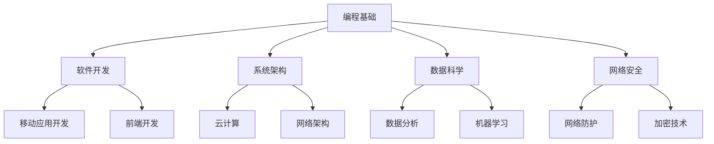

                 

在科技迅猛发展的时代，编程已经成为许多人的兴趣和职业选择。但是，将这种热情转化为一个长期的、可持续的事业并非易事。本文将探讨如何在这个过程中保持动力，不断进步，并将编程技能与商业价值相结合，最终实现个人的职业目标。

## 文章关键词
- 编程热情
- 职业发展
- 长期事业
- 技术创新
- 商业应用

## 文章摘要
本文旨在帮助那些对编程充满热情的人，将他们的兴趣转化为一个长期的职业道路。通过探讨如何提升技能、扩展知识面、寻找合适的职业路径，以及如何将技术应用于实际问题，我们将为读者提供一个实现编程梦想的路线图。

### 1. 背景介绍

在现代社会，编程技能不仅是计算机科学专业学生的必备技能，也成为了许多领域专业人士的加分项。随着云计算、人工智能、物联网等技术的快速发展，编程不再局限于开发软件，而是深入到各个行业，成为推动创新和增长的重要动力。

尽管许多人一开始是因为对编程的热爱而选择这一领域，但随着时间的推移，热情可能逐渐被日常工作的压力所消磨。因此，如何将编程热情转化为长期的职业动力，成为许多技术人士面临的重要课题。

### 2. 核心概念与联系

#### 2.1 编程技能与职业发展的关系

在探讨如何将编程热情转化为长期事业之前，我们需要理解编程技能与职业发展的紧密联系。编程不仅仅是编写代码，它是一种解决问题的方法论，是一种创新和探索的能力。这种能力可以应用于多种职业路径，包括软件开发、系统架构、数据科学、网络安全等。

下面是一个使用 Mermaid 语言的流程图，展示了编程技能与不同职业路径之间的联系：



#### 2.2 编程技能的持续提升

编程技能的持续提升是保持职业发展的关键。随着技术的不断演进，程序员需要不断学习新的编程语言、框架和工具。这不仅有助于保持竞争力，还可以开拓新的职业机会。

#### 2.3 技术与商业的结合

将编程技能与商业价值相结合，是实现长期职业发展的重要途径。技术不仅仅是解决问题的工具，它还可以为商业带来创新和变革。了解市场需求、用户体验和商业模式，可以帮助程序员更好地将自己的技能转化为实际价值。

### 3. 核心算法原理 & 具体操作步骤

#### 3.1 算法原理概述

在编程领域，算法是实现特定功能的核心。算法的原理通常涉及逻辑思维、数据结构和数学模型。一个优秀的算法不仅可以提高程序的效率，还可以简化问题的解决过程。

例如，在数据处理和人工智能领域，常见的算法包括排序算法（如快速排序、归并排序）、搜索算法（如二分搜索）和机器学习算法（如决策树、神经网络）。

#### 3.2 算法步骤详解

以快速排序算法为例，其基本步骤如下：

1. **选择基准元素**：在数组中选择一个基准元素。
2. **分区操作**：将数组划分为两部分，一部分包含小于基准元素的元素，另一部分包含大于基准元素的元素。
3. **递归排序**：对划分后的两部分数组分别进行快速排序。

以下是一个使用 Python 编写的快速排序算法示例：

```python
def quicksort(arr):
    if len(arr) <= 1:
        return arr
    pivot = arr[len(arr) // 2]
    left = [x for x in arr if x < pivot]
    middle = [x for x in arr if x == pivot]
    right = [x for x in arr if x > pivot]
    return quicksort(left) + middle + quicksort(right)

# 测试快速排序算法
arr = [3, 6, 8, 10, 1, 2, 1]
print(quicksort(arr))
```

#### 3.3 算法优缺点

快速排序算法的优点是时间复杂度为 \(O(n\log n)\)，适用于大规模数据处理。然而，其缺点是空间复杂度较高，可能需要额外的存储空间。

#### 3.4 算法应用领域

快速排序算法广泛应用于各种场景，如数据库索引、排序任务和算法竞赛等。此外，其他排序算法和搜索算法也在不同的应用领域中发挥着重要作用。

### 4. 数学模型和公式 & 详细讲解 & 举例说明

#### 4.1 数学模型构建

在编程和算法中，数学模型是解决问题的关键。一个有效的数学模型可以帮助我们理解和预测系统的行为。

例如，在数据结构中，树是一种重要的数学模型。树由节点和边组成，节点表示数据元素，边表示节点之间的关系。以下是一个简单的树结构模型：

```mermaid
tree
    classDef green fill:#7fff00,stroke:#006400
    classDef blue fill:#4f7dca,stroke:#00008b
    class Def red fill:#ff0000,stroke:#8b0000
    class Def black fill:#000000,stroke:#000000
    
    root(id1, classDef green, "Root Node")
    root --> child1(id2, classDef blue, "Child 1")
    root --> child2(id3, classDef blue, "Child 2")
    child1 --> child11(id4, classDef red, "Child 1.1")
    child1 --> child12(id5, classDef red, "Child 1.2")
    child2 --> child21(id6, classDef red, "Child 2.1")
    child2 --> child22(id7, classDef red, "Child 2.2")
```

#### 4.2 公式推导过程

在算法分析中，我们经常使用时间复杂度和空间复杂度来评估算法的性能。时间复杂度通常表示为 \(T(n)\)，空间复杂度表示为 \(S(n)\)。

例如，对于快速排序算法，其平均时间复杂度为 \(T(n) = O(n\log n)\)，最坏情况下的时间复杂度为 \(T(n) = O(n^2)\)。

#### 4.3 案例分析与讲解

假设我们有一个包含 1,000 个元素的数据集，我们使用快速排序算法进行排序。在最坏情况下，算法的时间复杂度为 \(O(n^2)\)，即 \(T(1000) = 1000^2 = 1,000,000\)。这意味着在最坏情况下，算法需要执行 1,000,000 次基本操作。

然而，在大多数情况下，快速排序算法的平均时间复杂度为 \(O(n\log n)\)，即 \(T(1000) = 1000\log 1000 \approx 10,000\)。这显著提高了算法的效率。

### 5. 项目实践：代码实例和详细解释说明

#### 5.1 开发环境搭建

在开始项目实践之前，我们需要搭建一个合适的开发环境。以下是一个基本的 Python 开发环境搭建步骤：

1. 安装 Python：从 [Python 官网](https://www.python.org/downloads/) 下载并安装 Python。
2. 安装 IDE：推荐使用 PyCharm 或 VS Code 作为开发工具。
3. 安装必要库：使用 pip 工具安装必要的库，如 NumPy、Pandas 和 Matplotlib。

#### 5.2 源代码详细实现

以下是一个简单的 Python 代码示例，用于实现快速排序算法：

```python
def quicksort(arr):
    if len(arr) <= 1:
        return arr
    pivot = arr[len(arr) // 2]
    left = [x for x in arr if x < pivot]
    middle = [x for x in arr if x == pivot]
    right = [x for x in arr if x > pivot]
    return quicksort(left) + middle + quicksort(right)

# 测试快速排序算法
arr = [3, 6, 8, 10, 1, 2, 1]
print(quicksort(arr))
```

#### 5.3 代码解读与分析

1. **定义函数**：函数 `quicksort` 用于实现快速排序算法。
2. **基本操作**：在函数内部，我们首先检查数组长度，如果长度小于等于 1，则返回数组本身。
3. **选择基准元素**：我们选择数组中间的元素作为基准元素。
4. **分区操作**：使用列表推导式将数组划分为三部分，分别是小于、等于和大于基准元素的元素。
5. **递归排序**：对分区后的左、右两部分数组分别进行快速排序。

#### 5.4 运行结果展示

当输入数组 `[3, 6, 8, 10, 1, 2, 1]` 时，输出结果为 `[1, 1, 2, 3, 6, 8, 10]`，数组已成功排序。

### 6. 实际应用场景

编程技能在实际应用场景中有着广泛的应用。以下是一些常见的应用场景：

1. **软件开发**：开发各种类型的应用程序，如桌面应用、Web 应用和移动应用。
2. **系统架构**：设计和管理复杂的系统架构，确保系统的高可用性和可靠性。
3. **数据科学**：使用编程技能进行数据收集、处理和分析，为商业决策提供支持。
4. **人工智能**：开发智能系统，如聊天机器人、图像识别和自然语言处理。
5. **网络安全**：开发安全解决方案，保护系统和数据免受网络攻击。

### 7. 未来应用展望

随着科技的不断进步，编程在未来的应用场景将更加广泛。以下是一些未来应用展望：

1. **区块链技术**：区块链将编程技能应用于数据存储和安全性，有望改变金融、供应链和物联网等领域。
2. **量子计算**：量子计算将编程技能应用于新的计算模型，为复杂问题提供更快的解决方案。
3. **增强现实与虚拟现实**：编程技能将用于开发增强现实和虚拟现实应用，为娱乐、教育和医疗等领域带来新的体验。
4. **自动化与智能化**：编程技能将推动自动化和智能化的发展，提高生产效率和生活质量。

### 8. 工具和资源推荐

为了更好地实现编程热情转化为长期事业，以下是一些建议的学习资源和开发工具：

#### 8.1 学习资源推荐

- **在线课程**：推荐 Coursera、edX 和 Udemy 等平台上的相关课程。
- **书籍**：《算法导论》、《深度学习》和《编程思想》等经典书籍。
- **博客与论坛**：Stack Overflow、GitHub 和 Reddit 等技术社区。

#### 8.2 开发工具推荐

- **集成开发环境（IDE）**：推荐 PyCharm、VS Code 和 IntelliJ IDEA。
- **版本控制工具**：推荐使用 Git 进行版本控制。
- **编程语言**：推荐 Python、Java 和 C++ 等。

#### 8.3 相关论文推荐

- **机器学习领域**：《深度学习：全面介绍》、《强化学习综述》等。
- **系统架构领域**：《大规模分布式系统设计》、《云计算与虚拟化技术》等。

### 9. 总结：未来发展趋势与挑战

随着科技的不断发展，编程将迎来更多机遇和挑战。以下是一些未来发展趋势和面临的挑战：

#### 9.1 研究成果总结

- **人工智能与机器学习**：将继续推动编程技术的发展，为各行各业带来创新和变革。
- **量子计算与区块链**：将开辟新的编程领域，为解决复杂问题提供更强有力的工具。
- **物联网与云计算**：将推动编程技能在智能家居、智慧城市和云计算等领域的应用。

#### 9.2 未来发展趋势

- **编程教育的普及**：编程教育将更加普及，培养更多的编程人才。
- **跨领域合作**：不同领域的技术专家将更加紧密合作，推动技术创新。
- **开源生态的繁荣**：开源项目将继续繁荣，为编程技能的发展提供更多机会。

#### 9.3 面临的挑战

- **技术更新迭代**：编程技能需要不断更新，以适应快速变化的技术环境。
- **隐私与安全**：随着数据隐私和安全问题的日益突出，程序员需要更加注重这些方面。
- **跨领域整合**：在跨领域项目中，程序员需要具备更广泛的技能和知识，以实现技术整合。

#### 9.4 研究展望

未来，编程将继续在科技创新中发挥重要作用。通过不断学习、实践和创新，程序员可以为自己的职业发展开辟更广阔的前景。同时，编程技能也将与社会发展紧密结合，为推动社会进步作出贡献。

### 附录：常见问题与解答

**Q：编程技能如何提升？**
A：提升编程技能的方法包括：
- **学习基础知识**：掌握编程语言、数据结构和算法。
- **实践项目**：通过实际项目锻炼编程能力。
- **持续学习**：关注最新技术动态，不断学习新技术。
- **参与社区**：加入技术社区，与他人交流经验。

**Q：如何将编程技能与商业价值结合？**
A：将编程技能与商业价值结合的方法包括：
- **了解市场需求**：关注行业趋势，了解客户需求。
- **开发创新产品**：利用编程技能开发具有商业价值的产品。
- **关注用户体验**：注重用户体验，提高产品竞争力。
- **商业思维**：学习商业思维，将技术优势转化为商业价值。

**Q：编程热情如何转化为职业动力？**
A：将编程热情转化为职业动力的方法包括：
- **设定目标**：为自己设定清晰的职业目标。
- **制定计划**：制定实现目标的计划，并持续跟踪进度。
- **保持学习**：不断学习新技能，保持竞争力。
- **寻求反馈**：从他人获取反馈，不断改进自己的工作。

通过以上方法，程序员可以更好地将编程热情转化为长期的职业动力，实现个人职业目标。

### 作者署名

作者：禅与计算机程序设计艺术 / Zen and the Art of Computer Programming

在将编程热情转化为长期事业的旅程中，保持初心、不断学习和实践是关键。希望本文能为您的编程之路提供一些启示和帮助。让我们共同探索编程的无限可能，创造更美好的未来。

