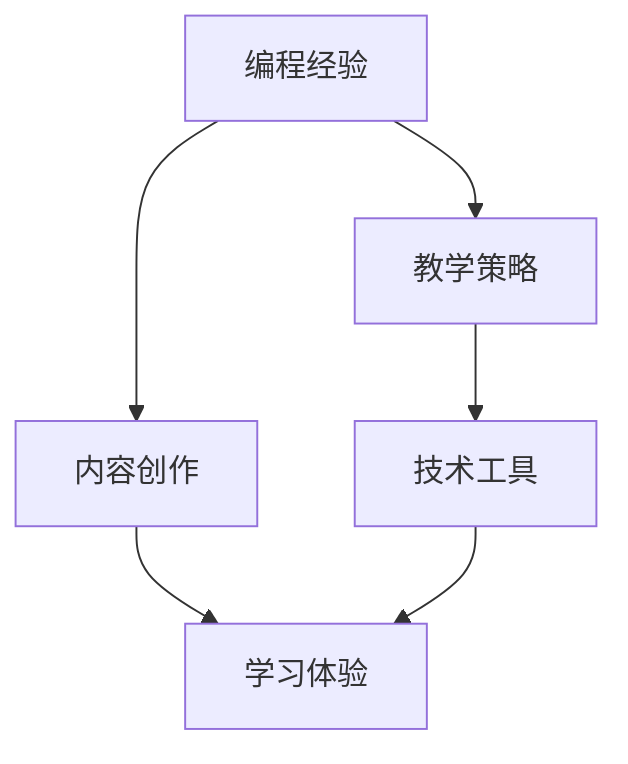

                 

关键词：编程经验、在线训练营、内容创作、教育技术、教学策略

> 摘要：本文旨在探讨如何将丰富的编程经验转化为具有吸引力的在线训练营内容。通过分析编程经验的结构、教学策略的设计以及技术工具的应用，作者提供了构建成功在线训练营的实用指南。

## 1. 背景介绍

在信息技术飞速发展的时代，编程技能已成为现代社会不可或缺的一部分。随着在线教育和远程学习的兴起，越来越多的人希望通过在线训练营提升自己的编程能力。然而，将个人多年的编程经验转化为有效的教学材料，并吸引学员参与，并非易事。本文将围绕这一主题展开讨论，旨在为编程专家提供一套将个人经验转化为在线训练营内容的实用策略。

### 1.1 编程经验的价值

编程经验不仅是技术能力的体现，更是理解和解决复杂问题的工具。编程专家在长期实践中积累的经验，能够帮助学员更快地掌握编程技能，提高学习效率。这些经验包括但不限于：

- 编程思维方式
- 问题求解策略
- 代码优化技巧
- 项目管理经验
- 团队协作方法

### 1.2 在线训练营的兴起

在线训练营作为一种新兴的教育模式，具有灵活、便捷、高效的特点。学员可以根据自己的时间安排灵活学习，同时能够获得与讲师的一对一互动，提高学习效果。以下是一些在线训练营的兴起原因：

- 全球化：人们可以不受地域限制地参与学习。
- 个性化：学员可以定制自己的学习路径，满足个性化需求。
- 成本效益：降低了学员的出行和时间成本，提高了学习效率。
- 教学互动：实时互动和反馈有助于提高学员的学习积极性和效果。

## 2. 核心概念与联系

为了将编程经验转化为在线训练营内容，我们需要理解几个核心概念，并构建它们之间的联系。以下是一个Mermaid流程图，展示了这些概念及其关系。



### 2.1 编程经验

编程经验包括技术知识和实践技能。技术知识涵盖编程语言、算法和数据结构等，而实践技能则涉及编码实践、项目开发和管理等方面。

### 2.2 教学策略

教学策略是指如何有效地传授编程经验。这包括课程设计、教学方法和评估方式等。一个成功的在线训练营需要设计出适合学员学习风格和需求的课程内容。

### 2.3 内容创作

内容创作是将编程经验转化为教学材料的过程。这包括编写教程、录制视频、编写代码示例等。内容创作需要考虑学员的学习需求，确保材料易于理解和实用。

### 2.4 技术工具

技术工具是支持在线训练营运行的平台和工具，如在线教育平台、视频录制软件、项目管理工具等。这些工具能够提高教学效率，优化学习体验。

### 2.5 学习体验

学习体验是学员在整个学习过程中的感受和收获。一个成功的在线训练营需要提供良好的学习体验，包括互动性、挑战性、实用性和成就感等。

## 3. 核心算法原理 & 具体操作步骤

### 3.1 算法原理概述

在线训练营的核心在于如何将编程经验有效地传授给学员。这一过程可以看作是一个算法优化问题，其目标是最大化学员的学习效果。核心算法原理包括：

- **内容定制化**：根据学员的学习风格和需求，定制教学内容。
- **实时互动**：通过在线聊天、视频会议等工具，提供实时反馈和指导。
- **项目驱动学习**：通过实际项目，培养学员的实践能力和问题解决能力。
- **持续评估**：通过定期测试和反馈，监控学员的学习进度和效果。

### 3.2 算法步骤详解

构建一个成功的在线训练营，可以按照以下步骤进行：

1. **需求分析**：了解学员的学习需求和目标，确定课程内容和教学策略。
2. **内容创作**：编写教程、录制视频、编写代码示例等，确保内容质量。
3. **平台搭建**：选择合适的在线教育平台，搭建训练营的环境。
4. **课程发布**：发布课程内容，设置学习路径和互动环节。
5. **实时互动**：通过在线聊天、视频会议等，提供实时反馈和指导。
6. **项目驱动学习**：布置实际项目，指导学员完成并提交。
7. **评估与反馈**：通过定期测试和反馈，评估学员的学习效果，提供改进建议。
8. **持续优化**：根据学员反馈，不断调整教学内容和教学策略。

### 3.3 算法优缺点

这一算法的优点在于：

- **灵活性**：可以根据学员的需求和反馈，灵活调整教学内容和策略。
- **高效性**：通过项目驱动学习和实时互动，提高学习效率。
- **个性化**：提供定制化的学习内容，满足不同学员的需求。

然而，这一算法也存在一些缺点：

- **前期投入大**：需要投入大量时间和精力进行需求分析和内容创作。
- **持续维护**：需要不断更新教学内容和平台功能，以适应技术的发展和学员的需求变化。

### 3.4 算法应用领域

这一算法适用于各种编程语言的在线训练营，特别是那些对实践能力要求较高的课程。例如，Java、Python、Web开发等领域的在线训练营，都可以采用这一算法原理进行设计和实施。

## 4. 数学模型和公式 & 详细讲解 & 举例说明

在线训练营的成功不仅依赖于算法和策略，还需要基于数学模型和公式来优化教学效果。以下是一个简单的数学模型，用于评估学员的学习效果。

### 4.1 数学模型构建

我们使用以下公式来评估学员的学习效果：

$$
E = f(T, I, P)
$$

其中，$E$ 表示学员的学习效果，$T$ 表示教学时长，$I$ 表示学员的互动频率，$P$ 表示项目的完成度。

### 4.2 公式推导过程

这个公式的推导基于以下假设：

- 学员的学习效果与教学时长成正比。
- 学员的学习效果与互动频率成正比。
- 学员的学习效果与项目的完成度成正比。

因此，我们可以将这三个因素结合起来，得到上述公式。

### 4.3 案例分析与讲解

假设一个学员参加了为期一个月的Python训练营，每天学习时间平均为2小时，互动频率为每周2次，项目的完成度为80%。根据上述公式，我们可以计算其学习效果：

$$
E = f(30 \times 2, 4, 0.8) = f(60, 4, 0.8)
$$

为了简化计算，我们可以设定：

- $f(60) = 1$
- $f(4) = 1$
- $f(0.8) = 0.8$

因此，我们可以得出：

$$
E = 1 \times 1 \times 0.8 = 0.8
$$

这意味着这位学员的学习效果为80%。这个结果表明，通过合理的安排学习时间和互动频率，以及确保项目完成度，学员可以获得较好的学习效果。

## 5. 项目实践：代码实例和详细解释说明

### 5.1 开发环境搭建

为了实践编程经验转化为在线训练营的内容，我们首先需要搭建一个基本的开发环境。以下是一个简单的Python开发环境搭建步骤：

1. **安装Python**：从[Python官网](https://www.python.org/)下载并安装Python。
2. **安装IDE**：推荐使用PyCharm作为Python的集成开发环境（IDE）。
3. **安装必需的库**：通过命令行安装常用的Python库，如`numpy`、`matplotlib`等。

### 5.2 源代码详细实现

以下是一个简单的Python代码实例，用于计算斐波那契数列：

```python
def fibonacci(n):
    if n <= 1:
        return n
    else:
        return fibonacci(n-1) + fibonacci(n-2)

# 测试代码
print(fibonacci(10))
```

### 5.3 代码解读与分析

这段代码定义了一个名为`fibonacci`的函数，用于计算斐波那契数列。斐波那契数列是一个著名的数列，其中每个数字都是前两个数字的和。这个数列从0开始，如下所示：

0, 1, 1, 2, 3, 5, 8, 13, 21, 34, ...

代码中的`fibonacci`函数采用递归的方式实现。递归是一种编程技巧，通过重复调用自身来解决问题。在这个例子中，`fibonacci(n)`会调用`fibonacci(n-1)`和`fibonacci(n-2)`，直到达到基础条件`n <= 1`。

### 5.4 运行结果展示

在PyCharm中运行上述代码，我们可以得到斐波那契数列的第10个数字：

```plaintext
34
```

这个结果表明我们的代码能够正确计算斐波那契数列。

## 6. 实际应用场景

编程经验转化为在线训练营的内容，可以广泛应用于多个领域。以下是一些实际应用场景：

### 6.1 编程语言入门课程

针对初学者，可以将编程经验转化为Python、Java、C++等编程语言的入门课程。通过实例讲解和互动，帮助学员快速掌握编程基础。

### 6.2 技术栈提升课程

对于有一定编程基础的学员，可以提供如Web开发、数据科学、人工智能等领域的进阶课程。这些课程可以结合实际项目，提升学员的综合技术能力。

### 6.3 企业内训课程

企业可以通过在线训练营，为员工提供定制的编程培训。这不仅有助于提高员工的技术水平，还能提升企业的整体竞争力。

### 6.4 在线编程比赛

通过在线编程比赛，可以激发学员的编程兴趣和竞赛精神。这类活动不仅可以提高学员的编程能力，还能培养团队合作精神和解决问题的能力。

## 7. 工具和资源推荐

为了构建一个成功的在线训练营，以下是一些推荐的工具和资源：

### 7.1 学习资源推荐

- **在线教育平台**：如Coursera、Udemy、edX等，提供丰富的编程课程和教学资源。
- **技术博客**：如Medium、Dev.to等，可以获取最新的技术文章和教程。
- **编程社区**：如GitHub、Stack Overflow等，可以与其他开发者交流和获取帮助。

### 7.2 开发工具推荐

- **集成开发环境（IDE）**：如PyCharm、Visual Studio Code等，提供强大的编程功能。
- **版本控制系统**：如Git，用于代码管理和协作。
- **持续集成工具**：如Jenkins、Travis CI等，用于自动化测试和部署。

### 7.3 相关论文推荐

- **《The Elements of Programming Interviews》**：由Adnan Aziz撰写，提供大量的编程面试题和解答。
- **《Algorithms Illuminated》**：由Tim Roughgarden撰写，深入讲解了算法设计和分析。
- **《The Art of Computer Programming》**：由Donald Knuth撰写，经典算法教材。

## 8. 总结：未来发展趋势与挑战

### 8.1 研究成果总结

本文探讨了如何将编程经验转化为在线训练营内容。通过分析编程经验的价值、核心概念的联系、算法原理和数学模型，以及项目实践，我们提供了一套构建成功在线训练营的实用策略。

### 8.2 未来发展趋势

随着技术的不断进步，在线训练营将继续发展。以下是未来的一些发展趋势：

- **个性化学习**：通过大数据和人工智能技术，提供更个性化的学习内容和体验。
- **混合式学习**：结合线上和线下教学，提高学习效果。
- **实时互动**：利用实时通信技术，提供更高效的师生互动。

### 8.3 面临的挑战

尽管在线训练营具有许多优势，但也面临一些挑战：

- **内容质量**：保证课程内容的质量和更新速度。
- **技术支持**：提供稳定可靠的技术支持，确保教学过程顺利进行。
- **市场竞争力**：在众多在线教育平台中脱颖而出，吸引学员。

### 8.4 研究展望

未来，我们可以进一步研究如何利用新兴技术，如虚拟现实（VR）和增强现实（AR），提高在线训练营的学习体验。此外，探索更有效的教学评估方法和个性化学习路径，也将是重要研究方向。

## 9. 附录：常见问题与解答

### 9.1 如何保证在线训练营的内容质量？

- **严格筛选讲师**：选择有丰富经验和教学能力的讲师。
- **定期审核课程**：定期对课程内容进行审核和更新。
- **学员反馈机制**：鼓励学员提供反馈，及时调整教学内容。

### 9.2 如何确保在线训练营的技术支持？

- **建立技术支持团队**：提供24/7的技术支持。
- **稳定的技术平台**：选择可靠的在线教育平台，确保系统稳定。
- **紧急响应机制**：遇到技术问题时，能够迅速响应和解决。

### 9.3 如何应对市场竞争力？

- **差异化定位**：根据目标学员的需求，提供独特的课程内容。
- **品牌建设**：提升品牌知名度和口碑。
- **营销策略**：采用有效的营销策略，吸引更多学员。

作者：禅与计算机程序设计艺术 / Zen and the Art of Computer Programming

