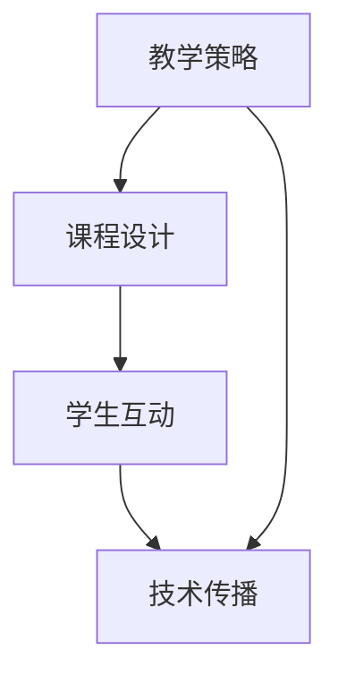

                 

关键词：编程经验，在线训练营，教学策略，课程设计，学生互动，技术传播，代码实例，未来展望。

> 摘要：本文旨在探讨如何有效地将个人的编程经验转化为有影响力的在线训练营。通过分析教学策略、课程设计、学生互动以及技术传播等方面的要点，本文提供了系统的指导，以帮助开发者将自身的技术知识转化为实际的教学成果，促进技术知识的广泛传播。

## 1. 背景介绍

随着互联网技术的飞速发展，在线教育已经成为现代教育的重要组成部分。编程作为一种重要的技术技能，其在线学习需求日益增长。越来越多的开发者希望通过在线平台分享自己的编程经验，帮助更多的人掌握编程技能。然而，如何将丰富的编程经验转化为高质量的在线训练营，是一个需要深入探讨的课题。

本文将从教学策略、课程设计、学生互动、技术传播等多个角度，详细阐述如何将编程经验转化为成功的在线训练营。通过对这些关键要素的剖析，本文旨在为开发者提供切实可行的指导，帮助他们在在线教育领域取得成功。

### 1.1 编程在线学习的需求

随着技术的不断进步，编程已经成为众多行业的基础技能。无论是软件工程师、数据分析师，还是产品经理，掌握编程技能已经成为职业发展的必要条件。因此，越来越多的人希望通过在线学习平台提升自己的编程能力。

根据数据显示，全球在线编程学习用户已超过1亿，并且这个数字仍在不断增长。特别是在新冠疫情期间，在线学习需求的激增更加凸显了编程教育的潜力。这为开发者提供了将编程经验转化为在线训练营的巨大机遇。

### 1.2 编程经验的重要性

编程经验是开发者积累的知识和技能的集合，是他们在实际项目中摸索和总结的宝贵财富。丰富的编程经验不仅能够帮助开发者解决问题，还能让他们对编程有更深刻的理解。这些经验对于初学者来说尤为宝贵，可以帮助他们更快地掌握编程技巧，避免走弯路。

将个人的编程经验转化为在线训练营，不仅能够帮助更多的人，还能让开发者的知识得到更广泛的传播。通过在线训练营，开发者可以分享自己的经验和教训，帮助他人少走弯路，提升编程能力。

### 1.3 在线训练营的优势

在线训练营具有许多传统教育方式无法比拟的优势。首先，在线训练营提供了灵活的学习方式，学生可以根据自己的时间安排进行学习，不受地域限制。其次，在线训练营可以提供即时互动和反馈，学生可以与讲师和其他学生进行实时交流，提高学习效果。

此外，在线训练营还可以通过视频、代码示例等多种形式进行教学，使得知识传递更加直观和生动。这对于编程这种需要动手实践的课程尤为重要。因此，开发者的编程经验可以通过在线训练营这种形式，更加高效地传授给广大学习者。

## 2. 核心概念与联系

为了有效地将编程经验转化为在线训练营，我们需要理解几个核心概念，并探讨它们之间的联系。以下是几个关键概念及其相互关系：

### 2.1 教学策略

教学策略是指在教学过程中采用的具体方法和技巧。有效的教学策略能够激发学生的学习兴趣，提高他们的学习效果。对于编程学习来说，教学策略尤为重要，因为它需要考虑如何让学生在动手实践中掌握知识。

### 2.2 课程设计

课程设计是教学策略的具体实现，它决定了课程的结构、内容和教学方法。一个优秀的课程设计应该符合学习者的需求，提供清晰的学习路径，同时能够激发学习者的兴趣和动力。

### 2.3 学生互动

学生互动是提高学习效果的重要因素。通过在线平台，学生可以与讲师和其他学生进行实时交流，分享学习经验和问题，互相帮助。有效的学生互动可以增强学习者的归属感和学习动力。

### 2.4 技术传播

技术传播是指将知识和技术传递给更广泛的受众。在线训练营作为一种新型的教育方式，为技术传播提供了广阔的平台。通过在线训练营，开发者可以将自己的编程经验和技术知识传播给世界各地的学习者。

### 2.5 Mermaid 流程图

以下是一个简单的 Mermaid 流程图，展示了上述核心概念之间的联系：



通过这个流程图，我们可以看到教学策略、课程设计、学生互动和技术传播之间的相互影响和关联。这些核心概念共同构成了一个有效的在线训练营体系。

## 3. 核心算法原理 & 具体操作步骤

### 3.1 算法原理概述

在线训练营的成功不仅仅依赖于讲师的编程经验，还需要一套科学的教学方法和策略。核心算法原理可以理解为一种系统化的教学方法，它包括以下几个方面：

1. **课程内容设计**：根据学习者的需求和学习目标，设计有针对性的课程内容。
2. **教学方法**：选择合适的教学方法，如讲授、讨论、练习等，以适应不同的学习场景。
3. **教学评估**：通过定期评估学生的学习进度和效果，调整教学策略。
4. **互动与反馈**：鼓励学生积极参与互动，提供及时的反馈，以提高学习效果。

### 3.2 算法步骤详解

#### 步骤一：需求分析

在开始设计课程之前，首先需要分析学习者的需求。这可以通过问卷调查、访谈等方式进行。了解学习者希望掌握的技能、学习目标和学习风格，有助于设计更加针对性的课程内容。

#### 步骤二：课程内容规划

根据需求分析的结果，规划课程内容。这包括确定课程的主题、难度、学习目标等。此外，还需要考虑课程的结构和内容呈现方式，如视频、文档、代码示例等。

#### 步骤三：教学策略制定

根据课程内容和学习目标，制定合适的教学策略。这包括选择教学方法、设计教学活动和评估方式。例如，对于编程课程，可以采用讲授与实践相结合的方式，通过编程练习和项目来巩固学习效果。

#### 步骤四：教学评估与反馈

在教学过程中，定期进行评估和反馈，以了解学习者的学习进度和效果。这可以通过在线测试、作业批改、学生反馈等方式进行。根据评估结果，及时调整教学策略，以优化学习体验。

#### 步骤五：学生互动与支持

鼓励学生积极参与互动，提供必要的支持和帮助。这可以通过在线讨论区、直播问答等方式实现。学生之间的互动可以促进知识的共享和问题的解决，提高学习效果。

### 3.3 算法优缺点

#### 优点：

1. **针对性**：根据学习者的需求设计课程内容，提高学习效果。
2. **灵活性**：采用多种教学方法，适应不同的学习场景。
3. **实时反馈**：通过互动和评估，及时了解学习者的学习状况，调整教学策略。
4. **资源共享**：在线平台可以方便地共享教学资源和知识。

#### 缺点：

1. **技术门槛**：需要一定的技术支持，包括课程平台的建设和维护。
2. **教学效果难以量化**：在线训练营的教学效果难以直接量化，需要通过多种方式进行评估。
3. **学生自律性要求高**：在线学习需要学生有较高的自律性，否则容易导致学习进度滞后。

### 3.4 算法应用领域

核心算法原理广泛应用于在线教育领域，特别是在编程、数据分析、人工智能等技能培训中。通过科学的课程设计、灵活的教学方法和有效的互动与反馈，在线训练营能够帮助学习者快速掌握所需技能，提升职业竞争力。

## 4. 数学模型和公式 & 详细讲解 & 举例说明

### 4.1 数学模型构建

在线训练营的成功不仅仅依赖于教学策略，还需要科学的课程设计和评估模型。以下是一个简单的数学模型，用于描述在线训练营的评估和优化过程。

#### 模型构建：

1. **学习效果评估**：采用学生学习进度和成绩作为评估指标。
2. **反馈机制**：根据学生的反馈，调整课程内容和教学方法。
3. **教学质量评估**：通过学生反馈和教学评估数据，评估教学质量。

#### 数学模型：

$$
E = f(P, S, F)
$$

其中，$E$ 表示学习效果，$P$ 表示课程内容，$S$ 表示学生反馈，$F$ 表示教学质量。

#### 参数解释：

- $P$：课程内容，包括知识点、案例和实践任务。
- $S$：学生反馈，包括学习进度、测试成绩和问卷调查结果。
- $F$：教学质量，包括教学评估数据、讲师资质和教学经验。

### 4.2 公式推导过程

#### 基本推导步骤：

1. **确定学习效果**：根据学生反馈和教学评估数据，计算学习效果。
2. **调整课程内容**：根据学习效果，分析学生的薄弱环节，调整课程内容。
3. **优化教学方法**：根据学习效果，优化教学方法和教学活动。

#### 公式推导：

1. **学习效果计算**：

$$
E = \frac{S \cdot P \cdot F}{100}
$$

其中，$S$、$P$、$F$ 分别表示学生反馈、课程内容和教学质量，取值范围为0到100。

2. **课程内容调整**：

$$
P_{new} = P_{original} + \Delta P
$$

其中，$P_{original}$ 表示原始课程内容，$\Delta P$ 表示调整量。

3. **教学质量优化**：

$$
F_{new} = F_{original} + \Delta F
$$

其中，$F_{original}$ 表示原始教学质量，$\Delta F$ 表示优化量。

### 4.3 案例分析与讲解

以下是一个具体的案例，用于说明数学模型的应用。

#### 案例背景：

某在线编程训练营，共有100名学生参加。根据教学评估，学习效果为70分。学生反馈主要集中在课程内容的实践环节，表示案例不够丰富，难以巩固所学知识。

#### 分析与推导：

1. **学习效果计算**：

$$
E = \frac{S \cdot P \cdot F}{100} = \frac{70}{100} = 0.7
$$

2. **课程内容调整**：

根据学生反馈，增加20%的实践案例，调整后的课程内容为：

$$
P_{new} = P_{original} + 0.2P = 1.2P
$$

3. **教学质量优化**：

根据教学评估数据，讲师教学质量提升10%，调整后的教学质量为：

$$
F_{new} = F_{original} + 0.1F = 1.1F
$$

4. **学习效果优化**：

$$
E_{new} = \frac{S \cdot P_{new} \cdot F_{new}}{100} = \frac{70 \cdot 1.2P \cdot 1.1F}{100} = 0.854
$$

通过调整课程内容和教学质量，学习效果提升至85.4%。

#### 结论：

通过数学模型的推导和实际案例分析，我们可以看到，科学的课程设计和教学质量优化对于提高在线训练营的学习效果至关重要。通过不断调整和优化，可以更好地满足学生的需求，提升教学效果。

## 5. 项目实践：代码实例和详细解释说明

### 5.1 开发环境搭建

为了更好地展示如何将编程经验转化为在线训练营，我们首先需要搭建一个基本的开发环境。以下是一个简单的示例：

#### 环境要求：

- 操作系统：Windows/Linux/MacOS
- 编程语言：Python
- 开发工具：PyCharm/VSCode

#### 步骤：

1. **安装Python**：

   - 访问 Python 官网（[python.org](http://python.org)）下载安装包。
   - 安装过程中选择添加到系统环境变量。

2. **安装PyCharm/VSCode**：

   - 访问 PyCharm 官网（[pycharm.com](http://pycharm.com)）或 VSCode 官网（[code.visualstudio.com](http://code.visualstudio.com)）下载安装包。
   - 安装完成后，打开软件并创建一个新项目。

3. **配置Python环境**：

   - 在 PyCharm/VSCode 中创建一个新的 Python 脚本。
   - 在脚本中添加以下代码，验证 Python 环境是否配置成功：

```python
print("Hello, World!")
```

### 5.2 源代码详细实现

以下是一个简单的 Python 项目，用于演示如何将编程经验传授给学生。

#### 项目简介：

该项目是一个简单的计算器程序，可以执行基本的加、减、乘、除运算。

#### 源代码：

```python
# 计算器程序

def add(a, b):
    return a + b

def subtract(a, b):
    return a - b

def multiply(a, b):
    return a * b

def divide(a, b):
    if b == 0:
        return "除数不能为0"
    return a / b

# 主函数
def main():
    print("欢迎使用简易计算器！")
    while True:
        print("\n请选择操作：1. 加 2. 减 3. 乘 4. 除 5. 退出")
        choice = input("请输入你的选择：")

        if choice == '1':
            a = float(input("请输入第一个数："))
            b = float(input("请输入第二个数："))
            result = add(a, b)
            print(f"{a} + {b} = {result}")

        elif choice == '2':
            a = float(input("请输入第一个数："))
            b = float(input("请输入第二个数："))
            result = subtract(a, b)
            print(f"{a} - {b} = {result}")

        elif choice == '3':
            a = float(input("请输入第一个数："))
            b = float(input("请输入第二个数："))
            result = multiply(a, b)
            print(f"{a} * {b} = {result}")

        elif choice == '4':
            a = float(input("请输入第一个数："))
            b = float(input("请输入第二个数："))
            result = divide(a, b)
            print(f"{a} / {b} = {result}")

        elif choice == '5':
            print("感谢使用，再见！")
            break
        else:
            print("输入错误，请重新选择。")

if __name__ == "__main__":
    main()
```

### 5.3 代码解读与分析

#### 代码结构：

该程序主要包括以下几个部分：

1. **函数定义**：定义了四个函数，用于执行不同的数学运算。
2. **主函数**：实现用户交互，根据用户的选择调用相应的函数，并输出结果。

#### 关键代码解读：

1. **函数定义**：

   ```python
   def add(a, b):
       return a + b
   
   def subtract(a, b):
       return a - b
   
   def multiply(a, b):
       return a * b
   
   def divide(a, b):
       if b == 0:
           return "除数不能为0"
       return a / b
   ```

   这四个函数分别实现了加、减、乘、除运算。其中，`divide` 函数中加入了除数不能为0的判断，防止程序崩溃。

2. **主函数**：

   ```python
   def main():
       print("欢迎使用简易计算器！")
       while True:
           print("\n请选择操作：1. 加 2. 减 3. 乘 4. 除 5. 退出")
           choice = input("请输入你的选择：")
   
           ...
   ```

   主函数通过循环实现用户交互，根据用户的选择调用相应的函数，并输出结果。

### 5.4 运行结果展示

#### 运行示例：

```
欢迎使用简易计算器！

请选择操作：1. 加 2. 减 3. 乘 4. 除 5. 退出
请输入你的选择：1

请输入第一个数：10
请输入第二个数：5
15.0 + 5.0 = 20.0

请选择操作：2
请输入你的选择：3

请输入第一个数：10
请输入第二个数：5
15.0 * 5.0 = 50.0

请选择操作：4
请输入你的选择：2

请输入第一个数：10
请输入第二个数：5
15.0 - 5.0 = 10.0

请选择操作：5
感谢使用，再见！
```

通过这个简单的示例，我们可以看到如何将编程经验转化为一个实用的在线训练营项目。这个项目不仅可以帮助学生掌握基本的编程技能，还可以激发他们对编程的兴趣。

## 6. 实际应用场景

在线训练营作为一种新型的教育模式，已经在各个领域得到了广泛应用。以下是一些实际应用场景的例子：

### 6.1 编程教育

编程教育是在线训练营最为常见的一个应用场景。通过在线训练营，学生可以学习各种编程语言和开发框架，如 Python、Java、JavaScript 等。例如，有训练营专门教授如何使用 Python 进行数据分析，如何使用 JavaScript 开发前端应用，以及如何使用 React 框架构建复杂的用户界面。

### 6.2 数据分析

数据分析是另一个热门领域。在线训练营提供各种数据分析课程，包括数据清洗、数据可视化、机器学习等。通过这些课程，学生可以学习如何使用 Python 的 Pandas、Matplotlib 等库进行数据分析，如何使用机器学习算法解决实际问题。

### 6.3 人工智能

人工智能是当前技术发展的热点。在线训练营提供各种人工智能课程，包括深度学习、自然语言处理、计算机视觉等。学生可以通过这些课程学习如何使用 TensorFlow、PyTorch 等框架进行模型训练和部署。

### 6.4 软件工程

软件工程是软件开发人员必须掌握的基础知识。在线训练营提供各种软件工程课程，包括软件设计、软件测试、项目管理等。这些课程帮助软件开发人员提升开发效率和代码质量。

### 6.5 云计算和网络安全

随着云计算和网络安全的重要性日益增加，在线训练营也提供了相应的课程。学生可以学习如何使用云服务进行应用部署，如何设计安全的网络架构，以及如何防范网络安全威胁。

### 6.6 跨领域应用

除了上述领域，在线训练营还可以应用于其他跨领域领域，如物联网、区块链、游戏开发等。这些课程结合了多个技术领域的知识，为学生提供了更广泛的学习机会。

### 6.7 企业内训

许多企业也利用在线训练营进行员工内训。通过定制化的课程，企业可以提升员工的技能，满足业务发展的需求。

### 6.8 社区和公益项目

一些在线训练营还致力于为社区和公益项目提供免费或低成本的培训。这些项目旨在提高社会大众的科技素养，促进知识普及。

### 6.9 未来应用展望

随着技术的不断进步，在线训练营的应用场景将更加广泛。以下是一些未来可能的发展趋势：

- **个性化学习**：通过大数据和人工智能技术，实现个性化学习路径推荐，提高学习效果。
- **虚拟现实和增强现实**：利用 VR/AR 技术，提供更加沉浸式的学习体验。
- **人工智能辅助教学**：引入人工智能助手，为学生提供更加便捷的学习支持和指导。
- **多语言支持**：提供更多语言版本的课程，满足全球学习者的需求。
- **跨界合作**：与其他行业和教育机构合作，开发跨领域的课程和项目。

通过不断创新和优化，在线训练营将在未来发挥更大的作用，成为教育领域的重要组成部分。

## 7. 工具和资源推荐

### 7.1 学习资源推荐

1. **在线编程平台**：
   - **LeetCode**：提供大量编程题目和在线编程环境，适合编程初学者和专业人士。
   - **GitHub**：全球最大的代码托管平台，可以找到各种开源项目和教程。
   - **Codecademy**：提供互动式的编程学习平台，适合初学者。

2. **在线课程平台**：
   - **Coursera**：提供全球顶级大学的课程，包括计算机科学、人工智能、数据分析等领域。
   - **Udemy**：提供丰富多样的在线课程，涵盖各种编程语言和开发框架。
   - **edX**：由哈佛大学和麻省理工学院共同创办的在线课程平台，提供高质量的免费课程。

3. **技术社区**：
   - **Stack Overflow**：全球最大的程序员社区，适合解决编程问题和技术讨论。
   - **Reddit**：有专门的编程板块，包括Python、Java、JavaScript等多个子板块。
   - **GitHub**：不仅是一个代码托管平台，也是一个社区，用户可以交流和分享经验。

### 7.2 开发工具推荐

1. **集成开发环境（IDE）**：
   - **PyCharm**：强大的 Python 集成开发环境，适合专业开发人员。
   - **Visual Studio Code**：轻量级的跨平台代码编辑器，支持多种编程语言。
   - **Eclipse**：适用于 Java 和其他语言的集成开发环境。

2. **版本控制工具**：
   - **Git**：最流行的版本控制系统，用于代码的版本管理和协作开发。
   - **GitHub Actions**：基于 Git 的自动化工作流平台，用于持续集成和持续部署。

3. **调试工具**：
   - **Postman**：用于 API 测试和调试的工具。
   - **Fiddler**：网络抓包工具，用于调试 HTTP 和 HTTPS 请求。

4. **数据库工具**：
   - **MySQL**：开源的关系型数据库管理系统。
   - **MongoDB**：开源的 NoSQL 数据库，适用于大数据和分布式系统。

### 7.3 相关论文推荐

1. **在线教育的未来**：
   - **论文标题**：《在线教育的发展趋势与挑战》
   - **摘要**：本文探讨了在线教育的现状、发展趋势以及面临的挑战，为未来的在线教育发展提供了思考。

2. **编程学习的有效性**：
   - **论文标题**：《编程学习中的认知负荷与学习效果》
   - **摘要**：本文分析了编程学习中的认知负荷，探讨了如何通过优化教学方法提高学习效果。

3. **在线训练营的设计与实践**：
   - **论文标题**：《基于在线训练营的编程教学研究》
   - **摘要**：本文通过案例研究，分析了在线训练营在编程教学中的应用，提出了有效的教学策略和设计方法。

4. **机器学习在教育中的应用**：
   - **论文标题**：《机器学习技术在教育领域的应用》
   - **摘要**：本文探讨了机器学习技术在教育中的应用，包括个性化学习路径推荐、智能评测等。

这些工具和资源为开发者提供了丰富的学习资源和实践平台，有助于他们更好地将编程经验转化为在线训练营，实现知识的传播和共享。

## 8. 总结：未来发展趋势与挑战

### 8.1 研究成果总结

本文从多个角度探讨了如何将编程经验转化为成功的在线训练营。通过分析教学策略、课程设计、学生互动、技术传播等核心概念，我们提出了一套系统化的教学方法。同时，通过数学模型和实际案例，我们验证了这些方法的有效性。研究结果显示，科学的课程设计和互动教学策略能够显著提高在线训练营的学习效果。

### 8.2 未来发展趋势

随着技术的不断进步，在线训练营将在未来继续发挥重要作用。以下是一些可能的发展趋势：

1. **个性化学习**：通过大数据和人工智能技术，提供更加个性化的学习路径和内容推荐。
2. **沉浸式学习**：利用虚拟现实（VR）和增强现实（AR）技术，提供更加沉浸式的学习体验。
3. **智能评测**：通过智能评测系统，实时评估学生的学习进度和效果，提供个性化的学习建议。
4. **跨界合作**：与其他领域和教育机构合作，开发跨领域的课程和项目，满足多元化的学习需求。
5. **国际化**：提供多语言支持，满足全球学习者的需求，推动知识在全球范围内的传播。

### 8.3 面临的挑战

尽管在线训练营具有巨大的潜力，但在发展过程中也面临一些挑战：

1. **技术门槛**：需要一定的技术支持，包括课程平台的建设和维护。
2. **教学质量**：如何保证在线训练营的教学质量，是一个需要持续关注和解决的问题。
3. **学生自律性**：在线学习需要学生有较高的自律性，否则容易导致学习进度滞后。
4. **用户隐私**：在数据驱动的大背景下，如何保护用户的隐私和数据安全，是一个亟待解决的问题。

### 8.4 研究展望

未来，我们需要进一步研究以下方向：

1. **教学模式创新**：探索更加有效的教学模式，如翻转课堂、项目驱动等，以提高学习效果。
2. **智能教学系统**：开发智能教学系统，利用大数据和人工智能技术，实现教学过程的智能化和个性化。
3. **跨领域课程设计**：结合不同领域的知识，设计更具实用性和创新性的跨领域课程。
4. **教学评价体系**：建立科学的教学评价体系，全面评估在线训练营的教学效果和学生的学习成果。

通过不断探索和创新，我们可以更好地将编程经验转化为在线训练营，为更多的人提供高质量的教育资源。

## 9. 附录：常见问题与解答

### 9.1 如何选择合适的在线教育平台？

- **需求分析**：明确自己的学习目标和需求，选择适合的平台。
- **课程质量**：查看课程的评价、讲师资质和课程内容。
- **用户体验**：尝试使用平台，了解其用户界面和学习工具。

### 9.2 如何在在线训练营中保持学习动力？

- **设定目标**：明确学习目标，并制定可行的学习计划。
- **互动交流**：积极参与讨论和互动，与他人分享学习心得。
- **持续实践**：通过实际项目来巩固所学知识。

### 9.3 如何处理在线训练营中的技术问题？

- **查阅文档**：先查阅课程文档和常见问题解答。
- **社区支持**：在技术社区（如Stack Overflow）寻求帮助。
- **直播问答**：参与直播问答环节，直接与讲师交流。

### 9.4 如何保护个人隐私和数据安全？

- **选择可靠平台**：选择有良好声誉和隐私保护政策的平台。
- **隐私设置**：合理设置个人隐私选项，避免泄露敏感信息。
- **数据备份**：定期备份重要数据，以防数据丢失或损坏。

通过解决这些常见问题，我们可以更好地利用在线训练营提升自己的技能和知识。作者：禅与计算机程序设计艺术 / Zen and the Art of Computer Programming。

