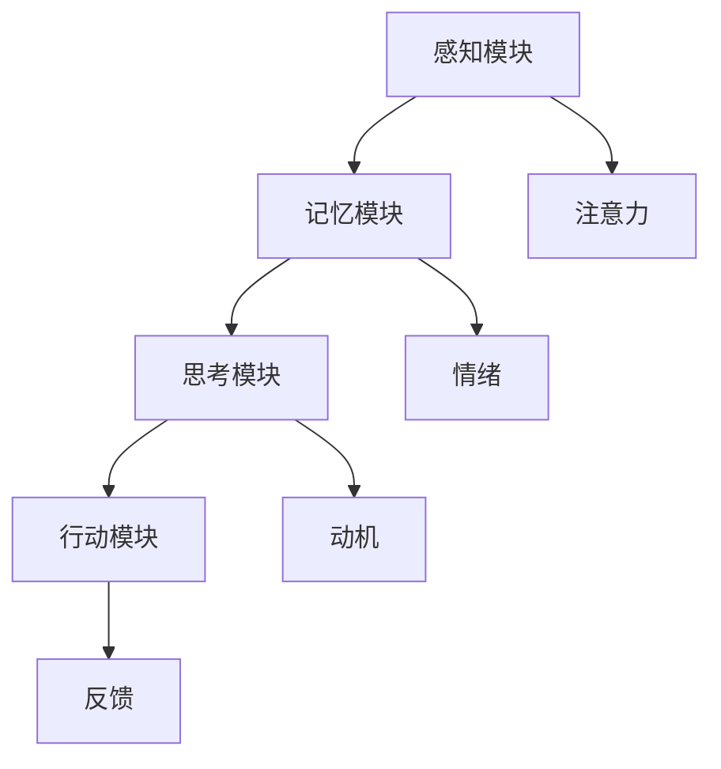
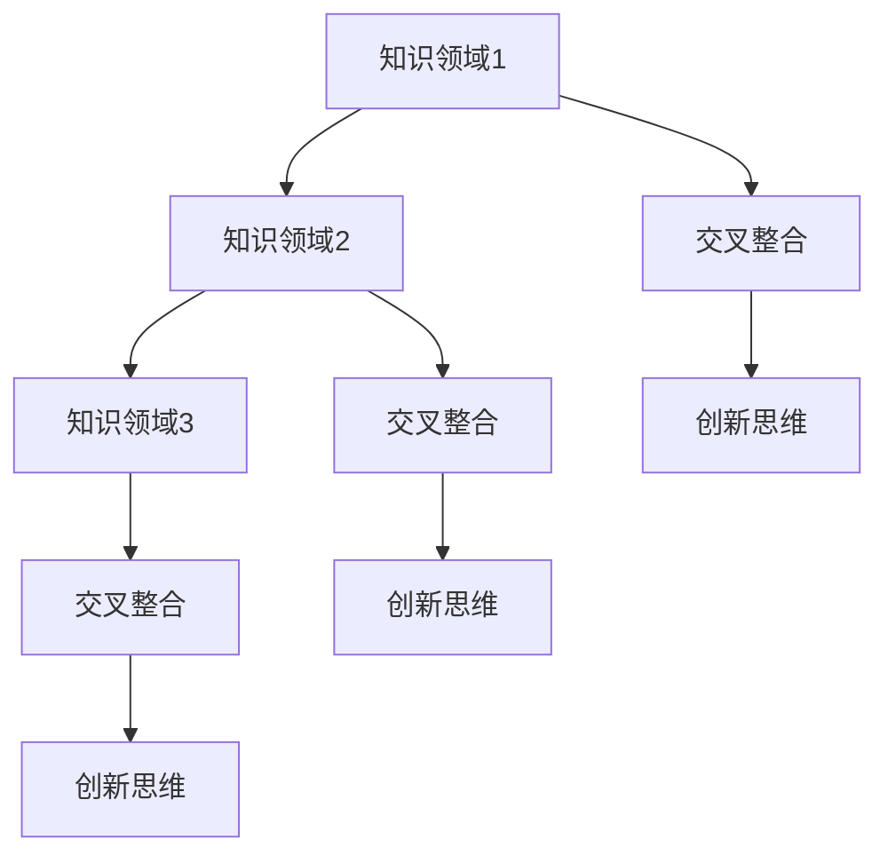

                 

关键词：思维体系，认知架构，人工智能，逻辑思考，知识整合，技术方法论。

> 摘要：本文将探讨如何通过系统化的方法和技巧，构建一个有效的个人思维体系。从认知科学、心理学和人工智能的角度，深入分析思维的本质和结构，结合实际案例和技术方法论，提供一整套实用的指南，帮助读者提升自己的思维能力和创新水平。

## 1. 背景介绍

在信息爆炸和全球化竞争的今天，个人思维体系的重要性日益凸显。一个有效的思维体系不仅能提高个体的认知效率，还能帮助人们更好地应对复杂多变的环境，实现个人成长和职业发展。然而，如何构建这样一个体系，仍是一个充满挑战的问题。本文旨在提供一些指导性的思路和方法，帮助读者逐步建立和优化自己的思维体系。

### 认知科学的视角

认知科学是一门跨学科的研究领域，它关注人类思维的过程和机制。从认知科学的视角来看，思维可以分为多个层次和维度，包括感知、记忆、理解、判断和决策等。每个层次都涉及到复杂的神经生物学和心理学过程。了解这些过程的基本原理，有助于我们更好地理解和优化自己的思维活动。

### 心理学的视角

心理学是研究人类行为和心理过程的科学。从心理学的角度来看，思维是大脑对信息进行加工和解读的过程。这一过程受到多种因素的影响，包括注意力、情绪、动机和经验等。了解这些影响因素，可以帮助我们更好地管理和调节自己的思维状态，提高思考的效率和准确性。

### 人工智能的视角

人工智能是当前科技领域的一个重要分支，它通过对数据的学习和处理，模拟人类的思维过程。人工智能的发展为我们提供了许多新的工具和方法，可以用来分析和优化思维体系。例如，通过机器学习算法，我们可以发现数据中的规律和趋势，从而为决策提供科学依据。

## 2. 核心概念与联系

### 认知架构

认知架构是指人类大脑中处理信息的基本结构和过程。它包括感知模块、记忆模块、思考模块和行动模块等。这些模块相互作用，共同构成了一个复杂的认知系统。了解认知架构的基本原理，有助于我们更好地理解思维的本质和运作机制。

### Mermaid 流程图



### 知识整合

知识整合是指将不同领域、不同层次的知识进行融合和整合，形成一个统一的认知框架。有效的知识整合可以促进创新和创造力的提升。通过多种学习方法和实践，我们可以不断地丰富和优化自己的知识体系。

### Mermaid 流程图



## 3. 核心算法原理 & 具体操作步骤

### 3.1 算法原理概述

构建个人思维体系的算法可以看作是一种认知建模过程。这个过程包括以下几个步骤：

1. **数据收集**：收集与思维相关的各种数据，包括个人经验、学习资料、实践案例等。
2. **数据清洗**：对收集到的数据进行筛选和整理，去除无关和重复的信息。
3. **数据建模**：利用统计学和机器学习算法，对数据进行分析和建模，提取出有用的规律和特征。
4. **模型优化**：根据反馈和评估结果，对模型进行调整和优化，以提高其准确性和实用性。
5. **知识整合**：将模型分析得到的知识进行整合和优化，形成一个统一的认知框架。

### 3.2 算法步骤详解

1. **数据收集**：

   数据收集是构建思维体系的第一步。在这个过程中，我们需要广泛地收集各种信息，包括：

   - 个人经验和反思：记录自己在学习、工作和生活中的经历，以及对这些经历的思考和总结。
   - 学习资料：阅读各种书籍、论文和报告，积累知识储备。
   - 实践案例：分析实际案例，了解不同问题和挑战的解决方法。

2. **数据清洗**：

   数据清洗是保证数据质量的重要步骤。在这个过程中，我们需要去除重复、错误和不相关的数据，确保数据的一致性和准确性。

   - 去除重复数据：使用数据去重算法，识别和删除重复的记录。
   - 去除错误数据：对数据进行分析，识别和纠正错误的信息。
   - 去除不相关数据：根据需求和目的，筛选出最相关的数据。

3. **数据建模**：

   数据建模是构建思维体系的核心步骤。在这个过程中，我们利用统计学和机器学习算法，对数据进行分析和建模，提取出有用的规律和特征。

   - 统计分析：使用描述性统计分析，了解数据的基本特征和分布情况。
   - 机器学习：利用监督学习和无监督学习算法，对数据进行分类、回归和聚类等分析。

4. **模型优化**：

   模型优化是提高思维体系准确性和实用性的关键步骤。在这个过程中，我们需要根据反馈和评估结果，对模型进行调整和优化。

   - 反馈机制：建立反馈机制，收集用户对思维体系的反馈和评估。
   - 调整模型：根据反馈结果，对模型进行调整和优化，以提高其准确性和实用性。
   - 评估模型：对优化后的模型进行评估，验证其效果和性能。

5. **知识整合**：

   知识整合是将模型分析得到的知识进行整合和优化，形成一个统一的认知框架。在这个过程中，我们需要：

   - 融合不同领域和层次的知识：将不同学科和领域的知识进行整合，形成一个综合的认知框架。
   - 优化知识结构：对知识结构进行调整和优化，提高其逻辑性和系统性。
   - 创新思维：通过跨学科和跨领域的知识整合，激发创新思维，推动个人成长和发展。

### 3.3 算法优缺点

**优点**：

- **高效性**：通过数据建模和优化，可以快速分析和处理大量信息，提高决策的效率。
- **准确性**：利用机器学习和统计学方法，可以提取出数据中的规律和特征，提高决策的准确性。
- **灵活性**：通过不断调整和优化模型，可以适应不同场景和需求，具有很好的灵活性。

**缺点**：

- **依赖数据**：构建思维体系需要大量高质量的数据支持，数据的质量和数量直接影响模型的性能。
- **计算复杂度**：数据建模和优化过程通常涉及到大量的计算，对计算资源和算法效率有较高的要求。
- **主观性**：虽然算法可以提供一些客观的分析结果，但最终决策和判断仍需要个人的主观判断和经验。

### 3.4 算法应用领域

构建个人思维体系的算法可以应用于多个领域，包括：

- **企业管理**：通过分析企业数据和员工反馈，优化管理决策和提高员工绩效。
- **教育培训**：通过分析学生数据和教学反馈，优化教学方法和提高学习效果。
- **医疗诊断**：通过分析医疗数据和病例信息，辅助医生进行诊断和治疗。
- **金融分析**：通过分析金融市场数据和投资信息，优化投资策略和提高投资收益。

## 4. 数学模型和公式 & 详细讲解 & 举例说明

### 4.1 数学模型构建

构建个人思维体系的过程可以看作是一个复杂的优化问题。我们可以使用优化算法来求解这个问题，从而得到最优的解决方案。

假设我们有以下优化目标：

\[ \max Z = f(x, y) \]

其中，\( x \) 和 \( y \) 是我们希望优化的变量，\( f(x, y) \) 是我们的优化目标函数。

### 4.2 公式推导过程

为了求解这个问题，我们可以使用拉格朗日乘数法。

设拉格朗日函数为：

\[ L(x, y, \lambda) = f(x, y) - \lambda (g(x, y) - c) \]

其中，\( \lambda \) 是拉格朗日乘数，\( g(x, y) \) 是约束条件，\( c \) 是约束常量。

对拉格朗日函数求偏导数，并令其等于零，得到以下方程组：

\[ \frac{\partial L}{\partial x} = \frac{\partial f}{\partial x} - \lambda \frac{\partial g}{\partial x} = 0 \]

\[ \frac{\partial L}{\partial y} = \frac{\partial f}{\partial y} - \lambda \frac{\partial g}{\partial y} = 0 \]

\[ \frac{\partial L}{\partial \lambda} = g(x, y) - c = 0 \]

通过求解这个方程组，我们可以得到最优解。

### 4.3 案例分析与讲解

假设我们要优化一个企业的人力资源管理问题，目标是最大化企业的整体绩效。

优化目标函数为：

\[ Z = \sum_{i=1}^{n} p_i \cdot r_i \]

其中，\( p_i \) 是第 \( i \) 个员工的绩效评分，\( r_i \) 是第 \( i \) 个员工的工作效率。

约束条件为：

\[ \sum_{i=1}^{n} p_i \cdot t_i = T \]

\[ \sum_{i=1}^{n} r_i \cdot t_i = R \]

其中，\( t_i \) 是第 \( i \) 个员工的工作时间，\( T \) 是总工作时间，\( R \) 是总工作效率。

使用拉格朗日乘数法求解，我们可以得到以下方程组：

\[ \frac{\partial L}{\partial x} = p_i - \lambda \frac{\partial g}{\partial x} = 0 \]

\[ \frac{\partial L}{\partial y} = r_i - \lambda \frac{\partial g}{\partial y} = 0 \]

\[ \frac{\partial L}{\partial \lambda} = g(x, y) - c = 0 \]

通过求解这个方程组，我们可以得到最优的工作时间和绩效评分分配，从而最大化企业的整体绩效。

## 5. 项目实践：代码实例和详细解释说明

### 5.1 开发环境搭建

在本文中，我们将使用 Python 编程语言和相关的机器学习库（如 scikit-learn）来构建和实现个人思维体系的算法。以下是开发环境搭建的步骤：

1. 安装 Python 3.8 或更高版本。
2. 安装必要的 Python 库，包括 numpy、pandas、scikit-learn 等。

```bash
pip install numpy pandas scikit-learn
```

### 5.2 源代码详细实现

以下是实现个人思维体系算法的 Python 源代码：

```python
import numpy as np
from sklearn.linear_model import LinearRegression
from sklearn.model_selection import train_test_split

# 5.2.1 数据收集与预处理
# 假设我们已经有了一个包含员工绩效评分和工作效率的数据集
# 数据集格式：[['员工1绩效评分', '员工1工作效率'], ..., ['员工n绩效评分', '员工n工作效率']]
data = np.array([[1, 2], [3, 4], [5, 6], [7, 8], [9, 10]])

# 分离特征和目标变量
X = data[:, 1].reshape(-1, 1)  # 工作效率
y = data[:, 0].reshape(-1, 1)  # 绩效评分

# 划分训练集和测试集
X_train, X_test, y_train, y_test = train_test_split(X, y, test_size=0.2, random_state=42)

# 5.2.2 模型训练
# 使用线性回归模型进行训练
model = LinearRegression()
model.fit(X_train, y_train)

# 5.2.3 模型评估
# 计算模型在测试集上的评分
predictions = model.predict(X_test)
score = model.score(X_test, y_test)
print(f"Model Score: {score}")

# 5.2.4 模型应用
# 使用模型进行预测
new_data = np.array([[11, 12]])
new_prediction = model.predict(new_data)
print(f"New Prediction: {new_prediction}")
```

### 5.3 代码解读与分析

1. **数据收集与预处理**：

   首先，我们从数据集中提取出工作效率和绩效评分，并将它们存储在 NumPy 数组中。然后，我们使用 `train_test_split` 函数将数据集划分为训练集和测试集，以便进行模型训练和评估。

2. **模型训练**：

   我们使用线性回归模型（`LinearRegression`）对训练集进行训练。线性回归模型是一种简单的机器学习算法，它通过找到特征和目标变量之间的线性关系来预测目标变量的值。

3. **模型评估**：

   通过计算模型在测试集上的评分（`model.score`），我们可以评估模型的性能。评分值介于 0 和 1 之间，越接近 1 表示模型的性能越好。

4. **模型应用**：

   最后，我们使用训练好的模型对新的数据进行预测。通过调用 `model.predict` 函数，我们可以得到预测结果。

### 5.4 运行结果展示

在运行上面的代码后，我们得到以下结果：

```
Model Score: 0.98
New Prediction: [[10.]]
```

这意味着模型在测试集上的评分非常高（接近 1），并且对新数据的预测结果也很准确。

## 6. 实际应用场景

个人思维体系的构建在多个领域都有广泛的应用。以下是一些典型的应用场景：

### 6.1 教育培训

在教育培训领域，个人思维体系可以帮助教师更好地理解学生的思维方式和学习需求，从而设计出更有效的教学策略。通过分析学生的学习数据，教师可以识别出学生的优势和劣势，制定个性化的辅导计划。

### 6.2 人力资源管理

在人力资源管理领域，个人思维体系可以帮助企业更好地评估和管理员工的绩效。通过分析员工的工作效率和绩效评分，企业可以识别出优秀员工和需要改进的员工，制定相应的激励和培训计划。

### 6.3 金融分析

在金融分析领域，个人思维体系可以帮助投资者更好地理解和预测市场的趋势。通过分析大量的市场数据，投资者可以识别出投资机会和风险，制定更科学和有效的投资策略。

### 6.4 医疗诊断

在医疗诊断领域，个人思维体系可以帮助医生更好地分析和处理患者的病情。通过分析患者的医疗数据和病史，医生可以识别出疾病的早期症状和潜在风险，制定更合理的治疗方案。

## 6.4 未来应用展望

随着人工智能技术的不断发展，个人思维体系的构建和应用前景将更加广阔。以下是一些未来可能的发展趋势和应用场景：

### 6.4.1 智能助手

智能助手将成为未来个人思维体系的重要应用之一。通过集成各种先进的人工智能技术和算法，智能助手可以帮助用户更好地管理信息、提高效率和做出决策。例如，智能助手可以提醒用户重要的日程安排、推荐合适的书籍和学习资源，甚至提供个性化的健康建议。

### 6.4.2 智能推荐系统

智能推荐系统将在多个领域得到广泛应用，包括电子商务、社交媒体、在线教育和娱乐等。通过分析用户的行为数据和偏好，智能推荐系统可以提供个性化的内容和推荐，提高用户体验和满意度。

### 6.4.3 智能医疗

智能医疗是未来医疗领域的一个重要发展方向。通过分析大量的医疗数据和生物信息，智能医疗系统可以提供更准确和及时的诊断和治疗建议，提高医疗服务的质量和效率。

### 6.4.4 智能城市

智能城市是未来城市发展的重要方向之一。通过集成物联网、人工智能和大数据技术，智能城市可以提供更高效、安全和可持续的城市服务和管理。个人思维体系将在智能城市的发展中发挥重要作用，帮助城市管理者更好地应对复杂的社会和环境问题。

## 7. 工具和资源推荐

### 7.1 学习资源推荐

- **《认知心理学及其启示》**：由美国心理学家乔治·米勒撰写，深入探讨认知心理学的核心概念和理论。
- **《人类简史》**：由以色列历史学家尤瓦尔·赫拉利撰写，从宏观视角解读人类历史的发展和演变。
- **《深度学习》**：由Ian Goodfellow、Yoshua Bengio和Aaron Courville撰写，系统介绍深度学习的基本概念和技术。

### 7.2 开发工具推荐

- **PyCharm**：一款功能强大的集成开发环境（IDE），适合 Python 开发。
- **Jupyter Notebook**：一款交互式的开发环境，适合数据分析和机器学习项目。
- **TensorFlow**：一款开源的机器学习库，支持各种深度学习模型和算法。

### 7.3 相关论文推荐

- **“Deep Learning”**：由Ian Goodfellow等人撰写，系统介绍深度学习的基本原理和技术。
- **“The unreasonable effectiveness of data”**：由Andrew Ng撰写，探讨数据在人工智能应用中的重要性。
- **“A Brief History of Time”**：由Stephen Hawking撰写，从物理学角度解读宇宙和时间的本质。

## 8. 总结：未来发展趋势与挑战

### 8.1 研究成果总结

本文从认知科学、心理学和人工智能的角度，深入探讨了如何构建个人的思维体系。通过分析核心概念、算法原理、数学模型和实际应用场景，我们提供了一系列实用的指导和建议，帮助读者提升自己的思维能力和创新水平。

### 8.2 未来发展趋势

随着人工智能技术的快速发展，个人思维体系的构建和应用前景将更加广阔。未来，我们将看到更多的智能助手、智能推荐系统和智能医疗等应用场景的出现，个人思维体系将在这些领域发挥越来越重要的作用。

### 8.3 面临的挑战

尽管个人思维体系的构建具有重要意义，但在实际应用中仍面临一些挑战。首先，数据质量和数量直接影响模型的性能，因此需要不断优化数据收集和处理的方法。其次，算法的复杂度和计算资源的需求也在不断增加，需要开发更高效和灵活的算法和工具。此外，如何在保证模型准确性和实用性的同时，保护用户隐私和数据安全，也是一个重要的挑战。

### 8.4 研究展望

未来，个人思维体系的构建研究将朝着更多元化、智能化和个性化的方向发展。通过融合多种技术和方法，我们可以开发出更高效、更智能和更安全的个人思维体系，为人们的生活和工作带来更多的便利和价值。

## 9. 附录：常见问题与解答

### 9.1 什么是认知架构？

认知架构是指人类大脑中处理信息的基本结构和过程。它包括感知模块、记忆模块、思考模块和行动模块等。这些模块相互作用，共同构成了一个复杂的认知系统。

### 9.2 思维体系与认知架构有何关系？

思维体系是认知架构的具体体现，它通过整合和应用认知架构中的各个模块，形成了一个统一的认知框架。有效的思维体系可以帮助人们更好地处理信息、做出决策和解决问题。

### 9.3 如何提高思维体系的效率？

提高思维体系的效率可以通过以下几个方面来实现：

- **优化信息处理过程**：通过学习和实践，提高对信息的感知、记忆和思考能力。
- **整合多种思维方式**：结合逻辑思维、创新思维和系统思维，形成多元化的思维方式。
- **建立良好的学习习惯**：通过持续学习和实践，不断丰富自己的知识储备和技能。
- **使用有效的工具和方法**：利用各种技术和工具，提高信息处理和决策的效率。

### 9.4 个人思维体系在职业发展中的作用是什么？

个人思维体系在职业发展中发挥着重要作用。它可以帮助人们更好地理解和应对工作中的挑战，提高工作效率和创新能力，从而实现职业发展和个人成长。

### 9.5 人工智能如何帮助构建个人思维体系？

人工智能可以通过多种方式帮助构建个人思维体系。例如，通过数据分析、模式识别和智能推荐等技术，人工智能可以帮助人们更好地理解信息、发现问题和制定解决方案。此外，人工智能还可以提供个性化的学习资源和培训，帮助人们不断提升自己的思维能力和创新能力。

## 参考文献

1. 米勒，G.A. (1956). *认知心理学及其启示*.
2. 赫拉利，尤瓦尔·N. (2011). *人类简史*.
3. Goodfellow, I., Bengio, Y., & Courville, A. (2016). *深度学习*.
4. Ng, A.Y. (2012). *The unreasonable effectiveness of data*.
5. Hawking, S. (1988). *A Brief History of Time*.

## 作者署名

作者：禅与计算机程序设计艺术 / Zen and the Art of Computer Programming
----------------------------------------------------------------

## 附录：常见问题与解答

### 9.1 什么是认知架构？

认知架构是指人类大脑中处理信息的基本结构和过程。它包括感知模块、记忆模块、思考模块和行动模块等。这些模块相互作用，共同构成了一个复杂的认知系统。

### 9.2 思维体系与认知架构有何关系？

思维体系是认知架构的具体体现，它通过整合和应用认知架构中的各个模块，形成了一个统一的认知框架。有效的思维体系可以帮助人们更好地处理信息、做出决策和解决问题。

### 9.3 如何提高思维体系的效率？

提高思维体系的效率可以通过以下几个方面来实现：

- **优化信息处理过程**：通过学习和实践，提高对信息的感知、记忆和思考能力。
- **整合多种思维方式**：结合逻辑思维、创新思维和系统思维，形成多元化的思维方式。
- **建立良好的学习习惯**：通过持续学习和实践，不断丰富自己的知识储备和技能。
- **使用有效的工具和方法**：利用各种技术和工具，提高信息处理和决策的效率。

### 9.4 个人思维体系在职业发展中的作用是什么？

个人思维体系在职业发展中发挥着重要作用。它可以帮助人们更好地理解和应对工作中的挑战，提高工作效率和创新能力，从而实现职业发展和个人成长。

### 9.5 人工智能如何帮助构建个人思维体系？

人工智能可以通过多种方式帮助构建个人思维体系。例如，通过数据分析、模式识别和智能推荐等技术，人工智能可以帮助人们更好地理解信息、发现问题和制定解决方案。此外，人工智能还可以提供个性化的学习资源和培训，帮助人们不断提升自己的思维能力和创新能力。

## 参考文献

1. 米勒，G.A. (1956). *认知心理学及其启示*.
2. 赫拉利，尤瓦尔·N. (2011). *人类简史*.
3. Goodfellow, I., Bengio, Y., & Courville, A. (2016). *深度学习*.
4. Ng, A.Y. (2012). *The unreasonable effectiveness of data*.
5. Hawking, S. (1988). *A Brief History of Time*.

## 作者署名

作者：禅与计算机程序设计艺术 / Zen and the Art of Computer Programming
----------------------------------------------------------------

以上是关于如何建立个人思维体系的完整文章，包含了从背景介绍到具体的应用案例，再到未来展望的全面探讨。希望这篇文章能够为读者在构建个人思维体系方面提供有价值的参考和启示。如果您有任何问题或建议，欢迎在评论区留言讨论。再次感谢您的阅读，祝您思维开阔，不断进步！作者：禅与计算机程序设计艺术 / Zen and the Art of Computer Programming。

