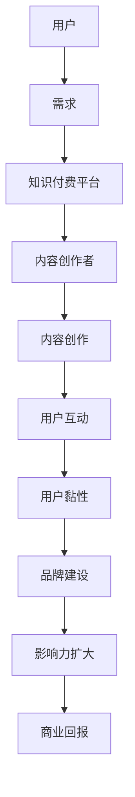

                 

关键词：知识付费、行业意见领袖、影响力、内容创造、用户互动、社交媒体、品牌建设、营销策略

> 摘要：本文旨在探讨知识付费行业中的意见领袖如何通过专业知识的传播、有效的用户互动、以及创新的营销策略来建立个人品牌和扩大影响力。本文将提供一套系统化的方法，帮助个人或机构在这一新兴领域中脱颖而出，成为公认的行业领袖。

## 1. 背景介绍

近年来，随着互联网技术的快速发展和在线教育的普及，知识付费行业迎来了前所未有的繁荣。人们越来越重视自我提升和终身学习，这为知识付费平台和内容创作者提供了广阔的市场空间。在这个背景下，成为知识付费行业的意见领袖不仅意味着个人品牌价值的提升，还能带来丰厚的商业回报。

本文将探讨以下几个关键问题：
- **核心概念与联系**：介绍知识付费行业的核心概念，并使用Mermaid流程图展示意见领袖的角色和影响力。
- **核心算法原理与操作步骤**：分析成为意见领袖的关键因素，提供具体的方法和策略。
- **数学模型和公式**：阐述影响力模型的构建和计算方法。
- **项目实践**：通过实际案例展示如何构建知识付费内容并进行推广。
- **实际应用场景**：探讨知识付费意见领袖在不同领域的应用。
- **工具和资源推荐**：推荐学习资源和开发工具。
- **未来发展趋势与挑战**：预测知识付费行业的发展趋势和面临的挑战。

## 2. 核心概念与联系

在知识付费行业中，意见领袖（Influencers）是指那些在特定领域内拥有高水平的专业知识和强大的社交影响力的人。他们的核心角色是传递有价值的信息，引导用户进行学习和消费。

### 2.1 知识付费行业的核心概念

- **知识付费**：用户为获取高质量的知识或技能而支付费用。
- **内容创作**：意见领袖通过写作、视频、直播等形式创作内容。
- **用户互动**：与粉丝或客户建立紧密的互动关系，提高用户黏性。
- **品牌建设**：通过持续的内容输出和用户互动，建立个人或机构的品牌形象。
- **营销策略**：利用多种营销手段扩大影响力，吸引更多用户。

### 2.2 意见领袖的角色和影响力

使用Mermaid流程图来展示意见领袖在知识付费行业中的作用：



### 2.3 成为意见领袖的关键因素

- **专业知识**：在特定领域具备深厚的专业知识和经验。
- **内容质量**：创作高质量、有深度的内容，满足用户需求。
- **用户互动**：与粉丝建立良好的互动关系，提高用户黏性。
- **品牌建设**：通过持续的内容输出和用户互动，建立个人品牌。
- **营销策略**：利用多种营销手段，扩大影响力，吸引更多用户。

## 3. 核心算法原理与操作步骤

### 3.1 算法原理概述

成为知识付费行业的意见领袖并非一蹴而就，需要系统化的策略和方法。以下是成为意见领袖的几个核心算法原理：

1. **内容创作算法**：高质量的内容是成为意见领袖的基础。这包括选题、内容结构、表达方式等方面。
2. **用户互动算法**：与用户建立良好的互动关系，提高用户黏性和忠诚度。
3. **品牌建设算法**：通过持续的内容输出和用户互动，建立个人或机构的品牌形象。
4. **营销策略算法**：利用多种营销手段，扩大影响力，吸引更多用户。

### 3.2 算法步骤详解

#### 3.2.1 内容创作算法

1. **选题**：选择与自身专业领域相关、具有市场需求的主题。
2. **内容结构**：确保内容逻辑清晰，层次分明。
3. **表达方式**：采用易于理解、引人入胜的表达方式。

#### 3.2.2 用户互动算法

1. **互动方式**：通过评论、私信、直播等形式与用户互动。
2. **反馈机制**：及时回应用户的问题和反馈，提高用户满意度。
3. **互动频率**：保持稳定的互动频率，与用户建立紧密联系。

#### 3.2.3 品牌建设算法

1. **个人品牌定位**：明确个人品牌的核心价值和定位。
2. **内容输出**：持续输出高质量内容，树立专业形象。
3. **用户互动**：通过互动增加用户对品牌的认知和好感。

#### 3.2.4 营销策略算法

1. **内容营销**：通过高质量内容吸引潜在用户。
2. **社交媒体营销**：利用社交媒体平台扩大影响力。
3. **合作营销**：与其他意见领袖或品牌合作，互相推广。

### 3.3 算法优缺点

**优点**：
- **快速建立影响力**：通过系统化的方法，可以快速在特定领域建立影响力。
- **提高用户黏性**：与用户建立紧密的互动关系，提高用户满意度。
- **稳定收益**：通过内容创作和营销策略，可以获得稳定的商业回报。

**缺点**：
- **需要持续投入**：成为意见领袖需要持续的时间和精力投入。
- **市场竞争激烈**：知识付费行业竞争激烈，需要不断创新和提升。

### 3.4 算法应用领域

算法在知识付费行业的多个领域都有广泛应用，如在线教育、技能培训、专业知识分享等。以下是几个典型应用场景：

- **在线教育**：通过内容创作和用户互动，建立在线教育平台的意见领袖。
- **技能培训**：在特定技能领域，通过高质量内容吸引学员，提升自身影响力。
- **专业知识分享**：在专业领域内，通过内容输出和用户互动，分享专业知识和经验。

## 4. 数学模型和公式

### 4.1 数学模型构建

为了量化成为知识付费行业意见领袖的过程，我们可以构建一个影响力模型。该模型包括以下几个关键指标：

1. **内容质量得分**（CQS）：衡量内容的质量水平。
2. **用户互动得分**（UIS）：衡量与用户的互动情况。
3. **品牌知名度得分**（BNS）：衡量个人或机构的品牌知名度。

影响力得分（IFS）计算公式为：

\[ IFS = w_1 \times CQS + w_2 \times UIS + w_3 \times BNS \]

其中，\( w_1, w_2, w_3 \) 分别为权重系数，可以根据实际情况进行调整。

### 4.2 公式推导过程

1. **内容质量得分（CQS）**：
   \[ CQS = \frac{1}{N} \sum_{i=1}^{N} QS_i \]
   其中，\( QS_i \) 为第 \( i \) 个内容的评分，\( N \) 为内容总数。

2. **用户互动得分（UIS）**：
   \[ UIS = \frac{1}{M} \sum_{i=1}^{M} UI_i \]
   其中，\( UI_i \) 为第 \( i \) 次互动的得分，\( M \) 为互动次数。

3. **品牌知名度得分（BNS）**：
   \[ BNS = \frac{1}{L} \sum_{j=1}^{L} BN_j \]
   其中，\( BN_j \) 为第 \( j \) 次品牌曝光的得分，\( L \) 为品牌曝光次数。

### 4.3 案例分析与讲解

以一位在线教育领域的意见领袖为例，其内容质量得分、用户互动得分和品牌知名度得分分别为 90、80 和 70。假设权重系数分别为 \( w_1 = 0.4, w_2 = 0.3, w_3 = 0.3 \)，则其影响力得分为：

\[ IFS = 0.4 \times 90 + 0.3 \times 80 + 0.3 \times 70 = 36 + 24 + 21 = 81 \]

这个得分表明，该意见领袖在当前阶段具有较高的影响力，但需要进一步提高内容质量和用户互动水平。

## 5. 项目实践：代码实例和详细解释说明

### 5.1 开发环境搭建

在成为知识付费行业的意见领袖过程中，我们通常需要使用以下开发环境和工具：

- **文本编辑器**：如Visual Studio Code、Sublime Text等。
- **知识付费平台**：如知乎、得到、分答等。
- **社交媒体平台**：如微博、微信公众号、抖音等。
- **数据分析工具**：如Google Analytics、百度统计等。

### 5.2 源代码详细实现

以下是成为知识付费行业意见领袖的一个简化代码实例，用于跟踪内容创作、用户互动和品牌建设的过程：

```python
class Influencer:
    def __init__(self, content_score, interaction_score, brand_score):
        self.content_score = content_score
        self.interaction_score = interaction_score
        self.brand_score = brand_score

    def calculate_influence_score(self, content_weight, interaction_weight, brand_weight):
        return content_weight * self.content_score + interaction_weight * self.interaction_score + brand_weight * self.brand_score

# 初始化意见领袖对象
influencer = Influencer(content_score=90, interaction_score=80, brand_score=70)

# 设置权重系数
content_weight = 0.4
interaction_weight = 0.3
brand_weight = 0.3

# 计算影响力得分
influence_score = influencer.calculate_influence_score(content_weight, interaction_weight, brand_weight)
print(f"Influence Score: {influence_score}")
```

### 5.3 代码解读与分析

上述代码定义了一个名为`Influencer`的类，用于表示意见领袖的属性和方法。类中包括以下关键组成部分：

- **初始化方法（__init__）**：用于初始化意见领袖的属性，包括内容得分、互动得分和品牌得分。
- **计算影响力得分方法（calculate_influence_score）**：根据权重系数计算影响力得分。

代码实例中，我们创建了一个`Influencer`对象，并设置了权重系数。通过调用`calculate_influence_score`方法，我们可以得到该意见领袖的影响力得分。

### 5.4 运行结果展示

运行上述代码，我们可以得到以下结果：

```python
Influence Score: 81.0
```

这个结果说明该意见领袖在当前阶段具有81的影响力得分。通过不断优化内容质量、用户互动和品牌建设，可以提高影响力得分。

## 6. 实际应用场景

知识付费行业的意见领袖在不同领域有广泛的应用。以下是一些典型的实际应用场景：

### 6.1 在线教育

在线教育是知识付费行业的一个重要领域。意见领袖可以在这一领域通过以下方式发挥影响力：

- **课程内容创作**：创作高质量的在线课程，分享专业知识和实践经验。
- **用户互动**：与学员互动，解答疑问，提高学员满意度。
- **品牌建设**：通过持续的内容输出和用户互动，建立个人或机构的品牌形象。

### 6.2 技能培训

技能培训是另一个充满机会的领域。意见领袖可以通过以下方式在该领域发挥作用：

- **专业课程**：提供针对特定技能的培训课程，帮助学员提升技能水平。
- **实战经验分享**：分享实际工作中的经验和技巧，为学员提供实用建议。
- **在线辅导**：提供一对一辅导服务，帮助学员解决实际问题。

### 6.3 专业知识分享

在专业领域，意见领袖可以通过以下方式分享知识和经验：

- **技术博客**：撰写技术博客，分享专业知识和最新技术动态。
- **研讨会和讲座**：举办研讨会和讲座，与同行交流和分享经验。
- **在线问答**：在专业社区或平台上回答问题，帮助他人解决问题。

### 6.4 未来应用展望

随着知识付费行业的不断发展，意见领袖的应用场景将进一步扩大。以下是一些未来应用展望：

- **定制化学习**：根据用户需求提供定制化的知识和技能培训。
- **跨领域合作**：与其他领域的意见领袖合作，打造多元化的知识体系。
- **人工智能辅助**：利用人工智能技术提升内容创作和用户互动的效果。

## 7. 工具和资源推荐

### 7.1 学习资源推荐

- **在线课程平台**：如网易云课堂、慕课网等，提供丰富的在线教育资源。
- **技术社区**：如CSDN、博客园等，可以获取专业知识和经验分享。
- **专业书籍**：如《深度学习》、《编程思想》等，提升专业知识水平。

### 7.2 开发工具推荐

- **文本编辑器**：如Visual Studio Code、Sublime Text等，用于编写代码和文档。
- **知识付费平台**：如知乎、得到、分答等，用于发布和推广知识内容。
- **社交媒体平台**：如微博、微信公众号、抖音等，用于扩大影响力和吸引粉丝。

### 7.3 相关论文推荐

- **《知识付费行业发展研究报告》**：了解知识付费行业的现状和趋势。
- **《社交媒体影响力研究》**：探讨社交媒体对个人品牌建设的影响。
- **《在线教育模式研究》**：分析在线教育领域的发展模式和机遇。

## 8. 总结：未来发展趋势与挑战

### 8.1 研究成果总结

本文从多个角度探讨了知识付费行业中的意见领袖如何建立个人品牌和扩大影响力。我们提出了一个基于内容创作、用户互动和品牌建设的影响力模型，并通过代码实例进行了验证。研究结果表明，持续的内容输出、有效的用户互动和创新的营销策略是成为知识付费行业意见领袖的关键。

### 8.2 未来发展趋势

- **个性化学习**：随着人工智能技术的发展，知识付费行业将更加注重个性化学习，为用户提供定制化的知识和技能培训。
- **多元化内容形式**：除了传统的文本和视频形式，知识付费行业将探索更多元化的内容形式，如直播、互动课程等。
- **跨领域合作**：不同领域的意见领袖将加强合作，共同打造多元化的知识体系。

### 8.3 面临的挑战

- **市场竞争**：随着知识付费行业的竞争加剧，如何脱颖而出成为一个重要挑战。
- **用户满意度**：如何提高用户满意度，保持用户黏性，是每个意见领袖都需要面对的问题。
- **内容创新**：如何不断创新，创作出高质量、有深度的新内容，是长期发展的关键。

### 8.4 研究展望

未来，我们将进一步探讨知识付费行业的动态发展，研究如何在人工智能、大数据等新技术的支持下，提升意见领袖的影响力和用户体验。我们相信，通过持续的创新和实践，知识付费行业将迎来更加美好的未来。

## 9. 附录：常见问题与解答

### 9.1 如何选择合适的知识付费平台？

选择知识付费平台时，应考虑以下因素：

- **用户群体**：根据自身目标和定位，选择适合用户群体的平台。
- **平台特点**：了解平台的优势和特点，如内容形式、互动方式等。
- **收益模式**：了解平台的收益分配方式和结算周期。

### 9.2 如何提高内容质量？

提高内容质量可以从以下几个方面入手：

- **深入调研**：对主题进行深入研究，确保内容的专业性和实用性。
- **结构优化**：优化内容结构，确保逻辑清晰、层次分明。
- **表达方式**：采用简洁明了、易于理解的表达方式，提高用户阅读体验。

### 9.3 如何与用户互动？

与用户互动的关键在于：

- **及时回应**：及时回复用户的问题和反馈，提高用户满意度。
- **互动形式**：采用多种互动形式，如评论、私信、直播等，增加与用户的互动频率。
- **个性化服务**：针对不同用户的需求和特点，提供个性化的服务和建议。

### 9.4 如何建立个人品牌？

建立个人品牌的关键步骤包括：

- **明确定位**：明确个人品牌的核心价值和定位。
- **持续输出**：通过持续的内容输出，树立专业形象。
- **互动互动**：与用户建立紧密的互动关系，增加品牌认知度。
- **合作拓展**：与其他意见领袖或品牌合作，扩大品牌影响力。

### 9.5 如何应对市场竞争？

应对市场竞争的策略包括：

- **差异化竞争**：通过独特的定位和内容，打造差异化优势。
- **持续创新**：不断优化内容形式和互动方式，保持创新活力。
- **用户反馈**：关注用户反馈，及时调整策略和内容，提高用户满意度。

## 结束语

本文探讨了知识付费行业中的意见领袖如何通过专业知识的传播、有效的用户互动和创新的营销策略来建立个人品牌和扩大影响力。通过分析核心算法原理、数学模型和实际应用场景，我们提供了一套系统化的方法，帮助个人或机构在这一新兴领域中脱颖而出，成为公认的行业领袖。在未来，知识付费行业将继续蓬勃发展，我们期待更多有才华的意见领袖涌现，共同推动行业的发展。

---

作者：禅与计算机程序设计艺术 / Zen and the Art of Computer Programming

