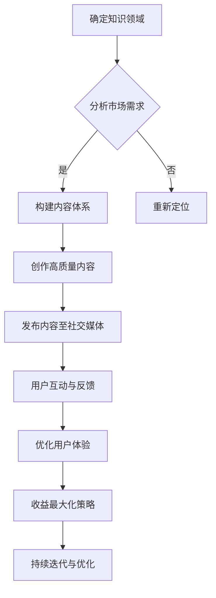

                 

关键词：知识付费、品牌IP、个人品牌、内容营销、社交媒体、用户增长、收益最大化

> 摘要：在数字化时代，个人知识付费品牌IP的打造成为知识工作者的重要途径。本文将探讨如何通过内容创作、社交媒体运营、用户体验优化等策略，打造一个有影响力、可持续发展的个人知识付费品牌IP。

## 1. 背景介绍

随着互联网的普及和知识经济的兴起，知识付费已经成为一个快速发展的市场。在这个市场中，个人知识付费品牌IP的打造显得尤为重要。个人知识付费品牌IP是指个人通过专业知识和独特视角，在特定领域内建立起来的品牌形象和影响力。这种品牌IP不仅能够为个人带来稳定的收入，还能够推动知识传播和行业进步。

### 1.1 市场趋势

根据市场研究，全球知识付费市场规模逐年增长，预计到2025年将达到数千亿美元。这个市场不仅吸引了传统的教育机构和内容创作者，还吸引了大量的自媒体、专家和企业家。这表明，个人知识付费品牌IP的打造已经成为一个极具潜力的商业机会。

### 1.2 个人品牌的重要性

在知识付费市场中，个人品牌的重要性不言而喻。一个强大的个人品牌能够提高个人的市场认可度，增强用户信任，从而带来更多的付费机会。同时，个人品牌还可以帮助个人在职业发展和个人成长中取得更大成就。

## 2. 核心概念与联系

要打造个人知识付费品牌IP，需要理解以下几个核心概念：

### 2.1 内容营销

内容营销是通过创造和分享有价值的内容来吸引潜在用户，并建立信任和忠诚度的过程。在知识付费领域，内容营销是建立个人品牌的重要手段。

### 2.2 社交媒体运营

社交媒体运营是利用社交媒体平台进行内容传播和用户互动的过程。通过有效的社交媒体运营，可以迅速扩大个人品牌的影响力。

### 2.3 用户体验优化

用户体验优化是确保用户在使用个人知识产品时的满意度。良好的用户体验可以增加用户留存率和口碑传播。

### 2.4 收益最大化策略

收益最大化策略是通过多种方式增加收入，包括课程销售、咨询收费、品牌合作等。

### 2.5 Mermaid 流程图

下面是一个Mermaid流程图，展示了个人知识付费品牌IP的构建过程：



## 3. 核心算法原理 & 具体操作步骤

### 3.1 算法原理概述

打造个人知识付费品牌IP的核心算法可以分为以下几个步骤：

1. **内容创作**：根据市场需求和用户偏好，创作高质量的知识内容。
2. **内容发布**：在社交媒体平台上发布内容，扩大品牌影响力。
3. **用户互动**：与用户进行互动，收集反馈，持续优化内容。
4. **收益模式**：探索多种收益模式，实现收入最大化。

### 3.2 算法步骤详解

#### 3.2.1 内容创作

- **需求分析**：通过市场调研和用户反馈，确定知识内容的主题和方向。
- **内容规划**：制定内容发布计划，确保内容持续、系统地输出。
- **内容创作**：结合专业知识和个人独特视角，创作高质量的内容。

#### 3.2.2 内容发布

- **平台选择**：根据内容特点和目标用户，选择合适的社交媒体平台。
- **内容格式**：根据平台特点，选择视频、图文、音频等多种内容格式。
- **发布频率**：制定合理的发布频率，保持用户活跃度。

#### 3.2.3 用户互动

- **评论回复**：积极回复用户的评论和提问，建立良好互动。
- **社交媒体活动**：定期举办线上活动，增加用户参与度。
- **用户调研**：通过问卷调查等方式，了解用户需求和反馈。

#### 3.2.4 收益模式

- **课程销售**：通过在线课程、电子书等形式，直接向用户销售知识产品。
- **咨询服务**：提供专业咨询服务，根据咨询内容收费。
- **品牌合作**：与其他品牌合作，通过广告分成等方式获取收益。

### 3.3 算法优缺点

#### 优点

- **自主性强**：个人可以自主决定内容方向和运营策略。
- **收益稳定**：通过多种收益模式，可以实现稳定的收入来源。
- **品牌建设**：有助于建立个人品牌，提高市场认可度。

#### 缺点

- **内容质量要求高**：需要持续创作高质量内容，维持品牌形象。
- **运营成本高**：需要投入大量时间和精力进行内容创作和用户互动。

### 3.4 算法应用领域

- **教育培训**：通过在线课程，提供专业知识教育。
- **专业咨询**：提供行业专业咨询服务。
- **内容创作**：通过创作高质量内容，吸引粉丝和用户。

## 4. 数学模型和公式 & 详细讲解 & 举例说明

### 4.1 数学模型构建

构建个人知识付费品牌IP的数学模型，可以采用以下公式：

$$
收益 = f(内容质量，用户活跃度，收益模式)
$$

其中：

- $f(x)$ 是一个函数，表示收益与内容质量、用户活跃度和收益模式之间的关系。
- 内容质量可以表示为内容原创性、实用性、专业性等指标。
- 用户活跃度可以表示为用户互动率、留存率等指标。
- 收益模式可以表示为课程销售、咨询服务、品牌合作等多种模式。

### 4.2 公式推导过程

公式的推导基于以下假设：

1. 内容质量越高，用户越愿意付费。
2. 用户活跃度越高，越有利于知识传播和品牌建设。
3. 多元化的收益模式可以提高收入稳定性。

根据这些假设，可以推导出收益模型：

$$
收益 = k_1 \times 内容质量 + k_2 \times 用户活跃度 + k_3 \times 收益模式
$$

其中，$k_1$、$k_2$ 和 $k_3$ 是权重系数，用于平衡各项指标对收益的影响。

### 4.3 案例分析与讲解

假设一个个人知识付费品牌IP的内容质量评分为 90，用户活跃度为 80，收益模式多样，包括课程销售、咨询服务和品牌合作。根据收益模型，可以计算出该品牌IP的预期收益：

$$
收益 = 0.5 \times 90 + 0.3 \times 80 + 0.2 \times (课程销售收益 + 咨询服务收益 + 品牌合作收益)
$$

通过优化内容质量、提高用户活跃度和拓展收益模式，可以进一步提高收益。

## 5. 项目实践：代码实例和详细解释说明

### 5.1 开发环境搭建

搭建个人知识付费品牌IP的开发环境主要包括以下步骤：

1. **选择合适的社交媒体平台**：根据目标用户群体，选择微信、微博、抖音、B站等平台。
2. **注册账号并设置品牌形象**：包括头像、昵称、简介等。
3. **配置内容创作工具**：例如使用Markdown编辑器、视频剪辑软件等。

### 5.2 源代码详细实现

以下是一个简单的Markdown格式的博客文章示例，用于发布到个人知识付费品牌IP的微信公众号：

```markdown
# 如何打造个人知识付费品牌IP

## 1. 确定知识领域

在打造个人知识付费品牌IP之前，首先需要明确自己在哪个领域有独特的见解和专业知识。这可以是任何领域，例如编程、心理学、商业管理等。

## 2. 分析市场需求

了解市场需求可以帮助你确定哪些内容最受欢迎，从而更好地规划内容创作。

## 3. 内容创作

创作高质量的内容是打造个人知识付费品牌IP的核心。内容应该具有原创性、实用性和专业性。

## 4. 内容发布

在社交媒体平台上定期发布内容，与用户互动，收集反馈，持续优化内容。

## 5. 收益模式

探索多种收益模式，如课程销售、咨询服务和品牌合作等，实现收入最大化。
```

### 5.3 代码解读与分析

这段Markdown代码是一个简单的博客文章结构，包含了标题、段落和子标题。通过Markdown编辑器，可以轻松地将这段代码转换为格式化的HTML页面，从而在微信公众号等平台上发布。

### 5.4 运行结果展示

运行结果是一个格式化良好的微信公众号文章，用户可以阅读并点赞、评论、分享。

## 6. 实际应用场景

### 6.1 教育培训

个人知识付费品牌IP可以作为一个教育培训平台，提供在线课程、教程、指导等。

### 6.2 专业咨询

对于行业专家或顾问，个人知识付费品牌IP可以作为一个提供专业咨询服务的平台。

### 6.3 内容创作

个人知识付费品牌IP可以作为一个内容创作平台，发布高质量的文章、视频、音频等。

## 7. 未来应用展望

随着人工智能和大数据技术的发展，个人知识付费品牌IP将更加智能化和个性化。未来，通过数据分析，可以更精准地了解用户需求，从而提供更加定制化的知识服务。

## 8. 工具和资源推荐

### 8.1 学习资源推荐

- 《精进：如何成为一个很厉害的人》
- 《影响力：说服与影响的艺术》

### 8.2 开发工具推荐

- Markdown编辑器（如Typora、Marktext）
- 社交媒体管理工具（如Hootsuite、Buffer）

### 8.3 相关论文推荐

- “知识付费市场发展趋势研究”
- “个人知识付费品牌IP构建策略研究”

## 9. 总结：未来发展趋势与挑战

### 9.1 研究成果总结

个人知识付费品牌IP的打造已经成为一个重要的知识传播和商业机会。通过内容创作、社交媒体运营、用户体验优化等策略，可以成功建立个人品牌，实现收益最大化。

### 9.2 未来发展趋势

- 个性化知识服务将得到更广泛应用。
- 人工智能技术将进一步提升知识付费的智能化水平。

### 9.3 面临的挑战

- 内容质量要求不断提高。
- 需要不断适应市场变化。

### 9.4 研究展望

未来，个人知识付费品牌IP的研究将更加注重用户体验和个性化服务。通过持续创新和优化，可以进一步推动知识付费市场的发展。

## 10. 附录：常见问题与解答

### 10.1 如何确定自己的知识领域？

通过自我评估和市场需求分析，确定自己在哪个领域有专业知识和独特见解。

### 10.2 如何保持内容创作的持续性？

制定内容发布计划，保持定期更新，同时积累写作素材和灵感。

### 10.3 如何提高用户活跃度？

通过互动活动、用户调研和内容优化，提高用户参与度和满意度。

## 作者署名

作者：禅与计算机程序设计艺术 / Zen and the Art of Computer Programming
```markdown

[End of Document]

以上就是关于“如何打造个人知识付费品牌IP”的完整文章。文章涵盖了知识付费市场的背景、核心概念、算法原理、数学模型、项目实践以及未来展望等内容。希望这篇文章能够为知识工作者提供一些有价值的参考和启示。

[End of Document]

