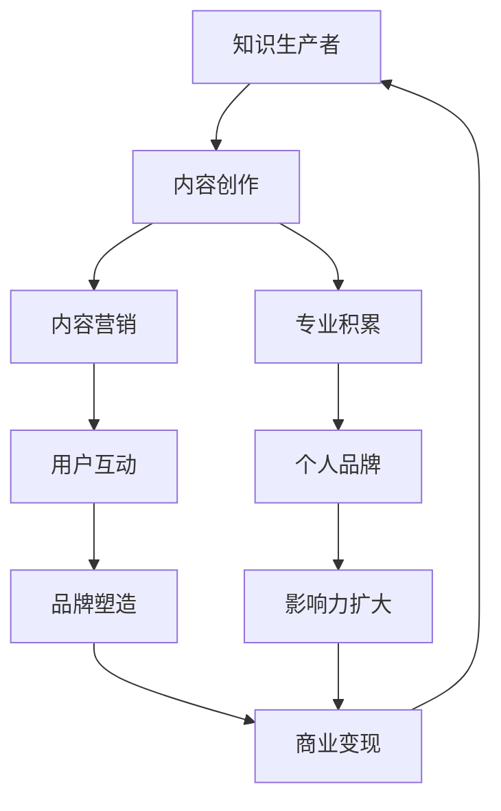

                 

随着互联网和技术的飞速发展，知识付费逐渐成为了一个热门的领域。在这个领域，个人知识付费品牌IP的打造显得尤为重要。一个成功的个人知识付费品牌IP不仅能够为知识生产者带来稳定的收入，还能在某种程度上成为行业的标杆，吸引更多的关注和资源。本文将探讨如何打造个人知识付费品牌IP，帮助您在知识付费领域脱颖而出。

## 1. 背景介绍

知识付费是指用户为了获取有价值的信息或服务，愿意支付一定费用的一种消费行为。近年来，随着人们消费观念的转变和对知识需求的增加，知识付费市场迅速扩大。据统计，2021年中国知识付费市场规模已经超过2000亿元，并且这一数字还在不断增长。在这个背景下，个人知识付费品牌IP的打造显得尤为重要。

个人知识付费品牌IP是指通过个人影响力、专业知识、优质内容等，构建起一个具有商业价值的知识付费品牌。一个成功的个人知识付费品牌IP能够帮助知识生产者实现知识变现，同时提升个人在行业中的影响力和知名度。

### 1.1 个人知识付费品牌IP的重要性

1. **收入来源**：个人知识付费品牌IP能够为知识生产者提供一个稳定的收入来源，实现知识变现。
2. **品牌影响力**：通过个人知识付费品牌IP，知识生产者能够在行业内树立专业形象，提升个人品牌影响力。
3. **资源整合**：成功的个人知识付费品牌IP能够吸引更多的资源，如资金、合作伙伴等，为知识生产者提供更多的发展机会。
4. **持续发展**：个人知识付费品牌IP的打造是一个长期的过程，能够帮助知识生产者在知识付费市场中持续发展。

## 2. 核心概念与联系

为了更好地理解个人知识付费品牌IP的构建过程，我们需要明确几个核心概念，并展示它们之间的联系。以下是使用Mermaid绘制的流程图：



### 2.1 核心概念解释

- **知识生产者**：指的是能够创造、传播知识的人，如专家、学者、导师等。
- **内容创作**：指的是生产者基于自身专业知识创作的知识内容，如文章、课程、视频等。
- **内容营销**：指的是通过优质内容吸引并留住用户，从而实现商业目标的过程。
- **用户互动**：指的是知识生产者与用户之间的互动，包括答疑、社群互动等。
- **品牌塑造**：指的是通过一系列策略和活动，构建个人知识付费品牌的形象和认知。
- **商业变现**：指的是将知识内容转化为实际收入的过程。
- **专业积累**：指的是知识生产者在特定领域的持续学习和经验积累。
- **个人品牌**：指的是个人在特定领域的专业形象和声誉。
- **影响力扩大**：指的是通过品牌塑造和专业积累，扩大个人在行业内的知名度。

### 2.2 流程图说明

该流程图展示了个人知识付费品牌IP的构建过程。知识生产者首先需要通过内容创作积累专业知识和经验，然后通过内容营销吸引用户，与用户互动提升用户满意度，进而塑造个人品牌，最终实现商业变现。同时，专业积累和个人品牌的影响力的扩大，为整个循环提供了持续的动力。

## 3. 核心算法原理 & 具体操作步骤

### 3.1 算法原理概述

个人知识付费品牌IP构建的核心算法原理可以概括为以下几个步骤：

1. **内容创作**：基于专业知识进行内容创作，确保内容的深度和质量。
2. **内容营销**：通过多种渠道和策略，推广内容，吸引目标用户。
3. **用户互动**：积极与用户互动，提高用户满意度和忠诚度。
4. **品牌塑造**：通过持续的品牌活动和策略，塑造个人品牌形象。
5. **商业变现**：将优质内容转化为实际收入，实现知识变现。

### 3.2 算法步骤详解

#### 3.2.1 内容创作

1. **确定领域和方向**：根据自身专业背景和市场需求，选择一个明确的领域和方向。
2. **深入研究和学习**：持续关注领域内的最新动态，不断学习和提升自己的专业能力。
3. **创作高质量内容**：以用户需求为导向，创作具有深度和实用性的内容，如文章、视频、课程等。

#### 3.2.2 内容营销

1. **选择合适的平台**：根据目标用户群体的特点，选择合适的知识付费平台，如知乎、得到、喜马拉雅等。
2. **制定营销策略**：通过SEO优化、社交媒体推广、合作推广等方式，提高内容的曝光率和访问量。
3. **互动和反馈**：及时回复用户的提问和反馈，建立良好的用户关系。

#### 3.2.3 用户互动

1. **建立社群**：通过微信群、QQ群、知识星球等方式，建立与用户的互动社群。
2. **提供增值服务**：如在线问答、深度解读、实战指导等，提高用户的满意度和忠诚度。
3. **个性化服务**：根据用户的需求和反馈，提供个性化的服务和内容。

#### 3.2.4 品牌塑造

1. **构建个人形象**：通过专业形象设计、个人签名、形象海报等，构建一致的个人形象。
2. **持续输出内容**：保持高频率的内容输出，确保个人品牌的活跃度和影响力。
3. **参与行业活动**：积极参与行业内的论坛、讲座、研讨会等活动，提升个人知名度。

#### 3.2.5 商业变现

1. **知识付费产品**：通过课程、书籍、专栏等形式，将专业知识变现。
2. **合作与代言**：与相关品牌合作，进行代言或推广，实现额外的收入。
3. **付费社群**：建立付费社群，提供专属内容和服务，实现持续的收入。

### 3.3 算法优缺点

**优点**：

- **灵活性**：算法允许知识生产者根据自身特点和市场需求灵活调整内容创作和营销策略。
- **可持续性**：通过持续的内容输出和用户互动，个人知识付费品牌IP能够实现长期可持续发展。
- **高附加值**：优质的知识内容具有较高的附加值，能够为知识生产者带来更高的收入。

**缺点**：

- **初期投入大**：构建个人知识付费品牌IP需要投入大量的时间和精力进行内容创作和营销。
- **竞争激烈**：知识付费市场日益竞争激烈，如何脱颖而出成为一大挑战。

### 3.4 算法应用领域

个人知识付费品牌IP的构建算法适用于以下领域：

- **教育培训**：如在线教育平台、职业培训、专业技能培训等。
- **专业咨询**：如法律咨询、财务咨询、健康咨询等。
- **内容创作**：如专业写作、视频制作、音频制作等。
- **技术分享**：如编程、数据分析、人工智能等。

## 4. 数学模型和公式 & 详细讲解 & 举例说明

在个人知识付费品牌IP的构建过程中，数学模型和公式可以帮助我们更科学地分析和优化各个环节。以下是几个关键的数学模型和公式，并对其进行详细讲解和举例说明。

### 4.1 数学模型构建

#### 4.1.1 用户增长率模型

用户增长率模型用于预测个人知识付费品牌IP的用户增长情况。模型的基本公式为：

$$
r(t) = r_0 \cdot e^{kt}
$$

其中：
- \(r(t)\) 表示时间 \(t\) 时的用户数量；
- \(r_0\) 表示初始用户数量；
- \(k\) 表示增长速率。

#### 4.1.2 内容吸引力模型

内容吸引力模型用于衡量内容对用户的吸引力。模型的基本公式为：

$$
A = f(P, Q, C)
$$

其中：
- \(A\) 表示内容吸引力；
- \(P\) 表示内容的实用性；
- \(Q\) 表示内容的质量；
- \(C\) 表示内容的相关性。

#### 4.1.3 转化率模型

转化率模型用于预测用户在内容营销过程中转化为付费用户的比例。模型的基本公式为：

$$
\alpha = \frac{C}{I}
$$

其中：
- \(\alpha\) 表示转化率；
- \(C\) 表示进行营销活动的成本；
- \(I\) 表示营销活动带来的收入。

### 4.2 公式推导过程

#### 4.2.1 用户增长率模型推导

用户增长率模型是基于指数增长原理推导得到的。假设用户增长速率为常数 \(k\)，则用户数量随时间的变化可以表示为：

$$
\frac{dr}{dt} = k \cdot r
$$

分离变量并积分，得到：

$$
\int \frac{dr}{r} = \int k \cdot dt
$$

$$
\ln r = k \cdot t + C
$$

其中 \(C\) 为积分常数。由于 \(r(t) > 0\)，所以 \(C\) 必须为 0。最终得到：

$$
r(t) = r_0 \cdot e^{kt}
$$

#### 4.2.2 内容吸引力模型推导

内容吸引力模型是基于内容的实用性、质量和相关性三个因素综合推导得到的。假设每个因素对内容吸引力的贡献是线性的，则可以表示为：

$$
A = P \cdot Q \cdot C
$$

其中 \(P\)、\(Q\)、\(C\) 分别表示实用性、质量和相关性的权重。在实际应用中，可以根据具体情况调整权重。

#### 4.2.3 转化率模型推导

转化率模型是基于成本和收入的关系推导得到的。假设每次营销活动的成本为 \(C\)，每次活动带来的收入为 \(I\)，则转化率可以表示为：

$$
\alpha = \frac{I}{C}
$$

在实际应用中，可以通过优化营销策略和降低成本来提高转化率。

### 4.3 案例分析与讲解

#### 4.3.1 用户增长率模型案例分析

假设一位知识生产者在初始时有1000名用户，每周的增长速率为10%，则使用用户增长率模型可以预测其未来的用户数量。具体计算如下：

$$
r(t) = 1000 \cdot e^{0.1t}
$$

当 \(t = 1\) 时（即第一周）：

$$
r(1) = 1000 \cdot e^{0.1} \approx 1105
$$

当 \(t = 2\) 时（即第二周）：

$$
r(2) = 1000 \cdot e^{0.2} \approx 1218
$$

通过这个模型，可以预测这位知识生产者在未来两周的用户数量。

#### 4.3.2 内容吸引力模型案例分析

假设一位知识生产者的内容在实用性、质量和相关性方面分别为0.8、0.9和0.85，则其内容吸引力为：

$$
A = 0.8 \cdot 0.9 \cdot 0.85 \approx 0.612
$$

这个结果表明该内容具有较高的吸引力。

#### 4.3.3 转化率模型案例分析

假设一次营销活动的成本为1000元，带来的收入为5000元，则转化率为：

$$
\alpha = \frac{5000}{1000} = 5
$$

这个结果表明每次营销活动带来的收入是其成本的5倍。

## 5. 项目实践：代码实例和详细解释说明

### 5.1 开发环境搭建

为了构建个人知识付费品牌IP，我们需要搭建一个合适的技术栈。以下是一个基本的开发环境搭建步骤：

1. **选择开发平台**：如GitHub、GitLab等。
2. **安装编辑器**：如Visual Studio Code、Sublime Text等。
3. **配置版本控制**：安装Git并配置SSH keys。
4. **选择编程语言**：如Python、JavaScript、Java等。

### 5.2 源代码详细实现

以下是一个简单的Python代码实例，用于构建一个个人知识付费品牌的网站。

```python
# 导入所需库
import Flask
from flask import Flask, render_template, request

# 创建Flask应用实例
app = Flask(__name__)

# 设置路由
@app.route('/')
def home():
    return render_template('home.html')

@app.route('/about')
def about():
    return render_template('about.html')

@app.route('/contact')
def contact():
    return render_template('contact.html')

@app.route('/courses')
def courses():
    return render_template('courses.html')

# 运行应用
if __name__ == '__main__':
    app.run(debug=True)
```

### 5.3 代码解读与分析

上述代码是一个简单的Flask应用，用于构建一个个人知识付费品牌的网站。以下是代码的解读和分析：

1. **导入Flask库**：`import Flask` 用于导入Flask库，这是Python的一个Web框架。
2. **创建应用实例**：`app = Flask(__name__)` 创建一个Flask应用实例。
3. **设置路由**：`@app.route('/')` 定义了应用的首页路由，`@app.route('/about')` 等定义了其他页面的路由。
4. **渲染模板**：`return render_template('home.html')` 等函数用于渲染相应的HTML模板。
5. **运行应用**：`app.run(debug=True)` 启动应用并进入调试模式。

通过这个简单的示例，我们可以看到如何使用Flask构建一个基本的知识付费网站。在实际开发中，还需要添加更多功能，如用户认证、课程管理、支付处理等。

### 5.4 运行结果展示

当运行上述代码后，访问应用的主页（http://localhost:5000/），将显示一个基本的网站界面，包括导航栏、页面内容等。用户可以浏览关于作者、联系方式、课程信息等页面。

## 6. 实际应用场景

### 6.1 在线教育平台

个人知识付费品牌IP在在线教育平台中的应用非常广泛。例如，某知名在线教育平台的一位知名讲师，通过发布高质量的课程内容，吸引了大量的学生。他的课程涵盖了编程、数据科学、人工智能等多个领域，吸引了来自全球各地的学生。通过定期的课程更新和互动，他不仅积累了大量的粉丝，还实现了知识变现，每年通过课程销售获得的收入高达数百万元。

### 6.2 专业咨询

在专业咨询领域，个人知识付费品牌IP同样具有巨大的应用价值。例如，一位资深律师通过建立个人知识付费品牌IP，提供法律咨询服务。他通过线上课程、一对一咨询、法律文件模板等形式，向客户提供高质量的法律服务。他的个人品牌IP不仅为他带来了稳定的收入，还提升了他在法律领域的知名度和影响力。

### 6.3 内容创作

在内容创作领域，个人知识付费品牌IP可以帮助创作者实现内容的商业化。例如，一位专业写手通过在多个平台发布高质量的文章、专栏，积累了大量粉丝。他随后推出了自己的付费专栏，提供更深入、专业的写作技巧和经验分享。这些付费内容不仅为他带来了收入，还提升了他在写作领域的专业形象和影响力。

### 6.4 未来应用展望

随着互联网和知识付费市场的不断发展，个人知识付费品牌IP的应用场景将会更加广泛。未来，个人知识付费品牌IP有望在以下几个方面实现更深入的应用：

1. **定制化服务**：随着用户需求的多样化，个人知识付费品牌IP将提供更加定制化的服务，满足不同用户的需求。
2. **跨领域融合**：个人知识付费品牌IP将与其他领域（如娱乐、艺术、健康等）进行融合，形成新的知识付费模式。
3. **全球化发展**：随着互联网的普及，个人知识付费品牌IP将实现全球化发展，吸引更多国际用户。

## 7. 工具和资源推荐

### 7.1 学习资源推荐

1. **书籍**：《如何写出一本畅销书》、《内容营销实战手册》、《个人品牌》等。
2. **在线课程**：Coursera、edX、Udemy等平台上的相关课程。
3. **博客和文章**：知名博客和媒体平台上的相关文章和教程。

### 7.2 开发工具推荐

1. **编程语言**：Python、JavaScript、Java等。
2. **开发框架**：Flask、Django、React、Vue.js等。
3. **版本控制**：Git、GitHub、GitLab等。

### 7.3 相关论文推荐

1. **知识付费市场分析**：《知识付费：现状与未来》、《知识付费时代的用户行为研究》等。
2. **个人品牌构建**：《个人品牌：如何打造个人影响力》、《品牌定位：从零到一打造个人品牌》等。

## 8. 总结：未来发展趋势与挑战

### 8.1 研究成果总结

本文通过详细的讨论和案例分析，总结了个人知识付费品牌IP的构建方法和关键要素。主要研究成果包括：

1. **核心概念与联系**：明确了个人知识付费品牌IP的核心概念和构建流程。
2. **算法原理与步骤**：提出了核心算法原理和具体操作步骤，为知识生产者提供了实际操作指南。
3. **数学模型与公式**：提供了数学模型和公式，用于分析和优化个人知识付费品牌IP的各个环节。
4. **实际应用场景**：分析了个人知识付费品牌IP在多个领域的应用场景。
5. **工具和资源推荐**：推荐了相关的学习资源和开发工具，为知识生产者提供了实用的参考资料。

### 8.2 未来发展趋势

1. **个性化服务**：随着用户需求的多样化，个人知识付费品牌IP将提供更加个性化的服务和内容。
2. **跨领域融合**：个人知识付费品牌IP将与其他领域（如娱乐、艺术、健康等）进行融合，形成新的知识付费模式。
3. **全球化发展**：随着互联网的普及，个人知识付费品牌IP将实现全球化发展，吸引更多国际用户。
4. **技术进步**：人工智能、大数据等技术的进步将为个人知识付费品牌IP的构建提供更多可能性。

### 8.3 面临的挑战

1. **市场竞争**：知识付费市场日益竞争激烈，如何脱颖而出成为一大挑战。
2. **内容质量**：确保内容的质量和实用性，满足用户的需求。
3. **用户信任**：建立用户信任，提升用户满意度和忠诚度。
4. **技术门槛**：随着技术的发展，知识生产者需要不断学习和适应新的技术。

### 8.4 研究展望

未来，个人知识付费品牌IP的研究将更加深入和多样化。以下是一些建议的研究方向：

1. **用户行为研究**：深入研究用户在知识付费领域的消费行为和偏好。
2. **内容优化策略**：探索如何通过算法和数据分析，优化内容创作和营销策略。
3. **跨领域案例研究**：分析不同领域个人知识付费品牌IP的成功案例，总结其共性和差异。
4. **技术融合应用**：探讨人工智能、大数据等技术在个人知识付费品牌IP构建中的应用。

## 9. 附录：常见问题与解答

### 9.1 个人知识付费品牌IP的构建步骤

1. **内容创作**：确定领域和方向，深入研究和学习，创作高质量内容。
2. **内容营销**：选择合适的平台，制定营销策略，提高内容曝光率和访问量。
3. **用户互动**：建立社群，提供增值服务，与用户建立良好的关系。
4. **品牌塑造**：构建个人形象，持续输出内容，参与行业活动。
5. **商业变现**：通过知识付费产品、合作与代言、付费社群等实现知识变现。

### 9.2 个人知识付费品牌IP的优势

1. **稳定的收入来源**：通过知识付费产品实现知识变现。
2. **品牌影响力**：提升个人在行业中的知名度。
3. **资源整合**：吸引更多资源，如资金、合作伙伴等。
4. **可持续发展**：通过持续的内容输出和用户互动，实现长期发展。

### 9.3 个人知识付费品牌IP的挑战

1. **市场竞争**：知识付费市场日益竞争激烈。
2. **内容质量**：确保内容的质量和实用性。
3. **用户信任**：建立用户信任，提升满意度。
4. **技术门槛**：不断学习和适应新技术。

---

作者：禅与计算机程序设计艺术 / Zen and the Art of Computer Programming
----------------------------------------------------------------
本文以《如何打造个人知识付费品牌IP》为标题，深入探讨了在知识付费时代，如何构建一个成功的个人知识付费品牌IP。文章首先介绍了知识付费的背景和个人知识付费品牌IP的重要性，然后通过核心概念与联系、核心算法原理与具体操作步骤、数学模型和公式、项目实践、实际应用场景、工具和资源推荐等多个维度，系统地阐述了个人知识付费品牌IP的构建方法和关键要素。文章结构紧凑、逻辑清晰，内容丰富且具有实用性，对于希望在这个领域取得成功的知识生产者具有很高的参考价值。

