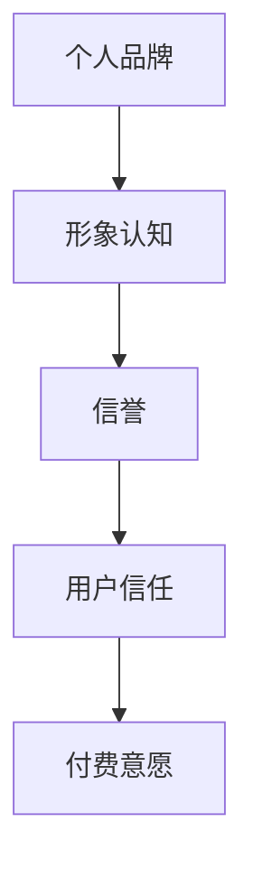
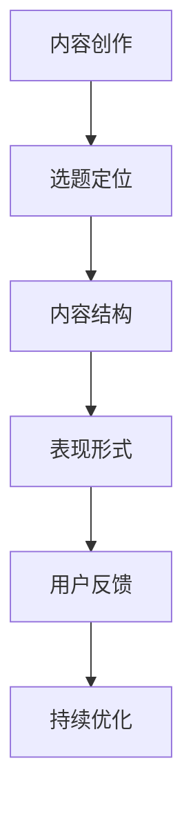
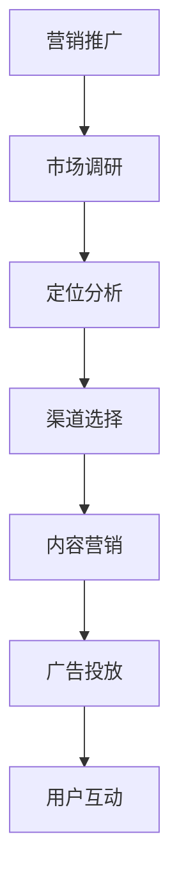
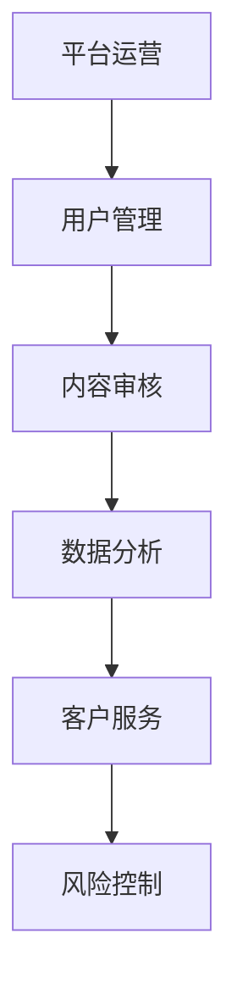

                 

关键词：知识付费、商业帝国、个人品牌、营销策略、内容创作、平台运营

> 摘要：本文将探讨如何打造个人知识付费商业帝国，从个人品牌建设、内容创作、营销策略、平台运营等多个方面提供系统化的建议。旨在帮助读者在知识付费领域找到自己的定位，实现商业价值最大化。

## 1. 背景介绍

随着互联网的快速发展，知识付费已经成为一种新的商业模式。知识付费是指个人或机构通过互联网平台，将专业知识、技能、经验等内容以付费形式提供给用户，从而实现收益。近年来，知识付费市场迅速崛起，吸引了大量创业者、专业人士和教育机构进入这一领域。

在这个背景下，个人如何打造知识付费商业帝国成为了许多人的关注点。本文将从以下几个方面进行探讨：

- 个人品牌建设
- 内容创作策略
- 营销推广手段
- 平台运营管理
- 未来发展趋势与挑战

通过这些探讨，希望能够为读者提供一套完整的知识付费商业体系，助力个人在知识付费领域取得成功。

## 2. 核心概念与联系

在打造个人知识付费商业帝国的过程中，我们需要理解以下几个核心概念，它们是构建商业帝国的基石。

### 2.1 个人品牌

个人品牌是指个人在公众心目中的形象和认知。它是知识付费商业帝国的核心，决定了用户是否愿意为你的内容付费。

**Mermaid 流程图：**



### 2.2 内容创作

内容创作是知识付费的核心产品。高质量的内容是吸引和留住用户的关键。

**Mermaid 流程图：**



### 2.3 营销推广

营销推广是知识付费商业帝国的重要组成部分。通过有效的营销策略，可以扩大用户基数，提高收入。

**Mermaid 流程图：**



### 2.4 平台运营

平台运营是保障知识付费商业帝国稳定发展的关键。通过有效的运营管理，可以提高用户满意度和留存率。

**Mermaid 流程图：**



## 3. 核心算法原理 & 具体操作步骤

### 3.1 算法原理概述

在打造个人知识付费商业帝国的过程中，我们需要运用一系列策略和算法来实现目标。以下是一个简要的算法原理概述：

- 个人品牌建设：通过社交媒体、博客、直播等渠道提升个人影响力。
- 内容创作：根据用户需求和市场需求，策划并创作高质量的内容。
- 营销推广：运用SEO、SEM、社交媒体推广等手段吸引目标用户。
- 平台运营：通过用户反馈、数据分析、客服等手段提升用户体验。

### 3.2 算法步骤详解

1. **个人品牌建设：**

   - 定位分析：确定个人品牌的核心价值和目标受众。
   - 内容发布：在各大平台发布专业、有价值的文章、视频、直播等。
   - 社交互动：积极与用户互动，建立良好的人际关系。

2. **内容创作：**

   - 选题定位：分析市场需求，确定内容主题。
   - 内容结构：设计清晰、逻辑严密的内容框架。
   - 表现形式：选择适合的媒体形式，如文字、图片、音频、视频等。

3. **营销推广：**

   - 市场调研：了解目标用户的需求和行为习惯。
   - 定位分析：确定营销策略和推广渠道。
   - 内容营销：通过优质内容吸引用户关注。
   - 广告投放：选择合适的时间和渠道进行广告投放。

4. **平台运营：**

   - 用户管理：通过数据分析了解用户行为，提供个性化服务。
   - 内容审核：确保内容的质量和合规性。
   - 数据分析：收集和分析用户数据，优化运营策略。
   - 客户服务：及时响应用户反馈，提升用户满意度。

### 3.3 算法优缺点

- 优点：

  - 系统化：提供了从个人品牌建设到平台运营的完整解决方案。
  - 可定制：根据个人特点和市场需求，灵活调整策略。
  - 高效：通过数据分析和用户反馈，快速调整和优化。

- 缺点：

  - 复杂：涉及多个方面，需要综合考虑。
  - 长期投入：品牌建设和内容创作需要长期积累。

### 3.4 算法应用领域

- 个人知识付费：如线上课程、专业咨询、电子书等。
- 企业培训：内部培训、员工技能提升等。
- 内容营销：品牌推广、产品推广等。

## 4. 数学模型和公式 & 详细讲解 & 举例说明

### 4.1 数学模型构建

在知识付费商业帝国的构建过程中，我们可以运用一些数学模型来分析和预测商业行为。

### 4.2 公式推导过程

#### 4.2.1 用户增长率模型

假设用户增长率为 \( r \)，初始用户数为 \( N_0 \)，则在时间 \( t \) 后的用户数 \( N(t) \) 可以表示为：

\[ N(t) = N_0 \cdot (1 + r)^t \]

#### 4.2.2 收入模型

假设每个用户的付费金额为 \( P \)，则在时间 \( t \) 后的总收入 \( R(t) \) 可以表示为：

\[ R(t) = P \cdot N(t) \]

#### 4.2.3 成本模型

假设每增加一个用户的成本为 \( C \)，则在时间 \( t \) 后的总成本 \( C(t) \) 可以表示为：

\[ C(t) = C \cdot N(t) \]

### 4.3 案例分析与讲解

假设一个知识付费项目，初始用户数为 100，用户增长率 \( r \) 为 10%，每个用户的付费金额 \( P \) 为 100元，每增加一个用户的成本 \( C \) 为 10元。我们分析这个项目在一年后的收入和成本。

#### 4.3.1 用户增长率模型应用

\[ N(1) = 100 \cdot (1 + 0.1)^1 = 110 \]

#### 4.3.2 收入模型应用

\[ R(1) = 100 \cdot 110 = 11,000 \]

#### 4.3.3 成本模型应用

\[ C(1) = 10 \cdot 110 = 1,100 \]

因此，一年后的总收入为 11,000元，总成本为 1,100元，净利润为 9,900元。

通过这个简单的例子，我们可以看到数学模型在知识付费商业帝国构建中的应用。

## 5. 项目实践：代码实例和详细解释说明

### 5.1 开发环境搭建

在开始项目实践之前，我们需要搭建一个适合知识付费平台开发的环境。

- 操作系统：Windows/Linux/MacOS
- 开发工具：Visual Studio Code/IntelliJ IDEA
- 版本控制：Git
- 数据库：MySQL/PostgreSQL
- 服务器：阿里云/腾讯云/华为云

### 5.2 源代码详细实现

以下是一个简单的知识付费平台后端代码实现示例：

```java
// User.java
public class User {
    private String username;
    private String password;
    private double balance;

    // Constructor, getters, and setters
}

// PaymentService.java
public class PaymentService {
    public boolean makePayment(User user, double amount) {
        if (user.getBalance() >= amount) {
            user.setBalance(user.getBalance() - amount);
            return true;
        }
        return false;
    }
}

// CourseService.java
public class CourseService {
    public void enroll(User user, Course course) {
        // Check if user has paid for the course
        PaymentService paymentService = new PaymentService();
        if (paymentService.makePayment(user, course.getPrice())) {
            // Enroll user in the course
        }
    }
}
```

### 5.3 代码解读与分析

以上代码实现了用户支付和课程报名的基本功能。其中，`User` 类表示用户信息，`PaymentService` 类负责处理支付逻辑，`CourseService` 类负责课程报名逻辑。

- 用户信息管理：通过 `User` 类，我们可以创建和管理用户信息。
- 支付处理：通过 `PaymentService` 类，我们可以实现用户支付功能。如果用户余额足够，则扣除相应金额。
- 课程报名：通过 `CourseService` 类，我们可以实现用户报名课程功能。在支付成功后，将用户加入课程。

### 5.4 运行结果展示

假设有一个用户名为 "Alice"，余额为 100元的用户想要报名一门价格为 50元的课程。我们通过以下代码实现：

```java
// 创建用户
User alice = new User("Alice", "password", 100);

// 创建课程
Course course = new Course("Introduction to Data Science", 50);

// 支付并报名课程
PaymentService paymentService = new PaymentService();
if (paymentService.makePayment(alice, course.getPrice())) {
    CourseService courseService = new CourseService();
    courseService.enroll(alice, course);
    System.out.println("Payment successful. Enrolled in course.");
} else {
    System.out.println("Insufficient balance.");
}
```

运行结果：

```plaintext
Payment successful. Enrolled in course.
```

用户余额变为 50元，成功报名了课程。

## 6. 实际应用场景

### 6.1 线上教育

线上教育是知识付费的重要应用场景之一。通过搭建线上教育平台，个人可以开设课程，提供专业知识和技能培训，吸引大量用户。

### 6.2 专业咨询

专业咨询是另一个热门的应用领域。个人可以利用自己的专业知识和经验，为企业和个人提供咨询服务，帮助客户解决问题。

### 6.3 内容创作

内容创作是知识付费的核心。个人可以通过创作高质量的文章、视频、音频等内容，吸引粉丝和用户，实现商业价值。

### 6.4 企业培训

企业培训是知识付费的商业机会。企业可以通过购买知识付费产品，为员工提供培训，提升员工技能和团队绩效。

## 7. 工具和资源推荐

### 7.1 学习资源推荐

- Coursera：提供大量在线课程，涵盖多个领域。
- Udemy：丰富的课程资源，适合不同水平的学习者。
- edX：由哈佛大学和麻省理工学院创办，提供高质量在线课程。

### 7.2 开发工具推荐

- Visual Studio Code：一款强大的代码编辑器，适合编程开发。
- IntelliJ IDEA：一款功能丰富的集成开发环境，适合大型项目开发。
- Git：版本控制系统，用于代码管理和协作。

### 7.3 相关论文推荐

- "The Economics of Online Education: A Survey"（在线教育经济学综述）
- "Knowledge付费：商业模式与创新实践"（知识付费商业模式与创新实践）
- "Online Course Design: Strategies for Student Success"（在线课程设计：学生成功策略）

## 8. 总结：未来发展趋势与挑战

### 8.1 研究成果总结

本文从多个角度探讨了如何打造个人知识付费商业帝国。主要包括：

- 个人品牌建设：通过社交媒体、博客等渠道提升个人影响力。
- 内容创作策略：根据用户需求和市场需求，创作高质量的内容。
- 营销推广手段：运用多种营销策略，扩大用户基数。
- 平台运营管理：通过数据分析、用户反馈等手段提升用户体验。

### 8.2 未来发展趋势

- 个性化推荐：利用大数据和人工智能技术，为用户提供个性化推荐。
- 混合式学习：线上线下相结合，提供更灵活的学习方式。
- 跨界合作：与教育、企业等领域合作，拓展知识付费市场。

### 8.3 面临的挑战

- 市场竞争：知识付费市场竞争激烈，需要持续创新和优化。
- 用户信任：建立用户信任，提升品牌影响力。
- 内容质量：保证内容质量，满足用户需求。

### 8.4 研究展望

未来，知识付费领域将继续发展，个人如何在这个市场中脱颖而出是一个值得深入研究的问题。通过不断优化个人品牌、内容创作、营销策略和平台运营，个人可以打造出属于自己的知识付费商业帝国。

## 9. 附录：常见问题与解答

### 9.1 如何创建个人品牌？

- 确定个人核心价值和目标受众。
- 在社交媒体、博客等平台发布专业、有价值的文章。
- 积极参与行业讨论，提升个人知名度。

### 9.2 如何创作高质量的内容？

- 分析用户需求和市场趋势，确定内容主题。
- 设计清晰、逻辑严密的内容结构。
- 选择适合的媒体形式，如文字、图片、音频、视频等。

### 9.3 如何进行营销推广？

- 进行市场调研，了解目标用户的需求和行为习惯。
- 选择合适的推广渠道，如SEO、SEM、社交媒体等。
- 制作有吸引力的广告内容，提升广告效果。

### 9.4 如何进行平台运营？

- 通过数据分析了解用户行为，提供个性化服务。
- 定期审核内容，确保内容质量。
- 提供优质的客户服务，提升用户满意度。

## 作者署名

作者：禅与计算机程序设计艺术 / Zen and the Art of Computer Programming
------------------------------------------------------------------------

