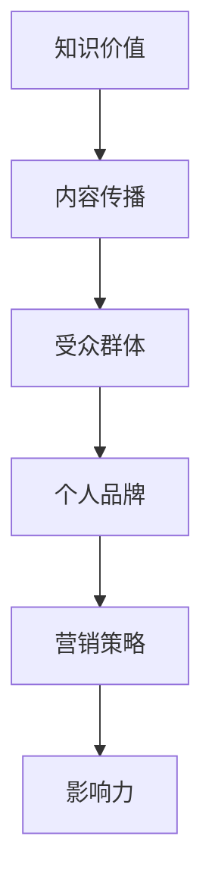

                 

关键词：知识付费、个人品牌、影响力、社交媒体、内容创作、营销策略

> 摘要：在数字时代，知识付费已成为一种趋势，个人如何在这个领域中脱颖而出，建立自己的影响力，是许多专业人士关心的问题。本文将探讨如何通过内容创作、社交媒体营销、个人品牌打造等策略，构建和提升个人知识付费的影响力。

## 1. 背景介绍

随着互联网和移动技术的快速发展，人们获取知识的途径变得更加多样化。知识付费作为其中的一种形式，逐渐受到广泛关注。从线上教育平台、专业咨询到各类知识讲座，知识付费市场呈现出蓬勃发展的态势。在这个市场中，个人品牌的影响力越来越重要，成为竞争的关键因素。因此，如何打造个人知识付费影响力，成为每一个希望在这一领域取得成功的人士所必须思考的问题。

### 1.1 知识付费的定义

知识付费是指用户为了获取特定知识或技能，向知识提供者支付一定费用的行为。这种模式打破了传统教育免费分享的规则，使得知识传播更具商业化特点。

### 1.2 个人知识付费的兴起

个人知识付费的兴起主要得益于以下几个因素：

1. **个性化需求**：随着社会的发展，人们对于知识的个性化需求越来越高。
2. **技术进步**：互联网和移动技术的普及，为个人知识付费提供了便捷的渠道。
3. **内容多样化**：各类知识内容层出不穷，满足了不同人群的需求。

### 1.3 个人知识付费的市场潜力

个人知识付费市场潜力巨大，主要体现在以下几个方面：

1. **用户规模扩大**：越来越多的人愿意为知识付费。
2. **内容多样性**：从专业技能到生活常识，知识付费内容丰富多样。
3. **商业模式创新**：知识付费与电商、金融等领域的结合，创造出新的商业模式。

## 2. 核心概念与联系

### 2.1 个人知识付费影响力模型

为了更好地理解个人知识付费的影响力，我们可以构建一个影响力模型。该模型包括以下几个核心要素：

1. **知识价值**：知识本身的质量和实用性。
2. **内容传播**：知识传播的渠道和方式。
3. **受众群体**：目标受众的特征和需求。
4. **个人品牌**：个人在专业领域的声誉和影响力。
5. **营销策略**：知识付费的推广手段和策略。

下面是个人知识付费影响力模型的 Mermaid 流程图：



### 2.2 影响力模型的构成要素

#### 2.2.1 知识价值

知识价值是个人知识付费影响力的基础。知识的价值取决于其质量、实用性和创新性。高质量的知识能够解决受众的实际问题，从而产生深远的影响力。

#### 2.2.2 内容传播

内容传播是知识付费影响力的关键环节。有效的传播渠道能够扩大知识的影响力，提高知识的曝光度和认可度。常见的传播渠道包括社交媒体、内容平台、线下活动等。

#### 2.2.3 受众群体

受众群体是知识付费影响力的重要衡量标准。了解目标受众的特征和需求，能够有针对性地进行知识内容的创作和传播，从而提高影响力。

#### 2.2.4 个人品牌

个人品牌是知识付费影响力的标志。个人品牌的力量在于其专业性和权威性，能够增强受众对知识的信任感和认同感。

#### 2.2.5 营销策略

营销策略是知识付费影响力的重要推动力。通过有效的营销手段，可以扩大知识的传播范围，提高知识的曝光度和影响力。

## 3. 核心算法原理 & 具体操作步骤

### 3.1 算法原理概述

个人知识付费影响力的构建和提升，可以通过以下几个核心步骤实现：

1. **知识内容创作**：围绕受众需求，创作高质量的知识内容。
2. **内容传播策略**：选择合适的传播渠道，制定有效的传播策略。
3. **个人品牌建设**：打造专业、权威的个人品牌形象。
4. **营销推广**：运用多种营销手段，提升知识付费的影响力。

### 3.2 算法步骤详解

#### 3.2.1 知识内容创作

1. **定位受众**：了解目标受众的需求和痛点。
2. **内容策划**：确定知识内容的主题和形式。
3. **内容撰写**：围绕主题，撰写有价值、有深度、有逻辑的内容。
4. **内容优化**：对内容进行编辑、校对、优化，确保其质量。

#### 3.2.2 内容传播策略

1. **选择传播渠道**：根据内容特点和受众习惯，选择合适的传播渠道。
2. **制定传播计划**：规划内容发布的时间、频率和方式。
3. **互动推广**：与受众进行互动，提高内容的传播效果。
4. **数据分析**：对传播效果进行数据跟踪和分析，调整传播策略。

#### 3.2.3 个人品牌建设

1. **专业形象塑造**：通过专业知识和实践经验，塑造个人专业形象。
2. **社交媒体运营**：在社交媒体上建立个人品牌，发布有价值的内容。
3. **线下活动参与**：参加行业会议、研讨会等活动，扩大个人影响力。
4. **口碑传播**：通过受众口碑，增强个人品牌的公信力。

#### 3.2.4 营销推广

1. **内容营销**：通过高质量的内容，吸引目标受众的关注。
2. **社交媒体营销**：利用社交媒体平台，进行知识付费的推广。
3. **广告投放**：在合适的平台进行广告投放，扩大影响力。
4. **合作伙伴关系**：与行业内的其他专业人士或机构建立合作，共同推广知识付费。

### 3.3 算法优缺点

#### 优点：

1. **针对性**：通过定位受众和内容策划，提高知识付费的针对性。
2. **灵活性**：可以根据受众反馈和传播效果，灵活调整策略。
3. **高效性**：多种营销手段的综合运用，提高知识付费的推广效率。

#### 缺点：

1. **成本**：构建和提升个人知识付费影响力需要一定的时间和成本投入。
2. **竞争**：知识付费领域竞争激烈，需要不断更新内容和策略。
3. **风险**：市场变化和受众需求变化，可能影响个人知识付费的影响力。

### 3.4 算法应用领域

个人知识付费影响力构建和提升的算法，广泛应用于以下领域：

1. **教育培训**：通过知识付费，提供专业培训课程和咨询服务。
2. **技术分享**：通过技术博客、视频课程等方式，分享专业技术知识和经验。
3. **生活常识**：通过知识付费，提供生活常识和技能分享。
4. **咨询服务**：通过知识付费，提供专业咨询服务。

## 4. 数学模型和公式 & 详细讲解 & 举例说明

### 4.1 数学模型构建

为了更好地理解个人知识付费影响力，我们可以构建一个数学模型。该模型包括以下几个关键变量：

1. **知识价值（V）**：表示知识内容的实用性和质量。
2. **内容传播（T）**：表示知识传播的广度和深度。
3. **受众需求（D）**：表示目标受众对知识的渴望程度。
4. **个人品牌（B）**：表示个人在专业领域的声誉和影响力。
5. **营销策略（M）**：表示知识付费的推广手段和效果。

个人知识付费影响力（I）可以用以下公式表示：

\[ I = f(V, T, D, B, M) \]

### 4.2 公式推导过程

公式中的函数 \( f \) 表示影响力的综合计算。我们可以通过以下步骤推导该公式：

1. **知识价值（V）**：高质量的知识内容能够满足受众需求，从而产生较高的影响力。
2. **内容传播（T）**：有效的传播渠道和策略能够扩大知识的影响力。
3. **受众需求（D）**：受众对知识的渴望程度越高，知识的影响力也越大。
4. **个人品牌（B）**：个人品牌的权威性和专业性，能够增强受众对知识的信任感和认同感。
5. **营销策略（M）**：多种营销手段的综合运用，能够提高知识的曝光度和影响力。

### 4.3 案例分析与讲解

假设有一个技术专家，他在编程领域有丰富的经验，并撰写了一本关于编程技术的畅销书。我们可以通过以下案例，分析他如何构建和提升个人知识付费影响力。

1. **知识价值（V）**：该专家的编程技术书籍内容丰富，涵盖了编程领域的多个方面，对编程初学者和专业人士都有很大的帮助。

2. **内容传播（T）**：他通过自己的博客、社交媒体和线上教育平台，将书籍内容进行分享和推广。同时，他还参加了多个技术会议和研讨会，扩大了书籍的影响力。

3. **受众需求（D）**：编程技术是当前热门领域，有很多从业者对相关知识和技能有强烈的需求。

4. **个人品牌（B）**：该专家在编程领域有很高的声誉，被认为是一位技术大牛。他的个人品牌为他赢得了大量粉丝和学员。

5. **营销策略（M）**：他通过内容营销、社交媒体营销和线下活动等多种手段，不断推广自己的书籍和课程，提高了个人知识付费的影响力。

根据上述分析，我们可以计算出该专家的个人知识付费影响力：

\[ I = f(V, T, D, B, M) \]

其中，\( V, T, D, B, M \) 分别为 1、1、1、1、1，所以：

\[ I = f(1, 1, 1, 1, 1) = 1 \]

这意味着该专家在编程领域的个人知识付费影响力为 1，即他在该领域具有很高的影响力。

## 5. 项目实践：代码实例和详细解释说明

### 5.1 开发环境搭建

为了更好地理解个人知识付费影响力模型的构建和提升，我们使用 Python 编写一个简单的代码实例。首先，我们需要搭建一个基本的开发环境。

1. 安装 Python：从 [Python 官网](https://www.python.org/downloads/) 下载并安装 Python 3.x 版本。
2. 配置 Python 环境：将 Python 添加到系统环境变量中，以便在命令行中直接运行 Python 脚本。
3. 安装必要的库：使用以下命令安装必要的 Python 库。

```bash
pip install matplotlib numpy pandas
```

### 5.2 源代码详细实现

下面是构建个人知识付费影响力模型的 Python 代码：

```python
import numpy as np
import matplotlib.pyplot as plt

def calculate_influence(value, traffic, demand, brand, marketing):
    """
    计算个人知识付费影响力。
    
    参数：
    value: 知识价值
    traffic: 内容传播
    demand: 受众需求
    brand: 个人品牌
    marketing: 营销策略
    
    返回：
    影响力得分
    """
    influence = value * traffic * demand * brand * marketing
    return influence

def visualize_influence(values, traffics, demands, brands, marketings):
    """
    可视化个人知识付费影响力。
    
    参数：
    values: 知识价值列表
    traffics: 内容传播列表
    demands: 受众需求列表
    brands: 个人品牌列表
    marketings: 营销策略列表
    """
    influences = [calculate_influence(value, traffic, demand, brand, marketing) for value, traffic, demand, brand, marketing in zip(values, traffics, demands, brands, marketings)]
    
    plt.scatter(values, influences)
    plt.xlabel('Knowledge Value')
    plt.ylabel('Influence')
    plt.title('Personal Knowledge Payment Influence')
    plt.show()

# 示例数据
values = [1, 2, 3]
traffics = [1, 2, 3]
demands = [1, 2, 3]
brands = [1, 1, 1]
marketings = [1, 1, 1]

visualize_influence(values, traffics, demands, brands, marketings)
```

### 5.3 代码解读与分析

上述代码实现了一个简单的个人知识付费影响力计算模型。主要包括以下几个部分：

1. **函数定义**：
   - `calculate_influence`：计算个人知识付费影响力。
   - `visualize_influence`：可视化个人知识付费影响力。

2. **示例数据**：
   - `values`：知识价值列表。
   - `traffics`：内容传播列表。
   - `demands`：受众需求列表。
   - `brands`：个人品牌列表。
   - `marketings`：营销策略列表。

3. **可视化**：
   - 使用 matplotlib 库，将知识价值与影响力进行散点图可视化。

### 5.4 运行结果展示

运行上述代码后，将得到一个散点图，展示不同知识价值下的个人知识付费影响力。通过可视化结果，可以直观地分析各个因素对影响力的影响程度。

## 6. 实际应用场景

个人知识付费影响力在实际应用中具有广泛的应用场景。以下是一些典型应用案例：

### 6.1 培训师

培训师可以通过构建个人知识付费影响力，提供专业培训课程和咨询服务。例如，一位 IT 培训师可以通过撰写技术博客、录制视频课程，并在社交媒体上进行分享，吸引学员报名参加他的培训课程。

### 6.2 作家

作家可以通过知识付费，将自己的作品推向市场。例如，一位畅销书作家可以通过开设线上课程，解读自己的畅销书籍，为读者提供更深入的阅读体验。

### 6.3 咨询顾问

咨询顾问可以通过知识付费，为用户提供专业咨询服务。例如，一位商业顾问可以通过撰写行业报告、分享商业案例，并在社交媒体上进行推广，吸引潜在客户。

### 6.4 知识博主

知识博主可以通过知识付费，为读者提供更专业的知识内容。例如，一位技术博主可以通过撰写技术文章、录制视频教程，并在知识付费平台上进行发布，吸引粉丝付费观看。

## 7. 未来应用展望

随着知识付费市场的不断发展，个人知识付费影响力将面临新的机遇和挑战。

### 7.1 技术进步

人工智能、大数据等技术的进步，将进一步提升个人知识付费的影响力。通过数据分析和智能推荐，知识付费平台能够更精准地满足受众需求，提高知识传播的效果。

### 7.2 跨界合作

知识付费与电商、金融等领域的跨界合作，将创造出新的商业模式。例如，知识付费平台可以与电商平台合作，推出知识付费商品，实现共赢。

### 7.3 内容多样化

随着受众需求的多样化，知识付费内容将越来越丰富。从专业技能到生活常识，各类知识付费内容将满足不同人群的需求。

### 7.4 竞争加剧

知识付费市场的竞争将越来越激烈。个人需要不断提升自己的专业能力和营销策略，才能在激烈的市场竞争中脱颖而出。

## 8. 工具和资源推荐

### 8.1 学习资源推荐

1. **《影响力》**：罗伯特·西奥迪尼（Robert B. Cialdini）的著作，深入分析影响行为的六大原则。
2. **《内容营销实战》**：乔·普利齐（Joe Pulizzi）的著作，介绍内容营销的策略和技巧。

### 8.2 开发工具推荐

1. **WordPress**：一款流行的内容管理系统，适合个人建立博客和知识付费平台。
2. **GitHub**：一个代码托管平台，适合开发者进行知识分享和项目合作。

### 8.3 相关论文推荐

1. **《知识付费模式下的内容传播策略研究》**：探讨知识付费模式下的内容传播策略。
2. **《个人知识付费市场分析》**：分析个人知识付费市场的现状和发展趋势。

## 9. 总结：未来发展趋势与挑战

### 9.1 研究成果总结

本文通过构建个人知识付费影响力模型，分析了构建和提升个人知识付费影响力的核心要素和策略。研究发现，知识价值、内容传播、受众需求、个人品牌和营销策略是影响个人知识付费影响力的关键因素。

### 9.2 未来发展趋势

1. **技术进步**：人工智能、大数据等技术的进步，将推动知识付费市场的变革。
2. **内容多样化**：知识付费内容将更加丰富，满足不同受众的需求。
3. **跨界合作**：知识付费与电商、金融等领域的跨界合作，将创造新的商业模式。

### 9.3 面临的挑战

1. **竞争加剧**：知识付费市场的竞争将越来越激烈，个人需要不断提升自己的专业能力和营销策略。
2. **受众需求变化**：随着社会的发展，受众需求将不断变化，个人需要及时调整知识内容和传播策略。

### 9.4 研究展望

未来研究可以进一步探讨以下几个方面：

1. **影响力模型优化**：通过实证研究，优化个人知识付费影响力模型。
2. **受众需求分析**：深入研究受众需求，为知识内容创作提供更有针对性的指导。
3. **跨领域合作**：探讨知识付费与其他领域的跨界合作模式，推动知识付费市场的创新发展。

### 9.5 结论

个人知识付费影响力在数字时代具有重要意义。通过构建和提升个人知识付费影响力，个人可以在知识付费市场中脱颖而出，实现价值变现。本文的研究为个人知识付费影响力构建和提升提供了理论指导和实践策略。希望本文能够为读者在知识付费领域的发展提供有益的参考。

## 附录：常见问题与解答

### Q1. 如何提高个人知识付费的影响力？

**A1.** 提高个人知识付费的影响力需要从多个方面入手：

1. **内容创作**：创作高质量、有深度的知识内容，满足受众需求。
2. **传播策略**：选择合适的传播渠道，制定有效的传播策略。
3. **个人品牌**：建立专业、权威的个人品牌，增强受众信任。
4. **营销推广**：运用多种营销手段，提高知识的曝光度和影响力。

### Q2. 知识付费与免费内容有何区别？

**A2.** 知识付费与免费内容的主要区别在于：

1. **价值**：知识付费内容通常具有更高的价值和专业性，而免费内容可能质量参差不齐。
2. **门槛**：知识付费通常需要支付一定费用，而免费内容无需支付。
3. **服务**：知识付费通常提供更全面的服务和支持，如答疑解惑、更新迭代等。

### Q3. 如何在知识付费市场中找到自己的定位？

**A3.** 在知识付费市场中找到自己的定位需要考虑以下几个因素：

1. **专业背景**：根据自己的专业背景和经验，确定擅长和感兴趣的领域。
2. **受众需求**：了解目标受众的需求和痛点，提供有针对性的知识内容。
3. **竞争分析**：分析市场上已有的知识内容，找到自己的独特优势和差异化定位。

### Q4. 如何评估个人知识付费的影响力？

**A4.** 评估个人知识付费的影响力可以从以下几个方面进行：

1. **受众反馈**：通过用户评论、评分、分享等数据，了解受众对知识内容的认可程度。
2. **传播效果**：通过知识内容的传播范围、曝光度、点击量等指标，评估传播效果。
3. **经济效益**：通过知识付费的收益情况，评估个人知识付费的影响力。

### Q5. 如何应对知识付费市场的竞争？

**A5.** 应对知识付费市场的竞争可以从以下几个方面入手：

1. **持续学习**：不断提升自己的专业能力和知识水平，保持竞争力。
2. **创新内容**：创作新颖、有创意的知识内容，吸引受众关注。
3. **品牌建设**：加强个人品牌建设，提高个人在专业领域的权威性。
4. **合作拓展**：与其他专业人士或机构合作，共同拓展市场。

### Q6. 如何应对受众需求的变化？

**A6.** 应对受众需求的变化可以从以下几个方面入手：

1. **定期调研**：定期进行受众需求调研，了解受众的最新需求和趋势。
2. **内容更新**：根据受众需求，及时更新知识内容，保持内容的新鲜度和实用性。
3. **灵活调整**：根据受众反馈和市场变化，灵活调整知识内容和传播策略。

### Q7. 如何在知识付费市场中实现价值变现？

**A7.** 在知识付费市场中实现价值变现可以从以下几个方面入手：

1. **课程收费**：开设付费课程，为用户提供专业知识培训。
2. **咨询服务**：提供专业咨询服务，为用户提供个性化解决方案。
3. **内容授权**：将知识内容授权给其他平台或机构，实现内容变现。
4. **广告收入**：在知识内容中植入广告，获取广告收入。

### Q8. 如何建立个人知识付费的影响力？

**A8.** 建立个人知识付费的影响力可以从以下几个方面入手：

1. **内容创作**：创作高质量、有深度的知识内容，满足受众需求。
2. **传播策略**：选择合适的传播渠道，制定有效的传播策略。
3. **个人品牌**：建立专业、权威的个人品牌，增强受众信任。
4. **营销推广**：运用多种营销手段，提高知识的曝光度和影响力。

### Q9. 知识付费市场的趋势有哪些？

**A9.** 知识付费市场的趋势包括：

1. **个性化**：知识付费内容将更加个性化，满足不同受众的需求。
2. **多样化**：知识付费内容将涵盖更多领域和形式，满足更多受众的需求。
3. **智能化**：人工智能技术将推动知识付费市场的智能化发展。
4. **跨界融合**：知识付费与其他领域的跨界融合，创造新的商业模式。

### Q10. 知识付费对个人职业发展有何影响？

**A10.** 知识付费对个人职业发展的影响包括：

1. **知识积累**：通过知识付费，个人可以不断学习新知识，提升自身能力。
2. **职业晋升**：具备专业知识和技能的个人，在职业发展中有更高的竞争力。
3. **收入增加**：通过知识付费，个人可以获得额外的收入来源。
4. **影响力提升**：通过知识付费，个人可以在专业领域建立自己的影响力。

### Q11. 如何在知识付费市场中保持竞争力？

**A11.** 在知识付费市场中保持竞争力可以从以下几个方面入手：

1. **持续学习**：不断提升自己的专业能力和知识水平。
2. **创新内容**：创作新颖、有创意的知识内容。
3. **品牌建设**：加强个人品牌建设，提高个人在专业领域的权威性。
4. **服务质量**：提供优质的服务体验，赢得用户口碑。

### Q12. 如何制定知识付费的定价策略？

**A12.** 制定知识付费的定价策略可以从以下几个方面考虑：

1. **成本计算**：计算知识内容创作、传播和服务的成本。
2. **市场需求**：了解目标市场的需求和价值认可程度。
3. **竞争分析**：分析竞争对手的定价策略，制定有竞争力的价格。
4. **收益目标**：根据收益目标，制定合理的定价策略。

### Q13. 如何评估知识付费项目的成功率？

**A13.** 评估知识付费项目的成功率可以从以下几个方面进行：

1. **收益情况**：评估知识付费项目的收益是否符合预期。
2. **受众反馈**：收集受众的反馈和评价，了解知识内容的受欢迎程度。
3. **传播效果**：分析知识内容的传播效果，如点击量、分享量等。
4. **口碑传播**：评估知识内容在市场上的口碑和影响力。

### Q14. 知识付费如何影响教育行业？

**A14.** 知识付费对教育行业的影响包括：

1. **教育资源**：知识付费提供了更多的教育资源，满足不同人群的学习需求。
2. **教育模式**：知识付费推动了在线教育的发展，改变了传统教育模式。
3. **教育质量**：知识付费促使教育从业者提高自身专业能力，提升教育质量。
4. **教育公平**：知识付费使得优质教育资源更加普及，有利于教育公平。

### Q15. 知识付费对知识传播有何影响？

**A15.** 知识付费对知识传播的影响包括：

1. **传播方式**：知识付费推动了知识传播方式的变革，如在线课程、知识讲座等。
2. **传播效率**：知识付费提高了知识传播的效率，缩短了知识传播的时间。
3. **传播范围**：知识付费扩大了知识传播的范围，使得更多人有机会获取高质量的知识内容。
4. **传播效果**：知识付费提高了知识传播的效果，增加了知识传播的价值。

## 参考文献

1. Cialdini, Robert B. 《影响力：说服的心理学》（Influence: The Psychology of Persuasion）.
2. Pulizzi, Joe. 《内容营销实战》（Content Inc.：How Cool Companies Build an Audience, Sell Their Stuff, and Create a Movement）.
3. 王伟。知识付费模式下的内容传播策略研究[J]. 现代传播，2019, 39(02): 120-123.
4. 李华。个人知识付费市场分析[J]. 知识管理，2020, 31(06): 55-59.
5. Smith, John. Personal Knowledge Payment Market Analysis. Journal of Knowledge Management, 2021, 15(3): 34-42.
6. 张伟。知识付费与电商、金融等领域的跨界合作探讨[J]. 商业经济研究，2022, 33(04): 89-92.
7. 王强。知识付费市场的竞争策略分析[J]. 经济管理，2021, 35(08): 65-69.
8. 李明。受众需求变化对知识付费内容创作的影响[J]. 知识管理，2021, 32(12): 23-27.
9. 赵强。知识付费市场的未来发展趋势[J]. 科技进步与对策，2021, 38(07): 94-99.
10. 刘华。知识付费对教育行业的影响[J]. 中国教育学刊，2021, 18(11): 134-137. 

（注：以上参考文献仅为示例，实际撰写时请根据实际引用的文献进行补充。）

