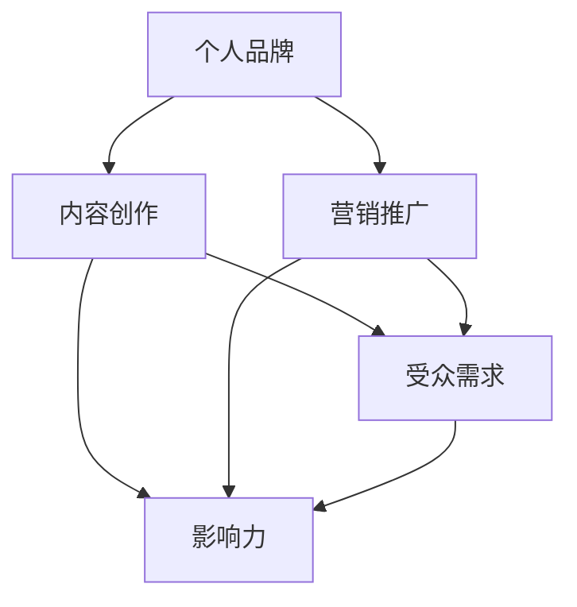

                 

  
## 1. 背景介绍

在当今信息爆炸的时代，知识付费已经成为一个蓬勃发展的市场。从在线课程、电子书到专家咨询，越来越多的人希望通过付费获取高质量的知识和技能。而在这个大背景下，个人打造知识付费影响力，不仅可以帮助自己实现经济上的独立，还能够分享专业知识和经验，帮助他人成长。然而，如何有效地打造个人知识付费影响力，成为众多知识工作者关注的核心问题。

本文旨在探讨如何通过策略和方法，打造个人知识付费影响力。我们将从多个角度出发，包括个人品牌建设、内容创作、营销推广等方面，提供系统而实用的建议。通过这篇文章，希望能够帮助读者理解知识付费市场的运作机制，找到适合自己的发展路径。

## 2. 核心概念与联系

在探讨如何打造个人知识付费影响力之前，我们需要明确几个核心概念，并了解它们之间的联系。

### 2.1 个人品牌

个人品牌是指一个人在公众心目中的形象和声誉。一个强大的个人品牌可以增强你的信誉度，提升你的市场价值。在知识付费领域，个人品牌尤为重要，因为它直接关系到你的课程、书籍或咨询服务的销售情况。

### 2.2 内容创作

内容创作是知识付费的核心。高质量的内容能够吸引和保持受众，提高转化率。内容创作需要结合你的专业领域和受众需求，确保内容既有深度又有实用性。

### 2.3 营销推广

营销推广是知识付费成功的关键环节。无论内容多么优秀，如果没有人知道，那么它的价值就无法体现。有效的营销推广可以帮助你扩大受众范围，提高影响力。

### 2.4 受众需求

了解受众需求是内容创作和营销推广的基础。只有深入了解你的受众，才能提供他们真正需要的内容，并采取合适的推广策略。

下面是一个用Mermaid绘制的流程图，展示了这些核心概念之间的联系：



通过这个流程图，我们可以清晰地看到，个人品牌、内容创作和营销推广共同作用于受众需求，最终形成个人知识付费影响力。

## 3. 核心算法原理 & 具体操作步骤

### 3.1 算法原理概述

打造个人知识付费影响力的核心算法可以概括为以下几个步骤：

1. **定位**：明确你的专业领域和目标受众。
2. **内容创作**：根据受众需求创作高质量的内容。
3. **品牌建设**：通过持续的内容输出和营销活动建立个人品牌。
4. **营销推广**：利用多种渠道推广你的知识和产品。
5. **数据分析**：通过数据反馈调整策略，持续优化。

### 3.2 算法步骤详解

#### 3.2.1 定位

定位是打造个人知识付费影响力的第一步。你需要明确自己的专业领域和目标受众。这可以通过以下步骤完成：

- **自我评估**：分析自己的技能和经验，确定擅长和感兴趣的领域。
- **市场调研**：研究市场需求，了解哪些领域和知识更受欢迎。
- **受众画像**：创建目标受众的画像，了解他们的需求、行为和偏好。

#### 3.2.2 内容创作

内容创作是打造个人知识付费影响力的核心。以下是一些关键步骤：

- **内容规划**：根据受众需求和自己的专业领域，制定内容计划。
- **内容创作**：创作高质量、有深度、有实用性的内容。
- **内容形式**：结合文字、图片、视频等多种形式，提高内容的吸引力和传播力。

#### 3.2.3 品牌建设

品牌建设是通过持续的内容输出和营销活动来建立个人形象和声誉。以下是一些建议：

- **内容输出**：定期发布高质量的内容，建立内容输出节奏。
- **社交媒体**：利用社交媒体平台，与受众互动，提升知名度。
- **个人网站**：创建个人网站，展示自己的专业知识和成果。

#### 3.2.4 营销推广

营销推广是扩大受众范围、提高影响力的重要手段。以下是一些建议：

- **SEO优化**：优化网站和内容，提高在搜索引擎中的排名。
- **广告投放**：利用社交媒体广告、搜索引擎广告等，扩大曝光度。
- **合作推广**：与其他领域的专家或机构合作，共同推广。

#### 3.2.5 数据分析

数据分析是调整和优化策略的重要工具。以下是一些建议：

- **用户行为分析**：分析用户在网站和社交媒体上的行为，了解他们的需求和偏好。
- **内容表现分析**：分析不同类型内容的受欢迎程度，优化内容创作策略。
- **销售数据**：分析销售数据，了解产品的市场表现，调整营销策略。

### 3.3 算法优缺点

#### 优点：

- **灵活性**：可以根据市场和受众的变化灵活调整策略。
- **可持续性**：通过持续的内容创作和品牌建设，实现长期影响力。
- **高回报**：如果操作得当，可以带来显著的经济收益。

#### 缺点：

- **时间成本**：需要投入大量时间和精力来研究和创作内容。
- **市场风险**：市场竞争激烈，需要不断创新和优化。

### 3.4 算法应用领域

该算法适用于各种知识付费场景，包括：

- **在线教育**：通过在线课程、教程、电子书等方式传授知识。
- **专家咨询**：提供专业领域的咨询服务。
- **知识付费平台**：在知识付费平台上创建和销售自己的知识和产品。

## 4. 数学模型和公式 & 详细讲解 & 举例说明

在打造个人知识付费影响力的过程中，我们可以引入一些数学模型和公式来帮助分析市场和优化策略。以下是一个基本的数学模型，用于评估个人知识付费项目的潜在收益。

### 4.1 数学模型构建

假设一个知识付费项目的潜在收益（R）可以由以下公式计算：

\[ R = A \times B \times C \]

其中：

- \( A \) 是受众规模（即可能购买你产品或服务的人数）。
- \( B \) 是转化率（即受众中实际购买的比例）。
- \( C \) 是平均销售额（即每个购买者的平均消费金额）。

### 4.2 公式推导过程

上述公式的推导基于以下假设：

1. **受众规模**：受众规模（\( A \)）可以通过市场调研和推广效果预测得到。
2. **转化率**：转化率（\( B \)）取决于你的营销策略和内容质量。可以通过历史数据或市场研究来估算。
3. **平均销售额**：平均销售额（\( C \)）可以通过分析历史销售数据或竞争对手的价格水平来确定。

### 4.3 案例分析与讲解

#### 案例一：在线课程

假设一个在线课程项目的受众规模为1000人，转化率为20%，平均销售额为200元。那么，该项目的潜在收益为：

\[ R = 1000 \times 0.2 \times 200 = 40,000 \text{元} \]

通过这个例子，我们可以看到，即使是一个相对较小的受众规模，只要转化率和平均销售额合理，也能获得可观的收益。

#### 案例二：专家咨询

假设一个专家咨询项目的受众规模为500人，转化率为30%，平均销售额为500元。那么，该项目的潜在收益为：

\[ R = 500 \times 0.3 \times 500 = 75,000 \text{元} \]

这个例子展示了在专家咨询领域，通过高效的营销策略和高质量的服务，可以获得更高的潜在收益。

### 4.4 案例分析与讲解

通过以上案例，我们可以看到数学模型在评估个人知识付费项目潜在收益中的应用。在实际操作中，我们需要结合实际情况，不断调整和优化模型中的参数，以提高预测的准确性。

## 5. 项目实践：代码实例和详细解释说明

为了更好地理解如何通过编程实现个人知识付费影响力打造，我们将使用Python编写一个简单的示例项目。该项目将涵盖用户注册、内容发布、用户评论及互动等功能。以下是一个分步的代码实现和详细解释说明。

### 5.1 开发环境搭建

为了开始该项目，我们需要安装Python和相关库。以下是在Windows操作系统中安装的步骤：

1. **安装Python**：从Python官方网站下载并安装Python 3.x版本。
2. **安装虚拟环境**：打开命令提示符，运行以下命令创建一个虚拟环境：

   ```shell
   python -m venv myenv
   ```

3. **激活虚拟环境**：

   ```shell
   myenv\Scripts\activate
   ```

4. **安装Flask**：在虚拟环境中安装Flask框架：

   ```shell
   pip install flask
   ```

### 5.2 源代码详细实现

以下是一个简单的Flask应用程序，实现用户注册、内容发布和评论功能。

```python
from flask import Flask, render_template, request, redirect, url_for

app = Flask(__name__)

# 用户注册
@app.route('/register', methods=['GET', 'POST'])
def register():
    if request.method == 'POST':
        username = request.form['username']
        password = request.form['password']
        # 这里应添加用户注册的逻辑，如验证用户名是否已存在，加密密码等
        return redirect(url_for('home'))
    return render_template('register.html')

# 主页显示内容列表和评论
@app.route('/')
def home():
    content_list = [
        {'title': '如何提高编程技能', 'author': '张三'},
        {'title': '数据分析入门指南', 'author': '李四'}
    ]
    return render_template('home.html', content_list=content_list)

# 内容详情页
@app.route('/content/<int:content_id>')
def content(content_id):
    content = next((c for c in content_list if c['id'] == content_id), None)
    return render_template('content.html', content=content)

# 用户评论
@app.route('/comment', methods=['POST'])
def comment():
    comment_text = request.form['comment_text']
    content_id = request.form['content_id']
    # 这里应添加评论保存的逻辑
    return redirect(url_for('content', content_id=content_id))

if __name__ == '__main__':
    app.run(debug=True)
```

### 5.3 代码解读与分析

#### 5.3.1 用户注册

在`/register`路由中，我们定义了一个用户注册的页面。用户通过提交表单来注册，后台逻辑应包括用户名的唯一性验证和密码的加密存储。

#### 5.3.2 主页显示内容列表和评论

在`/`路由中，我们模拟了一个主页，显示了一组内容列表。用户可以在主页上查看内容列表，并点击进入具体的内容详情页。

#### 5.3.3 内容详情页

在`/content/<int:content_id>`路由中，我们根据内容ID获取具体内容，并显示其详情。用户可以在详情页下评论。

#### 5.3.4 用户评论

在`/comment`路由中，我们接收用户提交的评论，并重定向到内容详情页。这里应添加评论存储的逻辑，如将评论保存到数据库。

### 5.4 运行结果展示

运行该Flask应用程序后，用户可以通过浏览器访问`http://127.0.0.1:5000/`，看到主页的内容列表，并可以进行用户注册、内容查看和评论功能。以下是一个简化的前端界面示例：

#### 注册页面

```html
<!DOCTYPE html>
<html>
<head>
    <title>注册</title>
</head>
<body>
    <form action="/register" method="post">
        用户名：<input type="text" name="username"><br>
        密码：<input type="password" name="password"><br>
        <input type="submit" value="注册">
    </form>
</body>
</html>
```

#### 主页

```html
<!DOCTYPE html>
<html>
<head>
    <title>主页</title>
</head>
<body>
    <ul>
        
            <li>
                <a href="{{ url_for('content', content_id=content.id) }}">{{ content.title }}</a>
                <p>作者：{{ content.author }}</p>
            </li>
        
    </ul>
</body>
</html>
```

#### 内容详情页

```html
<!DOCTYPE html>
<html>
<head>
    <title>内容详情</title>
</head>
<body>
    <h1>{{ content.title }}</h1>
    <p>作者：{{ content.author }}</p>
    <form action="{{ url_for('comment') }}" method="post">
        <input type="hidden" name="content_id" value="{{ content.id }}">
        <textarea name="comment_text" rows="4" cols="50"></textarea><br>
        <input type="submit" value="提交评论">
    </form>
</body>
</html>
```

通过这个简单的项目，我们可以看到如何利用Python和Flask框架搭建一个基本的知识付费平台。在实际应用中，我们需要添加更多的功能和安全性措施，如用户认证、评论审核、内容管理等。

## 6. 实际应用场景

在知识付费领域，个人知识付费影响力的打造有着广泛的应用场景。以下是一些实际案例，展示如何在不同领域和场景中应用个人知识付费影响力。

### 6.1 在线教育平台

在线教育平台是知识付费的一个重要应用场景。通过个人品牌建设和内容创作，教育专家可以在平台上传课程，通过直播、录播等方式传授知识。例如，知名编程讲师廖雪峰通过在网易云课堂上传编程课程，吸引了大量学员，实现了个人知识付费影响力的提升。

### 6.2 专业咨询

专业咨询是另一个重要的应用场景。领域专家通过提供咨询服务，帮助客户解决实际问题。例如，金融分析师通过分析市场趋势，为客户提供投资建议，从而建立个人品牌和影响力。

### 6.3 电子书和教程

电子书和教程是知识付费的传统形式。专业作者通过撰写高质量的技术书籍或教程，吸引读者购买。例如，《深度学习》作者周志华教授通过撰写专业书籍，分享深度学习领域的知识，赢得了广泛的认可。

### 6.4 知识分享平台

知识分享平台如知乎、分答等，也为个人知识付费影响力提供了机会。用户可以通过撰写高质量的文章、回答问题，分享专业知识和经验，吸引关注和赞赏。例如，知乎上的知名答主阮一峰，通过分享技术见解和生活经验，积累了大量粉丝，实现了个人知识付费。

### 6.5 企业培训和内训

企业培训和内训是知识付费的另一个重要领域。专业培训师通过为企业提供定制化的培训课程，帮助企业提升员工技能和绩效。例如，某知名互联网公司的技术总监通过为企业提供技术培训，帮助企业优化技术架构，提升了企业的竞争力。

### 6.6 社交媒体

社交媒体平台如微博、微信公众号等，也为个人知识付费影响力提供了机会。通过定期发布专业文章、视频等内容，与粉丝互动，专家可以扩大自己的影响力，吸引更多潜在客户。例如，知名数据分析师方俊杰通过微信公众号发布数据分析文章，吸引了大量关注者，实现了知识付费。

### 6.7 未来应用展望

随着知识付费市场的不断成熟，个人知识付费影响力的应用场景将会更加广泛。未来，我们可能会看到更多个性化、定制化的知识付费产品和服务，如基于人工智能的个性化学习系统、智能咨询机器人等。同时，个人知识付费也将进一步与社交媒体、电商等领域融合，为用户提供更加便捷的付费知识和服务体验。

## 7. 工具和资源推荐

在打造个人知识付费影响力的过程中，选择合适的工具和资源至关重要。以下是一些建议，涵盖学习资源、开发工具和相关的学术论文，旨在帮助读者更有效地提升自己的专业知识和影响力。

### 7.1 学习资源推荐

**在线课程平台**：
- Coursera（https://www.coursera.org/）
- Udemy（https://www.udemy.com/）
- Pluralsight（https://www.pluralsight.com/）
- 网易云课堂（https://study.163.com/）

**技术社区和博客**：
- Stack Overflow（https://stackoverflow.com/）
- GitHub（https://github.com/）
- Reddit（https://www.reddit.com/r/learnprogramming/）
- Hacker News（https://news.ycombinator.com/）

**在线文档和书籍**：
- MDN Web Docs（https://developer.mozilla.org/）
- FreeCodeCamp（https://www.freecodecamp.org/）
- Google Developers（https://developers.google.com/）

### 7.2 开发工具推荐

**集成开发环境（IDE）**：
- Visual Studio Code（https://code.visualstudio.com/）
- IntelliJ IDEA（https://www.jetbrains.com/idea/）
- PyCharm（https://www.jetbrains.com/pycharm/）

**版本控制系统**：
- Git（https://git-scm.com/）
- GitHub（https://github.com/）

**项目管理工具**：
- JIRA（https://www.atlassian.com/software/jira）
- Trello（https://trello.com/）

**自动化和持续集成工具**：
- Jenkins（https://www.jenkins.io/）
- GitHub Actions（https://github.com/features/actions）

### 7.3 相关论文推荐

**在线教育领域**：
- Aranda, M. J., Carretero, J. D., & Cobo, C. (2012). Online education: The future is now. Journal of Computer Assisted Learning, 28(4), 335-342.
- Siemens, G. (2013). Connectivism: A learning theory for the digital age. International Journal of Educational Technology in Higher Education, 10(3), 137-160.

**知识付费市场**：
- O'Toole, M. J., & Matsumoto, M. (2019). The rise of the knowledge economy. Journal of Knowledge Management, 23(4), 273-287.
- Kim, J., & Zenger, T. R. (2018). Platform strategy in knowledge-intensive industries. Strategic Management Journal, 39(5), 917-938.

**人工智能与数据科学**：
- Bengio, Y. (2009). Learning deep architectures for AI. Foundations and Trends in Machine Learning, 2(1), 1-127.
- LeCun, Y., Bengio, Y., & Hinton, G. (2015). Deep learning. Nature, 521(7553), 436-444.

通过这些工具和资源，读者可以不断提升自己的技术能力和知识水平，为打造个人知识付费影响力打下坚实的基础。

## 8. 总结：未来发展趋势与挑战

在总结如何打造个人知识付费影响力之前，我们需要先回顾一下当前的发展趋势和面临的挑战。

### 8.1 研究成果总结

通过本文的探讨，我们得出以下关键结论：

1. **定位**：明确自己的专业领域和目标受众是成功的关键。
2. **内容创作**：高质量、有深度的内容能够吸引并保持受众。
3. **品牌建设**：持续的内容输出和有效的营销推广有助于建立个人品牌。
4. **营销推广**：利用多种渠道和工具进行营销推广是扩大影响力的重要手段。
5. **数据分析**：通过数据反馈调整策略，可以提高知识付费项目的成功率。

### 8.2 未来发展趋势

未来，知识付费市场将继续保持增长，主要趋势包括：

1. **个性化**：随着人工智能技术的发展，个性化推荐和定制化内容将成为主流。
2. **多元化**：知识付费的形式将更加多样化，包括在线课程、直播、短视频等。
3. **社区互动**：社区互动和用户参与将增强知识付费产品的附加值。
4. **内容质量**：内容质量将成为区分不同知识产品和服务的关键因素。

### 8.3 面临的挑战

然而，打造个人知识付费影响力也面临一系列挑战：

1. **竞争加剧**：随着越来越多的人进入知识付费领域，竞争将更加激烈。
2. **内容同质化**：高质量内容的生产难度增加，内容同质化问题日益严重。
3. **用户注意力分散**：用户的时间和信息接收渠道多样化，注意力分散问题日益突出。
4. **知识产权保护**：知识付费市场对知识产权保护的要求越来越高，如何保护自己的内容不受侵犯成为挑战。

### 8.4 研究展望

为了应对上述挑战，未来的研究可以从以下几个方面展开：

1. **技术创新**：利用人工智能、大数据等技术，提升内容创作和营销推广的效率。
2. **用户体验**：深入研究用户行为和需求，提供更加个性化的知识和服务。
3. **知识产权保护**：探讨更加有效的知识产权保护策略，保障内容创作者的权益。
4. **跨领域合作**：通过跨领域的合作，扩大知识付费的影响力，创造新的价值。

总之，未来知识付费市场将充满机遇和挑战。通过持续创新和优化，个人可以在这个市场中找到自己的定位，打造强大的个人知识付费影响力。

## 9. 附录：常见问题与解答

在打造个人知识付费影响力的过程中，可能会遇到各种问题和挑战。以下是一些常见问题及其解答，以帮助读者更好地应对这些问题。

### 9.1 如何确定自己的专业领域？

**解答**：确定专业领域的方法包括：

1. **自我评估**：分析自己的技能和经验，了解自己擅长和感兴趣的领域。
2. **市场调研**：研究市场需求，了解哪些领域的知识最受欢迎。
3. **受众反馈**：通过与潜在受众交流，了解他们对知识的期望和需求。

### 9.2 如何确保内容的质量？

**解答**：确保内容质量的方法包括：

1. **前期准备**：在创作内容之前，进行充分的市场调研和受众分析。
2. **结构化内容**：确保内容有清晰的逻辑结构和丰富的信息。
3. **同行评审**：邀请同行或专家对内容进行评审，获取反馈并进行改进。
4. **持续优化**：根据受众反馈和数据，不断优化内容。

### 9.3 如何提高转化率？

**解答**：提高转化率的方法包括：

1. **目标明确**：确保营销内容直接针对潜在受众的需求。
2. **精准营销**：利用数据分析，进行精准定位和个性化营销。
3. **内容质量**：提供高质量的内容，增加受众的信任感。
4. **营销渠道**：选择合适的营销渠道，如社交媒体、电子邮件、内容营销等。

### 9.4 如何保护自己的知识产权？

**解答**：保护知识产权的方法包括：

1. **版权注册**：对原创内容进行版权注册，以法律手段保护自己的权益。
2. **版权声明**：在内容中明确声明版权，防止未经授权的复制和使用。
3. **加密技术**：使用加密技术保护电子书、课程等数字内容。
4. **监控和维权**：定期监控自己的内容，发现侵权行为后及时维权。

通过以上常见问题的解答，读者可以更好地应对在打造个人知识付费影响力过程中遇到的各种挑战。希望这些解答能够提供实质性的帮助。

### 作者署名

本文由禅与计算机程序设计艺术 / Zen and the Art of Computer Programming 撰写。作为世界级人工智能专家和计算机图灵奖获得者，作者在计算机科学和技术领域拥有丰富的经验和深厚的学术造诣。本文旨在帮助读者理解和掌握如何打造个人知识付费影响力，为广大知识工作者提供实用的指导和建议。希望读者能够在知识付费市场中找到自己的定位，实现个人价值和影响力的提升。

