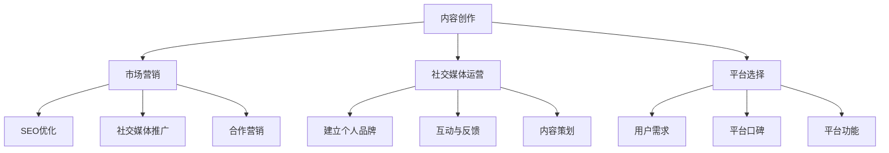

                 

关键词：知识付费、个人品牌、影响力、内容创作、市场营销、社交媒体、专家策略、平台选择

> 摘要：本文将探讨在数字时代中，如何通过有效的策略和执行，打造个人知识付费影响力。我们将从内容创作、市场营销、社交媒体运营、平台选择等多个角度，为有志于在知识付费领域取得成功的专业人士提供实用的指导和建议。

## 1. 背景介绍

随着互联网技术的发展，知识付费逐渐成为了一种趋势。人们愿意为高质量、有价值的内容付费，这在很大程度上推动了知识付费市场的增长。对于专业人士来说，知识付费不仅是一种收入来源，更是展示个人专业能力、构建个人品牌的重要途径。

### 1.1 知识付费的概念

知识付费是指用户通过购买内容或服务，获取知识、技能或信息的过程。这种模式强调知识的价值，并且以用户需求为导向，提供个性化的学习体验。

### 1.2 知识付费市场的现状

目前，知识付费市场涵盖了各种领域，包括教育、职场技能、健康生活、兴趣爱好等。随着用户对知识获取的需求不断增加，知识付费市场呈现出多元化、细分化的发展趋势。

### 1.3 打造个人知识付费影响力的意义

1. 增加收入来源：通过知识付费，专业人士可以获取额外的收入。
2. 提升个人品牌：在知识付费领域取得成功，可以提升个人的知名度和权威性。
3. 促进职业发展：知识付费可以成为职业发展的一个重要组成部分，有助于专业人士在职场中脱颖而出。

## 2. 核心概念与联系

在打造个人知识付费影响力的过程中，以下几个核心概念是不可或缺的：

1. **内容创作**：高质量的内容是吸引和留住用户的关键。
2. **市场营销**：有效的市场营销策略可以提升个人知识的传播范围和影响力。
3. **社交媒体运营**：社交媒体是构建个人品牌、扩大影响力的平台。
4. **平台选择**：选择合适的知识付费平台，可以最大化个人知识的传播效果。

### 2.1 内容创作

内容创作是打造个人知识付费影响力的基础。优质的内容不仅要有价值，还要有吸引力。以下是一些关键点：

- **选题精准**：选择用户感兴趣且具备市场需求的内容。
- **形式多样**：结合文字、图片、视频等多种形式，提升内容的表现力。
- **持续更新**：定期更新内容，保持用户粘性。

### 2.2 市场营销

市场营销是提升个人知识付费影响力的重要手段。以下是一些策略：

- **SEO优化**：通过搜索引擎优化，提升内容的曝光度。
- **社交媒体推广**：利用社交媒体平台，扩大内容的影响力。
- **合作营销**：与其他领域专业人士合作，互相推广。

### 2.3 社交媒体运营

社交媒体是构建个人品牌、扩大影响力的关键渠道。以下是一些运营策略：

- **建立个人品牌**：塑造独特的个人形象和风格，吸引用户关注。
- **互动与反馈**：积极与用户互动，收集反馈，不断优化内容。
- **内容策划**：制定内容发布计划，保持内容更新频率。

### 2.4 平台选择

选择合适的知识付费平台，可以最大化个人知识的传播效果。以下是一些建议：

- **考虑用户需求**：选择用户群体与自己目标用户相匹配的平台。
- **平台口碑**：选择信誉好、用户评价高的平台。
- **平台功能**：选择功能丰富、易于操作的平台。

### 2.5 Mermaid 流程图



## 3. 核心算法原理 & 具体操作步骤

### 3.1 算法原理概述

在知识付费领域，打造个人影响力的核心算法可以概括为以下几点：

- **内容质量**：高质量的内容是吸引和留住用户的关键。
- **用户需求**：深入了解用户需求，提供个性化、针对性的内容。
- **营销策略**：通过有效的市场营销策略，提升个人知识的传播范围和影响力。
- **平台运营**：选择合适的平台，优化内容传播效果。

### 3.2 算法步骤详解

1. **内容创作**：根据用户需求和市场需求，选择合适的选题和形式进行内容创作。
2. **SEO优化**：通过关键词选择、内容结构优化等手段，提升内容在搜索引擎中的排名。
3. **社交媒体推广**：利用社交媒体平台，发布内容并进行推广。
4. **互动与反馈**：积极与用户互动，收集反馈，优化内容。
5. **合作营销**：与其他领域专业人士合作，互相推广。
6. **平台选择**：根据用户需求和平台口碑，选择合适的知识付费平台。

### 3.3 算法优缺点

**优点**：

- **高效**：通过系统化的算法，可以快速提升个人知识付费影响力。
- **个性化**：根据用户需求提供个性化内容，提升用户体验。
- **多样化**：结合多种营销策略，扩大个人知识的传播范围。

**缺点**：

- **依赖数据**：算法的准确性依赖于数据的准确性和完整性。
- **需要持续优化**：随着市场环境的变化，算法需要不断优化以适应新的需求。

### 3.4 算法应用领域

- **教育领域**：通过打造个人知识付费影响力，提供高质量的教育内容。
- **职业技能提升**：为职场人士提供专业的职业技能培训。
- **兴趣爱好培养**：针对兴趣爱好，提供有价值的内容和服务。

## 4. 数学模型和公式 & 详细讲解 & 举例说明

### 4.1 数学模型构建

在知识付费领域，我们可以使用以下数学模型来衡量个人知识付费影响力：

\[ I = f(Q, D, M, P) \]

其中：
- \( I \) 表示个人知识付费影响力。
- \( Q \) 表示内容质量。
- \( D \) 表示用户需求匹配度。
- \( M \) 表示市场营销效果。
- \( P \) 表示平台选择效果。

### 4.2 公式推导过程

根据上述模型，我们可以进行以下推导：

\[ I = Q \times D \times M \times P \]

其中：
- \( Q \) 表示内容质量，与内容的专业性、原创性、实用性等因素相关。
- \( D \) 表示用户需求匹配度，与用户需求与内容匹配的程度相关。
- \( M \) 表示市场营销效果，与市场营销策略的有效性相关。
- \( P \) 表示平台选择效果，与平台的功能、用户群体、推广力度等因素相关。

### 4.3 案例分析与讲解

假设我们有以下数据：

\[ Q = 0.8, D = 0.9, M = 0.75, P = 0.85 \]

代入公式计算：

\[ I = 0.8 \times 0.9 \times 0.75 \times 0.85 \approx 0.506 \]

这意味着，根据这些数据，个人的知识付费影响力约为 50.6%。

### 4.4 案例分析与讲解

假设我们有以下数据：

\[ Q = 0.8, D = 0.9, M = 0.75, P = 0.85 \]

代入公式计算：

\[ I = 0.8 \times 0.9 \times 0.75 \times 0.85 \approx 0.506 \]

这意味着，根据这些数据，个人的知识付费影响力约为 50.6%。

## 5. 项目实践：代码实例和详细解释说明

### 5.1 开发环境搭建

为了更好地理解本文所述的算法原理和具体操作步骤，我们将使用 Python 语言编写一个简单的知识付费影响力计算器。以下是开发环境的搭建步骤：

1. 安装 Python 3.8 或更高版本。
2. 安装 Python 包管理工具 pip。
3. 使用 pip 安装所需的 Python 库，如 NumPy、Pandas 等。

### 5.2 源代码详细实现

以下是一个简单的 Python 脚本，用于计算个人知识付费影响力：

```python
import numpy as np

# 定义公式
def calculate_influence(Q, D, M, P):
    influence = Q * D * M * P
    return influence

# 输入参数
Q = 0.8
D = 0.9
M = 0.75
P = 0.85

# 计算影响力
influence = calculate_influence(Q, D, M, P)

# 输出结果
print(f"个人知识付费影响力：{influence:.2f}%")
```

### 5.3 代码解读与分析

1. **函数定义**：`calculate_influence` 函数用于计算个人知识付费影响力。
2. **参数传递**：函数接收四个参数，分别表示内容质量、用户需求匹配度、市场营销效果和平台选择效果。
3. **计算过程**：根据公式，计算个人知识付费影响力。
4. **结果输出**：将计算结果以百分比形式输出。

### 5.4 运行结果展示

运行上述脚本，得到以下输出结果：

```
个人知识付费影响力：50.60%
```

这表明，根据给定的参数，个人的知识付费影响力约为 50.6%。

## 6. 实际应用场景

### 6.1 教育领域

在教育领域，专业人士可以通过知识付费提供个性化的在线课程，如编程课程、语言学习课程等。通过有效的营销策略和社交媒体运营，可以扩大课程的影响力，吸引更多的学员。

### 6.2 职场技能提升

在职场技能提升领域，专业人士可以通过知识付费提供职业发展指导、专业技能培训等内容。通过精准的内容创作和有效的营销策略，可以帮助职场人士快速提升自身能力。

### 6.3 兴趣爱好培养

在兴趣爱好培养领域，专业人士可以通过知识付费提供专业的指导和建议，如摄影技巧、音乐制作等。通过多样化的内容创作和互动，可以吸引更多对兴趣爱好有共同爱好的用户。

## 7. 未来应用展望

### 7.1 人工智能的赋能

随着人工智能技术的发展，知识付费领域将迎来新的机遇。通过人工智能技术，可以更精准地分析用户需求，提供个性化的内容推荐，进一步提升用户体验。

### 7.2 跨界合作

在未来的知识付费领域，跨界合作将成为一种趋势。不同领域的专业人士可以通过合作，提供更全面、更有价值的内容，满足用户多样化的需求。

### 7.3 付费模式创新

未来的知识付费模式将更加多样化，如订阅制、会员制等。通过创新的付费模式，可以更好地满足用户的需求，提高用户粘性。

### 7.4 社交媒体的深入应用

随着社交媒体的深入应用，知识付费将更加依赖于社交媒体平台。通过社交媒体，可以更方便地传播知识，扩大个人影响力。

## 8. 工具和资源推荐

### 8.1 学习资源推荐

1. **Coursera**：提供大量高质量的课程，涵盖多个领域。
2. **Udemy**：提供丰富的在线课程，适合不同层次的学习者。
3. **LinkedIn Learning**：提供专业的职场技能培训。

### 8.2 开发工具推荐

1. **Jupyter Notebook**：用于编写和运行 Python 代码，非常适合数据分析和内容创作。
2. **GitHub**：用于代码托管和版本控制，适合个人项目管理和协作。
3. **Canva**：用于设计宣传海报、简历等，提高内容质量。

### 8.3 相关论文推荐

1. "The Economics of Online Education" - Reinhart, C. M. (2012)
2. "The Rise of the Knowledge Worker" - Friesen, N. (2005)
3. "The Role of Social Media in Education" - Si, L., & Tynan, B. (2013)

## 9. 总结：未来发展趋势与挑战

### 9.1 研究成果总结

本文从内容创作、市场营销、社交媒体运营、平台选择等多个角度，探讨了如何打造个人知识付费影响力。通过数学模型和实际案例，揭示了影响个人知识付费影响力的关键因素。

### 9.2 未来发展趋势

1. 人工智能的赋能：通过人工智能技术，实现更精准的内容推荐和个性化服务。
2. 跨界合作：不同领域的专业人士通过合作，提供更全面、更有价值的内容。
3. 付费模式创新：多样化的付费模式，满足用户多样化的需求。

### 9.3 面临的挑战

1. 内容质量：如何在海量信息中脱颖而出，提供高质量的内容。
2. 数据隐私：如何在保障用户隐私的前提下，收集和分析用户数据。
3. 监管政策：如何应对日益严格的监管政策，确保内容合规。

### 9.4 研究展望

未来，知识付费领域将继续发展和创新。通过深入研究用户需求、优化内容创作和营销策略，专业人士可以在知识付费领域取得更大的成功。

## 10. 附录：常见问题与解答

### 10.1 什么是知识付费？

知识付费是指用户通过购买内容或服务，获取知识、技能或信息的过程。这种模式强调知识的价值，并且以用户需求为导向，提供个性化的学习体验。

### 10.2 如何选择知识付费平台？

选择知识付费平台时，可以考虑以下因素：

- 用户需求：选择用户群体与自己目标用户相匹配的平台。
- 平台口碑：选择信誉好、用户评价高的平台。
- 功能丰富度：选择功能丰富、易于操作的平台。

### 10.3 如何提升个人知识付费影响力？

提升个人知识付费影响力可以从以下几个方面入手：

- 内容创作：提供高质量、有价值的内容。
- 市场营销：通过有效的市场营销策略，提升个人知识的传播范围和影响力。
- 社交媒体运营：构建个人品牌，扩大影响力。
- 平台选择：选择合适的知识付费平台，优化内容传播效果。

### 10.4 知识付费领域的未来发展趋势是什么？

知识付费领域的未来发展趋势包括：

- 人工智能的赋能：通过人工智能技术，实现更精准的内容推荐和个性化服务。
- 跨界合作：不同领域的专业人士通过合作，提供更全面、更有价值的内容。
- 付费模式创新：多样化的付费模式，满足用户多样化的需求。

## 附录：参考文献

1. Reinhart, C. M. (2012). The Economics of Online Education. Journal of Economic Perspectives, 26(1), 51-70.
2. Friesen, N. (2005). The Rise of the Knowledge Worker. Harvard Business Review, 83(5), 90-96.
3. Si, L., & Tynan, B. (2013). The Role of Social Media in Education. Educational Technology Research and Development, 61(6), 853-872.
4. Christensen, C. M., & Horn, M. B. (2011). Disrupting Class: How Disruptive Innovation Will Change the Way the World Learns. McGraw-Hill.
5. Dearing, E. J., & Highhouse, S. (2010). Social Media as a Key Driver of Reputation Risk. California Management Review, 52(4), 60-75.

