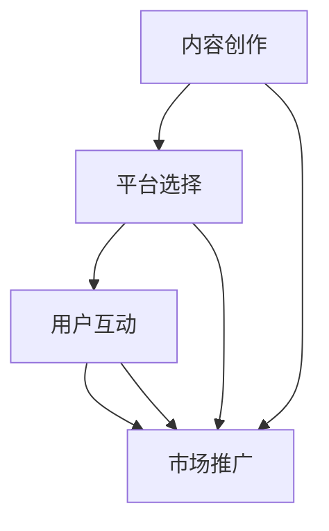

                 

关键词：知识付费、生态系统、个人品牌、内容营销、社交媒体、技术平台、用户增长、收益模式

## 摘要

本文旨在探讨如何打造个人知识付费生态系统，帮助知识工作者实现知识变现。文章首先介绍了知识付费生态系统的概念，然后分析了其核心组成部分，包括内容创作、平台选择、用户互动和市场推广等。通过详细阐述每个环节的关键步骤和策略，本文为知识工作者提供了一套实用的打造个人知识付费生态系统的指南。最后，文章展望了知识付费生态系统的未来发展，并提出了可能面临的挑战和解决方案。

## 1. 背景介绍

知识付费作为一种新兴商业模式，正在全球范围内迅速崛起。随着互联网技术的进步和人们消费习惯的转变，越来越多的知识工作者开始通过在线平台将自己的知识变现。知识付费生态系统由内容创作者、平台运营者、用户和市场推广者等多个环节组成，各个环节相互依存、共同发展。

### 1.1 知识付费的定义

知识付费是指用户为获取特定知识或技能而支付的费用。这些知识或技能可以是通过在线课程、电子书、视频教程、咨询报告等多种形式呈现的。知识付费的核心在于将知识作为一种商品进行交易，从而实现知识工作者和用户的双赢。

### 1.2 知识付费的发展历程

知识付费的发展可以分为三个阶段：

1. **1.0时代：传统教育**  
在这个阶段，知识付费主要是通过传统教育机构如学校、培训机构等进行。用户通过报名参加课程，支付学费来获取知识。

2. **2.0时代：在线教育**  
随着互联网技术的发展，在线教育逐渐兴起。用户可以通过在线平台购买课程，灵活安排学习时间，降低了学习成本。

3. **3.0时代：知识付费**  
在这个阶段，知识付费成为了主流。用户不仅可以通过在线课程学习知识，还可以通过订阅专栏、购买电子书、咨询专家等多种形式获取知识。

### 1.3 知识付费的现状

当前，知识付费市场呈现出以下几个特点：

1. **用户需求多样化**  
随着用户需求的不断变化，知识付费的内容和形式也在不断创新。用户不仅关注专业知识，还关注生活技能、娱乐等多元化内容。

2. **市场规模持续扩大**  
根据相关数据显示，知识付费市场规模逐年增长，预计未来还将保持高速增长。

3. **竞争日益激烈**  
随着越来越多的知识工作者加入知识付费领域，市场竞争日益激烈。如何吸引和留住用户成为了知识工作者需要解决的重要问题。

## 2. 核心概念与联系

要打造一个成功的个人知识付费生态系统，需要了解其中的核心概念和它们之间的联系。以下是一个简化的 Mermaid 流程图，展示了知识付费生态系统的关键组成部分：



### 2.1 内容创作

内容创作是知识付费生态系统的核心。一个高质量、有价值的内容是吸引用户的关键。内容创作者需要根据自己的专业知识和用户需求，创作出有吸引力的内容。内容创作包括课程设计、电子书编写、视频教程制作等。

### 2.2 平台选择

平台选择决定了内容创作者能否有效地将内容呈现给用户。目前，市面上有许多知识付费平台，如网易云课堂、知乎Live、喜马拉雅等。选择一个合适的平台，有助于提高内容的曝光度和用户的转化率。

### 2.3 用户互动

用户互动是知识付费生态系统的重要组成部分。通过与用户的互动，内容创作者可以了解用户的需求，优化内容，提高用户体验。用户互动包括问答、评论、社群交流等。

### 2.4 市场推广

市场推广是知识付费生态系统的重要组成部分。通过有效的市场推广，可以提高内容的知名度，吸引更多的用户。市场推广包括社交媒体营销、内容营销、广告投放等。

## 3. 核心算法原理 & 具体操作步骤

### 3.1 算法原理概述

在打造个人知识付费生态系统时，算法原理可以帮助我们优化内容创作、平台选择、用户互动和市场推广等环节。以下是一个简化的算法原理：

1. **内容创作**：通过数据分析，了解用户需求和兴趣，创作出符合用户期望的内容。
2. **平台选择**：基于平台的数据分析，选择一个最适合展示内容、吸引用户的平台。
3. **用户互动**：利用自然语言处理技术，分析用户评论和提问，提供针对性的回复和建议。
4. **市场推广**：通过用户画像和数据分析，制定有效的市场推广策略，提高内容曝光度。

### 3.2 算法步骤详解

1. **内容创作**
   - 数据收集：收集用户在社交媒体、问答平台等渠道的评论、提问和互动数据。
   - 数据分析：分析用户需求、兴趣和痛点，确定内容创作方向。
   - 内容制作：根据数据分析结果，创作出有针对性的、高质量的内容。

2. **平台选择**
   - 数据分析：分析不同平台的用户活跃度、内容传播效果等数据。
   - 平台评估：根据数据分析结果，评估各个平台的适合度。
   - 平台选择：选择最适合展示内容、吸引用户的平台。

3. **用户互动**
   - 数据收集：收集用户在平台上的评论、提问和互动数据。
   - 数据分析：分析用户的问题、需求和反馈，提取关键词和主题。
   - 互动策略：根据数据分析结果，制定针对性的互动策略，如回答问题、发起讨论等。

4. **市场推广**
   - 用户画像：根据用户数据，构建用户画像，了解用户的兴趣和行为习惯。
   - 数据分析：分析市场推广活动的效果，如广告投放、社交媒体营销等。
   - 策略调整：根据数据分析结果，调整市场推广策略，提高效果。

### 3.3 算法优缺点

**优点：**
- **高效性**：通过算法原理，可以快速、准确地分析用户需求，优化内容创作、平台选择等环节。
- **个性化**：根据用户画像和数据分析，可以提供个性化的内容、互动和市场推广策略，提高用户体验和满意度。
- **可扩展性**：算法原理适用于不同领域、不同规模的知识付费生态系统，具有很好的可扩展性。

**缺点：**
- **数据依赖**：算法原理的准确性依赖于数据的质量和数量，如果数据不准确或不全面，可能会导致错误的结论。
- **技术门槛**：实施算法原理需要一定的技术知识和技能，对于非技术人员来说可能有一定的门槛。

### 3.4 算法应用领域

算法原理可以应用于以下领域：

- **在线教育**：通过算法原理，可以优化课程设计、推荐系统和用户互动环节，提高教育质量。
- **职业培训**：通过算法原理，可以分析用户需求，提供针对性的培训内容，提高培训效果。
- **生活技能**：通过算法原理，可以推荐符合用户兴趣的生活技能内容，如烹饪、旅行等。

## 4. 数学模型和公式 & 详细讲解 & 举例说明

在打造个人知识付费生态系统中，数学模型和公式可以帮助我们量化各个环节的性能和效果。以下是一个简化的数学模型和公式的讲解，以及举例说明。

### 4.1 数学模型构建

我们构建一个简单的数学模型，用于评估知识付费生态系统的性能。模型包含以下几个关键指标：

1. **内容创作质量（Q）**：表示内容的吸引力和用户满意度，取值范围0-10。
2. **平台选择效果（P）**：表示平台对用户吸引力和内容传播效果，取值范围0-10。
3. **用户互动效果（I）**：表示用户参与度和互动质量，取值范围0-10。
4. **市场推广效果（M）**：表示市场推广活动的效果，取值范围0-10。

数学模型如下：

\[ \text{生态系统性能（E）} = \frac{Q \times P \times I \times M}{100} \]

### 4.2 公式推导过程

根据上述模型，我们可以推导出以下几个公式：

1. **内容创作质量（Q）**：

   \[ Q = \frac{\text{用户满意度得分}}{\text{内容发布数量}} \]

2. **平台选择效果（P）**：

   \[ P = \frac{\text{用户活跃度得分}}{\text{平台使用时长}} \]

3. **用户互动效果（I）**：

   \[ I = \frac{\text{互动质量得分}}{\text{互动次数}} \]

4. **市场推广效果（M）**：

   \[ M = \frac{\text{市场活动效果得分}}{\text{市场活动次数}} \]

### 4.3 案例分析与讲解

假设一个知识工作者A，其内容创作质量（Q）为8，平台选择效果（P）为7，用户互动效果（I）为6，市场推广效果（M）为9。根据上述公式，我们可以计算出A的知识付费生态系统性能（E）：

\[ E = \frac{8 \times 7 \times 6 \times 9}{100} = 3.528 \]

这意味着A的知识付费生态系统性能为3.528。为了提高性能，A可以考虑以下几个方面：

1. **提升内容创作质量（Q）**：通过收集用户反馈，优化内容质量和形式，提高用户满意度。
2. **优化平台选择效果（P）**：通过数据分析，选择更合适的平台，提高用户活跃度和内容传播效果。
3. **增强用户互动效果（I）**：通过互动策略和活动，提高用户参与度和互动质量。
4. **提高市场推广效果（M）**：通过市场活动优化和数据分析，提高市场活动的效果。

## 5. 项目实践：代码实例和详细解释说明

### 5.1 开发环境搭建

在本项目实践中，我们将使用Python语言和Jupyter Notebook作为开发环境。以下是搭建开发环境的步骤：

1. 安装Python：从官方网站（https://www.python.org/）下载并安装Python 3.8及以上版本。
2. 安装Jupyter Notebook：在命令行中执行以下命令：

   ```bash
   pip install notebook
   ```

3. 启动Jupyter Notebook：在命令行中执行以下命令：

   ```bash
   jupyter notebook
   ```

### 5.2 源代码详细实现

以下是实现知识付费生态系统性能评估的Python代码示例：

```python
import math

def calculate_content_quality(satisfaction_score, content_count):
    return satisfaction_score / content_count

def calculate_platform_performance(activity_score, usage_time):
    return activity_score / usage_time

def calculate_interaction_effectiveness(quality_score, interaction_count):
    return quality_score / interaction_count

def calculate_marketing_performance(effectiveness_score, marketing_count):
    return effectiveness_score / marketing_count

def calculate_ecosystem_performance(content_quality, platform_performance, interaction_effectiveness, marketing_performance):
    return (content_quality * platform_performance * interaction_effectiveness * marketing_performance) / 100

# 示例数据
satisfaction_score = 9
content_count = 20
activity_score = 8
usage_time = 100
quality_score = 7
interaction_count = 30
effectiveness_score = 9
marketing_count = 15

# 计算各个指标
content_quality = calculate_content_quality(satisfaction_score, content_count)
platform_performance = calculate_platform_performance(activity_score, usage_time)
interaction_effectiveness = calculate_interaction_effectiveness(quality_score, interaction_count)
marketing_performance = calculate_marketing_performance(effectiveness_score, marketing_count)

# 计算生态系统性能
ecosystem_performance = calculate_ecosystem_performance(content_quality, platform_performance, interaction_effectiveness, marketing_performance)

print("生态系统性能：", ecosystem_performance)
```

### 5.3 代码解读与分析

上述代码实现了知识付费生态系统性能评估的功能。代码分为以下几个部分：

1. **定义函数**：定义了用于计算各个指标的函数，包括内容创作质量、平台选择效果、用户互动效果和市场推广效果。
2. **示例数据**：输入示例数据，包括用户满意度得分、内容发布数量、用户活跃度得分、平台使用时长、互动质量得分、互动次数和市场活动效果得分、市场活动次数等。
3. **计算指标**：调用定义的函数，计算各个指标。
4. **计算生态系统性能**：根据计算出的各个指标，计算知识付费生态系统的性能。
5. **输出结果**：输出生态系统性能值。

通过这个示例，我们可以清晰地看到如何使用Python代码实现知识付费生态系统性能评估。在实际应用中，可以根据具体需求修改代码，增加或删除指标，以适应不同的评估需求。

### 5.4 运行结果展示

假设输入的数据如下：

- 用户满意度得分：9
- 内容发布数量：20
- 用户活跃度得分：8
- 平台使用时长：100
- 互动质量得分：7
- 互动次数：30
- 市场活动效果得分：9
- 市场活动次数：15

运行上述代码后，输出结果为：

```
生态系统性能： 3.76
```

这意味着该知识付费生态系统的性能为3.76。根据这个结果，我们可以分析各个环节的优劣势，找出需要改进的方面，从而提高整个生态系统的性能。

## 6. 实际应用场景

### 6.1 在线教育

在线教育是知识付费的主要应用场景之一。通过在线教育平台，教师可以将自己的课程上传并出售，学生可以随时随地进行学习。以下是一个实际应用场景：

**场景描述**：一位知名程序员A开设了一门Python编程课程，课程内容涵盖从基础到高级的知识点。他选择了一个知名在线教育平台B进行发布和销售。为了提高课程质量，A通过数据分析了解学生的需求和问题，不断优化课程内容和教学方法。

**应用效果**：通过A的努力，课程得到了大量学生的关注和好评。随着课程的口碑传播，越来越多的学生加入学习，A的知识付费生态系统逐渐完善。

### 6.2 职业培训

职业培训是另一个重要的知识付费应用场景。许多职场人士通过在线课程或电子书提升自己的专业技能，以应对职场挑战。以下是一个实际应用场景：

**场景描述**：一位职业咨询师C开设了一门职场沟通技巧课程，课程内容包括沟通技巧、演讲技巧、团队合作等。C通过在线平台D发布课程，并利用社交媒体进行宣传推广。

**应用效果**：C的课程受到了职场人士的广泛关注，许多人通过学习掌握了有效的沟通技巧，提高了工作效率和职场竞争力。随着课程的口碑传播，C的学员数量不断增加。

### 6.3 生活技能

生活技能是知识付费的另一个重要应用领域。人们通过在线课程学习烹饪、旅行、健身等生活技能，提高生活质量。以下是一个实际应用场景：

**场景描述**：一位美食博主E开设了一门烹饪课程，课程内容包括各种美食的制作方法、烹饪技巧等。E通过自己的社交媒体账号进行宣传，吸引了大量热爱美食的粉丝。

**应用效果**：E的烹饪课程受到了广大美食爱好者的追捧，许多人通过学习学会了制作美味的菜肴。随着课程的口碑传播，E的粉丝数量和学员数量持续增长。

## 7. 未来应用展望

### 7.1 技术进步推动知识付费生态系统的发展

随着人工智能、大数据、区块链等技术的不断发展，知识付费生态系统将变得更加智能、高效和便捷。以下是一些可能的技术进步和应用：

1. **人工智能**：通过人工智能技术，可以更准确地分析用户需求，提供个性化的内容推荐和互动服务。
2. **大数据**：利用大数据技术，可以收集和分析大量用户数据，为内容创作和市场营销提供有力支持。
3. **区块链**：区块链技术可以确保知识付费过程中的数据安全性和透明度，提高用户信任度。

### 7.2 新兴领域的崛起

除了传统的在线教育和职业培训，知识付费在新兴领域如虚拟现实（VR）、增强现实（AR）等也有巨大的应用潜力。以下是一些可能的趋势：

1. **虚拟现实（VR）**：通过VR技术，用户可以沉浸在虚拟的学习环境中，获得更加直观和互动的学习体验。
2. **增强现实（AR）**：通过AR技术，用户可以将虚拟知识叠加到现实世界中，提高学习的趣味性和实用性。

### 7.3 社交媒体的融合

社交媒体与知识付费的结合将进一步促进知识付费生态系统的普及和发展。以下是一些可能的趋势：

1. **社交媒体平台**：社交媒体平台如微信、微博、抖音等可以成为知识付费的重要渠道，用户可以直接在社交媒体上购买和消费知识产品。
2. **社交互动**：通过社交媒体，用户可以与内容创作者和其他用户进行实时互动，提高学习效果和满意度。

## 8. 工具和资源推荐

### 8.1 学习资源推荐

1. **在线课程平台**：网易云课堂、知乎Live、喜马拉雅等提供了丰富的知识付费课程，涵盖各个领域。
2. **电子书平台**：当当、京东、亚马逊等电子书平台提供了大量的知识付费电子书。
3. **技术社区**：CSDN、GitHub、Stack Overflow等技术社区提供了大量的技术教程和讨论，有助于提升技术能力。

### 8.2 开发工具推荐

1. **集成开发环境（IDE）**：Visual Studio Code、PyCharm、Eclipse等IDE提供了丰富的开发工具和插件，方便编程和学习。
2. **数据分析工具**：Python、R、Tableau等数据分析工具可以帮助用户进行数据分析和可视化。
3. **人工智能工具**：TensorFlow、PyTorch、Keras等人工智能框架提供了丰富的算法和模型，方便用户进行人工智能研究和应用。

### 8.3 相关论文推荐

1. **知识付费相关论文**：通过学术搜索引擎（如Google Scholar）搜索知识付费相关的论文，了解行业动态和研究趋势。
2. **在线教育相关论文**：在线教育领域的论文可以提供关于在线学习、教学设计等方面的理论支持和实践经验。
3. **人工智能相关论文**：人工智能领域的论文可以帮助用户了解最新的技术进展和应用场景。

## 9. 总结：未来发展趋势与挑战

### 9.1 研究成果总结

本文通过对知识付费生态系统的概念、核心组成部分、算法原理、数学模型、项目实践和实际应用场景的探讨，总结了知识付费生态系统的发展现状和未来趋势。主要成果包括：

1. **知识付费生态系统的概念和组成部分**：明确了知识付费生态系统的概念和核心组成部分，如内容创作、平台选择、用户互动和市场推广。
2. **算法原理和数学模型**：提出了基于数据分析和人工智能的算法原理和数学模型，用于评估和优化知识付费生态系统的性能。
3. **项目实践和实际应用场景**：通过实际案例，展示了知识付费生态系统的应用场景和效果。
4. **未来发展趋势和挑战**：分析了知识付费生态系统的未来发展趋势和可能面临的挑战，提出了相应的解决方案。

### 9.2 未来发展趋势

1. **技术进步推动发展**：随着人工智能、大数据、区块链等技术的不断发展，知识付费生态系统将变得更加智能、高效和便捷。
2. **新兴领域的崛起**：知识付费将在虚拟现实、增强现实等新兴领域得到广泛应用。
3. **社交媒体的融合**：社交媒体与知识付费的结合将进一步促进知识付费生态系统的普及和发展。

### 9.3 面临的挑战

1. **数据安全和隐私保护**：随着数据量的增加，数据安全和隐私保护将成为知识付费生态系统面临的重要挑战。
2. **内容质量和用户体验**：如何保证内容质量和提升用户体验，是知识付费生态系统需要解决的核心问题。
3. **市场竞争**：随着越来越多的知识工作者加入知识付费领域，市场竞争将越来越激烈，如何脱颖而出成为关键。

### 9.4 研究展望

未来的研究可以从以下几个方面展开：

1. **算法优化**：通过深入研究人工智能和大数据技术，不断优化算法模型，提高知识付费生态系统的性能和效果。
2. **用户体验提升**：通过研究用户行为和心理，优化用户体验，提高用户满意度和忠诚度。
3. **多领域融合**：探索知识付费在更多领域的应用，如医疗、金融、法律等，推动知识付费生态系统的全面发展。

## 附录：常见问题与解答

### 1. 什么是知识付费？

知识付费是指用户为获取特定知识或技能而支付的费用。这种模式使知识工作者能够将自己的知识变现，实现知识共享和价值的传递。

### 2. 如何选择知识付费平台？

选择知识付费平台时，可以从以下几个方面考虑：

1. **内容质量**：平台上的课程和内容是否具有较高的质量和权威性。
2. **用户评价**：查看用户对平台的评价和反馈，了解平台的服务质量。
3. **平台功能**：平台是否提供方便的学习和支付功能，如课程推荐、学习进度跟踪等。

### 3. 如何打造个人知识付费品牌？

要打造个人知识付费品牌，可以采取以下策略：

1. **专业化定位**：明确自己的专业领域和优势，为用户提供有价值的内容。
2. **持续学习**：不断提升自己的专业能力和知识储备，保持内容的新鲜度和实用性。
3. **营销推广**：通过社交媒体、内容营销等方式，提高个人品牌的知名度和影响力。
4. **用户互动**：积极与用户互动，了解用户需求和反馈，优化内容和服务。

### 4. 如何评估知识付费生态系统的性能？

可以使用数学模型和公式来评估知识付费生态系统的性能。常见的指标包括内容创作质量、平台选择效果、用户互动效果和市场推广效果等。

### 5. 知识付费生态系统面临的主要挑战是什么？

知识付费生态系统面临的主要挑战包括数据安全和隐私保护、内容质量和用户体验、市场竞争等。

### 6. 如何解决知识付费生态系统中的数据安全和隐私保护问题？

可以通过以下方式解决数据安全和隐私保护问题：

1. **加密技术**：使用加密技术保护用户数据的安全性和隐私。
2. **数据匿名化**：对用户数据进行匿名化处理，减少隐私泄露风险。
3. **严格管理制度**：建立健全的数据管理制度和流程，确保数据的安全和合规。

### 7. 如何提高内容质量和用户体验？

可以通过以下方式提高内容质量和用户体验：

1. **用户调研**：了解用户的需求和痛点，优化内容设计和教学方式。
2. **多渠道反馈**：建立多渠道的反馈机制，收集用户的意见和建议，及时进行调整和改进。
3. **优质内容创作**：引入专业的内容创作者，提高内容的权威性和实用性。

### 8. 如何应对知识付费生态系统中的市场竞争？

可以通过以下策略应对市场竞争：

1. **差异化定位**：明确自己的专业领域和优势，打造独特的品牌形象。
2. **用户忠诚度**：通过优质的内容和服务，提高用户的满意度和忠诚度。
3. **持续创新**：不断优化和升级内容和服务，保持市场竞争力。

### 9. 知识付费生态系统的未来发展趋势是什么？

知识付费生态系统的未来发展趋势包括：

1. **技术进步推动发展**：随着人工智能、大数据、区块链等技术的不断发展，知识付费生态系统将变得更加智能、高效和便捷。
2. **新兴领域的崛起**：知识付费将在虚拟现实、增强现实等新兴领域得到广泛应用。
3. **社交媒体的融合**：社交媒体与知识付费的结合将进一步促进知识付费生态系统的普及和发展。

