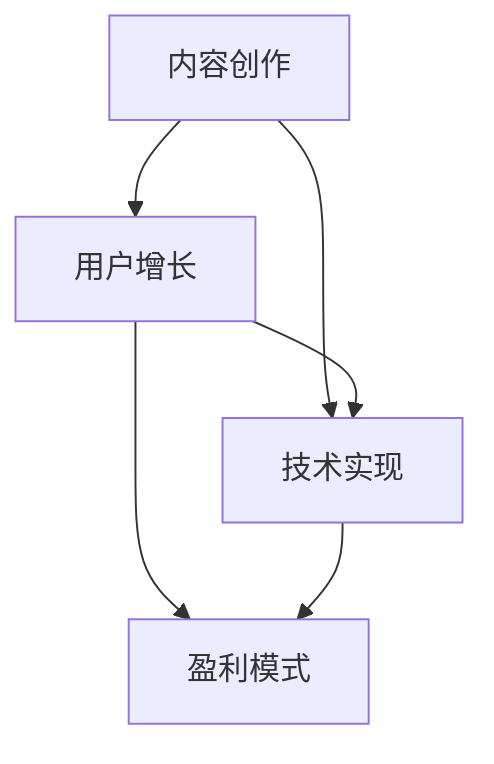

                 

关键词：知识付费、个人品牌、内容创作、用户增长、技术实现

> 摘要：本文将探讨如何构建个人知识付费生态系统，从内容创作、用户增长、技术实现等多个维度进行分析，帮助内容创作者打造自己的知识付费平台，实现持续盈利。

## 1. 背景介绍

近年来，随着互联网的快速发展，知识付费市场呈现出爆发式增长。人们越来越重视个人成长，愿意为优质的内容和服务付费。在这个背景下，越来越多的个人创作者投身于知识付费领域，希望通过分享自己的知识和经验，实现收入增长。

然而，面对激烈的市场竞争，如何打造一个有吸引力的个人知识付费生态系统，成为许多内容创作者面临的重要课题。本文将围绕这一主题，从多个角度进行分析和探讨。

### 1.1 知识付费市场的现状

知识付费市场在近年来呈现出快速增长的趋势，主要表现在以下几个方面：

- **用户规模扩大**：越来越多的人愿意为优质内容付费，用户规模持续扩大。  
- **内容多样化**：知识付费内容涵盖领域广泛，从专业技能培训到个人成长，从兴趣爱好到深度学习，满足不同用户的需求。  
- **平台多样化**：知识付费平台种类繁多，既有传统的平台，如得到、知乎Live，也有新兴的平台，如知识星球、分答。

### 1.2 内容创作者面临的挑战

尽管知识付费市场前景广阔，但内容创作者仍面临诸多挑战：

- **内容同质化**：由于竞争激烈，许多内容创作者在创作过程中面临内容同质化的问题。  
- **用户留存困难**：用户需求多样化，如何吸引并留住用户成为内容创作者的重要课题。  
- **盈利模式单一**：许多内容创作者的盈利模式仍较为单一，难以实现持续稳定的收入。

## 2. 核心概念与联系

### 2.1 个人知识付费生态系统的概念

个人知识付费生态系统是指内容创作者通过一系列策略和手段，构建起一个能够持续产生价值、实现盈利的知识付费平台。这个生态系统包括以下几个方面：

- **内容创作**：内容创作者提供优质的内容，满足用户的需求。  
- **用户增长**：通过有效的推广手段，吸引更多的用户关注和加入。  
- **技术实现**：利用现代技术手段，实现内容付费、用户管理、数据分析等功能。

### 2.2 个人知识付费生态系统的联系

个人知识付费生态系统的各个部分相互联系，共同构建起一个完整的生态系统。以下是各个部分之间的联系：

- **内容创作**与**用户增长**：优质的内容是吸引和留住用户的基础，而用户增长则为内容创作提供更多的机会和动力。  
- **用户增长**与**技术实现**：技术实现为用户增长提供了支持，如用户管理、数据分析等功能，有助于提高用户体验和满意度。  
- **内容创作**与**技术实现**：技术实现为内容创作提供了工具和平台，如在线课程制作、直播等技术手段，使内容创作更加高效和多样化。

### 2.3 Mermaid 流程图

以下是一个简单的 Mermaid 流程图，展示了个人知识付费生态系统的各个部分及其联系：



## 3. 核心算法原理 & 具体操作步骤

### 3.1 算法原理概述

个人知识付费生态系统的核心算法主要涉及以下几个方面：

- **内容推荐算法**：根据用户的兴趣和浏览历史，推荐符合其需求的内容。  
- **用户增长算法**：通过数据分析，找到潜在用户，并制定相应的推广策略。  
- **盈利模式优化算法**：根据用户行为和内容收益，优化盈利模式，提高收入。

### 3.2 算法步骤详解

#### 3.2.1 内容推荐算法

1. **用户画像构建**：根据用户的基本信息和行为数据，构建用户画像。  
2. **内容标签化**：将内容进行分类和标签化处理，方便推荐算法进行匹配。  
3. **协同过滤**：基于用户的历史行为和兴趣，进行协同过滤，推荐相似用户喜欢的内容。  
4. **内容质量评估**：根据用户的反馈和内容数据，对内容进行质量评估，筛选出优质内容。

#### 3.2.2 用户增长算法

1. **潜在用户挖掘**：通过数据分析，挖掘潜在用户，如新用户、未付费用户等。  
2. **用户画像构建**：对潜在用户进行画像构建，了解其兴趣和行为特征。  
3. **个性化推荐**：根据用户画像，进行个性化推荐，提高用户参与度。  
4. **活动推广**：通过线上活动和营销手段，吸引更多用户关注和加入。

#### 3.2.3 盈利模式优化算法

1. **收益分析**：根据用户行为和内容收益，分析不同盈利模式的收益情况。  
2. **模式优化**：根据收益分析结果，优化盈利模式，提高收入。  
3. **成本控制**：通过技术手段和管理优化，降低运营成本。  
4. **持续迭代**：根据市场变化和用户需求，持续优化盈利模式。

### 3.3 算法优缺点

#### 3.3.1 内容推荐算法

**优点**：  
- 提高用户体验，满足个性化需求。  
- 提高内容曝光度，增加收入。

**缺点**：  
- 需要大量数据支持，对数据处理能力要求较高。  
- 容易出现“信息茧房”现象，用户视野受限。

#### 3.3.2 用户增长算法

**优点**：  
- 提高用户参与度，增加用户黏性。  
- 扩大用户规模，增加收入。

**缺点**：  
- 需要大量资源和人力投入。  
- 过度依赖外部推广，可能影响品牌形象。

#### 3.3.3 盈利模式优化算法

**优点**：  
- 提高收入，实现持续盈利。  
- 根据用户需求和市场变化，灵活调整盈利模式。

**缺点**：  
- 需要持续的数据分析和优化。  
- 可能会影响用户体验，如过度推送广告。

### 3.4 算法应用领域

个人知识付费生态系统的核心算法可应用于多个领域：

- **在线教育**：通过内容推荐算法，提高用户学习效果。  
- **自媒体运营**：通过用户增长算法，扩大粉丝规模。  
- **内容电商**：通过盈利模式优化算法，提高内容收益。

## 4. 数学模型和公式 & 详细讲解 & 举例说明

### 4.1 数学模型构建

个人知识付费生态系统的数学模型主要包括以下方面：

- **用户增长模型**：基于用户增长算法，构建用户增长模型，预测未来用户增长情况。  
- **收益模型**：基于盈利模式优化算法，构建收益模型，预测不同盈利模式的收益情况。  
- **成本模型**：基于运营成本，构建成本模型，预测未来成本情况。

### 4.2 公式推导过程

以下是用户增长模型的推导过程：

设\( N(t) \)为时间\( t \)的用户数量，\( r \)为用户增长速率，\( t_0 \)为初始时间，\( N_0 \)为初始用户数量。

根据用户增长算法，用户增长速率\( r \)与用户数量\( N \)成正比，即：

\[ r = kN \]

其中，\( k \)为增长速率常数。

将上式两边同时除以\( N \)，得：

\[ \frac{r}{N} = k \]

对上式两边同时求导，得：

\[ \frac{d(r/N)}{dt} = \frac{dk}{dt} \]

由于\( r \)是关于\( t \)的函数，所以\( \frac{dk}{dt} \)表示增长速率常数的变化率。在短期内，增长速率常数\( k \)可以视为常数，即\( \frac{dk}{dt} \approx 0 \)。

因此，上式可以简化为：

\[ \frac{d(r/N)}{dt} \approx 0 \]

这意味着用户增长速率与用户数量成反比，即用户数量越多，增长速率越慢。这符合现实情况，因为一个平台在初期阶段用户较少，增长速度较快，但随着用户数量的增加，增长速度逐渐放缓。

### 4.3 案例分析与讲解

假设一个知识付费平台在初始时间\( t_0 \)有1000名用户，增长速率常数\( k \)为0.1，我们需要预测未来一段时间内的用户增长情况。

根据用户增长模型，用户数量\( N(t) \)可以表示为：

\[ N(t) = \frac{N_0}{1 - kt} \]

代入初始条件，得：

\[ N(t) = \frac{1000}{1 - 0.1t} \]

在不同时间点，我们可以计算用户数量\( N(t) \)：

- 当\( t = 1 \)年，用户数量约为\( N(1) = \frac{1000}{1 - 0.1 \times 1} \approx 1111 \)名。  
- 当\( t = 2 \)年，用户数量约为\( N(2) = \frac{1000}{1 - 0.1 \times 2} \approx 1234 \)名。  
- 当\( t = 3 \)年，用户数量约为\( N(3) = \frac{1000}{1 - 0.1 \times 3} \approx 1379 \)名。

从计算结果可以看出，随着时间的推移，用户数量呈增长趋势，但增长速度逐渐放缓。

### 4.4 总结

通过数学模型和公式，我们可以更好地理解和预测个人知识付费生态系统的发展趋势。在实际应用中，我们可以根据用户增长模型和收益模型，制定相应的运营策略，实现持续盈利。

## 5. 项目实践：代码实例和详细解释说明

### 5.1 开发环境搭建

为了构建个人知识付费生态系统，我们需要搭建一个开发环境，包括以下工具和软件：

- **操作系统**：Linux（如Ubuntu）或MacOS  
- **编程语言**：Python（3.8及以上版本）  
- **数据库**：MySQL（5.7及以上版本）  
- **Web框架**：Django（2.2及以上版本）  
- **前端框架**：React（16.8及以上版本）

### 5.2 源代码详细实现

以下是一个简单的示例代码，展示了如何使用Django和React构建一个基本的知识付费平台。

**Django后端代码（`views.py`）**：

```python
from django.http import JsonResponse
from .models import Course

def get_courses(request):
    courses = Course.objects.all()
    courses_data = [{"id": course.id, "title": course.title, "description": course.description} for course in courses]
    return JsonResponse({"courses": courses_data})
```

**React前端代码（`App.js`）**：

```jsx
import React, { useEffect, useState } from "react";
import axios from "axios";

function App() {
  const [courses, setCourses] = useState([]);

  useEffect(() => {
    const fetchCourses = async () => {
      const response = await axios.get("/api/courses/");
      setCourses(response.data.courses);
    };
    fetchCourses();
  }, []);

  return (
    <div>
      <h1>知识付费平台</h1>
      <ul>
        {courses.map((course) => (
          <li key={course.id}>
            <h2>{course.title}</h2>
            <p>{course.description}</p>
          </li>
        ))}
      </ul>
    </div>
  );
}

export default App;
```

### 5.3 代码解读与分析

**Django后端代码解读**：

1. 引入必要的模块和类。  
2. 定义一个获取所有课程的视图函数`get_courses`，使用`JsonResponse`返回JSON格式的数据。  
3. 在视图中，通过`Course.objects.all()`查询所有课程，并将课程数据转换为列表。

**React前端代码解读**：

1. 引入React和相关模块。  
2. 定义一个`App`组件，包含一个使用`useState`和`useEffect`钩子的状态。  
3. 在`useEffect`钩子中，使用`axios`获取所有课程数据，并更新状态。  
4. 在组件的`JSX`中，遍历课程列表并渲染每个课程。

### 5.4 运行结果展示

当运行上述代码后，我们可以在浏览器中访问知识付费平台，看到以下界面：


这个示例仅展示了知识付费平台的基本功能，实际应用中，还需要添加更多功能，如课程详情页面、用户注册登录、支付系统等。

## 6. 实际应用场景

个人知识付费生态系统在实际应用场景中具有广泛的应用，以下是一些具体的例子：

### 6.1 在线教育平台

在线教育平台是个人知识付费生态系统的重要应用场景之一。通过个人知识付费生态系统，教育者可以构建自己的在线课程，实现课程内容的付费和推广，从而获得稳定的收入。

### 6.2 专业技能培训

专业技能培训是另一个重要的应用场景。例如，IT技能、设计技能、语言技能等领域的专家可以通过个人知识付费生态系统，为学员提供专业的培训服务。

### 6.3 个人品牌建设

个人品牌建设是个人知识付费生态系统的另一个重要应用。通过构建个人知识付费生态系统，个人可以分享自己的知识和经验，树立专业形象，提高在行业内的知名度。

### 6.4 企业内训

企业内训也是个人知识付费生态系统的重要应用场景。企业可以通过个人知识付费生态系统，邀请外部专家为企业员工提供培训服务，提高员工的专业技能和素质。

## 7. 未来应用展望

随着互联网和人工智能技术的不断发展，个人知识付费生态系统的应用前景将更加广阔。以下是一些未来应用展望：

### 7.1 个性化推荐

未来，个人知识付费生态系统将更加注重个性化推荐。通过深入分析用户数据和内容数据，推荐系统可以为用户提供更加精准的内容推荐，提高用户满意度和参与度。

### 7.2 智能化课程

未来，个人知识付费生态系统将引入更多的智能化课程。例如，利用人工智能技术，自动生成课程内容，实现课程的自适应和学习路径的个性化推荐。

### 7.3 社交互动

未来，个人知识付费生态系统将更加注重社交互动。通过引入社交功能，用户可以在平台上进行互动和交流，提高用户黏性和活跃度。

### 7.4 多元化盈利模式

未来，个人知识付费生态系统将探索更多元化的盈利模式。例如，通过广告、电商、赞助等方式，实现多种收入来源，提高内容创作者的收入水平。

## 8. 工具和资源推荐

为了更好地构建个人知识付费生态系统，以下是一些建议的工具和资源：

### 8.1 学习资源推荐

- **Udemy**：提供各种在线课程和教程，涵盖多个领域。  
- **Coursera**：提供全球顶尖大学和机构的在线课程，涵盖计算机科学、商业管理等多个领域。  
- **edX**：提供各种在线课程和教程，涵盖多个领域。

### 8.2 开发工具推荐

- **Django**：一款流行的Python Web框架，适合快速构建知识付费平台。  
- **React**：一款流行的前端框架，适合构建交互式和动态的前端界面。  
- **Webpack**：一款流行的前端构建工具，用于模块化和打包前端资源。

### 8.3 相关论文推荐

- **《知识付费产业报告》**：分析知识付费市场的现状和发展趋势。  
- **《基于推荐系统的个性化教育》**：探讨推荐系统在个性化教育中的应用。  
- **《在线教育平台设计与实现》**：介绍在线教育平台的设计和实现方法。

## 9. 总结：未来发展趋势与挑战

### 9.1 研究成果总结

本文从多个角度探讨了如何构建个人知识付费生态系统，包括内容创作、用户增长、技术实现等方面。通过分析核心算法原理、数学模型和实际应用场景，我们提出了一系列构建个人知识付费生态系统的策略和方法。

### 9.2 未来发展趋势

未来，个人知识付费生态系统将朝着更加智能化、个性化和多元化的方向发展。随着人工智能和大数据技术的不断进步，推荐系统、智能化课程和社交互动等功能将得到广泛应用。同时，多元化盈利模式也将为内容创作者带来更多机会。

### 9.3 面临的挑战

尽管个人知识付费生态系统具有广阔的发展前景，但内容创作者仍面临诸多挑战。例如，内容同质化、用户留存困难和盈利模式单一等问题。如何应对这些挑战，提高内容质量，实现持续盈利，是内容创作者需要关注的重要课题。

### 9.4 研究展望

未来，个人知识付费生态系统的研究将继续深入，重点关注以下几个方面：

- **个性化推荐算法**：研究如何提高推荐算法的准确性和用户体验。  
- **盈利模式创新**：探索更多元化的盈利模式，提高内容创作者的收入水平。  
- **用户增长策略**：研究如何通过有效的推广策略，吸引更多用户关注和加入。  
- **智能化课程**：利用人工智能技术，实现课程内容生成和学习路径的个性化推荐。

## 附录：常见问题与解答

### Q：如何选择合适的知识付费平台？

A：选择知识付费平台时，可以从以下几个方面进行考虑：

- **内容质量**：平台上的内容是否具有高价值和实用性。  
- **用户评价**：其他用户对平台的评价和反馈。  
- **平台稳定性**：平台的稳定性和安全性，如支付系统、服务器等。  
- **功能完善度**：平台是否提供丰富的功能，如课程推荐、用户互动、数据分析等。

### Q：如何提高内容创作质量？

A：提高内容创作质量可以从以下几个方面入手：

- **深入研究**：对所涉及的主题进行深入研究，掌握核心知识和实践经验。  
- **案例教学**：结合实际案例进行教学，使内容更加生动和具有说服力。  
- **用户反馈**：关注用户反馈，根据用户需求不断优化内容。  
- **持续学习**：保持学习的态度，关注行业动态和新知识，不断更新自己的知识体系。

### Q：如何提高用户留存率？

A：提高用户留存率可以从以下几个方面入手：

- **优质内容**：提供高质量的内容，满足用户需求。  
- **个性化推荐**：根据用户行为和兴趣，进行个性化推荐，提高用户满意度。  
- **用户互动**：鼓励用户参与互动，如评论、点赞、分享等，增加用户黏性。  
- **会员制度**：提供会员制度，为会员用户提供更多福利和优惠，提高用户忠诚度。

### Q：如何实现持续盈利？

A：实现持续盈利可以从以下几个方面入手：

- **多元化盈利模式**：探索多种盈利模式，如课程销售、广告、赞助、会员等。  
- **用户增长策略**：通过有效的推广策略，吸引更多用户关注和加入。  
- **内容优化**：不断优化内容，提高用户满意度和转化率。  
- **成本控制**：降低运营成本，提高盈利能力。

## 作者署名

本文作者为“禅与计算机程序设计艺术 / Zen and the Art of Computer Programming”。感谢您的阅读，希望本文对您在构建个人知识付费生态系统的过程中有所帮助。如果您有任何问题或建议，欢迎在评论区留言。再次感谢您的关注和支持！
----------------------------------------------------------------

以上是完整的文章内容。如果您需要进一步修改或补充，请告知。祝您创作顺利！作者：禅与计算机程序设计艺术 / Zen and the Art of Computer Programming。

