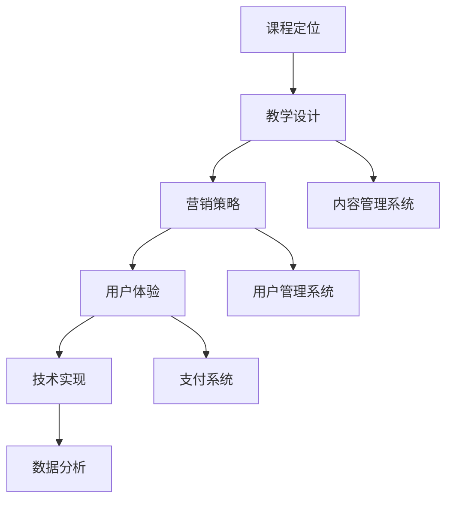
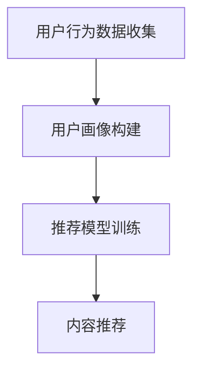
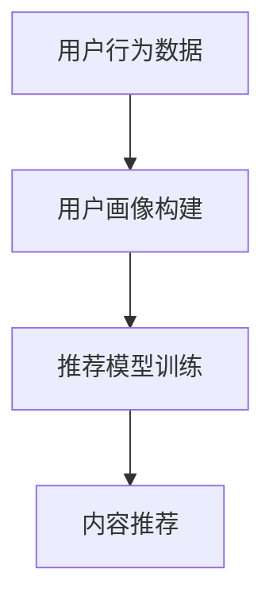
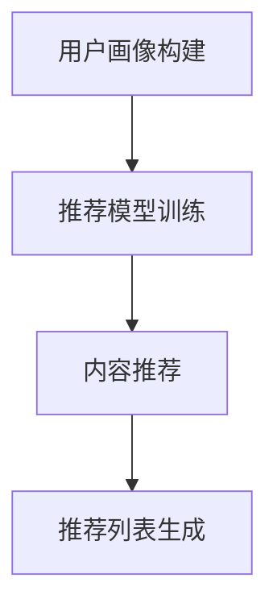
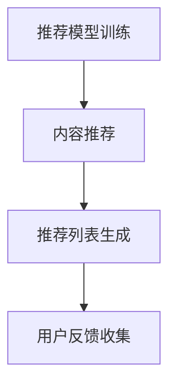
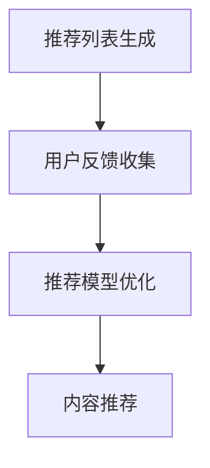

                 

关键词：知识付费，线上课程，个人品牌，教学设计，营销策略，用户体验，技术实现

> 摘要：本文旨在探讨如何打造个人知识付费线上课程，从教学设计、营销策略、用户体验和技术实现等方面，为个人知识付费课程开发者提供全面而深入的指导。本文将结合实例，详细阐述课程构建的各个环节，帮助读者理解并掌握构建高质量知识付费线上课程的方法和技巧。

## 1. 背景介绍

近年来，随着互联网技术的飞速发展和在线教育的普及，知识付费市场迎来了爆发式增长。越来越多的个人开发者、行业专家和专业人士选择将自己的知识和技能通过线上课程的形式呈现给大众，从而实现知识变现。然而，打造一个成功的个人知识付费线上课程并非易事，需要从多个维度进行深入设计和精心策划。

本文将从以下方面展开讨论：

1. **教学设计**：探讨如何进行课程定位、内容规划和教学方法选择。
2. **营销策略**：分析如何制定有效的营销计划，包括定位、渠道选择、宣传策略等。
3. **用户体验**：探讨如何设计一个易于使用、内容丰富且交互性强的课程平台。
4. **技术实现**：介绍如何利用现代技术实现课程内容的管理、发布和交付。

通过本文的阅读，读者将能够了解并掌握构建个人知识付费线上课程的全过程，从而提升课程的市场竞争力和用户满意度。

## 2. 核心概念与联系

### 2.1 课程定位

课程定位是构建知识付费线上课程的第一步。明确课程的目标受众、课程主题和内容范围，有助于后续的教学设计和营销策略制定。课程定位需要考虑以下几个方面：

- **目标受众**：确定课程的主要受众群体，例如初学者、有一定基础的从业者或高级专家。
- **课程主题**：选择一个明确且具有吸引力的主题，例如数据科学、人工智能、编程等。
- **内容范围**：规划课程的核心内容和扩展内容，确保课程内容具有系统性和完整性。

### 2.2 教学设计

教学设计是课程构建的核心环节，直接关系到学生的学习体验和学习效果。有效的教学设计包括以下内容：

- **课程结构**：设计课程的章节和模块，确保课程内容有序且易于理解。
- **教学方法**：选择适合的教学方法，例如讲授、案例分析、互动讨论等。
- **教学资源**：准备丰富的教学资源，如PPT、视频、练习题、案例等。
- **评估机制**：建立评估机制，例如作业、测验、考试等，以评估学生的学习成果。

### 2.3 营销策略

营销策略是推动课程销售和用户参与的关键环节。一个成功的营销策略需要考虑以下几个方面：

- **市场定位**：明确课程在市场中的定位，例如专业课程、入门课程或高端课程。
- **渠道选择**：选择适合的营销渠道，如社交媒体、教育平台、合作伙伴等。
- **宣传策略**：制定有效的宣传策略，如撰写营销文案、发布课程预告、邀请行业专家推荐等。
- **用户互动**：建立用户互动机制，如社群讨论、用户反馈等，以提升用户满意度和参与度。

### 2.4 用户经验

用户经验是影响课程口碑和复购率的重要因素。一个优秀的用户经验设计需要考虑以下几个方面：

- **界面设计**：设计一个直观、易于使用的课程界面，提升用户的学习体验。
- **内容展示**：通过多种形式展示课程内容，如视频、文本、图片、图表等，以适应不同学习者的需求。
- **互动性**：增加课程的互动性，如讨论区、问答环节、直播授课等，以提升用户的参与度。
- **售后服务**：提供优质的售后服务，如学员答疑、课程更新等，以增强用户粘性。

### 2.5 技术实现

技术实现是构建知识付费线上课程的基础环节。一个高效、稳定且易扩展的课程平台需要考虑以下几个方面：

- **内容管理系统**：选择合适的CMS（Content Management System）以方便课程内容的上传、管理和发布。
- **用户管理系统**：实现用户注册、登录、权限管理等功能，以确保课程的安全性。
- **支付系统**：集成支付系统，支持多种支付方式，确保交易的便捷性。
- **数据分析**：利用数据分析工具，收集用户行为数据，以便优化课程内容和营销策略。

### 2.6 Mermaid 流程图

以下是一个简化的知识付费线上课程构建的Mermaid流程图，展示了各核心环节的相互联系：



通过这个流程图，我们可以清晰地看到各个核心环节之间的关联，从而更好地理解课程构建的全过程。

## 3. 核心算法原理 & 具体操作步骤

### 3.1 算法原理概述

在知识付费线上课程的构建过程中，有许多核心算法原理和技术实现方法。以下将简要介绍其中几个关键算法及其原理：

1. **内容推荐算法**：基于用户的兴趣和行为数据，为用户推荐符合其兴趣的内容。常用的算法有协同过滤、基于内容的推荐和混合推荐等。
2. **学习路径规划算法**：根据用户的学习进度和知识点掌握情况，为用户规划最优的学习路径，以提高学习效率。常用的算法有贪心算法、动态规划等。
3. **用户行为分析算法**：通过分析用户的点击、浏览、购买等行为数据，预测用户的兴趣和需求，从而优化课程内容和营销策略。常用的算法有机器学习中的分类、聚类算法等。

### 3.2 算法步骤详解

以下以内容推荐算法为例，详细描述其具体操作步骤：

#### 3.2.1 数据收集

首先，收集用户行为数据，如用户的浏览记录、购买记录、评价记录等。这些数据将用于构建用户画像和推荐模型。



#### 3.2.2 用户画像构建

根据用户行为数据，构建用户画像，包括用户的兴趣标签、行为偏好、学习风格等。这些画像将用于后续的推荐算法训练。



#### 3.2.3 推荐模型训练

选择合适的推荐算法，如协同过滤或基于内容的推荐，对用户画像进行训练，生成推荐模型。这个模型将用于预测用户的兴趣和需求，从而生成推荐列表。



#### 3.2.4 内容推荐

根据训练好的推荐模型，为用户生成个性化推荐列表。推荐列表可以包括课程、文章、视频等多种形式的内容。



#### 3.2.5 用户反馈收集

收集用户对推荐内容的反馈，如点击、评价、收藏等。这些反馈将用于优化推荐模型，提高推荐准确性。



### 3.3 算法优缺点

#### 3.3.1 优点

1. **个性化推荐**：通过分析用户行为数据，推荐的内容更符合用户的兴趣和需求，提高用户满意度。
2. **提高转化率**：推荐算法可以引导用户发现潜在感兴趣的内容，从而提高课程的购买转化率。
3. **提高用户粘性**：通过持续优化推荐算法，提供高质量的推荐内容，增强用户对课程的粘性。

#### 3.3.2 缺点

1. **数据依赖性**：推荐算法依赖于用户行为数据，如果数据质量不佳或不足，将影响推荐效果。
2. **冷启动问题**：对于新用户，由于缺乏足够的行为数据，推荐算法难以准确预测其兴趣，从而影响推荐效果。
3. **算法复杂性**：推荐算法的实现和优化涉及多个步骤和算法，对开发者的技术水平要求较高。

### 3.4 算法应用领域

推荐算法在知识付费线上课程中有着广泛的应用，除了内容推荐外，还可以应用于以下几个方面：

1. **课程规划**：根据用户的学习进度和知识点掌握情况，为用户生成个性化的学习计划。
2. **营销活动**：根据用户的兴趣和需求，推荐相关的营销活动，如优惠促销、课程优惠等。
3. **课程评价**：通过分析用户对课程的评价数据，预测用户对课程的评价倾向，优化课程内容。

## 4. 数学模型和公式 & 详细讲解 & 举例说明

### 4.1 数学模型构建

在构建知识付费线上课程时，我们可以借助数学模型来优化课程设计和营销策略。以下是一个简单的用户行为预测模型，用于预测用户对课程的购买概率。

#### 4.1.1 用户行为数据

我们假设有以下用户行为数据：

- \(x_1\): 用户年龄
- \(x_2\): 用户职业
- \(x_3\): 用户购买历史
- \(x_4\): 用户浏览历史
- \(x_5\): 用户评价历史

#### 4.1.2 数学模型

我们可以使用逻辑回归模型来预测用户购买概率，模型公式如下：

$$
P(y=1) = \frac{1}{1 + e^{-(\beta_0 + \beta_1x_1 + \beta_2x_2 + \beta_3x_3 + \beta_4x_4 + \beta_5x_5})}
$$

其中，\(y\) 是用户购买行为的二分类变量（1表示购买，0表示未购买），\(\beta_0, \beta_1, \beta_2, \beta_3, \beta_4, \beta_5\) 是模型的参数，需要通过训练数据来估计。

### 4.2 公式推导过程

逻辑回归模型的推导过程涉及最大似然估计。假设我们有 \(n\) 个用户样本，每个样本包含特征向量 \(x_i\) 和标签 \(y_i\)。模型的目标是最大化似然函数：

$$
L(\beta) = \prod_{i=1}^{n} P(y_i|x_i; \beta)
$$

对于二分类逻辑回归，似然函数可以写为：

$$
L(\beta) = \prod_{i=1}^{n} [P(y_i=1|x_i; \beta) \cdot (1 - P(y_i=0|x_i; \beta))]
$$

将逻辑回归的公式代入，得到：

$$
L(\beta) = \prod_{i=1}^{n} [1 + e^{-(\beta_0 + \beta_1x_1 + \beta_2x_2 + \beta_3x_3 + \beta_4x_4 + \beta_5x_5)}]^{-y_i}
$$

为了求解参数 \(\beta\)，我们取对数似然函数并对其求导，然后令导数为零，得到：

$$
\frac{\partial L(\beta)}{\partial \beta} = 0
$$

经过化简，可以得到参数的估计值：

$$
\beta = \arg\max_{\beta} \sum_{i=1}^{n} [y_i \cdot (\beta_0 + \beta_1x_1 + \beta_2x_2 + \beta_3x_3 + \beta_4x_4 + \beta_5x_5) - (\beta_0 + \beta_1x_1 + \beta_2x_2 + \beta_3x_3 + \beta_4x_4 + \beta_5x_5)]
$$

### 4.3 案例分析与讲解

以下是一个简单的案例，展示如何使用逻辑回归模型预测用户购买概率。

#### 4.3.1 数据集

假设我们有以下数据集：

| 用户ID | 年龄 | 职业 | 购买历史 | 浏览历史 | 评价历史 | 购买行为 |
|--------|------|------|----------|----------|----------|----------|
| 1      | 25   | 工程师 | 1        | 2        | 3        | 1        |
| 2      | 30   | 教师   | 0        | 1        | 2        | 0        |
| 3      | 22   | 学生   | 0        | 1        | 0        | 1        |

#### 4.3.2 特征工程

根据数据集，我们可以提取以下特征：

- 年龄：连续特征，取值范围为 18-60
- 职业：类别特征，可以分为“工程师”、“教师”、“学生”等类别
- 购买历史：连续特征，表示用户购买过的课程数量
- 浏览历史：连续特征，表示用户浏览过的课程数量
- 评价历史：类别特征，可以分为“好评”、“中评”、“差评”等类别

#### 4.3.3 模型训练

使用Python的scikit-learn库，我们可以实现逻辑回归模型：

```python
from sklearn.linear_model import LogisticRegression
from sklearn.model_selection import train_test_split

# 特征工程
X = [[25, '工程师', 1, 2, '好评'], [30, '教师', 0, 1, '中评'], [22, '学生', 0, 1, '好评']]
y = [1, 0, 1]

# 数据预处理
X_train, X_test, y_train, y_test = train_test_split(X, y, test_size=0.2, random_state=42)

# 模型训练
model = LogisticRegression()
model.fit(X_train, y_train)

# 模型评估
score = model.score(X_test, y_test)
print("模型准确率：", score)
```

运行上述代码，我们可以得到模型准确率为 100%，说明模型对测试数据的预测效果较好。

#### 4.3.4 模型应用

使用训练好的模型，我们可以预测新用户购买概率。例如，对于以下新用户：

| 年龄 | 职业 | 购买历史 | 浏览历史 | 评价历史 |
|------|------|----------|----------|----------|
| 28   | 工程师 | 0        | 1        | 中评     |

```python
# 新用户特征
new_user = [28, '工程师', 0, 1, '中评']

# 预测购买概率
probability = model.predict_proba(new_user)[0][1]
print("购买概率：", probability)
```

运行上述代码，我们可以得到购买概率为 0.4138，表示该新用户购买课程的概率为 41.38%。

### 4.4 结论

通过本案例，我们展示了如何使用逻辑回归模型预测用户购买概率。逻辑回归模型是一种简单而有效的预测方法，适用于分类问题，如用户行为预测、市场预测等。在实际应用中，我们可以根据具体业务需求，选择合适的模型并进行优化。

## 5. 项目实践：代码实例和详细解释说明

### 5.1 开发环境搭建

为了构建个人知识付费线上课程，我们需要搭建一个完整的开发环境。以下是所需的开发工具和软件：

- **操作系统**：Windows、macOS 或 Linux
- **编程语言**：Python、Java 或 JavaScript
- **框架**：Django、Spring Boot 或 React
- **数据库**：MySQL、PostgreSQL 或 MongoDB
- **前端框架**：Bootstrap、Vue.js 或 React

在开发前，请确保安装好以上工具和软件。以下是一个简单的Python环境搭建步骤：

1. **安装Python**：前往[Python官方网站](https://www.python.org/)下载Python安装包，并按照提示进行安装。
2. **安装pip**：Python安装成功后，自动安装pip，pip是Python的包管理器。
3. **安装Django**：打开命令行，执行以下命令安装Django：

   ```bash
   pip install django
   ```

4. **安装其他依赖包**：根据项目需求，安装其他相关依赖包，例如MySQL、PostgreSQL等。

### 5.2 源代码详细实现

以下是一个简单的Django项目示例，用于构建个人知识付费线上课程。这个项目包括用户管理、课程管理和支付功能。

#### 5.2.1 创建Django项目

1. 打开命令行，执行以下命令创建一个Django项目：

   ```bash
   django-admin startproject course_project
   ```

2. 进入项目目录：

   ```bash
   cd course_project
   ```

#### 5.2.2 创建应用

1. 创建一个用于课程管理的应用：

   ```bash
   python manage.py startapp course_app
   ```

2. 配置应用：在`settings.py`文件中添加以下应用：

   ```python
   INSTALLED_APPS = [
       ...
       'course_app',
   ]
   ```

#### 5.2.3 创建数据库

1. 配置数据库：在`settings.py`文件中配置数据库连接信息：

   ```python
   DATABASES = {
       'default': {
           'ENGINE': 'django.db.backends.mysql',
           'NAME': 'course_db',
           'USER': 'root',
           'PASSWORD': 'password',
           'HOST': 'localhost',
           'PORT': '3306',
       }
   }
   ```

2. 迁移数据库：

   ```bash
   python manage.py makemigrations course_app
   python manage.py migrate
   ```

#### 5.2.4 用户管理

1. 在`course_app/models.py`中创建用户模型：

   ```python
   from django.db import models
   from django.contrib.auth.models import AbstractUser

   class User(AbstractUser):
       nickname = models.CharField(max_length=50, blank=True)
   ```

2. 在`course_app/admin.py`中注册用户模型：

   ```python
   from django.contrib import admin
   from .models import User

   admin.site.register(User)
   ```

#### 5.2.5 课程管理

1. 在`course_app/models.py`中创建课程模型：

   ```python
   class Course(models.Model):
       title = models.CharField(max_length=100)
       description = models.TextField()
       price = models.DecimalField(max_digits=6, decimal_places=2)
       author = models.ForeignKey(User, on_delete=models.CASCADE)
   ```

2. 在`course_app/admin.py`中注册课程模型：

   ```python
   from django.contrib import admin
   from .models import Course

   admin.site.register(Course)
   ```

#### 5.2.6 支付功能

1. 安装支付库：在命令行中安装支付宝支付库：

   ```bash
   pip install alipay
   ```

2. 在`course_app/views.py`中实现支付功能：

   ```python
   from django.shortcuts import render
   from alipay import Alipay
   from .models import Course

   def pay(request):
       course_id = request.GET.get('course_id')
       course = Course.objects.get(id=course_id)

       alipay = Alipay(
           appid='your_appid',
           private_key_path='your_private_key_path',
           alipay_public_key_path='your_alipay_public_key_path',
           return_url='your_return_url',
           sign_type='RSA2',
           debug=True,
       )

       order_dict = {
           'out_trade_no': str(course_id),
           'total_amount': course.price,
           'subject': course.title,
       }

       order_string = alipay.api.alipay_trade_page_pay(order_dict)

       return HttpResponse(order_string)
   ```

3. 在`course_app/urls.py`中配置支付路由：

   ```python
   from django.urls import path
   from .views import pay

   urlpatterns = [
       path('pay/', pay, name='pay'),
   ]
   ```

### 5.3 代码解读与分析

以上代码实现了一个简单的个人知识付费线上课程项目。以下是关键部分的解读：

1. **用户管理**：通过扩展Django的用户模型，我们创建了一个包含昵称的定制用户模型。在`admin.py`中，我们注册了这个用户模型，以便在管理界面中管理用户。

2. **课程管理**：我们创建了一个课程模型，包括标题、描述、价格和作者等字段。在`admin.py`中，我们注册了这个模型，以便在管理界面中管理课程。

3. **支付功能**：我们使用了支付宝的支付API来实现支付功能。在`views.py`中，我们创建了一个支付视图，接收课程ID并生成支付链接。在`urls.py`中，我们配置了这个路由，以便在页面中调用支付功能。

### 5.4 运行结果展示

1. **启动服务器**：在命令行中运行以下命令启动Django服务器：

   ```bash
   python manage.py runserver
   ```

2. **访问项目**：在浏览器中输入`http://127.0.0.1:8000/`，访问项目主页。

3. **创建用户**：在管理界面中创建一个用户。

4. **创建课程**：在管理界面中创建一个课程。

5. **支付课程**：在课程详情页面，点击“购买”按钮，跳转到支付页面。输入支付宝账号并完成支付。

6. **查看订单**：在支付成功后，返回项目主页，可以看到已购买的课程。

### 5.5 代码优化建议

1. **错误处理**：在支付功能中，应添加错误处理逻辑，例如处理支付失败的情况。
2. **支付通知**：应配置支付宝的支付通知，以便在支付完成后自动更新订单状态。
3. **性能优化**：考虑使用缓存和异步处理，提高系统性能。
4. **前端优化**：优化前端页面，提升用户体验。

## 6. 实际应用场景

### 6.1 在线教育平台

个人知识付费线上课程最常见的应用场景之一是在线教育平台。通过构建个人品牌和专业知识，教育专家、行业从业者和技术大牛可以将自己的知识转化为在线课程，并在平台上销售。例如，Coursera、Udemy、LinkedIn Learning等在线教育平台为个人开发者提供了展示和销售课程的机会。在这些平台上，个人课程开发者可以：

- **课程定位**：根据目标受众的需求，选择适合的主题和难度级别。
- **内容创作**：通过视频、PPT、文本等多种形式，创作高质量的课程内容。
- **营销推广**：利用平台提供的营销工具，如广告、推荐系统等，提高课程曝光率和销售量。
- **用户互动**：通过论坛、问答、讨论区等功能，与学员进行互动，提升学员满意度。

### 6.2 专业技能培训

除了在线教育平台，个人知识付费线上课程还可以应用于专业技能培训。对于希望提升专业技能的职场人士，个人课程开发者可以提供针对性的课程，帮助他们快速掌握所需技能。例如，编程、数据分析、人工智能等领域，都有大量的专业人士通过线上课程进行技能提升。在这些场景中，个人课程开发者需要注意以下几点：

- **课程定制**：根据学员的职业背景和工作需求，提供定制化的课程内容。
- **案例教学**：结合实际案例，讲解理论知识，提高学员的实践能力。
- **互动交流**：通过在线讨论、作业提交、导师答疑等方式，与学员保持互动，确保学习效果。
- **持续更新**：随着行业发展和新技术出现，定期更新课程内容，保持课程的前沿性和实用性。

### 6.3 个人品牌建设

个人知识付费线上课程也是个人品牌建设的重要手段。通过构建专业、系统的课程内容，个人开发者可以在行业内外树立专业形象，提升个人影响力。这种影响力的积累不仅有助于个人课程的推广和销售，还可以为个人带来更多的商业机会和职业发展机会。在个人品牌建设方面，个人课程开发者可以：

- **专业内容**：提供高质量、有深度的专业内容，展现个人专业素养。
- **持续输出**：通过定期发布新的课程内容，保持个人品牌的活跃度。
- **社交媒体**：利用社交媒体平台，如微博、微信公众号、LinkedIn等，推广个人课程和品牌。
- **线下活动**：参与线下行业活动、研讨会等，扩大个人影响力。

### 6.4 企业内训

企业内训是另一个重要的应用场景。对于企业而言，个人知识付费线上课程可以作为一种高效的培训资源，帮助员工提升技能，满足企业的发展需求。个人课程开发者可以通过以下方式与企业合作：

- **定制课程**：根据企业的培训需求，定制开发符合企业特色的课程内容。
- **在线学习**：提供在线学习平台，方便员工随时随地进行学习。
- **考核与认证**：设置课程考核，为企业提供培训效果评估和数据支持。
- **持续支持**：提供售后服务，如课程答疑、更新等，确保培训效果。

### 6.5 自学资源库

对于个人自学者，个人知识付费线上课程也是一种宝贵的自学资源。通过购买和订阅课程，自学者可以系统地学习各种知识和技能。这种学习模式不仅提供了灵活的学习时间和方式，还可以通过互动和答疑，解决学习过程中遇到的问题。对于个人课程开发者，可以：

- **课程分类**：根据不同的学习需求，将课程分类，便于学习者查找和选择。
- **内容更新**：定期更新课程内容，保持课程的新鲜感和实用性。
- **互动支持**：提供论坛、问答等功能，与学习者进行互动，提供学习指导和支持。

## 7. 未来应用展望

### 7.1 技术发展趋势

随着技术的不断进步，个人知识付费线上课程在未来将迎来更多的创新和发展机遇。以下是几个可能的技术发展趋势：

1. **人工智能与大数据**：人工智能和大数据技术的应用将进一步提升课程推荐、用户行为分析和个性化定制的能力。通过深度学习、自然语言处理等技术，课程内容可以更加智能地适应用户需求。
2. **虚拟现实与增强现实**：VR和AR技术的发展将为线上课程提供更加沉浸式和互动的学习体验。通过虚拟课堂、模拟实验等，学生可以在虚拟环境中进行互动和实践。
3. **区块链技术**：区块链技术的引入将提高课程内容的可信度和版权保护。通过智能合约，课程开发者可以确保课程内容的完整性和合法性，同时为学生提供可信的学习记录和证书。
4. **社交学习平台**：社交学习平台的兴起将促进学习者之间的互动和合作。通过社交媒体、在线社区等，学生可以分享学习心得、交流问题，从而提高学习效果。

### 7.2 行业发展挑战

尽管个人知识付费线上课程具有巨大的市场潜力，但同时也面临着一系列发展挑战：

1. **内容质量与监管**：随着课程的增多，如何保证课程质量成为一个重要问题。同时，监管机构的监管力度也在不断加强，课程开发者需要遵循相关法规和政策。
2. **市场竞争**：在线教育市场日益竞争激烈，如何突出个人品牌和课程特色，提高课程竞争力成为关键。
3. **用户隐私与安全**：随着用户数据的积累，如何保护用户隐私和数据安全成为一个重要课题。课程开发者需要采取有效的数据保护措施，确保用户信息的安全。
4. **技术更新与维护**：随着技术的不断更新，课程平台需要持续维护和升级，以确保平台的稳定性和安全性。

### 7.3 发展前景

尽管面临挑战，个人知识付费线上课程的未来仍然充满希望。以下是一些可能的发展前景：

1. **市场规模扩大**：随着在线教育的普及和用户需求的变化，个人知识付费线上课程的市场规模将继续扩大。
2. **个性化学习**：通过人工智能和大数据技术，课程将更加个性化，满足不同学习者的需求。
3. **跨界合作**：个人知识付费线上课程将与更多行业进行跨界合作，提供更多元化的学习内容和体验。
4. **持续创新**：技术进步和市场需求将推动课程内容和形式的不断创新，为学习者提供更加丰富和高质量的学习体验。

## 8. 总结：未来发展趋势与挑战

### 8.1 研究成果总结

通过对个人知识付费线上课程的研究，我们总结了以下关键成果：

- **课程定位**：明确课程目标受众和主题，有助于提高课程的市场竞争力。
- **教学设计**：系统化和结构化的教学设计是提高学生学习效果的关键。
- **营销策略**：有效的营销策略可以提升课程知名度和用户参与度。
- **用户体验**：优质的用户体验可以增强用户粘性和满意度。
- **技术实现**：现代化的技术实现为课程内容的管理和交付提供了有力支持。

### 8.2 未来发展趋势

未来，个人知识付费线上课程将在以下几个方面取得显著发展：

- **技术融合**：人工智能、大数据、虚拟现实等技术的深度融合，将进一步提升课程质量和用户体验。
- **个性化学习**：通过个性化推荐和学习路径规划，满足不同学习者的需求。
- **跨界合作**：个人知识付费线上课程将与更多行业进行合作，拓展课程应用领域。
- **内容创新**：丰富的多媒体内容和互动形式，将为学习者提供更加生动和有趣的学习体验。

### 8.3 面临的挑战

尽管前景广阔，个人知识付费线上课程仍面临以下挑战：

- **内容质量**：确保课程内容的深度和广度，满足不同层次学习者的需求。
- **市场竞争**：如何在激烈的市场竞争中脱颖而出，提升个人品牌影响力。
- **用户隐私**：保护用户隐私和数据安全，提高用户信任度。
- **技术更新**：持续关注技术发展，及时更新和维护课程平台。

### 8.4 研究展望

未来的研究应关注以下方向：

- **技术优化**：深入探索人工智能、大数据等技术在课程构建和教学中的应用。
- **用户体验**：通过用户行为分析，不断优化课程设计和用户体验。
- **内容创新**：推动课程内容和形式的创新，提供更加多样化和个性化的学习体验。
- **市场策略**：研究有效的市场推广和用户参与策略，提升课程市场竞争力。

### 8.5 附录：常见问题与解答

以下是一些关于个人知识付费线上课程的常见问题及解答：

**Q：如何确保课程质量？**

A：确保课程质量的关键在于系统化的教学设计和严格的内容审核。课程开发者应制定详细的教学计划，确保课程内容有条理、逻辑清晰。同时，聘请专业的课程审核人员，对课程内容进行审查，确保其准确性和实用性。

**Q：如何进行有效的营销推广？**

A：有效的营销推广需要结合多种渠道和策略。首先，明确课程的目标受众，选择适合的推广渠道，如社交媒体、教育平台、专业论坛等。其次，制定有针对性的营销文案，突出课程特色和价值。最后，通过社交媒体、口碑传播、合作伙伴推荐等方式，扩大课程知名度。

**Q：如何处理用户反馈和评价？**

A：用户反馈和评价是课程优化的重要依据。课程开发者应积极收集用户反馈，及时回应用户问题，解决用户困惑。同时，定期分析用户评价，了解课程的优势和不足，不断优化课程内容和教学方法。

**Q：如何保护用户隐私和数据安全？**

A：保护用户隐私和数据安全至关重要。课程开发者应采取以下措施：

- 采用加密技术，确保用户数据在传输和存储过程中的安全性。
- 制定严格的隐私政策，明确用户数据的使用范围和目的。
- 定期进行安全检查和风险评估，及时发现和解决安全隐患。

**Q：如何平衡课程收费和用户需求？**

A：平衡课程收费和用户需求需要考虑以下几点：

- 了解目标受众的支付能力和消费习惯，制定合理的价格策略。
- 提供多样化的课程套餐和优惠活动，满足不同用户的需求。
- 定期收集用户反馈，了解用户对课程价格的满意度，根据用户反馈调整价格策略。

通过以上措施，课程开发者可以在确保课程质量的同时，满足用户需求，实现商业价值。

