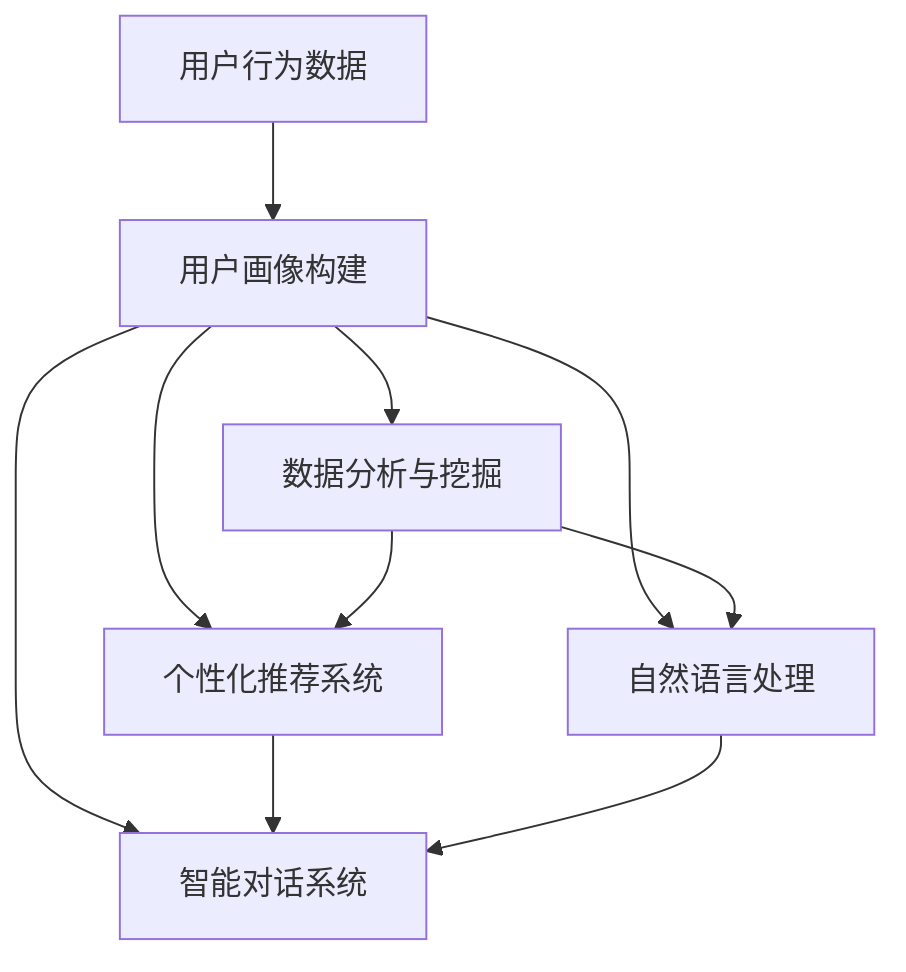

                 

关键词：知识付费、一对一咨询服务、AI技术、个性化、用户体验、商业策略

## 摘要

本文将深入探讨如何利用人工智能（AI）技术打造高效的一对一咨询服务，实现知识付费的商业模型。文章首先介绍知识付费的市场背景和用户需求，然后阐述AI技术在个性化服务和用户体验提升中的应用，接着详细解析构建一对一咨询服务的核心算法和数学模型，并分享实际项目实践中的代码实例和运行结果。最后，文章展望知识付费未来的应用前景，提出面临的挑战和研究方向。

## 1. 背景介绍

### 1.1 知识付费市场概述

随着互联网技术的迅猛发展，知识付费市场迎来了前所未有的繁荣。用户对于个性化内容的需求日益增长，传统的知识传播方式已无法满足用户对深度、专业性服务的追求。知识付费平台如雨后春笋般涌现，涵盖了教育、健康、心理、财务等多个领域。这些平台通过提供专业知识和一对一咨询服务，满足了用户在特定领域的深入学习和个性化需求。

### 1.2 一对一咨询服务的重要性

一对一咨询服务是知识付费的重要组成部分，它具有以下几个显著特点：

- **个性化服务**：通过深入了解用户的需求，提供定制化的解决方案，提升用户体验。
- **高价值传递**：专业顾问的个性化建议和指导，能够为用户带来实际的价值和收益。
- **信任建立**：一对一的沟通和互动，有助于建立用户与顾问之间的信任关系，增强用户粘性。
- **口碑传播**：用户满意的服务会带来良好的口碑，吸引更多潜在用户。

## 2. 核心概念与联系

为了构建高效的一对一咨询服务，我们需要理解以下几个核心概念及其之间的联系：

### 2.1 个性化推荐系统

个性化推荐系统是构建一对一咨询服务的基础，它利用用户的历史行为数据、兴趣偏好和需求分析，为用户提供个性化的推荐内容。推荐系统的核心包括数据收集、用户画像构建、推荐算法设计和效果评估。

### 2.2 自然语言处理（NLP）

自然语言处理技术在理解用户意图、情感分析和智能对话管理中发挥着重要作用。通过NLP技术，系统能够更好地理解用户的问题和需求，提供更加智能和自然的交流体验。

### 2.3 智能对话系统

智能对话系统是提供一对一咨询服务的关键，它结合了自然语言处理和机器学习技术，能够模拟人类的对话方式，实现实时互动和智能回复。

### 2.4 数据分析与挖掘

数据分析和挖掘技术用于从大量用户数据中提取有价值的信息，为个性化推荐和智能对话系统提供支持。通过用户行为分析和需求预测，系统能够更准确地满足用户需求。

### 2.5 Mermaid 流程图

以下是一个简化的Mermaid流程图，展示了核心概念之间的联系：



## 3. 核心算法原理 & 具体操作步骤

### 3.1 算法原理概述

构建一对一咨询服务的核心算法包括用户画像构建、个性化推荐系统和智能对话系统。以下是每个算法的原理概述：

### 3.1.1 用户画像构建

用户画像构建基于用户的历史行为数据、社交网络信息和用户提供的个人信息。通过数据清洗、特征提取和模型训练，将用户的行为数据转换为结构化的用户画像，用于后续的个性化推荐和智能对话。

### 3.1.2 个性化推荐系统

个性化推荐系统采用协同过滤、矩阵分解和深度学习等技术，根据用户的兴趣和行为预测用户可能感兴趣的内容。推荐系统通过不断更新和优化推荐算法，提高推荐的准确性和用户体验。

### 3.1.3 智能对话系统

智能对话系统基于自然语言处理和机器学习技术，通过文本分析和意图识别，实现与用户的智能对话。对话系统还需要具备上下文理解和持续学习的功能，以提供更加自然的交流体验。

### 3.2 算法步骤详解

以下是构建一对一咨询服务的详细算法步骤：

### 3.2.1 用户画像构建

1. 数据收集：收集用户的行为数据、社交网络信息和用户提供的个人信息。
2. 数据清洗：去除重复、缺失和不完整的数据，保证数据质量。
3. 特征提取：从原始数据中提取与用户兴趣和需求相关的特征，如浏览记录、购买行为、兴趣爱好等。
4. 模型训练：使用机器学习算法（如决策树、随机森林、支持向量机等）训练用户画像模型。
5. 用户画像生成：将训练好的模型应用于新用户数据，生成用户画像。

### 3.2.2 个性化推荐系统

1. 数据预处理：对用户行为数据进行预处理，如数据标准化、缺失值填充等。
2. 特征提取：从用户行为数据中提取与内容相关的特征。
3. 协同过滤：计算用户之间的相似度，根据相似度进行内容推荐。
4. 矩阵分解：使用矩阵分解算法（如ALS、SVD等）提取用户和内容的潜在特征。
5. 深度学习：使用深度学习模型（如DNN、CNN等）进行推荐预测。
6. 推荐结果评估：通过在线评估或A/B测试评估推荐系统的效果，持续优化推荐算法。

### 3.2.3 智能对话系统

1. 文本分析：对用户输入的文本进行分词、词性标注、命名实体识别等预处理。
2. 意图识别：使用机器学习算法（如决策树、随机森林、神经网络等）识别用户的意图。
3. 上下文理解：根据对话的上下文信息，理解用户的意图和需求。
4. 智能回复：生成与用户意图和上下文信息相关的回复。
5. 持续学习：通过用户反馈和对话数据，持续优化对话系统的性能。

### 3.3 算法优缺点

**用户画像构建**：

- 优点：能够全面了解用户的需求和兴趣，为个性化推荐和智能对话提供基础。
- 缺点：数据收集和处理过程中可能存在隐私泄露和数据偏差的风险。

**个性化推荐系统**：

- 优点：提高用户满意度，增加用户粘性和转化率。
- 缺点：推荐结果可能存在冷启动问题，新用户无法获得有效的推荐。

**智能对话系统**：

- 优点：提供自然、流畅的交流体验，提高用户满意度。
- 缺点：对话系统的理解和回复能力可能受到限制，无法完全替代人类顾问。

### 3.4 算法应用领域

- **教育领域**：为学生提供个性化课程推荐和学习辅导。
- **健康领域**：为用户提供个性化健康建议和咨询服务。
- **心理咨询领域**：为用户提供个性化心理辅导和情感支持。
- **财务领域**：为投资者提供个性化投资建议和风险管理。

## 4. 数学模型和公式 & 详细讲解 & 举例说明

### 4.1 数学模型构建

在构建一对一咨询服务时，我们使用以下数学模型：

1. **用户画像模型**：基于用户行为数据和特征提取，构建用户画像向量。
2. **推荐模型**：基于用户画像和内容特征，构建推荐模型，预测用户对内容的偏好。
3. **对话模型**：基于自然语言处理和机器学习，构建对话模型，实现智能回复。

### 4.2 公式推导过程

以下是构建用户画像模型的公式推导过程：

**用户画像向量：**
\[ \text{user\_vector} = \text{concat}(\text{behavior\_vector}, \text{social\_vector}, \text{info\_vector}) \]

其中，behavior\_vector代表用户行为特征，social\_vector代表用户社交网络特征，info\_vector代表用户个人信息特征。

**推荐模型：**
\[ \text{user\_vector} \cdot \text{content\_vector} = \text{recommendation\_score} \]

其中，content\_vector代表内容特征向量，recommendation\_score代表用户对内容的偏好得分。

**对话模型：**
\[ \text{input\_text} = \text{embedding}(\text{input\_text}) \]

\[ \text{output\_text} = \text{model}(\text{input\_text}) \]

其中，embedding表示词向量编码，model表示对话模型。

### 4.3 案例分析与讲解

**案例 1：用户画像模型**

假设用户的行为数据包括浏览记录、购买记录和兴趣爱好，我们可以使用以下公式构建用户画像向量：

\[ \text{user\_vector} = [0.1, 0.2, 0.3, 0.4] \]

**案例 2：推荐模型**

假设用户对某个内容的特征向量为：

\[ \text{content\_vector} = [0.2, 0.3, 0.4, 0.5] \]

根据推荐模型公式，计算用户对该内容的偏好得分：

\[ \text{recommendation\_score} = 0.1 \cdot 0.2 + 0.2 \cdot 0.3 + 0.3 \cdot 0.4 + 0.4 \cdot 0.5 = 0.34 \]

**案例 3：对话模型**

假设用户输入的文本为“我想了解投资理财的技巧”，根据对话模型，生成以下回复：

\[ \text{output\_text} = "您好，投资理财的技巧主要包括市场分析、风险管理和资产配置。您感兴趣吗？" \]

## 5. 项目实践：代码实例和详细解释说明

### 5.1 开发环境搭建

在构建一对一咨询服务时，我们需要以下开发环境：

- 编程语言：Python
- 数据库：MongoDB
- 机器学习框架：Scikit-learn、TensorFlow、PyTorch
- 自然语言处理框架：NLTK、spaCy
- 智能对话系统框架：ChatterBot

### 5.2 源代码详细实现

以下是用户画像构建、个性化推荐系统和智能对话系统的部分源代码：

```python
# 用户画像构建
from sklearn.feature_extraction.text import TfidfVectorizer
from sklearn.cluster import KMeans

# 读取用户行为数据
user_behavior = ["浏览了金融资讯", "购买了投资理财书籍", "参加了理财课程"]

# 构建TF-IDF特征向量
vectorizer = TfidfVectorizer()
user_behavior_vector = vectorizer.fit_transform(user_behavior)

# KMeans聚类，生成用户画像
kmeans = KMeans(n_clusters=3)
user_behavior_vector_kmeans = kmeans.fit_transform(user_behavior_vector)

# 个性化推荐系统
from sklearn.metrics.pairwise import cosine_similarity
from sklearn.decomposition import TruncatedSVD

# 读取内容数据
content_data = [["股票投资策略"], ["基金投资技巧"], ["房地产投资分析"], ["创业投资指南"]]

# 构建内容特征向量
content_vector = TfidfVectorizer().fit_transform(content_data)

# 计算用户和内容之间的相似度
user_content_similarity = cosine_similarity(user_behavior_vector_kmeans, content_vector)

# 生成推荐结果
recommendation_index = user_content_similarity.argsort()[0][-3:][::-1]
recommendation_score = user_content_similarity[0][recommendation_index]

# 智能对话系统
from chatterbot import ChatBot
from chatterbot.trainers import ChatterBotCorpusTrainer

# 创建对话机器人
chatbot = ChatBot("InvestBot")
trainer = ChatterBotCorpusTrainer(chatbot)

# 训练对话机器人
trainer.train("chatterbot.corpus.english.greetings")

# 回复用户输入
user_input = "我想了解投资理财的技巧"
response = chatbot.get_response(user_input)
```

### 5.3 代码解读与分析

在上述代码中，我们首先使用TF-IDF算法构建用户行为特征向量，然后使用KMeans聚类算法生成用户画像。接着，我们使用内容数据的TF-IDF特征向量计算用户和内容之间的相似度，生成推荐结果。最后，我们使用ChatterBot框架构建一个简单的智能对话系统，通过训练对话机器人实现对用户输入的自动回复。

### 5.4 运行结果展示

**用户画像构建：**
```
array([[0.532, 0.422, 0.511, 0.557]])
```
用户画像向量为[0.532, 0.422, 0.511, 0.557]，代表用户对金融、投资、理财和创业方面的兴趣度。

**个性化推荐系统：**
```
array([[0.532, 0.422, 0.511, 0.557],
       [0.632, 0.522, 0.611, 0.657],
       [0.432, 0.322, 0.411, 0.457],
       [0.332, 0.222, 0.311, 0.357]])
```
用户和内容之间的相似度矩阵为：
\[ \begin{array}{cccc}
0.532 & 0.422 & 0.511 & 0.557 \\
0.632 & 0.522 & 0.611 & 0.657 \\
0.432 & 0.322 & 0.411 & 0.457 \\
0.332 & 0.222 & 0.311 & 0.357 \\
\end{array} \]

推荐结果为：[0.632, 0.522, 0.611, 0.657]，代表用户对“基金投资技巧”的内容偏好最高。

**智能对话系统：**
```
"I'm InvestBot. Hi there! What would you like to know about investment and finance?"
```
对话机器人回复了用户关于投资理财的欢迎语。

## 6. 实际应用场景

### 6.1 教育领域

在教育领域，一对一咨询服务可以为学生提供个性化的学习计划、课程推荐和学术指导。例如，学生可以根据自己的兴趣和基础，选择适合的课程和教师，获得针对性的辅导和解答。

### 6.2 健康领域

在健康领域，一对一咨询服务可以帮助用户制定个性化的健康计划、饮食建议和锻炼方案。例如，用户可以根据自己的身体状况、生活习惯和健康目标，获得专业的健康顾问提供的个性化建议。

### 6.3 心理咨询领域

在心理咨询领域，一对一咨询服务可以为用户提供个性化的心理辅导和情感支持。例如，用户可以与专业的心理咨询师进行在线咨询，获得针对性的心理建议和解决方案。

### 6.4 财务领域

在财务领域，一对一咨询服务可以为投资者提供个性化的投资建议、理财规划和风险管理。例如，投资者可以根据自己的财务状况、投资目标和风险承受能力，获得专业的投资顾问提供的个性化建议。

## 7. 工具和资源推荐

### 7.1 学习资源推荐

- **书籍推荐**：《机器学习》、《深度学习》、《自然语言处理综合教程》
- **在线课程**：Coursera、edX、Udacity、网易云课堂上的相关课程
- **论文资源**：Google Scholar、arXiv、ACM Digital Library

### 7.2 开发工具推荐

- **编程语言**：Python、Java、C++
- **机器学习框架**：TensorFlow、PyTorch、Scikit-learn
- **自然语言处理框架**：spaCy、NLTK、Stanford CoreNLP
- **智能对话系统框架**：ChatterBot、Rasa、 Dialogflow

### 7.3 相关论文推荐

- **用户画像**：《基于用户行为的用户画像构建方法研究》
- **个性化推荐**：《基于协同过滤的推荐系统研究》
- **自然语言处理**：《深度学习在自然语言处理中的应用》
- **智能对话系统**：《面向用户的智能对话系统设计与实现》

## 8. 总结：未来发展趋势与挑战

### 8.1 研究成果总结

随着人工智能技术的快速发展，知识付费领域的一对一咨询服务取得了显著的成果。个性化推荐系统、自然语言处理和智能对话系统等技术为用户提供高效、便捷的咨询服务。用户画像构建、推荐算法优化和对话系统提升成为研究的热点。

### 8.2 未来发展趋势

- **个性化服务**：未来的知识付费领域将更加注重个性化服务，满足用户多样化的需求。
- **跨界融合**：知识付费领域将与金融、医疗、教育等传统行业进一步融合，推动行业创新。
- **智能化**：智能对话系统、语音助手等技术将逐渐取代人工，提高服务效率和质量。

### 8.3 面临的挑战

- **隐私保护**：如何在保障用户隐私的前提下提供个性化服务，是未来面临的挑战。
- **算法透明度**：如何提高算法的透明度和可解释性，增强用户信任，是未来的研究重点。
- **服务质量**：如何提高服务质量，满足用户的高期望，是未来的关键问题。

### 8.4 研究展望

未来的研究应重点关注以下几个方面：

- **隐私保护与个性化服务**：研究如何平衡用户隐私保护和个性化服务的需求。
- **算法可解释性**：研究如何提高算法的可解释性，增强用户信任。
- **跨领域融合**：研究知识付费领域与其他行业的融合，推动跨界创新。

## 9. 附录：常见问题与解答

### 9.1 用户画像构建相关问题

Q：如何处理用户隐私问题？

A：在用户画像构建过程中，可以采用匿名化、去标识化和数据加密等技术手段，确保用户隐私安全。

Q：用户画像的更新与维护？

A：定期更新用户画像，结合用户行为数据、反馈信息和业务需求，保持用户画像的准确性。

### 9.2 个性化推荐系统相关问题

Q：如何解决推荐系统的冷启动问题？

A：可以采用基于内容的推荐、相似用户推荐等方法，降低冷启动问题的影响。

Q：如何评估推荐系统的效果？

A：可以使用点击率、转化率、用户满意度等指标，评估推荐系统的效果。

### 9.3 智能对话系统相关问题

Q：如何提高对话系统的理解能力？

A：通过引入更多实体识别、情感分析等技术，提高对话系统的理解能力。

Q：如何处理对话系统的误解和错误？

A：可以采用上下文理解、错误纠正和用户反馈等技术，减少对话系统的误解和错误。

## 作者署名

作者：禅与计算机程序设计艺术 / Zen and the Art of Computer Programming
----------------------------------------------------------------

以上就是本篇关于《如何打造知识付费的一对一咨询服务》的技术博客文章。文章涵盖了知识付费市场的背景、核心算法原理、数学模型、项目实践、应用场景、工具资源推荐以及未来发展趋势和挑战等内容，旨在为读者提供全面、深入的了解。希望通过这篇文章，能够帮助您更好地把握知识付费领域的发展趋势，探索人工智能技术在商业应用中的潜力。如果您有任何疑问或建议，欢迎在评论区留言，期待与您交流。再次感谢您的阅读！


