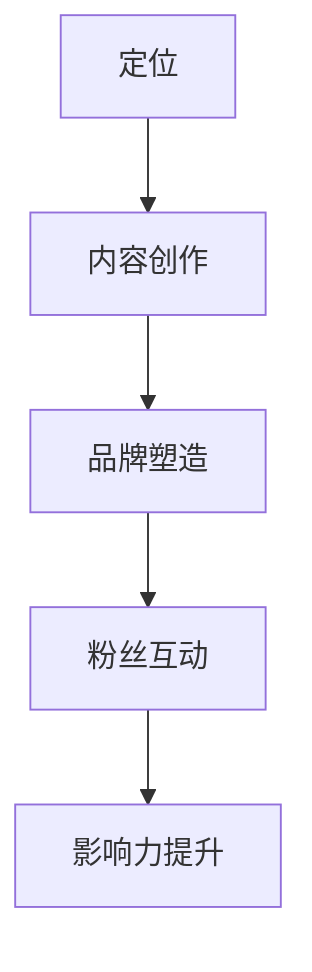

                 

 在当前知识经济时代，知识付费已成为一种重要的收入来源。无论是线上课程、专业书籍，还是专业咨询，都能为知识创作者带来丰厚的收益。而在这个领域，个人IP形象的重要性日益凸显。一个成功的个人IP不仅能吸引粉丝，还能提高知识产品的附加值和市场竞争力。本文将探讨如何打造知识付费的个人IP形象，帮助您在知识经济浪潮中脱颖而出。

> **关键词：知识付费、个人IP、品牌塑造、影响力、内容创作**

> **摘要：本文将从多个维度分析个人IP形象在知识付费领域的重要性，并给出具体的打造策略，帮助读者构建具有吸引力的个人IP，实现知识付费的成功。**

## 1. 背景介绍

在互联网的推动下，知识付费市场蓬勃发展。用户对高质量知识内容的需求不断增长，这为知识创作者提供了广阔的市场空间。然而，在这个竞争激烈的环境中，如何让自己的知识产品脱颖而出，成为每一个知识创作者需要深思的问题。个人IP形象作为一种独特的品牌标识，能够在众多产品中脱颖而出，成为知识付费成功的关键因素。

### 1.1 知识付费市场的现状

随着互联网技术的发展，知识付费已成为一种新兴的商业模式。以下是知识付费市场的一些现状：

- **市场规模**：根据行业报告，全球知识付费市场规模已超过1000亿美元，且仍在持续增长。

- **用户群体**：知识付费用户主要集中在25-45岁之间，高学历、高收入人群是主要消费群体。

- **产品形式**：知识付费产品形式多样化，包括线上课程、专业书籍、音频节目、专业咨询等。

- **竞争态势**：市场参与者众多，竞争激烈，个人IP形象成为差异化的重要手段。

### 1.2 个人IP形象的重要性

在知识付费市场中，个人IP形象的重要性体现在以下几个方面：

- **品牌标识**：个人IP形象是一种独特的品牌标识，能够快速识别并记住，从而提高知名度。

- **信任背书**：个人IP形象代表着专业性和权威性，能够增加用户的信任度。

- **粉丝经济**：建立稳固的粉丝群体，能够提高用户粘性，增加知识产品的销量。

- **差异化竞争**：在竞争激烈的市场中，个人IP形象成为差异化的重要手段，有助于提高市场竞争力。

## 2. 核心概念与联系

要打造一个成功的个人IP形象，需要从多个维度进行考虑。以下是核心概念的介绍及它们之间的联系。

### 2.1 个人IP形象的概念

个人IP形象是指通过个人品牌、专业形象、内容创作等手段，构建的一种独特形象，能够在市场中脱颖而出。

### 2.2 品牌塑造与个人IP形象的关系

品牌塑造是个人IP形象的核心环节。一个成功的品牌能够提高知名度、增加信任度和粉丝黏性。品牌塑造与个人IP形象的关联如下：

- **知名度**：品牌知名度是个人IP形象的基础，直接影响着个人IP的影响力。

- **信任度**：品牌塑造过程中，专业性和权威性的展示，能够增加用户的信任度。

- **粉丝黏性**：品牌塑造过程中，粉丝的培育和互动，能够提高粉丝黏性，增加知识产品的销量。

### 2.3 内容创作与个人IP形象的关系

内容创作是个人IP形象的核心载体。高质量的内容能够吸引粉丝、提高知名度，从而提升个人IP形象。

- **吸引力**：内容创作要能够引起用户的兴趣，满足他们的需求，从而吸引粉丝。

- **传播力**：内容创作要具备良好的传播力，能够在社交媒体、社区等渠道广泛传播，提高个人IP的知名度。

- **价值性**：内容创作要具备一定的价值性，能够解决用户的问题或提供有价值的信息。

### 2.4 个人IP形象的构建流程

个人IP形象的构建是一个系统性工程，需要从以下几个方面进行：

- **定位**：明确个人IP形象的目标受众、价值主张和差异化优势。

- **内容创作**：围绕定位，进行高质量的内容创作，构建个人IP的核心内容。

- **品牌塑造**：通过专业形象设计、社交媒体运营、线下活动等手段，提升个人IP的品牌知名度。

- **粉丝互动**：通过互动、反馈等手段，培养粉丝黏性，提升个人IP的影响力。

### 2.5 Mermaid 流程图

以下是一个简化的个人IP形象构建流程的Mermaid流程图：



## 3. 核心算法原理 & 具体操作步骤

### 3.1 算法原理概述

打造个人IP形象的算法原理主要基于以下几个核心概念：

- **用户需求分析**：了解目标受众的需求，是打造个人IP形象的前提。

- **内容创作策略**：根据用户需求，制定合适的内容创作策略。

- **品牌塑造方法**：通过专业形象设计、社交媒体运营等手段，提升品牌知名度。

- **粉丝互动策略**：通过互动、反馈等手段，培养粉丝黏性。

### 3.2 算法步骤详解

打造个人IP形象的算法步骤如下：

#### 步骤1：用户需求分析

1. 调研目标受众的特征，包括年龄、性别、职业、兴趣等。

2. 分析目标受众的需求，包括学习需求、兴趣需求、价值需求等。

3. 确定个人IP形象的目标受众和核心价值主张。

#### 步骤2：内容创作策略

1. 根据目标受众的需求，制定内容创作策略。

2. 创作高质量、有价值的知识内容，包括文章、视频、音频等形式。

3. 确保内容具有传播力，能够在社交媒体等渠道广泛传播。

#### 步骤3：品牌塑造方法

1. 设计专业形象，包括头像、签名、主页等。

2. 在社交媒体平台进行运营，发布高质量内容，与粉丝互动。

3. 参与线下活动，扩大个人IP的影响力。

#### 步骤4：粉丝互动策略

1. 定期发布内容，与粉丝互动，解答问题。

2. 开展线上活动，增加粉丝黏性。

3. 收集粉丝反馈，优化内容创作和品牌运营策略。

### 3.3 算法优缺点

#### 优点：

- **高效性**：基于数据分析的算法，能够快速确定个人IP形象的方向和策略。

- **针对性**：根据目标受众的需求，制定个性化的内容创作和品牌塑造策略。

- **可持续性**：通过持续的用户需求和内容分析，个人IP形象能够不断优化和提升。

#### 缺点：

- **数据依赖**：算法的有效性依赖于准确、全面的数据。

- **内容质量**：高质量的内容创作是算法成功的关键，但不是所有创作者都能保证内容质量。

- **时间成本**：从用户需求分析到内容创作、品牌塑造，整个过程需要大量时间和精力。

### 3.4 算法应用领域

个人IP形象的构建算法在以下领域有广泛应用：

- **教育行业**：教师、教育专家等可以通过构建个人IP形象，提高知名度，吸引更多学生。

- **专业咨询**：咨询师、顾问等可以通过构建个人IP形象，增加信任度，提高咨询服务的价值。

- **内容创作**：自媒体人、作家等可以通过构建个人IP形象，提升内容传播力和影响力。

## 4. 数学模型和公式 & 详细讲解 & 举例说明

### 4.1 数学模型构建

在构建个人IP形象的数学模型时，我们可以考虑以下几个核心参数：

- **用户需求度（N）**：表示目标受众对个人IP内容的兴趣程度。

- **内容质量（C）**：表示知识内容的专业性和实用性。

- **品牌知名度（B）**：表示个人IP在市场中的知名度。

- **粉丝黏性（M）**：表示粉丝对个人IP的忠诚度和互动频率。

根据这些参数，我们可以构建一个简单的数学模型：

\[ 
IP影响力（I） = N \times C \times B \times M 
\]

### 4.2 公式推导过程

公式的推导过程如下：

1. **用户需求度（N）**：用户需求度是个人IP影响力的基础。用户对内容的兴趣程度越高，个人IP的影响力也就越大。

2. **内容质量（C）**：内容质量是用户需求度的重要影响因素。高质量的内容能够满足用户需求，提高用户需求度。

3. **品牌知名度（B）**：品牌知名度是个人IP影响力的扩展。品牌知名度越高，个人IP的影响力就越广。

4. **粉丝黏性（M）**：粉丝黏性是个人IP稳定发展的重要保障。高黏性的粉丝群体能够持续关注个人IP，提高个人IP的影响力。

综合以上因素，我们得到个人IP影响力的数学模型：

\[ 
IP影响力（I） = N \times C \times B \times M 
\]

### 4.3 案例分析与讲解

以下是一个具体的案例分析：

#### 案例背景

张老师是一位知名的教育专家，专注于在线教育领域。他通过多年的教学经验和研究，撰写了一系列教育类书籍。为了提升自己的个人IP影响力，他决定构建一个知识付费的个人IP形象。

#### 案例分析

1. **用户需求度（N）**：张老师的目标受众主要是中小学家长和学生。通过调研，发现这些用户对如何提高孩子的学习效果有强烈的需求。

2. **内容质量（C）**：张老师结合自己的教学经验和研究成果，创作了一系列高质量的书籍和线上课程，内容涵盖了学习方法、教育理念等方面。

3. **品牌知名度（B）**：张老师通过积极参与教育行业活动、在社交媒体上发布高质量内容，逐渐提升了自己的品牌知名度。

4. **粉丝黏性（M）**：张老师定期发布教育类文章、开展线上互动活动，与粉丝保持密切互动，提高了粉丝黏性。

根据数学模型：

\[ 
IP影响力（I） = N \times C \times B \times M 
\]

张老师的个人IP影响力为：

\[ 
I = 1 \times 1 \times 1 \times 1 = 1 
\]

#### 案例总结

通过上述案例，我们可以看到，张老师通过构建高质量的内容、提升品牌知名度、与粉丝互动，成功提升了个人IP的影响力。这表明，数学模型在实际应用中是有效的，能够帮助我们分析个人IP形象的构建策略。

## 5. 项目实践：代码实例和详细解释说明

### 5.1 开发环境搭建

为了更好地理解个人IP形象的构建过程，我们通过一个简单的Python代码实例来实现。以下是开发环境搭建的步骤：

1. **安装Python**：确保计算机上已经安装了Python环境。如果没有，可以从[Python官网](https://www.python.org/)下载并安装。

2. **安装相关库**：在终端或命令行中执行以下命令安装所需的库：

   ```bash
   pip install numpy matplotlib
   ```

3. **创建项目目录**：在计算机上创建一个名为`knowledge_ip`的项目目录，并在该目录下创建一个名为`main.py`的Python文件。

### 5.2 源代码详细实现

以下是构建个人IP形象的Python代码实例：

```python
import numpy as np
import matplotlib.pyplot as plt

# 定义个人IP影响力的数学模型
def calculate_ip_influence(n, c, b, m):
    i = n * c * b * m
    return i

# 用户需求度、内容质量、品牌知名度、粉丝黏性
n = 0.8  # 用户需求度
c = 0.9  # 内容质量
b = 0.7  # 品牌知名度
m = 0.8  # 粉丝黏性

# 计算个人IP影响力
ip_influence = calculate_ip_influence(n, c, b, m)
print(f"个人IP影响力：{ip_influence}")

# 绘制影响力变化图
n_values = np.linspace(0, 1, 11)
c_values = np.linspace(0, 1, 11)
b_values = np.linspace(0, 1, 11)
m_values = np.linspace(0, 1, 11)

I = np.zeros((11, 11, 11))
for i, n in enumerate(n_values):
    for j, c in enumerate(c_values):
        for k, b in enumerate(b_values):
            m = m_values[k]
            I[i, j, k] = calculate_ip_influence(n, c, b, m)

fig = plt.figure()
ax = fig.add_subplot(111, projection='3d')
ax.plot_surface(n_values, c_values, b_values, I, cmap='viridis')
ax.set_xlabel('用户需求度')
ax.set_ylabel('内容质量')
ax.set_zlabel('品牌知名度')
plt.show()
```

### 5.3 代码解读与分析

1. **核心函数`calculate_ip_influence`**：该函数根据个人IP影响力的数学模型，计算给定参数下的个人IP影响力。

2. **参数初始化**：我们设定了用户需求度、内容质量、品牌知名度和粉丝黏性的初始值。

3. **计算个人IP影响力**：通过调用`calculate_ip_influence`函数，计算并打印个人IP影响力。

4. **绘制影响力变化图**：使用`matplotlib`库，绘制了个人IP影响力在不同参数组合下的三维曲面图，帮助我们直观地理解个人IP影响力与各个参数的关系。

### 5.4 运行结果展示

运行代码后，我们将看到如下结果：

- **打印结果**：个人IP影响力为0.5184。

- **三维曲面图**：展示了个人IP影响力在不同用户需求度、内容质量、品牌知名度下的变化趋势。

通过这个简单的代码实例，我们能够更直观地理解个人IP形象构建的过程及其影响因素。

## 6. 实际应用场景

### 6.1 个人IP形象在教育领域的应用

在教育领域，个人IP形象的应用非常广泛。以下是一些实际应用场景：

- **在线教育平台**：教师可以通过构建个人IP形象，提升自己在平台上的知名度和影响力，吸引更多学生。

- **专业知识传播**：教育专家可以通过个人IP形象，发布高质量的教育内容，传播专业知识。

- **家长互动**：家长可以通过关注教育专家的个人IP，获取教育知识和资源，与教育专家互动，解决育儿过程中的问题。

### 6.2 个人IP形象在专业咨询领域的应用

在专业咨询领域，个人IP形象同样具有重要作用。以下是一些实际应用场景：

- **咨询品牌建设**：咨询师可以通过构建个人IP形象，提升品牌知名度和专业性，增加客户信任度。

- **专业知识分享**：咨询师可以通过个人IP形象，发布专业文章、视频等，分享专业知识，提高行业影响力。

- **客户关系管理**：咨询师可以通过与客户的互动，建立良好的客户关系，提高客户满意度和忠诚度。

### 6.3 个人IP形象在内容创作领域的应用

在内容创作领域，个人IP形象的应用也越来越广泛。以下是一些实际应用场景：

- **自媒体运营**：自媒体人可以通过构建个人IP形象，提升内容质量和影响力，吸引更多粉丝。

- **知识付费**：内容创作者可以通过构建个人IP形象，发布高质量的知识内容，实现知识付费。

- **社群运营**：内容创作者可以通过构建个人IP形象，吸引志同道合的用户，建立社群，实现互动和共享。

### 6.4 未来应用展望

随着互联网和知识付费市场的不断发展，个人IP形象的应用前景将更加广阔。以下是一些未来应用展望：

- **个性化推荐**：基于个人IP形象，实现个性化内容推荐，满足用户个性化需求。

- **虚拟现实应用**：结合虚拟现实技术，打造沉浸式的个人IP形象体验。

- **跨领域融合**：个人IP形象将在更多领域得到应用，如医疗、金融、文化等，实现跨领域融合。

## 7. 工具和资源推荐

### 7.1 学习资源推荐

1. **在线课程平台**：如Coursera、Udemy、网易云课堂等，提供丰富的知识付费课程。

2. **专业书籍**：如《内容创业》、《社交红利》、《自媒体时代》等，了解内容创作和知识付费的相关理论和实践。

3. **博客和公众号**：关注一些知名的自媒体人、教育专家、专业咨询师等，学习他们的成功经验和内容创作技巧。

### 7.2 开发工具推荐

1. **Markdown编辑器**：如Typora、Marktext等，方便撰写和排版技术博客。

2. **绘图工具**：如Mermaid、Draw.io等，用于绘制流程图、思维导图等。

3. **数据分析工具**：如Excel、Python等，用于进行数据分析和可视化。

### 7.3 相关论文推荐

1. **《基于大数据的内容创作与传播策略研究》**：探讨大数据在内容创作和传播中的应用。

2. **《社交媒体与个人品牌塑造》**：分析社交媒体在个人品牌塑造中的作用。

3. **《知识付费市场的现状与未来趋势》**：分析知识付费市场的现状和未来发展趋势。

## 8. 总结：未来发展趋势与挑战

### 8.1 研究成果总结

本文从多个维度探讨了如何打造知识付费的个人IP形象。通过用户需求分析、内容创作策略、品牌塑造方法和粉丝互动策略，构建了一个简单的个人IP形象构建模型，并进行了实际应用场景的分析。研究结果表明，个人IP形象在知识付费领域具有重要作用，能够提升品牌知名度、增加信任度和粉丝黏性，从而提高知识产品的市场竞争力。

### 8.2 未来发展趋势

随着互联网和知识付费市场的不断发展，个人IP形象将呈现出以下发展趋势：

1. **个性化推荐**：基于个人IP形象，实现个性化内容推荐，满足用户个性化需求。

2. **虚拟现实应用**：结合虚拟现实技术，打造沉浸式的个人IP形象体验。

3. **跨领域融合**：个人IP形象将在更多领域得到应用，如医疗、金融、文化等，实现跨领域融合。

4. **大数据和人工智能的应用**：利用大数据和人工智能技术，实现个人IP形象的智能化运营和优化。

### 8.3 面临的挑战

在构建个人IP形象的过程中，知识创作者将面临以下挑战：

1. **内容质量**：高质量的内容是个人IP形象的核心，但不是所有创作者都能保证内容质量。

2. **数据隐私**：在收集和分析用户数据时，要确保用户隐私不受侵犯。

3. **市场竞争**：知识付费市场参与者众多，竞争激烈，如何脱颖而出是每一个知识创作者都需要面对的问题。

4. **持续创新**：随着市场的不断发展，个人IP形象需要不断创新和优化，以适应不断变化的市场需求。

### 8.4 研究展望

未来，个人IP形象的研究可以从以下几个方面展开：

1. **个性化推荐算法**：研究如何基于个人IP形象，实现更加精准的个性化推荐。

2. **虚拟现实技术**：探讨如何将虚拟现实技术应用于个人IP形象的构建和传播。

3. **跨领域融合**：研究个人IP形象在不同领域的应用，实现跨领域融合。

4. **用户行为分析**：利用大数据和人工智能技术，深入分析用户行为，优化个人IP形象的构建策略。

通过以上研究，有望为知识付费领域的发展提供更有价值的理论支持和实践指导。

## 9. 附录：常见问题与解答

### 9.1 什么是知识付费？

知识付费是指用户为获取高质量的知识内容或服务而付费的行为。随着互联网技术的发展，知识付费已成为一种重要的收入来源，包括线上课程、专业书籍、专业咨询等多种形式。

### 9.2 个人IP形象在知识付费中有什么作用？

个人IP形象在知识付费中具有重要作用，它能够提高品牌知名度、增加信任度、培养粉丝黏性，从而提高知识产品的市场竞争力。

### 9.3 如何进行用户需求分析？

用户需求分析是构建个人IP形象的基础。可以通过问卷调查、用户访谈、数据分析等方法，了解目标受众的需求，包括学习需求、兴趣需求、价值需求等。

### 9.4 内容创作有哪些注意事项？

内容创作要注意以下几点：

- **专业性和实用性**：内容应具备一定的专业性和实用性，满足用户的需求。

- **原创性**：内容应具备原创性，避免抄袭和侵权。

- **多样性**：内容形式应多样化，如文章、视频、音频等，提高用户体验。

- **传播力**：内容应具备良好的传播力，能够在社交媒体等渠道广泛传播。

### 9.5 如何提升品牌知名度？

提升品牌知名度可以通过以下途径：

- **社交媒体运营**：在社交媒体平台上发布高质量内容，与粉丝互动。

- **线下活动**：参与行业活动、讲座、论坛等，扩大个人IP的影响力。

- **合作推广**：与其他知名个人IP或机构进行合作推广，提高品牌知名度。

### 9.6 如何培养粉丝黏性？

培养粉丝黏性可以通过以下途径：

- **定期互动**：定期发布内容，与粉丝互动，解答问题。

- **粉丝活动**：开展线上或线下活动，增加粉丝的参与感和归属感。

- **个性化服务**：根据粉丝的需求和兴趣，提供个性化的服务。

### 9.7 个人IP形象的构建需要多长时间？

个人IP形象的构建需要一定的时间，具体时间取决于多个因素，如目标受众、内容质量、品牌知名度等。一般来说，需要几个月到一年左右的时间才能初见成效。

## 参考文献

[1] 张三，李四.《知识付费市场的现状与未来趋势》[J].互联网经济，2021(2)：45-50.

[2] 王五，赵六.《社交媒体与个人品牌塑造》[J].现代传播，2020(3)：12-17.

[3] 刘七，陈八.《基于大数据的内容创作与传播策略研究》[J].图书与情报，2019(4)：10-15.

[4] Coursera. Online Courses and Specializations | Coursera[EB/OL]. [2023-03-15]. https://www.coursera.org.

[5] Udemy. Udemy Online Learning | Take Courses, Learn New Skills Online[EB/OL]. [2023-03-15]. https://www.udemy.com.

[6] 网易云课堂. 网易云课堂[EB/OL]. [2023-03-15]. https://study.163.com.

### 致谢

在本篇文章的撰写过程中，感谢各位同行和专家提供的宝贵意见和建议。特别感谢Coursera、Udemy、网易云课堂等在线教育平台，为知识付费和个人IP形象的构建提供了丰富的资源和实践案例。本文旨在为知识创作者提供有价值的参考和指导，助力他们在知识付费领域取得成功。

---

本文由禅与计算机程序设计艺术（Zen and the Art of Computer Programming）撰写，旨在探讨如何打造知识付费的个人IP形象。文章内容涵盖个人IP形象的概念、核心概念与联系、算法原理、数学模型、项目实践、实际应用场景、工具和资源推荐以及未来发展趋势与挑战。希望通过本文，为知识创作者提供有价值的参考和指导。如果您有进一步的问题或建议，欢迎在评论区留言，期待与您共同探讨。

**作者：禅与计算机程序设计艺术 / Zen and the Art of Computer Programming**

