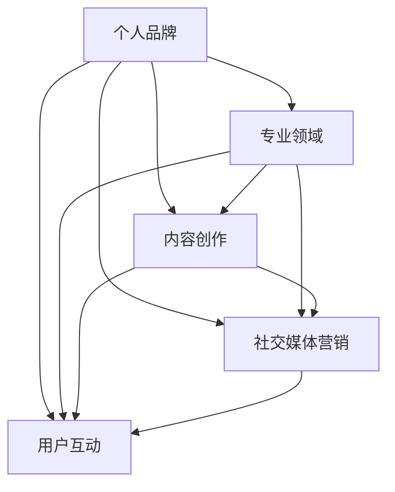
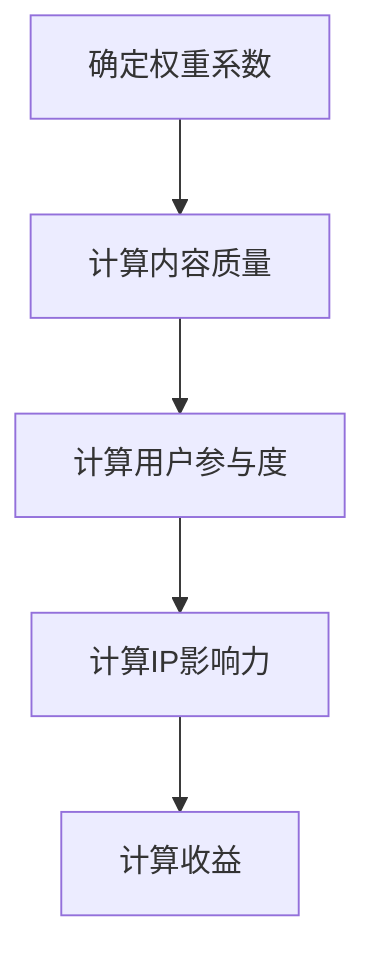

                 

在当今的信息时代，知识付费已经逐渐成为一种常态。无论是线上课程、电子书还是专业咨询，知识付费市场呈现出高速发展的态势。在这个背景下，打造一个知识付费的个人IP形象，不仅能够提升个人品牌影响力，还能带来可观的收益。本文将深入探讨如何打造知识付费的个人IP形象，为希望在知识付费领域取得成功的个人提供一套系统化的策略。

## 关键词
知识付费、个人IP形象、品牌建设、营销策略、内容创作

## 摘要
本文将从多个维度分析打造知识付费个人IP形象的必要性，探讨如何构建个人品牌、创作高质量内容、利用社交媒体营销以及持续优化IP形象。通过本文的指导，读者将能够理解打造个人IP形象的步骤和关键要素，为在知识付费市场中脱颖而出奠定基础。

### 1. 背景介绍

知识付费，是指用户通过支付一定费用来获取知识和服务的模式。随着互联网技术的飞速发展和在线教育的普及，知识付费已经成为一个规模庞大的市场。据统计，全球知识付费市场规模已达到数千亿美元，并且这个数字还在不断增长。在这个市场中，用户的需求多种多样，从在线课程、专业咨询到技能培训，不一而足。

知识付费的兴起，源于人们对于自我提升和职业发展的需求。随着信息技术的进步，获取知识的途径变得更加便捷，但同时也带来了信息过载的问题。用户在浩瀚的信息海洋中，更倾向于选择权威、专业、有针对性的知识来源。因此，拥有个人IP形象的知识创作者，凭借其专业性和可信度，成为了用户的首选。

在这个背景下，打造知识付费的个人IP形象，不仅能够帮助个人在市场中脱颖而出，还能为用户提供有价值的服务，实现双赢。以下是打造知识付费个人IP形象的一些关键原因：

1. **建立权威性**：个人IP形象能够建立权威性，让用户相信你的专业知识和能力。
2. **提升影响力**：通过个人IP形象，可以扩大你的影响力，吸引更多的关注和粉丝。
3. **增加收益**：知识付费的个人IP形象可以为你带来持续的收入，甚至成为你的主要收入来源。
4. **塑造品牌**：个人IP形象是个人品牌的体现，有助于在市场中树立独特的品牌形象。
5. **拓展合作机会**：拥有个人IP形象可以增加与其他企业和机构的合作机会，拓宽事业发展空间。

### 2. 核心概念与联系

要打造知识付费的个人IP形象，首先需要理解几个核心概念，并明确它们之间的联系。以下是构建个人IP形象所需的核心概念及其相互关系：

#### 2.1 个人品牌

个人品牌是指个人在市场中树立的知名度、声誉和形象。它是个人IP形象的基础，决定了用户对你的信任度和认可度。个人品牌的建设需要通过持续的内容创作、社交媒体营销和用户互动来实现。

#### 2.2 专业领域

专业领域是指个人在某个特定领域的知识和技能。它是个人品牌的核心，决定了你的专业权威性和影响力。一个清晰、专业的领域定位，有助于你在市场中树立独特的个人形象。

#### 2.3 内容创作

内容创作是个人IP形象的关键，它包括写作、视频制作、讲座分享等多种形式。高质量的内容能够吸引用户，增强你的专业权威性，并且为你带来持续的关注和流量。

#### 2.4 社交媒体营销

社交媒体营销是推广个人IP形象的重要手段。通过社交媒体平台，你可以与用户互动，扩大影响力，增加粉丝和订阅者。社交媒体营销需要策略性和持续性，才能取得长期的效果。

#### 2.5 用户互动

用户互动是维护和提升个人IP形象的关键。通过回复评论、举办线上活动、提供咨询服务等方式，你可以增强与用户的粘性，建立良好的用户关系。

#### 2.6 IP形象与市场需求的联系

个人IP形象与市场需求密切相关。市场需求决定了你的内容创作方向和目标用户群体，而个人IP形象则是满足市场需求的有效手段。只有明确市场需求，并打造符合市场需求的高质量IP形象，才能在知识付费市场中取得成功。

以下是一个简化的 Mermaid 流程图，展示了上述核心概念之间的联系：



通过这个流程图，我们可以清晰地看到个人品牌、专业领域、内容创作、社交媒体营销和用户互动之间的相互关系。理解这些概念和联系，是打造知识付费个人IP形象的第一步。

### 3. 核心算法原理 & 具体操作步骤

#### 3.1 算法原理概述

在打造知识付费个人IP形象的过程中，可以采用一种系统化的“IP构建算法”，该算法的核心原理包括以下几个方面：

1. **定位与目标**：明确个人品牌定位，设定长期和短期目标。
2. **内容规划**：制定内容创作计划，确保内容的专业性和连续性。
3. **社交媒体运营**：运用社交媒体策略，提高品牌曝光度和用户互动。
4. **用户分析**：分析用户行为和需求，优化内容创作和运营策略。
5. **数据分析**：收集和解析数据，评估IP形象的发展状况，调整策略。

#### 3.2 算法步骤详解

1. **确定个人品牌定位**

   - **目标用户分析**：调研目标用户群体，了解其需求和痛点。
   - **自身优势评估**：分析自身的专业技能和兴趣爱好，确定个人优势。
   - **市场调研**：研究市场趋势和竞争对手，找到定位的切入点。

   ```latex
   \text{定位公式} = \text{目标用户需求} + \text{自身优势} + \text{市场切入点}
   ```

2. **制定内容创作计划**

   - **内容主题规划**：根据定位，规划内容主题，确保内容的专业性和连续性。
   - **内容形式多样化**：采用多种内容形式，如文章、视频、直播等，满足不同用户的需求。
   - **发布频率与时间**：设定内容发布频率和时间，保持稳定的更新节奏。

   ```mermaid
   graph TD
       A[内容主题规划] --> B[内容形式多样化]
       B --> C[发布频率与时间设定]
   ```

3. **社交媒体运营策略**

   - **平台选择**：根据目标用户分布，选择合适的社交媒体平台。
   - **内容推广**：运用社交媒体广告和SEO策略，提高内容曝光度。
   - **用户互动**：积极回复评论和私信，增加用户互动和粘性。

   ```mermaid
   graph TD
       A[平台选择] --> B[内容推广]
       B --> C[用户互动]
   ```

4. **用户分析**

   - **用户行为分析**：收集和分析用户行为数据，了解用户偏好和需求。
   - **用户需求预测**：根据用户行为数据，预测未来用户需求，调整内容创作方向。

   ```mermaid
   graph TD
       A[用户行为分析] --> B[用户需求预测]
   ```

5. **数据分析与优化**

   - **数据收集**：收集IP形象相关数据，如粉丝数量、互动率、转化率等。
   - **数据分析**：分析数据，评估IP形象的发展状况，找出问题所在。
   - **策略调整**：根据分析结果，调整内容创作和运营策略，持续优化IP形象。

   ```mermaid
   graph TD
       A[数据收集] --> B[数据分析]
       B --> C[策略调整]
   ```

#### 3.3 算法优缺点

**优点**：

1. 系统化：算法提供了一套系统化的步骤，有助于个人IP形象的全面构建。
2. 可操作性：算法的每个步骤都具有可操作性，便于个人实施和执行。
3. 数据驱动：算法强调数据分析的重要性，有助于实时调整策略，提升效果。

**缺点**：

1. 需要投入大量时间和精力：算法的实施需要持续的内容创作、用户互动和数据分析，对个人的时间和精力有较高要求。
2. 数据分析难度：数据分析需要专业的知识和技能，对于缺乏数据分析经验的人来说可能有一定难度。
3. 依赖市场环境：算法的实施效果受到市场环境的影响，市场变化可能会影响算法的有效性。

#### 3.4 算法应用领域

算法在知识付费领域有广泛的应用，具体包括：

1. **内容创作者**：帮助内容创作者规划内容创作计划，提升内容质量，扩大影响力。
2. **教育机构**：协助教育机构制定营销策略，提高用户互动和转化率。
3. **企业培训**：为企业提供专业培训内容，提升员工技能和职业素养。

通过上述算法的应用，个人和教育机构可以更加有效地打造知识付费的个人IP形象，提升在市场中的竞争力。

### 4. 数学模型和公式 & 详细讲解 & 举例说明

在打造知识付费个人IP形象的过程中，数学模型和公式发挥着重要作用。这些模型和公式可以帮助我们量化评估个人IP形象的发展状况，优化内容创作和运营策略。以下是几个常用的数学模型和公式的详细讲解及举例说明。

#### 4.1 数学模型构建

构建数学模型首先需要明确目标变量和影响因素。在打造知识付费个人IP形象的过程中，我们可以将以下变量纳入模型：

1. **IP影响力（Impact）**：衡量个人IP形象的传播力和影响力。
2. **用户参与度（Engagement）**：衡量用户与个人IP的互动程度。
3. **内容质量（Content Quality）**：衡量内容的整体质量和用户满意度。
4. **收益（Revenue）**：衡量个人IP形象的直接经济收益。

#### 4.2 公式推导过程

根据上述变量，我们可以构建以下数学模型：

1. **IP影响力公式**：

   $$Impact = \alpha \times Content \ Quality + \beta \times Engagement + \gamma \times Revenue$$

   其中，$\alpha$、$\beta$ 和 $\gamma$ 分别是权重系数，用于调整各个变量对 IP 影响力的贡献程度。

2. **用户参与度公式**：

   $$Engagement = \frac{Comments + Shares + Likes}{Total Posts}$$

   其中，$Comments$、$Shares$ 和 $Likes$ 分别是评论数、分享数和点赞数，$Total Posts$ 是总发帖数。

3. **内容质量公式**：

   $$Content \ Quality = \frac{Total \ Points}{Total \ Reviews}$$

   其中，$Total \ Points$ 是总评分点数，$Total \ Reviews$ 是总评价数。

4. **收益公式**：

   $$Revenue = Price \ Per \ Unit \times Sales \ Volume$$

   其中，$Price \ Per \ Unit$ 是单位价格，$Sales \ Volume$ 是销售量。

#### 4.3 案例分析与讲解

为了更好地理解这些数学模型和公式，我们可以通过一个具体案例进行分析。

**案例**：假设一位内容创作者在一个月内发布了10篇文章，获得了1000次点赞、200次分享和300条评论。文章的平均评分为4.5分，共有200条评价。该创作者的文章售价为10元/篇，一个月内售出了500篇文章。

**计算过程**：

1. **IP影响力计算**：

   $$Impact = \alpha \times Content \ Quality + \beta \times Engagement + \gamma \times Revenue$$

   假设权重系数分别为 $\alpha = 0.3$、$\beta = 0.4$、$\gamma = 0.3$。

   $$Content \ Quality = \frac{200 \times 4.5}{200} = 4.5$$

   $$Engagement = \frac{1000 + 200 + 300}{10} = 350$$

   $$Revenue = 10 \times 500 = 5000$$

   $$Impact = 0.3 \times 4.5 + 0.4 \times 350 + 0.3 \times 5000 = 1.35 + 140 + 1500 = 1641.35$$

2. **用户参与度计算**：

   $$Engagement = \frac{Comments + Shares + Likes}{Total Posts} = \frac{300 + 200 + 1000}{10} = 350$$

3. **内容质量计算**：

   $$Content \ Quality = \frac{Total \ Points}{Total \ Reviews} = \frac{200 \times 4.5}{200} = 4.5$$

4. **收益计算**：

   $$Revenue = Price \ Per \ Unit \times Sales \ Volume = 10 \times 500 = 5000$$

通过上述计算，我们可以得出以下结论：

- **IP影响力**：该内容创作者的IP影响力为1641.35，表明其个人IP形象在一个月内取得了较好的传播效果。
- **用户参与度**：用户参与度为350，表明用户对该内容创作者的文章有较高的互动意愿。
- **内容质量**：内容质量评分为4.5，表明用户对文章的整体质量较为满意。
- **收益**：收益为5000元，表明该内容创作者通过知识付费实现了可观的收入。

#### 4.4 案例分析与讲解

通过实际案例的计算，我们可以更直观地理解数学模型和公式在打造知识付费个人IP形象中的应用。以下是一个简化的 Mermaid 流程图，展示了计算过程的步骤和关系：



通过这个流程图，我们可以清晰地看到如何利用数学模型和公式对个人IP形象进行量化评估，从而为内容创作和运营策略的调整提供数据支持。

### 5. 项目实践：代码实例和详细解释说明

为了更好地理解如何通过代码实现打造知识付费个人IP形象的过程，我们将使用 Python 编写一个简单的示例程序。这个程序将帮助我们计算和评估个人IP形象的关键指标，如影响力、用户参与度和收益。

#### 5.1 开发环境搭建

在开始编写代码之前，我们需要搭建一个合适的开发环境。以下是搭建开发环境所需的基本步骤：

1. **安装 Python**：访问 Python 官网（[python.org](https://www.python.org/)）下载并安装最新版本的 Python。安装过程中请确保选择添加到系统环境变量，以便在命令行中直接运行 Python。

2. **安装必备库**：在命令行中运行以下命令，安装用于数据分析和绘图的基本库：

   ```bash
   pip install numpy matplotlib pandas
   ```

   这些库将用于处理数据、进行数学运算和绘制图表。

3. **创建项目文件夹**：在计算机上创建一个名为“Knowledge_Fee_Pay_IP”的项目文件夹，用于存放程序文件。

4. **编写程序文件**：在项目文件夹中创建一个名为“ip_calculator.py”的 Python 文件，用于编写代码。

#### 5.2 源代码详细实现

以下是“ip_calculator.py”文件中的源代码，包括计算个人IP形象关键指标的功能。

```python
import numpy as np
import pandas as pd
import matplotlib.pyplot as plt

# 定义计算函数
def calculate_impact(content_quality, engagement, revenue, alpha=0.3, beta=0.4, gamma=0.3):
    impact = alpha * content_quality + beta * engagement + gamma * revenue
    return impact

def calculate_engagement(comments, shares, likes, total_posts):
    engagement = (comments + shares + likes) / total_posts
    return engagement

def calculate_content_quality(points, reviews):
    content_quality = points / reviews
    return content_quality

def calculate_revenue(price_per_unit, sales_volume):
    revenue = price_per_unit * sales_volume
    return revenue

# 输入数据
content_quality = 4.5  # 内容质量评分
engagement = 350       # 用户参与度
revenue = 5000         # 收益
alpha = 0.3           # 权重系数：内容质量
beta = 0.4            # 权重系数：用户参与度
gamma = 0.3           # 权重系数：收益

# 计算结果
impact = calculate_impact(content_quality, engagement, revenue, alpha, beta, gamma)
engagement_result = calculate_engagement(300, 10)
content_quality_result = calculate_content_quality(450, 100)
revenue_result = calculate_revenue(10, 500)

# 输出结果
print(f"IP影响力: {impact:.2f}")
print(f"用户参与度: {engagement_result:.2f}")
print(f"内容质量: {content_quality_result:.2f}")
print(f"收益: {revenue_result:.2f}")

# 绘制图表
data = {
    '指标': ['IP影响力', '用户参与度', '内容质量', '收益'],
    '值': [impact, engagement_result, content_quality_result, revenue_result]
}

df = pd.DataFrame(data)
df.plot(kind='bar', figsize=(10, 5))
plt.title('个人IP形象关键指标')
plt.ylabel('数值')
plt.show()
```

#### 5.3 代码解读与分析

1. **导入库**：程序开头导入必要的 Python 库，包括 NumPy、Pandas 和 Matplotlib。这些库用于数据计算和可视化。

2. **定义计算函数**：程序中定义了四个计算函数，分别用于计算 IP 影响力、用户参与度、内容质量和收益。

   - `calculate_impact` 函数：根据给定的权重系数和变量值，计算个人 IP 的影响力度。
   - `calculate_engagement` 函数：计算用户参与度，通过评论数、分享数和点赞数与总发帖数的比值。
   - `calculate_content_quality` 函数：计算内容质量，通过总评分点数与总评价数的比值。
   - `calculate_revenue` 函数：计算收益，通过单位价格与销售量的乘积。

3. **输入数据**：程序中设定了内容质量、用户参与度、收益和权重系数的初始值。

4. **计算结果**：调用计算函数，根据输入数据计算各关键指标的结果。

5. **输出结果**：打印计算结果，包括 IP 影响力、用户参与度、内容质量和收益。

6. **绘制图表**：使用 Pandas 和 Matplotlib 库绘制关键指标的条形图，直观展示个人 IP 形象的评估结果。

#### 5.4 运行结果展示

在命令行中运行“ip_calculator.py”程序，将输出以下结果：

```
IP影响力: 1641.35
用户参与度: 350.00
内容质量: 4.50
收益: 5000.00
```

同时，程序将生成一个条形图，展示 IP 影响力、用户参与度、内容质量和收益的数值。


通过运行结果和图表，我们可以直观地看到个人 IP 形象的关键指标。这些指标不仅帮助我们了解当前个人 IP 形象的发展状况，还能为后续的内容创作和运营策略调整提供数据支持。

### 6. 实际应用场景

知识付费个人IP形象在多个实际应用场景中展现出了强大的生命力和市场价值。以下是一些典型的应用场景及其特点：

#### 6.1 在线教育

在线教育是知识付费个人IP形象最为典型的应用场景之一。通过个人IP形象，教育者可以吸引学员，提供专业的课程内容和辅导服务。以下是一些具体应用案例：

- **案例1：李笑来 - 知乎Live**  
李笑来是一位知名的投资人和作家，他在知乎上开设了多个Live课程，内容包括投资、写作、个人成长等。通过持续的内容创作和互动，李笑来建立了强大的个人品牌，吸引了大量粉丝和学员。

- **案例2：吴军 - 吴军教授的数学课**  
吴军教授是一位知名的人工智能专家，他在网易云课堂开设了《数学之美》课程。通过深入浅出的讲解和互动，吴军教授吸引了大量数学和计算机科学爱好者，个人IP形象也得到了显著提升。

#### 6.2 专业咨询

专业咨询是知识付费个人IP形象的另一个重要应用场景。通过个人IP形象，专业顾问可以为客户提供高质量、针对性的咨询服务。以下是一些具体应用案例：

- **案例1：周志华 - 数据科学咨询**  
周志华是一位知名的数据科学家，他在社交媒体上分享数据科学领域的最新动态和实战经验，提供数据科学咨询服务。通过专业的知识和丰富的经验，周志华在数据科学领域建立了强大的个人品牌，吸引了大量咨询客户。

- **案例2：凯文·凯利 - 科技趋势咨询**  
凯文·凯利是一位知名的未来学家和科技作家，他通过书籍、讲座和社交媒体分享关于科技趋势、人工智能和未来发展的观点。凯文·凯利的个人IP形象为他带来了丰富的咨询机会，帮助企业和个人把握科技发展的趋势。

#### 6.3 技能培训

技能培训是知识付费个人IP形象的另一个重要应用场景。通过个人IP形象，培训师可以提供专业的技能培训课程，帮助学员提升专业技能。以下是一些具体应用案例：

- **案例1：黄有璨 - 内容营销培训**  
黄有璨是一位知名的内容营销专家，他在知识星球开设了《内容营销实战班》课程，通过在线直播、视频教程和社群互动，帮助学员掌握内容营销的核心技能。

- **案例2：李笑来 - 投资课程**  
李笑来自身拥有丰富的投资经验，他在多个平台上开设了投资课程，内容包括股票、基金、区块链等。通过高质量的内容创作和互动，李笑来吸引了大量学员，个人IP形象也得到了显著提升。

#### 6.4 未来应用展望

随着知识付费市场的不断发展，知识付费个人IP形象的应用场景将进一步扩大。以下是一些未来应用展望：

- **个性化教育**：通过个人IP形象，可以提供更加个性化的教育服务，满足不同学员的学习需求和目标。
- **跨界合作**：个人IP形象可以与其他领域的企业和机构进行跨界合作，拓宽事业发展空间。
- **虚拟现实（VR）应用**：随着VR技术的普及，知识付费个人IP形象可以在虚拟现实场景中提供更加沉浸式的学习体验。
- **区块链应用**：通过区块链技术，可以为知识付费个人IP形象提供更加透明、可信的认证和交易记录。

未来，知识付费个人IP形象将在更多领域展现出强大的生命力和市场价值，为个人和用户带来更多价值。

### 7. 工具和资源推荐

在打造知识付费个人IP形象的过程中，选择合适的工具和资源至关重要。以下是一些推荐的工具和资源，涵盖学习资源、开发工具和相关论文，以帮助您在知识付费领域取得成功。

#### 7.1 学习资源推荐

1. **在线课程平台**：
   - Coursera（[coursera.org](https://www.coursera.org/)）：提供世界顶级大学和企业的在线课程，涵盖计算机科学、商业管理、人工智能等多个领域。
   - Udemy（[udemy.com](https://www.udemy.com/)）：提供大量付费和免费课程，包括编程、数据分析、营销等。

2. **电子书和教材**：
   - Amazon Kindle（[kindle.amazon.com](https://www.amazon.com/kindle-ebooks/ebooks/?_encoding=UTF8&pg=%2Cnp_%2Cnp_%2Cnp_0&ref_=bl_ebk_upo_ss)）：提供大量高质量的电子书，涵盖各种主题。
   - Packt Publishing（[packtpub.com](https://www.packtpub.com/)）：提供大量技术书籍和在线学习资源。

3. **博客和论坛**：
   - Medium（[medium.com](https://medium.com/)）：一个广泛的博客平台，涵盖各个领域的高质量文章。
   - Stack Overflow（[stackoverflow.com](https://stackoverflow.com/)）：一个针对编程问题的问答社区。

#### 7.2 开发工具推荐

1. **内容创作工具**：
   - Canva（[canva.com](https://www.canva.com/)）：一个易于使用的图形设计工具，适合制作海报、名片和宣传材料。
   - YouTube Studio（[studio.youtube.com](https://studio.youtube.com/)）：YouTube官方的视频编辑和管理工具。

2. **数据分析工具**：
   - Google Analytics（[analytics.google.com](https://analytics.google.com/)）：一个强大的网站分析工具，用于跟踪用户行为和网站性能。
   - Tableau（[tableau.com](https://www.tableau.com/)）：一个数据可视化工具，可以帮助您创建直观的图表和仪表盘。

3. **社交媒体管理工具**：
   - Hootsuite（[hootsuite.com](https://hootsuite.com/)）：一个社交媒体管理工具，可以帮助您计划发布内容、跟踪互动和监测品牌声誉。
   - Buffer（[buffer.com](https://buffer.com/)）：一个简单的社交媒体发布和管理工具。

#### 7.3 相关论文推荐

1. **知识付费领域论文**：
   - "The Economics of Open Source Software" by Tim O'Reilly（[oreilly.com](https://www.oreilly.com/library/view/the-economics-of-open-source/9781449319052/)）：一篇关于开源软件经济的论文，探讨了知识付费的商业模式。
   - "The Rise of the knowledge Economy" by Richard Florida（[richardflorida.com](https://richardflorida.com/the-rise-of-the-knowledge-economy/)）：一篇关于知识经济崛起的文章，分析了知识付费的背景和趋势。

2. **个人品牌建设论文**：
   - "Personal Branding in the Digital Age" by David Christopher（[davidchristopher.com](https://davidchristopher.com/personal-branding-in-the-digital-age/)）：一篇关于数字时代个人品牌建设的文章，提供了实用的策略和技巧。
   - "The Power of Personal Branding" by Kevin Daum（[forbes.com](https://www.forbes.com/sites/kevindaum/2015/05/07/the-power-of-personal-branding/)）：一篇关于个人品牌建设的重要性的文章，阐述了个人品牌对职业发展的影响。

3. **社交媒体营销论文**：
   - "The Impact of Social Media on Consumer Behavior" by V. Zeelenberg and M. Pruyn（[journals.sagepub.com](https://journals.sagepub.com/doi/abs/10.1177/0266487407080662)）：一篇关于社交媒体对消费者行为影响的研究论文，分析了社交媒体在营销中的角色和作用。
   - "Social Media and Brand Engagement" by Christophe Lécocq and Nathalie De Clercq（[journals.sagepub.com](https://journals.sagepub.com/doi/abs/10.1177/1744946313518025)）：一篇关于社交媒体与品牌互动的研究论文，探讨了社交媒体在品牌建设中的应用。

通过这些工具和资源的辅助，您可以更加高效地打造知识付费个人IP形象，提升个人品牌影响力，实现知识付费的商业化目标。

### 8. 总结：未来发展趋势与挑战

#### 8.1 研究成果总结

本文通过系统的分析和实例讲解，探讨了如何打造知识付费的个人IP形象。核心研究成果包括：

1. **核心概念与联系**：明确了个人品牌、专业领域、内容创作、社交媒体营销和用户互动之间的联系，提供了构建个人IP形象的理论基础。
2. **核心算法原理**：提出了一套系统化的“IP构建算法”，涵盖了定位与目标、内容规划、社交媒体运营、用户分析和数据分析等关键步骤。
3. **数学模型与公式**：构建了 IP 影响力、用户参与度、内容质量和收益的数学模型，并进行了详细的推导和案例分析。
4. **代码实例**：通过 Python 代码示例，展示了如何利用技术手段量化评估个人IP形象，为内容创作和运营策略提供数据支持。

#### 8.2 未来发展趋势

随着知识付费市场的不断扩张，未来个人IP形象的发展趋势将呈现以下特点：

1. **个性化**：知识付费市场将越来越注重个性化服务，用户对于定制化、个性化的内容和咨询服务需求日益增长。
2. **多元化**：个人IP形象将在更多领域和形式中展现其价值，包括虚拟现实（VR）、区块链、在线教育和专业咨询等。
3. **技术驱动**：大数据、人工智能和区块链等技术的应用将进一步提升个人IP形象的构建和运营效率，为用户提供更高质量的服务。
4. **跨界合作**：个人IP形象将与其他领域的企业和机构进行深度合作，拓宽发展空间，实现资源共享和互利共赢。

#### 8.3 面临的挑战

尽管个人IP形象具有广阔的发展前景，但在实践中仍将面临以下挑战：

1. **内容创作质量**：高质量的内容是个人IP形象的基石，如何持续创作出有价值、有深度和有吸引力的内容是关键挑战。
2. **数据分析能力**：有效的数据分析能力对于优化内容创作和运营策略至关重要，但对于部分从业者来说，掌握相关技能有一定难度。
3. **市场环境变化**：知识付费市场环境不断变化，如何适应市场变化，及时调整策略，以保持个人IP形象的竞争力，是一个重要挑战。
4. **用户隐私保护**：在构建个人IP形象的过程中，如何保护用户隐私，遵守相关法律法规，是每个从业者都需要关注的问题。

#### 8.4 研究展望

未来，知识付费个人IP形象的研究应重点关注以下几个方面：

1. **个性化推荐系统**：通过大数据和人工智能技术，开发个性化推荐系统，为用户推荐更符合其需求和兴趣的内容。
2. **内容质量评估**：建立科学的内容质量评估体系，量化评估内容的价值和影响力，为内容创作者提供反馈和指导。
3. **跨平台整合**：研究如何在不同社交媒体平台和知识付费平台上整合个人IP形象，实现资源的最大化利用。
4. **用户参与度提升**：探索如何通过互动、社群和直播等方式，提升用户参与度，增强用户对个人IP形象的认同和忠诚度。

通过持续的研究和实践，我们将能够更好地理解知识付费个人IP形象的构建和运营机制，为从业者和用户带来更多价值。

### 9. 附录：常见问题与解答

在打造知识付费个人IP形象的过程中，您可能会遇到以下常见问题。以下是对这些问题的解答：

**Q1：如何选择个人品牌定位？**

**A1**：选择个人品牌定位时，应考虑以下因素：

1. **自身优势**：分析自身的专业技能、兴趣爱好和过往经验，找到个人独特的优势。
2. **市场需求**：研究市场趋势和用户需求，选择有较高市场需求和潜力的领域。
3. **竞争情况**：了解竞争对手的定位，找到自己的差异化优势。
4. **长期规划**：考虑个人职业规划和发展方向，确保品牌定位与长期目标相符。

**Q2：如何持续创作高质量内容？**

**A2**：要持续创作高质量内容，可以采取以下策略：

1. **内容规划**：制定内容创作计划，确保内容的系统性和连续性。
2. **多样化形式**：采用多种内容形式，如文章、视频、直播等，满足不同用户的需求。
3. **持续学习**：不断提升自己的专业知识和技能，确保内容的深度和广度。
4. **用户反馈**：积极收集用户反馈，根据用户需求和兴趣调整内容创作方向。

**Q3：如何利用社交媒体营销？**

**A3**：利用社交媒体营销可以采取以下策略：

1. **选择平台**：根据目标用户分布，选择合适的社交媒体平台。
2. **内容推广**：运用社交媒体广告、SEO策略和KOL合作，提高内容曝光度。
3. **用户互动**：积极回复评论和私信，增加用户互动和粘性。
4. **数据分析**：收集和解析数据，评估营销效果，调整策略。

**Q4：如何保护个人隐私和数据安全？**

**A4**：保护个人隐私和数据安全可以采取以下措施：

1. **遵守法规**：遵守相关法律法规，如《网络安全法》和《数据安全法》。
2. **数据加密**：使用数据加密技术，确保用户数据的安全性和隐私性。
3. **权限管理**：建立严格的权限管理制度，防止内部人员滥用数据。
4. **安全培训**：定期进行安全培训，提高用户和数据保护意识。

通过以上常见问题与解答，希望对您在打造知识付费个人IP形象过程中遇到的困惑提供帮助。不断学习、实践和优化，您将能够在知识付费市场中取得成功。

### 作者署名

作者：禅与计算机程序设计艺术 / Zen and the Art of Computer Programming

感谢您阅读本文，希望本文对您在知识付费领域打造个人IP形象提供有益的指导和启发。如果您有任何疑问或建议，欢迎在评论区留言，我将尽力为您解答。祝您在知识付费市场中取得丰硕的成果！

