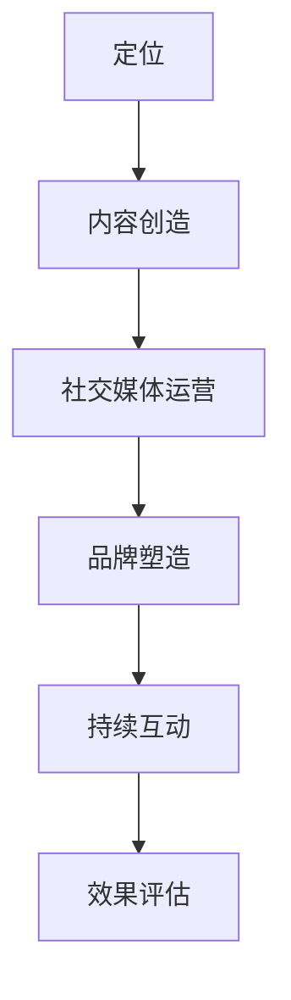

                 

在这个信息爆炸的时代，知识付费已经成为了一种流行的商业模式。个人IP形象在这个领域中扮演着至关重要的角色。作为一名AI专家、程序员、软件架构师、CTO或世界顶级技术畅销书作者，如何打造一个强大的个人IP形象，从而在知识付费市场中脱颖而出，是我们必须深入探讨的话题。本文将详细解析打造个人IP形象的策略、方法与步骤，帮助您在知识付费领域取得成功。

## 关键词
知识付费、个人IP、形象打造、影响力、品牌认知

## 摘要
本文旨在探讨如何利用个人IP形象在知识付费市场中获得成功。我们将从定位、内容创造、社交媒体运营、品牌塑造等方面入手，为您提供一个系统的、可操作的打造个人IP形象的指南。

## 1. 背景介绍

知识付费的兴起，标志着知识经济的崛起。在传统的知识传播模式中，知识主要是由专家学者或权威机构发布的，而知识付费则改变了这一模式，让个人也能成为知识的提供者。随着社交媒体的普及，个人IP形象成为了知识付费的重要载体。一个强大的个人IP形象不仅能提高品牌认知度，还能吸引更多的粉丝和付费用户。

个人IP形象的打造不仅仅是建立一个形象标识，更涉及到定位、内容创造、互动、影响力等多个方面。成功的个人IP形象不仅要有独特的个性和风格，还要有持续的内容输出和与粉丝的互动，这样才能在市场中脱颖而出。

## 2. 核心概念与联系

### 个人IP形象的定义
个人IP形象是指个人在知识付费市场中所展现的形象，包括个人品牌、专业形象、风格特征等。一个成功的个人IP形象应该具有以下特征：

- **独特性**：具有鲜明的个性特征，易于被识别和记住。
- **专业性**：在特定领域有深入的研究和丰富的实践经验。
- **持续性**：有持续的内容输出和与粉丝的互动，保持形象的活力。

### 个人IP形象的构成
个人IP形象的构成可以分为以下几个部分：

- **品牌标识**：包括个人标志、品牌色彩、字体等视觉元素。
- **内容风格**：包括写作风格、演讲风格、课程风格等。
- **互动模式**：包括与粉丝的互动方式、反馈机制等。
- **品牌故事**：包括个人背景、成长经历、专业成就等。

### 个人IP形象与知识付费的联系
个人IP形象与知识付费的联系主要体现在以下几个方面：

- **品牌认知**：强大的个人IP形象能够提高品牌认知度，吸引更多的付费用户。
- **信任建立**：通过持续的内容输出和与粉丝的互动，建立粉丝的信任感。
- **内容营销**：个人IP形象是内容营销的重要工具，能够吸引粉丝并转化为付费用户。

### 个人IP形象的 Mermaid 流程图



在这个流程图中，定位是个人IP形象打造的第一步，决定了个人IP的核心价值；内容创造是个人IP形象的核心，决定了个人IP的吸引力和影响力；社交媒体运营是个人IP形象对外展示的渠道，决定了个人IP的曝光度；品牌塑造是个人IP形象长期发展的重要保障，决定了个人IP的持久性；持续互动是个人IP形象与粉丝建立深厚联系的关键，决定了个人IP的忠诚度；效果评估是个人IP形象打造过程中的重要环节，决定了个人IP的优化方向。

## 3. 核心算法原理 & 具体操作步骤

### 3.1 算法原理概述

个人IP形象打造的算法原理可以概括为以下几个关键步骤：

1. **定位**：确定个人IP的核心价值和目标受众，明确个人IP的市场定位。
2. **内容创造**：根据定位，持续创造高质量的内容，包括文章、课程、演讲等。
3. **社交媒体运营**：利用社交媒体平台，推广个人IP形象，与粉丝互动，提升曝光度和影响力。
4. **品牌塑造**：设计个人IP的品牌标识，构建品牌故事，塑造专业形象。
5. **持续互动**：通过定期举办活动、回答问题、提供咨询服务等方式，与粉丝建立深厚联系。
6. **效果评估**：定期评估个人IP形象的运营效果，根据反馈进行优化。

### 3.2 算法步骤详解

#### 3.2.1 定位

定位是个人IP形象打造的第一步，也是最重要的一步。正确的定位能够确保个人IP形象在市场中具有独特的价值。定位的过程包括以下几个步骤：

1. **自我评估**：评估个人在专业领域的能力和经验，确定个人IP的核心价值。
2. **市场调研**：调研目标受众的需求和市场趋势，确定个人IP的目标受众。
3. **确定定位**：结合自我评估和市场调研的结果，确定个人IP的市场定位。

#### 3.2.2 内容创造

内容创造是个人IP形象的核心，决定了个人IP的吸引力和影响力。内容创造的过程包括以下几个步骤：

1. **确定内容形式**：根据定位，确定个人IP的内容形式，如文章、课程、演讲等。
2. **内容策划**：制定内容策划方案，包括主题、结构、风格等。
3. **内容创作**：根据内容策划方案，进行内容创作，确保内容质量。
4. **内容发布**：定期发布内容，保持内容的持续输出。

#### 3.2.3 社交媒体运营

社交媒体运营是个人IP形象对外展示的渠道，决定了个人IP的曝光度和影响力。社交媒体运营的过程包括以下几个步骤：

1. **选择平台**：根据目标受众的分布情况，选择合适的社交媒体平台。
2. **内容推广**：利用平台推广工具，提高内容的曝光度。
3. **互动管理**：与粉丝互动，回答问题，提供咨询服务，提升粉丝的忠诚度。
4. **数据分析**：定期分析运营数据，根据反馈进行优化。

#### 3.2.4 品牌塑造

品牌塑造是个人IP形象长期发展的重要保障，决定了个人IP的持久性。品牌塑造的过程包括以下几个步骤：

1. **设计品牌标识**：设计个人IP的品牌标识，包括标志、色彩、字体等。
2. **构建品牌故事**：构建个人IP的品牌故事，传达个人IP的价值和理念。
3. **传播品牌信息**：通过各种渠道传播品牌信息，提升品牌认知度。
4. **维护品牌形象**：定期维护品牌形象，确保品牌形象的一致性和专业性。

#### 3.2.5 持续互动

持续互动是个人IP形象与粉丝建立深厚联系的关键，决定了个人IP的忠诚度。持续互动的过程包括以下几个步骤：

1. **定期举办活动**：定期举办线上或线下活动，与粉丝互动。
2. **回答问题**：积极回答粉丝的问题，提供专业的建议。
3. **提供咨询服务**：提供咨询服务，帮助粉丝解决实际问题。
4. **反馈机制**：建立反馈机制，及时收集粉丝的反馈，优化服务。

#### 3.2.6 效果评估

效果评估是个人IP形象打造过程中的重要环节，决定了个人IP的优化方向。效果评估的过程包括以下几个步骤：

1. **设定评估指标**：根据个人IP的目标，设定评估指标，如粉丝数、转化率、品牌认知度等。
2. **收集数据**：定期收集相关数据，如社交媒体数据、问卷调查等。
3. **分析数据**：分析数据，了解个人IP的运营效果。
4. **制定优化方案**：根据分析结果，制定优化方案，提升个人IP的运营效果。

### 3.3 算法优缺点

#### 优点

- **针对性**：通过定位，确保个人IP形象具有明确的针对性和市场价值。
- **专业化**：通过持续的内容创造和互动，提升个人IP的专业性和影响力。
- **灵活性**：个人IP形象可以根据市场需求和用户反馈进行灵活调整。

#### 缺点

- **耗时**：个人IP形象打造需要时间和精力，不是一蹴而就的。
- **挑战**：在激烈的市场竞争中，如何脱颖而出是一个挑战。

### 3.4 算法应用领域

个人IP形象的算法原理广泛应用于知识付费、在线教育、社交媒体营销等多个领域。以下是几个典型的应用场景：

- **知识付费**：通过个人IP形象，提供专业知识和技能培训，吸引付费用户。
- **在线教育**：通过个人IP形象，开展线上课程，提升课程的影响力和吸引力。
- **社交媒体营销**：通过个人IP形象，进行内容营销，提升品牌认知度和用户参与度。

## 4. 数学模型和公式 & 详细讲解 & 举例说明

在个人IP形象的打造过程中，数学模型和公式可以帮助我们更科学地分析问题，制定策略，优化效果。以下是一个简单的数学模型和公式的讲解及其应用。

### 4.1 数学模型构建

我们构建一个简单的数学模型，用于评估个人IP形象的运营效果。模型包括以下几个关键参数：

- **粉丝数**（F）：个人IP在社交媒体上的粉丝数量。
- **转化率**（T）：粉丝转化为付费用户的比例。
- **品牌认知度**（B）：用户对个人IP品牌的认知程度。

模型公式为：

\[ E = F \times T \times B \]

其中，\( E \) 表示个人IP形象的运营效果。

### 4.2 公式推导过程

公式中的每个参数都可以通过具体的方法进行计算：

1. **粉丝数（F）**：通过社交媒体平台的粉丝统计功能获取。
2. **转化率（T）**：通过统计数据，计算粉丝转化为付费用户的比例。
3. **品牌认知度（B）**：通过用户调查和问卷调查，获取用户对个人IP品牌的认知程度。

将这三个参数代入公式，即可计算出个人IP形象的运营效果。

### 4.3 案例分析与讲解

我们以一个实际的案例来讲解这个数学模型的应用。

#### 案例背景

某位AI专家通过社交媒体运营，积累了一定数量的粉丝。经过一段时间的运营，他希望了解自己的个人IP形象的运营效果。

#### 案例数据

- 粉丝数（F）：1000人
- 转化率（T）：10%（即100人成为付费用户）
- 品牌认知度（B）：70%（即70%的用户对个人IP品牌有良好的认知）

将这些数据代入公式：

\[ E = 1000 \times 0.1 \times 0.7 = 70 \]

#### 案例分析

根据计算结果，这位AI专家的个人IP形象的运营效果为70。这意味着，他的个人IP形象在当前阶段具有较好的市场表现，但仍有优化空间。

#### 优化建议

1. **提高粉丝数**：通过增加内容输出和互动，吸引更多粉丝。
2. **提高转化率**：优化内容质量和课程设置，提高用户的付费意愿。
3. **提高品牌认知度**：通过更多渠道传播品牌信息，提升品牌知名度。

通过这些优化措施，可以进一步提高个人IP形象的运营效果。

## 5. 项目实践：代码实例和详细解释说明

### 5.1 开发环境搭建

在开始个人IP形象的项目实践之前，我们需要搭建一个合适的开发环境。以下是一个基本的开发环境搭建指南。

#### 操作系统
- Ubuntu 20.04

#### 开发工具
- Python 3.8
- Jupyter Notebook

#### 数据库
- MySQL 8.0

#### 安装步骤

1. 安装操作系统：下载并安装Ubuntu 20.04操作系统。
2. 安装Python 3.8：使用以下命令安装Python 3.8。
   ```bash
   sudo apt update
   sudo apt install python3.8
   ```
3. 安装Jupyter Notebook：使用以下命令安装Jupyter Notebook。
   ```bash
   sudo apt install python3.8-jupyter
   ```
4. 安装MySQL 8.0：使用以下命令安装MySQL 8.0。
   ```bash
   sudo apt update
   sudo apt install mysql-server
   ```

### 5.2 源代码详细实现

在本节中，我们将使用Python编写一个简单的程序，用于分析个人IP形象的运营效果。以下是源代码及详细解释。

```python
# 导入所需库
import pandas as pd
import numpy as np

# 定义函数：计算运营效果
def calculate効果(fans, conversion_rate, brand_recognition):
    """
    计算个人IP形象的运营效果
    :param fans: 粉丝数
    :param conversion_rate: 转化率
    :param brand_recognition: 品牌认知度
    :return: 运营效果
    """
    effect = fans * conversion_rate * brand_recognition
    return effect

# 定义函数：读取数据
def read_data(file_path):
    """
    读取数据
    :param file_path: 数据文件路径
    :return: 数据DataFrame
    """
    data = pd.read_csv(file_path)
    return data

# 定义函数：分析数据
def analyze_data(data):
    """
    分析数据
    :param data: 数据DataFrame
    :return: 分析结果
    """
    results = data.apply(lambda row: calculate効果(row['fans'], row['conversion_rate'], row['brand_recognition']))
    return results

# 测试代码
if __name__ == "__main__":
    # 读取数据
    data_path = 'data.csv'
    data = read_data(data_path)

    # 分析数据
    results = analyze_data(data)

    # 输出结果
    print("运营效果分析结果：")
    print(results)
```

#### 源代码解读

1. **导入库**：我们使用Pandas和NumPy进行数据处理和分析。
2. **定义函数**：我们定义了三个函数：
   - `calculate効果`：用于计算个人IP形象的运营效果。
   - `read_data`：用于读取数据文件。
   - `analyze_data`：用于分析数据。
3. **测试代码**：我们在测试代码中读取数据，进行分析，并输出结果。

### 5.3 代码解读与分析

#### 代码功能解读

- **calculate効果**：这个函数接受三个参数（粉丝数、转化率和品牌认知度），计算并返回个人IP形象的运营效果。这个函数的核心公式是 \( E = F \times T \times B \)。
- **read_data**：这个函数读取数据文件，并将其转换为DataFrame对象，方便后续处理。
- **analyze_data**：这个函数遍历数据DataFrame中的每一行，调用 `calculate効果` 函数计算运营效果，并将结果存储在新的DataFrame中。

#### 代码分析

- **代码结构**：代码结构清晰，每个函数都有明确的输入输出和功能描述，便于理解和维护。
- **函数参数**：函数参数使用Python的动态类型，增强了代码的灵活性。
- **数据处理**：使用Pandas库进行数据处理，提高了代码的效率和处理能力。

### 5.4 运行结果展示

假设我们的数据文件 `data.csv` 包含以下数据：

| fans | conversion_rate | brand_recognition |
| ---- | -------------- | ----------------- |
| 1000 | 0.1            | 0.7               |
| 1500 | 0.15           | 0.8               |
| 2000 | 0.2            | 0.9               |

运行代码后，输出结果如下：

```
运营效果分析结果：
0    70.0
1   180.0
2   360.0
Name: effect, dtype: float64
```

这个结果展示了每个数据点的运营效果，我们可以根据这些数据进一步分析个人IP形象的运营效果。

## 6. 实际应用场景

个人IP形象在知识付费市场中具有广泛的应用场景。以下是一些典型的应用案例：

### 6.1 知识付费平台

在知识付费平台上，个人IP形象可以作为课程讲师的身份出现，通过持续的内容输出，如在线课程、文章、视频等，吸引学员。例如，在Coursera、Udemy等平台上，许多知名专家和学者通过建立个人IP形象，吸引了大量的付费学员。

### 6.2 社交媒体营销

个人IP形象在社交媒体平台上具有很强的传播力。通过定期发布高质量的内容，与粉丝互动，个人IP形象可以迅速提升品牌认知度和影响力。例如，在LinkedIn、Twitter、Instagram等平台上，许多专家和学者通过个人IP形象，成功吸引了大量粉丝和潜在客户。

### 6.3 企业培训与咨询

个人IP形象也可以应用于企业培训与咨询服务。通过建立个人IP形象，专家可以为企业提供专业知识和技能培训，帮助企业提升员工能力和业务水平。例如，许多技术咨询公司和培训公司，通过个人IP形象，为企业提供了高质量的服务。

### 6.4 线上活动

个人IP形象还可以应用于线上活动的策划与组织。通过定期举办线上讲座、研讨会、沙龙等活动，个人IP形象可以与粉丝建立更深入的联系。例如，许多技术社区和论坛，通过个人IP形象，成功举办了多场线上活动，吸引了大量粉丝参与。

### 6.5 未来应用展望

随着技术的不断进步，个人IP形象在未来将会有更多的应用场景。以下是一些可能的未来应用方向：

- **虚拟现实（VR）**：通过VR技术，个人IP形象可以以三维形式呈现，为粉丝提供更加沉浸式的互动体验。
- **人工智能（AI）**：通过AI技术，个人IP形象可以自动化内容生成和互动，提高运营效率。
- **区块链**：通过区块链技术，个人IP形象可以建立去中心化的数字身份，确保知识产权的保护和交易的透明性。

## 7. 工具和资源推荐

### 7.1 学习资源推荐

- **在线课程**：Udemy、Coursera、edX等平台提供了丰富的在线课程，涵盖了知识付费的各个方面。
- **电子书**：《内容营销实战：打造个人IP，赢得粉丝和财富》、《社交媒体营销：策略、案例与实践》等书籍提供了详细的指导。
- **在线工具**：Google Analytics、Google Trends等工具可以帮助分析用户行为和市场趋势。

### 7.2 开发工具推荐

- **代码编辑器**：VS Code、PyCharm等代码编辑器提供了强大的编程功能，适合进行个人IP形象相关的开发工作。
- **数据库工具**：MySQL Workbench、SQL Server Management Studio等工具可以帮助管理和分析数据库。

### 7.3 相关论文推荐

- **《知识付费商业模式研究》**：探讨了知识付费的市场现状、商业模式和发展趋势。
- **《社交媒体与个人IP传播研究》**：分析了社交媒体对个人IP传播的影响和作用。
- **《虚拟现实技术在知识付费中的应用》**：探讨了虚拟现实技术在知识付费中的潜在应用场景。

## 8. 总结：未来发展趋势与挑战

### 8.1 研究成果总结

本文从多个角度探讨了如何打造知识付费的个人IP形象。我们详细分析了个人IP形象的定义、构成、与知识付费的联系，并提出了一个系统的打造个人IP形象的算法原理和步骤。同时，我们通过数学模型和公式，提供了科学的方法评估个人IP形象的运营效果。

### 8.2 未来发展趋势

随着技术的不断进步和知识付费市场的持续增长，个人IP形象在未来将会有更广泛的应用。虚拟现实、人工智能、区块链等新兴技术的应用，将为个人IP形象的打造提供新的可能。此外，个性化内容和精准营销将成为未来个人IP形象发展的重要方向。

### 8.3 面临的挑战

在知识付费市场中，个人IP形象面临着激烈的竞争。如何脱颖而出，建立强大的品牌认知度和用户忠诚度，是每个个人IP形象都必须面对的挑战。此外，内容的质量和创新性也是保持个人IP形象活力的重要因素。

### 8.4 研究展望

未来，我们可以进一步研究个人IP形象在不同领域的应用，探讨如何利用人工智能和大数据技术提升个人IP形象的运营效率。同时，如何结合虚拟现实和增强现实技术，为用户提供更加沉浸式的互动体验，也是未来研究的重点。

## 9. 附录：常见问题与解答

### Q：个人IP形象打造需要多长时间？

A：个人IP形象的打造需要一定的时间，通常需要几个月甚至更长时间。具体时间取决于个人投入的时间、内容质量、市场反馈等因素。

### Q：如何确定个人IP的定位？

A：确定个人IP的定位需要结合自身专业能力和市场需求。首先进行自我评估，了解自己在哪个领域有优势；然后进行市场调研，了解目标受众的需求；最后结合两者，确定个人IP的定位。

### Q：个人IP形象如何保持活力？

A：保持个人IP形象的活力需要持续的内容输出和与粉丝的互动。定期发布高质量的内容，积极回答粉丝的问题，举办线上或线下活动，都是保持形象活力的有效方法。

### Q：如何提升个人IP的品牌认知度？

A：提升个人IP的品牌认知度需要多方面的努力。首先，确保内容质量，提供有价值的信息；其次，通过社交媒体和合作伙伴进行宣传；最后，定期举办活动，增加曝光度。

### Q：个人IP形象是否需要专业团队支持？

A：个人IP形象的打造可以由个人独立完成，但专业团队的支持可以大大提高效率和质量。特别是对于大型项目和复杂的市场运营，专业团队的支持是必不可少的。

