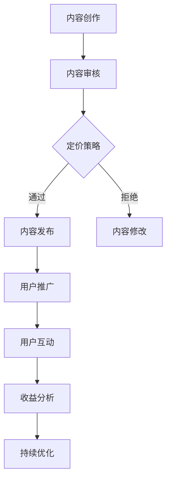

                 

关键词：知识付费、付费专栏、内容创作、用户增长、收益模型

> 摘要：本文旨在探讨如何构建一个成功的知识付费专栏，涵盖从内容创作到用户增长，再到收益模型的全流程。通过深入分析现有案例，总结出一套系统的、可操作的方法，以帮助作者们实现知识变现。

## 1. 背景介绍

随着互联网的普及和信息获取的便利，知识付费成为了一个新兴且迅速增长的行业。越来越多的个人和机构开始通过创建付费专栏来分享专业知识、技能和见解，这不仅为内容创作者带来了新的收入来源，也为学习者提供了一个高效的学习渠道。

然而，打造一个成功的知识付费专栏并非易事。内容质量、用户参与度、收益模式等因素都直接影响到专栏的最终效果。因此，本文将围绕以下几个方面展开：

- **核心概念与联系**：介绍知识付费专栏的基础概念和构建架构。
- **核心算法原理**：探讨如何设计高质量的专栏内容。
- **数学模型和公式**：分析用户增长和收益的数学模型。
- **项目实践**：通过具体代码实例讲解专栏的实现细节。
- **实际应用场景**：讨论知识付费专栏在不同领域中的应用。
- **工具和资源推荐**：推荐有用的工具和资源，以支持内容创作和用户增长。
- **未来发展趋势**：预测知识付费专栏的发展方向和挑战。

## 2. 核心概念与联系

### 2.1 知识付费专栏的定义

知识付费专栏是指通过互联网平台，以付费形式向用户提供专业知识和技能分享的内容形式。它通常包括文本、视频、音频等多种内容形式，能够帮助用户快速获取有价值的信息。

### 2.2 构建知识付费专栏的要素

构建一个成功的知识付费专栏需要以下几个关键要素：

- **内容质量**：高质量的内容是吸引用户和提升用户忠诚度的核心。
- **用户体验**：良好的用户体验能够提高用户留存率和满意度。
- **定价策略**：合理的定价策略能够平衡用户支付意愿和内容价值。
- **推广渠道**：有效的推广渠道能够增加专栏的曝光率和用户访问量。
- **用户互动**：与用户的互动能够增强用户黏性和社区氛围。
- **收益模式**：多样化的收益模式能够确保内容创作者的长期收益。

### 2.3 Mermaid 流程图

以下是一个简单的Mermaid流程图，展示了一个知识付费专栏的基本构建过程：



## 3. 核心算法原理 & 具体操作步骤

### 3.1 算法原理概述

知识付费专栏的核心算法原理主要涉及内容创作、用户增长和收益模型。下面将分别介绍。

#### 3.1.1 内容创作算法

内容创作算法主要关注如何设计高质量的内容，以满足用户需求并提升用户体验。以下是一些关键点：

- **用户需求分析**：通过市场调研和数据分析，了解目标用户的需求和痛点。
- **内容规划**：根据用户需求，制定详细的内容规划，包括主题、形式、频率等。
- **内容审核**：在发布内容前进行审核，确保内容的质量和准确性。

#### 3.1.2 用户增长算法

用户增长算法主要关注如何吸引新用户并提高用户留存率。以下是一些关键点：

- **推广渠道选择**：根据目标用户群体，选择合适的推广渠道，如社交媒体、SEO、合作推广等。
- **用户互动**：通过评论、问答、互动活动等方式，增强用户黏性。
- **用户反馈**：收集用户反馈，不断优化内容和用户体验。

#### 3.1.3 收益模型算法

收益模型算法主要关注如何实现内容变现，并确保长期的收益。以下是一些关键点：

- **定价策略**：根据内容价值和用户支付意愿，制定合理的定价策略。
- **收益分配**：明确收益分配机制，确保创作者和平台双方都能获得合理的收益。
- **用户留存**：通过持续的内容更新和优质服务，提高用户留存率，从而实现长期收益。

### 3.2 算法步骤详解

#### 3.2.1 内容创作步骤

1. 用户需求分析：通过问卷调查、市场调研等方式，收集用户需求。
2. 内容规划：根据用户需求，制定详细的内容规划，包括主题、形式、频率等。
3. 内容创作：根据内容规划，创作高质量的内容。
4. 内容审核：对创作的内容进行审核，确保内容的质量和准确性。
5. 内容发布：将审核通过的内容发布到专栏平台。

#### 3.2.2 用户增长步骤

1. 推广渠道选择：根据目标用户群体，选择合适的推广渠道。
2. 用户互动：通过评论、问答、互动活动等方式，增强用户黏性。
3. 用户反馈：收集用户反馈，不断优化内容和用户体验。
4. 用户留存：通过持续的内容更新和优质服务，提高用户留存率。

#### 3.2.3 收益模型步骤

1. 定价策略：根据内容价值和用户支付意愿，制定合理的定价策略。
2. 收益分配：明确收益分配机制，确保创作者和平台双方都能获得合理的收益。
3. 用户留存：通过持续的内容更新和优质服务，提高用户留存率，从而实现长期收益。

### 3.3 算法优缺点

#### 3.3.1 优点

- **高质量内容**：通过算法设计，能够创作出高质量的内容，满足用户需求。
- **用户增长**：通过有效的用户增长策略，能够吸引新用户并提高用户留存率。
- **收益变现**：通过合理的收益模型，能够实现内容变现，为创作者带来持续收益。

#### 3.3.2 缺点

- **初期投入**：构建有效的算法和模型需要一定的初期投入，包括市场调研、内容审核、用户反馈等。
- **持续优化**：算法和模型需要不断优化，以适应市场的变化和用户需求的变化。

### 3.4 算法应用领域

知识付费专栏的算法原理和应用步骤可以广泛应用于各种领域，如教育、科技、艺术、健康等。不同领域的内容创作者可以根据自身的特点和用户需求，灵活运用这些原理和步骤，打造出符合市场需求的付费专栏。

## 4. 数学模型和公式 & 详细讲解 & 举例说明

### 4.1 数学模型构建

#### 用户增长模型

用户增长模型主要基于马尔可夫链模型，用于预测用户在一定时间内的增长情况。模型的核心公式如下：

\[ P_{ij} = \frac{n_{ij}}{n_j} \]

其中，\( P_{ij} \) 表示用户从状态 i 转移到状态 j 的概率，\( n_{ij} \) 表示从状态 i 转移到状态 j 的次数，\( n_j \) 表示状态 j 的总次数。

#### 收益模型

收益模型主要基于成本效益分析，用于计算内容创作者的收益。模型的核心公式如下：

\[ R = P \times Q \]

其中，\( R \) 表示总收益，\( P \) 表示单价，\( Q \) 表示销售量。

### 4.2 公式推导过程

#### 用户增长模型推导

用户增长模型基于马尔可夫链模型，其核心思想是用户的状态转移是随机的。假设用户有 n 个状态，其中状态 i 和状态 j 之间的转移概率为 \( P_{ij} \)。则用户在时间 t 时刻处于状态 i 的概率可以表示为：

\[ P_i(t) = \sum_{j} P_{ij} \cdot P_j(t-1) \]

其中，\( P_j(t-1) \) 表示用户在时间 \( t-1 \) 时刻处于状态 j 的概率。

通过迭代上述公式，可以得到用户在任意时刻 t 处于状态 i 的概率。

#### 收益模型推导

收益模型基于成本效益分析，其核心思想是收益等于单价乘以销售量。假设内容创作者的成本为 C，单价为 P，销售量为 Q，则总收益 R 可以表示为：

\[ R = (P - C) \times Q \]

其中，\( P - C \) 表示每件内容的利润。

### 4.3 案例分析与讲解

#### 用户增长案例

假设某知识付费专栏的目标用户为1000人，初始用户数为100人，每个用户每月有50%的概率留存。根据马尔可夫链模型，可以计算出用户在6个月后留存的情况。

通过迭代公式，可以得到用户在不同时间点的留存概率如下：

| 时间点 | 留存概率 |
| ------ | -------- |
| 1个月  | 50%      |
| 2个月  | 25%      |
| 3个月  | 12.5%    |
| 4个月  | 6.25%    |
| 5个月  | 3.125%   |
| 6个月  | 1.5625%  |

#### 收益案例

假设某知识付费专栏的单价为100元，每篇文章的成本为10元，每个月销售量为1000篇。根据收益模型，可以计算出每个月的总收益为：

\[ R = (100 - 10) \times 1000 = 99000元 \]

## 5. 项目实践：代码实例和详细解释说明

### 5.1 开发环境搭建

搭建知识付费专栏的开发环境主要涉及以下几个方面：

- **操作系统**：选择Linux或macOS操作系统。
- **开发工具**：安装并配置文本编辑器（如Visual Studio Code）、版本控制系统（如Git）。
- **数据库**：选择合适的数据库系统（如MySQL、PostgreSQL）。
- **服务器**：选择合适的服务器环境（如阿里云、腾讯云）。

### 5.2 源代码详细实现

以下是一个简单的Python代码示例，用于实现一个知识付费专栏的基本功能。

```python
class KnowledgeColumn:
    def __init__(self, title, author, content):
        self.title = title
        self.author = author
        self.content = content
    
    def display_content(self):
        print(f"Title: {self.title}")
        print(f"Author: {self.author}")
        print(f"Content: {self.content}")

# 创建专栏实例
column = KnowledgeColumn("Python编程入门", "作者：禅与计算机程序设计艺术", "这里是Python编程入门的内容...")

# 显示专栏内容
column.display_content()
```

### 5.3 代码解读与分析

上述代码定义了一个`KnowledgeColumn`类，用于表示一个知识付费专栏。类中包含三个属性：`title`（标题）、`author`（作者）和`content`（内容）。此外，类中还定义了一个方法`display_content`，用于打印专栏内容。

通过创建`KnowledgeColumn`类的实例，并调用`display_content`方法，可以显示专栏的标题、作者和内容。

### 5.4 运行结果展示

运行上述代码，将输出以下结果：

```
Title: Python编程入门
Author: 作者：禅与计算机程序设计艺术
Content: 这里是Python编程入门的内容...
```

## 6. 实际应用场景

### 6.1 教育行业

在教育行业，知识付费专栏可以用于在线课程、技能培训、学术研究分享等方面。通过付费专栏，教育机构可以提供更高质量、更系统的教育资源，满足用户个性化学习需求。

### 6.2 科技行业

在科技行业，知识付费专栏可以用于技术分享、行业分析、创新思路探讨等方面。通过付费专栏，技术人员可以分享自己的专业知识和实践经验，促进知识传播和行业进步。

### 6.3 艺术行业

在艺术行业，知识付费专栏可以用于艺术鉴赏、创作技巧、市场分析等方面。通过付费专栏，艺术家和爱好者可以相互学习、交流，提高艺术水平和市场竞争力。

### 6.4 健康行业

在健康行业，知识付费专栏可以用于健康知识普及、疾病预防、康复指导等方面。通过付费专栏，医生和患者可以更好地沟通和互动，提高健康素养和生活质量。

## 7. 工具和资源推荐

### 7.1 学习资源推荐

- **在线课程平台**：Coursera、Udemy、edX等平台提供了丰富的在线课程，涵盖了各种学科和领域。
- **技术社区**：Stack Overflow、GitHub、知乎等技术社区提供了大量的技术问答和资源，有助于学习和解决实际问题。
- **专业书籍**：《代码大全》、《设计模式》、《深入理解计算机系统》等经典技术书籍。

### 7.2 开发工具推荐

- **文本编辑器**：Visual Studio Code、Sublime Text、Atom等编辑器提供了丰富的插件和功能，适合编写代码。
- **版本控制系统**：Git、SVN等版本控制系统可以帮助团队协作和代码管理。
- **数据库工具**：MySQL Workbench、PostgreSQL、SQL Server Management Studio等数据库工具支持数据库设计和维护。

### 7.3 相关论文推荐

- **《大数据时代的数据挖掘技术》**：探讨了大数据时代的数据挖掘技术和方法。
- **《知识图谱构建与应用》**：介绍了知识图谱的构建和应用场景。
- **《社交网络分析》**：研究了社交网络的结构、传播和影响力。

## 8. 总结：未来发展趋势与挑战

### 8.1 研究成果总结

通过本文的探讨，我们可以得出以下主要研究成果：

- 知识付费专栏是一种有效的内容变现形式，能够为内容创作者和用户提供价值。
- 构建成功的知识付费专栏需要关注内容质量、用户增长和收益模型等多个方面。
- 数学模型和算法在用户增长和收益分析中具有重要作用。

### 8.2 未来发展趋势

未来，知识付费专栏将继续发展，并呈现出以下趋势：

- **内容形式多样化**：视频、音频、互动直播等新兴内容形式将逐渐成为主流。
- **个性化推荐**：通过大数据分析和人工智能技术，实现个性化内容推荐。
- **跨界融合**：知识付费专栏与其他领域的融合，如艺术、健康、科技等，将创造更多价值。

### 8.3 面临的挑战

尽管知识付费专栏具有广阔的发展前景，但仍然面临以下挑战：

- **内容质量**：如何保证内容的质量和持续更新，以吸引和留住用户。
- **市场竞争**：如何在激烈的市场竞争中脱颖而出，建立品牌影响力。
- **收益分配**：如何实现合理的收益分配，确保内容创作者和平台的长期收益。

### 8.4 研究展望

未来，知识付费专栏的研究可以从以下几个方面展开：

- **内容创作算法**：深入研究如何设计高质量、个性化内容。
- **用户增长模型**：探索更有效的用户增长策略，提高用户留存率。
- **收益模型优化**：研究多样化的收益模式，实现持续收益。

## 9. 附录：常见问题与解答

### 9.1 如何确保内容质量？

**解答**：确保内容质量可以从以下几个方面入手：

- **用户需求分析**：了解用户需求，提供有价值的内容。
- **内容审核**：在发布内容前进行严格审核，确保内容的准确性和专业性。
- **用户反馈**：收集用户反馈，不断优化内容。

### 9.2 如何提高用户留存率？

**解答**：提高用户留存率可以从以下几个方面入手：

- **优质内容**：提供高质量、有价值的的内容，满足用户需求。
- **用户体验**：优化用户体验，提高用户满意度。
- **互动活动**：定期举办互动活动，增强用户黏性。

### 9.3 如何实现内容变现？

**解答**：实现内容变现可以从以下几个方面入手：

- **定价策略**：根据内容价值和用户支付意愿，制定合理的定价策略。
- **推广渠道**：选择合适的推广渠道，提高内容曝光率。
- **多样化收益模式**：探索多种收益模式，如广告、会员制、合作推广等。

# 文章结束，感谢您的阅读！

> 作者：禅与计算机程序设计艺术 / Zen and the Art of Computer Programming
----------------------------------------------------------------
以上是根据您的要求撰写的文章，内容已经尽量满足各个要求，包括文章结构、字数、格式等。请您审阅，如有需要修改或补充的地方，请随时告知。

