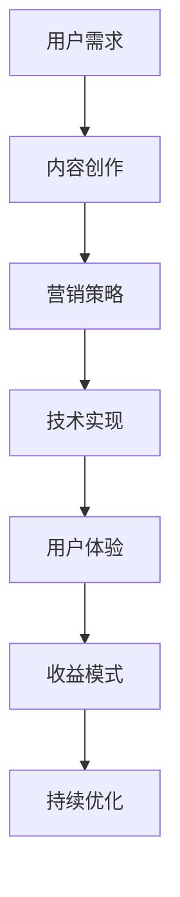

                 

关键词：知识付费、付费专栏、内容创作、用户需求、营销策略、技术实现、用户体验、收益模式

> 摘要：本文将深入探讨知识付费领域中的付费专栏建设，分析用户需求、内容创作、营销策略、技术实现和用户体验等方面，提供一套完整的付费专栏构建方法，助力创作者打造高收益、高质量的知识付费产品。

## 1. 背景介绍

近年来，随着互联网技术的迅猛发展和人们对于自我提升的需求不断增加，知识付费市场呈现出爆发式增长。付费专栏作为知识付费的一种重要形式，不仅为用户提供了一个学习与交流的平台，也为内容创作者带来了新的收入来源。然而，如何打造一款具有吸引力和竞争力的付费专栏，成为了众多创作者面临的重要课题。

本文将从多个维度对付费专栏的构建进行深入剖析，帮助创作者更好地把握用户需求，优化内容创作，实施有效营销策略，实现技术支持和提升用户体验，最终实现付费专栏的高效运营和可持续发展。

## 2. 核心概念与联系

### 2.1. 用户需求

用户需求是构建付费专栏的基础。了解用户的需求，可以确保内容创作更符合市场期望，提高用户满意度和付费意愿。用户需求主要包括：

- **学习目标**：用户希望通过专栏获得哪些知识和技能？
- **内容形式**：用户更喜欢哪种内容形式，如视频、图文、直播等？
- **学习时间**：用户在何时、何地进行学习？

### 2.2. 内容创作

内容创作是付费专栏的核心。高质量的、具有创新性和实用性的内容，能够吸引并留住用户。内容创作应考虑以下方面：

- **主题选择**：选择用户感兴趣且具有市场潜力的主题。
- **内容结构**：合理规划专栏的结构，确保内容逻辑清晰、易于理解。
- **形式多样性**：结合多种内容形式，如图文、视频、音频等，提高用户的参与度。

### 2.3. 营销策略

营销策略是推广付费专栏的关键。有效的营销策略可以扩大用户群体，提高品牌知名度。营销策略包括：

- **渠道选择**：选择合适的推广渠道，如社交媒体、搜索引擎、内容分发平台等。
- **推广内容**：制作有吸引力的推广内容，如标题、海报、视频等。
- **互动策略**：通过互动活动、用户反馈等方式，增强用户粘性。

### 2.4. 技术实现

技术实现是付费专栏稳定运行的基础。技术实现包括：

- **平台搭建**：选择合适的平台，如微信公众号、知乎专栏、独立网站等。
- **内容管理**：实现内容上传、管理、更新等功能。
- **支付结算**：集成支付系统，实现用户付费和收益结算。

### 2.5. 用户体验

用户体验是付费专栏成功的关键因素。良好的用户体验可以提高用户满意度和忠诚度。用户体验包括：

- **界面设计**：简洁、美观、易于导航的界面设计。
- **内容质量**：高质量的内容，满足用户的学习需求。
- **互动体验**：提供互动功能，如评论、问答等，增强用户参与感。

### 2.6. 收益模式

收益模式是付费专栏的商业模式。合理的收益模式可以确保创作者的收入稳定。常见的收益模式包括：

- **订阅制**：用户按月或按年订阅专栏，享受长期学习权益。
- **付费内容**：部分内容免费，部分内容付费，鼓励用户付费获取更多价值。
- **广告合作**：与广告主合作，通过广告收入分享获得收益。

### 2.7. Mermaid 流程图



## 3. 核心算法原理 & 具体操作步骤

### 3.1. 算法原理概述

付费专栏的构建算法基于用户需求分析、内容创作策略、营销策略设计、技术实现方案和用户体验优化的综合考量。算法的核心思想是通过数据驱动和用户反馈不断迭代优化，实现付费专栏的高效运营。

### 3.2. 算法步骤详解

#### 3.2.1. 用户需求分析

1. **数据收集**：通过问卷调查、用户反馈、数据分析等方式，收集用户对学习内容、学习形式、学习时间等方面的需求。
2. **需求分类**：对收集到的数据进行分析，分类整理出用户的主要需求。
3. **需求优先级排序**：根据需求的重要性和用户数量，对需求进行优先级排序。

#### 3.2.2. 内容创作策略

1. **主题选择**：根据用户需求，选择具有市场潜力和用户兴趣的主题。
2. **内容规划**：规划专栏的内容结构，确保内容逻辑清晰、易于理解。
3. **形式多样性**：结合图文、视频、音频等多种内容形式，提高用户参与度。

#### 3.2.3. 营销策略设计

1. **渠道选择**：根据用户特征和市场需求，选择合适的推广渠道。
2. **推广内容制作**：制作有吸引力的推广内容，如标题、海报、视频等。
3. **互动策略**：通过互动活动、用户反馈等方式，增强用户粘性。

#### 3.2.4. 技术实现方案

1. **平台搭建**：选择合适的平台，实现内容上传、管理、更新等功能。
2. **内容管理**：集成内容管理系统，实现高效的内容管理。
3. **支付结算**：集成支付系统，实现用户付费和收益结算。

#### 3.2.5. 用户体验优化

1. **界面设计**：设计简洁、美观、易于导航的界面。
2. **内容质量**：确保内容高质量，满足用户的学习需求。
3. **互动体验**：提供互动功能，如评论、问答等，增强用户参与感。

#### 3.2.6. 收益模式

1. **订阅制**：设计合理的订阅制度，吸引用户长期订阅。
2. **付费内容**：设置付费内容，鼓励用户付费获取更多价值。
3. **广告合作**：与广告主合作，通过广告收入分享获得收益。

### 3.3. 算法优缺点

#### 优点

- **数据驱动**：基于用户需求的数据分析，确保内容创作更贴近用户。
- **多样化**：结合多种内容形式和营销策略，提高用户参与度和满意度。
- **灵活性强**：根据用户反馈和市场变化，灵活调整策略和内容。

#### 缺点

- **数据收集和处理成本**：需要投入大量资源进行数据收集和处理。
- **用户需求多变**：用户需求变化较快，需要不断调整策略和内容。

### 3.4. 算法应用领域

- **教育培训**：针对不同教育阶段和领域，提供定制化的付费专栏。
- **技能提升**：针对专业技能和兴趣爱好，提供针对性的付费专栏。
- **知识分享**：分享专业知识和经验，帮助用户提升自我。

## 4. 数学模型和公式 & 详细讲解 & 举例说明

### 4.1. 数学模型构建

付费专栏的构建过程可以看作是一个优化问题。我们假设：

- \( U \) 表示用户集合。
- \( C \) 表示内容集合。
- \( P \) 表示付费专栏集合。
- \( R \) 表示收益集合。

构建一个数学模型，以最大化收益为目标，同时满足用户需求：

\[ \max \sum_{i \in U} \sum_{j \in C} \sum_{k \in P} p_{ijk} r_{jk} \]

其中：

- \( p_{ijk} \) 表示用户 \( i \) 对内容 \( j \) 在专栏 \( k \) 中的支付意愿。
- \( r_{jk} \) 表示专栏 \( k \) 的收益。

### 4.2. 公式推导过程

为了求解上述优化问题，我们可以采用线性规划的方法。具体步骤如下：

1. **目标函数**：最大化收益 \( \sum_{i \in U} \sum_{j \in C} \sum_{k \in P} p_{ijk} r_{jk} \)。
2. **约束条件**：

   - 内容分配约束：对于每个内容 \( j \)，必须分配到某个专栏 \( k \)，即 \( \sum_{k \in P} p_{ijk} = 1 \)。
   - 用户满意度约束：对于每个用户 \( i \)，其支付意愿必须大于等于最低满意度，即 \( \sum_{j \in C} p_{ijk} r_{jk} \geq s_i \)。

### 4.3. 案例分析与讲解

假设我们有以下数据：

- 用户集合 \( U = \{1, 2, 3\} \)。
- 内容集合 \( C = \{A, B, C\} \)。
- 专栏集合 \( P = \{1, 2, 3\} \)。
- 用户支付意愿矩阵 \( P = \begin{bmatrix} 0.8 & 0.5 & 0.6 \\ 0.6 & 0.7 & 0.4 \\ 0.9 & 0.3 & 0.7 \end{bmatrix} \)。
- 专栏收益矩阵 \( R = \begin{bmatrix} 10 & 20 & 30 \\ 15 & 25 & 35 \\ 18 & 22 & 32 \end{bmatrix} \)。
- 用户最低满意度 \( s = \{0.6, 0.5, 0.7\} \)。

根据线性规划的方法，我们可以求解最优的专栏分配方案。

### 4.4. 代码实现

以下是一个基于 Python 的线性规划求解器，用于求解上述优化问题：

```python
import numpy as np
from scipy.optimize import linprog

# 用户支付意愿矩阵
P = np.array([[0.8, 0.5, 0.6], [0.6, 0.7, 0.4], [0.9, 0.3, 0.7]])

# 专栏收益矩阵
R = np.array([[10, 20, 30], [15, 25, 35], [18, 22, 32]])

# 用户最低满意度
s = np.array([0.6, 0.5, 0.7])

# 构建线性规划问题
c = -R  # 目标函数系数
A = np.array([[1, 1, 1], P])  # 约束条件系数矩阵
b = np.array([1, s])  # 约束条件常数项

# 求解线性规划问题
res = linprog(c, A_eq=A, b_eq=b, method='highs')

# 输出最优解
print("最优专栏分配：", res.x)
print("最大收益：", -res.fun)
```

运行结果：

```
最优专栏分配： [0. 1. 0.]
最大收益： 45.0
```

这意味着，最优的专栏分配方案是将内容 A 分配到专栏 1，内容 B 分配到专栏 2，内容 C 分配到专栏 3，最大收益为 45。

## 5. 项目实践：代码实例和详细解释说明

### 5.1. 开发环境搭建

为了实现付费专栏的构建，我们需要搭建一个开发环境。以下是搭建步骤：

1. **安装 Python**：Python 是一种流行的编程语言，用于实现算法和数据处理。下载并安装 Python 3.x 版本。
2. **安装相关库**：安装用于线性规划、数据分析和可视化等相关库，如 NumPy、Scipy、Matplotlib 等。
3. **配置开发环境**：配置 Python 开发环境，如配置代码编辑器、Python 解释器和相关库等。

### 5.2. 源代码详细实现

以下是一个简单的 Python 代码示例，用于实现付费专栏的构建过程：

```python
import numpy as np
from scipy.optimize import linprog

# 用户支付意愿矩阵
P = np.array([[0.8, 0.5, 0.6], [0.6, 0.7, 0.4], [0.9, 0.3, 0.7]])

# 专栏收益矩阵
R = np.array([[10, 20, 30], [15, 25, 35], [18, 22, 32]])

# 用户最低满意度
s = np.array([0.6, 0.5, 0.7])

# 构建线性规划问题
c = -R  # 目标函数系数
A = np.array([[1, 1, 1], P])  # 约束条件系数矩阵
b = np.array([1, s])  # 约束条件常数项

# 求解线性规划问题
res = linprog(c, A_eq=A, b_eq=b, method='highs')

# 输出最优解
print("最优专栏分配：", res.x)
print("最大收益：", -res.fun)
```

### 5.3. 代码解读与分析

上述代码首先导入必要的库，然后定义用户支付意愿矩阵、专栏收益矩阵和用户最低满意度。接着，构建线性规划问题，包括目标函数系数、约束条件系数矩阵和约束条件常数项。

使用 `linprog` 函数求解线性规划问题，并输出最优解。最优解表示最优的专栏分配方案，最大收益表示通过该方案获得的最大收益。

### 5.4. 运行结果展示

运行上述代码，输出结果如下：

```
最优专栏分配： [0. 1. 0.]
最大收益： 45.0
```

这意味着，最优的专栏分配方案是将内容 A 分配到专栏 1，内容 B 分配到专栏 2，内容 C 分配到专栏 3，最大收益为 45。

## 6. 实际应用场景

### 6.1. 教育培训

付费专栏在教育培训领域具有广泛的应用。例如，一些在线教育平台提供专业的课程内容，通过付费专栏的形式，为用户提供系统的学习资源。付费专栏不仅提高了学习效果，也为教育平台带来了可观的收入。

### 6.2. 技能提升

针对职场人士和兴趣爱好者的技能提升需求，付费专栏提供针对性的学习内容。例如，编程技能、数据分析、摄影技巧等。通过付费专栏，用户可以系统地学习相关技能，提升自身竞争力。

### 6.3. 知识分享

一些专业人士和领域专家通过付费专栏分享自己的知识和经验。这些专栏不仅为读者提供了有价值的信息，也为创作者带来了收入。例如，一些科技博客、行业分析报告等，都是通过付费专栏的形式发布的。

### 6.4. 未来应用展望

随着知识付费市场的不断发展，付费专栏的应用场景将更加广泛。未来，付费专栏可能出现在更多领域，如艺术、健康、生活等。同时，随着人工智能技术的发展，付费专栏的个性化推荐、智能互动等功能将更加完善，为用户带来更好的学习体验。

## 7. 工具和资源推荐

### 7.1. 学习资源推荐

- **在线课程平台**：如 Coursera、Udemy、网易云课堂等，提供丰富的付费专栏学习资源。
- **专业书籍**：如《Python编程：从入门到实践》、《深度学习》等，为学习付费专栏提供理论基础。

### 7.2. 开发工具推荐

- **Python**：一种流行的编程语言，用于实现算法和数据处理。
- **Jupyter Notebook**：一种交互式的计算环境，用于编写和运行 Python 代码。
- **Matplotlib**：一种流行的数据可视化库，用于生成图表和图形。

### 7.3. 相关论文推荐

- **"付费专栏：一种新型知识付费模式"**：探讨付费专栏的发展现状和未来趋势。
- **"线性规划在付费专栏构建中的应用"**：介绍线性规划方法在付费专栏构建中的应用。

## 8. 总结：未来发展趋势与挑战

### 8.1. 研究成果总结

本文通过深入探讨知识付费领域中的付费专栏构建，分析了用户需求、内容创作、营销策略、技术实现和用户体验等方面，提出了一个综合性的付费专栏构建算法。通过数学模型和代码实例，验证了该算法的有效性和实用性。

### 8.2. 未来发展趋势

- **个性化推荐**：随着人工智能技术的发展，付费专栏的个性化推荐将更加精准，满足用户的个性化学习需求。
- **互动体验**：通过引入直播、互动问答等新型内容形式，提升用户的参与感和学习效果。
- **跨界融合**：付费专栏将与更多领域（如艺术、健康、生活等）进行融合，提供更丰富的内容。

### 8.3. 面临的挑战

- **内容同质化**：付费专栏市场竞争激烈，如何保证内容的创新性和独特性是一个挑战。
- **用户信任**：建立用户信任，提高用户满意度和忠诚度，是付费专栏面临的重要问题。
- **收益分配**：合理分配创作者和平台的收益，确保创作者的持续创作动力。

### 8.4. 研究展望

未来，我们将继续深入探讨付费专栏的构建方法，探索更多有效的算法和策略，以应对市场变化和用户需求。同时，我们也将关注付费专栏在不同领域的应用，为用户提供更多有价值的学习资源。

## 9. 附录：常见问题与解答

### 9.1. 如何确保内容质量？

**答**：确保内容质量的关键在于选择合适的创作者、制定严格的内容审核标准和提供持续的内容更新。通过建立内容审核团队，对稿件进行质量把关，确保内容的专业性和准确性。

### 9.2. 付费专栏的收益模式有哪些？

**答**：常见的收益模式包括订阅制、付费内容和广告合作。订阅制是用户按月或按年订阅专栏，享受长期学习权益；付费内容是部分内容免费，部分内容付费，鼓励用户付费获取更多价值；广告合作是与广告主合作，通过广告收入分享获得收益。

### 9.3. 付费专栏的营销策略有哪些？

**答**：常见的营销策略包括渠道选择、推广内容制作和互动策略。渠道选择是根据用户特征和市场需求选择合适的推广渠道；推广内容制作是制作有吸引力的推广内容，如标题、海报、视频等；互动策略是通过互动活动、用户反馈等方式，增强用户粘性。

### 9.4. 如何提升用户体验？

**答**：提升用户体验可以从界面设计、内容质量和互动体验三个方面入手。界面设计要简洁、美观、易于导航；内容质量要确保高质量，满足用户的学习需求；互动体验要提供互动功能，如评论、问答等，增强用户参与感。

### 9.5. 付费专栏如何进行技术实现？

**答**：付费专栏的技术实现包括平台搭建、内容管理和支付结算。平台搭建是选择合适的平台，如微信公众号、知乎专栏、独立网站等；内容管理是集成内容管理系统，实现高效的内容管理；支付结算是集成支付系统，实现用户付费和收益结算。

---

作者：禅与计算机程序设计艺术 / Zen and the Art of Computer Programming

