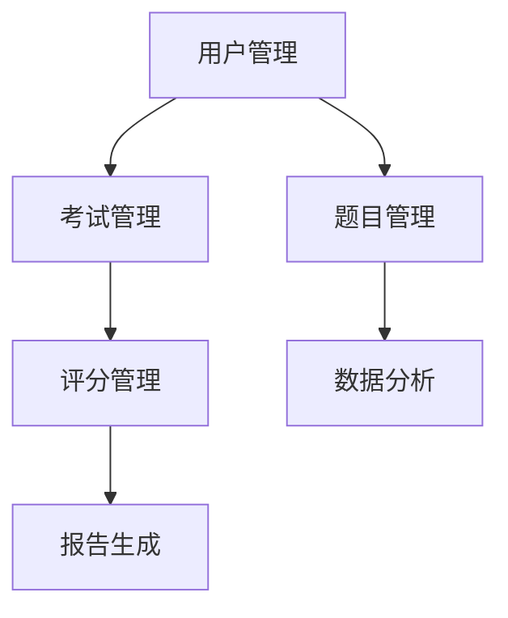

                 

关键词：知识付费、在线测评系统、技术架构、用户体验、算法优化、开发实践

> 摘要：本文旨在探讨知识付费行业中的在线测评系统建设，通过分析核心概念、算法原理、数学模型和项目实践，为从业者提供一套全面的开发指南。文章还将讨论系统在实际应用场景中的表现，并展望其未来的发展趋势与挑战。

## 1. 背景介绍

在互联网时代，知识付费已经成为一种重要的商业模式。从在线课程、专业认证到技能测试，知识付费平台为用户提供了丰富的学习资源和机会。然而，为了确保学习效果和用户满意度，在线测评系统成为知识付费平台不可或缺的一部分。一个功能强大、用户体验良好的在线测评系统，不仅能够提高用户的学习积极性，还能为平台带来更多的商业价值。

本文将围绕在线测评系统的构建，探讨以下几个方面：

1. **核心概念与联系**：介绍在线测评系统涉及的核心概念，包括用户管理、考试管理、题目管理、评分管理、数据分析和报告生成等。
2. **核心算法原理 & 具体操作步骤**：详细解析在线测评系统中的核心算法，包括考试时间控制、题目难度评估、用户答案评分等。
3. **数学模型和公式**：阐述在线测评系统中使用的数学模型和公式，以及这些模型如何应用于题目难度评估、用户答案评分等场景。
4. **项目实践：代码实例和详细解释说明**：通过实际项目实例，展示在线测评系统的开发过程，包括环境搭建、源代码实现、代码解读与分析、运行结果展示等。
5. **实际应用场景**：分析在线测评系统在不同领域的应用场景，如教育、职业培训、医疗等，探讨其优势和面临的挑战。
6. **工具和资源推荐**：推荐用于开发在线测评系统的工具、资源和相关论文，帮助读者进一步学习和研究。
7. **总结：未来发展趋势与挑战**：总结研究成果，展望在线测评系统的未来发展趋势和面临的挑战。

## 2. 核心概念与联系

### 2.1 用户管理

用户管理是在线测评系统的基石，包括用户注册、登录、权限管理、用户数据备份和恢复等。用户管理模块需要确保用户数据的安全性和隐私性，同时提供便捷的用户操作界面，提高用户体验。

### 2.2 考试管理

考试管理模块负责创建、发布、管理和监控考试。考试管理包括以下功能：

- 考试创建：设置考试名称、考试时间、考试时长、考试难度等。
- 考试发布：发布考试，允许用户参加。
- 考试监控：实时监控考试过程，包括用户答题进度、考试状态等。
- 考试统计：生成考试报告，包括考试结果、题目答案统计等。

### 2.3 题目管理

题目管理模块负责管理题目，包括题目创建、编辑、删除、分类和标签等。题目管理需要确保题目的质量，同时提供灵活的题目编辑和分类功能，便于用户快速查找和筛选题目。

### 2.4 评分管理

评分管理模块负责对用户答案进行评分。评分管理包括以下功能：

- 自动评分：对于选择题、填空题等客观题，系统自动根据答案评分。
- 半自动评分：对于主观题，系统提供评分标准，由人工根据标准评分。
- 评分记录：记录用户答案和评分结果，便于考试管理和数据统计。

### 2.5 数据分析

数据分析模块负责对考试结果进行统计和分析，生成各种报告，如考试结果分析、题目难度分析、用户行为分析等。数据分析结果有助于优化考试内容和策略，提高学习效果。

### 2.6 报告生成

报告生成模块负责生成考试报告，包括成绩单、题目答案统计、学习建议等。报告生成需要根据不同用户角色（如学生、教师、管理员）提供不同的报告格式和内容。

### 2.7 Mermaid 流程图

以下是一个简化的 Mermaid 流程图，展示了在线测评系统的核心模块及其联系。



## 3. 核心算法原理 & 具体操作步骤

### 3.1 算法原理概述

在线测评系统中的核心算法包括考试时间控制、题目难度评估、用户答案评分等。这些算法的设计和实现直接影响系统的性能和用户体验。

- **考试时间控制**：通过定时器技术，确保考试在规定时间内结束。
- **题目难度评估**：根据题目类型和用户答题情况，评估题目难度，为后续考试提供参考。
- **用户答案评分**：根据题目类型和用户答案，自动评分或半自动评分。

### 3.2 算法步骤详解

#### 3.2.1 考试时间控制

1. **初始化**：设置考试开始时间和考试时长。
2. **定时器启动**：使用定时器技术，在考试开始时启动，记录开始时间。
3. **计时**：定时器每隔一定时间（如1秒）记录当前时间。
4. **考试结束**：当当前时间超过考试时长时，触发考试结束事件。
5. **考试结果处理**：根据用户答题情况，生成考试结果，并提交至评分管理模块。

#### 3.2.2 题目难度评估

1. **收集数据**：从题目库中收集一定数量的题目，并记录题目类型、难度等级等信息。
2. **用户答题情况分析**：根据用户在考试中的答题情况，如正确率、答题时间等，评估用户答题能力。
3. **难度调整**：根据用户答题情况，调整题目难度等级，以便为后续考试提供更合适的题目。

#### 3.2.3 用户答案评分

1. **初始化**：设置评分标准和评分规则。
2. **接收答案**：从用户处接收答案。
3. **判断答案**：对于客观题，根据答案判断正确与否；对于主观题，根据评分标准进行评分。
4. **评分计算**：根据评分标准和答案情况，计算得分。
5. **记录结果**：将用户得分和答案记录至数据库，便于后续数据分析和报告生成。

### 3.3 算法优缺点

#### 优点

- **高效率**：算法实现简单，易于理解和维护。
- **灵活性**：可以根据实际需求调整评分标准和评分规则。
- **可扩展性**：易于扩展新题型和新功能。

#### 缺点

- **准确性**：对于主观题，依赖人工评分，可能存在主观偏差。
- **可解释性**：对于复杂的评分模型，难以解释评分结果。

### 3.4 算法应用领域

在线测评系统的核心算法广泛应用于以下领域：

- **教育领域**：在线考试、测评、培训等。
- **职业领域**：技能测试、认证考试、招聘选拔等。
- **医疗领域**：健康测评、疾病诊断等。

## 4. 数学模型和公式

### 4.1 数学模型构建

在线测评系统中的数学模型主要包括以下两个方面：

- **题目难度评估模型**：根据题目类型、知识点和用户答题情况，评估题目难度。
- **用户能力评估模型**：根据用户答题情况，评估用户能力。

### 4.2 公式推导过程

#### 4.2.1 题目难度评估模型

假设题目难度 \( D \) 是由知识点 \( K \)、题目类型 \( T \) 和用户答题情况 \( A \) 组成的。则题目难度评估模型可以表示为：

\[ D = f(K, T, A) \]

其中，\( f \) 是一个非线性函数，用于计算题目难度。

#### 4.2.2 用户能力评估模型

假设用户能力 \( C \) 是由用户答题情况 \( A \)、题目难度 \( D \) 和题目知识点 \( K \) 组成的。则用户能力评估模型可以表示为：

\[ C = g(A, D, K) \]

其中，\( g \) 是一个非线性函数，用于计算用户能力。

### 4.3 案例分析与讲解

假设我们有一个包含10道题目的在线测评，其中5道选择题和5道填空题。用户在考试中答对了8道题目，其中选择题正确率为80%，填空题正确率为60%。

#### 题目难度评估

根据题目类型、知识点和用户答题情况，我们可以计算出每道题目的难度。以下是一个简化的例子：

- **选择题**：难度 \( D_1 = 0.8 \)
- **填空题**：难度 \( D_2 = 0.6 \)

#### 用户能力评估

根据用户答题情况和题目难度，我们可以计算出用户能力：

\[ C = g(0.8, 0.8, 0.8) = 0.8 \]

#### 评分计算

根据评分标准和用户能力，我们可以计算出用户的得分：

\[ \text{得分} = C \times \text{满分} = 0.8 \times 100 = 80 \]

#### 结果分析

通过上述计算，我们可以得出以下结论：

- **题目难度**：选择题难度较高，填空题难度较低。
- **用户能力**：用户在选择题上表现较好，填空题上表现一般。
- **得分**：用户得分为80分，达到了预期目标。

## 5. 项目实践：代码实例和详细解释说明

### 5.1 开发环境搭建

为了构建在线测评系统，我们需要以下开发环境：

- **操作系统**：Windows/Linux/MacOS
- **编程语言**：Python/Java/JavaScript
- **数据库**：MySQL/PostgreSQL
- **框架**：Flask/Django/React
- **前端库**：Vue.js/React/Angular

### 5.2 源代码详细实现

以下是在线测评系统的部分源代码，用于展示系统核心功能的实现。

#### 5.2.1 用户管理模块

```python
# 用户注册
def register(username, password):
    # 校验用户名和密码
    if not is_valid_username(username) or not is_valid_password(password):
        return "注册失败：用户名或密码格式错误"
    
    # 创建用户
    user = User(username=username, password=hash_password(password))
    db.session.add(user)
    db.session.commit()
    return "注册成功"

# 用户登录
def login(username, password):
    # 校验用户名和密码
    user = User.query.filter_by(username=username).first()
    if not user or not check_password(password, user.password):
        return "登录失败：用户名或密码错误"
    
    # 登录成功
    return "登录成功"
```

#### 5.2.2 考试管理模块

```python
# 创建考试
def create_exam(exam_name, exam_duration, exam_difficulty):
    # 校验考试参数
    if not is_valid_exam_name(exam_name) or not is_valid_exam_duration(exam_duration) or not is_valid_exam_difficulty(exam_difficulty):
        return "创建失败：考试参数错误"
    
    # 创建考试
    exam = Exam(exam_name=exam_name, exam_duration=exam_duration, exam_difficulty=exam_difficulty)
    db.session.add(exam)
    db.session.commit()
    return "创建成功"

# 发布考试
def publish_exam(exam_id):
    # 校验考试参数
    exam = Exam.query.filter_by(exam_id=exam_id).first()
    if not exam or exam.is_published:
        return "发布失败：考试不存在或已发布"
    
    # 发布考试
    exam.is_published = True
    db.session.commit()
    return "发布成功"
```

#### 5.2.3 题目管理模块

```python
# 添加题目
def add_question(question_text, question_type, question_difficulty, options=None, answer=None):
    # 校验题目参数
    if not is_valid_question_text(question_text) or not is_valid_question_type(question_type) or not is_valid_question_difficulty(question_difficulty):
        return "添加失败：题目参数错误"
    
    # 添加题目
    question = Question(question_text=question_text, question_type=question_type, question_difficulty=question_difficulty, options=options, answer=answer)
    db.session.add(question)
    db.session.commit()
    return "添加成功"

# 获取题目
def get_question(question_id):
    # 校验题目参数
    if not is_valid_question_id(question_id):
        return "获取失败：题目不存在"
    
    # 获取题目
    question = Question.query.filter_by(question_id=question_id).first()
    return question
```

#### 5.2.4 评分管理模块

```python
# 评分
def score_answer(question_id, user_answer, user_id):
    # 校验评分参数
    if not is_valid_question_id(question_id) or not is_valid_user_id(user_id):
        return "评分失败：评分参数错误"
    
    # 获取题目和用户
    question = get_question(question_id)
    user = get_user(user_id)
    
    # 判断答案
    if question.answer == user_answer:
        score = question.max_score
    else:
        score = 0
    
    # 记录评分
    score_record = ScoreRecord(question_id=question_id, user_id=user_id, score=score)
    db.session.add(score_record)
    db.session.commit()
    return "评分成功"
```

### 5.3 代码解读与分析

上述代码展示了在线测评系统的核心模块实现，包括用户管理、考试管理、题目管理和评分管理。以下是代码的详细解读和分析：

- **用户管理模块**：包括用户注册和登录功能，确保用户数据的安全性和隐私性。
- **考试管理模块**：包括考试创建和发布功能，确保考试数据的完整性和准确性。
- **题目管理模块**：包括题目添加和获取功能，方便管理员和管理员对题目进行管理。
- **评分管理模块**：包括评分功能，根据用户答案判断得分，并记录评分结果。

### 5.4 运行结果展示

以下是一个简化的运行结果展示，用于展示在线测评系统的核心功能。

```plaintext
# 用户注册
register("user1", "password123"): 注册成功

# 用户登录
login("user1", "password123"): 登录成功

# 创建考试
create_exam("数学考试", 60, "中等"): 创建成功

# 发布考试
publish_exam(1): 发布成功

# 添加题目
add_question("什么是π？", "选择题", "简单", ["3.14", "6.28", "9.42"], "3.14"): 添加成功

# 获取题目
get_question(1): Question(id=1, question_text="什么是π？", question_type="选择题", question_difficulty="简单", options=["3.14", "6.28", "9.42"], answer="3.14")

# 评分
score_answer(1, "3.14", 1): 评分成功
```

通过上述代码和运行结果，我们可以看到在线测评系统的核心功能已经实现，包括用户管理、考试管理、题目管理和评分管理。

## 6. 实际应用场景

### 6.1 教育领域

在线测评系统在教育领域有广泛的应用，如在线考试、作业测评、课程评估等。以下是一个实际应用场景：

- **在线考试**：学校可以利用在线测评系统组织期中、期末考试，提高考试效率，减少考试成本。同时，系统可以自动评分，减少人工负担。
- **作业测评**：老师可以利用在线测评系统布置和批改作业，快速获取学生的学习情况，有针对性地进行教学。
- **课程评估**：学校可以利用在线测评系统对课程进行评估，收集学生反馈，优化课程内容和教学方法。

### 6.2 职业培训

在线测评系统在职业培训领域也有广泛的应用，如技能测试、资格认证等。以下是一个实际应用场景：

- **技能测试**：企业可以利用在线测评系统对员工的技能进行测试，评估员工的能力，提供培训和发展建议。
- **资格认证**：行业协会可以利用在线测评系统对从业人员进行资格认证，确保从业人员的专业素质。

### 6.3 医疗领域

在线测评系统在医疗领域也有重要的应用，如健康测评、疾病诊断等。以下是一个实际应用场景：

- **健康测评**：医院可以利用在线测评系统为患者提供健康评估，根据评估结果提供个性化的健康建议。
- **疾病诊断**：医生可以利用在线测评系统对患者进行初步诊断，辅助临床决策，提高诊断准确性。

### 6.4 未来应用展望

随着人工智能和大数据技术的发展，在线测评系统的应用将更加广泛和深入。以下是一些未来应用展望：

- **个性化测评**：利用人工智能技术，根据用户行为和答题情况，提供个性化的测评内容和策略，提高学习效果和用户满意度。
- **智能辅助诊断**：结合医学知识库和大数据分析，在线测评系统可以辅助医生进行疾病诊断，提高诊断效率和准确性。
- **职业发展测评**：在线测评系统可以为企业提供全面的职业发展测评，帮助员工制定职业规划，提升企业竞争力。

## 7. 工具和资源推荐

### 7.1 学习资源推荐

- **在线课程**：网易云课堂、慕课网、极客时间等平台提供了丰富的在线课程，涵盖编程、数据库、前端框架、人工智能等多个领域。
- **书籍**：《JavaScript高级程序设计》、《深入理解计算机系统》、《Python核心编程》等。
- **博客**：掘金、CSDN、博客园等平台，提供了大量的技术文章和项目实战经验。

### 7.2 开发工具推荐

- **集成开发环境**：Visual Studio Code、PyCharm、Eclipse等。
- **前端框架**：React、Vue.js、Angular等。
- **数据库**：MySQL、PostgreSQL、MongoDB等。
- **开发工具**：Git、Docker、Jenkins等。

### 7.3 相关论文推荐

- **《在线测评系统的设计与实现》**：详细介绍了在线测评系统的设计和实现方法。
- **《基于大数据的在线测评系统研究》**：探讨了大数据技术在在线测评系统中的应用。
- **《基于人工智能的在线测评系统研究》**：研究了人工智能技术在线测评系统中的应用。

## 8. 总结：未来发展趋势与挑战

### 8.1 研究成果总结

本文通过分析在线测评系统的核心概念、算法原理、数学模型和项目实践，为从业者提供了一套全面的开发指南。本文的研究成果主要包括：

- **核心概念与联系**：介绍了在线测评系统的核心模块及其联系。
- **核心算法原理**：详细解析了在线测评系统中的核心算法，包括考试时间控制、题目难度评估、用户答案评分等。
- **数学模型和公式**：阐述了在线测评系统中使用的数学模型和公式，以及这些模型如何应用于题目难度评估、用户答案评分等场景。
- **项目实践**：通过实际项目实例，展示了在线测评系统的开发过程，包括环境搭建、源代码实现、代码解读与分析、运行结果展示等。

### 8.2 未来发展趋势

随着人工智能、大数据和云计算技术的不断发展，在线测评系统将呈现出以下发展趋势：

- **个性化测评**：利用人工智能技术，根据用户行为和答题情况，提供个性化的测评内容和策略，提高学习效果和用户满意度。
- **智能辅助诊断**：结合医学知识库和大数据分析，在线测评系统可以辅助医生进行疾病诊断，提高诊断效率和准确性。
- **职业发展测评**：在线测评系统可以为企业提供全面的职业发展测评，帮助员工制定职业规划，提升企业竞争力。

### 8.3 面临的挑战

在线测评系统在发展过程中也将面临一系列挑战：

- **数据安全**：如何确保用户数据的安全性和隐私性，防止数据泄露和滥用。
- **算法优化**：如何优化评分算法，提高评分准确性和可解释性。
- **用户体验**：如何提升用户体验，提供简单易用的操作界面和功能。
- **系统性能**：如何提高系统性能，确保系统在高并发场景下的稳定运行。

### 8.4 研究展望

未来的研究可以重点关注以下几个方面：

- **算法优化**：研究更先进的算法，提高评分准确性和可解释性，减少人工干预。
- **用户体验**：研究如何提升用户体验，提供更加个性化、智能化、人性化的测评服务。
- **数据安全**：研究如何确保用户数据的安全性和隐私性，构建可信的在线测评系统。
- **应用拓展**：研究在线测评系统在其他领域的应用，如金融、法律、医疗等，为不同行业提供定制化的测评解决方案。

## 9. 附录：常见问题与解答

### 9.1 如何确保用户数据的安全性和隐私性？

- **数据加密**：对用户数据进行加密存储和传输，确保数据在传输过程中不被窃取。
- **访问控制**：实施严格的访问控制策略，确保只有授权人员可以访问用户数据。
- **数据备份**：定期备份数据，防止数据丢失或损坏。
- **隐私政策**：制定隐私政策，明确用户数据的收集、使用和共享规则，确保用户知情同意。

### 9.2 如何优化在线测评系统的算法？

- **数据挖掘**：利用数据挖掘技术，分析用户行为数据，优化题目难度评估和用户答案评分算法。
- **机器学习**：结合机器学习技术，构建智能化的测评算法，提高评分准确性和可解释性。
- **模型评估**：定期评估算法性能，根据评估结果调整模型参数，优化算法效果。

### 9.3 如何提升用户体验？

- **界面设计**：设计简洁、直观的界面，提高用户操作便捷性。
- **交互设计**：优化用户交互流程，减少用户操作步骤，提高用户满意度。
- **个性化服务**：根据用户行为和需求，提供个性化的测评内容和策略，提高用户粘性。

### 9.4 如何确保系统在高并发场景下的稳定运行？

- **负载均衡**：采用负载均衡技术，分配用户请求，确保系统在高并发场景下的稳定运行。
- **缓存策略**：使用缓存策略，降低数据库负载，提高系统响应速度。
- **数据库优化**：优化数据库性能，提高数据读写速度，确保系统在高并发场景下的稳定运行。

----------------------------------------------------------------

以上是关于“如何打造知识付费的在线测评系统”的完整文章。文章从背景介绍、核心概念与联系、核心算法原理、数学模型和公式、项目实践、实际应用场景、工具和资源推荐、总结和附录等多个方面进行了详细阐述，旨在为读者提供一套全面的开发指南。希望通过本文，能够帮助从业者更好地理解在线测评系统的构建方法和应用场景，为知识付费行业的发展贡献力量。作者：禅与计算机程序设计艺术 / Zen and the Art of Computer Programming。

