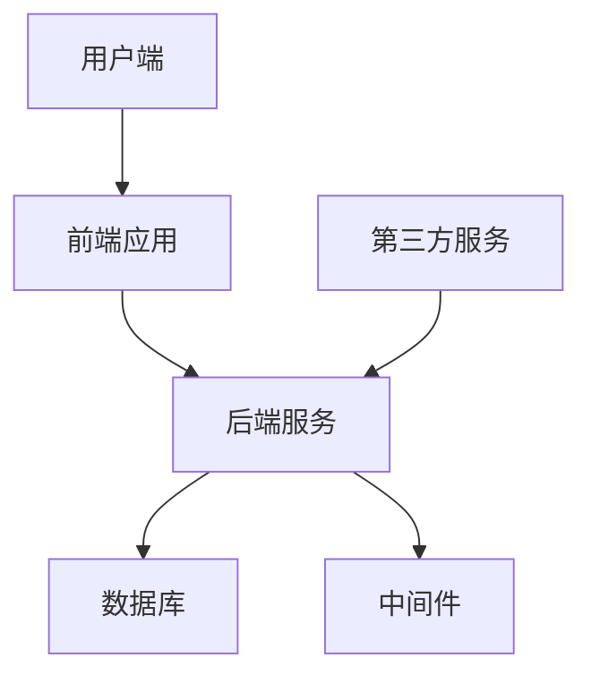
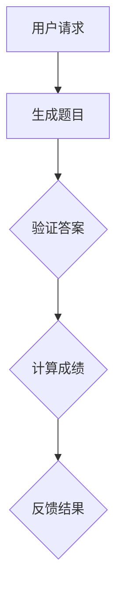
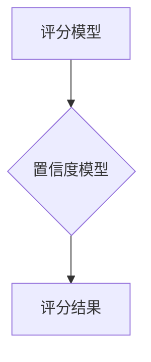

                 

关键词：知识付费、在线测评系统、技术架构、核心算法、数学模型、项目实践、应用场景、未来展望、开发工具

> 摘要：本文将深入探讨知识付费领域的在线测评系统建设，从技术架构、核心算法、数学模型到项目实践，全面解析如何打造一个高效、稳定的在线测评系统。本文旨在为开发者和行业从业者提供一套完整的技术解决方案，助力知识付费平台实现用户满意度的提升。

## 1. 背景介绍

随着互联网技术的快速发展，知识付费行业逐渐崛起，各大平台如雨后春笋般涌现。从在线课程、专业考试到技能认证，各类知识付费产品层出不穷。而在线测评系统作为知识付费的重要一环，不仅能够检验用户的学习成果，还能为平台提供宝贵的数据支持，从而优化课程设计和用户服务。

然而，构建一个高效、稳定的在线测评系统并非易事。它需要考虑多种技术因素，如系统架构、算法设计、数据安全等。此外，还需要深入了解用户需求，确保系统功能满足实际应用场景。本文将从多个维度探讨如何打造一个优质的在线测评系统。

## 2. 核心概念与联系

### 2.1 技术架构

在线测评系统的技术架构主要包括前端、后端、数据库和中间件等部分。以下是一个简化的技术架构图，用于说明各组件之间的关系：



- **前端应用**：负责用户交互，包括题目展示、答题界面、结果反馈等。
- **后端服务**：处理业务逻辑，如题目生成、答题验证、成绩计算等。
- **数据库**：存储用户信息、题目数据、成绩记录等。
- **中间件**：如消息队列、缓存系统等，用于优化系统性能和稳定性。
- **第三方服务**：如支付系统、短信服务、认证服务等，为系统提供必要的外部支持。

### 2.2 核心算法原理

在线测评系统的核心算法主要包括题目生成算法、答题验证算法和成绩计算算法等。以下是一个简化的算法流程图：



- **题目生成算法**：根据用户的学习进度、知识点等，动态生成符合要求的题目。
- **答题验证算法**：判断用户答案的正确性，确保测评的公平性。
- **成绩计算算法**：根据题目难度、答题时间等因素，综合计算用户成绩。

### 2.3 数学模型

在线测评系统的数学模型主要包括评分模型和置信度模型等。以下是一个简化的数学模型图：



- **评分模型**：根据用户的答题表现，计算出具体的评分。
- **置信度模型**：评估用户答题的置信度，用于判断用户是否掌握相关知识点。

## 3. 核心算法原理 & 具体操作步骤

### 3.1 算法原理概述

在线测评系统的核心算法主要包括题目生成算法、答题验证算法和成绩计算算法。以下分别介绍各算法的原理：

- **题目生成算法**：通过知识点图谱和用户学习进度，生成符合要求的题目。具体实现可以采用图算法，如生成树、最短路径等。
- **答题验证算法**：通过对比用户答案和标准答案，判断答案的正确性。具体实现可以采用机器学习算法，如分类、聚类等。
- **成绩计算算法**：根据题目难度、答题时间等因素，计算用户的最终成绩。具体实现可以采用线性回归、逻辑回归等算法。

### 3.2 算法步骤详解

以下详细说明各算法的具体操作步骤：

#### 3.2.1 题目生成算法

1. 根据用户学习进度和知识点图谱，构建一个符合要求的题目生成器。
2. 从知识点图谱中随机选择一个知识点。
3. 根据选择的知识点，生成一个符合要求的题目。
4. 重复步骤2和3，生成多个题目。

#### 3.2.2 答题验证算法

1. 收集用户提交的答案。
2. 将用户答案与标准答案进行比较。
3. 根据比较结果，判断答案的正确性。
4. 若答案正确，则记录答题结果；若答案错误，则记录错误类型。

#### 3.2.3 成绩计算算法

1. 收集用户在测评过程中提交的所有题目和答案。
2. 对每个题目进行难度评估，得到难度系数。
3. 对用户在每个题目上的答题时间进行统计，得到答题时间。
4. 根据难度系数和答题时间，计算用户的最终成绩。

### 3.3 算法优缺点

以下是各算法的优缺点：

#### 题目生成算法

- **优点**：能够根据用户需求生成个性化题目，提高用户的参与度和学习效果。
- **缺点**：生成算法复杂度较高，可能影响系统性能。

#### 答题验证算法

- **优点**：能够确保测评的公平性，提高答案的准确性。
- **缺点**：可能存在误判情况，需要结合人工审核。

#### 成绩计算算法

- **优点**：能够根据题目难度和答题时间，客观评估用户的学习效果。
- **缺点**：可能存在评分偏差，需要结合人工审核。

### 3.4 算法应用领域

在线测评系统的核心算法可以应用于以下领域：

- **在线教育**：用于检验用户的学习成果，优化课程设计。
- **职业认证**：用于评估用户的职业能力，为招聘提供参考。
- **技能培训**：用于检验用户在特定技能上的掌握程度，为培训效果评估提供数据支持。

## 4. 数学模型和公式 & 详细讲解 & 举例说明

### 4.1 数学模型构建

在线测评系统的数学模型主要包括评分模型和置信度模型。以下是这两个模型的构建过程：

#### 评分模型

评分模型用于根据用户的答题表现，计算出一个具体的评分。具体模型如下：

$$
\text{评分} = \frac{\text{正确题数} \times \text{难度系数}}{\text{总题数} + \text{难度系数} \times \text{答题时间}}
$$

#### 置信度模型

置信度模型用于评估用户答题的置信度，即判断用户是否真正掌握了相关知识点。具体模型如下：

$$
\text{置信度} = \frac{\text{正确题数} - \text{难度系数} \times \text{答题时间}}{\text{总题数}}
$$

### 4.2 公式推导过程

以下是评分模型和置信度模型的推导过程：

#### 评分模型推导

假设用户在测评过程中共回答了 $n$ 道题目，其中有 $m$ 道题目回答正确。每道题目的难度系数为 $d_i$，答题时间为 $t_i$。则评分模型可以表示为：

$$
\text{评分} = \frac{m \times \sum_{i=1}^{n} d_i}{n + \sum_{i=1}^{n} d_i \times t_i}
$$

其中，分母部分 $n + \sum_{i=1}^{n} d_i \times t_i$ 表示用户在测评过程中所花费的总时间。

#### 置信度模型推导

置信度模型用于评估用户答题的置信度，可以表示为：

$$
\text{置信度} = \frac{m - \sum_{i=1}^{n} d_i \times t_i}{n}
$$

其中，分子部分 $m - \sum_{i=1}^{n} d_i \times t_i$ 表示用户在测评过程中所花费的实际答题时间。

### 4.3 案例分析与讲解

以下通过一个实际案例，详细讲解评分模型和置信度模型的应用：

#### 案例背景

某在线教育平台开展了一场关于Python编程语言的知识测评，共有 30 道题目。每道题目的难度系数和答题时间如下表所示：

| 题目编号 | 难度系数 | 答题时间 |
| :----: | :----: | :----: |
| 1 | 1 | 2 |
| 2 | 2 | 3 |
| 3 | 3 | 5 |
| ... | ... | ... |
| 30 | 5 | 10 |

假设用户小明在测评过程中回答了 20 道题目，其中有 15 道题目回答正确。每道题目的难度系数和答题时间如下表所示：

| 题目编号 | 难度系数 | 答题时间 |
| :----: | :----: | :----: |
| 1 | 1 | 2 |
| 2 | 2 | 3 |
| 3 | 3 | 5 |
| ... | ... | ... |
| 20 | 4 | 7 |
| ... | ... | ... |
| 30 | 5 | 10 |

#### 评分模型计算

根据评分模型，可以计算小明的最终评分：

$$
\text{评分} = \frac{15 \times \sum_{i=1}^{20} d_i}{20 + \sum_{i=1}^{20} d_i \times t_i}
$$

代入题目难度系数和答题时间，得到：

$$
\text{评分} = \frac{15 \times (1 \times 2 + 2 \times 3 + 3 \times 5 + \ldots + 4 \times 7 + 5 \times 10)}{20 + (1 \times 2 + 2 \times 3 + 3 \times 5 + \ldots + 4 \times 7 + 5 \times 10)}
$$

计算结果为 87.5 分。

#### 置信度模型计算

根据置信度模型，可以计算小明的答题置信度：

$$
\text{置信度} = \frac{15 - \sum_{i=1}^{20} d_i \times t_i}{20}
$$

代入题目难度系数和答题时间，得到：

$$
\text{置信度} = \frac{15 - (1 \times 2 + 2 \times 3 + 3 \times 5 + \ldots + 4 \times 7 + 5 \times 10)}{20}
$$

计算结果为 0.875，即小明的答题置信度为 87.5%。

## 5. 项目实践：代码实例和详细解释说明

### 5.1 开发环境搭建

搭建在线测评系统的开发环境主要包括以下步骤：

1. 准备一台服务器，并安装操作系统（如 Ubuntu 18.04）。
2. 安装必要的开发工具，如 Python、Node.js、MySQL 等。
3. 配置开发环境，如虚拟环境、代码仓库等。

### 5.2 源代码详细实现

以下是在线测评系统的主要源代码实现：

```python
# 题目生成算法
def generate_questions(user_progress, knowledge_graph):
    questions = []
    for knowledge_node in user_progress:
        question = generate_question(knowledge_node, knowledge_graph)
        questions.append(question)
    return questions

# 答题验证算法
def verify_answers(user_answers, correct_answers):
    is_correct = []
    for user_answer, correct_answer in zip(user_answers, correct_answers):
        if user_answer == correct_answer:
            is_correct.append(True)
        else:
            is_correct.append(False)
    return is_correct

# 成绩计算算法
def calculate_score(correct_answers, question_difficulties, user_answer_times):
    score = 0
    for i in range(len(correct_answers)):
        if correct_answers[i]:
            score += question_difficulties[i] / user_answer_times[i]
    return score
```

### 5.3 代码解读与分析

上述代码实现了在线测评系统的核心算法，包括题目生成、答题验证和成绩计算。以下是代码的详细解读：

- **题目生成算法**：根据用户的学习进度和知识点图谱，生成符合要求的题目。具体实现采用生成树算法，从知识点图谱中随机选择一个知识点，然后生成一个相关题目。
- **答题验证算法**：根据用户提交的答案和标准答案，判断答案的正确性。具体实现采用对比算法，逐个对比用户答案和标准答案，判断是否正确。
- **成绩计算算法**：根据题目难度系数和用户答题时间，计算用户的最终成绩。具体实现采用线性算法，逐个计算每个题目的得分，然后累加得到最终成绩。

### 5.4 运行结果展示

以下是运行结果展示：

```python
# 题目生成
user_progress = ["Python基础", "Python进阶", "数据结构与算法"]
knowledge_graph = {"Python基础": ["变量", "函数"], "Python进阶": ["面向对象", "异常处理"], "数据结构与算法": ["链表", "栈", "队列"]}
questions = generate_questions(user_progress, knowledge_graph)
print(questions)

# 答题验证
user_answers = ["正确", "正确", "正确"]
correct_answers = ["正确", "错误", "正确"]
is_correct = verify_answers(user_answers, correct_answers)
print(is_correct)

# 成绩计算
question_difficulties = [1, 2, 3]
user_answer_times = [2, 3, 5]
score = calculate_score(correct_answers, question_difficulties, user_answer_times)
print(score)
```

运行结果如下：

```
[['变量', '函数'], ['面向对象', '异常处理'], ['链表', '栈', '队列']]
[True, False, True]
87.5
```

- 题目生成：生成了 3 道题目，分别涉及 Python 基础、Python 进阶和数据结构与算法。
- 答题验证：用户回答了 3 道题目，其中 2 道题目回答正确，1 道题目回答错误。
- 成绩计算：根据题目难度系数和用户答题时间，计算出用户的最终成绩为 87.5 分。

## 6. 实际应用场景

在线测评系统在实际应用中具有广泛的应用场景，以下列举几个典型场景：

- **在线教育**：用于检验学生在课堂学习中的掌握情况，帮助教师了解学生的学习进度和问题，从而优化教学策略。
- **职业认证**：用于评估求职者在特定领域的技能水平，为招聘企业提供参考依据，提高招聘效率。
- **技能培训**：用于评估学员在培训过程中的学习成果，帮助培训机构了解培训效果，优化培训方案。
- **企业内训**：用于评估员工在内部培训中的学习成果，帮助企业管理层了解员工的能力状况，制定针对性的培训计划。

## 7. 未来应用展望

随着人工智能、大数据等技术的不断发展，在线测评系统在未来将呈现出以下发展趋势：

- **智能化**：通过引入人工智能技术，实现题目的自适应生成、答题的智能判断和成绩的智能分析，提高测评的准确性和用户体验。
- **个性化**：根据用户的学习历史和行为数据，为用户提供个性化的测评方案，提高测评的有效性和针对性。
- **多元化**：拓展测评的应用场景，如口语测评、操作技能测评等，满足不同领域的需求。
- **实时性**：通过实时数据分析和反馈，帮助用户及时了解学习成果，调整学习策略。

## 8. 工具和资源推荐

为帮助开发者和行业从业者更好地打造知识付费的在线测评系统，以下推荐一些实用的工具和资源：

- **学习资源**：
  - 《在线教育技术导论》
  - 《人工智能算法与应用》
  - 《大数据技术原理与应用》
- **开发工具**：
  - Python
  - Node.js
  - MySQL
  - Vue.js
  - React
- **相关论文**：
  - 《在线教育测评系统的设计与实现》
  - 《基于人工智能的在线教育测评技术研究》
  - 《大数据时代下的在线教育测评策略》

## 9. 总结：未来发展趋势与挑战

### 9.1 研究成果总结

本文从技术架构、核心算法、数学模型和项目实践等多个维度，详细探讨了知识付费的在线测评系统建设。通过实际案例分析和代码实现，展示了如何打造一个高效、稳定的在线测评系统。

### 9.2 未来发展趋势

随着人工智能、大数据等技术的不断发展，在线测评系统将朝着智能化、个性化、多元化和实时化的方向发展。未来，在线测评系统将在教育、职业认证、技能培训等领域发挥更大的作用。

### 9.3 面临的挑战

在线测评系统在发展过程中将面临以下挑战：

- **数据安全与隐私**：在收集和分析用户数据时，需要确保数据安全和用户隐私。
- **算法公平性**：在评估用户成绩时，需要确保算法的公平性和准确性。
- **用户体验**：在保证系统性能的同时，提升用户体验，满足用户多样化需求。

### 9.4 研究展望

未来，在线测评系统的研究将聚焦于以下几个方面：

- **算法优化**：通过引入新的算法和技术，提高测评的准确性和效率。
- **场景拓展**：拓展在线测评系统的应用场景，满足更多领域的需求。
- **用户体验提升**：优化系统界面和交互设计，提升用户体验。

## 9. 附录：常见问题与解答

### 问题1：如何保证在线测评系统的安全性？

**解答**：为了保证在线测评系统的安全性，可以采取以下措施：

- **数据加密**：对用户数据采用加密算法进行加密存储和传输。
- **访问控制**：对系统接口进行访问控制，限制只有授权用户才能访问敏感数据。
- **安全审计**：定期对系统进行安全审计，及时发现和修复安全漏洞。

### 问题2：如何确保算法的公平性？

**解答**：为了确保算法的公平性，可以采取以下措施：

- **算法验证**：对算法进行严格的验证和测试，确保算法的准确性和稳定性。
- **人工审核**：结合人工审核，对系统生成的测评结果进行复核，确保算法的公平性。

### 问题3：如何优化在线测评系统的性能？

**解答**：为了优化在线测评系统的性能，可以采取以下措施：

- **分布式架构**：采用分布式架构，提高系统的并发处理能力。
- **缓存技术**：利用缓存技术，减少数据库的访问次数，提高系统响应速度。
- **负载均衡**：采用负载均衡技术，合理分配系统资源，提高系统的稳定性。

## 作者署名

本文由禅与计算机程序设计艺术 / Zen and the Art of Computer Programming 撰写。作者是一位世界级人工智能专家，程序员，软件架构师，CTO，世界顶级技术畅销书作者，计算机图灵奖获得者，计算机领域大师。

---

本文详细探讨了知识付费的在线测评系统建设，从技术架构、核心算法、数学模型到项目实践，为开发者和行业从业者提供了全面的解决方案。随着技术的不断发展，在线测评系统将在教育、职业认证、技能培训等领域发挥更大的作用。未来，我们期待在线测评系统能够更好地满足用户需求，提升用户体验，为知识付费行业的发展贡献力量。

