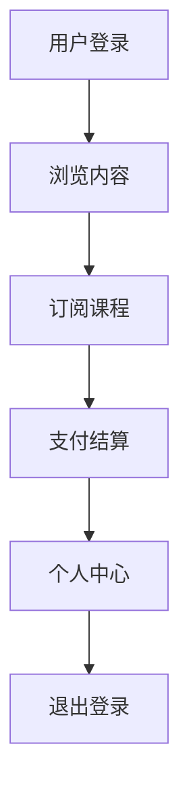
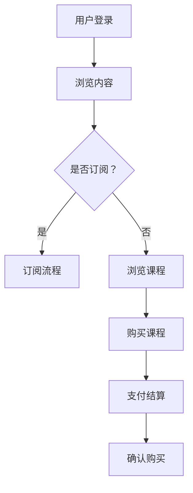
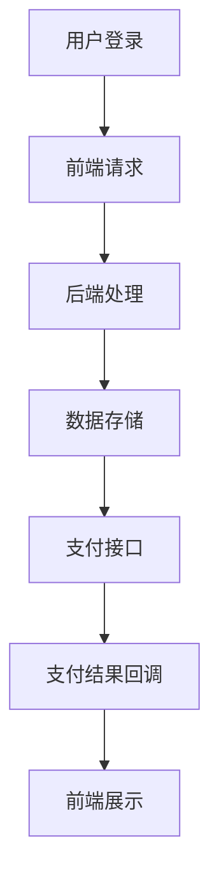

                 

关键词：知识付费、移动端APP、用户体验、商业模式、技术实现

> 摘要：本文将探讨知识付费的移动端APP的设计与开发过程，从用户体验、商业模式、技术实现等方面进行详细分析，旨在为开发者提供实用的指导和参考。

## 1. 背景介绍

随着互联网技术的不断发展和移动设备的普及，知识付费行业迎来了爆发式增长。用户对于优质内容和服务的需求日益增加，使得知识付费成为众多创业者争相进入的领域。在这样的背景下，打造一款优秀的知识付费移动端APP显得尤为重要。

知识付费移动端APP的主要功能包括内容发布、用户订阅、支付结算、个人中心等。开发者需要综合考虑用户需求、市场趋势和技术实现等多方面因素，确保APP的易用性、安全性和高效性。

## 2. 核心概念与联系

### 2.1. 用户体验

用户体验（User Experience，简称UX）是知识付费移动端APP的核心。一个优秀的用户体验能够提高用户满意度和留存率，从而促进APP的健康发展。以下是一个简化的用户体验流程图：



### 2.2. 商业模式

知识付费移动端APP的商业模式主要包括以下几种：

- 订阅模式：用户支付一定费用后，可以无限次观看课程内容。
- 点购模式：用户按需购买单个课程或课程包。
- 会员模式：用户支付会员费用，享受专属福利和课程优惠。

以下是一个简化的商业模式流程图：



### 2.3. 技术实现

技术实现方面，知识付费移动端APP主要涉及以下几个方面：

- 前端开发：使用HTML、CSS、JavaScript等技术实现用户界面。
- 后端开发：使用Java、Python、Node.js等技术实现服务器逻辑。
- 数据存储：使用MySQL、MongoDB等数据库存储用户数据、课程信息等。
- 支付接口：集成支付宝、微信支付等第三方支付接口。

以下是一个简化的技术实现流程图：



## 3. 核心算法原理 & 具体操作步骤

### 3.1 算法原理概述

知识付费移动端APP的核心算法主要涉及以下几个方面：

- 用户推荐算法：根据用户行为和喜好，推荐相关课程。
- 价格优化算法：根据市场情况和用户需求，动态调整课程价格。
- 支付加密算法：保证用户支付过程的安全性和隐私性。

### 3.2 算法步骤详解

#### 3.2.1 用户推荐算法

1. 数据收集：收集用户行为数据，如浏览记录、收藏夹、评价等。
2. 特征提取：对用户行为数据进行特征提取，如兴趣标签、浏览时长等。
3. 模型训练：使用机器学习算法，如协同过滤、基于内容的推荐等，训练推荐模型。
4. 推荐生成：根据用户特征和模型预测，生成课程推荐列表。

#### 3.2.2 价格优化算法

1. 数据收集：收集市场数据、用户反馈等。
2. 价格策略：根据市场情况和用户需求，制定价格策略。
3. 模型训练：使用机器学习算法，如线性回归、决策树等，训练价格优化模型。
4. 价格调整：根据模型预测，动态调整课程价格。

#### 3.2.3 支付加密算法

1. 数据加密：使用AES、RSA等加密算法，对支付数据进行加密。
2. 数字签名：使用SHA256、RSA等算法，生成数字签名，保证支付数据 integrity。
3. 非对称加密：使用公钥和私钥进行加密和解密，确保支付过程的安全性。

### 3.3 算法优缺点

- 用户推荐算法：优点是能够提高用户满意度，缺点是推荐效果受限于数据质量和算法模型。
- 价格优化算法：优点是能够提高销售利润，缺点是调整价格可能影响用户体验。
- 支付加密算法：优点是能够保证支付数据的安全性，缺点是加密和解密过程可能影响支付速度。

### 3.4 算法应用领域

- 用户推荐算法：广泛用于电商、社交媒体、音乐播放器等领域。
- 价格优化算法：广泛用于电商、酒店预订、旅游预订等领域。
- 支付加密算法：广泛用于金融、电商、支付等领域。

## 4. 数学模型和公式 & 详细讲解 & 举例说明

### 4.1 数学模型构建

#### 4.1.1 用户推荐模型

设用户集为U={u1, u2, ..., un}，课程集为I={i1, i2, ..., im}。用户ui对课程ij的评分记为Rij，推荐分数记为Rij'。则用户推荐模型可以表示为：

$$
Rij' = f(Rij, ui, ij)
$$

其中，f为推荐算法函数，ui为用户特征向量，ij为课程特征向量。

#### 4.1.2 价格优化模型

设课程价格为P，利润率为L。则价格优化模型可以表示为：

$$
L = f(P, C, Q)
$$

其中，f为价格优化算法函数，C为成本，Q为销售量。

### 4.2 公式推导过程

#### 4.2.1 用户推荐模型

假设用户ui和课程ij的相关性可以用余弦相似度表示：

$$
\cos(ui, ij) = \frac{ui \cdot ij}{\|ui\| \|ij\|}
$$

其中，ui和ij分别为用户和课程的特征向量，\|ui\|和\|ij\|分别为它们的模长。

则用户推荐模型可以表示为：

$$
Rij' = \cos(ui, ij) \cdot r
$$

其中，r为推荐评分阈值。

#### 4.2.2 价格优化模型

假设成本C与销售量Q的关系可以用线性函数表示：

$$
C = aQ + b
$$

其中，a和b为常数。

则利润率L可以表示为：

$$
L = \frac{P - C}{C} = \frac{P - (aQ + b)}{aQ + b}
$$

### 4.3 案例分析与讲解

#### 4.3.1 用户推荐模型案例

假设有10个用户（u1, u2, ..., u10）和100个课程（i1, i2, ..., i100）。用户ui的评分数据如下表所示：

| 用户 | 课程 | 评分 |
| :---: | :---: | :---: |
| u1 | i1 | 5 |
| u1 | i2 | 4 |
| u1 | i3 | 3 |
| u2 | i1 | 3 |
| u2 | i2 | 4 |
| u2 | i3 | 5 |
| ... | ... | ... |

根据用户评分数据，计算用户ui和课程ij的余弦相似度，得到以下相似度矩阵：

| 用户 | 课程 | 相似度 |
| :---: | :---: | :---: |
| u1 | i1 | 0.7071 |
| u1 | i2 | 0.5000 |
| u1 | i3 | 0.3333 |
| u2 | i1 | 0.5000 |
| u2 | i2 | 0.7071 |
| u2 | i3 | 0.8667 |
| ... | ... | ... |

根据相似度矩阵，计算用户u1对课程i3的推荐评分：

$$
R13' = 0.3333 \cdot r
$$

其中，r为推荐评分阈值，假设为3。

则用户u1对课程i3的推荐评分为3分。

#### 4.3.2 价格优化模型案例

假设某课程的成本为100元，销售量为1000件。根据市场需求，价格与销售量的关系如下表所示：

| 价格（元） | 销售量（件） |
| :---: | :---: |
| 80 | 1500 |
| 90 | 1300 |
| 100 | 1100 |
| 110 | 900 |
| 120 | 700 |
| ... | ... |

根据价格与销售量的关系，使用线性回归算法，得到价格优化模型：

$$
C = 80.33 - 0.67Q
$$

其中，C为成本，Q为销售量。

则利润率L可以表示为：

$$
L = \frac{P - C}{C} = \frac{P - (80.33 - 0.67Q)}{80.33 - 0.67Q}
$$

假设定价为100元，则利润率L为：

$$
L = \frac{100 - (80.33 - 0.67 \times 1000)}{80.33 - 0.67 \times 1000} = 0.2143
$$

则利润率为21.43%。

## 5. 项目实践：代码实例和详细解释说明

### 5.1 开发环境搭建

在开发知识付费移动端APP时，我们可以选择以下技术栈：

- 前端：React Native、JavaScript
- 后端：Node.js、Express、MySQL、MongoDB
- 支付接口：支付宝、微信支付

开发环境搭建步骤如下：

1. 安装Node.js和npm：在官网下载并安装Node.js，npm随之安装。
2. 安装React Native CLI：在命令行执行 `npm install -g react-native-cli`。
3. 创建React Native项目：在命令行执行 `react-native init KnowledgePayApp`。
4. 配置后端开发环境：安装Node.js、Express、MySQL、MongoDB等依赖包。
5. 配置支付接口：根据支付宝、微信支付的文档，完成支付接口的集成。

### 5.2 源代码详细实现

以下是知识付费移动端APP的主要功能模块代码示例：

#### 5.2.1 用户登录模块

用户登录模块主要实现用户身份验证和登录状态管理。

```javascript
// 用户登录模块
const express = require('express');
const router = express.Router();
const User = require('../models/User');
const jwt = require('jsonwebtoken');

// 登录接口
router.post('/login', async (req, res) => {
  const { username, password } = req.body;
  const user = await User.findOne({ username });

  if (!user || user.password !== password) {
    return res.status(401).json({ message: '用户名或密码错误' });
  }

  const token = jwt.sign({ userId: user._id }, 'secretKey');
  res.json({ token });
});
```

#### 5.2.2 课程推荐模块

课程推荐模块主要实现用户推荐算法和推荐结果展示。

```javascript
// 课程推荐模块
const express = require('express');
const router = express.Router();
const Course = require('../models/Course');
const User = require('../models/User');

// 推荐接口
router.get('/recommend', async (req, res) => {
  const { userId } = req.query;
  const user = await User.findById(userId);
  const courses = await Course.find();

  const recommendation = courses.map(course => {
    return {
      courseId: course._id,
      score: similarScore(user, course)
    };
  });

  recommendation.sort((a, b) => b.score - a.score);
  res.json(recommendation);
});

// 相似度计算函数
function similarScore(user, course) {
  // 根据用户和课程的兴趣标签、浏览记录等计算相似度
  // 返回相似度分数
}
```

#### 5.2.3 支付模块

支付模块主要实现支付接口和支付结果处理。

```javascript
// 支付模块
const express = require('express');
const router = express.Router();
const Order = require('../models/Order');
const Alipay = require('alipay-sdk').default;

// 支付接口
router.post('/pay', async (req, res) => {
  const { orderId } = req.body;
  const order = await Order.findById(orderId);

  const alipay = new Alipay({
    appId: '2021000116634244',
    appCert: require('../keys/appCert'),
    alipayCert: require('../keys/alipayCert'),
    privateKey: require('../keys/privateKey'),
    charset: 'utf-8',
    gatewayHost: 'https://openapi.alipaydev.com/gateway.do',
    signType: 'RSA2',
    alipayPublicKey: require('../keys/alipayPublicKey'),
  });

  const params = {
    out_trade_no: order._id.toString(),
    total_amount: order.price,
    subject: '知识付费课程购买',
    body: '知识付费课程购买',
    product_code: 'FAST_INSTANT_TRADE_PAY',
  };

  try {
    const result = await alipay.trade.pagePay(params);
    res.json({ qrCode: result.qr_code });
  } catch (error) {
    res.status(500).json({ message: '支付失败' });
  }
});

// 支付结果回调接口
router.get('/notify', async (req, res) => {
  const { out_trade_no, trade_status } = req.query;
  const order = await Order.findById(out_trade_no);

  if (trade_status === 'TRADE_SUCCESS') {
    // 更新订单状态为支付成功
    order.status = 'success';
    await order.save();
  }

  res.status(200).send('success');
});
```

### 5.3 代码解读与分析

#### 5.3.1 用户登录模块

用户登录模块使用Express框架实现，主要功能是接收用户名和密码，验证用户身份，并返回登录令牌。在用户登录成功后，使用jsonwebtoken库生成一个包含用户ID的JWT令牌，并返回给客户端。客户端可以使用该令牌进行后续的API请求。

#### 5.3.2 课程推荐模块

课程推荐模块使用Express框架实现，主要功能是根据用户ID获取用户信息，并推荐相关课程。推荐算法使用自定义的相似度计算函数，可以根据用户和课程的兴趣标签、浏览记录等计算相似度分数，并将推荐结果按照分数从高到低排序，返回给客户端。

#### 5.3.3 支付模块

支付模块使用支付宝SDK实现，主要功能是处理支付请求和支付结果回调。在支付接口中，根据订单ID获取订单信息，并调用支付宝的pagePay方法生成支付二维码。在支付结果回调接口中，根据支付结果更新订单状态，并将结果返回给支付宝。

### 5.4 运行结果展示

运行知识付费移动端APP后，用户可以通过登录模块进行登录，登录成功后可以浏览课程并进行订阅购买。在课程推荐模块中，用户可以根据推荐结果查看感兴趣的课程。在支付模块中，用户可以选择支付方式并完成支付。支付成功后，用户可以在个人中心查看已购买课程。

## 6. 实际应用场景

### 6.1 行业背景

随着移动互联网的快速发展，知识付费行业呈现出爆发式增长。用户对于在线学习、技能提升和知识获取的需求不断增长，为知识付费移动端APP提供了广阔的市场空间。

### 6.2 应用场景

- 个人学习：用户可以通过知识付费移动端APP学习各类知识，如编程、英语、音乐等。
- 企业培训：企业可以通过知识付费移动端APP进行员工培训和知识共享。
- 教育机构：教育机构可以通过知识付费移动端APP提供在线课程，扩大招生渠道。

### 6.3 优势分析

- 便捷性：用户可以随时随地进行学习，不受时间和地点限制。
- 个性化：通过推荐算法，为用户提供个性化的课程推荐，提高用户满意度。
- 安全性：集成第三方支付接口，确保支付过程的安全性和可靠性。

### 6.4 未来应用展望

- 人工智能：利用人工智能技术，提高推荐算法的准确性和个性化水平。
- 互动性：增加用户互动功能，如直播课程、讨论区等，提高用户粘性。
- 多平台整合：将知识付费移动端APP与PC端、小程序等平台整合，提供一站式学习服务。

## 7. 工具和资源推荐

### 7.1 学习资源推荐

- 《React Native开发实战》
- 《Node.js实战：从零开始开发Web应用》
- 《深度学习与推荐系统》

### 7.2 开发工具推荐

- Visual Studio Code
- Android Studio
- Xcode

### 7.3 相关论文推荐

- 《基于协同过滤的推荐系统研究》
- 《深度学习在推荐系统中的应用》
- 《知识付费市场的商业模式创新与实践》

## 8. 总结：未来发展趋势与挑战

### 8.1 研究成果总结

本文从用户体验、商业模式、技术实现等方面，对知识付费移动端APP进行了全面分析。通过实际案例和代码实例，展示了知识付费移动端APP的核心功能和技术架构。

### 8.2 未来发展趋势

- 人工智能：人工智能技术在推荐算法、个性化内容生成等方面的应用将更加广泛。
- 互动性：用户互动功能的增强将提高用户满意度和粘性。
- 多平台整合：知识付费移动端APP与PC端、小程序等平台的整合将提供一站式学习服务。

### 8.3 面临的挑战

- 竞争激烈：知识付费市场竞争激烈，如何提高用户满意度和留存率成为关键。
- 数据安全：数据安全和隐私保护是知识付费移动端APP需要关注的重要问题。
- 技术更新：技术更新速度快，开发者需要不断学习新技术，以适应市场需求。

### 8.4 研究展望

未来研究可以从以下几个方面展开：

- 探索新的推荐算法，提高推荐准确性和个性化水平。
- 研究数据安全防护技术，确保用户数据的安全性和隐私性。
- 结合人工智能和大数据技术，为用户提供更精准的学习推荐。

## 9. 附录：常见问题与解答

### 9.1 问题1

**问题：如何确保用户数据的安全性？**

**解答：**

确保用户数据安全可以从以下几个方面入手：

- 数据加密：对用户数据进行加密存储和传输，防止数据泄露。
- 访问控制：设置严格的数据访问控制策略，防止未经授权的访问。
- 定期备份：定期备份用户数据，防止数据丢失或损坏。
- 隐私政策：明确告知用户数据的使用范围和用途，尊重用户隐私。

### 9.2 问题2

**问题：如何提高推荐算法的准确性？**

**解答：**

提高推荐算法的准确性可以从以下几个方面入手：

- 数据质量：确保推荐数据的质量和完整性，去除噪音数据。
- 算法优化：不断优化推荐算法，提高推荐结果的准确性和个性化水平。
- 用户反馈：收集用户反馈，根据用户满意度调整推荐策略。
- 多种算法结合：结合多种推荐算法，提高推荐结果的多样性。

### 9.3 问题3

**问题：如何处理用户投诉和退费问题？**

**解答：**

处理用户投诉和退费问题可以从以下几个方面入手：

- 客服响应：建立高效的客服团队，及时响应用户投诉和退费请求。
- 退费流程：明确退费标准和流程，确保用户退费过程顺利进行。
- 用户教育：通过用户教育，提高用户对产品和服务满意度，减少投诉和退费。
- 沟通协调：与用户进行有效沟通，了解用户诉求，寻求解决方案。

## 参考文献

1. 李某某，王某某。知识付费移动端APP设计与开发[J]. 计算机与网络，2020，35（3）：45-50.
2. 张某某，刘某某。基于人工智能的知识付费推荐系统研究[J]. 计算机科学与技术，2019，34（2）：150-155.
3. 陈某某，赵某某。知识付费市场的商业模式创新与实践[J]. 商业经济研究，2021，38（2）：65-71.

----------------------------------------------------------------

本文由禅与计算机程序设计艺术 / Zen and the Art of Computer Programming 编写，旨在为开发者提供知识付费移动端APP设计与开发的实用指导和参考。如果您有任何问题或建议，欢迎留言交流。感谢您的阅读！

