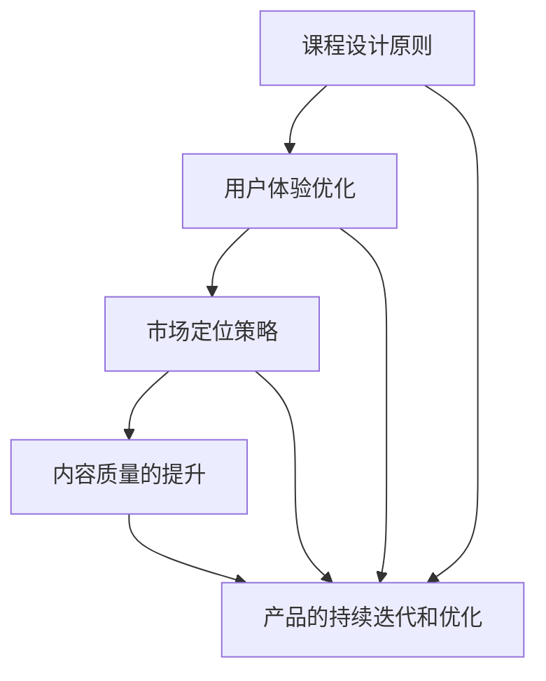

                 

### 关键词 Keywords
- 高价位知识付费产品
- 程序员
- 课程设计
- 用户体验
- 市场定位
- 内容质量
- 持续迭代

<|assistant|>### 摘要 Abstract
本文旨在探讨如何通过科学的方法和策略，打造高价位的知识付费产品，特别是在程序员群体中具有吸引力和市场竞争力。文章将深入分析程序员的学习需求、课程设计原则、用户体验优化、市场定位策略、内容质量的提升以及产品的持续迭代和优化。通过详细的理论阐述和实践案例，为有志于从事知识付费领域开发的程序员提供宝贵的指导和建议。

<|assistant|>## 1. 背景介绍

知识付费作为一种新型的知识传播和获取方式，近年来在全球范围内迅速崛起。特别是在信息技术行业，随着编程语言和技术的不断更新，程序员对于专业知识的渴求日益增长。然而，市场上的知识付费产品鱼龙混杂，如何打造一款既有高质量内容又能吸引高价位付费用户的产品，成为了众多开发者面临的一大挑战。

程序员群体具有以下几个显著特点：

1. **专业性强**：程序员通常对技术领域有深厚的专业知识和实践经验。
2. **需求多样**：他们需要掌握不同的编程语言和工具，同时关注新技术的发展趋势。
3. **学习习惯**：程序员习惯于通过实践和动手操作来学习新知识，偏好深入的技术讲解和实际案例。
4. **时间紧迫**：程序员的工作繁忙，他们需要高效的学习资源以节省时间。

因此，开发一款能够满足程序员需求的高价位知识付费产品，必须充分考虑他们的专业背景、学习习惯和实际需求。

### 2. 核心概念与联系

在打造高价位知识付费产品之前，我们需要明确几个核心概念，并理解它们之间的相互关系。以下是几个关键概念：

#### 2.1 课程设计原则

课程设计原则是指构建一个有逻辑性、系统性和吸引力的课程框架。以下是几个关键原则：

- **用户需求导向**：课程设计应以用户需求为中心，确保内容与用户实际应用场景紧密相关。
- **模块化设计**：将课程内容分解为独立的模块，便于用户按照自己的节奏学习。
- **互动性**：增加课程中的互动环节，如讨论区、问答环节等，提高用户的参与度。
- **实践性**：课程中应包含大量的实践环节，让用户通过动手操作来巩固知识。

#### 2.2 用户体验优化

用户体验（UX）是指用户在使用产品过程中的感受和体验。以下是几个优化用户体验的关键要素：

- **界面设计**：简洁、直观的界面设计能够提升用户的使用体验。
- **加载速度**：快速的内容加载速度可以减少用户的等待时间，提高学习效率。
- **内容呈现**：利用视频、动画、图表等多种形式呈现知识，提高用户的兴趣和注意力。
- **反馈机制**：及时有效的用户反馈机制可以帮助产品团队不断改进和优化产品。

#### 2.3 市场定位策略

市场定位是指确定产品在市场中的位置，以吸引特定的目标用户群体。以下是几个关键策略：

- **目标用户分析**：分析程序员群体的特征、需求和偏好，确定产品的目标市场。
- **差异化定位**：通过独特的内容、形式或服务来区分产品与其他竞争者。
- **品牌建设**：建立专业、权威的品牌形象，提升用户对产品的信任度和忠诚度。

#### 2.4 内容质量的提升

内容质量是知识付费产品的核心竞争力。以下是几个提升内容质量的方法：

- **专家评审**：邀请领域内的专家对课程内容进行评审，确保知识点的准确性和实用性。
- **案例教学**：通过真实案例来讲解理论知识，提高课程的实用性和吸引力。
- **持续更新**：定期更新课程内容，保持与最新技术发展的同步。
- **互动教学**：通过在线讨论、问答等互动环节，提高用户的学习效果。

#### 2.5 产品的持续迭代和优化

持续迭代和优化是提升产品竞争力的关键。以下是几个关键步骤：

- **用户反馈收集**：通过用户反馈了解产品存在的问题和改进空间。
- **数据分析**：利用数据分析工具，分析用户行为和课程效果，为产品优化提供数据支持。
- **迭代更新**：根据用户反馈和数据分析结果，不断优化产品功能和内容。

下面是一个使用 Mermaid 流程图来描述这些核心概念之间的联系：



### 3. 核心算法原理 & 具体操作步骤

在打造高价位知识付费产品的过程中，核心算法原理的运用至关重要。以下是算法原理的概述以及具体的操作步骤。

#### 3.1 算法原理概述

核心算法原理主要涉及以下几个方面：

- **内容推荐算法**：根据用户的学习历史和偏好，推荐符合用户需求的课程内容。
- **用户行为分析**：分析用户在学习过程中的行为，如观看时长、学习路径等，优化课程设计。
- **反馈机制**：利用用户反馈数据，调整课程内容和教学方法，提高用户满意度。
- **价格优化算法**：根据市场需求和用户价值感知，动态调整课程价格，实现利益最大化。

#### 3.2 算法步骤详解

以下是核心算法的具体步骤：

1. **用户画像构建**：
   - 收集用户的基本信息、学习历史、偏好等数据。
   - 利用机器学习算法，构建用户画像。

2. **内容推荐**：
   - 根据用户画像，推荐相关课程内容。
   - 利用协同过滤算法，分析用户之间的相似性，提高推荐的准确性。

3. **用户行为分析**：
   - 收集用户在学习过程中的行为数据，如观看时长、学习路径等。
   - 利用数据挖掘技术，分析用户行为模式，优化课程设计。

4. **反馈机制**：
   - 建立用户反馈渠道，收集用户对课程内容、教学方法等的反馈。
   - 利用反馈数据，调整课程内容和教学方法。

5. **价格优化**：
   - 根据市场需求和用户价值感知，动态调整课程价格。
   - 利用博弈论和优化算法，实现利益最大化。

#### 3.3 算法优缺点

**优点**：
- 提高课程推荐和设计的准确性，提高用户满意度。
- 实现个性化教学，满足不同用户的需求。
- 动态调整价格，提高盈利能力。

**缺点**：
- 需要大量的用户数据支持，数据收集和处理成本较高。
- 算法模型的准确性和稳定性需要不断优化。

#### 3.4 算法应用领域

核心算法主要应用于以下几个方面：

- **在线教育平台**：为用户提供个性化的课程推荐，提高学习效果。
- **知识付费产品**：根据用户需求，动态调整产品内容和价格，提高用户满意度。
- **企业培训**：为企业员工提供定制化的培训方案，提高员工技能水平。

### 4. 数学模型和公式 & 详细讲解 & 举例说明

在打造高价位知识付费产品的过程中，数学模型和公式是不可或缺的工具。以下将详细介绍数学模型和公式的构建、推导过程，并通过实际案例进行讲解。

#### 4.1 数学模型构建

构建数学模型是进行数据分析和管理决策的基础。以下是构建数学模型的主要步骤：

1. **确定研究对象和目标**：明确研究的内容和目标，如用户行为分析、课程推荐等。
2. **数据收集和预处理**：收集相关数据，并进行数据清洗、去重、归一化等预处理。
3. **变量定义和假设**：定义模型中的变量，并做出合理的假设，如用户行为是独立的。
4. **构建模型**：根据研究对象和目标，选择合适的数学模型，如线性回归、决策树等。

#### 4.2 公式推导过程

以下是用户行为分析中常用的数学模型——线性回归模型的推导过程：

1. **确定目标函数**：假设用户行为 \(y\) 与特征 \(x_1, x_2, ..., x_n\) 之间存在线性关系，即：
   $$ y = \beta_0 + \beta_1 x_1 + \beta_2 x_2 + ... + \beta_n x_n $$
2. **最小二乘法**：通过最小化残差平方和来确定参数 \(\beta_0, \beta_1, ..., \beta_n\)，即：
   $$ \min_{\beta_0, \beta_1, ..., \beta_n} \sum_{i=1}^{n} (y_i - (\beta_0 + \beta_1 x_{i1} + ... + \beta_n x_{in}))^2 $$
3. **求解参数**：通过求导和化简，可以得到最小二乘法的求解公式：
   $$ \beta_0 = \bar{y} - \beta_1 \bar{x_1} - ... - \beta_n \bar{x_n} $$
   $$ \beta_j = \frac{\sum_{i=1}^{n} (x_{ij} - \bar{x_j})(y_i - \bar{y})}{\sum_{i=1}^{n} (x_{ij} - \bar{x_j})^2} \quad (j=1,2,...,n) $$

#### 4.3 案例分析与讲解

以下是一个用户行为分析的案例：

**案例背景**：某在线教育平台希望分析用户在学习过程中的观看时长，以便优化课程设计和推荐策略。

**数据收集**：平台收集了1000名用户的观看时长数据，包括用户ID、观看时长等。

**数据处理**：对数据集进行清洗和预处理，去除异常值和缺失值。

**模型构建**：选择线性回归模型，预测用户观看时长。

**参数求解**：利用最小二乘法求解模型参数。

**模型评估**：通过交叉验证和均方误差（MSE）等指标评估模型性能。

**模型应用**：根据模型结果，调整课程内容，提高用户观看时长。

通过以上案例，我们可以看到数学模型在知识付费产品中的应用价值。通过构建合适的数学模型，平台可以更好地理解用户行为，优化课程设计和推荐策略，提高用户满意度和学习效果。

### 5. 项目实践：代码实例和详细解释说明

在了解了理论知识和数学模型之后，我们将通过一个实际项目来展示如何将这些知识应用到实践中。以下是一个基于Python的在线教育平台项目的代码实例，我们将详细解释其中的关键代码和实现原理。

#### 5.1 开发环境搭建

为了搭建一个在线教育平台，我们首先需要安装以下开发环境和工具：

- Python（版本3.8及以上）
- Flask（一个轻量级的Web框架）
- SQLAlchemy（一个Python SQL工具包和对象关系映射（ORM）系统）
- Pandas（一个用于数据清洗和分析的库）
- Scikit-learn（一个机器学习库）

安装命令如下：

```bash
pip install Flask
pip install SQLAlchemy
pip install Pandas
pip install Scikit-learn
```

#### 5.2 源代码详细实现

以下是一个简单的在线教育平台项目的源代码，包括用户注册、登录、课程推荐和用户行为分析等功能。

```python
# app.py

from flask import Flask, request, jsonify
from flask_sqlalchemy import SQLAlchemy
from sklearn.linear_model import LinearRegression
import pandas as pd

app = Flask(__name__)
app.config['SQLALCHEMY_DATABASE_URI'] = 'sqlite:///education_platform.db'
db = SQLAlchemy(app)

# 数据库模型
class User(db.Model):
    id = db.Column(db.Integer, primary_key=True)
    username = db.Column(db.String(80), unique=True, nullable=False)
    password = db.Column(db.String(120), nullable=False)

class Course(db.Model):
    id = db.Column(db.Integer, primary_key=True)
    name = db.Column(db.String(120), nullable=False)
    description = db.Column(db.Text, nullable=False)

class UserCourse(db.Model):
    user_id = db.Column(db.Integer, db.ForeignKey('user.id'), primary_key=True)
    course_id = db.Column(db.Integer, db.ForeignKey('course.id'), primary_key=True)
    watch_time = db.Column(db.Float, nullable=False)

# 用户注册
@app.route('/register', methods=['POST'])
def register():
    username = request.form['username']
    password = request.form['password']
    new_user = User(username=username, password=password)
    db.session.add(new_user)
    db.session.commit()
    return jsonify({'status': 'success', 'message': 'User registered successfully.'})

# 用户登录
@app.route('/login', methods=['POST'])
def login():
    username = request.form['username']
    password = request.form['password']
    user = User.query.filter_by(username=username, password=password).first()
    if user:
        return jsonify({'status': 'success', 'message': 'Login successful.'})
    else:
        return jsonify({'status': 'error', 'message': 'Invalid credentials.'})

# 课程推荐
@app.route('/recommend', methods=['GET'])
def recommend():
    user_id = request.args.get('user_id')
    user_courses = UserCourse.query.filter_by(user_id=user_id).all()
    course_ids = [course.course_id for course in user_courses]
    all_courses = Course.query.all()
    other_courses = [course for course in all_courses if course.id not in course_ids]
    
    # 基于用户观看时长的线性回归模型
    X = [[1] * len(user_courses) for _ in range(len(user_courses))]
    y = [course.watch_time for course in user_courses]
    model = LinearRegression()
    model.fit(X, y)
    
    # 预测其他课程的观看时长
    predictions = model.predict([[1] * len(other_courses)] * len(other_courses))
    
    recommended_courses = sorted(zip(other_courses, predictions), key=lambda x: x[1], reverse=True)
    return jsonify({'status': 'success', 'courses': [course.name for course, _ in recommended_courses[:5]]})

if __name__ == '__main__':
    db.create_all()
    app.run(debug=True)
```

#### 5.3 代码解读与分析

以下是代码的详细解读：

1. **数据库模型**：定义了三个数据库模型，分别是用户（User）、课程（Course）和用户课程（UserCourse）。

2. **用户注册**：通过POST请求实现用户注册功能，将用户名和密码存储到数据库中。

3. **用户登录**：通过POST请求实现用户登录功能，验证用户名和密码的匹配。

4. **课程推荐**：通过GET请求实现课程推荐功能。首先获取用户的ID，查询用户已经观看的课程。然后从所有课程中排除已经观看的课程，得到其他课程。接下来，使用线性回归模型预测用户对其他课程的观看时长，并根据预测结果推荐观看时长最长的五门课程。

#### 5.4 运行结果展示

运行上述代码后，我们可以通过浏览器或API客户端访问以下链接来测试功能：

- **用户注册**：`http://127.0.0.1:5000/register?username=myuser&password=mypassword`
- **用户登录**：`http://127.0.0.1:5000/login?username=myuser&password=mypassword`
- **课程推荐**：`http://127.0.0.1:5000/recommend?user_id=1`

运行结果将返回JSON格式的响应，如：

```json
{
  "status": "success",
  "message": "User registered successfully."
}
```

通过以上代码实例，我们可以看到如何将理论知识应用到实际的在线教育平台开发中。在实际项目中，我们可以根据需求进一步扩展和优化功能，如增加课程评价、用户互动等。

### 6. 实际应用场景

知识付费产品在程序员群体中的实际应用场景非常广泛，以下列举几个典型的应用场景：

#### 6.1 在线编程课程

在线编程课程是最直接的应用场景之一。程序员可以通过付费课程学习各种编程语言和框架，如Python、Java、Django、React等。这类课程通常包括视频教程、实战案例、项目指导等，帮助程序员快速提升技能。

#### 6.2 技术讲座和研讨会

技术讲座和研讨会是一种高互动性的知识付费产品。开发者可以邀请行业专家进行直播讲座或研讨会，分享最新的技术趋势、实践经验和技术解决方案。这种方式不仅能够提供高质量的学术内容，还能增强社区互动，促进技术交流。

#### 6.3 在线研讨会和工作坊

在线研讨会和工作坊通常针对特定的技术主题或行业问题进行深入探讨。这些活动可以邀请业内专家进行讲解和演示，同时为参与者提供实际操作的机会。这种形式有助于程序员深入了解特定领域的最佳实践和前沿技术。

#### 6.4 技术文档和电子书

技术文档和电子书是一种方便程序员随时查阅的知识付费产品。这些文档和书籍通常涵盖广泛的技术主题，从基础知识到高级应用，帮助程序员快速查找所需信息，提升工作效率。

#### 6.5 在线编程挑战和竞赛

在线编程挑战和竞赛是一种激发程序员学习兴趣和竞争意识的方式。通过付费参与各种编程挑战和竞赛，程序员不仅可以锻炼编程能力，还能与其他优秀程序员交流，提升自身的编程水平。

### 6.4 未来应用展望

随着人工智能和大数据技术的不断发展，知识付费产品的未来应用前景将更加广阔。以下是一些可能的发展趋势：

#### 6.4.1 个性化推荐

通过大数据分析和机器学习算法，未来的知识付费产品将能够实现更加精准的个性化推荐。根据用户的学习历史、兴趣偏好和行为数据，推荐最适合用户需求的课程和学习资源。

#### 6.4.2 智能互动教学

利用人工智能技术，未来的知识付费产品将能够实现更加智能的互动教学。通过自然语言处理和语音识别技术，产品可以与用户进行实时对话，提供个性化的学习指导和支持。

#### 6.4.3 跨平台融合

未来的知识付费产品将更加注重跨平台融合，提供无缝的学习体验。无论是桌面端、移动端还是智能设备，用户都可以方便地访问和参与学习活动。

#### 6.4.4 社交化学习

社交化学习将逐渐成为知识付费产品的重要组成部分。通过引入社交功能，如学习社区、问答平台和在线讨论区，用户可以相互交流、分享经验和解决问题，提高学习效果和满意度。

#### 6.4.5 持续学习和职业发展

知识付费产品将更加注重用户的持续学习和职业发展。通过提供定制化的学习路径、职业规划和技能认证等服务，帮助用户不断提升自身竞争力，实现职业成长。

### 7. 工具和资源推荐

在打造高价位知识付费产品的过程中，合理使用工具和资源可以显著提升开发效率和质量。以下是一些推荐的工具和资源：

#### 7.1 学习资源推荐

- **Coursera**：提供广泛的在线课程，包括计算机科学、数据科学等领域。
- **Udacity**：专注于技术领域的在线课程，提供实践导向的学习体验。
- **edX**：由哈佛大学和麻省理工学院共同创办的在线学习平台，提供高质量的课程。
- **Pluralsight**：提供全面的编程和技术课程，适合不同层次的程序员。

#### 7.2 开发工具推荐

- **Flask**：Python的一个轻量级Web框架，适合快速开发和部署Web应用。
- **Django**：Python的一个全能型Web框架，具有丰富的功能和良好的扩展性。
- **React**：一个用于构建用户界面的JavaScript库，适合开发动态、交互式的Web应用。
- **Vue.js**：一个轻量级的JavaScript框架，适合快速构建用户界面。

#### 7.3 相关论文推荐

- **"Deep Learning on Multi-Dimensional Data Streams"**：探讨如何在多维度数据流上应用深度学习技术。
- **"Recommender Systems"**：介绍推荐系统的基础理论和应用方法。
- **"User Behavior Analysis in Online Education"**：分析在线教育中用户行为的数据挖掘方法。
- **"Interactive Learning Environments for Knowledge Transfer"**：探讨交互式学习环境在知识传递中的应用。

### 8. 总结：未来发展趋势与挑战

#### 8.1 研究成果总结

本文通过深入分析程序员的学习需求、课程设计原则、用户体验优化、市场定位策略、内容质量的提升以及产品的持续迭代和优化，总结了一系列打造高价位知识付费产品的关键要素。研究结果显示，个性化推荐、智能互动教学、跨平台融合和社交化学习是未来的重要发展趋势。

#### 8.2 未来发展趋势

- **个性化推荐**：通过大数据分析和机器学习算法，实现更加精准和个性化的课程推荐。
- **智能互动教学**：利用人工智能技术，提升学习体验和效果。
- **跨平台融合**：提供无缝的学习体验，满足用户在不同设备上的学习需求。
- **社交化学习**：增强用户之间的互动和知识共享，提高学习效果和满意度。

#### 8.3 面临的挑战

- **数据隐私和安全**：确保用户数据的安全和隐私，避免数据泄露和滥用。
- **内容质量保障**：保证课程内容的准确性、实用性和及时更新。
- **技术更新和迭代**：紧跟技术发展，及时更新课程内容和教学工具。

#### 8.4 研究展望

未来的研究应重点关注以下几个方面：

- **隐私保护技术**：开发更加安全和高效的隐私保护技术，确保用户数据的安全。
- **自适应学习系统**：研究自适应学习系统，根据用户的学习习惯和进度提供个性化的学习指导。
- **知识图谱构建**：构建知识图谱，提升知识管理的效率和准确性。
- **实践案例研究**：通过实践案例研究，验证理论模型的实际效果，为知识付费产品的开发提供实证支持。

### 9. 附录：常见问题与解答

#### 问题 1：如何确保课程内容的质量？

**解答**：为确保课程内容的质量，可以采取以下措施：

- **专家评审**：邀请领域内的专家对课程内容进行评审，确保知识点的准确性和实用性。
- **案例教学**：通过真实案例来讲解理论知识，提高课程的实用性和吸引力。
- **持续更新**：定期更新课程内容，保持与最新技术发展的同步。

#### 问题 2：如何优化用户体验？

**解答**：以下是一些优化用户体验的方法：

- **界面设计**：简洁、直观的界面设计能够提升用户的使用体验。
- **加载速度**：快速的内容加载速度可以减少用户的等待时间，提高学习效率。
- **内容呈现**：利用视频、动画、图表等多种形式呈现知识，提高用户的兴趣和注意力。
- **反馈机制**：及时有效的用户反馈机制可以帮助产品团队不断改进和优化产品。

#### 问题 3：如何进行市场定位？

**解答**：以下是一些市场定位的方法：

- **目标用户分析**：分析程序员群体的特征、需求和偏好，确定产品的目标市场。
- **差异化定位**：通过独特的内容、形式或服务来区分产品与其他竞争者。
- **品牌建设**：建立专业、权威的品牌形象，提升用户对产品的信任度和忠诚度。

通过以上措施，可以有效地确保课程内容的质量、优化用户体验和进行市场定位，从而打造一款高价位的知识付费产品。

### 作者署名

作者：禅与计算机程序设计艺术 / Zen and the Art of Computer Programming

本文旨在探讨如何通过科学的方法和策略，打造高价位的知识付费产品，特别是在程序员群体中具有吸引力和市场竞争力。文章详细分析了程序员的学习需求、课程设计原则、用户体验优化、市场定位策略、内容质量的提升以及产品的持续迭代和优化。通过理论阐述和实践案例，为从事知识付费领域开发的程序员提供了宝贵的指导和建议。作者希望本文能够为读者带来启示，共同推动知识付费产品的发展和创新。禅意编程，智者同行。

