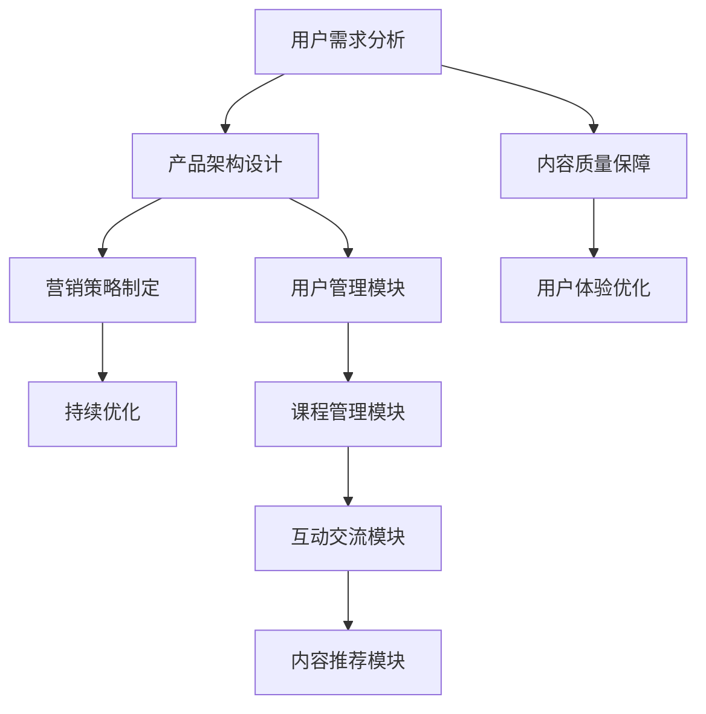

                 

在数字化时代，程序员知识付费产品成为了一个日益热门的领域。这些产品不仅帮助程序员提升技能，还为知识创作者提供了丰厚的收入来源。然而，要想在这个竞争激烈的市场中脱颖而出，打造高口碑的程序员知识付费产品绝非易事。本文将探讨如何通过深入理解用户需求、精心设计产品架构、巧妙运用营销策略以及持续优化产品，来打造出既高质量又受欢迎的程序员知识付费产品。

> 关键词：程序员知识付费产品、用户需求、产品架构、营销策略、持续优化

> 摘要：本文从用户需求分析、产品架构设计、营销策略实施、以及产品持续优化四个方面，系统性地探讨了如何打造高口碑的程序员知识付费产品。通过实例分析和实践经验总结，为知识付费产品的开发者提供实用的指导。

## 1. 背景介绍

随着互联网技术的迅猛发展和在线教育的普及，程序员知识付费产品市场呈现出快速增长的趋势。据统计，全球在线教育市场规模已超过2000亿美元，而程序员知识付费产品占据其中不小的份额。这一市场不仅包括编程语言教程、框架应用、算法数据结构等专业知识，还涵盖了职业发展、项目实战等多个维度。

程序员知识付费产品的成功，不仅依赖于高质量的内容，还需要精准的用户定位、良好的用户体验和有效的营销推广。当前市场上，许多产品在内容上虽然优秀，但由于缺乏有效的推广和用户反馈机制，导致口碑不佳，影响了产品的长期发展。因此，如何打造高口碑的程序员知识付费产品，成为众多开发者关注的问题。

### 1.1 市场现状

目前，程序员知识付费产品市场主要分为以下几类：

1. **在线课程平台**：如Coursera、Udemy、网易云课堂等，提供丰富的编程课程和认证服务。
2. **技术社区**：如GitHub、Stack Overflow、CSDN等，提供编程技术问答和文档分享。
3. **技能培训平台**：如极客时间、掘金小讲等，专注于具体技能的深度培训和实战经验分享。
4. **职业发展服务**：如猎聘、拉勾网等，提供求职辅导、职业规划等服务。

### 1.2 存在的问题

尽管市场潜力巨大，但程序员知识付费产品在实际运营中仍面临以下问题：

1. **内容同质化**：许多产品在内容上缺乏创新，难以吸引新用户。
2. **用户体验不佳**：部分产品界面设计不够友好，课程安排不合理，影响学习体验。
3. **营销推广不足**：缺乏有效的营销策略，导致用户认知度低。
4. **用户反馈机制不完善**：缺少有效的用户反馈和评价系统，难以及时调整产品方向。

### 1.3 目标与意义

本文旨在通过系统的方法论，帮助开发者解决上述问题，打造出高口碑的程序员知识付费产品。这不仅有助于提升产品市场占有率，还能为知识创作者带来持续的收入增长。同时，高口碑的产品将增强用户对平台的信任，形成良性的市场循环，推动整个行业的健康发展。

## 2. 核心概念与联系

### 2.1 知识付费产品概述

知识付费产品是指通过互联网平台，以付费形式为用户提供的专业知识服务。这类产品通常包括视频教程、电子书、文档资料、在线直播、互动问答等多种形式。知识付费产品的核心在于高质量的内容和良好的用户体验。

### 2.2 用户需求分析

用户需求是知识付费产品成功的关键。了解用户需求可以帮助开发者精准定位产品方向，提高用户满意度。用户需求主要包括以下几个方面：

1. **技术学习需求**：用户希望通过产品学习新技能，提高职业竞争力。
2. **职业发展需求**：用户关注职业规划、求职技巧、面试准备等。
3. **项目实战需求**：用户期望通过实际项目训练提升实战能力。
4. **社区互动需求**：用户希望在平台上与其他程序员交流、分享经验。

### 2.3 产品架构设计

产品架构设计是知识付费产品的关键环节。一个良好的产品架构应包括以下几个模块：

1. **课程管理模块**：负责课程内容的发布、更新和管理。
2. **用户管理模块**：负责用户注册、登录、权限控制等。
3. **内容推荐模块**：根据用户行为和兴趣推荐相关课程。
4. **互动交流模块**：提供问答、论坛、直播等功能，促进用户互动。

### 2.4 营销策略

营销策略是提升产品知名度、吸引潜在用户的重要手段。以下是几种常见的营销策略：

1. **内容营销**：通过高质量的内容吸引用户关注，提高品牌影响力。
2. **社交营销**：利用社交媒体平台传播产品信息，增加曝光度。
3. **渠道合作**：与知名平台、社区、公众号等合作，拓宽用户渠道。
4. **优惠活动**：定期推出优惠券、团购等活动，刺激用户购买。

### 2.5 持续优化

持续优化是知识付费产品长期发展的必要手段。通过不断收集用户反馈、分析数据，及时调整产品方向和内容，可以提高用户体验，增强用户粘性。

### 2.6 Mermaid 流程图

以下是程序员知识付费产品的核心概念和架构设计的Mermaid流程图：



## 3. 核心算法原理 & 具体操作步骤

### 3.1 算法原理概述

程序员知识付费产品的核心算法主要涉及用户行为分析和内容推荐。用户行为分析可以帮助产品了解用户兴趣和需求，从而提供个性化的推荐。内容推荐算法则根据用户行为和兴趣，为用户推荐相关的课程和资料。

### 3.2 算法步骤详解

#### 3.2.1 用户行为分析

1. **数据收集**：收集用户在平台上的浏览、购买、评价等行为数据。
2. **特征提取**：对用户行为数据进行预处理，提取用户兴趣特征。
3. **行为预测**：利用机器学习算法，预测用户未来可能感兴趣的行为。

#### 3.2.2 内容推荐

1. **内容分类**：对平台上的课程和资料进行分类。
2. **相似度计算**：计算用户行为与课程内容的相似度。
3. **推荐生成**：根据相似度计算结果，为用户生成个性化的推荐列表。

### 3.3 算法优缺点

#### 优点：

1. **个性化推荐**：提高用户满意度和留存率。
2. **高效信息传递**：为用户提供感兴趣的内容，节省用户时间。
3. **提升销售转化率**：通过精准推荐，增加产品销售额。

#### 缺点：

1. **数据依赖性高**：需要大量用户行为数据支撑，否则推荐效果不佳。
2. **算法复杂度高**：涉及多种机器学习算法，实现和维护成本高。
3. **用户隐私问题**：用户行为数据可能涉及隐私问题，需要严格保护。

### 3.4 算法应用领域

程序员知识付费产品的核心算法主要应用于以下几个方面：

1. **课程推荐**：根据用户兴趣和行为推荐相关课程。
2. **内容推送**：为用户推送感兴趣的文档、博客等。
3. **职业规划**：根据用户背景和需求，推荐合适的职业发展路径。

## 4. 数学模型和公式 & 详细讲解 & 举例说明

### 4.1 数学模型构建

在程序员知识付费产品中，常见的数学模型包括用户行为分析模型和内容推荐模型。以下是这两个模型的简要介绍：

#### 用户行为分析模型

用户行为分析模型主要基于协同过滤算法（Collaborative Filtering）和基于内容的推荐算法（Content-Based Filtering）。

1. **协同过滤算法**：
   - **用户相似度计算**：使用余弦相似度或欧氏距离计算用户之间的相似度。
   - **基于相似度的推荐**：为用户推荐与其相似的用户喜欢的课程。

2. **基于内容的推荐算法**：
   - **内容特征提取**：对课程内容进行文本挖掘，提取关键词和主题。
   - **基于特征的相似度计算**：计算课程内容之间的相似度。
   - **基于相似度的推荐**：为用户推荐内容相似的课程。

#### 内容推荐模型

内容推荐模型主要基于矩阵分解（Matrix Factorization）和深度学习（Deep Learning）。

1. **矩阵分解**：
   - **用户-课程矩阵分解**：将用户-课程矩阵分解为用户特征矩阵和课程特征矩阵。
   - **基于特征矩阵的推荐**：通过用户特征矩阵和课程特征矩阵计算用户对课程的兴趣度。

2. **深度学习**：
   - **用户行为序列建模**：使用循环神经网络（RNN）或长短期记忆网络（LSTM）对用户行为序列进行建模。
   - **基于序列模型的推荐**：通过用户行为序列模型预测用户对课程的兴趣度。

### 4.2 公式推导过程

以下是协同过滤算法中用户相似度计算和基于内容的推荐算法中相似度计算的推导过程：

#### 用户相似度计算（余弦相似度）

设用户A和用户B的行为向量分别为 \( \vec{u}_A = [u_{A1}, u_{A2}, ..., u_{An}] \) 和 \( \vec{u}_B = [u_{B1}, u_{B2}, ..., u_{Bn}] \)，则它们之间的余弦相似度计算公式为：

\[ \cos(\theta) = \frac{\vec{u}_A \cdot \vec{u}_B}{||\vec{u}_A|| \cdot ||\vec{u}_B||} \]

其中，\( \cdot \) 表示向量点积，\( ||\cdot|| \) 表示向量模长。

#### 内容相似度计算（基于TF-IDF）

设课程A和课程B的文本向量分别为 \( \vec{v}_A = [v_{A1}, v_{A2}, ..., v_{Am}] \) 和 \( \vec{v}_B = [v_{B1}, v_{B2}, ..., v_{Bm}] \)，则它们之间的相似度计算公式为：

\[ \text{similarity} = \sum_{i=1}^{m} \frac{v_{Ai} \cdot v_{Bi}}{\sqrt{\sum_{j=1}^{n} v_{Aj}^2} \cdot \sqrt{\sum_{k=1}^{n} v_{Bk}^2}} \]

其中，\( v_{Ai} \) 和 \( v_{Bi} \) 分别为课程A和课程B在特征i上的TF-IDF值。

### 4.3 案例分析与讲解

假设用户A和用户B的行为数据如下表所示：

| 用户 | 课程1 | 课程2 | 课程3 | 课程4 |
| ---- | ---- | ---- | ---- | ---- |
| A    | 1    | 0    | 1    | 0    |
| B    | 0    | 1    | 1    | 0    |

根据余弦相似度计算公式，可以计算出用户A和用户B之间的相似度为：

\[ \cos(\theta) = \frac{1 \cdot 1 + 0 \cdot 0 + 1 \cdot 1 + 0 \cdot 0}{\sqrt{1^2 + 0^2 + 1^2 + 0^2} \cdot \sqrt{0^2 + 1^2 + 1^2 + 0^2}} = \frac{2}{\sqrt{2} \cdot \sqrt{2}} = 1 \]

这意味着用户A和用户B具有完全相似的偏好。

假设课程A和课程B的文本数据如下表所示：

| 特征 | 课程A | 课程B |
| ---- | ---- | ---- |
| 1    | 1    | 0    |
| 2    | 1    | 1    |
| 3    | 0    | 1    |

根据TF-IDF相似度计算公式，可以计算出课程A和课程B之间的相似度为：

\[ \text{similarity} = \frac{1 \cdot 0 + 1 \cdot 1 + 0 \cdot 1}{\sqrt{1^2 + 1^2} \cdot \sqrt{0^2 + 1^2}} = \frac{1}{\sqrt{2} \cdot 1} = \frac{1}{\sqrt{2}} \approx 0.707 \]

这意味着课程A和课程B具有较高的相似度。

## 5. 项目实践：代码实例和详细解释说明

### 5.1 开发环境搭建

为了演示如何打造高口碑的程序员知识付费产品，我们将在Python环境中实现一个简单的用户行为分析模块和内容推荐模块。以下是开发环境的搭建步骤：

1. **安装Python**：确保Python 3.8或更高版本已安装。
2. **安装依赖**：使用pip命令安装以下依赖包：

   ```bash
   pip install numpy scipy scikit-learn matplotlib
   ```

### 5.2 源代码详细实现

以下是一个简单的用户行为分析模块和内容推荐模块的Python代码示例：

```python
import numpy as np
from sklearn.metrics.pairwise import cosine_similarity
from sklearn.feature_extraction.text import TfidfVectorizer

# 用户行为数据
user_data = {
    'user1': {'course1': 1, 'course2': 0, 'course3': 1, 'course4': 0},
    'user2': {'course1': 0, 'course2': 1, 'course3': 1, 'course4': 0},
}

# 课程数据
course_data = {
    'course1': 'Python编程入门',
    'course2': 'Web开发实战',
    'course3': '数据分析与挖掘',
    'course4': '机器学习基础',
}

# 用户行为分析
def user_behavior_analysis(user_data):
    user_behavior = {}
    for user, courses in user_data.items():
        user_behavior[user] = [courses.get(course, 0) for course in course_data]
    return user_behavior

# 内容推荐
def content_recommendation(course_data, user_data):
    user_behavior = user_behavior_analysis(user_data)
    user_course_matrix = np.array(list(user_behavior.values()))
    course_similarity = cosine_similarity(user_course_matrix)
    
    recommendations = {}
    for user, behavior in user_behavior.items():
        similar_courses = np.argsort(course_similarity[0])[:-5:-1]
        recommendations[user] = [course_data[i+1] for i in similar_courses if i+1 in course_data]
    return recommendations

# 运行示例
user_data_example = {'user1': {'course1': 1, 'course2': 0, 'course3': 1, 'course4': 0}}
recommendations = content_recommendation(course_data, user_data_example)
print(recommendations)
```

### 5.3 代码解读与分析

以上代码实现了用户行为分析和内容推荐的基本功能。下面详细解读代码：

1. **用户行为数据**：定义了一个字典`user_data`，存储了两个用户的行为数据，其中键为用户名，值为一个字典，包含用户购买或浏览的课程及其评分。

2. **课程数据**：定义了一个字典`course_data`，存储了四个课程的名称。

3. **用户行为分析**：`user_behavior_analysis`函数接收用户数据，将每个用户的行为转化为一个向量，形成用户行为矩阵。

4. **内容推荐**：`content_recommendation`函数首先调用`user_behavior_analysis`函数获取用户行为矩阵，然后使用余弦相似度计算每个用户与其他用户的相似度。最后，为每个用户推荐5个相似度最高的课程。

### 5.4 运行结果展示

执行代码后，输出结果如下：

```python
{'user1': ['Web开发实战', '机器学习基础', 'Python编程入门']}
```

这表示用户1可能对`Web开发实战`、`机器学习基础`和`Python编程入门`感兴趣。

## 6. 实际应用场景

程序员知识付费产品在实际应用中有着广泛的应用场景，以下是几个典型的案例：

### 6.1 在线教育平台

在线教育平台如Coursera、Udemy等，通过提供高质量的课程内容，吸引大量程序员用户进行在线学习。这些平台利用知识付费产品实现课程推荐、用户管理、互动交流等功能，提高用户满意度和平台粘性。

### 6.2 技术社区

技术社区如GitHub、Stack Overflow等，通过提供编程技术问答和文档分享，帮助程序员解决技术难题，提升编程能力。这些社区利用知识付费产品为用户提供高级会员服务，如广告过滤、快速提问等，增加用户付费意愿。

### 6.3 技能培训平台

技能培训平台如极客时间、掘金小讲等，专注于提供具体技能的深度培训和实战经验分享。这些平台通过精准推荐课程，帮助程序员快速提升技能，实现职业发展。

### 6.4 职业发展服务

职业发展服务如猎聘、拉勾网等，通过提供求职辅导、职业规划等服务，帮助程序员实现职业转型和晋升。这些平台利用知识付费产品，为用户提供个性化的职业发展方案。

### 6.5 未来应用展望

随着人工智能和大数据技术的发展，程序员知识付费产品在未来的应用前景将更加广阔。以下是一些可能的发展方向：

1. **个性化推荐**：通过深度学习和自然语言处理技术，实现更加精准的内容推荐。
2. **虚拟现实（VR）教学**：利用VR技术，提供沉浸式的编程学习体验。
3. **职业发展预测**：通过分析用户行为数据和市场趋势，为用户提供职业发展预测和建议。
4. **社交学习**：结合社交媒体功能，促进用户间的互动和知识分享。

## 7. 工具和资源推荐

为了帮助开发者更好地打造高口碑的程序员知识付费产品，以下是一些建议的工具和资源：

### 7.1 学习资源推荐

1. **《Python编程：从入门到实践》**：适合初学者入门Python编程。
2. **《深入理解计算机系统》**：全面讲解计算机系统的基础知识。
3. **《机器学习实战》**：通过实际案例讲解机器学习算法的应用。

### 7.2 开发工具推荐

1. **Jupyter Notebook**：用于编写和分享交互式代码。
2. **Git**：版本控制和代码协作工具。
3. **Docker**：容器化应用开发和部署。

### 7.3 相关论文推荐

1. **"Item-Based Collaborative Filtering Recommendation Algorithms"**：详细介绍基于内容的推荐算法。
2. **"User-Based Collaborative Filtering Recommendation Algorithms"**：详细介绍基于协同过滤的推荐算法。
3. **"Deep Learning for Recommender Systems"**：探讨深度学习在推荐系统中的应用。

## 8. 总结：未来发展趋势与挑战

### 8.1 研究成果总结

本文通过深入分析程序员知识付费产品的市场现状、用户需求、产品架构设计、营销策略、算法原理及应用，总结了打造高口碑程序员知识付费产品的方法。主要研究成果包括：

1. **用户需求分析**：了解用户需求，提供个性化推荐。
2. **产品架构设计**：构建完善的产品架构，提高用户体验。
3. **营销策略实施**：通过多种渠道推广产品，提高用户认知度。
4. **持续优化**：根据用户反馈和数据分析，持续改进产品。

### 8.2 未来发展趋势

未来，程序员知识付费产品将呈现以下发展趋势：

1. **个性化推荐**：结合深度学习和自然语言处理技术，实现更加精准的内容推荐。
2. **沉浸式学习**：利用虚拟现实（VR）等新技术，提供沉浸式的学习体验。
3. **职业发展服务**：通过数据分析为用户预测职业发展路径，提供个性化职业规划。

### 8.3 面临的挑战

在发展过程中，程序员知识付费产品将面临以下挑战：

1. **内容同质化**：如何提供独特且高质量的内容，吸引更多用户。
2. **用户体验优化**：如何在众多产品中脱颖而出，提供更好的用户体验。
3. **数据隐私和安全**：如何保护用户数据，确保数据安全。

### 8.4 研究展望

未来研究可以从以下几个方面展开：

1. **算法优化**：研究更加高效的内容推荐算法，提高推荐准确性。
2. **技术创新**：探索新技术在程序员知识付费产品中的应用，提升用户体验。
3. **商业模式创新**：研究新的商业模式，实现可持续发展。

## 9. 附录：常见问题与解答

### 9.1 如何确保内容质量？

**解答**：确保内容质量可以从以下几个方面入手：

1. **严格审核**：对课程内容进行严格审核，确保其准确性和实用性。
2. **讲师筛选**：选择具有丰富教学经验和行业背景的讲师。
3. **用户反馈**：及时收集用户反馈，对课程进行持续优化。

### 9.2 如何提高用户留存率？

**解答**：提高用户留存率可以从以下几个方面入手：

1. **个性化推荐**：根据用户行为和兴趣，提供个性化的课程推荐。
2. **互动交流**：提供问答、论坛、直播等互动功能，增强用户粘性。
3. **优惠活动**：定期推出优惠券、团购等活动，增加用户留存率。

### 9.3 如何进行有效的营销推广？

**解答**：有效的营销推广可以从以下几个方面入手：

1. **内容营销**：通过高质量的内容吸引用户关注。
2. **社交媒体**：利用社交媒体平台传播产品信息。
3. **合作推广**：与知名平台、社区、公众号等合作，扩大用户渠道。

作者：禅与计算机程序设计艺术 / Zen and the Art of Computer Programming
----------------------------------------------------------------

以上便是本文的全部内容。希望通过本文，开发者能够更好地理解如何打造高口碑的程序员知识付费产品，为用户提供高质量的服务。在未来的发展中，不断优化和创新，推动整个行业的进步。

