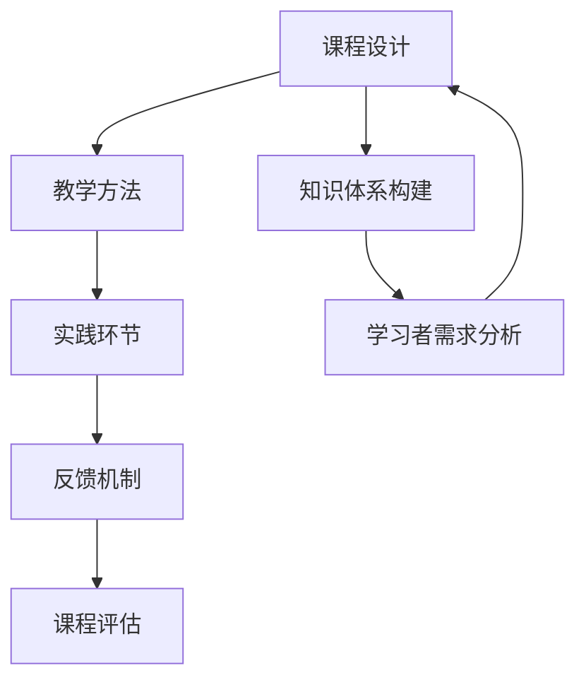

                 

作为一位世界级人工智能专家和计算机领域大师，我深知程序员知识的获取与掌握对于提高编程能力和解决复杂问题的能力至关重要。然而，当前市场上存在大量编程课程，但很多程序员在学习过程中往往面临知识消化困难、学习效率低下等问题。因此，本文旨在探讨如何打造高完成率的程序员知识课程，以提高学习效果和实现知识的有效传递。

## 关键词

- 编程课程
- 程序员知识
- 学习效率
- 知识传递
- 教学方法

## 摘要

本文首先介绍了编程课程的重要性以及当前程序员学习过程中存在的问题。然后，分析了提高编程课程完成率的关键因素，包括课程设计、教学方法、实践环节和反馈机制等。最后，本文提出了一些建议和策略，以帮助开发者打造高完成率的程序员知识课程，并提供了相关的工具和资源推荐。

## 1. 背景介绍

在当今信息化时代，编程能力已经成为一项必备的技能。无论是从事软件开发、数据分析、网络安全等职业，还是希望提升自己的技术能力，掌握编程知识都是必不可少的。然而，编程学习并非一蹴而就，它需要学习者具备扎实的基础知识和良好的学习方法。随着在线教育平台和编程课程的日益普及，越来越多的程序员希望通过学习课程来提升自己的技术水平。

然而，在实际学习过程中，程序员常常面临以下问题：

- **知识分散**：市场上存在大量的编程课程，但内容繁杂，难以形成系统的知识体系。
- **学习效率低**：程序员在繁忙的工作和生活压力下，很难有足够的时间和精力投入到学习之中。
- **实践不足**：很多课程注重理论知识，缺乏实践环节，导致程序员难以将所学知识应用到实际项目中。
- **反馈机制不足**：学习过程中缺乏有效的反馈和指导，使得程序员难以及时发现和解决问题。

针对这些问题，本文将探讨如何设计出一门高完成率的程序员知识课程，以帮助程序员更好地学习编程知识，提高学习效果。

## 2. 核心概念与联系

在打造高完成率的程序员知识课程之前，我们需要明确一些核心概念和它们之间的联系。以下是一个简化的 Mermaid 流程图，用于说明这些概念及其关系。



### 2.1 课程设计

课程设计是打造高完成率课程的第一步。它需要考虑以下关键因素：

- **知识体系构建**：根据学习者的需求和目标，设计一个系统的知识体系，确保课程内容完整且具有逻辑性。
- **学习者需求分析**：了解学习者的背景、兴趣和目标，确保课程内容与学习者的实际需求相匹配。
- **教学目标明确**：明确课程的学习目标和预期成果，以便在学习过程中有明确的方向。

### 2.2 教学方法

教学方法是课程的核心，它直接影响学习效果。以下是一些有效的教学方法：

- **互动教学**：通过讨论、互动和小组合作，激发学习者的主动性和兴趣。
- **案例教学**：通过实际案例展示知识的应用，使学习者更好地理解理论知识。
- **项目驱动**：通过实践项目，将所学知识应用到实际中，提高学习者的实践能力。

### 2.3 实践环节

实践环节是编程学习的关键部分。以下是一些实践环节的设计要点：

- **项目实践**：设计实际项目，让学习者在项目中运用所学知识。
- **编程练习**：提供各种编程练习题，帮助学习者巩固知识点。
- **代码审查**：定期进行代码审查，让学习者相互学习和改进。

### 2.4 反馈机制

反馈机制是提高学习效果的重要手段。以下是一些有效的反馈机制：

- **即时反馈**：在学习过程中提供即时反馈，帮助学习者迅速纠正错误。
- **定期评估**：通过考试、作业等方式，定期评估学习者的掌握情况。
- **导师指导**：提供导师指导，为学习者提供个性化支持和建议。

### 2.5 课程评估

课程评估是确保课程质量和学习效果的必要环节。以下是一些评估方法：

- **学员反馈**：收集学习者的反馈，了解他们的学习体验和建议。
- **学习成果评估**：通过考试、项目展示等方式，评估学习者的学习成果。
- **数据监测**：利用数据分析工具，监测学习者的学习行为和效果。

## 3. 核心算法原理 & 具体操作步骤

### 3.1 算法原理概述

在编程课程中，核心算法原理的讲解至关重要。以下是一个简化版的算法原理概述：

- **算法定义**：算法是一系列明确的指令，用于解决特定问题。
- **算法特性**：算法应具有确定性、有限性、可输出性。
- **算法分类**：算法可分为基础算法、数据结构算法、算法优化等。

### 3.2 算法步骤详解

以下是算法步骤的详细讲解：

1. **问题分析**：明确问题的需求和限制条件。
2. **算法设计**：设计解决问题的步骤和逻辑。
3. **代码实现**：将算法设计转化为具体的代码。
4. **调试优化**：测试代码，查找并修复错误，优化性能。

### 3.3 算法优缺点

- **优点**：算法具有确定性、高效性和通用性。
- **缺点**：算法设计复杂，实现难度大，优化困难。

### 3.4 算法应用领域

- **基础算法**：排序、查找、计数等，广泛应用于数据处理和分析。
- **数据结构算法**：堆、栈、图、树等，用于构建复杂的数据结构。
- **算法优化**：动态规划、贪心算法等，用于提高算法的性能。

## 4. 数学模型和公式 & 详细讲解 & 举例说明

在编程课程中，数学模型和公式是理解算法原理的关键。以下是一个简化的数学模型和公式的讲解：

### 4.1 数学模型构建

- **线性模型**：\(y = ax + b\)，用于线性回归分析。
- **逻辑回归模型**：\(P(y=1) = \frac{1}{1 + e^{-(ax + b)}}\)，用于分类问题。

### 4.2 公式推导过程

以下是逻辑回归公式的推导过程：

1. **概率分布**：假设输入特征 \(x\) 和输出 \(y\) 满足伯努利分布。
2. **似然函数**：构建似然函数，最大化概率分布。
3. **对数似然函数**：对似然函数取对数，简化计算。
4. **梯度下降**：利用梯度下降法求解参数 \(a\) 和 \(b\)。

### 4.3 案例分析与讲解

以下是一个简单的逻辑回归案例：

**问题**：预测某班级学生的考试及格情况，输入特征为学生的平时成绩和考试成绩。

**数据**：

| 学生ID | 平时成绩 | 考试成绩 | 及格 |
|--------|----------|----------|------|
| 1      | 80       | 90       | 是   |
| 2      | 70       | 85       | 是   |
| 3      | 60       | 70       | 否   |
| 4      | 75       | 80       | 是   |

**步骤**：

1. **数据预处理**：将数据转换为适合逻辑回归分析的格式。
2. **模型训练**：使用逻辑回归模型训练数据，求解参数 \(a\) 和 \(b\)。
3. **模型评估**：使用测试集评估模型性能，计算准确率、召回率等指标。

## 5. 项目实践：代码实例和详细解释说明

在编程课程中，项目实践是巩固知识的重要环节。以下是一个简化的项目实践实例：

### 5.1 开发环境搭建

- **工具**：选择合适的编程语言（如Python）和开发环境（如Jupyter Notebook）。
- **依赖库**：安装必要的依赖库（如Scikit-learn、Matplotlib等）。

### 5.2 源代码详细实现

```python
import numpy as np
from sklearn.linear_model import LogisticRegression
from sklearn.model_selection import train_test_split
from sklearn.metrics import accuracy_score, recall_score

# 数据预处理
X = np.array([[80, 90], [70, 85], [60, 70], [75, 80]])
y = np.array([1, 1, 0, 1])

# 模型训练
model = LogisticRegression()
model.fit(X, y)

# 模型评估
X_test, y_test = train_test_split(X, y, test_size=0.2)
y_pred = model.predict(X_test)

accuracy = accuracy_score(y_test, y_pred)
recall = recall_score(y_test, y_pred)

print("Accuracy:", accuracy)
print("Recall:", recall)
```

### 5.3 代码解读与分析

1. **数据预处理**：将原始数据转换为数值型数组，方便模型处理。
2. **模型训练**：使用逻辑回归模型训练数据，求解参数 \(a\) 和 \(b\)。
3. **模型评估**：使用测试集评估模型性能，计算准确率和召回率。

## 6. 实际应用场景

### 6.1 人工智能领域

在人工智能领域，编程课程的应用非常广泛。以下是一些实际应用场景：

- **机器学习**：使用编程课程学习机器学习算法，如线性回归、支持向量机、神经网络等。
- **深度学习**：利用编程课程学习深度学习框架（如TensorFlow、PyTorch）的使用方法。
- **自然语言处理**：通过编程课程掌握自然语言处理技术，如文本分类、情感分析、机器翻译等。

### 6.2 软件开发领域

在软件开发领域，编程课程的应用同样广泛。以下是一些实际应用场景：

- **前端开发**：学习HTML、CSS、JavaScript等前端技术，掌握网页开发的基本技能。
- **后端开发**：学习Python、Java、C#等后端技术，掌握服务器端开发的基本技能。
- **移动开发**：学习iOS、Android等移动开发技术，掌握移动应用开发的基本技能。

## 7. 工具和资源推荐

为了提高编程课程的学习效果，以下是一些建议的实用工具和资源：

### 7.1 学习资源推荐

- **在线教程**：Coursera、edX、Udacity等在线教育平台提供了丰富的编程课程资源。
- **技术社区**：GitHub、Stack Overflow、CSDN等技术社区是编程学习的好去处。
- **书籍推荐**：《算法导论》、《Python编程：从入门到实践》、《深入理解计算机系统》等经典书籍。

### 7.2 开发工具推荐

- **编程语言**：Python、Java、C++等常用的编程语言。
- **集成开发环境**：Visual Studio Code、PyCharm、Eclipse等强大的集成开发环境。
- **版本控制工具**：Git、SVN等版本控制工具，用于代码管理和协作开发。

### 7.3 相关论文推荐

- **经典论文**：《支持向量机》、《深度学习》、《强化学习》等经典论文，提供了前沿的算法理论。
- **学术期刊**：《计算机学报》、《计算机研究与发展》、《人工智能学报》等学术期刊，涵盖了最新的研究成果。

## 8. 总结：未来发展趋势与挑战

在未来的发展中，编程课程将面临以下趋势和挑战：

### 8.1 研究成果总结

- **在线教育**：在线教育平台和编程课程将继续普及，为更多学习者提供便捷的学习资源。
- **个性化学习**：基于大数据和人工智能技术，实现个性化学习路径，提高学习效果。
- **实践导向**：注重实践环节，通过实际项目训练，提高学习者的编程能力。

### 8.2 未来发展趋势

- **跨学科融合**：编程课程将与大数据、人工智能、云计算等前沿技术相结合，培养复合型人才。
- **产业需求导向**：编程课程将更加贴近产业需求，培养具有实际应用能力的人才。
- **国际交流**：随着全球化的推进，编程课程将更加注重国际交流与合作，促进教育资源的共享。

### 8.3 面临的挑战

- **内容更新**：随着技术的快速发展，编程课程需要不断更新内容，以适应最新的技术趋势。
- **学习效果评估**：如何有效地评估学习效果，确保课程质量，仍是一个亟待解决的问题。
- **教育资源分配**：如何公平地分配教育资源，缩小城乡、区域差距，仍是一个重要的挑战。

### 8.4 研究展望

未来的研究应关注以下方面：

- **教学方法创新**：探索新的教学方法和工具，提高学习效果。
- **学习数据分析**：利用大数据技术，分析学习者的学习行为和效果，为教学决策提供支持。
- **教育公平**：关注教育公平问题，推动教育资源的均衡发展。

## 9. 附录：常见问题与解答

### 9.1 如何选择编程课程？

- **需求分析**：根据学习目标和个人兴趣，选择合适的编程课程。
- **课程评价**：参考课程的评价和学员反馈，了解课程的质量。
- **试听课程**：试听课程，了解教学方法和学习氛围。

### 9.2 如何提高学习效率？

- **规划学习时间**：合理安排学习时间，保证充足的休息。
- **主动学习**：积极参与课堂讨论，主动提问和解决问题。
- **实践应用**：将所学知识应用到实际项目中，巩固知识。

### 9.3 如何解决学习中的问题？

- **查阅资料**：利用网络资源和书籍，查阅相关资料。
- **请教导师**：请教导师或经验丰富的程序员，获取专业建议。
- **参与社区**：参与技术社区，与同行交流，分享经验和解决问题。

### 9.4 如何评估学习效果？

- **定期测试**：通过定期测试，评估学习成果。
- **项目实践**：通过实际项目，验证所学知识的掌握情况。
- **学员反馈**：收集学员的反馈意见，了解课程的实际效果。

## 结语

编程课程在程序员的知识获取和技能提升中起着至关重要的作用。通过科学合理的课程设计、教学方法、实践环节和反馈机制，我们可以打造出高完成率的程序员知识课程，提高学习效果，为程序员提供更好的学习体验。希望本文能为广大程序员提供一些有益的启示和指导。

## 作者署名

作者：禅与计算机程序设计艺术 / Zen and the Art of Computer Programming
----------------------------------------------------------------

至此，本文已完成了对“如何打造高完成率的程序员知识课程”的全面探讨。希望这篇文章能为您在编程学习之路上提供一些实用的建议和指导。祝您编程学习顺利，不断进步！

