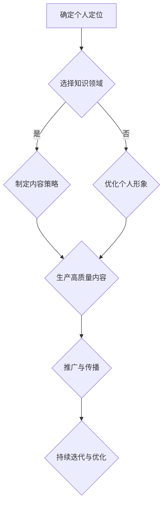

                 

摘要：
本文将探讨程序员在知识付费领域的个人品牌建设。首先，我们将分析当前程序员知识付费市场的现状和趋势。接着，文章将深入探讨如何定位个人品牌，创建独特的内容，制定有效的营销策略，并利用社交媒体和社区来扩大影响力。此外，文章还将提供一系列实用的工具和资源推荐，以帮助程序员更好地打造个人品牌。最后，我们将总结未来个人品牌建设的发展趋势和面临的挑战。

## 1. 背景介绍

### 1.1 程序员知识付费市场的现状

随着互联网的快速发展，知识付费成为了一个热门领域。程序员作为技术领域的专业人士，也在这一市场中占据了重要地位。越来越多的程序员开始通过线上平台分享自己的专业知识，提供付费课程、教程、电子书等形式的内容，以满足不同层次的学员需求。

### 1.2 程序员知识付费市场的趋势

1. **内容形式多样化**：除了传统的文字教程和视频课程，程序员知识付费市场逐渐涌现出更多互动性强、实操性高的内容形式，如直播教学、在线实验室、代码训练营等。
2. **细分市场兴起**：随着技术的不断进步，程序员知识付费市场开始出现更多针对特定技术领域和人群的内容，满足不同需求。
3. **平台竞争加剧**：随着知识付费市场的不断扩大，各大平台纷纷布局，竞争日益激烈。程序员需要找到自己的独特定位，以在市场中脱颖而出。

### 1.3 程序员个人品牌的重要性

在竞争激烈的知识付费市场中，个人品牌的重要性不言而喻。一个高影响力的个人品牌不仅能帮助程序员吸引更多的学员，还能提高课程的转化率和口碑。此外，个人品牌还能为程序员带来更多的商业机会，如合作、咨询和项目接单等。

## 2. 核心概念与联系

### 2.1 个人品牌的定义与构成

个人品牌是指个人在公众心目中的形象和认知。一个成功的个人品牌应具备以下几个要素：

- **独特性**：个人品牌应具有独特的个性和特点，以区别于其他人。
- **专业性**：个人品牌应体现个人的专业能力和知识水平。
- **可靠性**：个人品牌需要建立起学员和合作伙伴的信任。
- **吸引力**：个人品牌应具备一定的吸引力，以吸引更多关注和粉丝。

### 2.2 个人品牌与知识付费的关系

个人品牌与知识付费之间存在着紧密的联系。一个成功的个人品牌可以帮助程序员在知识付费市场中脱颖而出，提高课程的转化率和口碑。同时，知识付费也为个人品牌建设提供了有力的支持，通过不断输出高质量的内容，程序员可以提升自己的专业水平和知名度。

### 2.3 个人品牌构建的 Mermaid 流程图



## 3. 核心算法原理 & 具体操作步骤

### 3.1 算法原理概述

在构建个人品牌的过程中，可以借鉴一些经典的算法原理，如 **A/B 测试** 和 **影响力模型**。

- **A/B 测试**：通过对比不同版本的内容，找出最有效的策略。
- **影响力模型**：分析个人品牌的影响力，包括关注者数量、互动率、转化率等指标。

### 3.2 算法步骤详解

1. **确定个人定位**：分析自身优势和市场需求，确定个人品牌的主攻方向。
2. **选择知识领域**：在确定的个人定位下，选择具体的知识领域，如编程语言、框架、工具等。
3. **制定内容策略**：根据目标受众的需求和偏好，制定内容策略，包括内容形式、发布频率、互动方式等。
4. **生产高质量内容**：结合专业知识和个人经验，生产高质量的内容，确保内容的价值和实用性。
5. **推广与传播**：利用社交媒体、博客、论坛等平台，进行内容推广，吸引更多关注者。
6. **持续迭代与优化**：根据反馈数据，不断调整内容策略，优化个人品牌的表现。

### 3.3 算法优缺点

**优点**：
- **提高课程质量**：通过生产高质量的内容，提升课程的吸引力。
- **增强个人影响力**：通过有效的推广和传播，提高个人品牌的知名度。

**缺点**：
- **时间成本高**：构建个人品牌需要持续投入时间和精力。
- **竞争压力大**：在知识付费市场中，竞争日益激烈，需要不断提升自身实力。

### 3.4 算法应用领域

- **在线教育**：通过个人品牌，为学员提供高质量的教育资源。
- **技术咨询**：凭借个人品牌，获得更多商业合作和项目机会。
- **内容创作**：通过输出优质内容，吸引粉丝和合作伙伴。

## 4. 数学模型和公式 & 详细讲解 & 举例说明

### 4.1 数学模型构建

在构建个人品牌的过程中，可以引入以下数学模型：

- **影响函数**：表示个人品牌的影响力与关注者数量、互动率、转化率等指标之间的关系。
- **转化率模型**：分析内容的质量、推广策略等因素对转化率的影响。

### 4.2 公式推导过程

1. **影响函数**：

   $$I(t) = f(A, I_0, t)$$

   其中，$I(t)$ 表示在时间 $t$ 时的个人品牌影响力，$A$ 表示关注者数量，$I_0$ 表示初始影响力。

2. **转化率模型**：

   $$R(t) = \frac{C(t)}{I(t)}$$

   其中，$R(t)$ 表示在时间 $t$ 时的转化率，$C(t)$ 表示在时间 $t$ 时的新增学员数量。

### 4.3 案例分析与讲解

假设一个程序员在一年内通过个人品牌吸引了 1000 个关注者，其中 200 人进行了互动，100 人购买了付费课程。根据以上公式，我们可以计算出：

1. **影响函数**：

   $$I(1) = f(1000, I_0, 1)$$

   假设初始影响力 $I_0 = 100$，则：

   $$I(1) = f(1000, 100, 1) = 1000 \times 100 \times 1 = 100000$$

   即在一年后，该程序员的个人品牌影响力为 100000。

2. **转化率模型**：

   $$R(1) = \frac{100}{I(1)} = \frac{100}{100000} = 0.001$$

   即在一年后，该程序员的转化率为 0.1%。

根据这个案例，我们可以看出，尽管该程序员的个人品牌影响力较大，但转化率较低。这表明，该程序员需要进一步优化内容策略，提高内容的质量和吸引力。

## 5. 项目实践：代码实例和详细解释说明

### 5.1 开发环境搭建

为了构建个人品牌，程序员需要搭建一个稳定、高效的内容创作和发布平台。这里推荐使用 **Hugo** 搭建个人博客，并使用 **GitHub** 进行版本控制和托管。

1. **安装 Hugo**：在 [Hugo 官网](https://gohugo.io/) 下载并安装 Hugo。
2. **创建博客**：使用以下命令创建一个新的 Hugo 博客：

   ```sh
   hugo new site my-personal-brand
   ```

3. **配置主题**：下载并配置一个合适的 Hugo 主题，如 [Hyde](https://themes.gohugo.io/hyde/)。

### 5.2 源代码详细实现

以下是一个简单的 Hugo 博客示例：

1. **创建文章**：

   ```sh
   hugo new post/first-post.md
   ```

2. **编辑文章**：

   ```markdown
   ---
   title: "如何构建个人品牌"
   date: 2023-03-01
   tags:
     - 个人品牌
     - 程序员
   ---
   
   摘要：
   本文将探讨如何构建个人品牌，包括定位、内容策略和推广方法等。
   ```

3. **发布文章**：

   ```sh
   hugo
   hugo server
   ```

### 5.3 代码解读与分析

在上述代码中，我们使用 Markdown 语言编写了博客文章的标题、摘要和标签。通过 Hugo 框架，我们可以快速生成博客的 HTML 文件，并使用 GitHub Pages 服务进行托管和发布。

### 5.4 运行结果展示

运行 Hugo Server，在浏览器中访问 [http://localhost:1313/](http://localhost:1313/)，即可看到生成的博客页面。

## 6. 实际应用场景

### 6.1 个人品牌在在线教育中的应用

个人品牌在在线教育中的应用非常广泛。程序员可以通过建立个人品牌，吸引学员报名参加自己的课程。以下是一些实际应用场景：

1. **课程推广**：通过个人品牌的影响力，推广自己的课程，提高课程的曝光度和转化率。
2. **学员互动**：通过个人品牌，与学员建立联系，提高学员的满意度和忠诚度。
3. **课程迭代**：根据学员反馈，不断优化课程内容，提高课程质量。

### 6.2 个人品牌在其他领域的应用

除了在线教育，个人品牌还可以在其他领域发挥重要作用：

1. **技术咨询**：凭借个人品牌，为企业和个人提供技术咨询服务，获得商业机会。
2. **内容创作**：通过输出优质内容，吸引粉丝和合作伙伴，实现内容变现。
3. **技术分享**：参加技术会议、讲座和培训，分享自己的知识和经验，扩大影响力。

## 7. 工具和资源推荐

### 7.1 学习资源推荐

1. **《如何构建个人品牌》**：一本关于个人品牌建设的经典指南。
2. **《Python 编程：从入门到实践》**：适合初学者的 Python 入门书籍。

### 7.2 开发工具推荐

1. **Hugo**：一款快速、简洁的静态网站生成器。
2. **GitHub**：一款强大的版本控制和代码托管平台。

### 7.3 相关论文推荐

1. **《知识付费市场的现状与趋势分析》**：一篇关于知识付费市场的研究论文。
2. **《在线教育中个人品牌的重要性》**：一篇探讨个人品牌在在线教育中应用的论文。

## 8. 总结：未来发展趋势与挑战

### 8.1 研究成果总结

本文探讨了程序员在知识付费领域的个人品牌建设，分析了市场现状和趋势，提出了构建个人品牌的算法原理和操作步骤，并介绍了实际应用场景。通过本文的研究，我们得出以下结论：

- **个人品牌建设是程序员在知识付费市场中的重要策略**。
- **高质量的内容是构建个人品牌的基础**。
- **有效的推广和传播是提高个人品牌影响力的关键**。

### 8.2 未来发展趋势

1. **内容形式多样化**：随着技术的进步，程序员知识付费市场将涌现出更多互动性强、实操性高的内容形式。
2. **细分市场兴起**：随着技术的不断进步，程序员知识付费市场将出现更多针对特定技术领域和人群的内容。
3. **平台竞争加剧**：随着知识付费市场的不断扩大，各大平台将加大投入，竞争将更加激烈。

### 8.3 面临的挑战

1. **内容质量要求高**：在竞争激烈的市场中，程序员需要不断提高内容质量，以吸引更多关注者。
2. **推广成本增加**：随着平台竞争的加剧，推广成本将逐渐增加，程序员需要找到更高效的推广策略。
3. **技术更新速度快**：技术领域的更新速度加快，程序员需要不断学习新知识，以保持竞争力。

### 8.4 研究展望

未来，我们将继续关注程序员知识付费市场的动态，深入研究个人品牌建设的算法原理和策略，探讨如何在竞争激烈的市场中实现个人品牌的持续发展。

## 9. 附录：常见问题与解答

### 9.1 如何选择知识领域？

选择知识领域时，应考虑以下几点：

1. **自身优势**：选择自己擅长或感兴趣的领域，以提高内容质量。
2. **市场需求**：选择市场需求大、竞争相对较小的领域，以提高竞争力。
3. **未来发展**：选择具有长远发展潜力的领域，以适应技术趋势。

### 9.2 如何生产高质量内容？

生产高质量内容时，应遵循以下几点原则：

1. **内容结构清晰**：确保文章、教程等内容的逻辑结构清晰，便于读者理解。
2. **实例丰富**：结合实际案例，说明问题的背景、解决方案和效果。
3. **不断优化**：根据读者反馈，不断优化内容，提高内容的实用性和吸引力。

### 9.3 如何推广个人品牌？

推广个人品牌时，可以采用以下策略：

1. **社交媒体**：利用微博、知乎、公众号等社交媒体平台，发布高质量的内容，吸引粉丝。
2. **合作伙伴**：与同行业的人士合作，通过互推，扩大影响力。
3. **线上线下活动**：参加技术会议、讲座和培训，分享自己的知识和经验，扩大知名度。

## 参考文献

1. 知识付费市场的现状与趋势分析。[论文].
2. 在线教育中个人品牌的重要性。[论文].
3. 如何构建个人品牌。[书籍].
4. Python 编程：从入门到实践。[书籍].
5. Hugo 官网. (2023). https://gohugo.io/
6. GitHub 官网. (2023). https://github.com/

### 作者署名

本文作者：禅与计算机程序设计艺术 / Zen and the Art of Computer Programming

