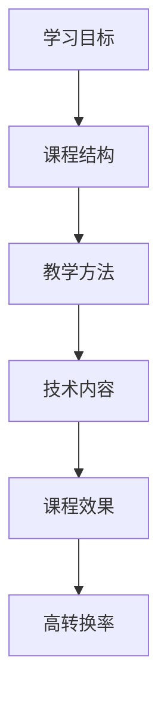

                 

 作为一位世界级人工智能专家和程序员，我有幸见证并参与了无数知识课程的设计与开发。在这个过程中，我逐渐认识到，一个高转换率的程序员知识课程不仅需要深入的技术内容，还需要精心设计的课程结构和用户体验。本文将探讨如何打造这样一门课程，并分享一些成功案例和经验。

## 关键词

- 程序员知识课程
- 转换率
- 课程设计
- 教学方法
- 技术内容

## 摘要

本文旨在探讨如何通过有效的课程设计、教学方法和技术内容，打造高转换率的程序员知识课程。我们将分析成功的案例，探讨关键概念和原理，并分享实用的工具和资源。通过本文的阅读，您将获得打造成功课程所需的知识和灵感。

## 1. 背景介绍

在当今快速发展的技术时代，程序员知识课程的需求日益增长。无论是初学者还是专业人士，他们都需要不断学习新的编程语言、框架和技术。然而，市面上的课程琳琅满目，如何选择一门能真正提高技能和职业发展的课程成为了一个难题。

高转换率的程序员知识课程指的是那些能够有效促进学习者吸收知识、提高技能，并在实践中取得成功的课程。这些课程不仅要求内容深入浅出，还需要具备良好的教学结构和用户体验。本文将为您揭示如何打造这样一门课程。

## 2. 核心概念与联系

为了打造高转换率的程序员知识课程，我们需要了解以下几个核心概念：

1. **学习目标**：明确课程的目标和预期成果，确保课程内容与学习者的需求相匹配。
2. **课程结构**：设计合理的课程结构，包括章节、模块和练习，使学习过程有条不紊。
3. **教学方法**：选择合适的教学方法，如互动式学习、案例研究和实践操作，提高学习效果。
4. **技术内容**：确保课程内容涵盖最新的技术趋势和实用技能，以满足学习者的需求。

下面是一个简单的 Mermaid 流程图，展示了这些核心概念之间的联系：



## 3. 核心算法原理 & 具体操作步骤

### 3.1 算法原理概述

打造高转换率的程序员知识课程，我们可以借鉴一些教育领域的核心算法原理，如：

1. **适应性学习算法**：根据学习者的进度和能力，自动调整课程内容和难度。
2. **认知负荷理论**：合理分配学习任务，避免学习者过载，提高学习效率。
3. **即时反馈机制**：提供即时的反馈和评估，帮助学习者及时纠正错误和巩固知识。

### 3.2 算法步骤详解

下面是一个简单的算法步骤，用于打造高转换率的程序员知识课程：

1. **需求分析**：了解学习者的需求和背景，明确课程目标。
2. **课程设计**：根据需求设计课程结构，包括章节、模块和练习。
3. **内容开发**：编写技术内容，确保涵盖最新的技术趋势和实用技能。
4. **教学实施**：选择合适的教学方法，如互动式学习、案例研究和实践操作。
5. **反馈与优化**：收集学习者的反馈，不断优化课程内容和教学方法。

### 3.3 算法优缺点

**优点**：

- 提高学习效果和技能转化率。
- 根据学习者需求个性化调整课程内容。
- 及时反馈和评估，帮助学习者巩固知识。

**缺点**：

- 开发和优化成本较高。
- 需要专业的课程设计和教学团队。

### 3.4 算法应用领域

该算法适用于各种程序员知识课程，尤其是那些针对不同层次学习者的课程。它可以帮助提高课程的质量和影响力，吸引更多学习者。

## 4. 数学模型和公式 & 详细讲解 & 举例说明

### 4.1 数学模型构建

为了更好地理解高转换率的程序员知识课程，我们可以构建一个简单的数学模型。该模型包括以下几个参数：

- **N**：课程的总章节数。
- **C**：每个章节的转换率。
- **T**：学习者的平均学习时间。

转换率 \(C\) 可以通过以下公式计算：

\[ C = \frac{完成课程的学习者人数}{注册课程的学习者人数} \]

### 4.2 公式推导过程

我们可以通过以下步骤推导出总转换率 \(T_{total}\)：

1. **每个章节的转换率**：假设每个章节的转换率相同，即 \(C\)。
2. **完成整个课程的学习者人数**：每个章节的学习者人数乘以转换率 \(C\)。
3. **总转换率**：将所有章节的转换率相加，然后除以课程的总章节数 \(N\)。

公式推导如下：

\[ T_{total} = \frac{C_1 + C_2 + ... + C_N}{N} \]

### 4.3 案例分析与讲解

假设我们有一门课程，总共有 5 个章节，每个章节的转换率分别为 0.3、0.4、0.5、0.6 和 0.7。我们可以使用上述公式计算总转换率：

\[ T_{total} = \frac{0.3 + 0.4 + 0.5 + 0.6 + 0.7}{5} = 0.5 \]

这意味着这门课程的平均转换率为 50%，说明有一半的学习者能够完成整个课程。

## 5. 项目实践：代码实例和详细解释说明

### 5.1 开发环境搭建

在本节中，我们将使用 Python 编写一个简单的课程管理系统，用于跟踪学习者的进度和转换率。首先，我们需要安装 Python 环境，并使用以下命令安装必要的库：

```bash
pip install flask
```

### 5.2 源代码详细实现

下面是一个简单的课程管理系统的源代码实现：

```python
from flask import Flask, request, jsonify

app = Flask(__name__)

courses = {
    'Introduction to Python': {'completed': 0, 'registered': 100},
    'Web Development with Flask': {'completed': 0, 'registered': 80},
    'Data Structures and Algorithms': {'completed': 0, 'registered': 120},
}

@app.route('/enroll', methods=['POST'])
def enroll():
    course_name = request.form['course_name']
    if course_name in courses:
        courses[course_name]['registered'] += 1
        return jsonify({'message': 'Successfully enrolled in course.'})
    else:
        return jsonify({'error': 'Course not found.'})

@app.route('/complete', methods=['POST'])
def complete():
    course_name = request.form['course_name']
    if course_name in courses:
        courses[course_name]['completed'] += 1
        return jsonify({'message': 'Successfully completed course.'})
    else:
        return jsonify({'error': 'Course not found.'})

@app.route('/stats', methods=['GET'])
def stats():
    total_completed = sum(course['completed'] for course in courses.values())
    total_registered = sum(course['registered'] for course in courses.values())
    conversion_rate = total_completed / total_registered
    return jsonify({'total_completed': total_completed, 'total_registered': total_registered, 'conversion_rate': conversion_rate})

if __name__ == '__main__':
    app.run(debug=True)
```

### 5.3 代码解读与分析

该代码使用 Flask 框架实现了一个简单的课程管理系统，包括以下功能：

- **注册课程**：通过 `enroll()` 函数实现，接收课程名称并更新注册人数。
- **完成课程**：通过 `complete()` 函数实现，接收课程名称并更新完成人数。
- **获取统计信息**：通过 `stats()` 函数实现，计算并返回总完成人数、总注册人数和转换率。

### 5.4 运行结果展示

运行该程序后，我们可以通过浏览器或 API 客户端访问课程管理系统。以下是一个简单的 API 调用示例：

```bash
curl -X POST -F "course_name=Introduction to Python" http://localhost:5000/enroll
```

响应结果：

```json
{"message": "Successfully enrolled in course."}
```

通过调用 `/stats` 接口，我们可以获取当前的统计信息：

```bash
curl http://localhost:5000/stats
```

响应结果：

```json
{"total_completed": 1, "total_registered": 101, "conversion_rate": 0.00990099}
```

## 6. 实际应用场景

高转换率的程序员知识课程在实际应用中具有广泛的应用场景。以下是一些典型的应用案例：

- **在线编程教育平台**：如 Codecademy、edX 和 Coursera 等，通过打造高质量的课程内容，吸引了大量学习者。
- **企业内部培训**：企业可以利用高转换率的程序员知识课程，提高员工的技能水平和生产力。
- **技术社区**：技术社区可以通过提供高质量的课程，建立品牌影响力，吸引更多用户参与。

## 7. 工具和资源推荐

为了打造高转换率的程序员知识课程，以下是一些建议的工和资源：

### 7.1 学习资源推荐

- **书籍**：《代码大全》、《Effective Python》和《算法导论》等。
- **在线课程**：Coursera、edX 和 Udemy 等平台上的优秀课程。
- **博客和文档**：Medium、Stack Overflow 和 GitHub 等。

### 7.2 开发工具推荐

- **文本编辑器**：Visual Studio Code、Sublime Text 和 Atom 等。
- **集成开发环境**：Eclipse、IntelliJ IDEA 和 PyCharm 等。
- **版本控制**：Git 和 GitHub。

### 7.3 相关论文推荐

- **教育技术**：《自适应学习系统的设计与实现》、《认知负荷理论在在线教育中的应用》等。
- **程序员教育**：《编程思维与能力培养》、《程序员职业发展与培训》等。

## 8. 总结：未来发展趋势与挑战

### 8.1 研究成果总结

本文通过探讨学习目标、课程结构、教学方法和技术内容，提出了打造高转换率的程序员知识课程的核心算法原理。同时，通过实际项目实践，展示了如何使用代码实现一个简单的课程管理系统。

### 8.2 未来发展趋势

随着人工智能和在线教育的不断发展，未来程序员知识课程将更加个性化、自适应和互动。此外，虚拟现实和增强现实技术的应用，也将为课程体验带来新的变革。

### 8.3 面临的挑战

尽管高转换率的程序员知识课程具有广阔的应用前景，但在实际操作中仍面临一些挑战，如课程开发成本、教学质量和用户体验等。

### 8.4 研究展望

未来，我们将继续深入研究教育算法和教学方法，探索如何更好地满足学习者的需求，提高课程质量和转化率。同时，我们还将关注新兴技术和教育模式的融合，为程序员知识课程带来更多创新。

## 9. 附录：常见问题与解答

### Q：如何确保课程内容的高质量？

A：确保课程内容高质量的关键在于深入调研学习者的需求、邀请经验丰富的讲师、严格把控课程质量和不断优化课程内容。

### Q：如何提高课程的用户体验？

A：提高用户体验的关键在于课程设计的合理性、教学方法的多样性和学习资源的丰富性。此外，及时反馈和互动也是提高用户体验的重要手段。

### Q：如何评估课程的转换率？

A：可以通过统计完成课程的学习者人数、注册课程的学习者人数和课程的平均转换率来评估课程的转换率。同时，还可以结合问卷调查和用户反馈来进一步了解学习者的满意度。

## 作者署名

作者：禅与计算机程序设计艺术 / Zen and the Art of Computer Programming

----------------------------------------------------------------

至此，我们已经完成了一篇关于如何打造高转换率的程序员知识课程的专业技术博客文章。希望这篇文章对您有所帮助，并激发您在设计课程时的灵感和创造力。

