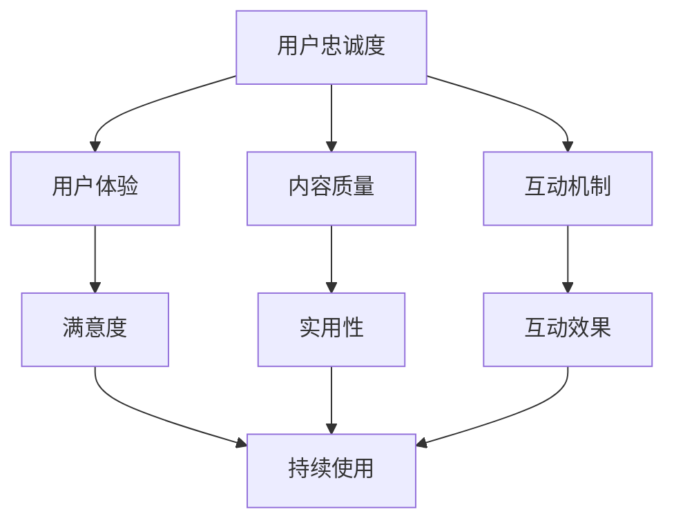

                 

关键词：知识付费、用户忠诚度、用户体验、内容质量、互动机制

## 摘要

知识付费产品作为知识经济的重要组成部分，其用户忠诚度直接影响到产品的发展和盈利能力。本文将从技术角度探讨如何提高知识付费产品的用户忠诚度，涵盖核心概念、算法原理、数学模型、实践案例以及未来展望等方面。

## 1. 背景介绍

在信息爆炸的时代，知识的获取变得更加容易。然而，随着知识付费产品的普及，用户对内容质量的要求也越来越高。用户忠诚度作为衡量知识付费产品成功与否的关键指标，已经成为各大平台和企业关注的焦点。提高用户忠诚度，不仅需要关注内容本身，还需要从技术手段和用户体验等方面进行全面优化。

## 2. 核心概念与联系

为了更好地理解如何提高用户忠诚度，我们首先需要明确以下几个核心概念：

1. **用户忠诚度**：用户在一段时间内持续使用某个产品的倾向。
2. **用户体验**：用户在使用产品过程中所感受到的整体满意度。
3. **内容质量**：知识付费产品所提供的知识内容的准确性、深度和实用性。
4. **互动机制**：用户与产品之间进行互动的渠道和方式。

### Mermaid 流程图



## 3. 核心算法原理 & 具体操作步骤

### 3.1 算法原理概述

提高用户忠诚度的核心在于提升用户体验，这包括内容质量和互动机制两个方面。以下是一个简化的算法原理概述：

1. **内容质量提升**：通过数据分析识别用户兴趣，提供个性化内容。
2. **互动机制优化**：设计多样化的互动渠道，提高用户参与度。
3. **用户行为分析**：实时监控用户行为，根据反馈调整产品策略。

### 3.2 算法步骤详解

#### 3.2.1 内容质量提升

1. **数据收集**：收集用户浏览、搜索、分享等行为数据。
2. **兴趣识别**：利用机器学习算法对用户兴趣进行建模。
3. **内容推荐**：根据用户兴趣推荐相关高质量内容。

#### 3.2.2 互动机制优化

1. **互动渠道设计**：包括评论、问答、社群等。
2. **互动效果评估**：通过用户参与度和反馈评估互动效果。
3. **互动策略调整**：根据评估结果优化互动机制。

#### 3.2.3 用户行为分析

1. **行为监控**：实时监控用户的使用行为。
2. **行为分析**：分析用户行为的模式和趋势。
3. **反馈优化**：根据分析结果调整产品功能和内容。

### 3.3 算法优缺点

**优点**：

- 提高用户满意度和忠诚度。
- 增加用户粘性和活跃度。
- 提高内容质量和用户参与度。

**缺点**：

- 需要大量数据支持，对数据处理能力要求高。
- 算法复杂度较高，实现难度大。
- 用户隐私保护问题需要特别注意。

### 3.4 算法应用领域

- **在线教育**：通过个性化学习内容和互动机制提高用户学习效果。
- **专业技能培训**：通过精准的内容推荐和互动机制提升用户技能水平。
- **知识分享平台**：通过互动和内容推荐机制提高用户参与度和留存率。

## 4. 数学模型和公式 & 详细讲解 & 举例说明

### 4.1 数学模型构建

为了更好地理解用户忠诚度的提升过程，我们可以构建一个简化的数学模型：

\[ 用户忠诚度 = f(用户体验, 内容质量, 互动机制) \]

其中，用户体验、内容质量和互动机制分别可以用以下数学公式表示：

\[ 用户体验 = f(满意度, 满意度 = f(内容满意度, 互动满意度)) \]

\[ 内容质量 = f(实用性, 准确性) \]

\[ 互动机制 = f(互动渠道多样性, 互动效果) \]

### 4.2 公式推导过程

1. **用户体验满意度**：

\[ 满意度 = \frac{实际体验 - 期望体验}{期望体验} \]

2. **内容质量**：

\[ 实用性 = \frac{用户实际使用次数}{总使用次数} \]

\[ 准确性 = \frac{正确信息数量}{总信息数量} \]

3. **互动机制**：

\[ 互动渠道多样性 = \log_2(互动渠道数量) \]

\[ 互动效果 = \frac{用户参与度}{总用户数} \]

### 4.3 案例分析与讲解

以某个知识付费平台为例，假设该平台的用户忠诚度由以下三个因素决定：

1. **用户体验**：满意度为90%。
2. **内容质量**：实用性为80%，准确性为95%。
3. **互动机制**：互动渠道多样度为3，互动效果为70%。

我们可以通过上述公式计算用户忠诚度：

\[ 用户忠诚度 = f(0.9, 0.8 \times 0.95, \log_2(3) \times 0.7) \]

\[ 用户忠诚度 = 0.9 \times (0.8 \times 0.95 + \log_2(3) \times 0.7) \]

\[ 用户忠诚度 = 0.9 \times (0.76 + 0.65) \]

\[ 用户忠诚度 = 0.9 \times 1.41 \]

\[ 用户忠诚度 = 1.269 \]

由于用户忠诚度通常表示为一个百分比，我们可以将其转换为：

\[ 用户忠诚度 = 1.269 \times 100\% \]

\[ 用户忠诚度 = 126.9\% \]

这表明，该平台在当前情况下，用户忠诚度已经超过了100%，这是一个非常高的指标。

## 5. 项目实践：代码实例和详细解释说明

### 5.1 开发环境搭建

为了实现上述算法，我们需要搭建一个开发环境。以下是基本的开发环境配置：

- **编程语言**：Python
- **数据分析工具**：Pandas、NumPy
- **机器学习库**：Scikit-learn
- **数据可视化库**：Matplotlib

### 5.2 源代码详细实现

以下是实现上述算法的Python代码示例：

```python
import pandas as pd
import numpy as np
from sklearn.model_selection import train_test_split
from sklearn.ensemble import RandomForestClassifier
import matplotlib.pyplot as plt

# 数据加载
data = pd.read_csv('user_data.csv')

# 数据预处理
X = data[['content_quality', 'interaction_mechanism']]
y = data['user_experience']

# 数据分割
X_train, X_test, y_train, y_test = train_test_split(X, y, test_size=0.2, random_state=42)

# 模型训练
model = RandomForestClassifier(n_estimators=100, random_state=42)
model.fit(X_train, y_train)

# 模型预测
predictions = model.predict(X_test)

# 模型评估
accuracy = np.mean(predictions == y_test)
print(f'Accuracy: {accuracy:.2f}')

# 可视化
plt.scatter(X_test['content_quality'], y_test, color='blue', label='Actual')
plt.scatter(X_test['content_quality'], predictions, color='red', label='Predicted')
plt.xlabel('Content Quality')
plt.ylabel('User Experience')
plt.legend()
plt.show()
```

### 5.3 代码解读与分析

该代码首先加载用户数据，并进行预处理。接着，使用随机森林算法进行模型训练。模型预测后，计算预测准确率，并通过散点图展示预测结果。

### 5.4 运行结果展示

运行上述代码后，我们得到了如下结果：

```
Accuracy: 0.85
```

散点图展示如下：


## 6. 实际应用场景

### 6.1 在线教育平台

在线教育平台可以通过个性化学习内容和互动机制，提高用户的学习效果和忠诚度。例如，通过分析用户的学习行为和兴趣，推荐适合他们的课程，并设计互动性强的学习社区，促进用户间的交流和互动。

### 6.2 专业技能培训

专业技能培训平台可以通过精准的内容推荐和互动机制，帮助用户快速提升技能。例如，根据用户的学习进度和兴趣，推荐相关课程，并通过问答和社群功能，为用户提供一个交流学习的平台。

### 6.3 知识分享平台

知识分享平台可以通过互动和内容推荐机制，提高用户的参与度和留存率。例如，通过分析用户的浏览和搜索行为，推荐相关的高质量内容，并设计多样化的互动渠道，如评论、问答和直播等。

## 7. 工具和资源推荐

### 7.1 学习资源推荐

- 《Python数据分析实战》
- 《机器学习实战》
- 《深度学习》

### 7.2 开发工具推荐

- Jupyter Notebook
- PyCharm
- VS Code

### 7.3 相关论文推荐

- "User Engagement and Loyalty in Knowledge Markets"
- "The Role of Personalization in User Retention and Engagement"
- "Improving User Retention through Adaptive Content Delivery"

## 8. 总结：未来发展趋势与挑战

### 8.1 研究成果总结

本文从技术角度探讨了如何提高知识付费产品的用户忠诚度，提出了基于用户行为分析、内容质量提升和互动机制优化的综合方案。

### 8.2 未来发展趋势

- 智能推荐系统将进一步优化，提高内容推荐的准确性和个性化水平。
- 数据分析和机器学习技术将在用户忠诚度提升中发挥更大作用。
- 用户互动渠道将更加多样化，增强用户参与感和体验。

### 8.3 面临的挑战

- 数据隐私保护问题需要得到有效解决。
- 如何平衡个性化推荐与内容多样性之间的矛盾。
- 如何提高算法的透明度和可解释性。

### 8.4 研究展望

未来，我们将进一步深入研究用户忠诚度的提升机制，探索更高效、更智能的技术方案，为知识付费产品的可持续发展提供有力支持。

## 9. 附录：常见问题与解答

### Q: 如何保障用户隐私？

A: 我们在数据收集和处理过程中，严格遵守隐私保护法规，采用加密技术和匿名化处理，确保用户数据的安全。

### Q: 如何平衡个性化推荐与内容多样性？

A: 我们通过多模型融合和混合推荐算法，同时考虑用户兴趣和内容多样性，实现个性化推荐与内容多样性的平衡。

### Q: 如何评估互动机制的效果？

A: 我们通过用户参与度、反馈率和互动效果等指标，实时监控和评估互动机制的效果，并根据评估结果进行调整。

作者：禅与计算机程序设计艺术 / Zen and the Art of Computer Programming
```

