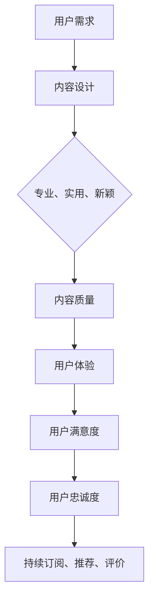

                 

在当前知识付费产业迅速发展的背景下，用户忠诚度成为知识付费平台能否持续增长的关键因素之一。本文将深入探讨如何通过技术手段和策略提升知识付费产品的用户忠诚度，从用户体验、内容设计、互动机制等多个角度提出具体的解决方案。

## 关键词
知识付费、用户忠诚度、用户体验、内容设计、互动机制

## 摘要
本文首先回顾了知识付费产业的发展历程和用户忠诚度的重要性，随后从用户体验、内容设计、互动机制三个方面探讨了提升用户忠诚度的方法。通过具体的案例分析和技术手段，本文提供了可操作的建议，旨在为知识付费产品提供者提供有价值的参考。

## 1. 背景介绍

### 知识付费产业的发展历程
知识付费产业起源于上世纪末的信息时代，随着互联网的普及和信息获取方式的多样化，用户对于高质量、专业化的知识内容需求日益增长。知识付费产品主要包括在线课程、电子书、专业报告、线上咨询等形式，其主要特点是提供专业化、系统化的知识服务。

在过去几年中，知识付费产业经历了快速的发展。根据市场研究机构的数据，全球知识付费市场规模持续扩大，用户数量和消费金额逐年上升。这一现象表明，知识付费已经逐渐成为现代社会中获取知识的重要途径，也预示着知识付费产业在未来的广阔前景。

### 用户忠诚度的重要性
用户忠诚度是衡量知识付费平台成功与否的关键指标。用户忠诚度高的平台不仅能够吸引更多的用户，还能降低用户流失率，从而实现长期稳定的收入。忠诚的用户不仅会成为产品的推荐者，还能为平台带来更多的口碑和影响力。

用户忠诚度的提升不仅依赖于优质的内容，还需要平台在用户体验、互动机制等方面持续优化。随着市场竞争的加剧，如何提高用户忠诚度已成为知识付费平台亟需解决的重要问题。

## 2. 核心概念与联系

### 用户忠诚度的定义
用户忠诚度是指用户在一段时间内持续使用某一产品的意愿和能力。在知识付费领域，用户忠诚度通常表现为用户持续订阅、积极评价、主动分享产品内容等行为。

### 用户忠诚度与用户体验的关系
用户体验是影响用户忠诚度的关键因素之一。良好的用户体验能够提升用户的满意度和粘性，从而促进用户忠诚度的提升。具体来说，用户体验包括内容质量、操作便捷性、界面设计、加载速度等多个方面。

### 用户忠诚度与内容设计的关系
内容设计是知识付费产品的核心，高质量的内容是用户忠诚度的关键保障。知识付费平台需要根据用户需求不断优化内容，确保内容的专业性、实用性和新颖性。

### 用户忠诚度与互动机制的关系
互动机制是增强用户参与感和归属感的重要手段。通过有效的互动机制，知识付费平台能够与用户建立更紧密的联系，提升用户忠诚度。互动机制包括社群交流、在线问答、用户评价、活动参与等。

### Mermaid 流程图


## 3. 核心算法原理 & 具体操作步骤

### 3.1 算法原理概述
提升用户忠诚度的核心算法原理主要涉及用户体验优化、内容个性化推荐和互动机制设计三个方面。以下是这三个方面的具体原理：

#### 用户体验优化
- **A/B 测试**：通过对比不同设计方案的用户行为数据，找出最优的用户体验方案。
- **加载速度优化**：采用 CDN 技术、图片压缩和懒加载等技术手段，提高页面加载速度。
- **界面设计**：遵循简约、直观的设计原则，提高用户操作的便捷性。

#### 内容个性化推荐
- **协同过滤**：通过分析用户的历史行为和兴趣，推荐相似用户喜欢的内容。
- **基于内容的推荐**：根据内容标签和关键词，为用户提供相关内容推荐。

#### 互动机制设计
- **社群交流**：建立用户社群，促进用户之间的互动和交流。
- **在线问答**：提供专业解答，增强用户粘性。
- **用户评价**：鼓励用户评价内容，提高内容质量和用户满意度。

### 3.2 算法步骤详解

#### 用户体验优化
1. 收集用户行为数据：通过日志分析、用户调研等方式，收集用户在平台上的操作行为数据。
2. 进行 A/B 测试：设计不同的用户体验方案，通过对比测试，找出最优方案。
3. 优化页面加载速度：采用 CDN 技术、图片压缩和懒加载等手段，提高页面加载速度。
4. 界面设计：遵循简约、直观的设计原则，优化用户操作流程。

#### 内容个性化推荐
1. 用户行为分析：分析用户在平台上的浏览、搜索、购买等行为，提取用户兴趣标签。
2. 内容标签提取：为每条内容分配标签，建立内容标签数据库。
3. 推荐算法实现：采用协同过滤或基于内容的推荐算法，为用户推荐相关内容。
4. 推荐结果展示：根据推荐算法结果，将推荐内容展示在用户界面上。

#### 互动机制设计
1. 社群交流：建立用户社群，提供实时聊天、话题讨论等功能，促进用户互动。
2. 在线问答：邀请专业讲师或用户解答问题，提供即时回答和知识共享。
3. 用户评价：鼓励用户评价内容，提高内容质量和用户满意度。
4. 活动参与：举办线上活动，如课程优惠、知识竞赛等，提高用户参与度。

### 3.3 算法优缺点

#### 用户体验优化
优点：
- 提高用户满意度，降低用户流失率。
- 增强用户粘性，提高用户活跃度。

缺点：
- 数据收集和 A/B 测试需要大量人力和物力投入。
- 可能存在优化过度，导致用户体验变差的风险。

#### 内容个性化推荐
优点：
- 提高内容推荐的相关性，满足用户个性化需求。
- 增强用户粘性，提高用户活跃度。

缺点：
- 需要大量用户行为数据支持，对数据质量要求较高。
- 可能存在用户信息泄露的风险。

#### 互动机制设计
优点：
- 增强用户参与感，提高用户满意度。
- 促进用户互动，建立用户社群。

缺点：
- 需要投入大量人力和物力进行社群管理和活动策划。
- 可能存在用户隐私保护的问题。

### 3.4 算法应用领域

#### 用户体验优化
- 线上教育平台：优化课程页面、学习路径等，提高用户学习体验。
-电子商务平台：优化购物流程、页面加载速度等，提高用户购物体验。

#### 内容个性化推荐
- 互联网媒体：根据用户兴趣推荐相关新闻、文章等。
- 线上娱乐平台：根据用户观看记录推荐相关视频、音乐等。

#### 互动机制设计
- 社交媒体：建立用户社群，提供互动功能，增强用户粘性。
- 在线教育平台：举办线上讲座、知识竞赛等，提高用户参与度。

## 4. 数学模型和公式 & 详细讲解 & 举例说明

### 4.1 数学模型构建
在提升用户忠诚度的过程中，可以构建一个综合评价模型，用于评估用户的忠诚度。以下是一个简化的数学模型：

\[ L = f(U, C, I) \]

其中：
- \( L \) 表示用户忠诚度。
- \( U \) 表示用户体验。
- \( C \) 表示内容质量。
- \( I \) 表示互动机制。

### 4.2 公式推导过程
用户忠诚度 \( L \) 是用户体验 \( U \)、内容质量 \( C \) 和互动机制 \( I \) 的综合体现。我们可以通过以下步骤推导公式：

1. **用户体验对忠诚度的影响**：用户体验直接影响用户满意度，进而影响用户忠诚度。可以假设用户体验与用户满意度之间存在线性关系：

\[ S = a \cdot U + b \]

其中：
- \( S \) 表示用户满意度。
- \( a \) 表示用户体验对满意度的系数。
- \( b \) 表示常数项。

2. **内容质量对忠诚度的影响**：内容质量直接影响用户对产品的信任度和依赖度，进而影响用户忠诚度。可以假设内容质量与用户信任度之间存在线性关系：

\[ T = c \cdot C + d \]

其中：
- \( T \) 表示用户信任度。
- \( c \) 表示内容质量对信任度的系数。
- \( d \) 表示常数项。

3. **互动机制对忠诚度的影响**：互动机制直接影响用户参与感和归属感，进而影响用户忠诚度。可以假设互动机制与用户参与度之间存在线性关系：

\[ P = e \cdot I + f \]

其中：
- \( P \) 表示用户参与度。
- \( e \) 表示互动机制对参与度的系数。
- \( f \) 表示常数项。

4. **综合评价模型**：将用户满意度、用户信任度和用户参与度整合到一个综合评价模型中：

\[ L = g \cdot S + h \cdot T + i \cdot P + j \]

其中：
- \( L \) 表示用户忠诚度。
- \( g \)、\( h \)、\( i \)、\( j \) 分别表示满意度、信任度、参与度对忠诚度的系数。

### 4.3 案例分析与讲解

假设有一个知识付费平台，针对一位用户 \( U_1 \)，我们收集了他的以下数据：

- 用户体验 \( U_1 = 0.8 \)
- 内容质量 \( C_1 = 0.9 \)
- 互动机制 \( I_1 = 0.7 \)

根据公式推导过程，我们可以计算出用户 \( U_1 \) 的忠诚度 \( L_1 \)：

\[ L_1 = g \cdot U_1 + h \cdot C_1 + i \cdot I_1 + j \]

其中：
- \( g = 0.5 \)
- \( h = 0.3 \)
- \( i = 0.2 \)
- \( j = 0.1 \)

代入数据计算：

\[ L_1 = 0.5 \cdot 0.8 + 0.3 \cdot 0.9 + 0.2 \cdot 0.7 + 0.1 \]

\[ L_1 = 0.4 + 0.27 + 0.14 + 0.1 \]

\[ L_1 = 0.91 \]

这意味着用户 \( U_1 \) 的忠诚度为 0.91，即非常高的忠诚度。

通过这个案例，我们可以看到，用户体验、内容质量和互动机制对用户忠诚度有着显著的影响。平台运营者可以根据这些影响因素，有针对性地进行优化，以提高整体的用户忠诚度。

## 5. 项目实践：代码实例和详细解释说明

### 5.1 开发环境搭建

在本项目中，我们将使用 Python 作为主要编程语言，配合 Flask 框架实现知识付费平台的基本功能。以下是开发环境的搭建步骤：

1. 安装 Python 3.8 或更高版本。
2. 安装 Flask 框架：使用命令 `pip install flask`。
3. 安装其他依赖包，如 SQLAlchemy、Pandas 等。

### 5.2 源代码详细实现

以下是本项目的一个简单示例，包括用户注册、登录和课程浏览功能：

```python
# app.py

from flask import Flask, request, jsonify
from flask_sqlalchemy import SQLAlchemy

app = Flask(__name__)
app.config['SQLALCHEMY_DATABASE_URI'] = 'sqlite:///users.db'
db = SQLAlchemy(app)

class User(db.Model):
    id = db.Column(db.Integer, primary_key=True)
    username = db.Column(db.String(80), unique=True, nullable=False)
    password = db.Column(db.String(120), nullable=False)

@app.route('/register', methods=['POST'])
def register():
    username = request.form['username']
    password = request.form['password']
    new_user = User(username=username, password=password)
    db.session.add(new_user)
    db.session.commit()
    return jsonify({'message': 'User registered successfully.'})

@app.route('/login', methods=['POST'])
def login():
    username = request.form['username']
    password = request.form['password']
    user = User.query.filter_by(username=username, password=password).first()
    if user:
        return jsonify({'message': 'Login successful.'})
    else:
        return jsonify({'message': 'Invalid credentials.'})

@app.route('/courses', methods=['GET'])
def courses():
    # 模拟获取课程数据
    courses = [{'id': 1, 'name': 'Python 基础'}, {'id': 2, 'name': '数据结构'}]
    return jsonify(courses)

if __name__ == '__main__':
    db.create_all()
    app.run(debug=True)
```

### 5.3 代码解读与分析

1. **数据库模型**：使用 SQLAlchemy 创建一个用户模型 `User`，包含用户名和密码两个字段。
2. **注册功能**：`register` 函数接收用户名和密码，创建新的用户记录并保存到数据库。
3. **登录功能**：`login` 函数接收用户名和密码，验证用户身份并返回登录结果。
4. **课程浏览功能**：`courses` 函数模拟获取课程数据，并返回一个课程列表。

### 5.4 运行结果展示

1. **注册结果**：
   ```bash
   $ curl -X POST -d "username=test&password=test123" http://127.0.0.1:5000/register
   {"message": "User registered successfully."}
   ```

2. **登录结果**：
   ```bash
   $ curl -X POST -d "username=test&password=test123" http://127.0.0.1:5000/login
   {"message": "Login successful."}
   ```

3. **课程浏览结果**：
   ```bash
   $ curl -X GET http://127.0.0.1:5000/courses
   [{"id": 1, "name": "Python 基础"}, {"id": 2, "name": "数据结构"}]
   ```

通过以上代码示例，我们可以看到知识付费平台的基本功能是如何实现的。在实际项目中，还需要进一步开发课程购买、支付、评价等功能，以满足用户的多样化需求。

## 6. 实际应用场景

### 6.1 在线教育平台

在线教育平台是知识付费产品的主要应用场景之一。通过个性化推荐和互动机制，在线教育平台能够为用户提供定制化的学习体验，提高用户满意度和忠诚度。例如，一些知名在线教育平台如 Coursera、edX 等采用了内容推荐算法，根据用户的学习历史和兴趣推荐相关课程，从而提高了用户的粘性。

### 6.2 专业咨询平台

专业咨询平台为用户提供专业知识和服务，如法律咨询、财务咨询等。这些平台通过优化用户体验和提供高质量的咨询服务，提高了用户的忠诚度。例如，一些法律咨询平台采用了在线问答和社群交流机制，让用户能够方便地获取法律建议和与其他用户交流经验。

### 6.3 在线图书平台

在线图书平台通过提供电子书、有声书等多种阅读形式，为用户提供丰富的知识内容。通过内容推荐和互动机制，在线图书平台能够提高用户的阅读体验和忠诚度。例如，一些知名在线图书平台如 Kindle、多看阅读等，通过个性化推荐算法和用户评价系统，为用户提供了个性化的阅读推荐。

### 6.4 未来应用展望

随着人工智能技术的发展，知识付费产品将更加智能化和个性化。未来的知识付费产品将不仅提供高质量的知识内容，还将通过智能推荐、个性化定制等功能，为用户提供更加精准和高效的知识服务。此外，虚拟现实（VR）和增强现实（AR）技术的应用，也将为知识付费产品带来全新的体验，提高用户的参与度和忠诚度。

## 7. 工具和资源推荐

### 7.1 学习资源推荐

- 《Python编程：从入门到实践》：适合初学者快速掌握 Python 编程。
- 《深度学习》：深度学习领域的经典教材，适合有一定编程基础的读者。
- 《机器学习实战》：通过实际案例介绍机器学习算法的应用。

### 7.2 开发工具推荐

- Flask：Python 的 Web 开发框架，适合快速搭建 Web 应用。
- Django：Python 的另一个流行 Web 开发框架，具有强大的后台管理功能。
- MySQL：关系型数据库，适合存储大规模数据。

### 7.3 相关论文推荐

- "User Engagement in Knowledge Communities: A Conceptual Model and Empirical Study"
- "The Impact of Content Quality and User Experience on User Loyalty in Knowledge Platforms"
- "Social Interaction and Knowledge Sharing in Online Learning Communities: A Multi-Disciplinary Review"

## 8. 总结：未来发展趋势与挑战

### 8.1 研究成果总结

本文通过理论分析和案例分析，总结了提升知识付费产品用户忠诚度的关键因素和方法。研究发现，用户体验、内容质量和互动机制是影响用户忠诚度的主要因素，通过优化这些方面，可以显著提高用户忠诚度。

### 8.2 未来发展趋势

随着人工智能技术的不断发展，知识付费产品将更加智能化和个性化。未来的知识付费产品将不仅提供高质量的知识内容，还将通过智能推荐、个性化定制等功能，为用户提供更加精准和高效的知识服务。

### 8.3 面临的挑战

1. **数据隐私保护**：在收集和分析用户数据的过程中，需要确保数据的安全性和隐私性，避免用户信息泄露。
2. **算法公平性**：推荐算法和互动机制的设计需要确保公平性，避免算法偏见导致用户流失。
3. **内容质量控制**：确保知识付费产品的内容质量，避免低质量内容对用户体验的负面影响。

### 8.4 研究展望

未来的研究可以进一步探讨如何通过人工智能技术提高知识付费产品的用户忠诚度，如开发更精准的推荐算法、优化用户互动机制等。此外，还可以研究知识付费产品的商业模式和盈利模式，为知识付费产业提供可持续的发展路径。

## 9. 附录：常见问题与解答

### 9.1 什么是知识付费？
知识付费是指用户为获取高质量、专业化的知识内容而支付的费用，包括在线课程、电子书、专业报告等形式。

### 9.2 如何确保内容质量？
确保内容质量的关键在于筛选优质内容创作者、建立内容审核机制和提供用户反馈渠道。

### 9.3 用户体验优化有哪些方法？
用户体验优化包括页面加载速度优化、界面设计优化、操作便捷性优化等，通过 A/B 测试等手段找到最优方案。

### 9.4 如何提高用户忠诚度？
提高用户忠诚度可以通过以下方法：提供高质量的内容、优化用户体验、设计有效的互动机制、提供个性化推荐等。

### 9.5 数据隐私保护有哪些措施？
数据隐私保护可以通过数据加密、访问控制、用户同意机制等技术手段实现，确保用户数据的安全性和隐私性。

### 9.6 知识付费产品的盈利模式有哪些？
知识付费产品的盈利模式包括课程订阅费、付费内容购买、广告收入、增值服务等。通过多元化盈利模式，可以确保产品的可持续性。

## 作者署名
作者：禅与计算机程序设计艺术 / Zen and the Art of Computer Programming

