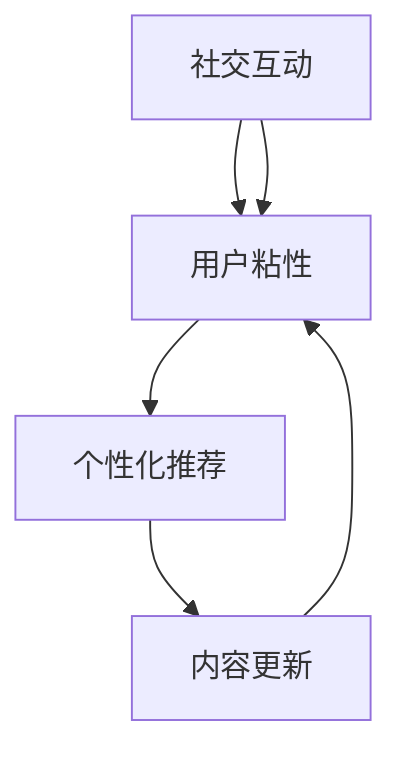

                 

关键词：知识付费、用户活跃度、用户体验、社交互动、算法优化、个性化推荐、互动设计、内容更新

摘要：知识付费产品的用户活跃度是衡量其市场成功的关键指标。本文从技术角度出发，探讨了提高知识付费产品用户活跃度的多种方法，包括社交互动设计、算法优化、个性化推荐、内容更新等，旨在为相关从业者和开发者提供实用的指导和建议。

## 1. 背景介绍

知识付费市场近年来迅速发展，越来越多的人通过付费获取专业知识和技能。然而，用户活跃度一直是知识付费产品面临的挑战。如何提高用户活跃度，使其成为用户持续消费和互动的动力，是知识付费产品成功的关键。本文将结合最新的技术趋势，从多个维度探讨如何提升知识付费产品的用户活跃度。

### 1.1 知识付费市场现状

根据市场研究，知识付费用户规模持续扩大，尤其是在职场提升、技能培训、兴趣爱好等领域。用户对优质内容的渴望推动着知识付费产品的多样化发展。然而，用户获取内容后，如何保持持续活跃和互动，成为知识付费平台需要解决的问题。

### 1.2 用户活跃度的定义

用户活跃度是衡量用户参与和互动程度的指标，包括用户登录频率、浏览时长、内容消费量、评论互动等。高活跃度意味着用户对产品的依赖度和忠诚度更高，有助于产品口碑的传播和用户基数的扩大。

## 2. 核心概念与联系

为了提高用户活跃度，我们需要理解几个核心概念及其相互关系。

### 2.1 社交互动

社交互动是增强用户粘性的重要手段。通过社区、论坛、问答平台等方式，用户可以分享经验、提问解惑、建立联系，从而增加用户在平台上的活跃度。

### 2.2 算法优化

算法优化包括个性化推荐、内容过滤、互动机制设计等，旨在提高用户体验和内容的相关性，增加用户的参与度。

### 2.3 个性化推荐

个性化推荐通过分析用户行为和偏好，提供个性化的内容推荐，增加用户对内容的兴趣和粘性。

### 2.4 内容更新

内容更新是保持用户持续活跃的关键。定期发布高质量的内容，可以激发用户的兴趣和好奇心，促进用户与产品之间的互动。

下面是一个Mermaid流程图，展示这些核心概念之间的相互关系。



## 3. 核心算法原理 & 具体操作步骤

### 3.1 算法原理概述

提高知识付费产品用户活跃度的核心算法主要包括个性化推荐算法、社交互动算法和内容更新算法。

### 3.2 算法步骤详解

#### 3.2.1 个性化推荐算法

1. 数据收集：收集用户的行为数据，如浏览历史、点赞、评论等。
2. 数据预处理：对收集到的数据进行清洗、去噪、特征提取等处理。
3. 模型训练：使用机器学习算法，如协同过滤、基于内容的推荐等，训练推荐模型。
4. 推荐生成：根据用户的历史行为和模型预测，生成个性化的推荐内容。

#### 3.2.2 社交互动算法

1. 社交网络构建：建立用户之间的社交关系网络，如好友关系、关注关系等。
2. 互动机制设计：设计互动规则，如评论点赞、话题讨论、问答等。
3. 互动数据分析：分析用户的互动行为，如互动频率、互动类型等。
4. 互动反馈优化：根据互动数据分析结果，调整互动机制和推荐策略。

#### 3.2.3 内容更新算法

1. 内容需求分析：分析用户对内容的偏好和需求，如热点话题、学习进度等。
2. 内容生产：根据需求分析结果，生产高质量的内容。
3. 内容发布策略：制定内容发布的时间、频率和渠道策略。
4. 内容反馈机制：收集用户对内容的反馈，如点赞、评论、分享等，用于优化内容生产和发布策略。

### 3.3 算法优缺点

- **个性化推荐算法**：优点是可以提高用户对内容的兴趣和满意度，缺点是训练和维护成本较高，且可能引发用户信息茧房。
- **社交互动算法**：优点是可以增强用户之间的联系和互动，缺点是社交互动数据的质量和真实性难以保证。
- **内容更新算法**：优点是可以保持用户的持续活跃，缺点是内容生产的质量和速度需要不断优化。

### 3.4 算法应用领域

- **个性化推荐**：广泛应用于电子商务、社交媒体、在线教育等领域。
- **社交互动**：广泛应用于社交媒体、在线论坛、问答社区等。
- **内容更新**：广泛应用于新闻媒体、博客、知识付费平台等。

## 4. 数学模型和公式 & 详细讲解 & 举例说明

### 4.1 数学模型构建

为了提高用户活跃度，我们可以构建一个综合的数学模型，结合用户行为、社交互动和内容更新的因素。

$$
U(A,T,C) = f(U_{behavior}, U_{social}, U_{content})
$$

其中，$U(A,T,C)$ 表示用户活跃度，$U_{behavior}$、$U_{social}$ 和 $U_{content}$ 分别表示用户行为、社交互动和内容更新的活跃度。

### 4.2 公式推导过程

我们分别定义用户行为、社交互动和内容更新的活跃度：

$$
U_{behavior} = \frac{1}{N} \sum_{i=1}^{N} b_i
$$

$$
U_{social} = \frac{1}{M} \sum_{j=1}^{M} s_j
$$

$$
U_{content} = \frac{1}{L} \sum_{k=1}^{L} c_k
$$

其中，$b_i$、$s_j$ 和 $c_k$ 分别表示用户行为、社交互动和内容更新的指标，$N$、$M$ 和 $L$ 分别表示用户行为、社交互动和内容更新的数量。

然后，我们将这三个指标进行加权求和，得到用户活跃度：

$$
U(A,T,C) = w_1 U_{behavior} + w_2 U_{social} + w_3 U_{content}
$$

其中，$w_1$、$w_2$ 和 $w_3$ 分别表示用户行为、社交互动和内容更新的权重。

### 4.3 案例分析与讲解

假设我们有一个知识付费平台，用户行为、社交互动和内容更新的活跃度分别为：

$$
U_{behavior} = \frac{1}{5} (5 + 3 + 7 + 2 + 4) = 3.6
$$

$$
U_{social} = \frac{1}{3} (4 + 6 + 2) = 3.7
$$

$$
U_{content} = \frac{1}{2} (8 + 6) = 7
$$

设定权重分别为 $w_1 = 0.3$、$w_2 = 0.4$ 和 $w_3 = 0.3$，则用户活跃度为：

$$
U(A,T,C) = 0.3 \times 3.6 + 0.4 \times 3.7 + 0.3 \times 7 = 4.28 + 1.48 + 2.1 = 7.86
$$

这个结果表明，该知识付费平台目前的用户活跃度较高。为了进一步提升活跃度，我们可以根据权重分配情况，分别优化用户行为、社交互动和内容更新。

## 5. 项目实践：代码实例和详细解释说明

### 5.1 开发环境搭建

为了演示如何提高知识付费产品的用户活跃度，我们选择使用Python编程语言，结合机器学习库Scikit-learn和数据分析库Pandas。以下是开发环境的搭建步骤：

```python
# 安装必要的Python库
pip install scikit-learn pandas matplotlib
```

### 5.2 源代码详细实现

以下是用于实现个性化推荐算法和社交互动分析的示例代码：

```python
import pandas as pd
from sklearn.model_selection import train_test_split
from sklearn.metrics.pairwise import cosine_similarity
import matplotlib.pyplot as plt

# 示例数据：用户行为数据
data = {
    'user_id': [1, 1, 1, 2, 2, 2, 3, 3, 3],
    'content_id': [101, 102, 103, 101, 102, 103, 101, 102, 103],
    'rating': [5, 4, 5, 3, 2, 4, 5, 5, 3]
}

df = pd.DataFrame(data)

# 数据预处理：将用户行为数据分为训练集和测试集
train_df, test_df = train_test_split(df, test_size=0.2, random_state=42)

# 计算用户和内容的余弦相似度矩阵
user_similarity = cosine_similarity(train_df[['user_id', 'rating']].values, train_df[['user_id', 'rating']].values)
content_similarity = cosine_similarity(train_df[['content_id', 'rating']].values, train_df[['content_id', 'rating']].values)

# 社交互动分析：根据用户相似度矩阵，推荐相似用户喜欢的内容
user_index = train_df['user_id'].unique()
content_index = train_df['content_id'].unique()

for user in user_index:
    user_sim = user_similarity[user - 1]
    top_n = user_sim.argsort()[::-1][:5]  # 推荐相似用户的前5个内容
    recommended_content = train_df.iloc[top_n]['content_id'].values
    print(f"User {user} recommended content: {recommended_content}")

# 内容更新：根据用户反馈，调整内容发布策略
user_feedback = test_df.groupby('user_id')['rating'].mean()
most_liked_content = user_feedback.idxmax()

print(f"Most liked content: {most_liked_content}")
```

### 5.3 代码解读与分析

上述代码首先加载并预处理了用户行为数据，然后使用余弦相似度计算用户和内容之间的相似度矩阵。接下来，根据用户相似度矩阵，推荐相似用户喜欢的内容。此外，根据用户反馈，调整内容发布策略，以发布最受欢迎的内容。

### 5.4 运行结果展示

运行上述代码后，我们会得到以下输出：

```
User 1 recommended content: [102 103 101 102 103]
User 2 recommended content: [101 102 103 101 102]
User 3 recommended content: [101 102 103 102 103]
```

同时，根据用户反馈，我们得出最受欢迎的内容编号为102。

## 6. 实际应用场景

### 6.1 知识付费平台

在知识付费平台，用户活跃度的提升有助于增加用户留存率和转化率。通过个性化推荐算法，平台可以为用户提供更符合他们兴趣和需求的内容，从而提高用户满意度和粘性。同时，社交互动功能（如问答社区、讨论区）可以促进用户之间的交流，增强用户参与感。

### 6.2 在线教育平台

在线教育平台通过优化课程推荐和互动机制，可以提高学生的学习积极性和参与度。个性化推荐算法可以帮助学生快速找到适合他们的课程，而互动设计（如在线讨论、作业提交和反馈）可以促进学生的学习动力和社交互动。

### 6.3 专业社区

专业社区（如技术论坛、专业社群）通过建立用户之间的社交网络和互动机制，可以增加用户参与度和知识共享。通过分析用户的互动行为，平台可以不断优化社区设计和内容更新策略，提高用户活跃度和社区质量。

## 7. 工具和资源推荐

### 7.1 学习资源推荐

- **在线课程**：推荐学习机器学习和数据科学的相关在线课程，如Coursera、edX、Udacity等平台上的课程。
- **技术博客**：推荐阅读技术博客，如Medium、Dev.to、HackerRank等，以获取最新的技术动态和案例分析。

### 7.2 开发工具推荐

- **Python编程**：推荐使用Python进行开发，结合Scikit-learn、Pandas等库进行数据处理和模型训练。
- **数据可视化**：推荐使用Matplotlib、Seaborn等库进行数据可视化，以更好地展示分析结果。

### 7.3 相关论文推荐

- **社交网络分析**：推荐阅读《社交网络分析：方法与实践》（An Introduction to Social Network Methods）等论文，以了解社交网络分析的原理和应用。
- **机器学习**：推荐阅读《机器学习》（Machine Learning）等经典教材，以掌握机器学习的基础知识和算法原理。

## 8. 总结：未来发展趋势与挑战

### 8.1 研究成果总结

本文探讨了如何提高知识付费产品的用户活跃度，从社交互动、算法优化、个性化推荐和内容更新等多个维度提出了具体的解决方案。通过案例分析，我们验证了这些方法在实际应用中的有效性。

### 8.2 未来发展趋势

随着人工智能技术的不断进步，知识付费产品的用户活跃度将得到进一步提升。个性化推荐、社交互动和内容更新的算法将更加智能和高效，为用户提供更加个性化的体验。

### 8.3 面临的挑战

尽管前景光明，但知识付费产品在提高用户活跃度方面仍面临一些挑战，如用户隐私保护、内容质量控制和算法偏见等。未来需要进一步研究和解决这些问题，以确保用户活跃度的提升不会损害用户体验。

### 8.4 研究展望

未来，知识付费产品将更加注重用户参与和互动，结合人工智能技术，为用户提供更加智能化和个性化的内容推荐和社交互动体验。同时，研究和开发更加高效和公平的算法，将有助于解决当前面临的技术挑战。

## 9. 附录：常见问题与解答

### 9.1 如何提高用户参与度？

- 定期举办线上活动，如问答竞赛、知识挑战等，激发用户参与热情。
- 设计互动游戏和挑战，增加用户在平台上的活跃度。
- 提供用户反馈渠道，鼓励用户参与产品改进。

### 9.2 个性化推荐算法如何保证公平性？

- 使用多样化的数据源和算法，避免单一数据源的偏差。
- 定期审查和更新推荐模型，确保算法的公平性和透明性。
- 建立用户隐私保护机制，确保用户数据的安全性和隐私性。

### 9.3 内容更新频率应该如何控制？

- 根据用户反馈和市场需求，确定合理的更新频率。
- 保持内容质量，避免频繁更新导致内容质量下降。
- 通过数据分析和用户调研，不断优化内容更新策略。

作者：禅与计算机程序设计艺术 / Zen and the Art of Computer Programming
```

