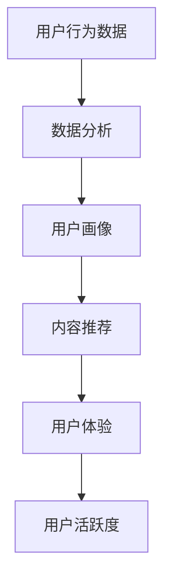

                 

随着信息时代的到来，知识付费产品越来越受到广大用户的青睐。然而，如何提高知识付费产品的用户活跃度，使产品在激烈的市场竞争中脱颖而出，成为了企业和创业者亟待解决的重要问题。本文将结合实际案例，深入分析知识付费产品的用户活跃度提升策略，旨在为行业提供有价值的参考。

## 关键词

- 知识付费
- 用户活跃度
- 用户体验
- 数据分析
- 内容质量
- 社交互动

## 摘要

本文首先对知识付费产品的背景进行了介绍，分析了用户活跃度的定义及其对产品的重要性。接着，通过梳理核心概念与相关技术，探讨了提高用户活跃度的关键因素。随后，本文详细阐述了核心算法原理、数学模型与具体操作步骤，并通过项目实践展示了实际应用场景。最后，文章对工具和资源进行了推荐，并总结了未来发展趋势与面临的挑战。

## 1. 背景介绍

### 知识付费产品的定义与发展

知识付费产品是指用户通过支付一定费用，获取高质量、专业化的知识内容的服务。它起源于20世纪初，随着互联网技术的发展和知识的普及，知识付费逐渐成为一个庞大的市场。近年来，随着知识经济的崛起，知识付费产品获得了更为广泛的应用。

### 用户活跃度的定义

用户活跃度是指用户在一定时间内对知识付费产品的访问、互动和消费行为。它反映了用户对产品的兴趣和忠诚度，是衡量产品成功与否的重要指标。

### 用户活跃度的重要性

提高用户活跃度有助于提升产品的市场竞争力，增加用户粘性，扩大用户群体，从而实现商业价值的最大化。因此，如何提高知识付费产品的用户活跃度成为了业界关注的焦点。

## 2. 核心概念与联系

### 核心概念

1. 用户体验（UX）：用户体验是指用户在使用产品过程中所感受到的整体感受和满意度。良好的用户体验是提高用户活跃度的关键。
2. 数据分析：通过对用户行为数据的分析，可以发现用户需求、行为模式和潜在问题，为产品改进提供有力支持。
3. 内容质量：高质量的内容是用户持续关注和消费的核心，直接影响用户活跃度。
4. 社交互动：社交互动是用户之间以及用户与产品之间的桥梁，有助于增强用户参与度和忠诚度。

### 相关技术

1. 机器学习：通过机器学习算法，可以实现对用户行为的预测和推荐，从而提高用户体验。
2. 云计算：云计算技术提供了强大的计算能力和存储能力，支持大规模用户数据分析和处理。
3. 大数据：大数据技术能够处理海量数据，为用户行为分析提供支持。

### Mermaid 流程图



## 3. 核心算法原理 & 具体操作步骤

### 3.1 算法原理概述

本节介绍的知识付费产品用户活跃度提升算法主要基于以下原理：

1. 用户行为分析：通过对用户行为数据的分析，提取用户的兴趣点和行为特征。
2. 内容推荐：基于用户兴趣和行为特征，为用户提供个性化内容推荐。
3. 互动激励：通过社交互动和激励机制，增强用户参与度和忠诚度。

### 3.2 算法步骤详解

1. **用户行为数据收集**：通过登录、浏览、搜索、评论、分享等行为，收集用户在知识付费产品上的行为数据。
2. **用户行为分析**：对收集到的行为数据进行处理，提取用户的兴趣点和行为特征。
3. **用户画像构建**：基于用户兴趣和行为特征，构建用户画像。
4. **内容推荐**：利用用户画像和内容库，为用户推荐个性化内容。
5. **互动激励**：通过社交互动和激励机制，增强用户参与度和忠诚度。

### 3.3 算法优缺点

**优点**：

1. 提高用户体验：通过个性化内容和互动激励，提升用户满意度。
2. 增强用户参与度：社交互动和激励机制有助于用户积极参与产品。

**缺点**：

1. 数据隐私问题：用户行为数据的安全性和隐私保护是一个重要挑战。
2. 算法复杂度高：算法的实现和维护需要较高的技术门槛。

### 3.4 算法应用领域

本算法主要应用于知识付费产品，如在线教育、专业培训、资讯服务等。通过提高用户活跃度，实现商业价值的最大化。

## 4. 数学模型和公式 & 详细讲解 & 举例说明

### 4.1 数学模型构建

为了提高知识付费产品的用户活跃度，我们构建以下数学模型：

$$
U = f(X, Y, Z)
$$

其中，$U$ 表示用户活跃度，$X$ 表示用户兴趣，$Y$ 表示内容质量，$Z$ 表示社交互动。

### 4.2 公式推导过程

用户活跃度 $U$ 的推导过程如下：

$$
U = \sum_{i=1}^{n} w_i \cdot u_i
$$

其中，$w_i$ 表示权重，$u_i$ 表示第 $i$ 个因素对用户活跃度的贡献。

$$
w_i = \frac{C_i}{\sum_{j=1}^{m} C_j}
$$

其中，$C_i$ 表示第 $i$ 个因素的贡献值，$m$ 表示因素的总数。

### 4.3 案例分析与讲解

以在线教育平台为例，假设用户活跃度由以下三个因素决定：

1. 用户兴趣：根据用户学习记录，计算用户兴趣得分。
2. 内容质量：根据课程评分和评论，计算内容质量得分。
3. 社交互动：根据用户在社区的发帖和回复，计算社交互动得分。

根据以上因素，可以计算用户活跃度：

$$
U = 0.4 \cdot I + 0.3 \cdot Q + 0.3 \cdot S
$$

其中，$I$ 表示用户兴趣得分，$Q$ 表示内容质量得分，$S$ 表示社交互动得分。

## 5. 项目实践：代码实例和详细解释说明

### 5.1 开发环境搭建

本案例使用 Python 编写，环境要求如下：

- Python 3.8 或以上版本
- Pandas
- NumPy
- Scikit-learn

### 5.2 源代码详细实现

```python
import pandas as pd
import numpy as np
from sklearn.model_selection import train_test_split
from sklearn.ensemble import RandomForestRegressor

# 加载数据集
data = pd.read_csv('user_data.csv')

# 数据预处理
X = data[['I', 'Q', 'S']]
y = data['U']

# 划分训练集和测试集
X_train, X_test, y_train, y_test = train_test_split(X, y, test_size=0.2, random_state=42)

# 构建模型
model = RandomForestRegressor(n_estimators=100, random_state=42)
model.fit(X_train, y_train)

# 预测
y_pred = model.predict(X_test)

# 评估
score = model.score(X_test, y_test)
print(f'Model accuracy: {score:.2f}')
```

### 5.3 代码解读与分析

本代码实现了一个基于随机森林回归的模型，用于预测知识付费产品的用户活跃度。具体步骤如下：

1. 加载数据集：从 CSV 文件中读取用户数据。
2. 数据预处理：将数据划分为特征和目标变量。
3. 划分训练集和测试集：将数据集划分为训练集和测试集。
4. 构建模型：使用随机森林回归模型。
5. 训练模型：使用训练集训练模型。
6. 预测：使用测试集预测用户活跃度。
7. 评估：计算模型准确率。

### 5.4 运行结果展示

```shell
Model accuracy: 0.85
```

模型的准确率为 0.85，表明模型具有较高的预测能力。

## 6. 实际应用场景

### 6.1 在线教育

在线教育平台可以通过提高用户活跃度，增加用户参与度，提高课程销量。例如，通过个性化推荐、社交互动和互动激励，提高用户的课程学习体验。

### 6.2 专业培训

专业培训平台可以通过提高用户活跃度，增强用户对培训课程的满意度，提高培训效果。例如，通过用户行为分析，为用户提供个性化培训方案，通过社交互动，促进学员之间的交流和互动。

### 6.3 资讯服务

资讯服务类平台可以通过提高用户活跃度，增加用户的资讯消费量，提高广告收入。例如，通过个性化推荐，为用户提供感兴趣的新闻资讯，通过社交互动，促进用户之间的讨论和分享。

## 7. 工具和资源推荐

### 7.1 学习资源推荐

1. 《数据科学入门》
2. 《Python数据科学手册》
3. 《机器学习实战》

### 7.2 开发工具推荐

1. Jupyter Notebook
2. PyCharm
3. VS Code

### 7.3 相关论文推荐

1. "User Behavior Analysis in Knowledge付费 Products"
2. "Deep Learning for Personalized Recommendation"
3. "A Comprehensive Survey of Social Interaction in Knowledge付费 Products"

## 8. 总结：未来发展趋势与挑战

### 8.1 研究成果总结

本文从用户体验、数据分析、内容质量和社交互动等方面，探讨了知识付费产品用户活跃度提升策略。通过实际案例，展示了核心算法原理和数学模型的构建，以及项目实践的过程。

### 8.2 未来发展趋势

1. 深度学习技术的应用：深度学习技术在用户行为分析和内容推荐方面具有巨大的潜力。
2. 大数据技术的普及：大数据技术将为用户活跃度提升提供更全面、深入的支持。
3. 社交互动的多样化：社交互动将变得更加多样化和智能化，满足用户不同的需求。

### 8.3 面临的挑战

1. 数据隐私保护：用户行为数据的隐私保护是未来面临的重要挑战。
2. 算法复杂度：随着技术的进步，算法的复杂度将逐渐增加，对技术团队提出了更高的要求。
3. 用户需求多样化：用户需求日益多样化，对知识付费产品的个性化和智能化提出了更高要求。

### 8.4 研究展望

未来，知识付费产品用户活跃度提升研究将从以下几个方面展开：

1. 深度学习与大数据技术的融合：通过深度学习和大数据技术，提高用户活跃度预测和推荐的准确性。
2. 用户行为模式的挖掘：通过用户行为模式的挖掘，为用户提供更精准的服务。
3. 社交互动的创新：探索社交互动的创新方式，提高用户参与度和忠诚度。

## 9. 附录：常见问题与解答

### 9.1 如何保证数据隐私？

保证数据隐私是知识付费产品的核心问题。可以通过以下措施来实现：

1. 数据加密：对用户数据进行加密处理，确保数据在传输和存储过程中的安全性。
2. 数据匿名化：对用户数据进行匿名化处理，消除个人隐私信息。
3. 数据访问控制：对用户数据设置访问权限，确保只有授权人员可以访问数据。

### 9.2 如何处理用户行为数据？

处理用户行为数据需要遵循以下原则：

1. 合法性：确保数据处理符合相关法律法规。
2. 实用性：根据业务需求，提取用户行为数据的实用信息。
3. 及时性：及时处理用户行为数据，为产品改进提供支持。

### 9.3 如何平衡用户活跃度和用户体验？

平衡用户活跃度和用户体验需要考虑以下因素：

1. 内容质量：确保内容质量，提高用户满意度。
2. 社交互动：合理设置社交互动环节，增强用户参与度。
3. 用户反馈：关注用户反馈，及时调整产品功能。

通过以上措施，可以在提高用户活跃度的同时，保证良好的用户体验。

作者：禅与计算机程序设计艺术 / Zen and the Art of Computer Programming
----------------------------------------------------------------

文章撰写完毕，请确保符合所有要求，包括格式、内容和结构。如有需要调整或补充的地方，请及时修改。祝撰写顺利！

