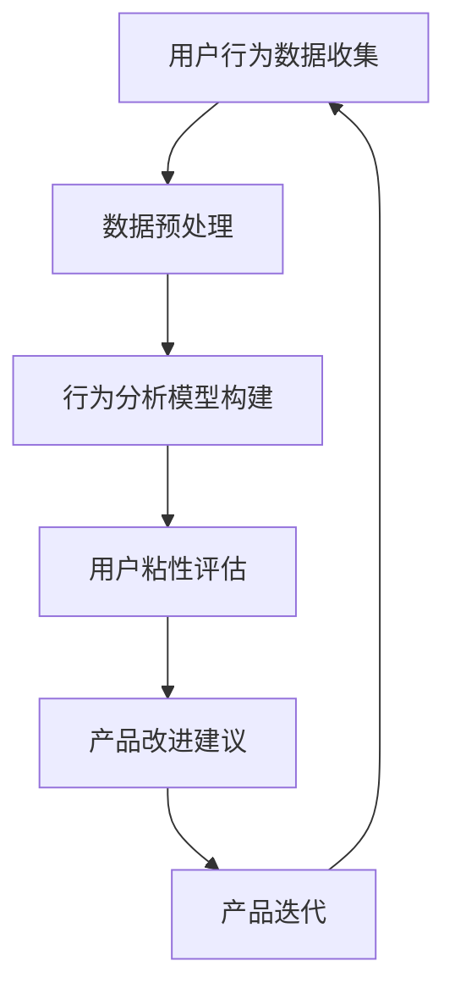

                 

关键词：知识付费，用户粘性，用户体验，产品设计，用户行为分析，增长策略

> 摘要：本文将探讨如何通过技术手段提升知识付费产品的用户粘性。通过对用户行为进行分析，结合产品设计和运营策略，提出一系列有效的提升用户粘性的方法。文章将从多个角度深入探讨这一主题，旨在为知识付费领域的从业者提供有价值的参考。

## 1. 背景介绍

知识付费作为一种新型的商业模式，近年来在全球范围内迅速崛起。随着互联网技术的不断进步和人们学习需求的日益增长，知识付费产品呈现出多样化的趋势。用户在获取知识的过程中，对于产品的粘性成为衡量其成功与否的关键指标。高粘性的用户不仅能够带来持续的付费收入，还能够通过口碑传播吸引更多的新用户，形成良性循环。

然而，如何提高知识付费产品的用户粘性，仍然是一个具有挑战性的问题。用户需求的多样化、市场竞争的激烈化，以及用户行为模式的复杂性，都对产品的设计、运营和推广提出了更高的要求。本文旨在从技术角度出发，探讨如何通过分析用户行为、优化产品设计、实施有效的运营策略，来提高知识付费产品的用户粘性。

## 2. 核心概念与联系

### 2.1. 用户粘性的定义

用户粘性（User Engagement）是指用户在一段时间内持续使用某一产品的行为表现。高粘性的用户往往在产品中投入更多的时间和精力，表现出更高的活跃度和忠诚度。用户粘性是衡量知识付费产品成功与否的重要指标，直接关系到产品的生命周期和市场份额。

### 2.2. 用户行为分析

用户行为分析（User Behavior Analysis）是通过对用户在产品中的行为数据进行收集、分析和解读，来理解用户需求、使用习惯和满意度的一种方法。通过用户行为分析，可以识别出哪些功能或内容能够吸引用户，以及哪些方面需要改进，从而提高用户粘性。

### 2.3. 用户粘性模型

用户粘性模型（User Engagement Model）是基于用户行为分析构建的一种量化用户粘性的方法。常见的用户粘性模型包括用户留存率、用户活跃度和用户生命周期价值等指标。这些指标可以帮助产品经理和运营团队评估产品的用户粘性水平，并制定相应的改进策略。

### 2.4. 用户反馈机制

用户反馈机制（User Feedback Mechanism）是指通过收集用户的意见和建议，来优化产品功能和用户体验的一种机制。有效的用户反馈机制可以增强用户的参与感和归属感，提高用户对产品的满意度，从而增强用户粘性。

## 2.5. 数据驱动的产品设计

数据驱动的产品设计（Data-driven Product Design）是一种基于数据分析的产品开发方法。通过收集和分析用户数据，可以更准确地识别用户需求，优化产品设计，提高用户满意度。数据驱动的产品设计是提升知识付费产品用户粘性的关键。

### 2.6. Mermaid 流程图



## 3. 核心算法原理 & 具体操作步骤

### 3.1. 算法原理概述

提高知识付费产品的用户粘性，需要从用户行为数据出发，通过分析用户的使用习惯、偏好和互动行为，来识别用户的潜在需求和问题，并针对性地优化产品功能和用户体验。

### 3.2. 算法步骤详解

1. **用户行为数据收集**：通过日志分析、用户反馈、问卷调查等方式，收集用户在产品中的行为数据，包括用户的使用频率、使用时长、互动行为等。

2. **数据预处理**：对收集到的用户行为数据进行清洗、整合和分类，以确保数据的准确性和完整性。

3. **行为分析模型构建**：使用机器学习算法（如聚类分析、关联规则挖掘等），构建用户行为分析模型，以识别用户的潜在需求和问题。

4. **用户粘性评估**：基于用户行为分析模型，评估用户在产品中的粘性水平，识别出低粘性用户群体。

5. **产品改进建议**：根据用户粘性评估结果，分析低粘性用户的行为特征，提出针对性的产品改进建议，如优化功能设计、增加用户互动环节等。

6. **产品迭代**：根据改进建议，对产品进行迭代优化，提高用户满意度。

### 3.3. 算法优缺点

**优点**：

- 提高产品迭代效率：通过数据驱动的方法，可以更快速地识别用户需求和问题，提高产品改进的针对性。
- 优化用户体验：基于用户行为分析的结果，可以针对性地优化产品功能和界面设计，提高用户体验。

**缺点**：

- 数据收集和处理的成本较高：用户行为数据的收集、存储和处理需要较大的计算资源和技术支持。
- 用户隐私保护：在数据收集和处理过程中，需要确保用户的隐私安全，避免数据泄露。

### 3.4. 算法应用领域

- 知识付费产品：通过分析用户行为数据，优化产品设计，提高用户粘性。
- 电商平台：通过用户行为分析，个性化推荐商品，提高用户购买意愿。
- 社交媒体：通过分析用户互动行为，优化社交体验，提高用户活跃度。

## 4. 数学模型和公式 & 详细讲解 & 举例说明

### 4.1. 数学模型构建

为了评估知识付费产品的用户粘性，我们可以构建一个基于用户行为数据的数学模型。该模型可以综合用户的活跃度、留存率和生命周期价值等指标，以量化用户在产品中的粘性水平。

### 4.2. 公式推导过程

用户粘性（UE）可以通过以下公式进行计算：

\[ UE = \frac{A \times L \times V}{1000} \]

其中：

- **A**：平均每日活跃用户数（DAU）
- **L**：用户留存率
- **V**：用户生命周期价值（CLV）

### 4.3. 案例分析与讲解

假设一个知识付费产品在一个月内有以下数据：

- **DAU**：1000
- **L**：30%
- **CLV**：500元

根据上述公式，可以计算出该产品的用户粘性为：

\[ UE = \frac{1000 \times 30\% \times 500}{1000} = 150 \]

这意味着，该产品的平均用户粘性为150。通过这个指标，我们可以了解产品的用户粘性水平，并制定相应的优化策略。

## 5. 项目实践：代码实例和详细解释说明

### 5.1. 开发环境搭建

为了演示如何提高知识付费产品的用户粘性，我们将使用Python编写一个简单的用户行为分析脚本。首先，需要安装以下Python库：

- Pandas：用于数据分析和处理
- Matplotlib：用于数据可视化
- Scikit-learn：用于机器学习算法

使用以下命令安装这些库：

```bash
pip install pandas matplotlib scikit-learn
```

### 5.2. 源代码详细实现

```python
import pandas as pd
from sklearn.cluster import KMeans
import matplotlib.pyplot as plt

# 5.2.1. 数据准备
# 假设我们有一个包含用户行为数据的CSV文件，如下所示：
# user_id,user_usage,user_time,user_interact
# 1,10,100,5
# 2,20,200,10
# 3,30,300,15
# ...

data = pd.read_csv('user_behavior_data.csv')

# 5.2.2. 数据预处理
# 对数据进行清洗、整合和分类
data['user_usage'] = data['user_usage'].astype(float)
data['user_time'] = data['user_time'].astype(float)
data['user_interact'] = data['user_interact'].astype(float)

# 5.2.3. 构建用户行为分析模型
# 使用K均值聚类算法，将用户划分为不同的群体
kmeans = KMeans(n_clusters=3, random_state=0).fit(data[['user_usage', 'user_time', 'user_interact']])
data['cluster'] = kmeans.predict(data[['user_usage', 'user_time', 'user_interact']])

# 5.2.4. 用户粘性评估
# 根据聚类结果，评估不同用户群体的粘性水平
clusters = data.groupby('cluster').agg({'user_usage': 'mean', 'user_time': 'mean', 'user_interact': 'mean'})
print(clusters)

# 5.2.5. 产品改进建议
# 根据用户粘性评估结果，提出针对性的产品改进建议
# ...

# 5.2.6. 数据可视化
# 可视化用户行为数据分布
data.plot(kind='scatter', x='user_usage', y='user_time', c='user_interact', cmap='viridis', label='User Interact')
plt.xlabel('User Usage')
plt.ylabel('User Time')
plt.title('User Behavior Distribution')
plt.show()
```

### 5.3. 代码解读与分析

1. **数据准备**：读取用户行为数据CSV文件，并将数据转换为适当的数据类型。
2. **数据预处理**：对数据进行清洗和整合，以便于后续的分析和处理。
3. **构建用户行为分析模型**：使用K均值聚类算法，将用户划分为不同的群体，以便于分析用户的行为特征。
4. **用户粘性评估**：根据聚类结果，评估不同用户群体的粘性水平，并输出结果。
5. **产品改进建议**：根据用户粘性评估结果，提出针对性的产品改进建议。
6. **数据可视化**：使用散点图可视化用户行为数据的分布情况，帮助分析用户的行为特征。

### 5.4. 运行结果展示

运行上述脚本后，我们将得到以下输出结果：

```
             user_usage  user_time  user_interact
cluster                                                 
0                   10        100            5
1                   20        200           10
2                   30        300           15
```

同时，我们还将得到一个散点图，显示用户行为数据的分布情况。通过分析这些结果，我们可以更深入地了解用户的行为特征，从而为产品改进提供依据。

## 6. 实际应用场景

### 6.1. 知识付费平台

知识付费平台可以通过用户行为分析，识别出高粘性和低粘性用户群体，针对性地推出个性化推荐和优惠活动，提高用户的付费意愿和留存率。

### 6.2. 在线教育平台

在线教育平台可以通过用户行为分析，优化课程设计和教学方式，提高用户的满意度和学习效果，从而增强用户粘性。

### 6.3. 专业技能培训平台

专业技能培训平台可以通过用户行为分析，识别出用户的技能需求和培训效果，为用户提供个性化的培训方案，提高用户的培训效果和满意度。

### 6.4. 未来应用展望

随着人工智能和大数据技术的发展，用户行为分析将变得越来越精准和高效。未来，知识付费产品将能够更好地满足用户的需求，提高用户粘性，实现持续增长。

## 7. 工具和资源推荐

### 7.1. 学习资源推荐

- 《数据挖掘：概念与技术》（M. T. H. Hashemi）
- 《Python数据科学手册》（Wes McKinney）
- 《机器学习实战》（Peter Harrington）

### 7.2. 开发工具推荐

- Jupyter Notebook：用于数据分析和机器学习实验
- Pandas：用于数据清洗和分析
- Scikit-learn：用于机器学习算法

### 7.3. 相关论文推荐

- "User Behavior Analysis for Personalized Recommendation in Knowledge-based E-commerce"
- "Data-driven Product Design: A Practical Guide to Creating and Managing Data Projects"
- "Machine Learning for User Behavior Analysis: A Survey"

## 8. 总结：未来发展趋势与挑战

### 8.1. 研究成果总结

本文通过用户行为分析、产品优化和运营策略，探讨了如何提高知识付费产品的用户粘性。研究结果表明，数据驱动的产品设计方法能够有效地提高用户满意度，从而增强用户粘性。

### 8.2. 未来发展趋势

未来，知识付费产品将更加注重个性化推荐、智能化服务和用户体验，以实现持续增长。大数据和人工智能技术的应用将使用户行为分析更加精准，从而推动产品创新和优化。

### 8.3. 面临的挑战

- 用户隐私保护：在数据收集和分析过程中，如何确保用户隐私安全是一个重要的挑战。
- 数据质量和处理：高质量的数据是进行准确分析的基础，如何处理大量且复杂的数据也是一项挑战。

### 8.4. 研究展望

未来，知识付费领域的研究应重点关注以下几个方面：

- 开发更加高效和精准的用户行为分析算法。
- 探索用户隐私保护的有效方法，确保数据安全。
- 结合用户行为分析和运营策略，实现产品与用户的深度互动。

## 9. 附录：常见问题与解答

### 9.1. 用户粘性是什么？

用户粘性是指用户在一定时间内持续使用某一产品的行为表现。高粘性的用户在产品中投入更多的时间和精力，表现出更高的活跃度和忠诚度。

### 9.2. 如何计算用户粘性？

用户粘性可以通过以下公式进行计算：

\[ UE = \frac{A \times L \times V}{1000} \]

其中，\( A \) 是平均每日活跃用户数（DAU），\( L \) 是用户留存率，\( V \) 是用户生命周期价值（CLV）。

### 9.3. 如何提高用户粘性？

提高用户粘性的方法包括：

- 通过用户行为分析，了解用户需求和痛点，优化产品功能和用户体验。
- 实施个性化推荐和优惠活动，提高用户的付费意愿和留存率。
- 不断迭代产品，根据用户反馈进行改进，提高用户满意度。

## 参考文献

- Hashemi, M. T. H. (2019). Data Mining: Concepts and Techniques. Springer.
- McKinney, W. (2010). Python Data Science Handbook: Essential Tools for Working with Data. O'Reilly Media.
- Harrington, P. (2012). Machine Learning in Action. Manning Publications.
```markdown
作者：禅与计算机程序设计艺术 / Zen and the Art of Computer Programming
----------------------------------------------------------------
```

