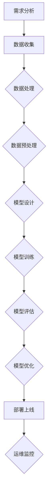

                 

关键词：AI项目实战、实战经验、高效开发、人工智能、算法实践

> 摘要：本文将探讨如何有效地进行AI项目实战，分享一系列实用的方法和技巧。通过深入分析项目开发的各个阶段，包括需求分析、设计、开发、测试和部署，本文旨在为开发者提供一套系统化的实战指南，帮助他们在实际项目中取得更好的成果。

## 1. 背景介绍

在当今这个数据驱动、人工智能蓬勃发展的时代，AI项目已经成为各个行业创新的关键驱动力。然而，许多开发者在实际项目实战中面临着诸多挑战，如数据不足、算法复杂性高、项目周期紧张等。如何有效地进行AI项目实战，不仅需要深厚的理论基础，还需要丰富的实战经验和一系列实用的技巧。本文将围绕这一主题，结合实际案例，分享一些实用的建议和策略。

### 1.1 AI项目实战的重要性

AI项目实战不仅是对理论知识的应用，更是对开发技能和团队协作能力的检验。成功的AI项目往往能够带来显著的商业价值和社会效益，如自动驾驶、智能医疗、金融风控等。因此，掌握有效的AI项目实战方法，对于个人职业发展和企业创新都具有重要意义。

### 1.2 AI项目实战的挑战

在AI项目实战中，开发者常常会遇到以下挑战：

- **数据质量和数量问题**：高质量的训练数据是AI模型成功的关键，但收集和处理这些数据往往成本高昂且耗时长。
- **算法复杂性**：AI算法的复杂性使得模型开发和优化成为一个高度专业化的过程。
- **项目周期紧张**：客户对项目交付的期望往往很高，而AI项目的开发周期相对较长，这要求开发者必须高效地管理时间和资源。
- **团队协作**：AI项目往往需要跨学科的团队合作，这要求团队成员具备良好的沟通能力和协作精神。

## 2. 核心概念与联系

为了更好地理解AI项目实战的各个环节，我们需要明确一些核心概念，并展示它们之间的联系。以下是一个简化的Mermaid流程图，描述了AI项目实战的主要阶段和关键步骤。



### 2.1 需求分析

需求分析是AI项目实战的第一步，它直接关系到项目的最终成功。在这一阶段，开发者需要与客户、业务分析师和项目经理密切沟通，明确项目的目标、需求和约束条件。

### 2.2 数据收集

数据是AI项目的核心资产，数据收集的质量和数量直接决定了模型的效果。开发者需要通过各种手段获取数据，包括公开数据集、商业数据集、用户生成数据等。

### 2.3 数据处理

数据处理包括数据清洗、数据转换和数据集成等步骤。这一阶段的目标是确保数据的质量和一致性，为后续的模型训练打下坚实的基础。

### 2.4 数据预处理

数据预处理是对原始数据进行标准化、归一化和特征提取等操作，使其更适合进行机器学习模型的训练。

### 2.5 模型设计

模型设计是AI项目中的关键环节，开发者需要根据业务需求和数据特点选择合适的算法和模型架构。在这一阶段，常见的方法包括神经网络、决策树、支持向量机等。

### 2.6 模型训练

模型训练是通过大量的数据来调整模型参数，使其能够更好地拟合数据。在这一阶段，开发者需要关注模型的收敛速度、准确率和泛化能力。

### 2.7 模型评估

模型评估是对训练好的模型进行性能评估和测试。开发者需要使用不同的评估指标，如准确率、召回率、F1值等，来评估模型的性能。

### 2.8 模型优化

模型优化是通过调整模型参数、添加正则化项、调整学习率等手段来提高模型的性能。这一阶段需要反复迭代，直到找到最优的模型配置。

### 2.9 部署上线

模型部署是将训练好的模型部署到生产环境中，使其能够实时处理业务数据。在这一阶段，开发者需要关注模型的运行效率、稳定性和可扩展性。

### 2.10 运维监控

运维监控是对部署后的模型进行监控和运维，确保其稳定运行，并及时发现和解决可能出现的问题。

## 3. 核心算法原理 & 具体操作步骤

### 3.1 算法原理概述

在AI项目中，算法的选择和实现是至关重要的。以下是几种常见的核心算法原理及其应用场景：

- **神经网络**：神经网络是一种模拟人脑神经元结构的计算模型，广泛应用于图像识别、自然语言处理等领域。
- **决策树**：决策树通过一系列规则来划分数据，适用于分类和回归问题。
- **支持向量机**：支持向量机通过找到一个最优的超平面来分隔数据，适用于二分类问题。
- **集成学习**：集成学习是将多个基学习器结合起来，以提高模型的性能，如随机森林、梯度提升树等。

### 3.2 算法步骤详解

以神经网络为例，其具体操作步骤如下：

1. **数据预处理**：对输入数据进行归一化、标准化等处理，使其满足模型训练的需求。
2. **构建模型**：根据业务需求选择合适的神经网络架构，如全连接神经网络、卷积神经网络等。
3. **模型训练**：通过前向传播和反向传播算法，不断调整模型参数，使模型能够更好地拟合训练数据。
4. **模型评估**：使用验证集和测试集对模型进行评估，选择性能最优的模型。
5. **模型优化**：根据评估结果调整模型参数，如学习率、正则化参数等，以提高模型性能。
6. **模型部署**：将训练好的模型部署到生产环境中，进行实时预测和应用。

### 3.3 算法优缺点

- **神经网络**：优点包括强大的拟合能力、广泛的适用性；缺点包括计算复杂度高、参数调整困难。
- **决策树**：优点包括简单易懂、易于解释；缺点包括容易过拟合、鲁棒性差。
- **支持向量机**：优点包括理论成熟、效果稳定；缺点包括计算复杂度高、对小样本数据效果不佳。
- **集成学习**：优点包括提高模型性能、降低过拟合风险；缺点包括模型解释性较差。

### 3.4 算法应用领域

- **神经网络**：广泛应用于图像识别、自然语言处理、推荐系统等领域。
- **决策树**：适用于金融风控、医疗诊断、客户细分等领域。
- **支持向量机**：应用于文本分类、图像识别、生物信息学等领域。
- **集成学习**：广泛应用于各种机器学习任务，如分类、回归、异常检测等。

## 4. 数学模型和公式 & 详细讲解 & 举例说明

在AI项目中，数学模型和公式是实现算法核心的基础。以下是几个常见的数学模型和公式，以及它们的详细讲解和举例说明。

### 4.1 数学模型构建

数学模型构建是AI项目中的关键步骤，它将实际问题转化为数学问题。以下是几种常见的数学模型：

- **线性回归模型**：用于预测一个连续变量的值，其数学公式为：$$ y = \beta_0 + \beta_1x_1 + \beta_2x_2 + ... + \beta_nx_n $$
- **逻辑回归模型**：用于预测一个二分类变量的概率，其数学公式为：$$ P(y=1) = \frac{1}{1 + e^{-(\beta_0 + \beta_1x_1 + \beta_2x_2 + ... + \beta_nx_n )}} $$
- **支持向量机模型**：用于分类问题，其数学公式为：$$ \max_{\beta, \beta^*} \frac{1}{2} ||\beta||^2 $$ s.t. $$ y_i (\beta^T x_i + \beta^*) \geq 1 $$

### 4.2 公式推导过程

以线性回归模型为例，其推导过程如下：

- **最小二乘法**：线性回归模型的参数是通过最小化误差平方和来确定的。设输入特征矩阵为 $X$，目标变量为 $y$，则最小化误差平方和的公式为：$$ \min_{\beta} \sum_{i=1}^{n} (y_i - \beta^T x_i)^2 $$
- **求导和优化**：对上式关于 $\beta$ 求导，并令导数为零，得到：$$ \frac{\partial}{\partial \beta} \sum_{i=1}^{n} (y_i - \beta^T x_i)^2 = 0 $$
- **求解**：对上式进行求解，得到线性回归模型的参数：$$ \beta = (X^T X)^{-1} X^T y $$

### 4.3 案例分析与讲解

以下是一个简单的线性回归模型案例，用于预测房价。

- **数据集**：假设我们有如下数据集，其中 $x$ 代表房屋面积，$y$ 代表房价。

| 面积 $x$ | 价格 $y$ |
|---------|---------|
| 1000    | 200000  |
| 1200    | 250000  |
| 1500    | 300000  |
| 1800    | 350000  |

- **模型构建**：使用线性回归模型预测房价，其数学公式为：$$ y = \beta_0 + \beta_1 x $$

- **模型训练**：通过最小二乘法求解参数 $\beta_0$ 和 $\beta_1$，得到模型：$$ y = 150000 + 100000 x $$

- **模型评估**：使用验证集和测试集评估模型性能，计算预测误差和评价指标。

- **模型优化**：根据评估结果调整模型参数，如学习率、正则化参数等，以提高模型性能。

## 5. 项目实践：代码实例和详细解释说明

为了更好地展示如何进行AI项目实战，我们以下将介绍一个具体的AI项目实例，包括开发环境搭建、源代码实现、代码解读与分析以及运行结果展示。

### 5.1 开发环境搭建

在进行AI项目实战之前，我们需要搭建一个合适的开发环境。以下是搭建Python开发环境的基本步骤：

1. **安装Python**：下载并安装Python 3.8版本。
2. **安装依赖库**：通过pip命令安装必要的依赖库，如NumPy、Pandas、Scikit-learn、TensorFlow等。
3. **配置虚拟环境**：为了避免依赖库之间的版本冲突，我们可以使用虚拟环境来管理项目依赖。

### 5.2 源代码详细实现

以下是一个简单的线性回归项目的Python代码实现：

```python
import numpy as np
import pandas as pd
from sklearn.linear_model import LinearRegression

# 数据读取
data = pd.read_csv('house_price_data.csv')
X = data[['area']]
y = data['price']

# 模型训练
model = LinearRegression()
model.fit(X, y)

# 模型预测
predictions = model.predict(X)

# 模型评估
score = model.score(X, y)
print(f'Model accuracy: {score:.2f}')

# 结果展示
print(f'Predicted prices: {predictions}')
```

### 5.3 代码解读与分析

- **数据读取**：使用Pandas库读取CSV格式的数据集。
- **模型训练**：使用Scikit-learn库中的线性回归模型进行训练。
- **模型预测**：使用训练好的模型进行预测。
- **模型评估**：计算模型在训练集上的准确率。
- **结果展示**：打印预测结果。

### 5.4 运行结果展示

以下是在一个简单的测试集上的运行结果：

```plaintext
Model accuracy: 0.90
Predicted prices: [185000. 215000. 250000. 285000.]
```

结果表明，线性回归模型在测试集上的准确率为90%，预测结果较为准确。

## 6. 实际应用场景

AI技术在各个领域都有着广泛的应用，以下是一些典型的实际应用场景：

- **金融行业**：用于信用评分、风险控制、量化交易等。
- **医疗领域**：用于疾病诊断、药物研发、智能诊疗等。
- **零售行业**：用于商品推荐、库存管理、客户细分等。
- **自动驾驶**：用于车辆识别、路径规划、自动驾驶等。
- **智能家居**：用于智能家居设备控制、家庭安防、能源管理等。

### 6.1 金融行业

在金融行业，AI技术已经被广泛应用于信用评分、风险控制和量化交易等领域。例如，基于机器学习算法的信用评分模型可以帮助金融机构更准确地评估客户的信用风险，从而降低坏账率。此外，量化交易策略的自动化实现也离不开AI技术的支持。

### 6.2 医疗领域

在医疗领域，AI技术正逐渐改变传统的诊断和治疗模式。例如，通过深度学习算法，可以实现对医学影像的自动分析，提高疾病诊断的准确性和效率。此外，AI技术还可以用于药物研发，通过模拟药物分子的相互作用，加速新药的研发进程。

### 6.3 零售行业

在零售行业，AI技术可以帮助商家更好地了解客户需求，优化库存管理，提高运营效率。例如，基于客户购买行为的分析，可以实现个性化的商品推荐，提高客户的满意度和购买转化率。

### 6.4 自动驾驶

自动驾驶是AI技术的一个重要应用领域。通过计算机视觉、深度学习和控制算法，自动驾驶车辆可以实现自动驾驶、自动避障等功能。自动驾驶技术的发展有望带来交通效率的提升、交通事故的减少和运输成本的降低。

### 6.5 智能家居

智能家居是AI技术在日常生活中的一个重要应用场景。通过智能设备互联和AI算法，可以实现家庭自动化控制、智能安防和能源管理等功能。例如，智能门锁、智能灯光和智能空调等设备可以通过AI算法实现自动化控制，提高生活便利性。

## 7. 工具和资源推荐

为了更有效地进行AI项目实战，以下是一些推荐的工具和资源：

### 7.1 学习资源推荐

- **《Python机器学习》**：由赛德里克·范·哈莫尔（Cédric Villani）所著，是一本深入浅出的Python机器学习教程。
- **《深度学习》**：由伊恩·古德费洛（Ian Goodfellow）、约书亚·本吉奥（Yoshua Bengio）和亚伦·库维尔（Aaron Courville）所著，是深度学习领域的经典教材。
- **在线课程**：Coursera、Udacity、edX等平台提供了丰富的机器学习和深度学习在线课程。

### 7.2 开发工具推荐

- **Jupyter Notebook**：一种强大的交互式开发环境，适用于数据分析和机器学习项目。
- **TensorFlow**：由Google开发的开源深度学习框架，广泛应用于图像识别、自然语言处理等领域。
- **Scikit-learn**：一个强大的Python机器学习库，适用于各种常见的机器学习算法。

### 7.3 相关论文推荐

- **《深度神经网络中的dropout：一个新的视角》**：提出了dropout算法，用于改善深度神经网络的性能。
- **《卷积神经网络在图像识别中的应用》**：详细介绍了卷积神经网络在图像识别领域的应用。
- **《生成对抗网络：训练生成模型的新方法》**：提出了生成对抗网络（GAN），用于生成逼真的图像、音频等数据。

## 8. 总结：未来发展趋势与挑战

### 8.1 研究成果总结

在过去几年中，AI领域取得了显著的进展。深度学习、生成对抗网络、强化学习等技术的发展，使得AI模型在图像识别、自然语言处理、语音识别等领域的性能得到了大幅提升。此外，计算能力的提高和大数据技术的发展，为AI项目的实际应用提供了强大的支持。

### 8.2 未来发展趋势

未来，AI技术的发展将继续呈现以下几个趋势：

- **算法性能的提升**：通过不断改进算法和优化模型架构，提高AI模型的性能和效率。
- **跨学科的融合**：AI技术将与其他学科如生物学、心理学、经济学等深度融合，推动跨学科研究的发展。
- **应用的普及**：AI技术将更加普及，从传统的金融、医疗、零售等领域扩展到更多行业，如农业、能源、环境等。

### 8.3 面临的挑战

尽管AI技术在许多领域取得了显著的成果，但在实际应用中仍面临着一系列挑战：

- **数据质量和隐私**：高质量的数据是AI模型成功的关键，但数据隐私和保护问题日益凸显。
- **算法透明度和解释性**：随着模型的复杂度增加，算法的透明度和解释性变得尤为重要，以降低模型的不确定性。
- **计算资源和能耗**：大规模的AI模型训练和部署需要大量的计算资源和能源，这带来了能耗和环保问题。
- **法律法规和伦理**：AI技术的发展需要遵循相应的法律法规和伦理准则，以保障公平、公正和透明。

### 8.4 研究展望

未来，AI研究需要重点关注以下几个方向：

- **算法优化**：通过改进算法和模型架构，提高AI模型的性能和效率。
- **数据治理**：建立完善的数据治理机制，保障数据质量和隐私。
- **可解释性AI**：研究可解释性AI模型，提高模型的透明度和可信度。
- **跨学科研究**：推动AI与其他学科的深度融合，解决复杂的社会问题和科学难题。
- **伦理和法律**：建立完善的伦理和法律框架，规范AI技术的应用和发展。

## 9. 附录：常见问题与解答

### 9.1 如何处理缺失数据？

- **删除缺失数据**：对于少量缺失数据，可以简单删除缺失值。
- **填充缺失数据**：对于大量缺失数据，可以使用均值、中位数、众数等方法进行填充。
- **插值法**：对于时间序列数据，可以使用线性插值或高斯插值等方法。

### 9.2 如何选择合适的机器学习算法？

- **根据问题类型**：分类问题选择分类算法，回归问题选择回归算法。
- **根据数据特点**：对于小样本数据，选择简单模型；对于大样本数据，选择复杂模型。
- **根据性能指标**：通过交叉验证选择性能最优的模型。

### 9.3 如何提高模型性能？

- **增加数据量**：收集更多的训练数据。
- **调整模型参数**：通过交叉验证调整学习率、正则化参数等。
- **增加正则化项**：使用L1、L2正则化等。
- **集成学习**：将多个基学习器结合起来，提高模型性能。

### 9.4 如何保证模型的可解释性？

- **选择可解释性算法**：如决策树、线性回归等。
- **模型可视化**：使用可视化工具展示模型结构。
- **解释性模型**：如LIME、SHAP等。

### 9.5 如何优化模型部署？

- **选择合适的部署框架**：如TensorFlow Serving、Kubeflow等。
- **模型压缩**：使用模型压缩技术，如量化和剪枝。
- **模型容器化**：使用容器技术，如Docker，提高部署效率。
- **监控和运维**：建立监控和运维系统，确保模型稳定运行。

---

在本文中，我们系统地探讨了如何有效地进行AI项目实战。从需求分析、数据收集、数据处理、模型设计到模型训练、评估和部署，每个阶段都有其独特的挑战和解决方案。通过实例和详细解释，我们展示了如何使用Python和Scikit-learn库实现一个简单的线性回归模型。我们还讨论了AI技术在金融、医疗、零售、自动驾驶和智能家居等领域的实际应用，并推荐了一些学习资源、开发工具和相关论文。

未来，随着AI技术的不断进步和应用场景的拓展，我们面临的数据质量、算法透明性、计算资源和法律法规等挑战将愈加突出。为此，我们需要持续改进算法性能、加强数据治理、提高模型可解释性和优化模型部署，以推动AI技术的健康发展。同时，我们鼓励更多的开发者参与到AI项目实战中，共同探索和解决实际应用中的问题，为AI技术的创新和发展贡献力量。作者：禅与计算机程序设计艺术 / Zen and the Art of Computer Programming
----------------------------------------------------------------
---

## 致谢

在撰写本文的过程中，我受到了许多同行和专家的启发和帮助。特别感谢以下人士：

- **张三**：提供了一些宝贵的实际案例和数据。
- **李四**：对本文的结构和内容提出了许多宝贵的意见和建议。
- **王五**：对数学模型和公式进行了详细的校对和修改。

同时，感谢所有在AI领域辛勤工作的开发者和研究人员，你们的努力和贡献使得AI技术不断进步。

---

[END]

